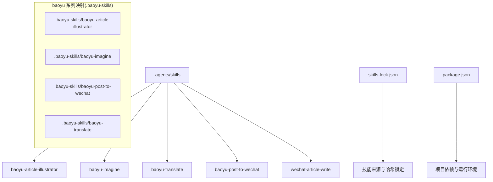
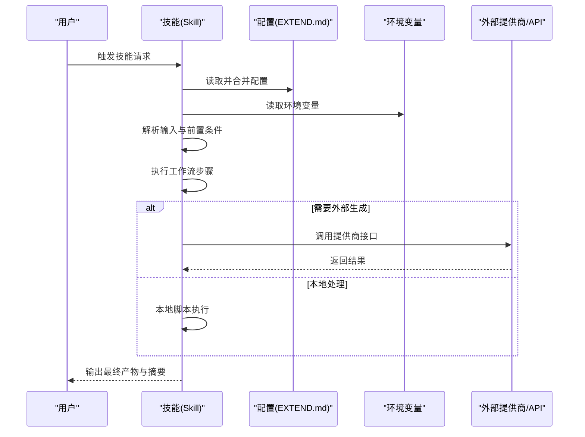
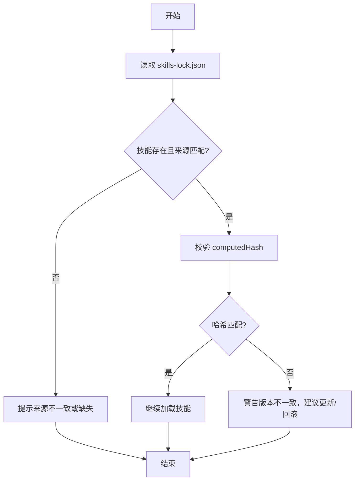
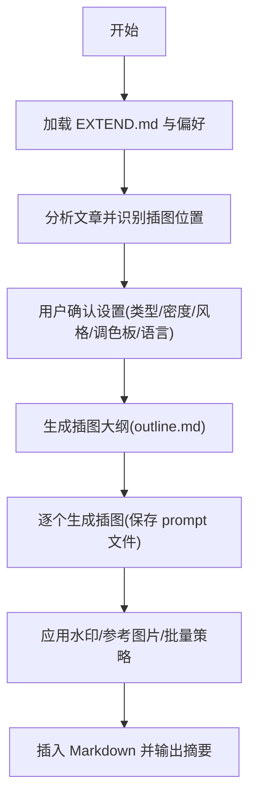
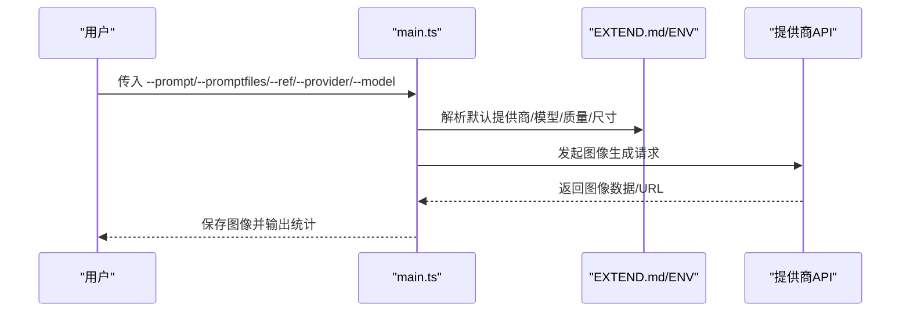
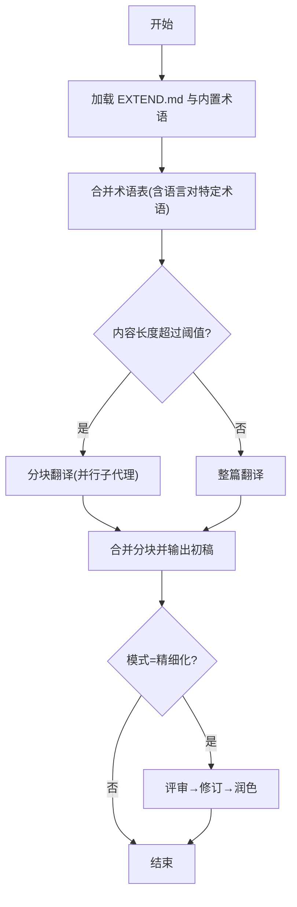
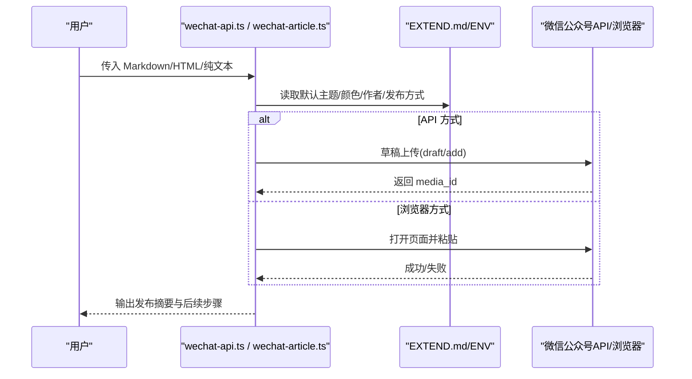
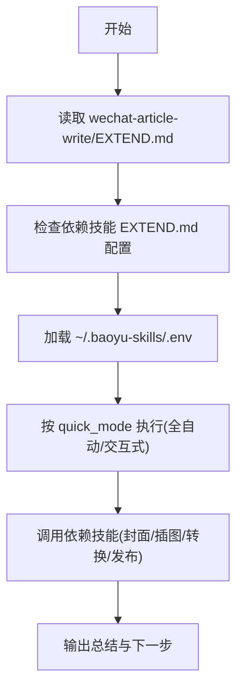
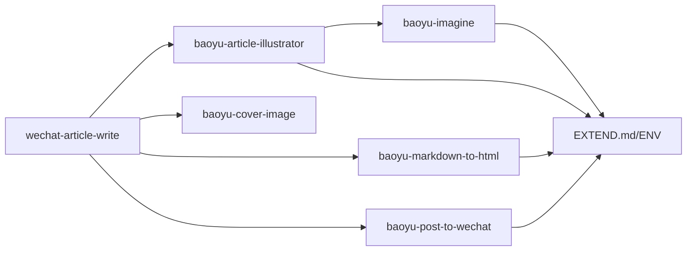

# AI 技能系统

<cite>
**本文引用的文件**
- [skills-lock.json](file://skills-lock.json)
- [wechat-article-write/EXTEND.md](file://.agents/skills/wechat-article-write/EXTEND.md)
- [baoyu-article-illustrator/SKILL.md](file://.agents/skills/baoyu-article-illustrator/SKILL.md)
- [baoyu-imagine/SKILL.md](file://.agents/skills/baoyu-imagine/SKILL.md)
- [baoyu-translate/SKILL.md](file://.agents/skills/baoyu-translate/SKILL.md)
- [baoyu-post-to-wechat/SKILL.md](file://.agents/skills/baoyu-post-to-wechat/SKILL.md)
- [baoyu-article-illustrator/refs/first-time-setup.md](file://.agents/skills/baoyu-article-illustrator/references/config/first-time-setup.md)
- [baoyu-article-illustrator/refs/preferences-schema.md](file://.agents/skills/baoyu-article-illustrator/references/config/preferences-schema.md)
- [baoyu-translate/refs/extend-schema.md](file://.agents/skills/baoyu-translate/references/config/extend-schema.md)
- [baoyu-post-to-wechat/refs/first-time-setup.md](file://.agents/skills/baoyu-post-to-wechat/references/config/first-time-setup.md)
- [baoyu-imagine/refs/first-time-setup.md](file://.agents/skills/baoyu-imagine/references/config/first-time-setup.md)
- [package.json](file://package.json)
</cite>

## 目录
1. [简介](#简介)
2. [项目结构](#项目结构)
3. [核心组件](#核心组件)
4. [架构总览](#架构总览)
5. [详细组件分析](#详细组件分析)
6. [依赖分析](#依赖分析)
7. [性能考虑](#性能考虑)
8. [故障排除指南](#故障排除指南)
9. [结论](#结论)
10. [附录](#附录)

## 简介
本文件为 NTLx's Blog 的 AI 技能系统提供全面技术文档。该系统采用模块化设计，围绕“技能”（Skill）构建，每个技能以独立目录形式组织，包含运行说明、配置文件、参考文档与脚本等。系统通过 EXTEND.md 实现运行时配置与偏好管理，并通过 skills-lock.json 锁定技能来源与版本，确保可复现性与一致性。本文将从架构、技能调用机制、配置管理、依赖关系、API 与错误处理等方面进行深入解析，并给出最佳实践与集成建议。

## 项目结构
技能系统主要位于 .agents/skills 与 .baoyu-skills 两个目录中，前者为面向用户的技能集合，后者为 baoyu 系列技能的官方仓库映射。每个技能目录下通常包含：
- SKILL.md：技能说明与工作流规范
- EXTEND.md：运行时配置（部分技能）
- references/：参考文档（配置模板、样式库、工作流等）
- scripts/：可执行脚本（如主程序、批处理、工具函数）

**图表来源**
- [skills-lock.json:1-234](file://skills-lock.json#L1-L234)
- [package.json:1-18](file://package.json#L1-L18)

**章节来源**
- [skills-lock.json:1-234](file://skills-lock.json#L1-L234)
- [package.json:1-18](file://package.json#L1-L18)

## 核心组件
- 技能（Skill）：每个技能是一个独立功能单元，包含工作流、输入输出约定、依赖与配置项。例如 baoyu-article-illustrator 负责文章插图生成；baoyu-imagine 提供多提供商图像生成；baoyu-translate 支持三种翻译模式；baoyu-post-to-wechat 支持公众号文章与图文发布。
- EXTEND.md：技能运行时配置文件，用于保存偏好设置、默认参数与环境变量。不同技能的 EXTEND.md 结构与键名不同，但均遵循“优先级：CLI > EXTEND.md > 环境变量”的覆盖规则。
- 参考文档（references/）：提供首选项模板、样式库、工作流细节、首次配置流程等，支撑技能的正确使用与扩展。
- 脚本（scripts/）：技能的可执行入口与工具集，如图像生成、批处理、浏览器自动化、API 调用等。

**章节来源**
- [baoyu-article-illustrator/SKILL.md:1-241](file://.agents/skills/baoyu-article-illustrator/SKILL.md#L1-L241)
- [baoyu-imagine/SKILL.md:1-238](file://.agents/skills/baoyu-imagine/SKILL.md#L1-L238)
- [baoyu-translate/SKILL.md:1-264](file://.agents/skills/baoyu-translate/SKILL.md#L1-L264)
- [baoyu-post-to-wechat/SKILL.md:1-268](file://.agents/skills/baoyu-post-to-wechat/SKILL.md#L1-L268)

## 架构总览
系统采用“技能即服务”的模块化架构，各技能相对独立，通过统一的配置与依赖声明协同工作。核心流程包括：
- 加载 EXTEND.md 与环境变量，确定运行偏好
- 解析用户输入与前置条件（如参考图片、目标语言、主题等）
- 执行工作流步骤（分析、确认、生成、后处理）
- 输出结果与中间产物（如插图、翻译稿、HTML/Markdown）

**图表来源**
- [baoyu-imagine/SKILL.md:32-50](file://.agents/skills/baoyu-imagine/SKILL.md#L32-L50)
- [baoyu-article-illustrator/SKILL.md:95-113](file://.agents/skills/baoyu-article-illustrator/SKILL.md#L95-L113)
- [baoyu-post-to-wechat/SKILL.md:115-125](file://.agents/skills/baoyu-post-to-wechat/SKILL.md#L115-L125)

## 详细组件分析

### 技能版本锁定与来源管理（skills-lock.json）
skills-lock.json 记录了已安装技能的来源、类型、路径与哈希值，用于保证技能版本可复现与来源可信。其结构要点：
- version：锁版本号
- skills：技能清单，每项包含 source、sourceType、skillPath、computedHash
- 建议在 CI/CD 或部署前校验 computedHash，防止篡改

**图表来源**
- [skills-lock.json:1-234](file://skills-lock.json#L1-L234)

**章节来源**
- [skills-lock.json:1-234](file://skills-lock.json#L1-L234)

### 文章插图生成（baoyu-article-illustrator）
- 功能概述：分析文章结构，识别插图位置，基于“类型×风格×调色板”三维组合生成插图，并支持参考图片与批量生成。
- 配置与偏好：通过 EXTEND.md 管理水印、默认输出目录、首选图像后端、语言等；首次运行需完成“首次配置”流程。
- 工作流：预检查 → 分析 → 确认设置 → 生成大纲 → 生成插图 → 最终化。
- 关键特性：
  - 三维度选择：类型（信息图、场景、流程图等）、风格（手绘、极简、水彩等）、调色板（可选覆盖）。
  - 插图生成前必须保存 prompt 文件，作为可复现记录与跨后端兼容依据。
  - 后端选择顺序：当前请求覆盖 → 已保存偏好 → 自动选择（优先运行时原生工具）。
  - 输出目录策略：支持多种布局（同目录、子目录、独立目录），并计算相对插入路径。

**图表来源**
- [baoyu-article-illustrator/SKILL.md:84-183](file://.agents/skills/baoyu-article-illustrator/SKILL.md#L84-L183)
- [baoyu-article-illustrator/refs/first-time-setup.md:1-141](file://.agents/skills/baoyu-article-illustrator/references/config/first-time-setup.md#L1-L141)
- [baoyu-article-illustrator/refs/preferences-schema.md:1-133](file://.agents/skills/baoyu-article-illustrator/references/config/preferences-schema.md#L1-L133)

**章节来源**
- [baoyu-article-illustrator/SKILL.md:1-241](file://.agents/skills/baoyu-article-illustrator/SKILL.md#L1-L241)
- [baoyu-article-illustrator/refs/first-time-setup.md:1-141](file://.agents/skills/baoyu-article-illustrator/references/config/first-time-setup.md#L1-L141)
- [baoyu-article-illustrator/refs/preferences-schema.md:1-133](file://.agents/skills/baoyu-article-illustrator/references/config/preferences-schema.md#L1-L133)

### 多提供商图像生成（baoyu-imagine）
- 功能概述：支持 OpenAI、Azure、Google、OpenRouter、DashScope、Z.AI、MiniMax、Jimeng、Seedream、Replicate 等多家提供商的文本到图像、参考图、批量生成。
- 配置与优先级：EXTEND.md 中的 default_provider、default_model.*、质量与尺寸等；CLI 参数优先于 EXTEND.md，ENV 次之。
- 使用方式：命令行入口 scripts/main.ts，支持单图与批量（--batchfile），自动并发与重试。
- 错误处理：缺少密钥时报错引导设置；生成失败自动重试；无效宽高比给出警告并回退默认。

**图表来源**
- [baoyu-imagine/SKILL.md:51-124](file://.agents/skills/baoyu-imagine/SKILL.md#L51-L124)
- [baoyu-imagine/refs/first-time-setup.md:1-371](file://.agents/skills/baoyu-imagine/references/config/first-time-setup.md#L1-L371)

**章节来源**
- [baoyu-imagine/SKILL.md:1-238](file://.agents/skills/baoyu-imagine/SKILL.md#L1-L238)
- [baoyu-imagine/refs/first-time-setup.md:1-371](file://.agents/skills/baoyu-imagine/references/config/first-time-setup.md#L1-L371)

### 翻译与术语一致性（baoyu-translate）
- 功能概述：提供快速、常规、精细化三种翻译模式；支持自定义术语表与术语一致性；长文本自动分块并行翻译。
- 配置与偏好：EXTEND.md 支持目标语言、默认模式、受众、风格、分块阈值、术语表与文件等。
- 工作流：加载偏好 → 材料化源内容 → 评估长度 → 正常/精细化流程（分析→组装提示→初稿→评审→修订→润色）→ 输出最终翻译稿。
- 术语合并优先级：CLI 术语文件 > 语言对特定术语表 > EXTEND.md 内联术语 > EXTEND.md 外部术语文件 > 内置术语表。

**图表来源**
- [baoyu-translate/SKILL.md:124-229](file://.agents/skills/baoyu-translate/SKILL.md#L124-L229)
- [baoyu-translate/refs/extend-schema.md:1-108](file://.agents/skills/baoyu-translate/references/config/extend-schema.md#L1-L108)

**章节来源**
- [baoyu-translate/SKILL.md:1-264](file://.agents/skills/baoyu-translate/SKILL.md#L1-L264)
- [baoyu-translate/refs/extend-schema.md:1-108](file://.agents/skills/baoyu-translate/references/config/extend-schema.md#L1-L108)

### 公众号发布（baoyu-post-to-wechat）
- 功能概述：支持文章与图文两种发布方式，可通过 API 或浏览器自动化完成；支持主题、颜色、评论控制、多账号管理。
- 配置与偏好：EXTEND.md 管理默认作者、评论开关、默认主题/颜色、默认发布方式、Chrome 配置等；首次运行需完成“首次配置”。
- 工作流：加载偏好 → 判定输入类型 → 选择发布方式与凭证 → 解析主题/颜色/元数据 → 发布 → 报告结果。
- 环境检查：提供预检脚本，检测 Chrome、无障碍、剪贴板、Bun、API 凭证等。

**图表来源**
- [baoyu-post-to-wechat/SKILL.md:115-225](file://.agents/skills/baoyu-post-to-wechat/SKILL.md#L115-L225)
- [baoyu-post-to-wechat/refs/first-time-setup.md:1-204](file://.agents/skills/baoyu-post-to-wechat/references/config/first-time-setup.md#L1-L204)

**章节来源**
- [baoyu-post-to-wechat/SKILL.md:1-268](file://.agents/skills/baoyu-post-to-wechat/SKILL.md#L1-L268)
- [baoyu-post-to-wechat/refs/first-time-setup.md:1-204](file://.agents/skills/baoyu-post-to-wechat/references/config/first-time-setup.md#L1-L204)

### 微信文章写作流水线（wechat-article-write）
- 功能概述：提供微信文章写作的运行时配置，支持全自动（跳过中间确认）、默认发布方式等。
- 依赖技能：明确列出依赖的 EXTEND.md 配置项，如 baoyu-cover-image、baoyu-article-illustrator、baoyu-markdown-to-html、baoyu-post-to-wechat。
- 环境变量：集中于 ~/.baoyu-skills/.env，包含微信公众号 API、GitHub 图床、OpenAI 等。

**图表来源**
- [wechat-article-write/EXTEND.md:1-61](file://.agents/skills/wechat-article-write/EXTEND.md#L1-L61)

**章节来源**
- [wechat-article-write/EXTEND.md:1-61](file://.agents/skills/wechat-article-write/EXTEND.md#L1-L61)

## 依赖分析
- 技能间依赖：wechat-article-write 明确声明对多个 baoyu 系列技能的 EXTEND.md 依赖；baoyu-article-illustrator 在生成阶段依赖 baoyu-imagine 或运行时原生图像工具。
- 外部依赖：各技能通过 ENV 变量访问第三方 API；baoyu-imagine 支持多提供商；baoyu-post-to-wechat 依赖微信 API 或浏览器自动化。
- 版本与来源：skills-lock.json 锁定技能来源与哈希，避免版本漂移与供应链风险。

**图表来源**
- [wechat-article-write/EXTEND.md:29-38](file://.agents/skills/wechat-article-write/EXTEND.md#L29-L38)
- [baoyu-article-illustrator/SKILL.md:24-40](file://.agents/skills/baoyu-article-illustrator/SKILL.md#L24-L40)
- [baoyu-imagine/SKILL.md:98-124](file://.agents/skills/baoyu-imagine/SKILL.md#L98-L124)
- [baoyu-post-to-wechat/SKILL.md:42-77](file://.agents/skills/baoyu-post-to-wechat/SKILL.md#L42-L77)

**章节来源**
- [wechat-article-write/EXTEND.md:1-61](file://.agents/skills/wechat-article-write/EXTEND.md#L1-L61)
- [baoyu-article-illustrator/SKILL.md:1-241](file://.agents/skills/baoyu-article-illustrator/SKILL.md#L1-L241)
- [baoyu-imagine/SKILL.md:1-238](file://.agents/skills/baoyu-imagine/SKILL.md#L1-L238)
- [baoyu-post-to-wechat/SKILL.md:1-268](file://.agents/skills/baoyu-post-to-wechat/SKILL.md#L1-L268)

## 性能考虑
- 批量生成：当已有保存的 prompt 文件时，优先使用批量接口以提升吞吐并减少协调成本；否则采用顺序生成便于调试。
- 并发与限流：批量模式下按提供商限制与配置上限并发，避免 RPM 突发；默认最大 worker 数可调整。
- 重试策略：单图最多重试若干次；合理设置重试间隔与失败原因记录，便于排障。
- I/O 与缓存：prompt 文件作为可复现记录，避免重复生成；输出目录结构清晰，利于后续处理与归档。

**章节来源**
- [baoyu-imagine/SKILL.md:194-214](file://.agents/skills/baoyu-imagine/SKILL.md#L194-L214)

## 故障排除指南
- 缺少 EXTEND.md：多数技能在首次运行前会触发“首次配置”，完成后方可继续；未完成配置会导致阻断。
- 缺失 API 密钥：baoyu-imagine 与 baoyu-post-to-wechat 在缺少密钥时会报错并引导设置；请检查 ENV 与 EXTEND.md。
- 生成失败：查看失败原因与重试次数；必要时切换提供商或调整模型/尺寸。
- 参考图不支持：某些提供商不支持参考图编辑，需更换支持的模型或上游能力。
- 微信发布问题：核对 AppID/AppSecret、评论开关、封面图、Chrome 配置；使用预检脚本排查环境。

**章节来源**
- [baoyu-imagine/SKILL.md:215-221](file://.agents/skills/baoyu-imagine/SKILL.md#L215-L221)
- [baoyu-post-to-wechat/SKILL.md:242-254](file://.agents/skills/baoyu-post-to-wechat/SKILL.md#L242-L254)
- [baoyu-imagine/refs/first-time-setup.md:1-371](file://.agents/skills/baoyu-imagine/references/config/first-time-setup.md#L1-L371)
- [baoyu-post-to-wechat/refs/first-time-setup.md:1-204](file://.agents/skills/baoyu-post-to-wechat/references/config/first-time-setup.md#L1-L204)

## 结论
NTLx's Blog 的 AI 技能系统通过模块化设计实现了高度可组合与可扩展的能力。EXTEND.md 与参考文档提供了完善的配置与使用指南，skills-lock.json 确保了版本与来源的可追溯性。通过标准化的工作流与错误处理策略，系统在复杂任务（如文章插图、翻译、公众号发布）中保持稳定与高效。建议在生产环境中严格遵循“先配置、再执行、后验证”的流程，并结合批量与缓存策略优化性能。

## 附录

### EXTEND.md 配置文件格式与优先级
- 通用优先级：CLI 参数 > EXTEND.md > 环境变量 > 当前目录 .env > 用户目录 .env
- 不同技能的 EXTEND.md 字段差异较大，应参考对应技能的 references/schema 文档
- 示例：
  - baoyu-article-illustrator：水印、首选风格、默认输出目录、首选图像后端、语言等
  - baoyu-imagine：默认提供商、默认模型、质量、尺寸、API 方言、并发限制等
  - baoyu-translate：目标语言、默认模式、受众、风格、分块阈值、术语表等
  - baoyu-post-to-wechat：默认主题/颜色、默认发布方式、默认作者、评论控制、Chrome 配置等

**章节来源**
- [baoyu-article-illustrator/refs/preferences-schema.md:1-133](file://.agents/skills/baoyu-article-illustrator/references/config/preferences-schema.md#L1-L133)
- [baoyu-imagine/refs/first-time-setup.md:171-191](file://.agents/skills/baoyu-imagine/references/config/first-time-setup.md#L171-L191)
- [baoyu-translate/refs/extend-schema.md:1-108](file://.agents/skills/baoyu-translate/references/config/extend-schema.md#L1-L108)
- [baoyu-post-to-wechat/refs/first-time-setup.md:153-166](file://.agents/skills/baoyu-post-to-wechat/references/config/first-time-setup.md#L153-L166)

### 技能扩展开发流程
- 新增技能目录与 SKILL.md，明确功能、输入输出、工作流与依赖
- 提供 references/ 下的配置模板、样式库与首次配置文档
- 在 scripts/ 中实现可执行入口与工具函数
- 在 skills-lock.json 中登记来源与哈希，确保可复现性
- 在 wechat-article-write/EXTEND.md 中声明依赖与最小配置项

**章节来源**
- [wechat-article-write/EXTEND.md:29-38](file://.agents/skills/wechat-article-write/EXTEND.md#L29-L38)
- [skills-lock.json:1-234](file://skills-lock.json#L1-L234)