# 专用技能

<cite>
**本文引用的文件**
- [SKILL.md](file://.agents/skills/humanizer-zh/SKILL.md)
- [SKILL.md](file://.agents/skills/ljg-invest/SKILL.md)
- [SKILL.md](file://.agents/skills/ljg-paper/SKILL.md)
- [SKILL.md](file://.agents/skills/ljg-paper-flow/SKILL.md)
- [SKILL.md](file://.agents/skills/ljg-paper-river/SKILL.md)
- [SKILL.md](file://.agents/skills/ljg-rank/SKILL.md)
- [SKILL.md](file://.agents/skills/ljg-relationship/SKILL.md)
- [SKILL.md](file://.agents/skills/ljg-think/SKILL.md)
- [SKILL.md](file://.agents/skills/ljg-qa/SKILL.md)
- [SKILL.md](file://.agents/skills/ljg-present/SKILL.md)
- [SKILL.md](file://.agents/skills/ljg-plain/SKILL.md)
- [SKILL.md](file://.agents/skills/ljg-writes/SKILL.md)
- [SKILL.md](file://.agents/skills/web-access/SKILL.md)
- [SKILL.md](file://.agents/skills/wechat-article-write/SKILL.md)
</cite>

## 更新摘要
**变更内容**
- 技能生态系统从37+精简到28个核心技能，移除了8个专门技能
- 重大变更：移除 ljg-card、ljg-learn、ljg-read、ljg-roundtable、ljg-skill-map、ljg-travel、ljg-word-flow、ljg-word 技能
- 保留核心能力：humanizer-zh、ljg 系列核心技能、web-access、wechat-article-write
- 技能组合策略调整：简化工作流程，减少技能间耦合

## 目录
1. [引言](#引言)
2. [项目结构](#项目结构)
3. [核心组件](#核心组件)
4. [架构总览](#架构总览)
5. [详细组件分析](#详细组件分析)
6. [依赖分析](#依赖分析)
7. [性能考量](#性能考量)
8. [故障排查指南](#故障排查指南)
9. [结论](#结论)
10. [附录](#附录)

## 引言
本文件面向 NTLx's Blog 的"专用技能模块"，系统梳理并阐释两类核心能力：
- 语言人性化与本地化优化：humanizer-zh 中文人性化技能，去除 AI 写作痕迹，提升文本的人味与可读性。
- ljg 系列专用技能：覆盖认知加工、内容生产、关系诊断、思维钻底、论文阅读与可视化等，形成从"理解—提炼—表达—交付"的闭环。

文档将从设计理念、使用场景、执行流程、质量标准、扩展开发与最佳实践等维度，提供可操作的参考与策略建议。

## 项目结构
专用技能集中于 .agents/skills 目录，按功能域划分：
- 语言与写作：humanizer-zh
- 内容生产与可视化：ljg-paper、ljg-paper-flow、ljg-paper-river、ljg-present、ljg-plain、ljg-writes
- 认知与分析：ljg-invest、ljg-rank、ljg-think、ljg-relationship、ljg-qa
- 工具与运维：web-access、wechat-article-write

**更新** 技能生态系统从37+精简到28个核心技能，移除了8个专门技能，简化了技能组合策略。

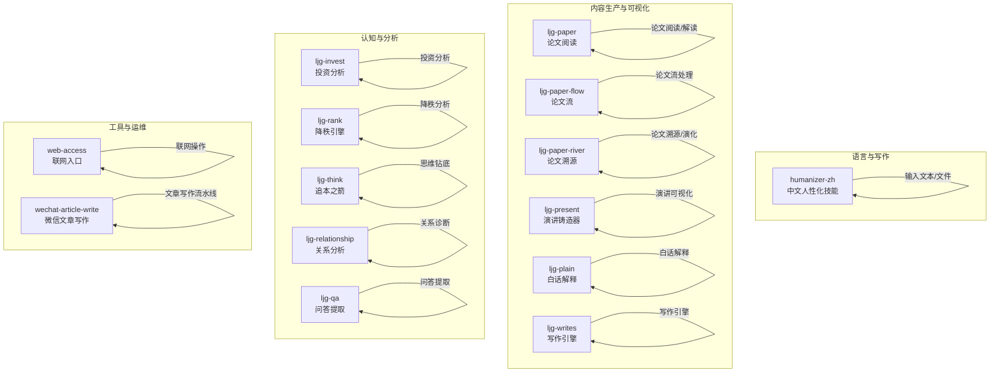

**图表来源**
- [.agents/skills/humanizer-zh/SKILL.md:1-485](file://.agents/skills/humanizer-zh/SKILL.md#L1-L485)
- [.agents/skills/ljg-paper/SKILL.md:1-310](file://.agents/skills/ljg-paper/SKILL.md#L1-L310)
- [.agents/skills/ljg-paper-flow/SKILL.md:1-64](file://.agents/skills/ljg-paper-flow/SKILL.md#L1-L64)
- [.agents/skills/ljg-paper-river/SKILL.md:1-156](file://.agents/skills/ljg-paper-river/SKILL.md#L1-L156)
- [.agents/skills/ljg-present/SKILL.md:1-318](file://.agents/skills/ljg-present/SKILL.md#L1-L318)
- [.agents/skills/ljg-plain/SKILL.md:1-106](file://.agents/skills/ljg-plain/SKILL.md#L1-L106)
- [.agents/skills/ljg-writes/SKILL.md:1-161](file://.agents/skills/ljg-writes/SKILL.md#L1-L161)
- [.agents/skills/ljg-invest/SKILL.md:1-126](file://.agents/skills/ljg-invest/SKILL.md#L1-L126)
- [.agents/skills/ljg-rank/SKILL.md:1-428](file://.agents/skills/ljg-rank/SKILL.md#L1-L428)
- [.agents/skills/ljg-think/SKILL.md:1-68](file://.agents/skills/ljg-think/SKILL.md#L1-L68)
- [.agents/skills/ljg-relationship/SKILL.md:1-262](file://.agents/skills/ljg-relationship/SKILL.md#L1-L262)
- [.agents/skills/ljg-qa/SKILL.md:1-99](file://.agents/skills/ljg-qa/SKILL.md#L1-L99)
- [.agents/skills/web-access/SKILL.md:1-257](file://.agents/skills/web-access/SKILL.md#L1-L257)
- [.agents/skills/wechat-article-write/SKILL.md:1-800](file://.agents/skills/wechat-article-write/SKILL.md#L1-L800)

## 核心组件
- humanizer-zh：基于"AI 写作特征"清单，系统去除 AI 痕迹，强调节奏、信任读者、注入个性，输出更自然、有"人味"的中文文本。
- ljg 系列：围绕"理解—提炼—表达—交付"的闭环，提供从概念解剖、思维钻底、关系诊断、圆桌辩论，到论文阅读、旅行研究、内容可视化等能力。

**更新** 精简后的核心技能组合更加聚焦，减少了技能间的耦合度，提升了执行效率。

**章节来源**
- [.agents/skills/humanizer-zh/SKILL.md:1-485](file://.agents/skills/humanizer-zh/SKILL.md#L1-L485)
- [.agents/skills/ljg-invest/SKILL.md:1-126](file://.agents/skills/ljg-invest/SKILL.md#L1-L126)
- [.agents/skills/ljg-rank/SKILL.md:1-428](file://.agents/skills/ljg-rank/SKILL.md#L1-L428)
- [.agents/skills/ljg-think/SKILL.md:1-68](file://.agents/skills/ljg-think/SKILL.md#L1-L68)
- [.agents/skills/ljg-relationship/SKILL.md:1-262](file://.agents/skills/ljg-relationship/SKILL.md#L1-L262)
- [.agents/skills/ljg-qa/SKILL.md:1-99](file://.agents/skills/ljg-qa/SKILL.md#L1-L99)
- [.agents/skills/ljg-paper/SKILL.md:1-310](file://.agents/skills/ljg-paper/SKILL.md#L1-L310)
- [.agents/skills/ljg-present/SKILL.md:1-318](file://.agents/skills/ljg-present/SKILL.md#L1-L318)
- [.agents/skills/ljg-plain/SKILL.md:1-106](file://.agents/skills/ljg-plain/SKILL.md#L1-L106)
- [.agents/skills/ljg-writes/SKILL.md:1-161](file://.agents/skills/ljg-writes/SKILL.md#L1-L161)

## 架构总览
专用技能模块采用"技能即工具"的架构，围绕输入（文本/URL/文件/对话）与输出（Markdown/Org/HTML/图片）构建：
- 输入获取：WebFetch/PDF/Read/粘贴文本/URL
- 内容处理：翻译/结构标注/概念解剖/思维钻底/关系诊断/问答提取/论文阅读
- 质量控制：红线/风格约束/ASCII 图/品鉴准则
- 交付产物：文档/HTML/图片/卡片/知识网络

**更新** 架构更加简洁，减少了 ljg-card、ljg-word-flow 等可视化技能，简化了技能间的依赖关系。

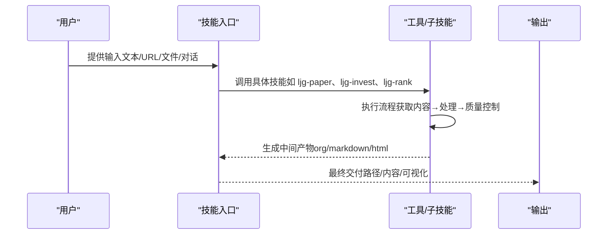

**图表来源**
- [.agents/skills/ljg-paper-flow/SKILL.md:25-64](file://.agents/skills/ljg-paper-flow/SKILL.md#L25-L64)
- [.agents/skills/ljg-present/SKILL.md:257-318](file://.agents/skills/ljg-present/SKILL.md#L257-L318)
- [.agents/skills/wechat-article-write/SKILL.md:126-171](file://.agents/skills/wechat-article-write/SKILL.md#L126-L171)

## 详细组件分析

### humanizer-zh：中文人性化技能
- 设计理念：去除 AI 写作痕迹，强调节奏、信任读者、注入个性，避免"干净但无灵魂"的文本。
- 核心规则：删除填充短语、打破公式结构、变化节奏、信任读者、删除金句、注入观点与复杂性。
- 检测模式：内容模式（意义夸大、媒体强调、-ing 分析、宣传语言、模糊归因、三段式）、语言语法（AI 词汇、系动词回避、否定式排比、三段式、同义词循环、虚假范围）、风格（破折号、粗体、内联标题、标题大写、表情符号、弯引号）、交流（协作痕迹、知识截止、谄媚语气、填充词、过度限定、通用积极结论）。
- 处理流程：识别模式→重写问题片段→保留含义→维持语调→注入个性→质量评分。
- 适用场景：编辑审阅 AI 生成内容、提升文章人味、学习识别 AI 写作模式。

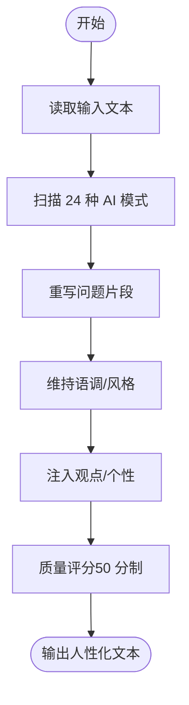

**图表来源**
- [.agents/skills/humanizer-zh/SKILL.md:419-457](file://.agents/skills/humanizer-zh/SKILL.md#L419-L457)

**章节来源**
- [.agents/skills/humanizer-zh/SKILL.md:1-485](file://.agents/skills/humanizer-zh/SKILL.md#L1-L485)

### ljg-paper：论文阅读（非学术视角）
- 设计理念：读论文不是做学术，是猎取思想；把别人的发现拆解成自己能用的认知。
- 执行流程：获取内容→问题（亲历/旧路/新口）→翻译（锚点/揭秘）→核心概念→洞见→博导审稿→启发→过红线→生成 Org。
- 适用场景：非学术读者快速理解论文，提炼可复述的四件事与可迁移的洞见。

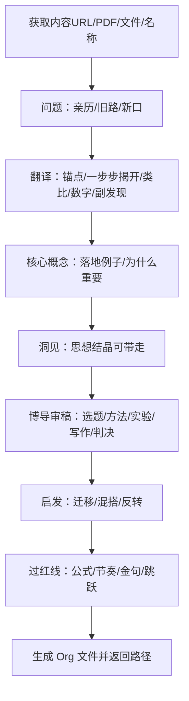

**图表来源**
- [.agents/skills/ljg-paper/SKILL.md:166-310](file://.agents/skills/ljg-paper/SKILL.md#L166-L310)

**章节来源**
- [.agents/skills/ljg-paper/SKILL.md:1-310](file://.agents/skills/ljg-paper/SKILL.md#L1-L310)

### ljg-paper-flow：论文流（读论文+可视化）
- 设计理念：一条命令完成：读论文→生成解读→可视化呈现；支持多篇并行。
- 执行流程：收集论文列表→并行处理（ljg-paper→ljg-present）→汇总报告。
- 适用场景：批量处理论文，快速产出解读与可视化内容。

**更新** 移除了 ljg-card 技能，改用 ljg-present 进行可视化呈现，简化了技能组合。

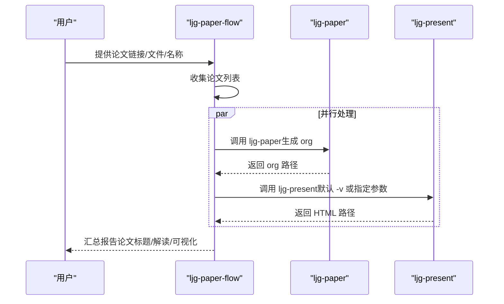

**图表来源**
- [.agents/skills/ljg-paper-flow/SKILL.md:25-64](file://.agents/skills/ljg-paper-flow/SKILL.md#L25-L64)

**章节来源**
- [.agents/skills/ljg-paper-flow/SKILL.md:1-64](file://.agents/skills/ljg-paper-flow/SKILL.md#L1-L64)

### ljg-paper-river：论文溯源（倒读法）
- 设计理念：倒着挖到根，再正着看过来；以问题为轴，费曼式讲解演化史。
- 执行流程：获取目标论文→提取批判链线索→递归溯源（最多 5 层）→前沿延伸→构建演化线→正向叙事→画图→提炼洞见→生成文件。
- 适用场景：理解研究问题的演化脉络与思想传承。

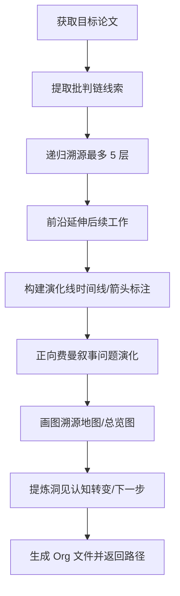

**图表来源**
- [.agents/skills/ljg-paper-river/SKILL.md:68-156](file://.agents/skills/ljg-paper-river/SKILL.md#L68-L156)

**章节来源**
- [.agents/skills/ljg-paper-river/SKILL.md:1-156](file://.agents/skills/ljg-paper-river/SKILL.md#L1-L156)

### ljg-present：演讲铸造器
- 设计理念：基于 orgmode/markdown outline 层级 1:1 视觉化呈现——色块大字、ultra-bold 错位，原文不动只做美化。
- 执行流程：获取内容→解析 outline→推断主题→应用映射规则→生成 HTML→写入文件。
- 适用场景：将 outline 内容转换为视觉化的演讲页面，支持多种主题风格。

**更新** 作为 ljg-card 的替代方案，提供更灵活的可视化选项。

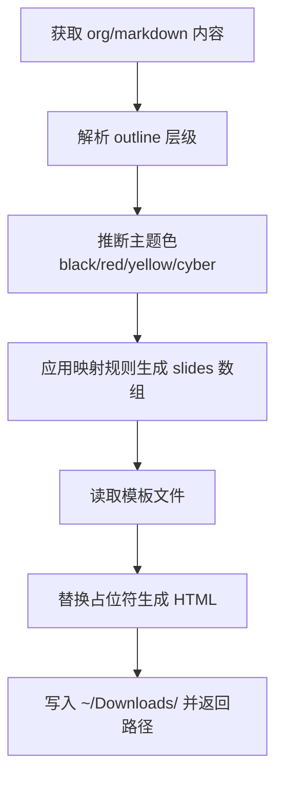

**图表来源**
- [.agents/skills/ljg-present/SKILL.md:257-318](file://.agents/skills/ljg-present/SKILL.md#L257-L318)

**章节来源**
- [.agents/skills/ljg-present/SKILL.md:1-318](file://.agents/skills/ljg-present/SKILL.md#L1-L318)

### ljg-plain：白话解释
- 设计理念：将任何内容改写成聪明的12岁孩子都能理解的版本，结构自由——形式追随内容。
- 执行流程：获取内容→写作风格自由→过红线检查→生成 Org 文件。
- 适用场景：将复杂概念转化为通俗易懂的解释，适合教育和科普场景。

**章节来源**
- [.agents/skills/ljg-plain/SKILL.md:1-106](file://.agents/skills/ljg-plain/SKILL.md#L1-L106)

### ljg-writes：写作引擎
- 设计理念：像手术刀剖开一个观点，一层层剥到底，1000-1500字的批判性文章。
- 执行流程：把观点放到台面上→切第一刀→切第二刀→切到底→合起来看→磨。
- 适用场景：深度分析和批判性写作，适合学术和专业写作场景。

**章节来源**
- [.agents/skills/ljg-writes/SKILL.md:1-161](file://.agents/skills/ljg-writes/SKILL.md#L1-L161)

### ljg-invest：投资分析（秩序创造机器）
- 设计理念：核心只问一个问题：这台机器转不转得起来？从飞轮、冲击、资源三视角判定。
- 报告结构：这是什么/秩序创造机器判定/创生公式/市场看见 vs 我们看见/换不换。
- 适用场景：对项目进行"秩序创造"判断，规避搬运旧秩序的投资陷阱。

**图表来源**
- [.agents/skills/ljg-invest/SKILL.md:23-126](file://.agents/skills/ljg-invest/SKILL.md#L23-L126)

**章节来源**
- [.agents/skills/ljg-invest/SKILL.md:1-126](file://.agents/skills/ljg-invest/SKILL.md#L1-L126)

### ljg-rank：降秩引擎（根骨架与坐标系）
- 设计理念：寻找真正独立的生成器，能反向生成全部现象，才算找到秩。
- 执行流程：铺现象→列候选→递归追问→合并同源→砍→反生成→找反例→两层判断（根骨架+坐标系叠加）→ASCII 结构图。
- 适用场景：将复杂领域拆解为可操作的世界观与操作仪，适合战略、产品、组织等系统性分析。

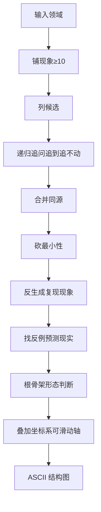

**图表来源**
- [.agents/skills/ljg-rank/SKILL.md:17-122](file://.agents/skills/ljg-rank/SKILL.md#L17-L122)

**章节来源**
- [.agents/skills/ljg-rank/SKILL.md:1-428](file://.agents/skills/ljg-rank/SKILL.md#L1-L428)

### ljg-think：追本之箭（纵向深钻）
- 设计理念：像箭一样一路向下钻到底，每层只做一件事：找到当前这层脚下的地面，然后钻进那个地面。
- 执行流程：纵向深钻（不横向铺陈）→单刀直入→层层惊叹→终点狠（沉默片刻）。
- 适用场景：对观点、现象或问题进行本质追问，生成"下坠式"深度笔记。

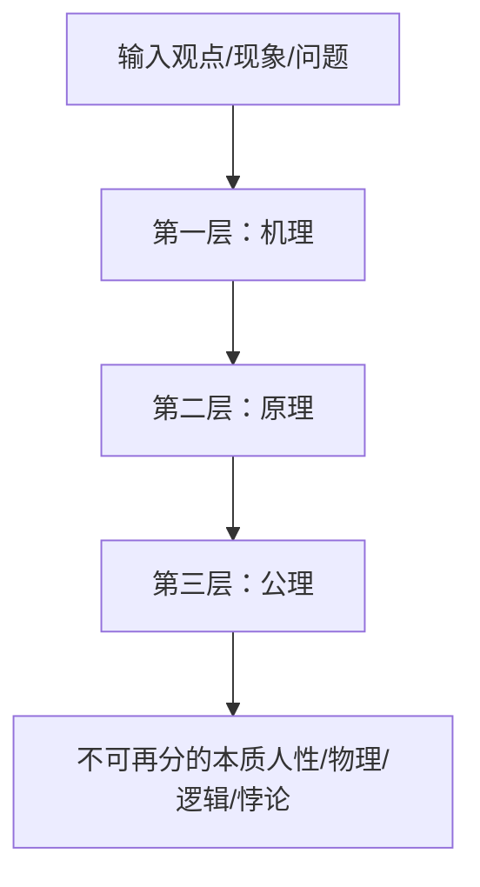

**图表来源**
- [.agents/skills/ljg-think/SKILL.md:18-68](file://.agents/skills/ljg-think/SKILL.md#L18-L68)

**章节来源**
- [.agents/skills/ljg-think/SKILL.md:1-68](file://.agents/skills/ljg-think/SKILL.md#L1-L68)

### ljg-relationship：关系分析（结构+精神分析）
- 设计理念：关系问题分两类：结构性问题（交换/权力/边界/阶段/叙事）与模式性问题（移情/无意识/阻抗）。
- 执行流程：接住→表层扫描→五层逐层探测→模式探测（移情/无意识/阻抗）→综合诊断→收尾→写入 Org。
- 适用场景：帮助用户"看见"关系中的真实结构与重复模式。

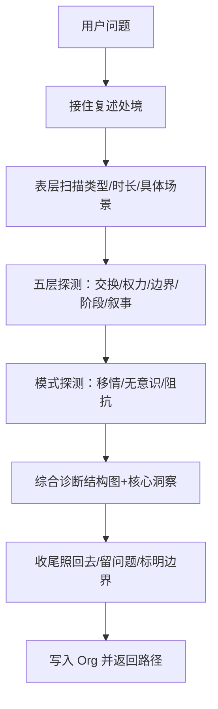

**图表来源**
- [.agents/skills/ljg-relationship/SKILL.md:46-262](file://.agents/skills/ljg-relationship/SKILL.md#L46-L262)

**章节来源**
- [.agents/skills/ljg-relationship/SKILL.md:1-262](file://.agents/skills/ljg-relationship/SKILL.md#L1-L262)

### ljg-qa：问答提取
- 设计理念：把一篇文章/论文/书的核心观点抽成 Q-A 对——Question 切要害，不教科书；Answer 简洁清晰，有形式化收口，逻辑链完整。
- 执行流程：读取内容→找观点骨架→设计 Q 链→写 A 三段→输出 markdown。
- 适用场景：将复杂内容转化为结构化的问答链，便于学习和复习。

**章节来源**
- [.agents/skills/ljg-qa/SKILL.md:1-99](file://.agents/skills/ljg-qa/SKILL.md#L1-L99)

## 依赖分析
- 输入依赖：WebFetch/PDF/Read/URL/文件/粘贴文本
- 工具依赖：web-access（联网入口）、wechat-article-write（文章写作流水线）
- 输出依赖：Denote/Org 文件规范、ASCII 图约束、HTML 输出

**更新** 依赖关系更加简洁，移除了 ljg-card、ljg-word-flow 等可视化依赖，减少了技能间的耦合。

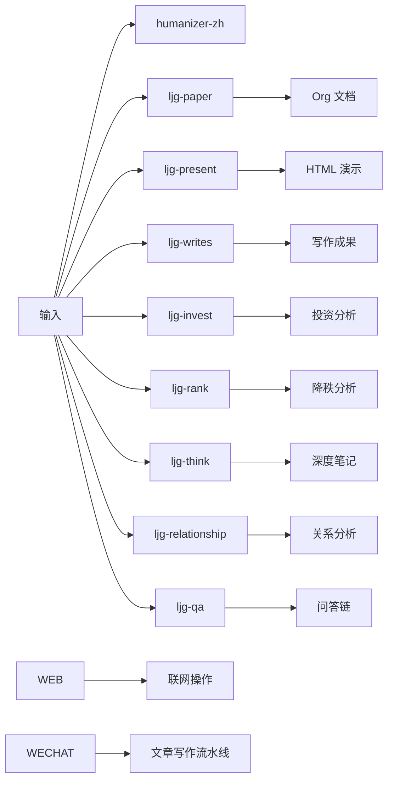

**图表来源**
- [.agents/skills/ljg-paper-flow/SKILL.md:25-64](file://.agents/skills/ljg-paper-flow/SKILL.md#L25-L64)
- [.agents/skills/ljg-present/SKILL.md:257-318](file://.agents/skills/ljg-present/SKILL.md#L257-L318)
- [.agents/skills/wechat-article-write/SKILL.md:126-171](file://.agents/skills/wechat-article-write/SKILL.md#L126-L171)

**章节来源**
- [.agents/skills/ljg-paper-flow/SKILL.md:1-64](file://.agents/skills/ljg-paper-flow/SKILL.md#L1-L64)
- [.agents/skills/ljg-present/SKILL.md:1-318](file://.agents/skills/ljg-present/SKILL.md#L1-L318)
- [.agents/skills/wechat-article-write/SKILL.md:1-800](file://.agents/skills/wechat-article-write/SKILL.md#L1-L800)

## 性能考量
- 并行化：ljg-paper-flow 的子流程采用并行执行，缩短整体时延。
- 降级策略：移除了 ljg-card 的 Playwright 依赖，ljg-present 提供更稳定的可视化方案。
- 输出体积：ljg-present 默认 HTML 输出，相比 ljg-card 的 PNG 输出更轻量。
- 技能组合：简化了技能间的依赖关系，减少了不必要的中间产物。

**更新** 性能优化集中在减少依赖和简化流程上，提升了整体执行效率。

## 故障排查指南
- humanizer-zh
  - 症状：输出仍带有 AI 词汇或三段式
  - 处理：对照核心规则与快速检查清单，逐条删改；必要时重写段落
  - 参考：[SKILL.md:406-431](file://.agents/skills/humanizer-zh/SKILL.md#L406-L431)
- ljg-paper
  - 症状：翻译节缺少类比/数字/副发现
  - 处理：在"翻译节必有清单"中补齐；避免公式直出，用自然语言解释
  - 参考：[SKILL.md:222-228](file://.agents/skills/ljg-paper/SKILL.md#L222-L228)
- ljg-present
  - 症状：HTML 渲染异常或主题色不正确
  - 处理：检查 org 文件结构和文件标签；确认主题参数正确
  - 参考：[SKILL.md:82-100](file://.agents/skills/ljg-present/SKILL.md#L82-L100)
- ljg-paper-flow
  - 症状：多篇论文处理顺序错误
  - 处理：确保每篇论文先 ljg-paper 再 ljg-present；多篇之间并行
  - 参考：[SKILL.md:31-42](file://.agents/skills/ljg-paper-flow/SKILL.md#L31-L42)

**更新** 移除了 ljg-card 相关的故障排查项，新增了 ljg-present 的故障排查指南。

**章节来源**
- [.agents/skills/humanizer-zh/SKILL.md:406-431](file://.agents/skills/humanizer-zh/SKILL.md#L406-L431)
- [.agents/skills/ljg-paper/SKILL.md:222-228](file://.agents/skills/ljg-paper/SKILL.md#L222-L228)
- [.agents/skills/ljg-present/SKILL.md:82-100](file://.agents/skills/ljg-present/SKILL.md#L82-L100)
- [.agents/skills/ljg-paper-flow/SKILL.md:31-42](file://.agents/skills/ljg-paper-flow/SKILL.md#L31-L42)

## 结论
NTLx's Blog 的专用技能模块以"理解—提炼—表达—交付"为核心闭环，结合 humanizer-zh 的语言人性化与 ljg 系列的多样化能力，既能提升文本质量，又能系统化处理复杂信息与关系问题。通过严格的红线与风格约束、可复用的执行流程与可视化输出，这些技能为个人知识管理与专业写作提供了稳健支撑。

**更新** 经过技能生态系统的精简，模块变得更加简洁高效，减少了技能间的耦合度，提升了整体性能和可维护性。

## 附录
- 扩展开发指南
  - 新增技能：遵循 Denote/Org 文件规范与 ASCII 图约束；提供 SKILL.md 与 README.md；确保输入/输出与现有流程兼容。
  - 模板与参考：参考 ljg-paper 的 references/template.md 与 ljg-present 的模板文件。
  - 品味准则：统一反 AI 品味准则（禁 Inter 字体、禁纯黑、禁三等分卡片、禁居中 Hero、禁 AI 文案腔、禁假数据）。
- 最佳实践
  - 以"外行能懂"为目标，避免学术腔；用"亲历"场景引入问题；用"锚点"贯穿翻译与概念讲解。
  - 在 ljg-present 中优先选择与内容契合的主题色；在 ljg-paper-flow 中为每篇论文提供清晰的可视化呈现。
  - 在 ljg-qa 中确保问答链的逻辑连贯性，避免教科书式的问答格式。
- 技能组合策略
  - 简化工作流程：优先使用 ljg-paper + ljg-present 组合替代 ljg-paper + ljg-card
  - 降低耦合度：减少技能间的直接依赖，通过标准化的中间产物进行传递
  - 提升执行效率：利用并行处理能力，最大化技能组合的并发性能

**更新** 附录内容反映了技能生态系统精简后的最佳实践和组合策略调整。