# 专用技能

<cite>
**本文引用的文件**
- [SKILL.md](file://.agents/skills/humanizer-zh/SKILL.md)
- [README.md](file://.agents/skills/humanizer-zh/README.md)
- [SKILL.md](file://.agents/skills/ljg-card/SKILL.md)
- [SKILL.md](file://.agents/skills/ljg-invest/SKILL.md)
- [SKILL.md](file://.agents/skills/ljg-learn/SKILL.md)
- [SKILL.md](file://.agents/skills/ljg-paper/SKILL.md)
- [SKILL.md](file://.agents/skills/ljg-paper-flow/SKILL.md)
- [SKILL.md](file://.agents/skills/ljg-paper-river/SKILL.md)
- [SKILL.md](file://.agents/skills/ljg-read/SKILL.md)
- [SKILL.md](file://.agents/skills/ljg-relationship/SKILL.md)
- [SKILL.md](file://.agents/skills/ljg-roundtable/SKILL.md)
- [SKILL.md](file://.agents/skills/ljg-skill-map/SKILL.md)
- [SKILL.md](file://.agents/skills/ljg-think/SKILL.md)
- [SKILL.md](file://.agents/skills/ljg-travel/SKILL.md)
- [SKILL.md](file://.agents/skills/ljg-word/SKILL.md)
</cite>

## 目录
1. [引言](#引言)
2. [项目结构](#项目结构)
3. [核心组件](#核心组件)
4. [架构总览](#架构总览)
5. [详细组件分析](#详细组件分析)
6. [依赖分析](#依赖分析)
7. [性能考量](#性能考量)
8. [故障排查指南](#故障排查指南)
9. [结论](#结论)
10. [附录](#附录)

## 引言
本文件面向 NTLx's Blog 的“专用技能模块”，系统梳理并阐释两类核心能力：
- 语言人性化与本地化优化：humanizer-zh 中文人性化技能，去除 AI 写作痕迹，提升文本的人味与可读性。
- ljg 系列专用技能：覆盖认知加工、内容生产、关系诊断、圆桌辩论、旅行研究、思维钻底、论文阅读与可视化等，形成从“理解—提炼—表达—交付”的闭环。

文档将从设计理念、使用场景、执行流程、质量标准、扩展开发与最佳实践等维度，提供可操作的参考与策略建议。

## 项目结构
专用技能集中于 .agents/skills 目录，按功能域划分：
- 语言与写作：humanizer-zh
- 内容生产与可视化：ljg-card、ljg-word、ljg-skill-map
- 认知与分析：ljg-learn、ljg-think、ljg-rank、ljg-invest、ljg-read、ljg-relationship、ljg-roundtable、ljg-paper、ljg-paper-flow、ljg-paper-river、ljg-travel
- 工具与运维：部分技能提供扫描与可视化能力（如 ljg-skill-map）

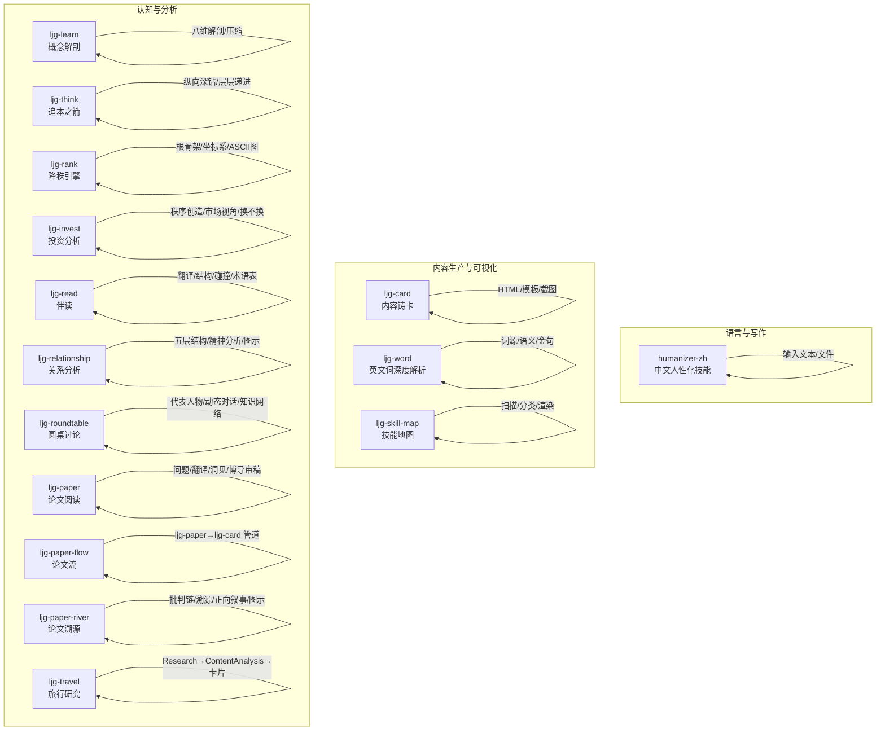

**图表来源**
- [.agents/skills/humanizer-zh/SKILL.md:1-485](file://.agents/skills/humanizer-zh/SKILL.md#L1-L485)
- [.agents/skills/ljg-card/SKILL.md:1-112](file://.agents/skills/ljg-card/SKILL.md#L1-L112)
- [.agents/skills/ljg-word/SKILL.md:1-42](file://.agents/skills/ljg-word/SKILL.md#L1-L42)
- [.agents/skills/ljg-skill-map/SKILL.md:1-68](file://.agents/skills/ljg-skill-map/SKILL.md#L1-L68)
- [.agents/skills/ljg-learn/SKILL.md:1-80](file://.agents/skills/ljg-learn/SKILL.md#L1-L80)
- [.agents/skills/ljg-think/SKILL.md:1-68](file://.agents/skills/ljg-think/SKILL.md#L1-L68)
- [.agents/skills/ljg-rank/SKILL.md:1-428](file://.agents/skills/ljg-rank/SKILL.md#L1-L428)
- [.agents/skills/ljg-invest/SKILL.md:1-126](file://.agents/skills/ljg-invest/SKILL.md#L1-L126)
- [.agents/skills/ljg-read/SKILL.md:1-274](file://.agents/skills/ljg-read/SKILL.md#L1-L274)
- [.agents/skills/ljg-relationship/SKILL.md:1-262](file://.agents/skills/ljg-relationship/SKILL.md#L1-L262)
- [.agents/skills/ljg-roundtable/SKILL.md:1-134](file://.agents/skills/ljg-roundtable/SKILL.md#L1-L134)
- [.agents/skills/ljg-paper/SKILL.md:1-310](file://.agents/skills/ljg-paper/SKILL.md#L1-L310)
- [.agents/skills/ljg-paper-flow/SKILL.md:1-64](file://.agents/skills/ljg-paper-flow/SKILL.md#L1-L64)
- [.agents/skills/ljg-paper-river/SKILL.md:1-156](file://.agents/skills/ljg-paper-river/SKILL.md#L1-L156)
- [.agents/skills/ljg-travel/SKILL.md:1-199](file://.agents/skills/ljg-travel/SKILL.md#L1-L199)

**章节来源**
- [.agents/skills/humanizer-zh/SKILL.md:1-485](file://.agents/skills/humanizer-zh/SKILL.md#L1-L485)
- [.agents/skills/ljg-card/SKILL.md:1-112](file://.agents/skills/ljg-card/SKILL.md#L1-L112)
- [.agents/skills/ljg-word/SKILL.md:1-42](file://.agents/skills/ljg-word/SKILL.md#L1-L42)
- [.agents/skills/ljg-skill-map/SKILL.md:1-68](file://.agents/skills/ljg-skill-map/SKILL.md#L1-L68)
- [.agents/skills/ljg-learn/SKILL.md:1-80](file://.agents/skills/ljg-learn/SKILL.md#L1-L80)
- [.agents/skills/ljg-think/SKILL.md:1-68](file://.agents/skills/ljg-think/SKILL.md#L1-L68)
- [.agents/skills/ljg-rank/SKILL.md:1-428](file://.agents/skills/ljg-rank/SKILL.md#L1-L428)
- [.agents/skills/ljg-invest/SKILL.md:1-126](file://.agents/skills/ljg-invest/SKILL.md#L1-L126)
- [.agents/skills/ljg-read/SKILL.md:1-274](file://.agents/skills/ljg-read/SKILL.md#L1-L274)
- [.agents/skills/ljg-relationship/SKILL.md:1-262](file://.agents/skills/ljg-relationship/SKILL.md#L1-L262)
- [.agents/skills/ljg-roundtable/SKILL.md:1-134](file://.agents/skills/ljg-roundtable/SKILL.md#L1-L134)
- [.agents/skills/ljg-paper/SKILL.md:1-310](file://.agents/skills/ljg-paper/SKILL.md#L1-L310)
- [.agents/skills/ljg-paper-flow/SKILL.md:1-64](file://.agents/skills/ljg-paper-flow/SKILL.md#L1-L64)
- [.agents/skills/ljg-paper-river/SKILL.md:1-156](file://.agents/skills/ljg-paper-river/SKILL.md#L1-L156)
- [.agents/skills/ljg-travel/SKILL.md:1-199](file://.agents/skills/ljg-travel/SKILL.md#L1-L199)

## 核心组件
- humanizer-zh：基于“AI 写作特征”清单，系统去除 AI 痕迹，强调节奏、信任读者、注入个性，输出更自然、有“人味”的中文文本。
- ljg 系列：围绕“理解—提炼—表达—交付”的闭环，提供从概念解剖、思维钻底、关系诊断、圆桌辩论，到论文阅读、旅行研究、内容可视化等能力。

**章节来源**
- [.agents/skills/humanizer-zh/SKILL.md:1-485](file://.agents/skills/humanizer-zh/SKILL.md#L1-L485)
- [.agents/skills/ljg-learn/SKILL.md:1-80](file://.agents/skills/ljg-learn/SKILL.md#L1-L80)
- [.agents/skills/ljg-think/SKILL.md:1-68](file://.agents/skills/ljg-think/SKILL.md#L1-L68)
- [.agents/skills/ljg-relationship/SKILL.md:1-262](file://.agents/skills/ljg-relationship/SKILL.md#L1-L262)
- [.agents/skills/ljg-roundtable/SKILL.md:1-134](file://.agents/skills/ljg-roundtable/SKILL.md#L1-L134)
- [.agents/skills/ljg-paper/SKILL.md:1-310](file://.agents/skills/ljg-paper/SKILL.md#L1-L310)
- [.agents/skills/ljg-travel/SKILL.md:1-199](file://.agents/skills/ljg-travel/SKILL.md#L1-L199)
- [.agents/skills/ljg-card/SKILL.md:1-112](file://.agents/skills/ljg-card/SKILL.md#L1-L112)

## 架构总览
专用技能模块采用“技能即工具”的架构，围绕输入（文本/URL/文件/对话）与输出（Markdown/Org/图片）构建：
- 输入获取：WebFetch/PDF/Read/粘贴文本/URL
- 内容处理：翻译/结构标注/概念解剖/思维钻底/关系诊断/圆桌讨论/论文阅读/旅行研究
- 质量控制：红线/风格约束/ASCII 图/品鉴准则
- 交付产物：文档/图片/卡片/知识网络

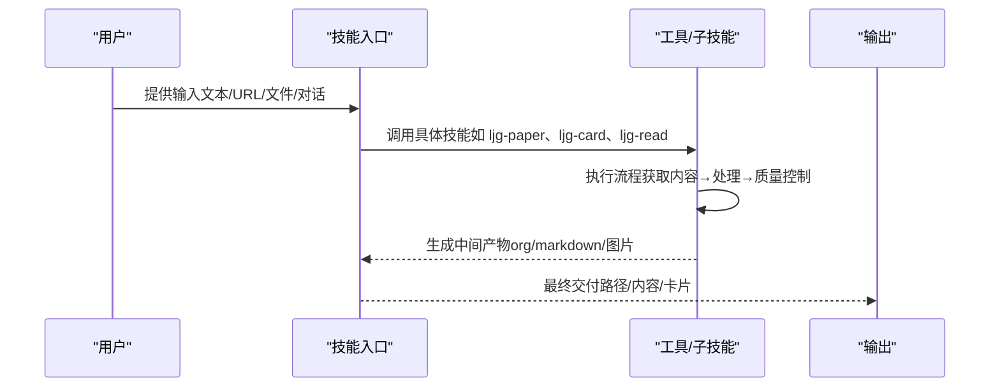

**图表来源**
- [.agents/skills/ljg-paper-flow/SKILL.md:25-64](file://.agents/skills/ljg-paper-flow/SKILL.md#L25-L64)
- [.agents/skills/ljg-travel/SKILL.md:26-199](file://.agents/skills/ljg-travel/SKILL.md#L26-L199)
- [.agents/skills/ljg-card/SKILL.md:67-112](file://.agents/skills/ljg-card/SKILL.md#L67-L112)

## 详细组件分析

### humanizer-zh：中文人性化技能
- 设计理念：去除 AI 写作痕迹，强调节奏、信任读者、注入个性，避免“干净但无灵魂”的文本。
- 核心规则：删除填充短语、打破公式结构、变化节奏、信任读者、删除金句、注入观点与复杂性。
- 检测模式：内容模式（意义夸大、媒体强调、-ing 分析、宣传语言、模糊归因、三段式）、语言语法（AI 词汇、系动词回避、否定式排比、三段式、同义词循环、虚假范围）、风格（破折号、粗体、内联标题、标题大写、表情符号、弯引号）、交流（协作痕迹、知识截止、谄媚语气、填充词、过度限定、通用积极结论）。
- 处理流程：识别模式→重写问题片段→保留含义→维持语调→注入个性→质量评分。
- 适用场景：编辑审阅 AI 生成内容、提升文章人味、学习识别 AI 写作模式。

**图表来源**
- [.agents/skills/humanizer-zh/SKILL.md:419-457](file://.agents/skills/humanizer-zh/SKILL.md#L419-L457)

**章节来源**
- [.agents/skills/humanizer-zh/SKILL.md:1-485](file://.agents/skills/humanizer-zh/SKILL.md#L1-L485)
- [.agents/skills/humanizer-zh/README.md:1-240](file://.agents/skills/humanizer-zh/README.md#L1-L240)

### ljg-card：内容铸卡（视觉化交付）
- 设计理念：将内容铸成可见形态，七种模具（长图、信息图、多卡、视觉笔记、漫画、白板、大字）对应不同表达需求。
- 执行流程：获取内容（URL/粘贴/文件）→选择模具→读取参考与口味准则→模板渲染→截图生成→文件命名与交付。
- 约束：输出 PNG，不适用 L0 的纯文本规范；Footer 来源可选；反 AI 品味准则贯穿。
- 适用场景：将文章/笔记/研究摘要快速可视化，制作长图、信息图、漫画、白板、大字附件卡等。

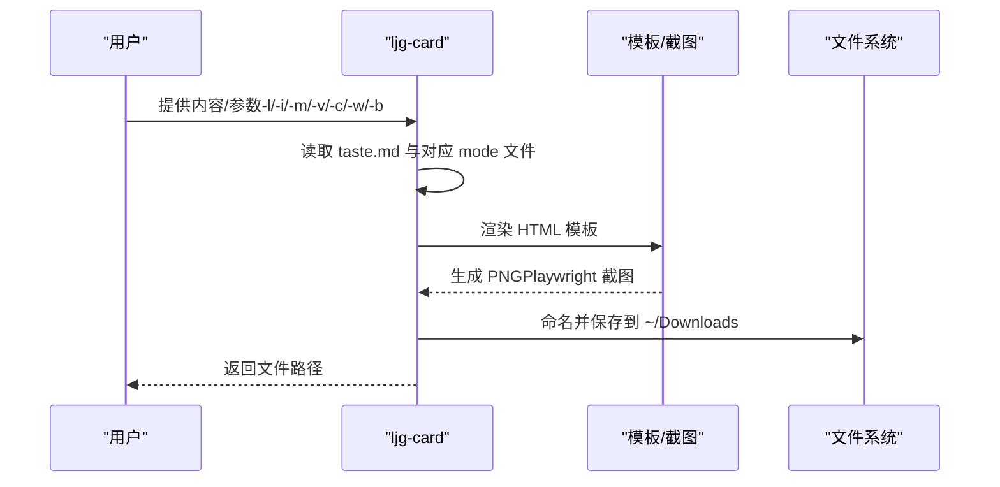

**图表来源**
- [.agents/skills/ljg-card/SKILL.md:67-112](file://.agents/skills/ljg-card/SKILL.md#L67-L112)

**章节来源**
- [.agents/skills/ljg-card/SKILL.md:1-112](file://.agents/skills/ljg-card/SKILL.md#L1-L112)

### ljg-learn：概念解剖（八维透视）
- 设计理念：从历史、辩证、现象、语言、形式、存在、美感、元反思八维切开一个概念，最后压缩为一句顿悟。
- 执行流程：定锚（通行定义/核心词素）→八刀（每刀 2-3 句）→内观（第一人称视角）→压缩（公式/一句话/ASCII 结构图）→写入。
- 适用场景：深度理解术语、哲学概念、技术术语，生成可分享的“概念卡片”。

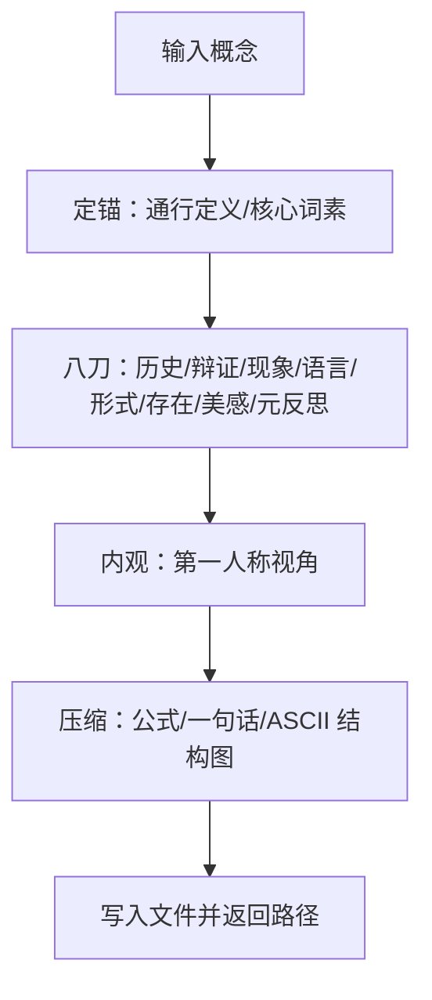

**图表来源**
- [.agents/skills/ljg-learn/SKILL.md:13-79](file://.agents/skills/ljg-learn/SKILL.md#L13-L79)

**章节来源**
- [.agents/skills/ljg-learn/SKILL.md:1-80](file://.agents/skills/ljg-learn/SKILL.md#L1-L80)

### ljg-think：追本之箭（纵向深钻）
- 设计理念：像箭一样一路向下钻到底，每层只做一件事：找到当前这层脚下的地面，然后钻进那个地面。
- 执行流程：纵向深钻（不横向铺陈）→单刀直入→层层惊叹→终点狠（沉默片刻）。
- 适用场景：对观点、现象或问题进行本质追问，生成“下坠式”深度笔记。

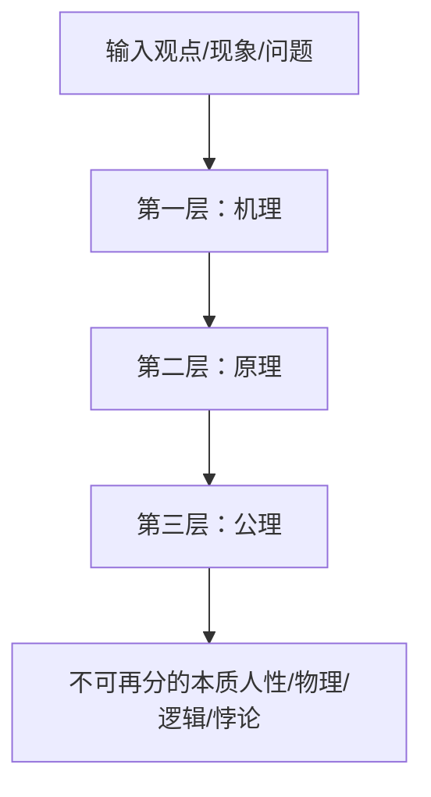

**图表来源**
- [.agents/skills/ljg-think/SKILL.md:18-68](file://.agents/skills/ljg-think/SKILL.md#L18-L68)

**章节来源**
- [.agents/skills/ljg-think/SKILL.md:1-68](file://.agents/skills/ljg-think/SKILL.md#L1-L68)

### ljg-rank：降秩引擎（根骨架与坐标系）
- 设计理念：寻找真正独立的生成器，能反向生成全部现象，才算找到秩。
- 执行流程：铺现象→列候选→递归追问→合并同源→砍→反生成→找反例→两层判断（根骨架+坐标系叠加）→ASCII 结构图。
- 适用场景：将复杂领域拆解为可操作的世界观与操作仪，适合战略、产品、组织等系统性分析。

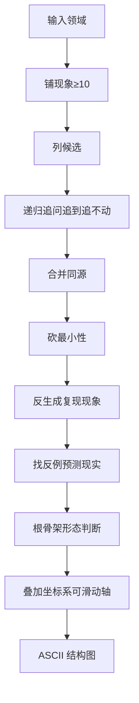

**图表来源**
- [.agents/skills/ljg-rank/SKILL.md:17-122](file://.agents/skills/ljg-rank/SKILL.md#L17-L122)

**章节来源**
- [.agents/skills/ljg-rank/SKILL.md:1-428](file://.agents/skills/ljg-rank/SKILL.md#L1-L428)

### ljg-invest：投资分析（秩序创造机器）
- 设计理念：核心只问一个问题：这台机器转不转得起来？从飞轮、冲击、资源三视角判定。
- 报告结构：这是什么/秩序创造机器判定/创生公式/市场看见 vs 我们看见/换不换。
- 适用场景：对项目进行“秩序创造”判断，规避搬运旧秩序的投资陷阱。

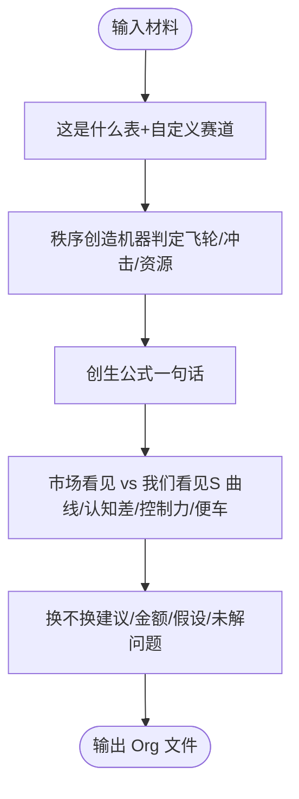

**图表来源**
- [.agents/skills/ljg-invest/SKILL.md:23-126](file://.agents/skills/ljg-invest/SKILL.md#L23-L126)

**章节来源**
- [.agents/skills/ljg-invest/SKILL.md:1-126](file://.agents/skills/ljg-invest/SKILL.md#L1-L126)

### ljg-read：伴读（翻译+结构+碰撞）
- 设计理念：翻译是再生产，不是搬运；伴读是脚手架，最终要拆；最好的伴读不回答问题，而是制造问题。
- 执行流程：全局地图→逐段翻译（直译/意译/点睛）→骨架段深入（注疏/碰撞）→循环与节奏→全文复盘→写入 Org。
- 适用场景：深度阅读英文文本，生成可复盘的伴读记录与术语表。

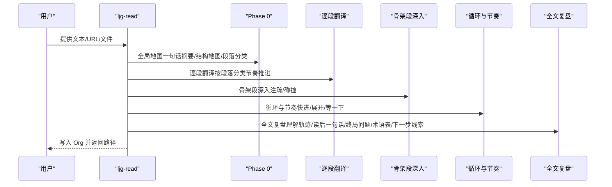

**图表来源**
- [.agents/skills/ljg-read/SKILL.md:33-245](file://.agents/skills/ljg-read/SKILL.md#L33-L245)

**章节来源**
- [.agents/skills/ljg-read/SKILL.md:1-274](file://.agents/skills/ljg-read/SKILL.md#L1-L274)

### ljg-relationship：关系分析（结构+精神分析）
- 设计理念：关系问题分两类：结构性问题（交换/权力/边界/阶段/叙事）与模式性问题（移情/无意识/阻抗）。
- 执行流程：接住→表层扫描→五层逐层探测→模式探测（移情/无意识/阻抗）→综合诊断→收尾→写入 Org。
- 适用场景：帮助用户“看见”关系中的真实结构与重复模式。

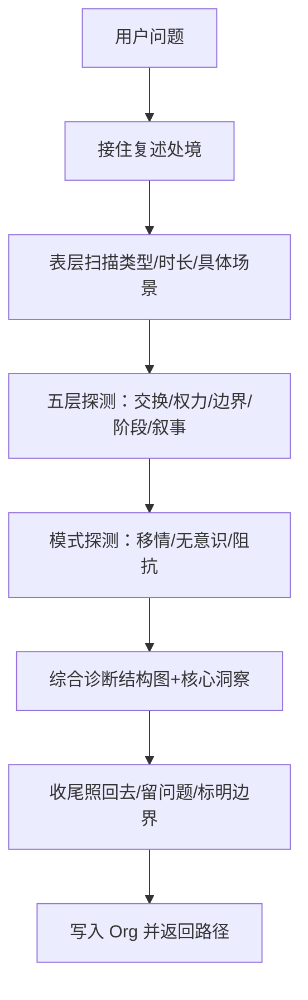

**图表来源**
- [.agents/skills/ljg-relationship/SKILL.md:46-262](file://.agents/skills/ljg-relationship/SKILL.md#L46-L262)

**章节来源**
- [.agents/skills/ljg-relationship/SKILL.md:1-262](file://.agents/skills/ljg-relationship/SKILL.md#L1-L262)

### ljg-roundtable：圆桌讨论（多视角结构化辩论）
- 设计理念：由主持人邀请代表性人物进行辩证式讨论，形成知识网络与开放问题。
- 执行流程：读取参考→解析议题→选人→开场统一定义→动态发言轮→主持人综述→用户指令→结束生成知识网络。
- 适用场景：对复杂议题进行多视角结构化辩论，沉淀知识网络与未决问题。

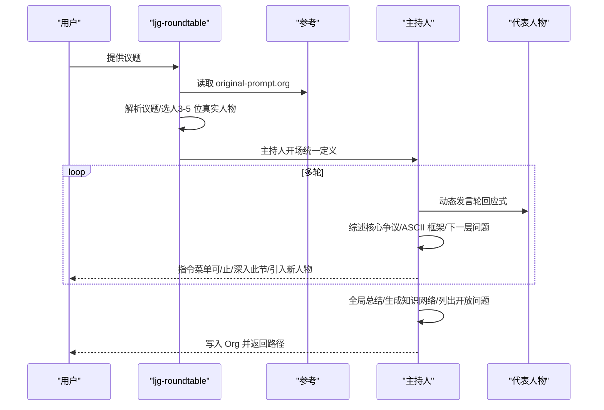

**图表来源**
- [.agents/skills/ljg-roundtable/SKILL.md:22-134](file://.agents/skills/ljg-roundtable/SKILL.md#L22-L134)

**章节来源**
- [.agents/skills/ljg-roundtable/SKILL.md:1-134](file://.agents/skills/ljg-roundtable/SKILL.md#L1-L134)

### ljg-paper：论文阅读（非学术视角）
- 设计理念：读论文不是做学术，是猎取思想；把别人的发现拆解成自己能用的认知。
- 执行流程：获取内容→问题（亲历/旧路/新口）→翻译（锚点/揭秘）→核心概念→洞见→博导审稿→启发→过红线→生成 Org。
- 适用场景：非学术读者快速理解论文，提炼可复述的四件事与可迁移的洞见。

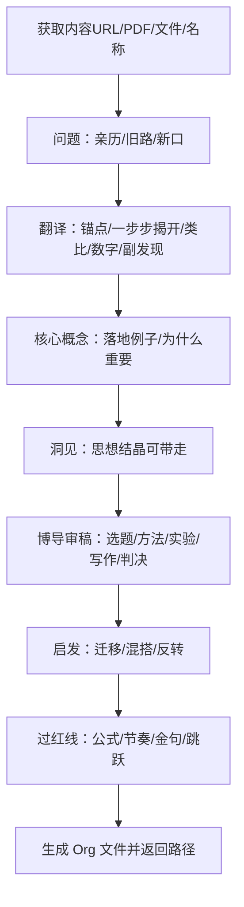

**图表来源**
- [.agents/skills/ljg-paper/SKILL.md:166-310](file://.agents/skills/ljg-paper/SKILL.md#L166-L310)

**章节来源**
- [.agents/skills/ljg-paper/SKILL.md:1-310](file://.agents/skills/ljg-paper/SKILL.md#L1-L310)

### ljg-paper-flow：论文流（读论文+铸卡片）
- 设计理念：一条命令完成：读论文→生成解读→铸成卡片；支持多篇并行。
- 执行流程：收集论文列表→并行处理（ljg-paper→ljg-card）→汇总报告。
- 适用场景：批量处理论文，快速产出解读与可视化卡片。

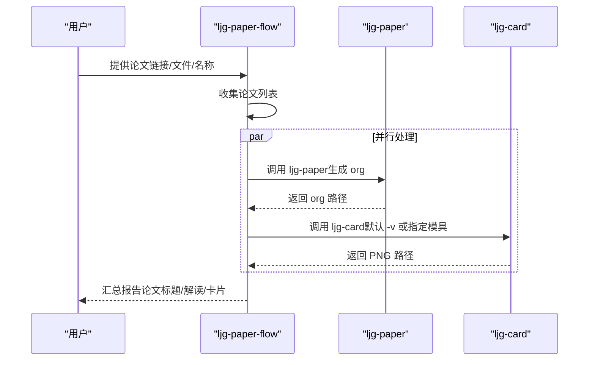

**图表来源**
- [.agents/skills/ljg-paper-flow/SKILL.md:25-64](file://.agents/skills/ljg-paper-flow/SKILL.md#L25-L64)

**章节来源**
- [.agents/skills/ljg-paper-flow/SKILL.md:1-64](file://.agents/skills/ljg-paper-flow/SKILL.md#L1-L64)

### ljg-paper-river：论文溯源（倒读法）
- 设计理念：倒着挖到根，再正着看过来；以问题为轴，费曼式讲解演化史。
- 执行流程：获取目标论文→提取批判链线索→递归溯源（最多 5 层）→前沿延伸→构建演化线→正向叙事→画图→提炼洞见→生成文件。
- 适用场景：理解研究问题的演化脉络与思想传承。

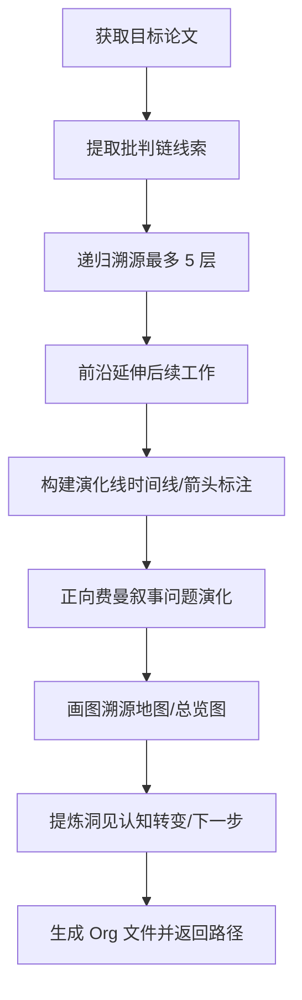

**图表来源**
- [.agents/skills/ljg-paper-river/SKILL.md:68-156](file://.agents/skills/ljg-paper-river/SKILL.md#L68-L156)

**章节来源**
- [.agents/skills/ljg-paper-river/SKILL.md:1-156](file://.agents/skills/ljg-paper-river/SKILL.md#L1-L156)

### ljg-travel：旅行研究（文化深度 prep）
- 设计理念：考古学式案头研究（Desk-Based Assessment），到达之前穷尽一切文献证据。
- 执行流程：解析参数→全维度研究（12 个 Agent 并行）→内容提炼（可选）→合成 markdown 文档→铸造便携卡片→汇总报告。
- 适用场景：深度文化旅行准备，生成知识文档与便携卡片。

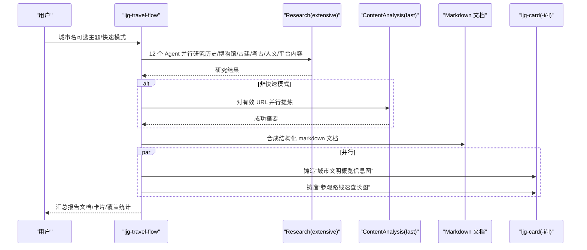

**图表来源**
- [.agents/skills/ljg-travel/SKILL.md:26-199](file://.agents/skills/ljg-travel/SKILL.md#L26-L199)

**章节来源**
- [.agents/skills/ljg-travel/SKILL.md:1-199](file://.agents/skills/ljg-travel/SKILL.md#L1-L199)

### ljg-word：英文词深度解析
- 设计理念：不是翻译，而是掌握词的深层含义与用法；从原始画面→核心意象→解释→一语道破。
- 输出结构：标题行/核心语义/一语道破。
- 适用场景：提升英文词汇深度理解与表达能力。

**章节来源**
- [.agents/skills/ljg-word/SKILL.md:1-42](file://.agents/skills/ljg-word/SKILL.md#L1-L42)

### ljg-skill-map：技能地图
- 设计理念：扫描已安装技能，生成可视化地图，自动分类（认知原子/输出铸造/联网触达/系统运维/环境部署）。
- 执行流程：扫描→分类→渲染→输出。
- 适用场景：快速了解可用技能与调用方式。

**章节来源**
- [.agents/skills/ljg-skill-map/SKILL.md:1-68](file://.agents/skills/ljg-skill-map/SKILL.md#L1-L68)

## 依赖分析
- 输入依赖：WebFetch/PDF/Read/URL/文件/粘贴文本
- 工具依赖：Playwright（ljg-card 截图）、Research/ContentAnalysis（ljg-travel）、ljg-paper/ljg-card（ljg-paper-flow）
- 输出依赖：Denote/Org 文件规范、ASCII 图约束、PNG 输出

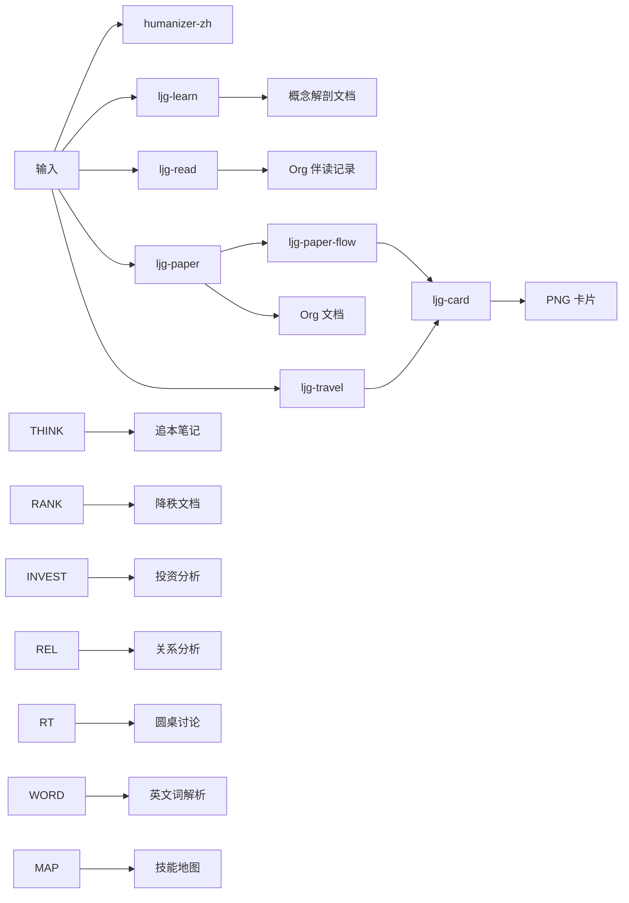

**图表来源**
- [.agents/skills/ljg-paper-flow/SKILL.md:25-64](file://.agents/skills/ljg-paper-flow/SKILL.md#L25-L64)
- [.agents/skills/ljg-travel/SKILL.md:16-199](file://.agents/skills/ljg-travel/SKILL.md#L16-L199)
- [.agents/skills/ljg-card/SKILL.md:40-112](file://.agents/skills/ljg-card/SKILL.md#L40-L112)

**章节来源**
- [.agents/skills/ljg-paper-flow/SKILL.md:1-64](file://.agents/skills/ljg-paper-flow/SKILL.md#L1-L64)
- [.agents/skills/ljg-travel/SKILL.md:1-199](file://.agents/skills/ljg-travel/SKILL.md#L1-L199)
- [.agents/skills/ljg-card/SKILL.md:1-112](file://.agents/skills/ljg-card/SKILL.md#L1-L112)

## 性能考量
- 并行化：ljg-travel 的 Research 与 ljg-paper-flow 的子流程均采用并行执行，缩短整体时延。
- 降级策略：ContentAnalysis 失败不阻塞 ljg-travel 主流程，保证最小可用产出。
- 截图依赖：ljg-card 需要 Playwright 安装，首次使用建议提前安装以避免阻塞。
- 输出体积：ljg-card 默认 PNG 输出，注意存储与传输成本；可结合 -m（多卡）与 -i（信息图）控制尺寸与复杂度。

[本节为通用指导，无需特定文件引用]

## 故障排查指南
- humanizer-zh
  - 症状：输出仍带有 AI 词汇或三段式
  - 处理：对照核心规则与快速检查清单，逐条删改；必要时重写段落
  - 参考：[SKILL.md:406-431](file://.agents/skills/humanizer-zh/SKILL.md#L406-L431)
- ljg-card
  - 症状：截图失败/字体缺失/样式异常
  - 处理：安装 Playwright 并执行 Chromium 安装；检查模板与 taste.md 品味准则
  - 参考：[SKILL.md:40-51](file://.agents/skills/ljg-card/SKILL.md#L40-L51)
- ljg-paper
  - 症状：翻译节缺少类比/数字/副发现
  - 处理：在“翻译节必有清单”中补齐；避免公式直出，用自然语言解释
  - 参考：[SKILL.md:222-228](file://.agents/skills/ljg-paper/SKILL.md#L222-L228)
- ljg-travel
  - 症状：ContentAnalysis 失败导致无提炼内容
  - 处理：启用快速模式或跳过提炼；研究结果已足够生成文档
  - 参考：[SKILL.md:84-88](file://.agents/skills/ljg-travel/SKILL.md#L84-L88)
- ljg-paper-flow
  - 症状：多篇论文处理顺序错误
  - 处理：确保每篇论文先 ljg-paper 再 ljg-card；多篇之间并行
  - 参考：[SKILL.md:31-42](file://.agents/skills/ljg-paper-flow/SKILL.md#L31-L42)

**章节来源**
- [.agents/skills/humanizer-zh/SKILL.md:406-431](file://.agents/skills/humanizer-zh/SKILL.md#L406-L431)
- [.agents/skills/ljg-card/SKILL.md:40-51](file://.agents/skills/ljg-card/SKILL.md#L40-L51)
- [.agents/skills/ljg-paper/SKILL.md:222-228](file://.agents/skills/ljg-paper/SKILL.md#L222-L228)
- [.agents/skills/ljg-travel/SKILL.md:84-88](file://.agents/skills/ljg-travel/SKILL.md#L84-L88)
- [.agents/skills/ljg-paper-flow/SKILL.md:31-42](file://.agents/skills/ljg-paper-flow/SKILL.md#L31-L42)

## 结论
NTLx's Blog 的专用技能模块以“理解—提炼—表达—交付”为核心闭环，结合 humanizer-zh 的语言人性化与 ljg 系列的多样化能力，既能提升文本质量，又能系统化处理复杂信息与关系问题。通过严格的红线与风格约束、可复用的执行流程与可视化输出，这些技能为个人知识管理与专业写作提供了稳健支撑。

[本节为总结性内容，无需特定文件引用]

## 附录
- 扩展开发指南
  - 新增技能：遵循 Denote/Org 文件规范与 ASCII 图约束；提供 SKILL.md 与 README.md；确保输入/输出与现有流程兼容。
  - 模板与参考：参考 ljg-paper 的 references/template.md 与 ljg-card 的 references/* 模板。
  - 品味准则：统一反 AI 品味准则（禁 Inter 字体、禁纯黑、禁三等分卡片、禁居中 Hero、禁 AI 文案腔、禁假数据）。
- 最佳实践
  - 以“外行能懂”为目标，避免学术腔；用“亲历”场景引入问题；用“锚点”贯穿翻译与概念讲解。
  - 在 ljg-card 中优先选择与内容契合的模具；在 ljg-travel 中为每条推荐提供“为什么看/看什么细节”。
  - 在 ljg-roundtable 中确保代表人物立场形成张力网络，主持人保持理性之锚。

[本节为通用指导，无需特定文件引用]