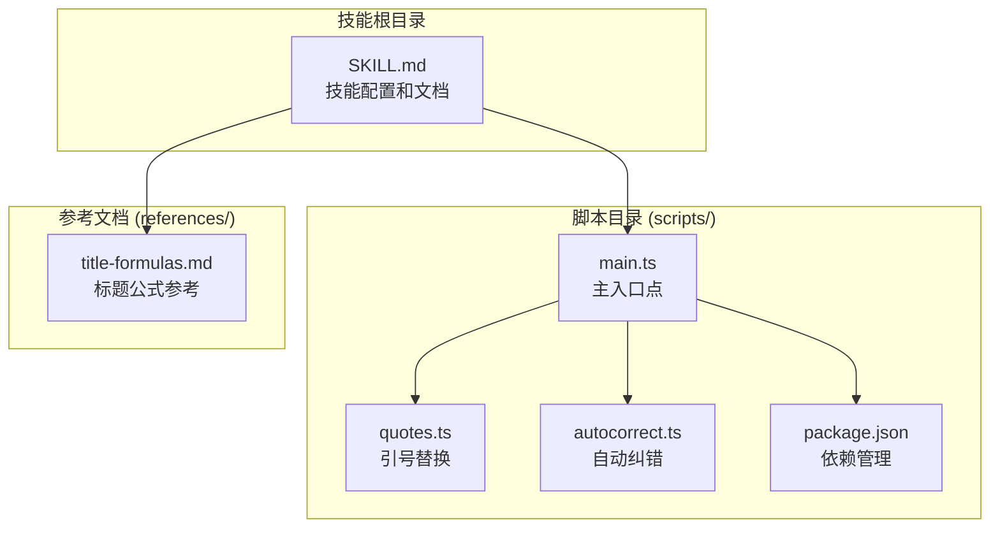
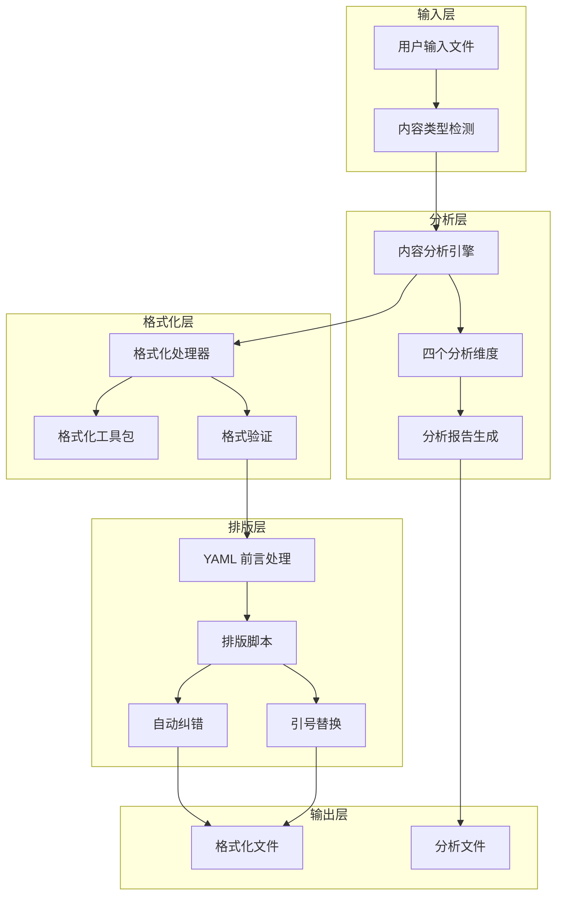
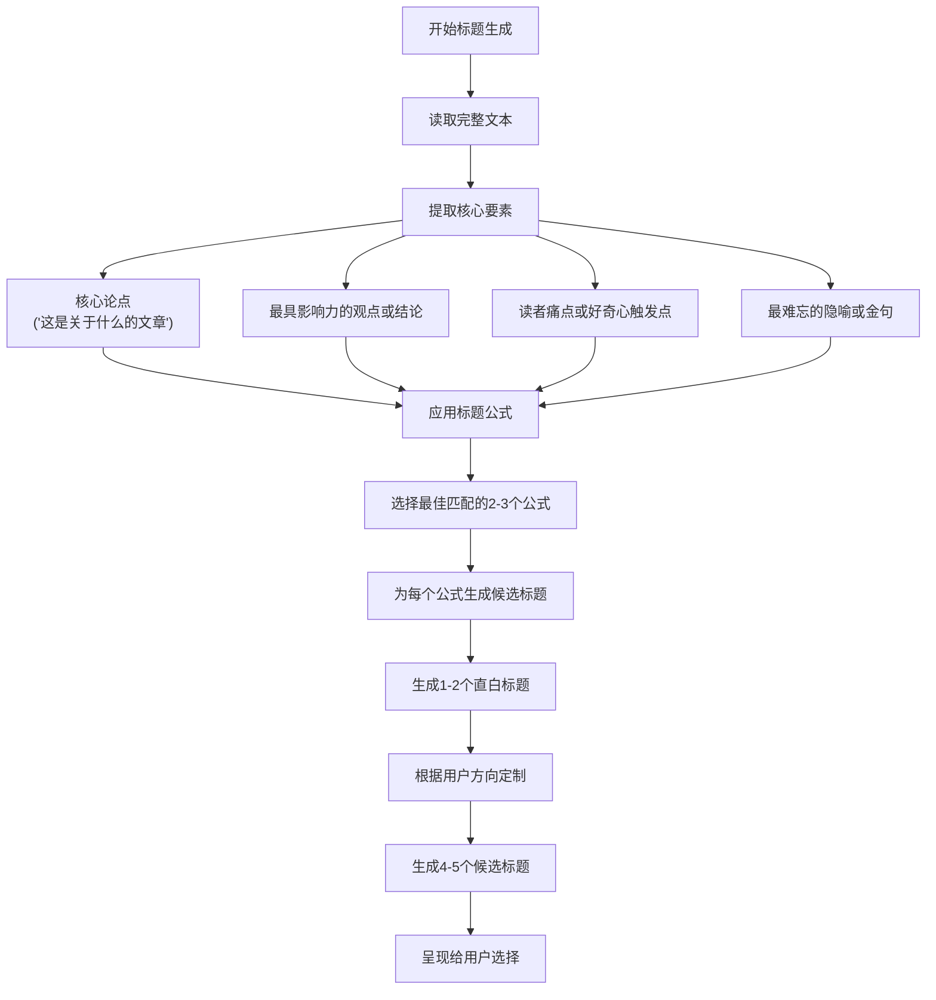
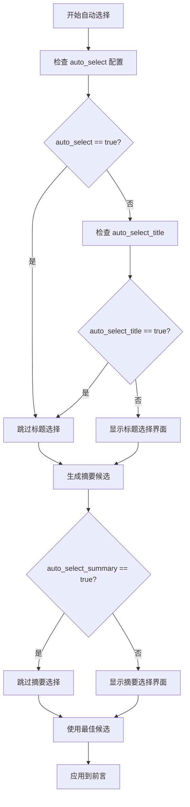
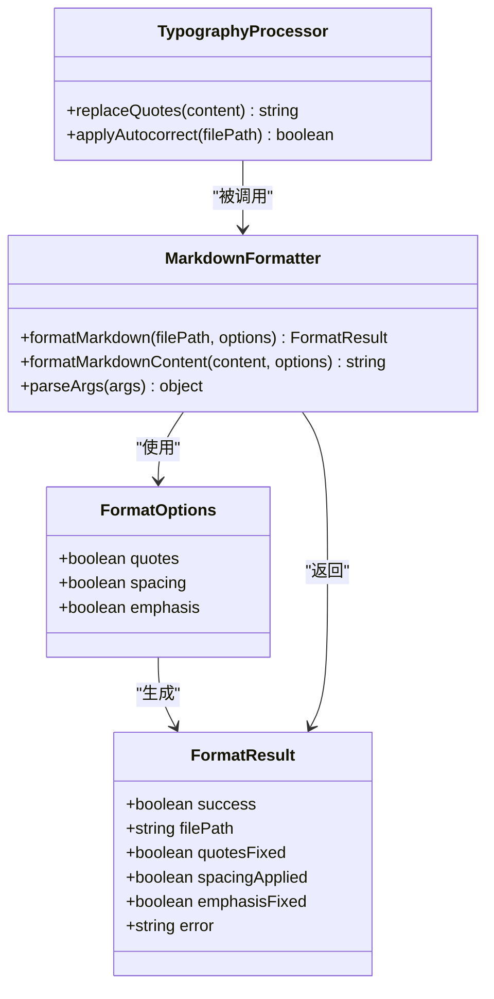
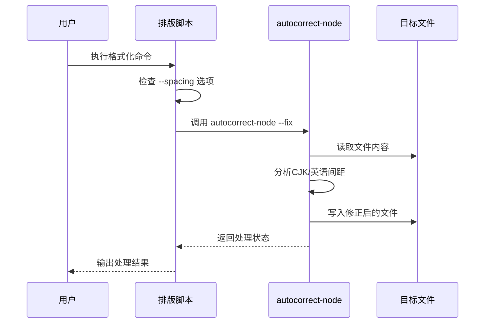
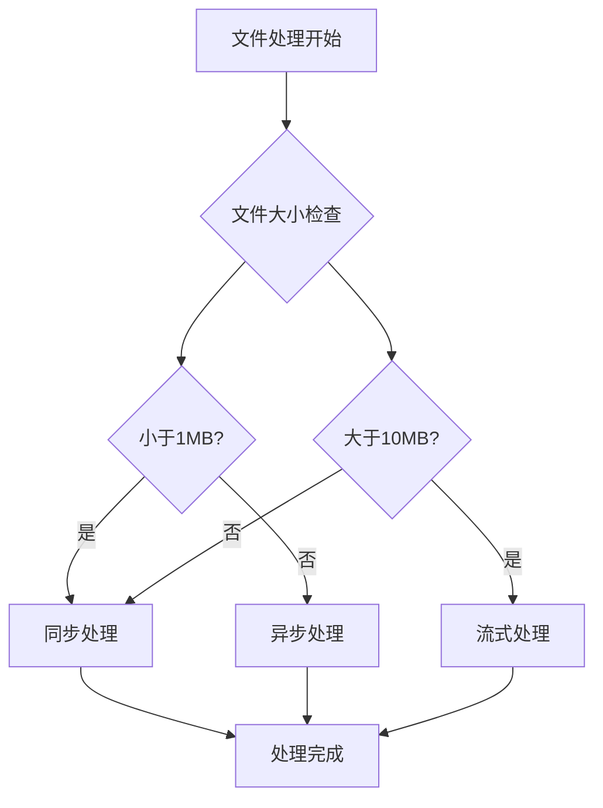

# Markdown 格式化技能

<cite>
**本文档引用的文件**
- [SKILL.md](file://.agents/skills/baoyu-format-markdown/SKILL.md)
- [main.ts](file://.agents/skills/baoyu-format-markdown/scripts/main.ts)
- [package.json](file://.agents/skills/baoyu-format-markdown/scripts/package.json)
- [title-formulas.md](file://.agents/skills/baoyu-format-markdown/references/title-formulas.md)
- [autocorrect.ts](file://.agents/skills/baoyu-format-markdown/scripts/autocorrect.ts)
- [quotes.ts](file://.agents/skills/baoyu-format-markdown/scripts/quotes.ts)
- [wechat-article-EXTEND.md](file://.agents/skills/wechat-article-write/EXTEND.md)
</cite>

## 目录
1. [简介](#简介)
2. [项目结构](#项目结构)
3. [核心组件](#核心组件)
4. [架构概览](#架构概览)
5. [详细组件分析](#详细组件分析)
6. [依赖关系分析](#依赖关系分析)
7. [性能考虑](#性能考虑)
8. [故障排除指南](#故障排除指南)
9. [结论](#结论)
10. [附录](#附录)

## 简介

baoyu-format-markdown 是一个专门用于格式化 Markdown 文档的智能技能。该技能能够将纯文本或现有的 Markdown 文件转换为结构清晰、读者友好的格式化 Markdown 文档。其核心目标是在不改变原始内容的前提下，通过智能的格式化和排版优化，帮助读者快速抓住文章的关键要点和结构。

该技能遵循"只调整格式和修复明显拼写错误"的核心原则，确保不会添加、删除或重写任何原始内容。输出文件采用 `{filename}-formatted.md` 的命名约定，同时会生成详细的分析报告 `{filename}-analysis.md` 作为格式化过程的蓝图。

## 项目结构

baoyu-format-markdown 技能采用模块化的项目结构，主要包含以下组件：



**图表来源**
- [SKILL.md:1-356](file://.agents/skills/baoyu-format-markdown/SKILL.md#L1-L356)
- [main.ts:1-177](file://.agents/skills/baoyu-format-markdown/scripts/main.ts#L1-L177)

**章节来源**
- [SKILL.md:30-40](file://.agents/skills/baoyu-format-markdown/SKILL.md#L30-L40)
- [main.ts:1-12](file://.agents/skills/baoyu-format-markdown/scripts/main.ts#L1-L12)

## 核心组件

### 主要工作流程

baoyu-format-markdown 技能采用两阶段工作流程：分析阶段和格式化阶段。这种设计确保了格式化过程的智能化和准确性。

#### 分析阶段 (Analyze Phase)

分析阶段从读者的角度审视内容，重点关注以下几个维度：

1. **亮点与关键洞察**：识别作者的核心论点、令人惊讶的事实、数据点或反直觉的声明
2. **结构评估**：分析内容的逻辑流程，识别缺乏标题的自然分段边界
3. **读者重要信息**：提取可操作的建议、关键概念定义、隐藏的列表信息
4. **格式问题**：发现缺失或不一致的标题层次、混合主题的段落等问题

#### 格式化阶段 (Format Phase)

基于分析结果，格式化阶段应用一系列格式化工具和技术：

- **标题层次**：使用 `##` 和 `###` 创建清晰的层级结构
- **强调标记**：使用 `**bold**` 标记关键结论和核心要点
- **列表结构**：将并行项目转换为 `- item` 或 `1. item` 列表
- **表格应用**：对比较、结构化数据使用 Markdown 表格
- **代码标记**：为命令、文件路径、技术术语使用代码标记

**章节来源**
- [SKILL.md:103-155](file://.agents/skills/baoyu-format-markdown/SKILL.md#L103-L155)
- [SKILL.md:229-265](file://.agents/skills/baoyu-format-markdown/SKILL.md#L229-L265)

### 内容类型检测

技能能够智能检测输入内容的类型，采用以下标准：

| 检测指标 | 内容分类 |
|----------|----------|
| 包含 `---` YAML 前言 | Markdown 文档 |
| 包含 `#`, `##`, `###` 标题 | Markdown 文档 |
| 包含 `**粗体**`, `*斜体*`, 列表, 代码块, 引用块 | Markdown 文档 |
| 以上条件均不满足 | 纯文本 |

**章节来源**
- [SKILL.md:67-96](file://.agents/skills/baoyu-format-markdown/SKILL.md#L67-L96)

## 架构概览

baoyu-format-markdown 技能采用基于 remark 生态系统的架构，结合了多种插件来实现全面的 Markdown 处理能力。



**图表来源**
- [SKILL.md:63-102](file://.agents/skills/baoyu-format-markdown/SKILL.md#L63-L102)
- [main.ts:49-85](file://.agents/skills/baoyu-format-markdown/scripts/main.ts#L49-L85)

## 详细组件分析

### 标题生成算法

标题生成是 baoyu-format-markdown 的核心功能之一，采用多公式混合策略来生成高质量的标题候选。

#### 标题公式体系

系统提供了8种不同的标题公式，每种都有特定的适用场景：

| 公式编号 | 公式名称 | 特征 | 示例 |
|----------|----------|------|------|
| 1 | 反转式 | 否定常见观点，创造认知冲突 | "所有去AI化提示都是错的" |
| 2 | 解决方案式 | 直接给出答案，承诺具体价值 | "一个配方让你的AI写出你的声音" |
| 3 | 悬念式 | 揭示一半，激发好奇心 | "花了六个月才找到如何去除AI风味的方法" |
| 4 | 具体数字式 | 使用具体数字增强可信度和冲击力 | "150行文档教会AI我的写作风格" |
| 5 | 对比式 | 小原因→大结果，或期望vs现实 | "一份文档替代了三个月的AI调优" |
| 6 | 结果优先式 | 以令人惊讶的结果开头，钩住读者了解原因 | "使用这种方法后，没人能分辨这是AI写的" |
| 7 | 反问式 | 提出创造未完成感的问题 | "为什么人们能一眼看出你的AI写作？" |
| 8 | 同理心式 | 触及痛点，触发共同的沮丧或解脱感 | "三个月与AI风味作斗争——我终于摆脱了" |

#### 标题生成流程



**图表来源**
- [SKILL.md:168-204](file://.agents/skills/baoyu-format-markdown/SKILL.md#L168-L204)
- [title-formulas.md:18-30](file://.agents/skills/baoyu-format-markdown/references/title-formulas.md#L18-L30)

**章节来源**
- [SKILL.md:168-204](file://.agents/skills/baoyu-format-markdown/SKILL.md#L168-L204)
- [title-formulas.md:1-54](file://.agents/skills/baoyu-format-markdown/references/title-formulas.md#L1-L54)

### 摘要生成规则

摘要生成采用双版本策略，确保不同场景下的需求得到满足：

#### 摘要版本规格

| 字段 | 长度 | 目的 |
|------|------|------|
| `summary` | 1句话，约50-80字符 | 精炼的钩子——用于订阅源、社交分享、SEO元标签 |
| `description` | 2-3句话，约100-200字符 | 更丰富的上下文——用于文章预览、邮件列表摘要 |

#### 摘要生成原则

1. **传达核心价值**：向读者展示文章能提供的具体价值，而非仅仅是主题描述
2. **使用具体细节**：优先使用具体的数字、结果、特定方法，而非模糊描述
3. **简洁性优先**：`summary` 应该精练且自包含；`description` 可以扩展并包含支持细节
4. **避免重复**：禁止使用"本文介绍了..."、"本文探讨了..."等纯主题描述
5. **独特性要求**：禁止重复标题或纯粹的主题描述

**章节来源**
- [SKILL.md:205-228](file://.agents/skills/baoyu-format-markdown/SKILL.md#L205-L228)

### 自动选择功能

自动选择功能允许用户跳过手动选择过程，直接使用最佳候选：

#### 配置选项

| 设置项 | 值 | 默认值 | 描述 |
|--------|----|--------|------|
| `auto_select` | `true`/`false` | `false` | 跳过标题和摘要选择，直接选择最佳 |
| `auto_select_title` | `true`/`false` | `false` | 仅跳过标题选择 |
| `auto_select_summary` | `true`/`false` | `false` | 仅跳过摘要选择 |

#### 自动选择流程



**图表来源**
- [SKILL.md:52-60](file://.agents/skills/baoyu-format-markdown/SKILL.md#L52-L60)
- [SKILL.md:203](file://.agents/skills/baoyu-format-markdown/SKILL.md#L203)

**章节来源**
- [SKILL.md:52-60](file://.agents/skills/baoyu-format-markdown/SKILL.md#L52-L60)
- [SKILL.md:203](file://.agents/skills/baoyu-format-markdown/SKILL.md#L203)

### 排版脚本组件

排版脚本是 baoyu-format-markdown 的核心处理引擎，负责执行具体的格式化任务。

#### 主要功能模块



**图表来源**
- [main.ts:13-26](file://.agents/skills/baoyu-format-markdown/scripts/main.ts#L13-L26)
- [main.ts:87-122](file://.agents/skills/baoyu-format-markdown/scripts/main.ts#L87-L122)

#### CLI 参数系统

| 选项 | 短参数 | 描述 | 默认值 |
|------|--------|------|--------|
| `--quotes` | `-q` | 将ASCII引号替换为全角引号 `"..."` | false |
| `--no-quotes` | 无 | 不进行引号替换 |  |
| `--spacing` | `-s` | 通过自动纠错添加CJK/英语间距 | true |
| `--no-spacing` | 无 | 不添加CJK/英语间距 |  |
| `--emphasis` | `-e` | 修复CJK强调标点问题 | true |
| `--no-emphasis` | 无 | 不修复CJK强调问题 |  |
| `--help` | `-h` | 显示帮助信息 |  |

**章节来源**
- [main.ts:124-161](file://.agents/skills/baoyu-format-markdown/scripts/main.ts#L124-L161)
- [SKILL.md:282-304](file://.agents/skills/baoyu-format-markdown/SKILL.md#L282-L304)

### 引号替换功能

引号替换功能专门处理中英文混排中的引号标准化问题。

#### 支持的引号类型

| 引号类型 | Unicode 编码 | 替换目标 |
|----------|--------------|----------|
| ASCII 双引号 | U+0022 | U+201C（左双引号） |
| ASCII 单引号 | U+0027 | U+201C（左双引号） |
| 日文左引号 | U+300C | U+201C（左双引号） |
| 日文右引号 | U+300D | U+201D（右双引号） |

#### 引号替换算法

```mermaid
flowchart TD
INPUT[输入文本] --> FIND_DOUBLE["查找双引号模式<br/>\"content\" 或 「content」"]
FIND_DOUBLE --> REPLACE_DOUBLE["替换为全角引号<br/>「content」"]
REPLACE_DOUBLE --> FIND_SINGLE["查找单引号模式<br/>'content'"]
FIND_SINGLE --> REPLACE_SINGLE["替换为全角引号<br/>「content」"]
REPLACE_SINGLE --> OUTPUT[输出处理后的文本]
```

**图表来源**
- [quotes.ts:1-5](file://.agents/skills/baoyu-format-markdown/scripts/quotes.ts#L1-L5)

**章节来源**
- [quotes.ts:1-5](file://.agents/skills/baoyu-format-markdown/scripts/quotes.ts#L1-L5)

### CJK/英语间距处理

CJK/英语间距处理通过调用 `autocorrect-node` 工具来实现智能的中英文混排间距优化。

#### 处理机制



**图表来源**
- [autocorrect.ts:4-10](file://.agents/skills/baoyu-format-markdown/scripts/autocorrect.ts#L4-L10)

**章节来源**
- [autocorrect.ts:1-11](file://.agents/skills/baoyu-format-markdown/scripts/autocorrect.ts#L1-L11)

### 强调标点修复功能

强调标点修复功能专门处理CJK文本中的强调标点问题，确保标点符号的正确使用。

#### 修复机制

该功能通过 `remark-cjk-friendly` 插件实现，主要处理以下问题：

1. **强调符号标准化**：统一不同来源的强调符号格式
2. **标点符号处理**：修复中英文标点符号的混用问题
3. **HTML 实体解码**：处理 HTML 实体编码的文本

**章节来源**
- [main.ts:55](file://.agents/skills/baoyu-format-markdown/scripts/main.ts#L55)
- [main.ts:82](file://.agents/skills/baoyu-format-markdown/scripts/main.ts#L82)

## 依赖关系分析

baoyu-format-markdown 技能依赖于多个 remark 生态系统的插件来实现全面的 Markdown 处理能力。

```mermaid
graph TB
subgraph "核心依赖"
UNIFIED[unified@^11.0.5<br/>统一处理框架]
REMARK_PARSE[remark-parse@^11.0.0<br/>解析器]
REMARK_STRINGIFY[remark-stringify@^11.0.0<br/>字符串化器]
end
subgraph "Markdown 特性"
REMARK_GFM[remark-gfm@^4.0.1<br/>GitHub Flavored Markdown]
REMARK_FRONTMATTER[remark-frontmatter@^5.0.0<br/>YAML 前言]
REMARK_CJK[remark-cjk-friendly@^1.1.0<br/>CJK 友好处理]
end
subgraph "辅助工具"
YAML[yaml@^2.8.2<br/>YAML 解析]
UNIST_UTIL_VISIT[unist-util-visit@^5.1.0<br/>节点遍历]
end
UNIFIED --> REMARK_PARSE
UNIFIED --> REMARK_STRINGIFY
REMARK_PARSE --> REMARK_GFM
REMARK_PARSE --> REMARK_FRONTMATTER
REMARK_PARSE --> REMARK_CJK
REMARK_STRINGIFY --> YAML
REMARK_STRINGIFY --> UNIST_UTIL_VISIT
```

**图表来源**
- [package.json:2-11](file://.agents/skills/baoyu-format-markdown/scripts/package.json#L2-L11)

### 外部依赖集成

技能通过以下方式集成外部依赖：

1. **remark-cjk-friendly**：提供CJK文本的友好处理，包括强调标点修复
2. **autocorrect-node**：通过子进程调用实现智能的中英文间距处理
3. **yaml**：用于解析和格式化YAML前言内容

**章节来源**
- [package.json:2-11](file://.agents/skills/baoyu-format-markdown/scripts/package.json#L2-L11)
- [autocorrect.ts:5](file://.agents/skills/baoyu-format-markdown/scripts/autocorrect.ts#L5)

## 性能考虑

### 处理效率优化

1. **流式处理**：使用 `unified` 框架的流式处理能力，避免不必要的内存占用
2. **按需加载**：只有在用户启用相应功能时才加载对应的处理模块
3. **缓存策略**：对于大型文档，合理利用内存缓存减少重复计算

### 内存管理

- **文件读取**：一次性读取整个文件到内存，适合中小型文档
- **树结构处理**：使用 `unist` 树结构进行高效的内容遍历和修改
- **垃圾回收**：及时释放不再使用的临时变量和中间结果

### 并发处理

当前版本采用同步处理方式，对于超大文件可能需要考虑异步处理策略：



## 故障排除指南

### 常见问题及解决方案

#### 1. 依赖安装问题

**问题**：运行时提示缺少依赖包

**解决方案**：
```bash
# 安装 bun 或使用 npx
npm install -g bun
# 或者使用 npx
npx -y bun scripts/main.ts <file.md>
```

#### 2. autocorrect-node 无法找到

**问题**：执行排版时提示找不到 autocorrect-node

**解决方案**：
```bash
# 安装 autocorrect-node
npm install -g autocorrect-node
# 或者在项目中安装
npm install autocorrect-node
```

#### 3. YAML 解析错误

**问题**：YAML 前言解析失败

**解决方案**：
- 检查 YAML 语法是否正确
- 确保缩进符合 YAML 标准
- 验证特殊字符的转义

#### 4. 标题生成异常

**问题**：标题生成算法出现异常

**解决方案**：
- 检查输入文本是否包含足够的信息
- 确认标题公式参考文件存在且格式正确
- 验证用户配置是否正确

### 调试技巧

1. **启用详细日志**：在开发环境中增加调试输出
2. **分步测试**：分别测试各个处理阶段的功能
3. **单元测试**：为关键函数编写单元测试用例
4. **性能监控**：监控处理时间和内存使用情况

**章节来源**
- [main.ts:116-122](file://.agents/skills/baoyu-format-markdown/scripts/main.ts#L116-L122)

## 结论

baoyu-format-markdown 技能通过其精心设计的两阶段工作流程、智能的标题生成算法和全面的排版处理能力，为用户提供了一个强大而易用的 Markdown 格式化解决方案。该技能不仅能够保持原始内容的完整性，还能显著提升文档的可读性和专业性。

其模块化的架构设计使得各个功能组件可以独立开发和维护，同时通过统一的接口实现紧密集成。自动选择功能和灵活的配置选项为不同用户的需求提供了充分的适应性。

未来的发展方向包括支持更多格式化选项、优化大文件处理性能、增强错误处理机制以及提供更丰富的配置选项。

## 附录

### 使用示例

#### 基本使用

```bash
# 默认格式化（启用间距和强调修复，禁用引号替换）
npx -y bun scripts/main.ts article.md

# 启用所有功能
npx -y bun scripts/main.ts article.md --quotes --spacing --emphasis

# 仅修复强调问题
npx -y bun scripts/main.ts article.md --no-spacing --no-quotes
```

#### 配置 EXTEND.md

```yaml
# 自动选择配置
auto_select: true
auto_select_title: false
auto_select_summary: true
```

### 最佳实践建议

1. **内容质量优先**：确保原始内容的质量，格式化只是锦上添花
2. **适度强调**：避免过度使用粗体标记，保持视觉层次清晰
3. **一致性原则**：在整个文档中保持标题层级和格式的一致性
4. **读者导向**：始终从读者的角度考虑格式化决策
5. **备份策略**：在批量处理前做好文件备份

### 性能优化技巧

1. **批量处理**：对于大量文件，考虑批处理脚本
2. **增量更新**：对于频繁修改的文档，使用增量更新策略
3. **缓存机制**：对重复的处理结果进行缓存
4. **资源管理**：合理控制内存使用，避免处理超大文件