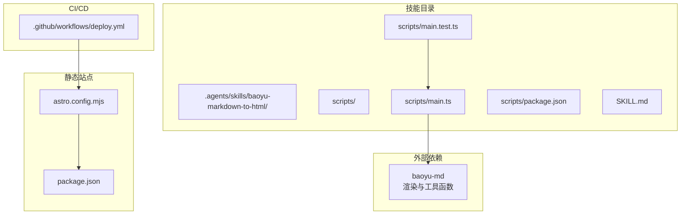
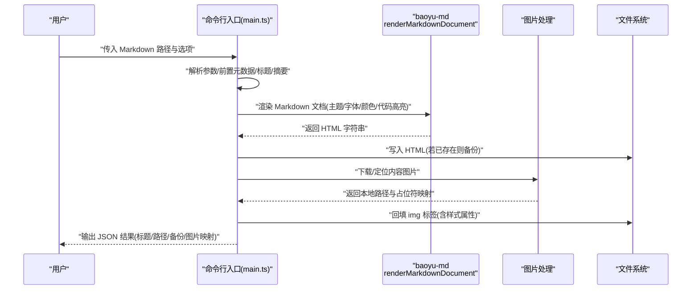
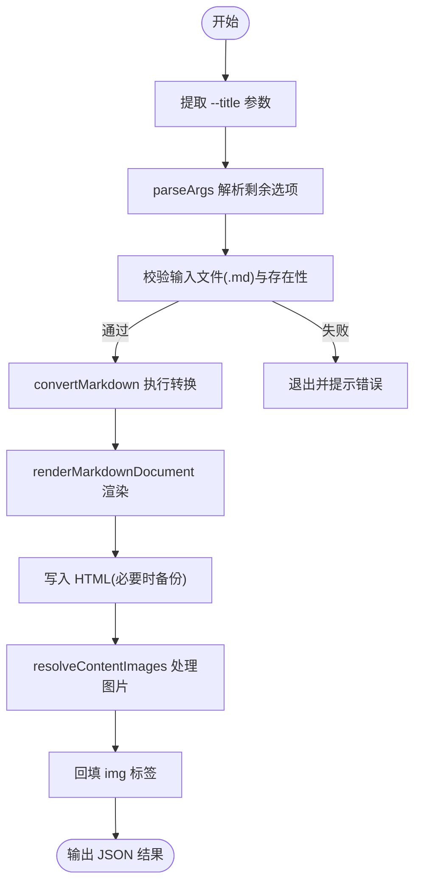
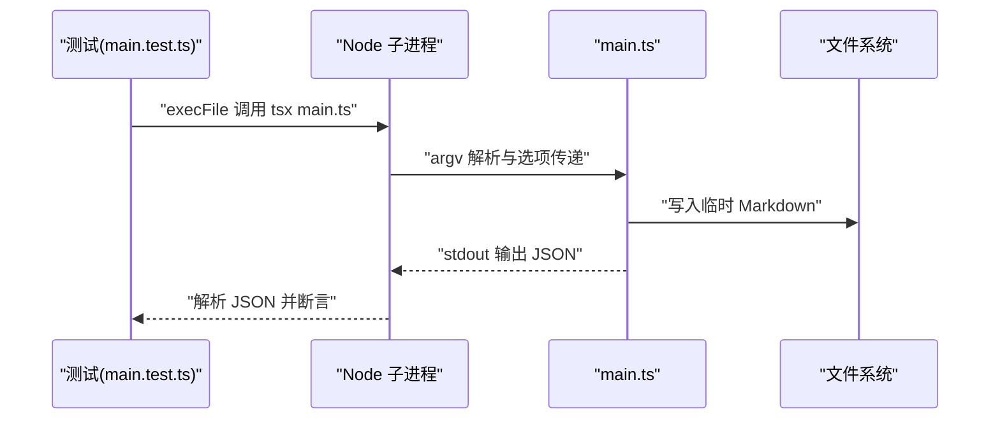
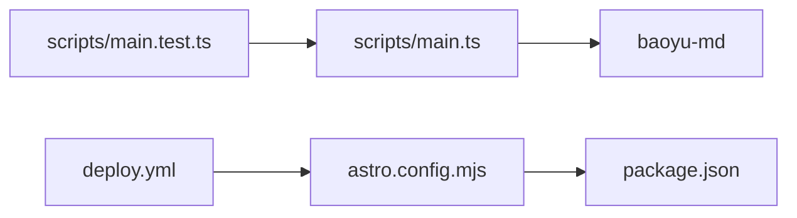

# Markdown 转 HTML 技能

<cite>
**本文档引用的文件**   
- [SKILL.md](file://.agents/skills/baoyu-markdown-to-html/SKILL.md)
- [main.ts](file://.agents/skills/baoyu-markdown-to-html/scripts/main.ts)
- [main.test.ts](file://.agents/skills/baoyu-markdown-to-html/scripts/main.test.ts)
- [package.json](file://.agents/skills/baoyu-markdown-to-html/scripts/package.json)
- [deploy.yml](file://.github/workflows/deploy.yml)
- [astro.config.mjs](file://astro.config.mjs)
- [package.json](file://package.json)
</cite>

## 目录
1. [简介](#简介)
2. [项目结构](#项目结构)
3. [核心组件](#核心组件)
4. [架构总览](#架构总览)
5. [详细组件分析](#详细组件分析)
6. [依赖分析](#依赖分析)
7. [性能考虑](#性能考虑)
8. [故障排查指南](#故障排查指南)
9. [结论](#结论)
10. [附录](#附录)

## 简介
本技能将 Markdown 文档转换为带样式的 HTML，并内联 CSS，适配微信公众号等平台。其核心能力包括：
- 解析 Markdown（含标题、摘要提取、前置元数据解析）
- 主题化渲染（主题、字体族、字号、主色）
- 代码高亮（主题、行号、Mac 风格标题）
- 图片占位与回填（本地化图片路径、替换占位符）
- 引用处理（普通外链转底部引用）
- 输出 HTML 文件并返回结构化结果（标题、作者、摘要、输出路径、备份路径、内容图片映射）

该技能通过命令行调用，亦可作为 Agent 技能在对话中使用。

## 项目结构
技能位于 .agents/skills/baoyu-markdown-to-html，主要文件如下：
- scripts/main.ts：主程序入口，负责参数解析、渲染、图片处理与输出
- scripts/main.test.ts：CLI 行为与样式输出的单元测试
- scripts/package.json：声明依赖 baoyu-md
- SKILL.md：技能说明、使用方式、主题与特性列表
- .github/workflows/deploy.yml：GitHub Pages 部署工作流
- astro.config.mjs：Astro Starlight 配置（静态站点生成器）
- 顶层 package.json：项目脚本与依赖

**图表来源**
- [main.ts:1-249](file://.agents/skills/baoyu-markdown-to-html/scripts/main.ts#L1-L249)
- [main.test.ts:1-57](file://.agents/skills/baoyu-markdown-to-html/scripts/main.test.ts#L1-L57)
- [package.json:1-9](file://.agents/skills/baoyu-markdown-to-html/scripts/package.json#L1-L9)
- [SKILL.md:1-242](file://.agents/skills/baoyu-markdown-to-html/SKILL.md#L1-L242)
- [deploy.yml:1-71](file://.github/workflows/deploy.yml#L1-L71)
- [astro.config.mjs:1-261](file://astro.config.mjs#L1-L261)
- [package.json:1-18](file://package.json#L1-L18)

**章节来源**
- [.agents/skills/baoyu-markdown-to-html/SKILL.md:1-242](file://.agents/skills/baoyu-markdown-to-html/SKILL.md#L1-L242)
- [.agents/skills/baoyu-markdown-to-html/scripts/main.ts:1-249](file://.agents/skills/baoyu-markdown-to-html/scripts/main.ts#L1-L249)
- [.agents/skills/baoyu-markdown-to-html/scripts/main.test.ts:1-57](file://.agents/skills/baoyu-markdown-to-html/scripts/main.test.ts#L1-L57)
- [.agents/skills/baoyu-markdown-to-html/scripts/package.json:1-9](file://.agents/skills/baoyu-markdown-to-html/scripts/package.json#L1-L9)
- [.github/workflows/deploy.yml:1-71](file://.github/workflows/deploy.yml#L1-L71)
- [astro.config.mjs:1-261](file://astro.config.mjs#L1-L261)
- [package.json:1-18](file://package.json#L1-L18)

## 核心组件
- 命令行入口与参数解析
  - 支持 --theme、--color、--font-family、--font-size、--code-theme、--mac-code-block、--line-number、--cite、--count、--legend、--keep-title、--title、--help 等选项
  - 通过 parseArgs 与自定义解析逻辑组合 CLI 参数
- Markdown 解析与重写
  - 解析前置元数据（frontmatter），提取标题、摘要
  - 替换 Markdown 图片为占位符，便于后续回填
- 渲染与样式注入
  - 调用 renderMarkdownDocument 进行主题化渲染，注入内联 CSS
  - 支持代码高亮主题、行号、Mac 风格代码块标题
- 图片处理与回填
  - resolveContentImages 下载或定位内容图片，生成本地路径
  - 将占位符替换为带本地路径与样式属性的 img 标签
- 输出与备份
  - 若目标 HTML 已存在，先备份为带时间戳的 .bak 文件
  - 输出最终 HTML，并返回结构化结果（标题、作者、摘要、路径、备份路径、内容图片映射）

**章节来源**
- [main.ts:43-134](file://.agents/skills/baoyu-markdown-to-html/scripts/main.ts#L43-L134)
- [SKILL.md:110-167](file://.agents/skills/baoyu-markdown-to-html/SKILL.md#L110-L167)

## 架构总览
下图展示从命令行到 HTML 输出的端到端流程：

**图表来源**
- [main.ts:43-134](file://.agents/skills/baoyu-markdown-to-html/scripts/main.ts#L43-L134)
- [package.json:5-7](file://.agents/skills/baoyu-markdown-to-html/scripts/package.json#L5-L7)

**章节来源**
- [main.ts:43-134](file://.agents/skills/baoyu-markdown-to-html/scripts/main.ts#L43-L134)

## 详细组件分析

### 命令行与参数解析
- 支持的选项与行为
  - 主题：default、grace、simple、modern
  - 颜色：预设名称或十六进制
  - 字体族：sans、serif、serif-cjk、mono 或任意 CSS 值
  - 字号：14px、15px、16px、17px、18px
  - 代码高亮：主题、是否显示行号、是否显示 Mac 风格标题
  - 引用：将普通外链转为底部引用
  - 其他：保留首级标题、统计阅读时长/字数、图片标题策略等
- 参数解析流程
  - 提取 --title 特殊参数
  - 调用 parseArgs 获取其余选项
  - 校验输入文件扩展名与存在性
  - 执行转换并输出 JSON

**图表来源**
- [main.ts:185-243](file://.agents/skills/baoyu-markdown-to-html/scripts/main.ts#L185-L243)

**章节来源**
- [main.ts:136-183](file://.agents/skills/baoyu-markdown-to-html/scripts/main.ts#L136-L183)
- [main.ts:185-243](file://.agents/skills/baoyu-markdown-to-html/scripts/main.ts#L185-L243)

### Markdown 解析与重写
- 前置元数据解析与标题/摘要提取
  - 优先使用 --title 或 frontmatter.title；否则从正文提取标题
  - 摘要优先使用 frontmatter.description 或 summary；否则从正文抽取
- 图片占位
  - 将 Markdown 中的图片替换为占位符，便于后续统一处理与回填
- 重写后的 Markdown 用于渲染

**章节来源**
- [main.ts:53-77](file://.agents/skills/baoyu-markdown-to-html/scripts/main.ts#L53-L77)

### 渲染与样式注入
- 渲染调用
  - 传入主题、字体族、字号、主色、代码高亮主题、行号、Mac 标题、标题保留、引用状态、默认标题等
- 样式特征
  - 输出 HTML 内联 CSS，覆盖页面、标题、正文、代码块、强调等元素
  - 支持不同主题下的布局与视觉风格差异

**章节来源**
- [main.ts:83-96](file://.agents/skills/baoyu-markdown-to-html/scripts/main.ts#L83-L96)
- [SKILL.md:197-205](file://.agents/skills/baoyu-markdown-to-html/SKILL.md#L197-L205)

### 图片处理与回填
- 临时目录策略
  - 若存在远程图片，创建临时目录存放下载资源
- 本地化与回填
  - 将占位符替换为带本地路径与样式属性的 img 标签
  - 保持图片宽度自适应与上下间距一致

**章节来源**
- [main.ts:109-122](file://.agents/skills/baoyu-markdown-to-html/scripts/main.ts#L109-L122)

### 输出与备份
- 备份策略
  - 若目标 HTML 已存在，重命名为带时间戳的 .bak 文件
- 结果结构
  - 返回标题、作者、摘要、HTML 路径、备份路径、内容图片映射

**章节来源**
- [main.ts:98-134](file://.agents/skills/baoyu-markdown-to-html/scripts/main.ts#L98-L134)

### 测试框架与用例
- 单元测试
  - 调用脚本执行 CLI，传入主题、颜色、字体、字号、保留标题、标题覆盖等参数
  - 断言输出 HTML 包含对应标题、颜色样式、字体样式等
  - 断言 JSON 输出包含标题、HTML 路径等字段

**图表来源**
- [main.test.ts:19-56](file://.agents/skills/baoyu-markdown-to-html/scripts/main.test.ts#L19-L56)

**章节来源**
- [main.test.ts:1-57](file://.agents/skills/baoyu-markdown-to-html/scripts/main.test.ts#L1-L57)

## 依赖分析
- 技能依赖
  - baoyu-md：提供渲染、解析、图片处理等工具函数
- 运行时依赖
  - bun 或 npx（技能元信息要求）
- 静态站点集成
  - 项目使用 Astro + Starlight，部署至 GitHub Pages

**图表来源**
- [package.json:5-7](file://.agents/skills/baoyu-markdown-to-html/scripts/package.json#L5-L7)
- [main.ts:1-22](file://.agents/skills/baoyu-markdown-to-html/scripts/main.ts#L1-L22)
- [main.test.ts:1-11](file://.agents/skills/baoyu-markdown-to-html/scripts/main.test.ts#L1-L11)
- [deploy.yml:1-71](file://.github/workflows/deploy.yml#L1-L71)
- [astro.config.mjs:1-261](file://astro.config.mjs#L1-L261)
- [package.json:1-18](file://package.json#L1-L18)

**章节来源**
- [.agents/skills/baoyu-markdown-to-html/scripts/package.json:1-9](file://.agents/skills/baoyu-markdown-to-html/scripts/package.json#L1-L9)
- [.agents/skills/baoyu-markdown-to-html/scripts/main.ts:1-22](file://.agents/skills/baoyu-markdown-to-html/scripts/main.ts#L1-L22)
- [.agents/skills/baoyu-markdown-to-html/scripts/main.test.ts:1-11](file://.agents/skills/baoyu-markdown-to-html/scripts/main.test.ts#L1-L11)
- [.github/workflows/deploy.yml:1-71](file://.github/workflows/deploy.yml#L1-L71)
- [astro.config.mjs:1-261](file://astro.config.mjs#L1-L261)
- [package.json:1-18](file://package.json#L1-L18)

## 性能考虑
- 大文件与远程图片
  - 远程图片会触发临时目录下载，注意磁盘空间与网络延迟
  - 建议分批处理或限制同时下载数量
- 内存占用
  - 大型 HTML 与图片回填可能增加内存压力，建议在内存充足的环境中运行
- I/O 与备份
  - 多次读写与备份操作会带来 I/O 压力，建议在 SSD 上运行并避免频繁重复转换
- 渲染与高亮
  - 代码高亮与复杂主题渲染会消耗 CPU，建议在多核环境下并行处理多个文件

[本节为通用性能建议，无需特定文件来源]

## 故障排查指南
- 输入文件无效
  - 确认文件扩展名为 .md 且存在
- 参数错误
  - 使用 --help 查看可用选项与示例
- 主题/颜色/字体无效
  - 检查主题名称、颜色预设或字体族是否在支持范围内
- 图片无法加载
  - 确认网络可达或本地路径正确；远程图片会自动下载至临时目录
- 输出未生成或被覆盖
  - 检查是否存在同名 HTML 文件，确认备份是否成功生成

**章节来源**
- [main.ts:218-243](file://.agents/skills/baoyu-markdown-to-html/scripts/main.ts#L218-L243)
- [SKILL.md:110-167](file://.agents/skills/baoyu-markdown-to-html/SKILL.md#L110-L167)

## 结论
本技能通过简洁的命令行接口与强大的主题化渲染能力，实现了从 Markdown 到内联 CSS HTML 的高效转换。配合图片处理与引用转换，适合在微信公众号等平台直接使用。结合 Astro 静态站点与 GitHub Pages，可进一步实现自动化发布与托管。

[本节为总结性内容，无需特定文件来源]

## 附录

### 转换选项速查
- 主题：default、grace、simple、modern
- 颜色：预设名称或十六进制
- 字体族：sans、serif、serif-cjk、mono 或任意 CSS 值
- 字号：14px、15px、16px、17px、18px
- 代码高亮：主题、行号、Mac 风格标题
- 引用：普通外链转底部引用
- 其他：保留首级标题、统计阅读时长/字数、图片标题策略

**章节来源**
- [SKILL.md:116-128](file://.agents/skills/baoyu-markdown-to-html/SKILL.md#L116-L128)

### 输出格式与结构
- 输出文件：与输入同目录的 .html
- 备份文件：若存在则生成带时间戳的 .bak
- JSON 输出字段：title、author、summary、htmlPath、backupPath、contentImages

**章节来源**
- [SKILL.md:169-195](file://.agents/skills/baoyu-markdown-to-html/SKILL.md#L169-L195)
- [main.ts:126-134](file://.agents/skills/baoyu-markdown-to-html/scripts/main.ts#L126-L134)

### 与静态站点生成器的集成
- 项目采用 Astro + Starlight，构建产物上传至 GitHub Pages
- 可将转换后的 HTML 作为静态资源集成到站点中，或在构建流程中加入转换步骤

**章节来源**
- [astro.config.mjs:1-261](file://astro.config.mjs#L1-L261)
- [.github/workflows/deploy.yml:1-71](file://.github/workflows/deploy.yml#L1-L71)

### 部署最佳实践
- 使用 GitHub Actions 自动构建与部署
- 在 CI 中安装依赖并执行构建脚本
- 将 dist 目录作为 Pages 资源发布

**章节来源**
- [.github/workflows/deploy.yml:1-71](file://.github/workflows/deploy.yml#L1-L71)
- [package.json:5-11](file://package.json#L5-L11)