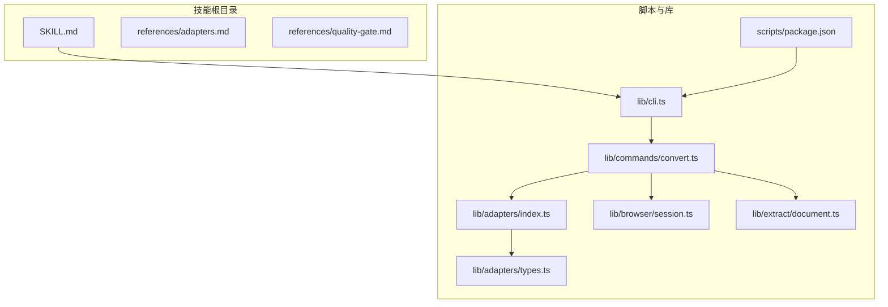
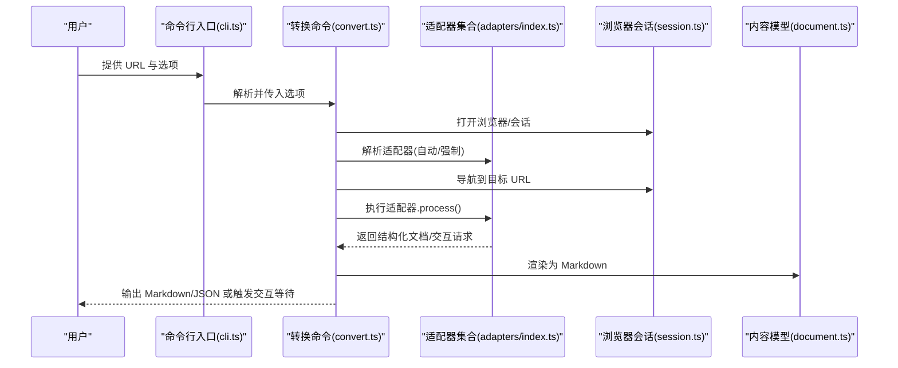
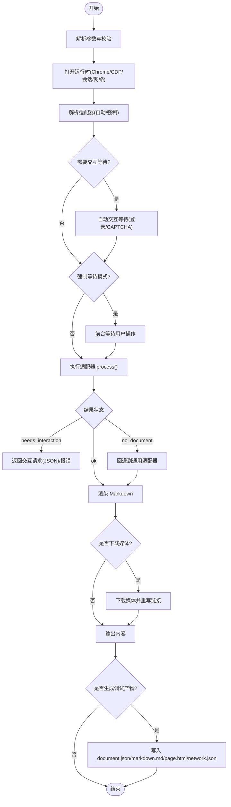
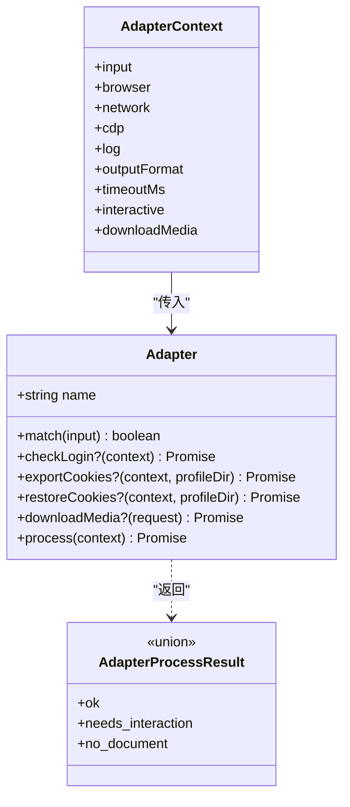
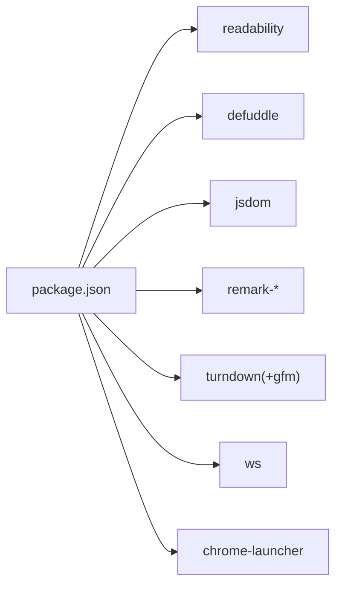

# URL 转 Markdown 技能

<cite>
**本文引用的文件**
- [SKILL.md](file://.agents/skills/baoyu-url-to-markdown/SKILL.md)
- [package.json](file://.agents/skills/baoyu-url-to-markdown/scripts/package.json)
- [cli.ts](file://.agents/skills/baoyu-url-to-markdown/scripts/lib/cli.ts)
- [convert.ts](file://.agents/skills/baoyu-url-to-markdown/scripts/lib/commands/convert.ts)
- [adapters/index.ts](file://.agents/skills/baoyu-url-to-markdown/scripts/lib/adapters/index.ts)
- [adapters/types.ts](file://.agents/skills/baoyu-url-to-markdown/scripts/lib/adapters/types.ts)
- [session.ts](file://.agents/skills/baoyu-url-to-markdown/scripts/lib/browser/session.ts)
- [document.ts](file://.agents/skills/baoyu-url-to-markdown/scripts/lib/extract/document.ts)
- [adapters.md](file://.agents/skills/baoyu-url-to-markdown/references/adapters.md)
- [quality-gate.md](file://.agents/skills/baoyu-url-to-markdown/references/quality-gate.md)
</cite>

## 目录
1. [简介](#简介)
2. [项目结构](#项目结构)
3. [核心组件](#核心组件)
4. [架构总览](#架构总览)
5. [详细组件分析](#详细组件分析)
6. [依赖关系分析](#依赖关系分析)
7. [性能考量](#性能考量)
8. [故障排查指南](#故障排查指南)
9. [结论](#结论)
10. [附录](#附录)

## 简介
本技能通过 Chrome CDP（Chrome DevTools Protocol）抓取任意网页并转换为 Markdown 或 JSON。它内置多种站点适配器（X/Twitter、YouTube、Hacker News、通用），支持无头/可见浏览器、交互式等待（登录/CAPTCHA）、媒体下载与重写、调试产物输出，并提供“质量门禁”检查与恢复流程，确保输出内容真实、完整且可复现。

## 项目结构
技能目录下包含技能说明、脚本与参考文档。脚本以模块化方式组织：命令行入口、适配器集合、浏览器会话与 CDP 客户端、内容抽取与渲染、媒体下载与重写、工具与类型定义等。

图表来源
- [SKILL.md:1-172](file://.agents/skills/baoyu-url-to-markdown/SKILL.md#L1-L172)
- [package.json:1-27](file://.agents/skills/baoyu-url-to-markdown/scripts/package.json#L1-L27)
- [cli.ts:1-228](file://.agents/skills/baoyu-url-to-markdown/scripts/lib/cli.ts#L1-L228)
- [convert.ts:1-581](file://.agents/skills/baoyu-url-to-markdown/scripts/lib/commands/convert.ts#L1-L581)
- [adapters/index.ts:1-30](file://.agents/skills/baoyu-url-to-markdown/scripts/lib/adapters/index.ts#L1-L30)
- [adapters/types.ts:1-74](file://.agents/skills/baoyu-url-to-markdown/scripts/lib/adapters/types.ts#L1-L74)
- [session.ts:1-156](file://.agents/skills/baoyu-url-to-markdown/scripts/lib/browser/session.ts#L1-L156)
- [document.ts:1-52](file://.agents/skills/baoyu-url-to-markdown/scripts/lib/extract/document.ts#L1-L52)

章节来源
- [SKILL.md:1-172](file://.agents/skills/baoyu-url-to-markdown/SKILL.md#L1-L172)
- [package.json:1-27](file://.agents/skills/baoyu-url-to-markdown/scripts/package.json#L1-L27)

## 核心组件
- 命令行入口与参数解析：负责解析用户输入、校验参数、调用转换命令。
- 转换命令：管理浏览器生命周期、适配器选择与执行、交互等待、内容渲染、媒体下载与重写、输出与调试产物。
- 适配器系统：按站点特征抽取结构化内容，提供登录状态检测、Cookie 恢复/导出、媒体下载扩展点。
- 浏览器会话：封装 CDP 页面会话、导航、滚动、点击、前置显示等能力。
- 内容模型：统一的内容块与文档结构，便于渲染与后续处理。
- 参考文档：适配器清单与媒体下载流程、质量门禁检查与恢复策略。

章节来源
- [cli.ts:1-228](file://.agents/skills/baoyu-url-to-markdown/scripts/lib/cli.ts#L1-L228)
- [convert.ts:1-581](file://.agents/skills/baoyu-url-to-markdown/scripts/lib/commands/convert.ts#L1-L581)
- [adapters/index.ts:1-30](file://.agents/skills/baoyu-url-to-markdown/scripts/lib/adapters/index.ts#L1-L30)
- [adapters/types.ts:1-74](file://.agents/skills/baoyu-url-to-markdown/scripts/lib/adapters/types.ts#L1-L74)
- [session.ts:1-156](file://.agents/skills/baoyu-url-to-markdown/scripts/lib/browser/session.ts#L1-L156)
- [document.ts:1-52](file://.agents/skills/baoyu-url-to-markdown/scripts/lib/extract/document.ts#L1-L52)
- [adapters.md:1-78](file://.agents/skills/baoyu-url-to-markdown/references/adapters.md#L1-L78)
- [quality-gate.md:1-43](file://.agents/skills/baoyu-url-to-markdown/references/quality-gate.md#L1-L43)

## 架构总览
整体流程从命令行入口开始，解析参数后打开浏览器会话，根据 URL 自动或强制指定适配器，执行页面导航与交互等待，调用适配器抽取结构化内容，渲染为 Markdown，必要时下载媒体并重写链接，最后输出到控制台或文件，并可生成调试产物。

图表来源
- [cli.ts:80-207](file://.agents/skills/baoyu-url-to-markdown/scripts/lib/cli.ts#L80-L207)
- [convert.ts:368-581](file://.agents/skills/baoyu-url-to-markdown/scripts/lib/commands/convert.ts#L368-L581)
- [adapters/index.ts:13-27](file://.agents/skills/baoyu-url-to-markdown/scripts/lib/adapters/index.ts#L13-L27)
- [session.ts:43-81](file://.agents/skills/baoyu-url-to-markdown/scripts/lib/browser/session.ts#L43-L81)
- [document.ts:39-51](file://.agents/skills/baoyu-url-to-markdown/scripts/lib/extract/document.ts#L39-L51)

## 详细组件分析

### 命令行入口与参数解析
- 功能要点
  - 支持输出格式（markdown/json）、适配器强制选择、媒体下载、调试目录、CDP 复用、浏览器路径、Chrome 用户数据目录、交互等待模式、超时与轮询间隔、是否无头等。
  - 参数校验与错误提示，帮助信息输出。
- 关键行为
  - 将 wait-for 的别名映射为统一模式；将 format 的别名映射为统一格式；对数值型参数进行范围校验。
  - 未提供 URL 或仅 help 时打印帮助文本。

章节来源
- [cli.ts:10-53](file://.agents/skills/baoyu-url-to-markdown/scripts/lib/cli.ts#L10-L53)
- [cli.ts:80-207](file://.agents/skills/baoyu-url-to-markdown/scripts/lib/cli.ts#L80-L207)

### 转换命令与运行时管理
- 运行时资源
  - 启动 Chrome（可复用 CDP 或新建）、建立 CDP 客户端、创建浏览器会话、启动网络日志记录。
- 交互等待策略
  - 自动交互等待：检测登录/CAPTCHA 等交互门，自动轮询直到清除或登录成功。
  - 强制等待：前台打开浏览器，等待用户完成手动操作，基于快照变化自动继续或由用户回车确认。
- 结果处理
  - 成功：渲染 Markdown，可选下载媒体并重写链接，输出到文件或标准输出，生成调试产物。
  - 需要交互：在 JSON 模式下返回交互请求详情；否则抛出错误提示。
  - 回退：若首选适配器未产出文档，则回退到通用适配器。
- Cookie 生命周期
  - 在执行前尝试恢复站点 Cookie；在关闭前尝试导出 Cookie 至侧车目录，便于下次复用。

图表来源
- [convert.ts:368-581](file://.agents/skills/baoyu-url-to-markdown/scripts/lib/commands/convert.ts#L368-L581)

章节来源
- [convert.ts:1-581](file://.agents/skills/baoyu-url-to-markdown/scripts/lib/commands/convert.ts#L1-L581)

### 适配器系统与类型契约
- 适配器接口
  - 名称、匹配规则、可选的登录检测、Cookie 恢复/导出、媒体下载扩展点、核心处理函数。
  - 处理结果三态：成功（含结构化文档与媒体）、需要交互（含交互请求）、无文档。
- 适配器解析
  - 若显式指定名称则强制匹配；否则按顺序匹配首个满足条件的适配器。
- 内置适配器
  - X/Twitter：单推文、文章、线程、登录检测、会话就绪判断。
  - YouTube：字幕/章节、封面、元数据。
  - Hacker News：嵌套评论、故事元数据。
  - 通用：Defuddle + Readability 回退、自动滚动、网络空闲检测。

图表来源
- [adapters/types.ts:51-71](file://.agents/skills/baoyu-url-to-markdown/scripts/lib/adapters/types.ts#L51-L71)
- [adapters/index.ts:1-30](file://.agents/skills/baoyu-url-to-markdown/scripts/lib/adapters/index.ts#L1-L30)

章节来源
- [adapters/types.ts:1-74](file://.agents/skills/baoyu-url-to-markdown/scripts/lib/adapters/types.ts#L1-L74)
- [adapters/index.ts:1-30](file://.agents/skills/baoyu-url-to-markdown/scripts/lib/adapters/index.ts#L1-L30)
- [adapters.md:1-78](file://.agents/skills/baoyu-url-to-markdown/references/adapters.md#L1-L78)

### 浏览器会话与交互门检测
- 能力
  - 创建页面会话、导航、等待页面就绪、前置显示窗口、滚动到底部、元素点击、获取 HTML/标题/URL。
- 交互门
  - 在交互等待阶段检测登录墙、验证码、挑战页等，作为自动继续的依据。
- 平台差异
  - macOS 下可尝试激活已安装浏览器应用，提升可见性体验。

章节来源
- [session.ts:1-156](file://.agents/skills/baoyu-url-to-markdown/scripts/lib/browser/session.ts#L1-L156)
- [convert.ts:293-344](file://.agents/skills/baoyu-url-to-markdown/scripts/lib/commands/convert.ts#L293-L344)

### 内容模型与渲染
- 数据模型
  - 文档包含 URL、标题、作者、发布时间、摘要、内容块数组、元数据、适配器标识等。
  - 内容块覆盖段落、标题、列表、引用、代码、图片、HTML、Markdown 片段等。
- 渲染
  - 将结构化内容渲染为 Markdown 字符串，供输出或进一步处理。

章节来源
- [document.ts:1-52](file://.agents/skills/baoyu-url-to-markdown/scripts/lib/extract/document.ts#L1-L52)
- [convert.ts:509-513](file://.agents/skills/baoyu-url-to-markdown/scripts/lib/commands/convert.ts#L509-L513)

### 质量门禁与恢复流程
- 低质量风险
  - 无头模式可能返回壳层、登录墙、框架载荷等，CLI 不报错但内容无效。
- 检查清单
  - 标题与页面一致、正文包含预期内容、排除错误页与极短文本、识别登录/验证/订阅/框架载荷等信号。
- 恢复策略
  - 默认先无头尝试；若质量不佳，切换到交互等待（自动检测登录/CAPTCHA）或强制等待（前台+手动/自动判定）。
  - JSON 输出包含状态与登录信息，辅助决策。

章节来源
- [quality-gate.md:1-43](file://.agents/skills/baoyu-url-to-markdown/references/quality-gate.md#L1-L43)
- [convert.ts:19-41](file://.agents/skills/baoyu-url-to-markdown/scripts/lib/commands/convert.ts#L19-L41)

## 依赖关系分析
- 运行时依赖
  - @mozilla/readability：用于 HTML 清洗与可读性提取。
  - defuddle：通用内容抽取工具。
  - jsdom：DOM 环境支持。
  - remark 生态：Markdown 解析与渲染。
  - turndown：HTML 到 Markdown 转换。
  - ws：WebSocket（CDP 通信）。
- 二进制与工具
  - chrome-launcher：启动/管理 Chrome 实例。
- 本地脚本
  - 通过 package.json 的 bin 映射暴露命令行入口。

图表来源
- [package.json:11-22](file://.agents/skills/baoyu-url-to-markdown/scripts/package.json#L11-L22)

章节来源
- [package.json:1-27](file://.agents/skills/baoyu-url-to-markdown/scripts/package.json#L1-L27)

## 性能考量
- 导航与就绪
  - 等待 document.readyState 至 interactive 或 complete，避免过早抽取。
- 滚动加载
  - 分步滚动至底部，结合延迟与最大步数，兼顾稳定性与性能。
- 超时与轮询
  - 页面加载超时、交互等待超时、轮询间隔需权衡准确度与耗时。
- 无头 vs 可见
  - 默认无头以提升吞吐；遇到复杂渲染/懒加载时启用可见模式。
- 网络与调试
  - 启用网络日志有助于定位卡顿与资源问题；调试产物可用于离线分析。

章节来源
- [session.ts:71-81](file://.agents/skills/baoyu-url-to-markdown/scripts/lib/browser/session.ts#L71-L81)
- [session.ts:131-150](file://.agents/skills/baoyu-url-to-markdown/scripts/lib/browser/session.ts#L131-L150)
- [convert.ts:37-44](file://.agents/skills/baoyu-url-to-markdown/scripts/lib/commands/convert.ts#L37-L44)

## 故障排查指南
- 常见问题
  - Chrome 未找到：使用 --browser-path 指定二进制路径。
  - 超时：增大 --timeout 或交互等待相关参数。
  - 登录/CAPTCHA：使用 --wait-for interaction 或 --wait-for force。
  - 低质量内容：遵循质量门禁检查，必要时切换等待模式。
  - 媒体下载失败：确认输出路径存在且有写权限，或调整媒体目录。
- 调试手段
  - 使用 --debug-dir 输出 document.json、markdown.md、page.html、network.json。
  - 查看 JSON 输出中的状态与登录信息，辅助判断下一步策略。

章节来源
- [SKILL.md:161-167](file://.agents/skills/baoyu-url-to-markdown/SKILL.md#L161-L167)
- [convert.ts:130-148](file://.agents/skills/baoyu-url-to-markdown/scripts/lib/commands/convert.ts#L130-L148)
- [quality-gate.md:17-31](file://.agents/skills/baoyu-url-to-markdown/references/quality-gate.md#L17-L31)

## 结论
该技能以模块化架构实现“网页到 Markdown”的高可靠转换：通过适配器体系覆盖主流站点，借助浏览器自动化与交互等待应对复杂页面，配合质量门禁与调试产物保障输出质量。对于通用场景优先采用默认无头模式，遇阻再切换交互等待，既保证吞吐又兼顾准确性。

## 附录

### 支持的站点与适配器
- X/Twitter：单推文、文章、线程、登录检测。
- YouTube：字幕/章节、封面、元数据。
- Hacker News：嵌套评论、故事元数据。
- 通用：Defuddle + Readability 回退、自动滚动、网络空闲检测。

章节来源
- [adapters.md:7-14](file://.agents/skills/baoyu-url-to-markdown/references/adapters.md#L7-L14)

### 输出格式与媒体下载
- 输出格式：markdown（默认）或 json。
- 媒体下载：ask/always/never 三种策略；下载后重写 Markdown 链接。
- JSON 字段：适配器、状态、登录状态、交互细节、结构化文档、媒体列表、Markdown 文本、下载结果。

章节来源
- [adapters.md:64-78](file://.agents/skills/baoyu-url-to-markdown/references/adapters.md#L64-L78)

### 开发与测试指南
- 新增适配器步骤
  - 在适配器目录新增子目录与入口，实现匹配逻辑、登录检测、处理函数与可选的媒体下载。
  - 在适配器索引中注册新适配器，确保自动匹配生效。
  - 编写最小可用测试用例（公开页面、登录保护页面、复杂加载页面）。
- 质量门禁
  - 每次无头运行后必须进行质量检查；如需交互，优先使用自动交互等待，再考虑强制等待。
- 参考
  - 适配器清单与媒体流程、质量门禁检查与恢复策略。

章节来源
- [adapters/index.ts:1-30](file://.agents/skills/baoyu-url-to-markdown/scripts/lib/adapters/index.ts#L1-L30)
- [adapters.md:1-78](file://.agents/skills/baoyu-url-to-markdown/references/adapters.md#L1-L78)
- [quality-gate.md:1-43](file://.agents/skills/baoyu-url-to-markdown/references/quality-gate.md#L1-L43)