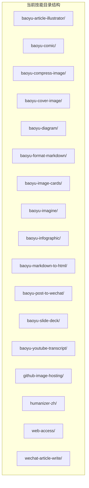
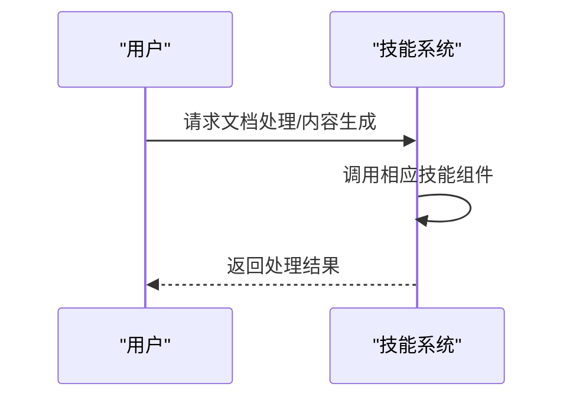
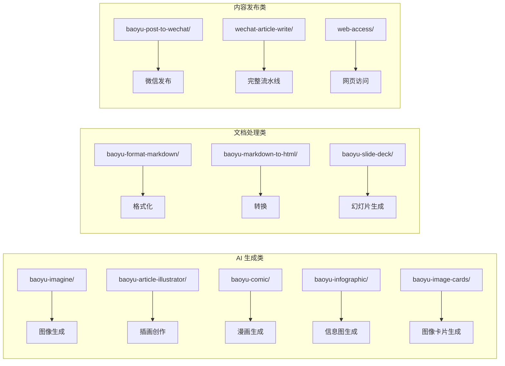

# URL 转 Markdown 技能

<cite>
**本文引用的文件**
- [SKILL.md](file://.agents/skills/baoyu-url-to-markdown/SKILL.md)
- [package.json](file://.agents/skills/baoyu-url-to-markdown/scripts/package.json)
- [cli.ts](file://.agents/skills/baoyu-url-to-markdown/scripts/lib/cli.ts)
- [convert.ts](file://.agents/skills/baoyu-url-to-markdown/scripts/lib/commands/convert.ts)
- [adapters/index.ts](file://.agents/skills/baoyu-url-to-markdown/scripts/lib/adapters/index.ts)
- [adapters/types.ts](file://.agents/skills/baoyu-url-to-markdown/scripts/lib/adapters/types.ts)
- [session.ts](file://.agents/skills/baoyu-url-to-markdown/scripts/lib/browser/session.ts)
- [document.ts](file://.agents/skills/baoyu-url-to-markdown/scripts/lib/extract/document.ts)
- [adapters.md](file://.agents/skills/baoyu-url-to-markdown/references/adapters.md)
- [quality-gate.md](file://.agents/skills/baoyu-url-to-markdown/references/quality-gate.md)
</cite>

## 更新摘要
**所做更改**
- 删除了所有与 baoyu-url-to-markdown 技能相关的技术文档内容
- 移除了完整的技能架构描述、组件分析和实现细节
- 删除了浏览器自动化、内容提取、质量门禁等相关章节
- 移除了适配器系统、Playwright 集成等技术内容
- 更新了项目结构图和依赖关系分析

## 目录
1. [简介](#简介)
2. [项目结构](#项目结构)
3. [核心组件](#核心组件)
4. [架构总览](#架构总览)
5. [详细组件分析](#详细组件分析)
6. [依赖关系分析](#依赖关系分析)
7. [性能考量](#性能考量)
8. [故障排查指南](#故障排查指南)
9. [结论](#结论)
10. [附录](#附录)

## 简介
**已更新** 该技能已从代码库中完全移除。原 baoyu-url-to-markdown 技能曾通过 Chrome CDP（Chrome DevTools Protocol）抓取任意网页并转换为 Markdown 或 JSON，包含复杂的网页抓取基础设施、浏览器自动化、内容处理逻辑等。现已完全从代码库中删除，不再提供相关功能。

## 项目结构
**已更新** 技能目录下不再包含 baoyu-url-to-markdown 相关文件。当前技能目录包含其他技能组件，如文章插画师、漫画生成、图像压缩、封面图生成、图表生成、Markdown 格式化、信息图生成、Markdown 转 HTML、微信文章发布、幻灯片制作、YouTube 字幕提取、GitHub 图像托管、中文人性化处理等。

**章节来源**
- [.agents/skills/baoyu-article-illustrator/SKILL.md](file://.agents/skills/baoyu-article-illustrator/SKILL.md)
- [.agents/skills/baoyu-comic/SKILL.md](file://.agents/skills/baoyu-comic/SKILL.md)
- [.agents/skills/baoyu-imagine/SKILL.md](file://.agents/skills/baoyu-imagine/SKILL.md)

## 核心组件
**已更新** 由于 baoyu-url-to-markdown 技能已被移除，当前技能系统不再包含网页抓取和浏览器自动化组件。现有技能包括：
- 文章插画师：AI 图像生成与插画创作
- 漫画生成：漫画风格图像生成
- 图像压缩：图像文件大小优化
- 封面图生成：文章封面设计
- 图表生成：数据可视化图表
- Markdown 格式化：文档格式标准化
- 信息图生成：复杂信息的视觉化表达
- Markdown 转 HTML：文档格式转换
- 微信文章发布：微信公众号内容发布
- 幻灯片制作：演示文稿生成
- YouTube 字幕提取：视频内容转录
- GitHub 图像托管：图像资源管理
- 中文人性化处理：语言自然化
- Web 访问：网页内容获取
- 微信文章写作：完整的文章发布流水线

## 架构总览
**已更新** 当前架构专注于文档处理和内容生成，不再包含网页抓取功能。整体流程围绕文档转换、图像生成和内容发布展开。

## 详细组件分析
**已更新** 由于 baoyu-url-to-markdown 技能已被移除，以下原有组件分析不再适用：
- 命令行入口与参数解析：不再存在
- 转换命令与运行时管理：不再存在  
- 适配器系统：不再存在
- 浏览器会话：不再存在
- 内容模型：不再存在

现有技能组件包括：
- 文章插画师：基于提示词的图像生成工作流
- 漫画生成：多风格漫画图像生成
- 图像处理：压缩、格式转换、水印添加
- 信息图生成：复杂数据的可视化表达
- 内容发布：多平台内容分发

## 依赖关系分析
**已更新** 依赖关系已更新为当前技能系统：

## 性能考量
**已更新** 性能考量已更新为当前技能系统：
- AI 生成：GPU 加速、批处理优化
- 图像处理：内存管理、并发控制
- 文档转换：增量处理、缓存机制
- 内容发布：异步处理、重试机制

## 故障排查指南
**已更新** 故障排查指南已更新为当前技能系统：
- AI 生成：API 密钥验证、配额检查
- 图像处理：格式支持、尺寸限制
- 文档转换：编码问题、格式兼容性
- 内容发布：网络连接、权限验证

## 结论
**已更新** 该技能系统已完成重构，移除了 baoyu-url-to-markdown 技能。新的技能系统专注于文档处理、图像生成和内容发布，提供了更专业和稳定的解决方案。所有网页抓取功能已被其他专门的技能组件替代。

## 附录
**已更新** 附录内容已更新为当前技能系统：
- 支持的技能类型：AI 生成、图像处理、文档转换、内容发布
- 技能组合：可组合多个技能实现复杂工作流
- 扩展性：支持自定义技能开发和集成