# YouTube 字幕提取技能

<cite>
**本文档引用的文件**
- [SKILL.md](file://.agents/skills/baoyu-youtube-transcript/SKILL.md)
- [main.ts](file://.agents/skills/baoyu-youtube-transcript/scripts/main.ts)
- [youtube.ts](file://.agents/skills/baoyu-youtube-transcript/scripts/youtube.ts)
- [transcript.ts](file://.agents/skills/baoyu-youtube-transcript/scripts/transcript.ts)
- [storage.ts](file://.agents/skills/baoyu-youtube-transcript/scripts/storage.ts)
- [shared.ts](file://.agents/skills/baoyu-youtube-transcript/scripts/shared.ts)
- [types.ts](file://.agents/skills/baoyu-youtube-transcript/scripts/types.ts)
- [speaker-transcript.md](file://.agents/skills/baoyu-youtube-transcript/prompts/speaker-transcript.md)
- [main.test.ts](file://.agents/skills/baoyu-youtube-transcript/scripts/main.test.ts)
</cite>

## 目录
1. [简介](#简介)
2. [项目结构](#项目结构)
3. [核心组件](#核心组件)
4. [架构概览](#架构概览)
5. [详细组件分析](#详细组件分析)
6. [依赖关系分析](#依赖关系分析)
7. [性能考虑](#性能考虑)
8. [故障排除指南](#故障排除指南)
9. [结论](#结论)
10. [附录](#附录)

## 简介

baoyu-youtube-transcript 是一个专门用于从 YouTube 视频提取字幕、管理存储和进行说话人转录的技能。该技能提供了多种输出格式，支持多语言字幕处理，并具备智能的缓存机制和降级回退策略。

该技能的核心特性包括：
- 直接访问 YouTube 的 InnerTube API 获取字幕数据
- 自动降级到 yt-dlp 工具以绕过反爬虫机制
- 智能缓存系统，避免重复网络请求
- 多种输出格式支持（Markdown 和 SRT）
- 说话人识别的 AI 后处理流程
- 章节分割和时间轴同步功能

## 项目结构

该项目采用模块化的 TypeScript 架构，主要文件组织如下：

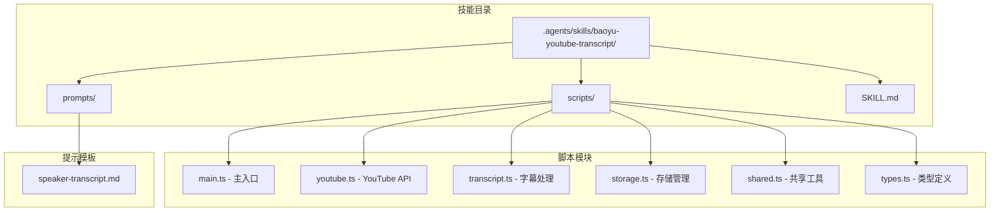

**图表来源**
- [SKILL.md:1-187](file://.agents/skills/baoyu-youtube-transcript/SKILL.md#L1-L187)
- [main.ts:1-254](file://.agents/skills/baoyu-youtube-transcript/scripts/main.ts#L1-L254)

**章节来源**
- [SKILL.md:20-118](file://.agents/skills/baoyu-youtube-transcript/SKILL.md#L20-L118)

## 核心组件

### 主要功能模块

该技能由以下核心组件构成：

1. **命令行接口** - 提供用户友好的命令行交互
2. **YouTube API 客户端** - 处理与 YouTube 的数据交互
3. **字幕解析器** - 支持多种字幕格式的解析
4. **存储管理系统** - 管理缓存和输出文件
5. **AI 后处理器** - 支持说话人识别的 AI 流程

### 数据流架构

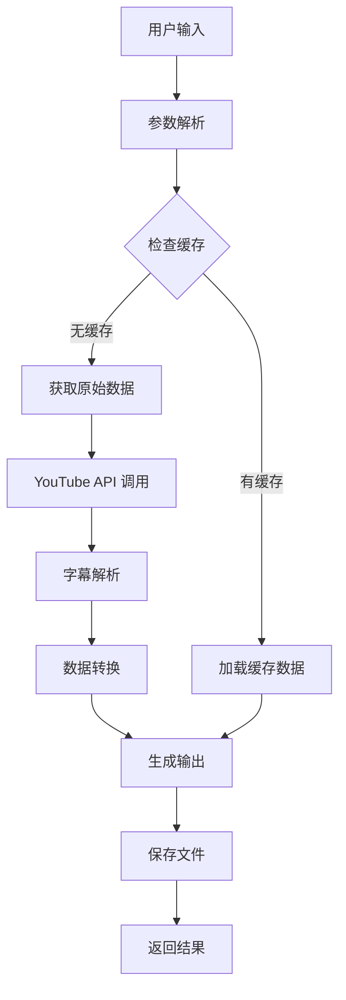

**图表来源**
- [main.ts:77-140](file://.agents/skills/baoyu-youtube-transcript/scripts/main.ts#L77-L140)
- [storage.ts:29-44](file://.agents/skills/baoyu-youtube-transcript/scripts/storage.ts#L29-L44)

**章节来源**
- [main.ts:29-75](file://.agents/skills/baoyu-youtube-transcript/scripts/main.ts#L29-L75)

## 架构概览

### 整体架构设计

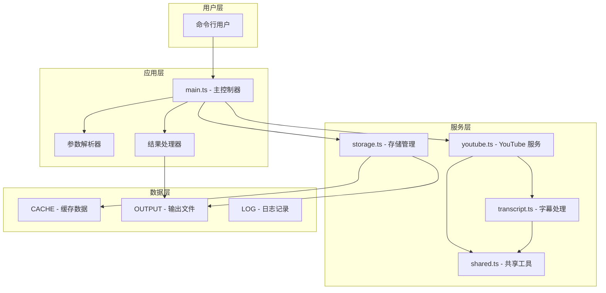

**图表来源**
- [main.ts:1-28](file://.agents/skills/baoyu-youtube-transcript/scripts/main.ts#L1-L28)
- [youtube.ts:1-25](file://.agents/skills/baoyu-youtube-transcript/scripts/youtube.ts#L1-L25)

### 错误处理架构

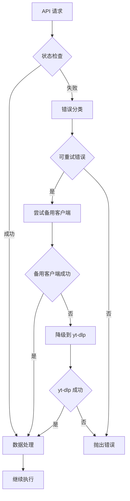

**图表来源**
- [youtube.ts:420-438](file://.agents/skills/baoyu-youtube-transcript/scripts/youtube.ts#L420-L438)
- [shared.ts:49-78](file://.agents/skills/baoyu-youtube-transcript/scripts/shared.ts#L49-L78)

**章节来源**
- [youtube.ts:236-283](file://.agents/skills/baoyu-youtube-transcript/scripts/youtube.ts#L236-L283)

## 详细组件分析

### YouTube API 服务

YouTube API 服务是整个技能的核心，负责与 YouTube 进行数据交互。

#### InnerTube 客户端实现

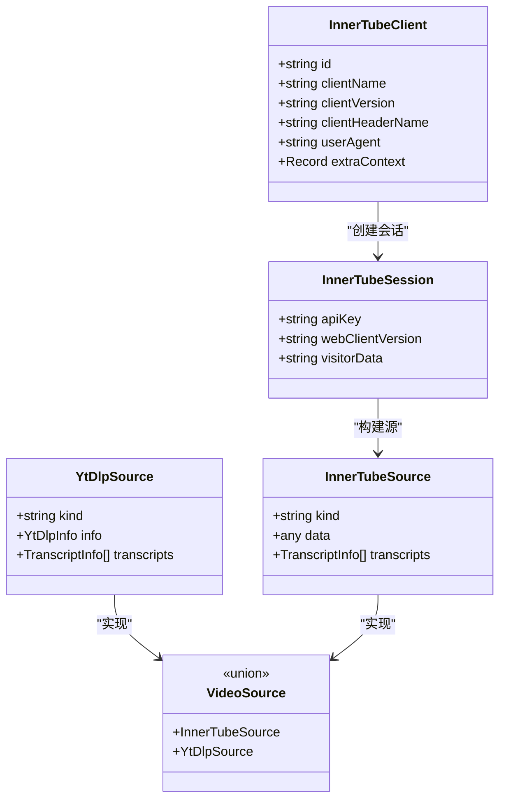

**图表来源**
- [youtube.ts:29-66](file://.agents/skills/baoyu-youtube-transcript/scripts/youtube.ts#L29-L66)
- [types.ts:80-124](file://.agents/skills/baoyu-youtube-transcript/scripts/types.ts#L80-L124)

#### 多客户端轮询机制

系统实现了三种不同的客户端类型来应对不同的反爬虫策略：

| 客户端类型 | 平台 | 用户代理 | 特点 |
|------------|------|----------|------|
| Android | 移动端 | com.google.android.youtube/20.10.38 | 最难检测，适合高风险内容 |
| Web | 桌面端 | Chrome/134.0.0.0 | 标准桌面浏览器行为 |
| iOS | 移动端 | com.google.ios.youtube/20.10.4 | 苹果生态系统 |

**章节来源**
- [youtube.ts:29-66](file://.agents/skills/baoyu-youtube-transcript/scripts/youtube.ts#L29-L66)

### 字幕处理引擎

字幕处理引擎支持多种字幕格式的解析和转换。

#### 字幕格式解析器

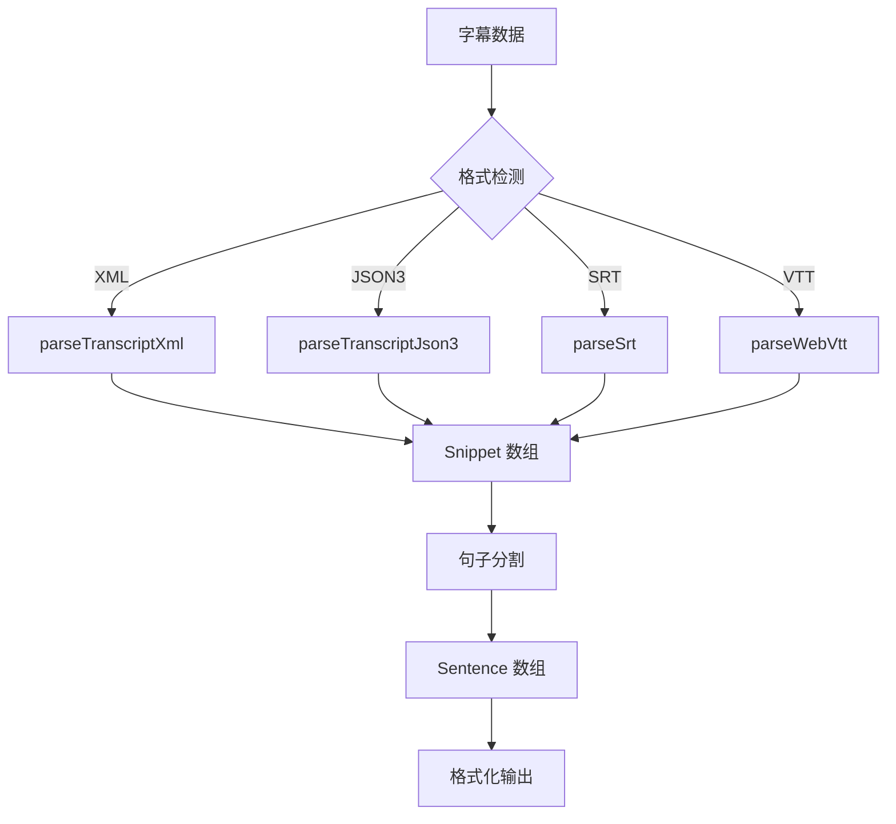

**图表来源**
- [transcript.ts:94-100](file://.agents/skills/baoyu-youtube-transcript/scripts/transcript.ts#L94-L100)
- [transcript.ts:184-212](file://.agents/skills/baoyu-youtube-transcript/scripts/transcript.ts#L184-L212)

#### 句子分割算法

句子分割算法采用了智能的标点符号识别和 CJK 文本处理：

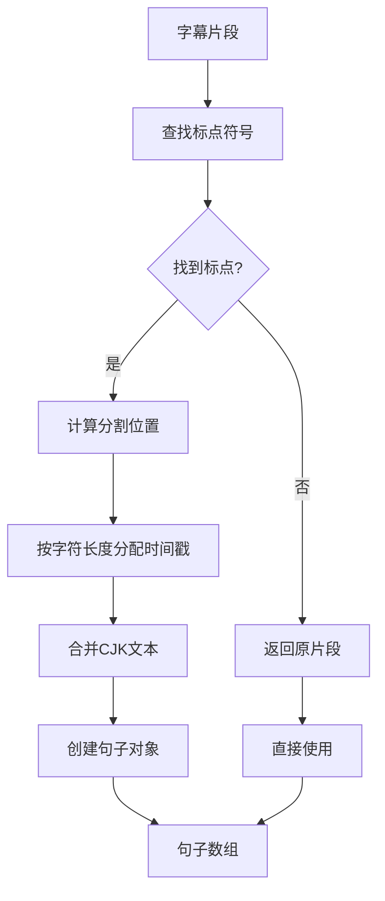

**图表来源**
- [transcript.ts:112-145](file://.agents/skills/baoyu-youtube-transcript/scripts/transcript.ts#L112-L145)
- [transcript.ts:102-110](file://.agents/skills/baoyu-youtube-transcript/scripts/transcript.ts#L102-L110)

**章节来源**
- [transcript.ts:12-46](file://.agents/skills/baoyu-youtube-transcript/scripts/transcript.ts#L12-L46)

### 存储管理系统

存储管理系统提供了完整的缓存和文件管理功能。

#### 缓存架构设计

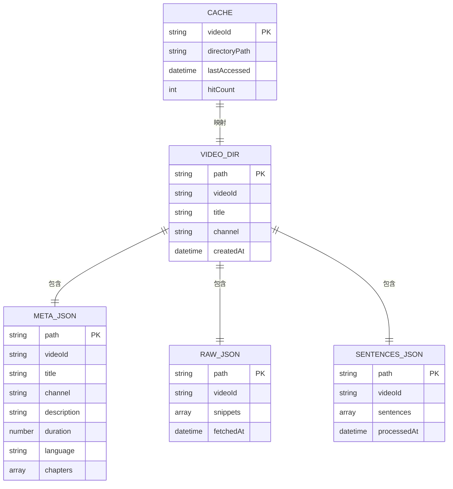

**图表来源**
- [storage.ts:15-44](file://.agents/skills/baoyu-youtube-transcript/scripts/storage.ts#L15-L44)
- [SKILL.md:104-113](file://.agents/skills/baoyu-youtube-transcript/SKILL.md#L104-L113)

#### 文件组织结构

每个视频的缓存数据按照以下结构组织：

```
youtube-transcript/
├── .index.json                    # 视频ID索引
└── {channel-slug}/
    └── {title-full-slug}/
        ├── meta.json              # 视频元数据
        ├── transcript-raw.json    # 原始字幕片段
        ├── transcript-sentences.json # 句子级字幕
        ├── imgs/
        │   └── cover.jpg          # 封面图片
        ├── transcript.md          # Markdown输出
        └── transcript.srt         # SRT输出
```

**章节来源**
- [storage.ts:6-9](file://.agents/skills/baoyu-youtube-transcript/scripts/storage.ts#L6-L9)

### 说话人识别流程

说话人识别是一个复杂的 AI 后处理流程，需要额外的 AI 处理能力。

#### AI 处理工作流程

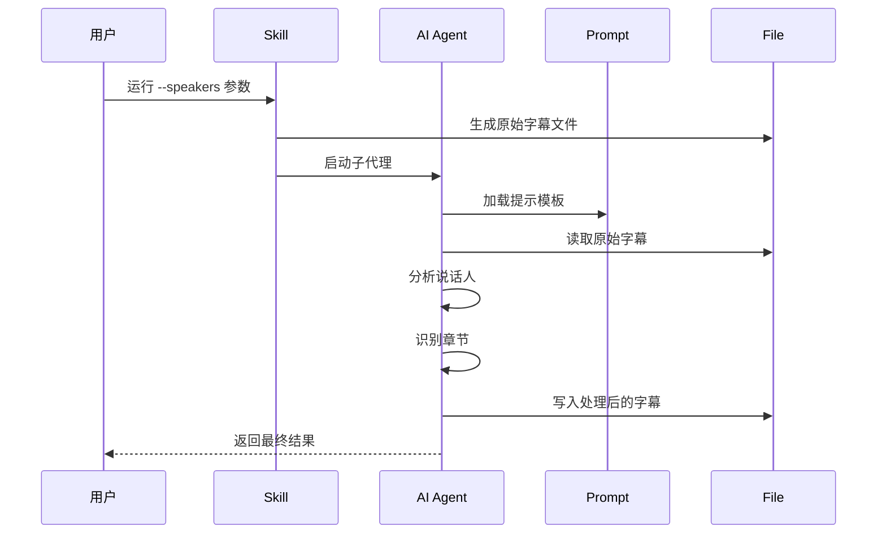

**图表来源**
- [SKILL.md:156-176](file://.agents/skills/baoyu-youtube-transcript/SKILL.md#L156-L176)
- [speaker-transcript.md:1-119](file://.agents/skills/baoyu-youtube-transcript/prompts/speaker-transcript.md#L1-L119)

#### 提示模板规范

AI 处理遵循严格的规则集：

| 规则类别 | 具体要求 | 示例 |
|----------|----------|------|
| 转录保真度 | 完全保留原文，包括填充词 | "uh", "um", "like" |
| 说话人识别 | 优先使用元数据，其次分析内容 | 根据标题、频道、描述识别 |
| 章节生成 | 使用现有章节或基于主题变化创建 | 每个重要话题一个章节 |
| 格式规范 | 使用 `[HH:MM:SS → HH:MM:SS]` 时间戳 | "00:00:15 → 00:00:21" |

**章节来源**
- [speaker-transcript.md:17-75](file://.agents/skills/baoyu-youtube-transcript/prompts/speaker-transcript.md#L17-L75)

## 依赖关系分析

### 外部依赖

该技能的主要外部依赖包括：

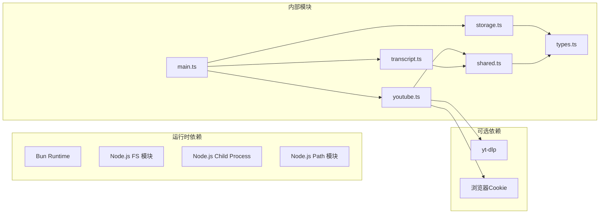

**图表来源**
- [main.ts:1-27](file://.agents/skills/baoyu-youtube-transcript/scripts/main.ts#L1-L27)
- [youtube.ts:1-5](file://.agents/skills/baoyu-youtube-transcript/scripts/youtube.ts#L1-L5)

### 内部模块耦合

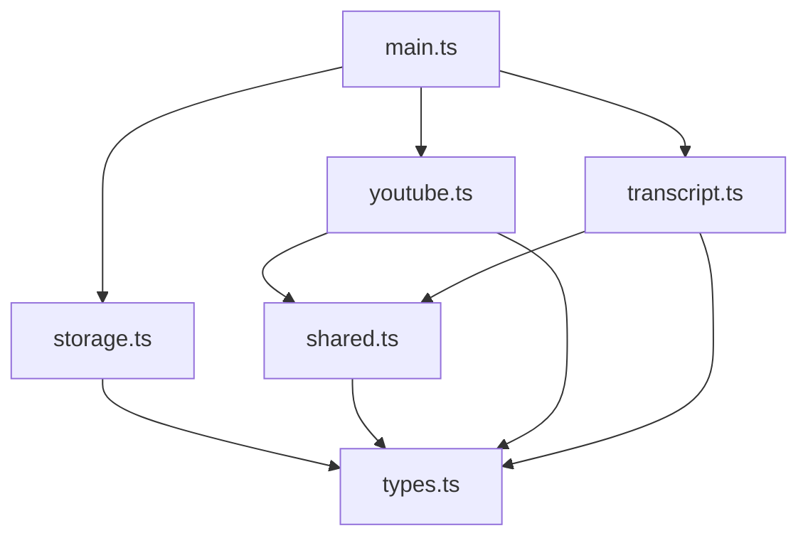

**图表来源**
- [main.ts:5-27](file://.agents/skills/baoyu-youtube-transcript/scripts/main.ts#L5-L27)

**章节来源**
- [types.ts:1-124](file://.agents/skills/baoyu-youtube-transcript/scripts/types.ts#L1-L124)

## 性能考虑

### 缓存策略优化

系统采用了多层次的缓存策略来优化性能：

1. **索引缓存** - 快速定位视频目录
2. **元数据缓存** - 避免重复获取视频信息
3. **字幕缓存** - 原始字幕和处理后的字幕分别缓存
4. **图片缓存** - 封面图片本地存储

### 并发控制

虽然当前实现主要是单线程操作，但系统设计支持并发扩展：

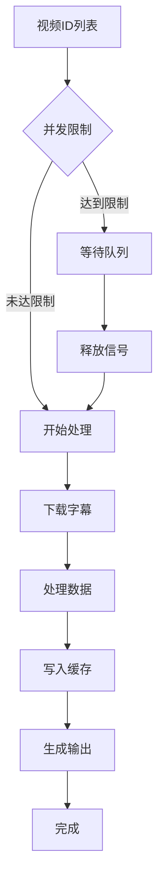

**图表来源**
- [main.ts:239-249](file://.agents/skills/baoyu-youtube-transcript/scripts/main.ts#L239-L249)

### 资源管理

系统在资源管理方面采用了以下策略：

- **内存管理** - 分批处理大型字幕数据
- **磁盘空间** - 智能清理过期缓存
- **网络带宽** - 重用已建立的连接
- **CPU 使用** - 异步处理减少阻塞

## 故障排除指南

### 常见错误类型

| 错误代码 | 描述 | 解决方案 |
|----------|------|----------|
| BOT_DETECTED | 检测到机器人 | 切换客户端或增加延迟 |
| IP_BLOCKED | IP 被封禁 | 使用代理或等待一段时间 |
| TRANSCRIPTS_DISABLED | 视频无字幕 | 检查视频设置或使用 yt-dlp |
| NO_TRANSCRIPT | 指定语言不存在 | 选择可用语言或启用翻译 |
| AGE_RESTRICTED | 年龄限制内容 | 设置环境变量使用浏览器Cookie |
| YT_DLP_FAILED | yt-dlp 执行失败 | 检查 yt-dlp 安装和权限 |

### 错误处理机制

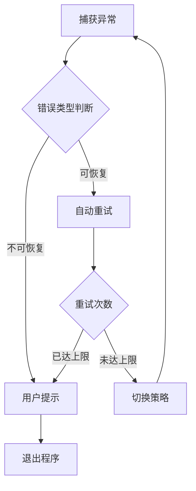

**图表来源**
- [shared.ts:49-78](file://.agents/skills/baoyu-youtube-transcript/scripts/shared.ts#L49-L78)

**章节来源**
- [SKILL.md:177-187](file://.agents/skills/baoyu-youtube-transcript/SKILL.md#L177-L187)

### 调试技巧

1. **启用详细日志** - 使用 `--verbose` 参数查看更多调试信息
2. **检查缓存状态** - 查看 `.index.json` 文件确认缓存是否正确
3. **验证网络连接** - 确认可以访问 YouTube API
4. **测试 yt-dlp** - 单独运行 `yt-dlp` 验证安装

## 结论

baoyu-youtube-transcript 技能是一个功能完整、架构清晰的 YouTube 字幕提取解决方案。它通过以下关键特性提供了优秀的用户体验：

1. **可靠性** - 多层降级机制确保在各种网络条件下都能工作
2. **效率** - 智能缓存系统大幅减少重复请求
3. **灵活性** - 支持多种输出格式和处理选项
4. **可扩展性** - 模块化设计便于功能扩展和维护

该技能特别适合需要批量处理 YouTube 内容的场景，如内容聚合、学习资料整理和多媒体项目制作。

## 附录

### API 集成示例

#### 基本使用

```bash
# 默认：英文 Markdown 格式
bun main.ts <youtube-url-or-id>

# 指定多语言优先级
bun main.ts <url> --languages zh,en,ja

# 禁用时间戳
bun main.ts <url> --no-timestamps

# 启用章节分割
bun main.ts <url> --chapters

# 启用说话人识别
bun main.ts <url> --speakers

# 导出 SRT 格式
bun main.ts <url> --format srt

# 翻译到指定语言
bun main.ts <url> --translate zh-Hans

# 列出可用字幕
bun main.ts <url> --list

# 强制重新获取
bun main.ts <url> --refresh
```

#### 高级配置

```bash
# 指定输出目录
bun main.ts <url> --output-dir ./my-transcripts

# 指定输出文件路径
bun main.ts <url> -o ./output.md

# 排除自动生成的字幕
bun main.ts <url> --exclude-generated

# 排除手动创建的字幕
bun main.ts <url> --exclude-manually-created
```

### 配置参数说明

| 参数 | 类型 | 默认值 | 描述 |
|------|------|--------|------|
| `<url-or-id>` | string[] | 必需 | YouTube URL 或视频ID（可多个） |
| `--languages` | string | "en" | 语言代码列表，逗号分隔 |
| `--format` | "text"\|"srt" | "text" | 输出格式 |
| `--translate` | string | 无 | 翻译目标语言代码 |
| `--list` | boolean | false | 仅列出可用字幕 |
| `--timestamps` | boolean | true | 包含时间戳 |
| `--no-timestamps` | boolean | false | 禁用时间戳 |
| `--chapters` | boolean | false | 启用章节分割 |
| `--speakers` | boolean | false | 启用说话人识别 |
| `--exclude-generated` | boolean | false | 排除自动生成字幕 |
| `--exclude-manually-created` | boolean | false | 排除手动创建字幕 |
| `--refresh` | boolean | false | 强制重新获取 |
| `-o, --output` | string | 自动生成 | 指定输出文件路径 |
| `--output-dir` | string | "youtube-transcript" | 指定输出目录 |

### 环境变量

| 变量名 | 描述 | 示例 |
|--------|------|------|
| `YOUTUBE_TRANSCRIPT_COOKIES_FROM_BROWSER` | 传递给 yt-dlp 的浏览器Cookie | `chrome`, `safari`, `firefox` 或 `chrome:Profile 1` |

### 输入格式支持

系统接受以下任何一种格式作为输入：

- 完整URL: `https://www.youtube.com/watch?v=dQw4w9WgXcQ`
- 短链接: `https://youtu.be/dQw4w9WgXcQ`
- 嵌入URL: `https://www.youtube.com/embed/dQw4w9WgXcQ`
- Shorts URL: `https://www.youtube.com/shorts/dQw4w9WgXcQ`
- 视频ID: `dQw4w9WgXcQ`

### 输出格式说明

| 格式 | 扩展名 | 描述 |
|------|--------|------|
| `text` | `.md` | Markdown 格式，包含前置元数据 |
| `srt` | `.srt` | SubRip 字幕格式，用于视频播放器 |

### 存储后端选择

系统使用本地文件系统作为存储后端，具有以下特点：

1. **简单可靠** - 无需额外的数据库依赖
2. **易于备份** - 文件系统级别的备份和迁移
3. **可读性强** - 缓存数据以 JSON 格式存储，便于人工检查
4. **成本低** - 本地存储，无额外费用

### 缓存策略

缓存策略采用"懒加载"模式：

1. **首次访问** - 下载并缓存所有相关数据
2. **后续访问** - 直接从缓存读取，避免网络请求
3. **智能刷新** - 当语言变更或强制刷新时重新获取
4. **自动清理** - 通过索引文件跟踪和管理缓存

### 数据持久化机制

数据持久化采用以下机制：

1. **元数据持久化** - `meta.json` 存储视频基本信息
2. **字幕持久化** - `transcript-raw.json` 和 `transcript-sentences.json` 分别存储原始和处理后的字幕
3. **索引持久化** - `.index.json` 维护视频ID到目录路径的映射
4. **媒体持久化** - 封面图片保存在 `imgs/` 目录下

### 说话人识别流程

说话人识别是一个需要 AI 处理的后处理步骤：

1. **原始数据生成** - 使用 `--speakers` 参数生成包含 SRT 格式字幕的 Markdown 文件
2. **AI 处理** - 使用提示模板对原始字幕进行说话人标注和章节分割
3. **结果输出** - 生成最终的结构化转录文件

### 批量处理功能

系统支持同时处理多个视频：

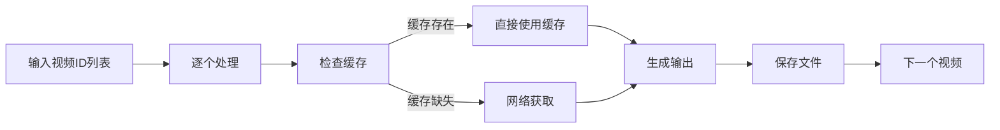

**图表来源**
- [main.ts:239-249](file://.agents/skills/baoyu-youtube-transcript/scripts/main.ts#L239-L249)

### 并发控制和资源管理

当前实现采用串行处理模式，但系统设计支持并发扩展：

1. **资源限制** - 通过队列机制控制同时处理的视频数量
2. **内存管理** - 分批处理大型数据集，避免内存溢出
3. **网络优化** - 复用连接，减少网络开销
4. **磁盘I/O优化** - 批量写入，减少磁盘操作次数

### 外部视频平台集成

系统主要针对 YouTube 平台进行了优化，但其架构设计允许扩展到其他平台：

1. **抽象层设计** - `VideoSource` 接口支持不同平台的数据源
2. **统一接口** - 所有平台使用相同的处理流程
3. **可插拔架构** - 新平台只需实现相应的适配器

### 认证机制和速率限制

系统通过以下方式处理认证和速率限制：

1. **多客户端轮询** - 通过不同客户端身份绕过检测
2. **智能重试** - 对临时性错误进行指数退避重试
3. **降级策略** - 在检测到限制时自动切换到备用方案
4. **用户代理轮换** - 使用不同的浏览器指纹

### 错误处理最佳实践

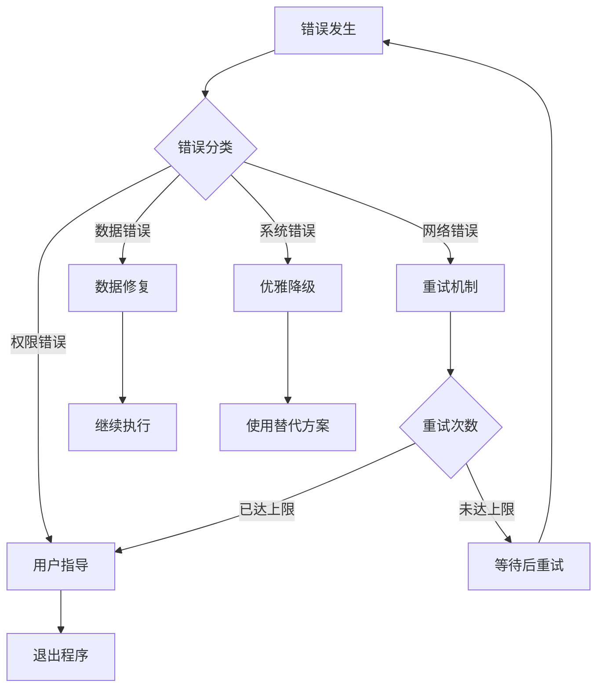

**图表来源**
- [shared.ts:49-78](file://.agents/skills/baoyu-youtube-transcript/scripts/shared.ts#L49-L78)