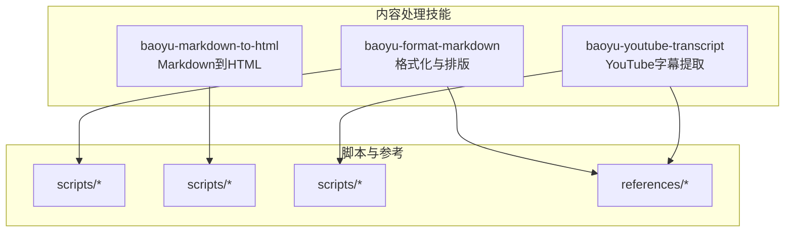
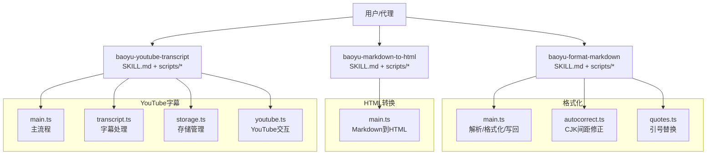
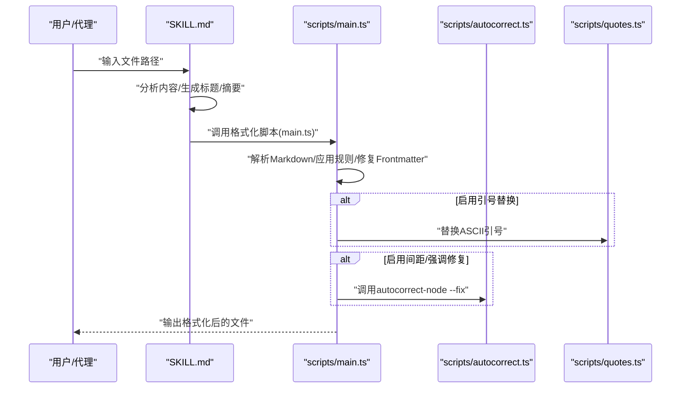
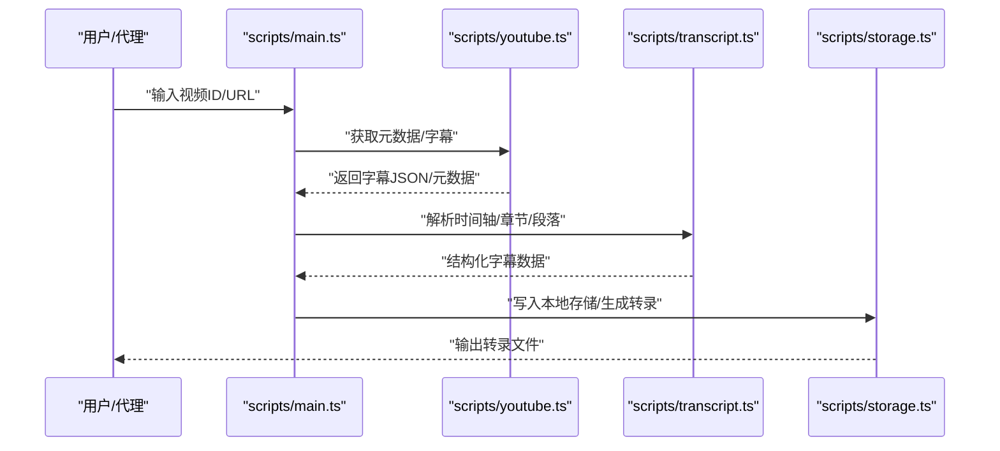
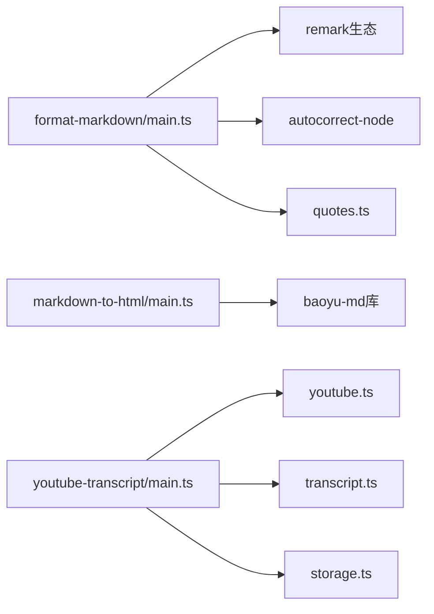

# 内容处理技能

<cite>
**本文引用的文件**
- [baoyu-format-markdown/SKILL.md](file://.agents/skills/baoyu-format-markdown/SKILL.md)
- [baoyu-format-markdown/scripts/main.ts](file://.agents/skills/baoyu-format-markdown/scripts/main.ts)
- [baoyu-format-markdown/scripts/autocorrect.ts](file://.agents/skills/baoyu-format-markdown/scripts/autocorrect.ts)
- [baoyu-format-markdown/scripts/quotes.ts](file://.agents/skills/baoyu-format-markdown/scripts/quotes.ts)
- [baoyu-format-markdown/references/title-formulas.md](file://.agents/skills/baoyu-format-markdown/references/title-formulas.md)
- [baoyu-markdown-to-html/SKILL.md](file://.agents/skills/baoyu-markdown-to-html/SKILL.md)
- [baoyu-markdown-to-html/scripts/main.ts](file://.agents/skills/baoyu-markdown-to-html/scripts/main.ts)
- [baoyu-youtube-transcript/SKILL.md](file://.agents/skills/baoyu-youtube-transcript/SKILL.md)
- [baoyu-youtube-transcript/scripts/main.ts](file://.agents/skills/baoyu-youtube-transcript/scripts/main.ts)
- [baoyu-youtube-transcript/scripts/transcript.ts](file://.agents/skills/baoyu-youtube-transcript/scripts/transcript.ts)
- [baoyu-youtube-transcript/scripts/storage.ts](file://.agents/skills/baoyu-youtube-transcript/scripts/storage.ts)
- [baoyu-youtube-transcript/scripts/youtube.ts](file://.agents/skills/baoyu-youtube-transcript/scripts/youtube.ts)
- [baoyu-youtube-transcript/prompts/speaker-transcript.md](file://.agents/skills/baoyu-youtube-transcript/prompts/speaker-transcript.md)
</cite>

## 更新摘要
**变更内容**
- 移除了 baoyu-translate 技能（翻译功能）
- 移除了 baoyu-url-to-markdown 技能（网页抓取功能）
- 保留并更新了 baoyu-format-markdown、baoyu-markdown-to-html 和 baoyu-youtube-transcript 三个核心技能
- 新增了更简洁的技能组合，专注于核心内容处理能力
- 更新了架构图和组件分析以反映新的技能结构

## 目录
1. [简介](#简介)
2. [项目结构](#项目结构)
3. [核心组件](#核心组件)
4. [架构总览](#架构总览)
5. [详细组件分析](#详细组件分析)
6. [依赖关系分析](#依赖关系分析)
7. [性能考量](#性能考量)
8. [故障排查指南](#故障排查指南)
9. [结论](#结论)
10. [附录](#附录)

## 简介
本技术文档聚焦 NTLx's Blog 的内容处理技能模块，围绕以下三个核心技能进行系统化说明：
- baoyu-format-markdown：Markdown 格式化与排版优化、自动纠错与引号处理
- baoyu-markdown-to-html：Markdown 到 HTML 转换与渲染机制
- baoyu-youtube-transcript：YouTube 字幕提取、存储管理与说话人转录

文档涵盖各技能的实现原理、数据流、处理逻辑、配置参数、使用示例与最佳实践，并提供可视化图示帮助理解。

**更新** 移除了原有的翻译和URL转Markdown功能，现在专注于三个核心内容处理技能，提供更简洁高效的处理流程。

## 项目结构
内容处理技能位于 .agents/skills 下，每个技能以独立目录组织，包含：
- SKILL.md：技能说明、偏好设置、使用方式与扩展支持
- scripts/：可执行脚本与工具函数
- references/：参考文档（如标题公式、适配器说明、质量门禁等）

**图表来源**
- [.agents/skills/baoyu-format-markdown/SKILL.md:1-356](file://.agents/skills/baoyu-format-markdown/SKILL.md#L1-L356)
- [.agents/skills/baoyu-markdown-to-html/SKILL.md](file://.agents/skills/baoyu-markdown-to-html/SKILL.md)
- [.agents/skills/baoyu-youtube-transcript/SKILL.md](file://.agents/skills/baoyu-youtube-transcript/SKILL.md)

**章节来源**
- [.agents/skills/baoyu-format-markdown/SKILL.md:1-356](file://.agents/skills/baoyu-format-markdown/SKILL.md#L1-L356)
- [.agents/skills/baoyu-markdown-to-html/SKILL.md](file://.agents/skills/baoyu-markdown-to-html/SKILL.md)
- [.agents/skills/baoyu-youtube-transcript/SKILL.md](file://.agents/skills/baoyu-youtube-transcript/SKILL.md)

## 核心组件
- baoyu-format-markdown：提供"分析-格式化-排版"三阶段流水线，支持标题与摘要生成、格式修复、CJK 间距与强调处理、ASCII 引号替换。
- baoyu-markdown-to-html：将 Markdown 解析并渲染为 HTML，保留语义与样式，支持多种主题和自定义配置。
- baoyu-youtube-transcript：从 YouTube 提取字幕与章节信息，管理本地存储与说话人标注。

**更新** 移除了翻译和网页抓取功能，现在专注于内容格式化、转换和媒体内容提取的核心能力。

**章节来源**
- [.agents/skills/baoyu-format-markdown/SKILL.md:65-356](file://.agents/skills/baoyu-format-markdown/SKILL.md#L65-L356)
- [.agents/skills/baoyu-markdown-to-html/SKILL.md](file://.agents/skills/baoyu-markdown-to-html/SKILL.md)
- [.agents/skills/baoyu-youtube-transcript/SKILL.md](file://.agents/skills/baoyu-youtube-transcript/SKILL.md)

## 架构总览
三个核心技能在运行时通过统一的技能框架调用，各自具备独立的 CLI/脚本与偏好配置。格式化和YouTube字幕提取技能包含参考文档，形成"策略层（SKILL.md）—脚本层（scripts）—参考层（references）"的清晰分层。

**图表来源**
- [.agents/skills/baoyu-format-markdown/SKILL.md:30-40](file://.agents/skills/baoyu-format-markdown/SKILL.md#L30-L40)
- [.agents/skills/baoyu-format-markdown/scripts/main.ts:1-177](file://.agents/skills/baoyu-format-markdown/scripts/main.ts#L1-L177)
- [.agents/skills/baoyu-markdown-to-html/SKILL.md](file://.agents/skills/baoyu-markdown-to-html/SKILL.md)
- [.agents/skills/baoyu-markdown-to-html/scripts/main.ts](file://.agents/skills/baoyu-markdown-to-html/scripts/main.ts)
- [.agents/skills/baoyu-youtube-transcript/SKILL.md](file://.agents/skills/baoyu-youtube-transcript/SKILL.md)
- [.agents/skills/baoyu-youtube-transcript/scripts/main.ts](file://.agents/skills/baoyu-youtube-transcript/scripts/main.ts)
- [.agents/skills/baoyu-youtube-transcript/scripts/transcript.ts](file://.agents/skills/baoyu-youtube-transcript/scripts/transcript.ts)
- [.agents/skills/baoyu-youtube-transcript/scripts/storage.ts](file://.agents/skills/baoyu-youtube-transcript/scripts/storage.ts)
- [.agents/skills/baoyu-youtube-transcript/scripts/youtube.ts](file://.agents/skills/baoyu-youtube-transcript/scripts/youtube.ts)

## 详细组件分析

### baoyu-format-markdown：Markdown 格式化与排版
- 工作流阶段
  - 分析：从读者视角评估亮点、结构、关键信息与格式问题，输出分析文件用于指导格式化。
  - 格式化：依据分析结果添加标题、摘要、层级标题、粗体、列表、表格、代码块、引用与分隔符。
  - 排版：执行 CJK 间距与强调修复、ASCII 引号替换、Frontmatter 规范化。
- 自动纠错与引号处理
  - 自动纠错：通过外部 autocorrect-node 工具对中英混排间距进行修正。
  - 引号替换：将 ASCII 引号与中文书名号替换为全角中文引号。
- 标题与摘要生成
  - 支持自动选择或人工挑选标题候选；摘要与描述自动生成并写入 Frontmatter。
- CLI 选项
  - --quotes/--no-quotes：控制引号替换
  - --spacing/--no-spacing：控制 CJK/英语间距
  - --emphasis/--no-emphasis：控制强调标点修复
- 输出
  - 保存分析文件与格式化后的 Markdown；必要时备份已存在目标文件。

**图表来源**
- [.agents/skills/baoyu-format-markdown/SKILL.md:65-356](file://.agents/skills/baoyu-format-markdown/SKILL.md#L65-L356)
- [.agents/skills/baoyu-format-markdown/scripts/main.ts:1-177](file://.agents/skills/baoyu-format-markdown/scripts/main.ts#L1-L177)
- [.agents/skills/baoyu-format-markdown/scripts/autocorrect.ts:1-11](file://.agents/skills/baoyu-format-markdown/scripts/autocorrect.ts#L1-L11)
- [.agents/skills/baoyu-format-markdown/scripts/quotes.ts:1-6](file://.agents/skills/baoyu-format-markdown/scripts/quotes.ts#L1-L6)

**章节来源**
- [.agents/skills/baoyu-format-markdown/SKILL.md:65-356](file://.agents/skills/baoyu-format-markdown/SKILL.md#L65-L356)
- [.agents/skills/baoyu-format-markdown/scripts/main.ts:1-177](file://.agents/skills/baoyu-format-markdown/scripts/main.ts#L1-L177)
- [.agents/skills/baoyu-format-markdown/scripts/autocorrect.ts:1-11](file://.agents/skills/baoyu-format-markdown/scripts/autocorrect.ts#L1-L11)
- [.agents/skills/baoyu-format-markdown/scripts/quotes.ts:1-6](file://.agents/skills/baoyu-format-markdown/scripts/quotes.ts#L1-L6)
- [.agents/skills/baoyu-format-markdown/references/title-formulas.md:1-54](file://.agents/skills/baoyu-format-markdown/references/title-formulas.md#L1-L54)

### baoyu-markdown-to-html：转换流程与渲染机制
- 功能概述
  - 将 Markdown 文本解析并渲染为 HTML，保留标题、列表、表格、代码块、链接等结构元素
  - 支持多种主题（default、grace、simple、modern），自定义颜色、字体、字号等样式
  - 作为内容发布前的渲染步骤，确保静态站点或文章页面的正确显示
- 主题与样式
  - 内置四种主题：default（经典）、grace（优雅）、simple（简约）、modern（现代）
  - 支持自定义主色调、字体族、字体大小、代码高亮主题等
- 输出与图像处理
  - 生成 HTML 文件并自动处理内容中的图片引用
  - 支持外部图片下载和本地化处理
- 使用建议
  - 在导出静态内容时，先进行 Markdown 格式化，再转换为 HTML，以获得一致的视觉呈现

**章节来源**
- [.agents/skills/baoyu-markdown-to-html/SKILL.md](file://.agents/skills/baoyu-markdown-to-html/SKILL.md)
- [.agents/skills/baoyu-markdown-to-html/scripts/main.ts](file://.agents/skills/baoyu-markdown-to-html/scripts/main.ts)

### baoyu-youtube-transcript：字幕提取、存储与说话人转录
- 流程概览
  - 从 YouTube 拉取视频元数据与字幕
  - 解析字幕时间轴与章节信息
  - 存储到本地并生成带说话人的转录文件
- 组件关系
  - main.ts：主流程入口
  - transcript.ts：字幕解析与清洗
  - storage.ts：本地存储与文件管理
  - youtube.ts：与 YouTube API/页面交互
  - speaker-transcript.md：说话人转录提示模板
- 功能特性
  - 支持多种输出格式：文本（Markdown）和 SRT 字幕
  - 多语言字幕选择与翻译
  - 章节分割与说话人识别
  - 缓存机制提升重复处理效率

**图表来源**
- [.agents/skills/baoyu-youtube-transcript/SKILL.md](file://.agents/skills/baoyu-youtube-transcript/SKILL.md)
- [.agents/skills/baoyu-youtube-transcript/scripts/main.ts](file://.agents/skills/baoyu-youtube-transcript/scripts/main.ts)
- [.agents/skills/baoyu-youtube-transcript/scripts/transcript.ts](file://.agents/skills/baoyu-youtube-transcript/scripts/transcript.ts)
- [.agents/skills/baoyu-youtube-transcript/scripts/storage.ts](file://.agents/skills/baoyu-youtube-transcript/scripts/storage.ts)
- [.agents/skills/baoyu-youtube-transcript/scripts/youtube.ts](file://.agents/skills/baoyu-youtube-transcript/scripts/youtube.ts)
- [.agents/skills/baoyu-youtube-transcript/prompts/speaker-transcript.md](file://.agents/skills/baoyu-youtube-transcript/prompts/speaker-transcript.md)

**章节来源**
- [.agents/skills/baoyu-youtube-transcript/SKILL.md](file://.agents/skills/baoyu-youtube-transcript/SKILL.md)
- [.agents/skills/baoyu-youtube-transcript/scripts/main.ts](file://.agents/skills/baoyu-youtube-transcript/scripts/main.ts)
- [.agents/skills/baoyu-youtube-transcript/scripts/transcript.ts](file://.agents/skills/baoyu-youtube-transcript/scripts/transcript.ts)
- [.agents/skills/baoyu-youtube-transcript/scripts/storage.ts](file://.agents/skills/baoyu-youtube-transcript/scripts/storage.ts)
- [.agents/skills/baoyu-youtube-transcript/scripts/youtube.ts](file://.agents/skills/baoyu-youtube-transcript/scripts/youtube.ts)
- [.agents/skills/baoyu-youtube-transcript/prompts/speaker-transcript.md](file://.agents/skills/baoyu-youtube-transcript/prompts/speaker-transcript.md)

## 依赖关系分析
- 内部依赖
  - baoyu-format-markdown：依赖 remark 生态（parse/stringify/GFM/frontmatter/cjk-friendly），调用 autocorrect-node 与自定义引号替换
  - baoyu-markdown-to-html：依赖 baoyu-md 库进行 Markdown 渲染和 HTML 生成
  - baoyu-youtube-transcript：面向 YouTube 数据拉取与本地存储
- 外部依赖
  - Node/Bun 运行时、第三方 npm 包（autocorrect-node、yaml、baoyu-md 等）
  - Chrome/Chromium（网页抓取与交互等待）

**更新** 移除了翻译和URL转Markdown相关的依赖，现在只保留核心内容处理所需的依赖。

**图表来源**
- [.agents/skills/baoyu-format-markdown/scripts/main.ts:1-12](file://.agents/skills/baoyu-format-markdown/scripts/main.ts#L1-L12)
- [.agents/skills/baoyu-format-markdown/scripts/autocorrect.ts:1-11](file://.agents/skills/baoyu-format-markdown/scripts/autocorrect.ts#L1-L11)
- [.agents/skills/baoyu-format-markdown/scripts/quotes.ts:1-6](file://.agents/skills/baoyu-format-markdown/scripts/quotes.ts#L1-L6)
- [.agents/skills/baoyu-markdown-to-html/scripts/main.ts:21-22](file://.agents/skills/baoyu-markdown-to-html/scripts/main.ts#L21-L22)
- [.agents/skills/baoyu-youtube-transcript/scripts/main.ts](file://.agents/skills/baoyu-youtube-transcript/scripts/main.ts)
- [.agents/skills/baoyu-youtube-transcript/scripts/youtube.ts](file://.agents/skills/baoyu-youtube-transcript/scripts/youtube.ts)
- [.agents/skills/baoyu-youtube-transcript/scripts/transcript.ts](file://.agents/skills/baoyu-youtube-transcript/scripts/transcript.ts)
- [.agents/skills/baoyu-youtube-transcript/scripts/storage.ts](file://.agents/skills/baoyu-youtube-transcript/scripts/storage.ts)

**章节来源**
- [.agents/skills/baoyu-format-markdown/scripts/main.ts:1-12](file://.agents/skills/baoyu-format-markdown/scripts/main.ts#L1-L12)
- [.agents/skills/baoyu-markdown-to-html/scripts/main.ts:21-22](file://.agents/skills/baoyu-markdown-to-html/scripts/main.ts#L21-L22)
- [.agents/skills/baoyu-youtube-transcript/scripts/main.ts](file://.agents/skills/baoyu-youtube-transcript/scripts/main.ts)
- [.agents/skills/baoyu-youtube-transcript/scripts/youtube.ts](file://.agents/skills/baoyu-youtube-transcript/scripts/youtube.ts)
- [.agents/skills/baoyu-youtube-transcript/scripts/transcript.ts](file://.agents/skills/baoyu-youtube-transcript/scripts/transcript.ts)
- [.agents/skills/baoyu-youtube-transcript/scripts/storage.ts](file://.agents/skills/baoyu-youtube-transcript/scripts/storage.ts)

## 性能考量
- baoyu-format-markdown
  - CJK 间距与强调修复为轻量处理；引号替换仅作用于文本节点，开销较小
  - Frontmatter 规范化与 remark 流水线整体时间复杂度与文件大小近似线性
- baoyu-markdown-to-html
  - 渲染过程与 Markdown 复杂度线性相关，建议在构建阶段离线渲染
  - 图片处理可能产生额外 I/O 开销，建议合理配置缓存策略
- baoyu-youtube-transcript
  - 字幕解析与本地存储为顺序处理，耗时主要取决于字幕长度与网络延迟
  - 缓存机制显著提升重复处理效率

**更新** 移除了翻译和URL转Markdown相关的性能考量，现在专注于三个核心技能的性能分析。

## 故障排查指南
- baoyu-format-markdown
  - 若格式化后出现异常字符或排版错乱，检查是否启用了引号替换与强调修复；必要时关闭对应选项
  - 自动纠错失败时，确认已安装 autocorrect-node 并可被 npx 调用
- baoyu-markdown-to-html
  - 渲染结果样式缺失：检查主题与样式注入流程
  - 图片处理失败：确认图片路径和权限设置
- baoyu-youtube-transcript
  - 字幕为空：确认视频公开且存在可用字幕；必要时手动下载并上传
  - 存储路径异常：检查本地存储目录权限与磁盘空间
  - 网络请求失败：检查网络连接和代理设置

**更新** 移除了翻译和URL转Markdown相关的故障排查内容，现在专注于三个核心技能的问题解决。

**章节来源**
- [.agents/skills/baoyu-format-markdown/SKILL.md:312-356](file://.agents/skills/baoyu-format-markdown/SKILL.md#L312-L356)
- [.agents/skills/baoyu-markdown-to-html/SKILL.md](file://.agents/skills/baoyu-markdown-to-html/SKILL.md)
- [.agents/skills/baoyu-youtube-transcript/SKILL.md](file://.agents/skills/baoyu-youtube-transcript/SKILL.md)

## 结论
三个核心内容处理技能覆盖了内容处理的关键环节：格式化与排版、Markdown 到 HTML 渲染以及 YouTube 字幕提取与存储。它们通过清晰的分层设计与参考文档，实现了高可维护性与可扩展性。建议在实际使用中结合质量门禁与自动化测试，确保输出质量稳定可靠。

**更新** 移除了翻译和URL转Markdown功能的影响，现在专注于核心内容处理技能的总结。

## 附录
- 配置参数与使用示例（节选）
  - baoyu-format-markdown
    - EXTEND.md 支持 auto_select/auto_select_title/auto_select_summary 等偏好项
    - CLI 选项：--quotes/--no-quotes、--spacing/--no-spacing、--emphasis/--no-emphasis
  - baoyu-markdown-to-html
    - EXTEND.md 支持主题、颜色、字体等自定义配置
    - CLI 选项：--theme/--color/--font-family/--font-size/--cite/--keep-title 等
  - baoyu-youtube-transcript
    - CLI 选项：--languages/--format/--translate/--chapters/--speakers 等
    - 支持多语言字幕选择与翻译

**更新** 移除了翻译和URL转Markdown相关的配置说明，现在只包含三个核心技能的配置参数。

**章节来源**
- [.agents/skills/baoyu-format-markdown/SKILL.md:40-60](file://.agents/skills/baoyu-format-markdown/SKILL.md#L40-L60)
- [.agents/skills/baoyu-format-markdown/SKILL.md:282-311](file://.agents/skills/baoyu-format-markdown/SKILL.md#L282-L311)
- [.agents/skills/baoyu-markdown-to-html/SKILL.md](file://.agents/skills/baoyu-markdown-to-html/SKILL.md)
- [.agents/skills/baoyu-youtube-transcript/SKILL.md](file://.agents/skills/baoyu-youtube-transcript/SKILL.md)