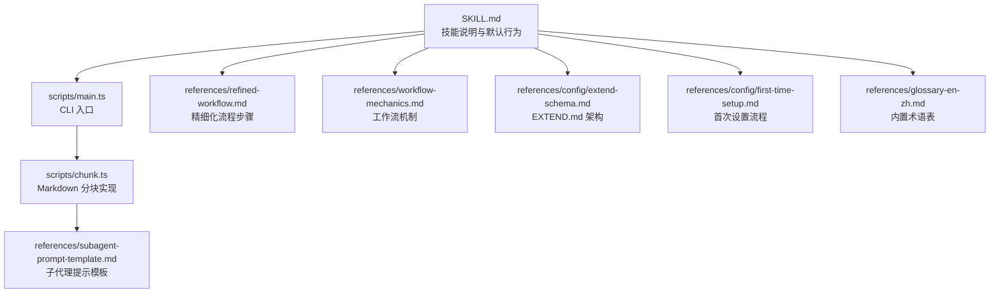
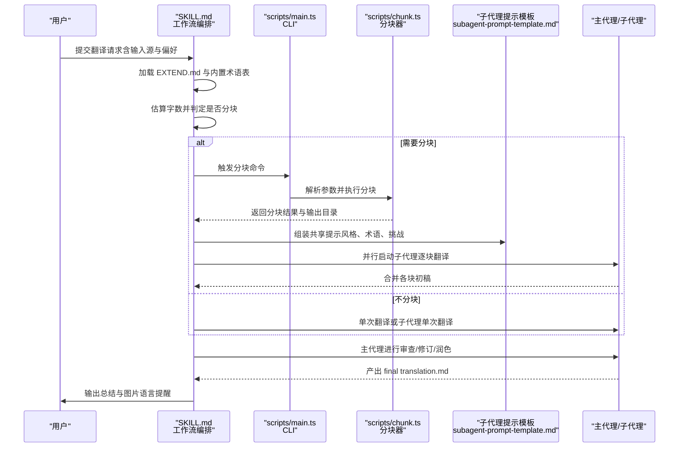
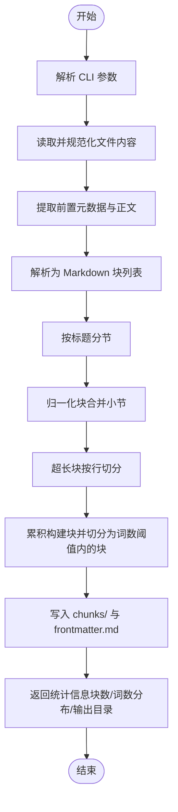
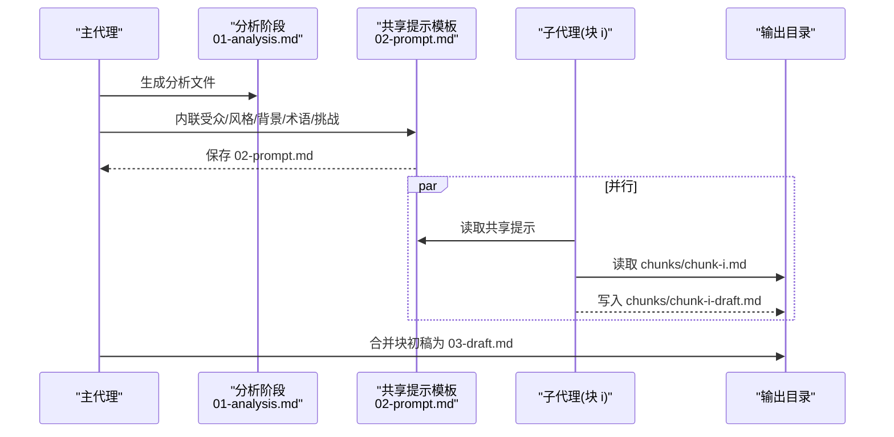
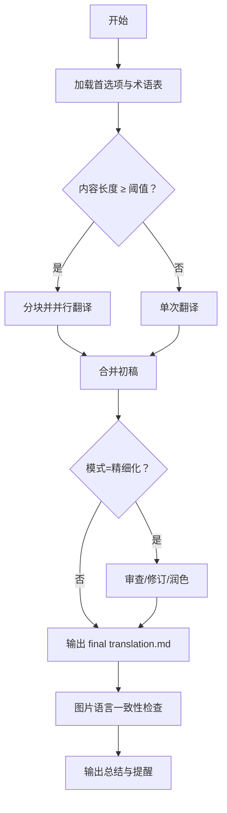
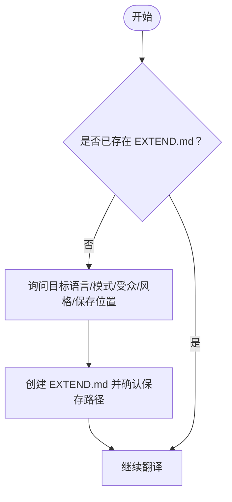
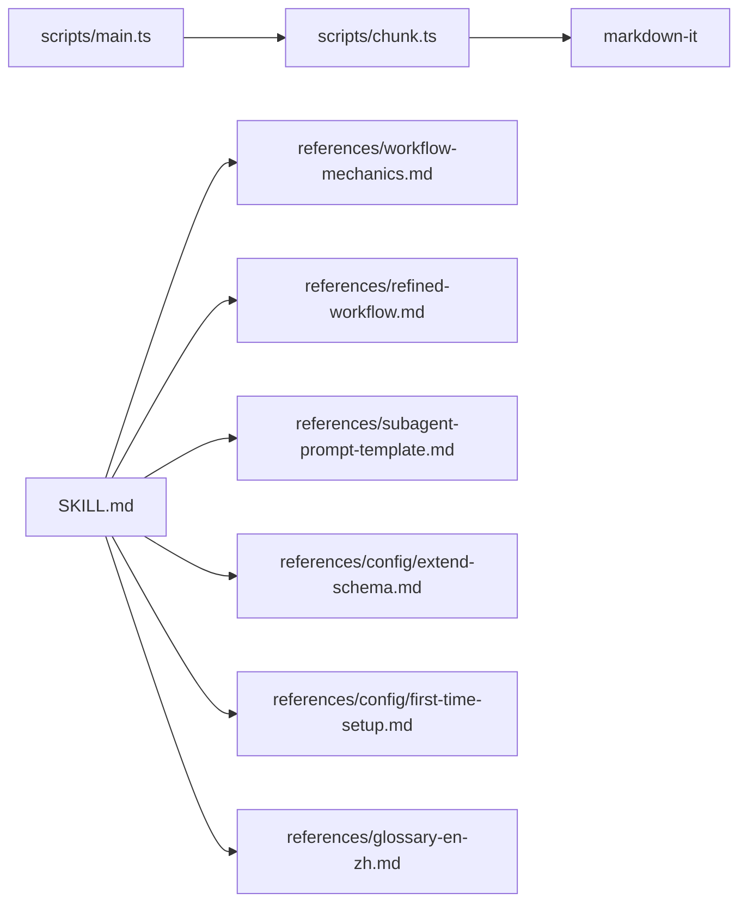

# 翻译技能

<cite>
**本文引用的文件**
- [SKILL.md](file://.agents/skills/baoyu-translate/SKILL.md)
- [main.ts](file://.agents/skills/baoyu-translate/scripts/main.ts)
- [chunk.ts](file://.agents/skills/baoyu-translate/scripts/chunk.ts)
- [package.json](file://.agents/skills/baoyu-translate/scripts/package.json)
- [extend-schema.md](file://.agents/skills/baoyu-translate/references/config/extend-schema.md)
- [first-time-setup.md](file://.agents/skills/baoyu-translate/references/config/first-time-setup.md)
- [workflow-mechanics.md](file://.agents/skills/baoyu-translate/references/workflow-mechanics.md)
- [subagent-prompt-template.md](file://.agents/skills/baoyu-translate/references/subagent-prompt-template.md)
- [refined-workflow.md](file://.agents/skills/baoyu-translate/references/refined-workflow.md)
- [glossary-en-zh.md](file://.agents/skills/baoyu-translate/references/glossary-en-zh.md)
</cite>

## 目录
1. [简介](#简介)
2. [项目结构](#项目结构)
3. [核心组件](#核心组件)
4. [架构总览](#架构总览)
5. [详细组件分析](#详细组件分析)
6. [依赖关系分析](#依赖关系分析)
7. [性能考量](#性能考量)
8. [故障排查指南](#故障排查指南)
9. [结论](#结论)
10. [附录](#附录)

## 简介
本文件为 baoyu-translate 技能的全面技术文档，覆盖翻译工作流、分块处理机制、子代理提示模板系统、术语表管理、翻译质量保证与多语言支持、EXTEND.md 配置模式与扩展、首次设置要求、翻译缓存机制、批量处理与错误恢复策略、翻译配置示例、API 集成方法与性能优化建议，并包含翻译质量评估、术语一致性检查与本地化最佳实践，以及与外部翻译服务的集成方式与故障处理机制。

## 项目结构
baoyu-translate 技能采用“技能目录 + 脚本 + 参考资料”的组织方式：
- 技能元数据与使用说明：SKILL.md
- 分块脚本与 CLI 入口：scripts/main.ts、scripts/chunk.ts
- 依赖声明：scripts/package.json
- 配置与参考文档：references/config/*、references/refined-workflow.md、references/subagent-prompt-template.md、references/workflow-mechanics.md、references/glossary-en-zh.md

图表来源
- [.agents/skills/baoyu-translate/SKILL.md:1-264](file://.agents/skills/baoyu-translate/SKILL.md#L1-L264)
- [.agents/skills/baoyu-translate/scripts/main.ts:1-56](file://.agents/skills/baoyu-translate/scripts/main.ts#L1-L56)
- [.agents/skills/baoyu-translate/scripts/chunk.ts:1-336](file://.agents/skills/baoyu-translate/scripts/chunk.ts#L1-L336)
- [.agents/skills/baoyu-translate/references/subagent-prompt-template.md:1-80](file://.agents/skills/baoyu-translate/references/subagent-prompt-template.md#L1-L80)
- [.agents/skills/baoyu-translate/references/refined-workflow.md:1-152](file://.agents/skills/baoyu-translate/references/refined-workflow.md#L1-L152)
- [.agents/skills/baoyu-translate/references/workflow-mechanics.md:1-26](file://.agents/skills/baoyu-translate/references/workflow-mechanics.md#L1-L26)
- [.agents/skills/baoyu-translate/references/config/extend-schema.md:1-108](file://.agents/skills/baoyu-translate/references/config/extend-schema.md#L1-L108)
- [.agents/skills/baoyu-translate/references/config/first-time-setup.md:1-170](file://.agents/skills/baoyu-translate/references/config/first-time-setup.md#L1-L170)
- [.agents/skills/baoyu-translate/references/glossary-en-zh.md:1-22](file://.agents/skills/baoyu-translate/references/glossary-en-zh.md#L1-L22)

章节来源
- [.agents/skills/baoyu-translate/SKILL.md:1-264](file://.agents/skills/baoyu-translate/SKILL.md#L1-L264)

## 核心组件
- 翻译模式与风格
  - 快速模式：直接翻译，适合短文本与非正式内容
  - 正常模式：先分析再翻译，适合文章与博客
  - 精细化模式：分析 → 初稿 → 批评审查 → 修订 → 润色，适合出版级质量
- 术语表与风格
  - 支持内置术语表（如 EN→ZH）
  - 支持 EXTEND.md 自定义术语表与语言对特定术语表
  - 支持多种风格预设与自定义风格描述
- 输出与中间产物
  - 统一输出 translation.md；中间产物按阶段命名保存
  - 支持图片语言一致性提醒与建议

章节来源
- [.agents/skills/baoyu-translate/SKILL.md:77-264](file://.agents/skills/baoyu-translate/SKILL.md#L77-L264)

## 架构总览
翻译流程从“首选项加载”开始，根据内容长度决定是否分块；分块时通过共享提示模板驱动子代理并行生成初稿，随后主代理进行审查、修订与润色，最终输出成品并进行图片语言一致性检查。

图表来源
- [.agents/skills/baoyu-translate/SKILL.md:124-264](file://.agents/skills/baoyu-translate/SKILL.md#L124-L264)
- [.agents/skills/baoyu-translate/scripts/main.ts:1-56](file://.agents/skills/baoyu-translate/scripts/main.ts#L1-L56)
- [.agents/skills/baoyu-translate/scripts/chunk.ts:1-336](file://.agents/skills/baoyu-translate/scripts/chunk.ts#L1-L336)
- [.agents/skills/baoyu-translate/references/subagent-prompt-template.md:1-80](file://.agents/skills/baoyu-translate/references/subagent-prompt-template.md#L1-L80)

## 详细组件分析

### 分块处理机制
- 输入解析与 CLI
  - CLI 支持 chunk 子命令与通用分块调用，接受最大词数与输出目录参数
- Markdown 解析与块识别
  - 使用 markdown-it 解析，识别标题、水平线、HTML、代码、段落等块类型
  - 将内容按块边界切分，保留格式与结构
- 分块策略
  - 按标题作为分节边界拆分，避免跨节语义断裂
  - 超长块优先按行切分，再按词数切分，确保每块在阈值内
- 输出与统计
  - 输出 chunks/ 目录，包含 frontmatter.md（如有）与 chunk-NN.md
  - 返回 JSON 包含源文件、块数、输出目录、是否含前置元数据及每块词数

图表来源
- [.agents/skills/baoyu-translate/scripts/chunk.ts:66-96](file://.agents/skills/baoyu-translate/scripts/chunk.ts#L66-L96)
- [.agents/skills/baoyu-translate/scripts/chunk.ts:225-262](file://.agents/skills/baoyu-translate/scripts/chunk.ts#L225-L262)
- [.agents/skills/baoyu-translate/scripts/chunk.ts:285-324](file://.agents/skills/baoyu-translate/scripts/chunk.ts#L285-L324)

章节来源
- [.agents/skills/baoyu-translate/scripts/main.ts:22-55](file://.agents/skills/baoyu-translate/scripts/main.ts#L22-L55)
- [.agents/skills/baoyu-translate/scripts/chunk.ts:1-336](file://.agents/skills/baoyu-translate/scripts/chunk.ts#L1-L336)

### 子代理提示模板系统
- 共享提示（02-prompt.md）
  - 内容包括目标受众与风格、源文语音特征、内容背景、术语表、翻译挑战与原则
  - 该文件由主代理基于分析结果内联生成，供所有子代理复用
- 子代理任务提示
  - 并行启动：每个子代理负责一个块，读取共享提示与对应块文件，产出块初稿
  - 非分块场景：单个子代理翻译整篇
- 一致性保障
  - 通过共享提示中的术语表、风格与挑战建议，确保跨块术语一致与风格统一

图表来源
- [.agents/skills/baoyu-translate/references/subagent-prompt-template.md:13-80](file://.agents/skills/baoyu-translate/references/subagent-prompt-template.md#L13-L80)
- [.agents/skills/baoyu-translate/SKILL.md:174-186](file://.agents/skills/baoyu-translate/SKILL.md#L174-L186)

章节来源
- [.agents/skills/baoyu-translate/references/subagent-prompt-template.md:1-80](file://.agents/skills/baoyu-translate/references/subagent-prompt-template.md#L1-L80)
- [.agents/skills/baoyu-translate/SKILL.md:174-186](file://.agents/skills/baoyu-translate/SKILL.md#L174-L186)

### 翻译工作流与质量保证
- 工作流步骤
  - 快速：直接翻译
  - 正常：分析 → 翻译
  - 精细化：分析 → 初稿 → 批评审查 → 修订 → 润色
- 质量原则
  - 重写而非直译；准确性优先；自然流畅；术语一致；保留格式；适度注释；保留前置元数据字段映射
- 图片语言一致性提醒
  - 收集翻译后文章中的图片引用，识别可能仍含源语言文本或大量文字的封面、截图、图表、框架与信息图，给出清单提醒

图表来源
- [.agents/skills/baoyu-translate/SKILL.md:124-264](file://.agents/skills/baoyu-translate/SKILL.md#L124-L264)
- [.agents/skills/baoyu-translate/references/refined-workflow.md:1-152](file://.agents/skills/baoyu-translate/references/refined-workflow.md#L1-L152)

章节来源
- [.agents/skills/baoyu-translate/SKILL.md:188-264](file://.agents/skills/baoyu-translate/SKILL.md#L188-L264)
- [.agents/skills/baoyu-translate/references/refined-workflow.md:1-152](file://.agents/skills/baoyu-translate/references/refined-workflow.md#L1-L152)

### 术语表管理与多语言支持
- 术语表来源与优先级
  - CLI --glossary 文件
  - EXTEND.md 中按语言对的 glossaries[pair]
  - EXTEND.md 中的 glossary（内联）
  - EXTEND.md 中的 glossary_files（可为相对 EXTEND.md 的路径）
  - 内置术语表（如 EN→ZH）
- 外部术语表格式
  - 支持 Markdown 表格与 YAML 列表两种格式
  - 支持绝对路径与相对路径（相对 EXTEND.md）

章节来源
- [.agents/skills/baoyu-translate/references/config/extend-schema.md:26-108](file://.agents/skills/baoyu-translate/references/config/extend-schema.md#L26-L108)
- [.agents/skills/baoyu-translate/references/glossary-en-zh.md:1-22](file://.agents/skills/baoyu-translate/references/glossary-en-zh.md#L1-L22)

### EXTEND.md 配置模式与首次设置
- 配置模式
  - 支持目标语言、默认模式、目标受众、翻译风格、分块阈值与每块最大词数、自定义术语表、外部术语表文件、语言对特定术语表
- 首次设置（阻断式）
  - 当未找到 EXTEND.md 时，必须先完成设置流程：目标语言、模式、受众、风格、保存位置，然后创建 EXTEND.md 并继续
- 设置流程图

图表来源
- [.agents/skills/baoyu-translate/references/config/first-time-setup.md:19-37](file://.agents/skills/baoyu-translate/references/config/first-time-setup.md#L19-L37)

章节来源
- [.agents/skills/baoyu-translate/references/config/extend-schema.md:1-108](file://.agents/skills/baoyu-translate/references/config/extend-schema.md#L1-L108)
- [.agents/skills/baoyu-translate/references/config/first-time-setup.md:1-170](file://.agents/skills/baoyu-translate/references/config/first-time-setup.md#L1-L170)

### 翻译缓存机制、批量处理与错误恢复
- 缓存与中间产物
  - 所有中间文件均按阶段命名保存，便于回溯与增量修复
  - 输出目录按“源文件名-目标语言”命名，冲突时自动备份旧目录
- 批量处理
  - CLI 支持对多个文件进行分块与翻译；分块器按块边界切分，保证结构完整性
- 错误恢复
  - CLI 参数校验失败时打印帮助并退出码 1
  - 分块过程中若遇到异常块（如超长且无法进一步切分），保持原块输出，避免丢失
  - 若子代理并行翻译失败，可单独重试对应块，不影响其他块

章节来源
- [.agents/skills/baoyu-translate/scripts/chunk.ts:98-147](file://.agents/skills/baoyu-translate/scripts/chunk.ts#L98-L147)
- [.agents/skills/baoyu-translate/references/workflow-mechanics.md:23-26](file://.agents/skills/baoyu-translate/references/workflow-mechanics.md#L23-L26)

### 翻译配置示例、API 集成与性能优化
- 配置示例
  - EXTEND.md 模板与字段说明参见 EXTEND.md 架构文档
- API 集成
  - 通过子代理提示模板将共享上下文注入子代理，实现“主代理组装提示 + 子代理并行翻译”的解耦
- 性能优化
  - 并行子代理：在具备代理工具时，按块并行翻译，显著缩短长文处理时间
  - 分块阈值与每块最大词数：根据模型上下文窗口与稳定性调整
  - 仅在必要时启用精细化模式，平衡质量与耗时

章节来源
- [.agents/skills/baoyu-translate/references/config/extend-schema.md:1-108](file://.agents/skills/baoyu-translate/references/config/extend-schema.md#L1-L108)
- [.agents/skills/baoyu-translate/references/subagent-prompt-template.md:1-80](file://.agents/skills/baoyu-translate/references/subagent-prompt-template.md#L1-L80)

### 翻译质量评估与术语一致性检查
- 质量评估维度
  - 准确性：事实、数据、逻辑与原文一致
  - 自然度：目标语言表达是否自然，避免“翻译腔”
  - 术语一致性：跨块与全文一致，首次出现标注原文
  - 格式保留：标题、粗体、斜体、图片、链接、代码块等
- 术语一致性检查
  - 基于共享提示中的术语表与分析阶段提取的术语表进行交叉核对
  - 在审查与润色阶段重点检查术语替换与注释位置

章节来源
- [.agents/skills/baoyu-translate/SKILL.md:190-218](file://.agents/skills/baoyu-translate/SKILL.md#L190-L218)
- [.agents/skills/baoyu-translate/references/refined-workflow.md:77-135](file://.agents/skills/baoyu-translate/references/refined-workflow.md#L77-L135)

### 本地化最佳实践
- 目标受众与风格适配：针对不同受众选择合适风格与注释密度
- 文化适应：在审查阶段关注文化参考与表达是否在目标语言中有效
- 图片本地化：对可能仍含源语言文本的封面、截图、图表等进行提醒，尊重用户决策

章节来源
- [.agents/skills/baoyu-translate/SKILL.md:234-264](file://.agents/skills/baoyu-translate/SKILL.md#L234-L264)

### 与外部翻译服务的集成与故障处理
- 集成方式
  - 通过子代理提示模板将共享上下文传递给外部翻译服务（如模型 API），由外部服务执行翻译
  - 若无代理工具，可在本地顺序翻译；若有代理工具，可并行调用外部服务
- 故障处理
  - 子代理调用失败时，记录失败块并允许单独重试
  - 分块失败时，保留原块内容并跳过不可切分块，避免中断整体流程

章节来源
- [.agents/skills/baoyu-translate/references/subagent-prompt-template.md:55-80](file://.agents/skills/baoyu-translate/references/subagent-prompt-template.md#L55-L80)
- [.agents/skills/baoyu-translate/scripts/chunk.ts:285-324](file://.agents/skills/baoyu-translate/scripts/chunk.ts#L285-L324)

## 依赖关系分析
- 脚本依赖
  - chunk.ts 依赖 markdown-it 进行 Markdown 解析
  - CLI 通过 main.ts 调用分块能力，支持帮助与参数校验
- 文档依赖
  - SKILL.md 依赖多个参考文档：工作流机制、精细化流程、子代理提示模板、EXTEND.md 架构、首次设置、内置术语表

图表来源
- [.agents/skills/baoyu-translate/scripts/main.ts:1-56](file://.agents/skills/baoyu-translate/scripts/main.ts#L1-L56)
- [.agents/skills/baoyu-translate/scripts/chunk.ts:1-336](file://.agents/skills/baoyu-translate/scripts/chunk.ts#L1-L336)
- [.agents/skills/baoyu-translate/scripts/package.json:1-8](file://.agents/skills/baoyu-translate/scripts/package.json#L1-L8)
- [.agents/skills/baoyu-translate/SKILL.md:1-264](file://.agents/skills/baoyu-translate/SKILL.md#L1-L264)

章节来源
- [.agents/skills/baoyu-translate/scripts/package.json:1-8](file://.agents/skills/baoyu-translate/scripts/package.json#L1-L8)

## 性能考量
- 并行化：在具备代理工具时，按块并行翻译，显著降低长文处理时间
- 分块策略：合理设置分块阈值与每块最大词数，兼顾模型上下文与一致性
- 词数统计：使用正则清洗与中英字符识别相结合的方式估算词数，提高阈值设定的准确性
- I/O 优化：仅在必要时生成中间文件，减少磁盘写入；输出目录独立，避免覆盖

## 故障排查指南
- CLI 参数错误
  - 现象：打印帮助并以退出码 1 退出
  - 排查：检查 --max-words、--output-dir 等参数是否正确
- 分块失败
  - 现象：某块无法切分导致输出不完整
  - 排查：检查该块内容是否为不可切分的极长行；可手动调整阈值或拆分该块
- 术语冲突
  - 现象：术语表重复或冲突导致翻译不一致
  - 排查：检查 EXTEND.md 中 glossary/glossary_files/glossaries 的优先级与覆盖关系
- 输出目录冲突
  - 现象：输出目录已存在
  - 排查：系统会自动备份旧目录；如需覆盖，请清理旧目录后再运行

章节来源
- [.agents/skills/baoyu-translate/scripts/chunk.ts:98-147](file://.agents/skills/baoyu-translate/scripts/chunk.ts#L98-L147)
- [.agents/skills/baoyu-translate/references/workflow-mechanics.md:23-26](file://.agents/skills/baoyu-translate/references/workflow-mechanics.md#L23-L26)

## 结论
baoyu-translate 技能通过清晰的工作流、严谨的分块与子代理并行机制、完善的术语表与风格控制，以及可追溯的中间产物与图片语言一致性提醒，实现了高质量、可扩展的多语言翻译能力。配合 EXTEND.md 的灵活配置与首次设置流程，用户可在不同场景下快速获得符合预期的翻译结果，并在需要时进行精细化审查与润色。

## 附录
- 关键文件索引
  - 技能说明与默认行为：SKILL.md
  - CLI 入口与分块实现：scripts/main.ts、scripts/chunk.ts
  - 依赖声明：scripts/package.json
  - 配置架构与首次设置：references/config/extend-schema.md、references/config/first-time-setup.md
  - 工作流机制与精细化流程：references/workflow-mechanics.md、references/refined-workflow.md
  - 子代理提示模板：references/subagent-prompt-template.md
  - 内置术语表：references/glossary-en-zh.md