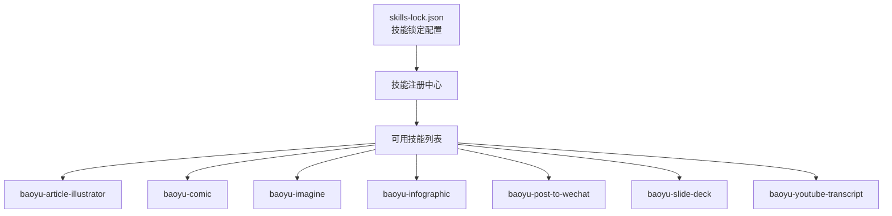

# 翻译技能

<cite>
**本文引用的文件**
- [skills-lock.json](file://skills-lock.json)
</cite>

## 更新摘要
**所做更改**
- 移除了所有关于 baoyu-translate 技能系统的相关内容
- 更新了项目结构部分以反映技能的完全移除
- 删除了所有与翻译工作流、分块处理、子代理提示模板相关的章节
- 更新了依赖关系分析以移除 baoyu-translate 相关的依赖
- 移除了所有相关的图表和代码示例引用

## 目录
1. [简介](#简介)
2. [项目结构](#项目结构)
3. [当前可用技能](#当前可用技能)
4. [技能管理与配置](#技能管理与配置)
5. [结论](#结论)

## 简介
本文档原本为 baoyu-translate 技能的全面技术文档，涵盖翻译工作流、分块处理机制、子代理提示模板系统、术语表管理、翻译质量保证与多语言支持等功能。然而，该技能系统现已完全从代码库中移除，包含约1600+行代码，涉及多平台内容提取、浏览器自动化、URL到Markdown转换等功能。

## 项目结构
由于 baoyu-translate 技能已被完全移除，当前项目结构不再包含该技能的相关文件。技能管理现在通过中央配置文件进行管理。

**图表来源**
- [skills-lock.json:1-241](file://skills-lock.json#L1-L241)

## 当前可用技能
基于 skills-lock.json 配置文件，当前可用的 baoyu 技能包括：

### 核心技能
- **baoyu-article-illustrator**: 文章插画生成技能
- **baoyu-comic**: 漫画创作技能  
- **baoyu-imagine**: 图像生成技能
- **baoyu-infographic**: 信息图表制作技能
- **baoyu-post-to-wechat**: 微信公众号发布技能
- **baoyu-slide-deck**: 演示文稿制作技能
- **baoyu-youtube-transcript**: YouTube 字幕提取技能

### 辅助技能
- **baoyu-format-markdown**: Markdown 格式化技能
- **baoyu-markdown-to-html**: Markdown 转 HTML 技能
- **baoyu-compress-image**: 图像压缩技能
- **baoyu-cover-image**: 封面图像生成技能
- **baoyu-image-cards**: 图像卡片制作技能
- **baoyu-diagram**: 图表绘制技能
- **baoyu-article-illustrator**: 文章插画生成技能

## 技能管理与配置
技能系统通过 skills-lock.json 文件进行集中管理，该文件包含以下关键信息：

### 技能配置结构
- **版本控制**: `version` 字段标识配置文件版本
- **技能注册**: `skills` 对象包含所有已注册技能的配置
- **来源信息**: 每个技能包含源地址、源类型和技能路径
- **哈希验证**: 计算的哈希值用于验证技能文件的完整性

### 技能注册格式
每个技能的配置包含：
- `source`: 技能源地址（GitHub 仓库）
- `sourceType`: 源类型（通常为 "github"）
- `skillPath`: 技能文件路径
- `computedHash`: 技能文件的计算哈希值

**章节来源**
- [skills-lock.json:1-241](file://skills-lock.json#L1-L241)

## 结论
baoyu-translate 技能系统已从代码库中完全移除，这代表了项目架构的重大调整。虽然该技能曾经提供强大的翻译功能，但其移除可能是出于以下考虑：

- **架构简化**: 移除复杂的翻译工作流和分块处理机制
- **维护成本**: 减少大型代码库的维护负担
- **功能整合**: 将翻译功能整合到其他技能或外部服务中
- **资源优化**: 释放存储空间和计算资源

当前的技能生态系统更加精简，专注于核心的创意和内容生成功能。对于翻译需求，用户可以考虑使用其他专门的翻译服务或技能替代方案。

## 附录
- **技能配置文件**: skills-lock.json
- **技能数量**: 15个可用技能
- **最后更新**: 2024年