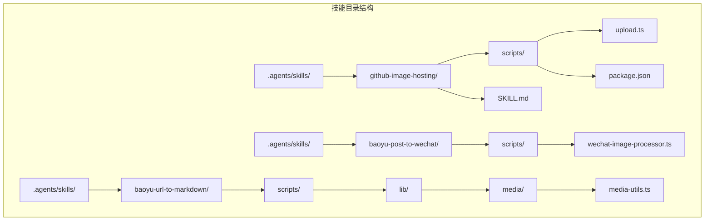
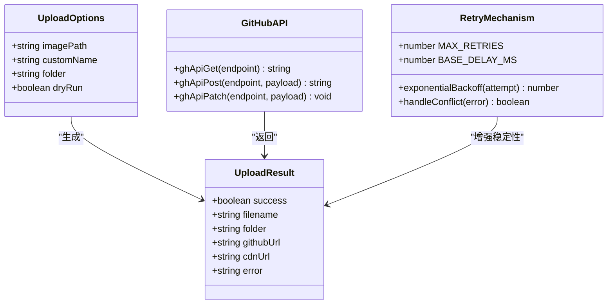
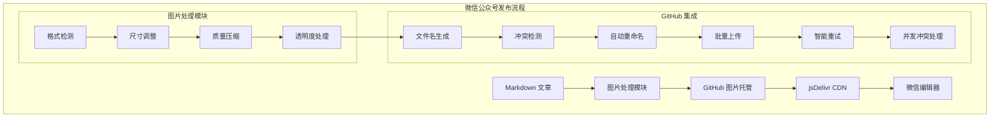
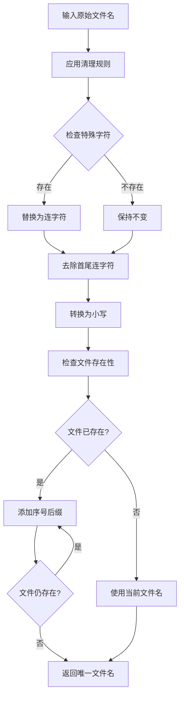
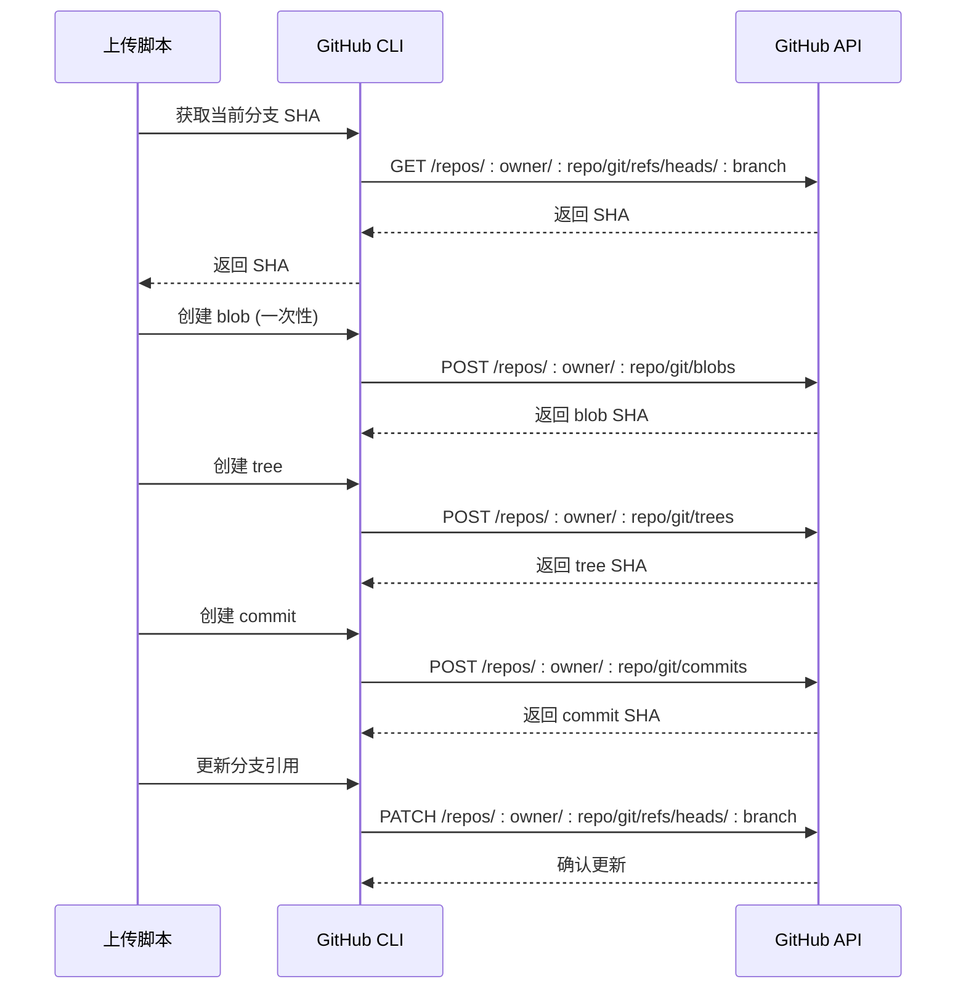
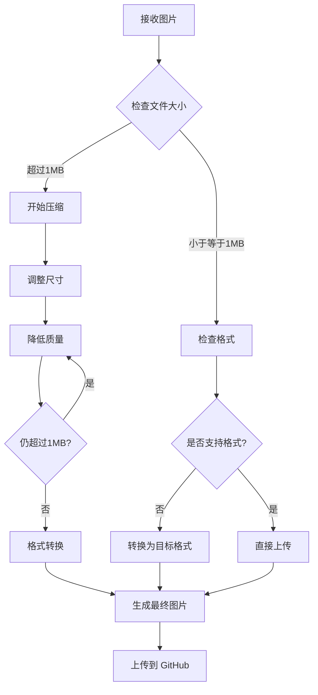
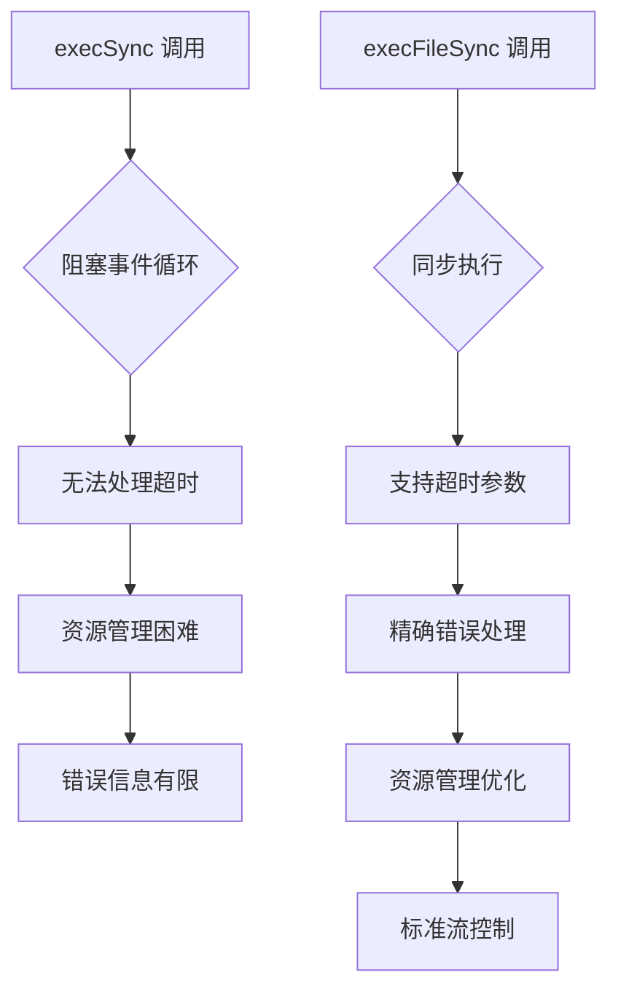
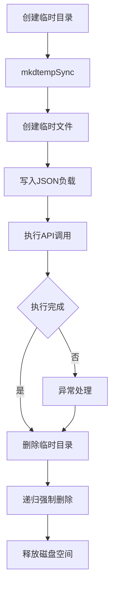
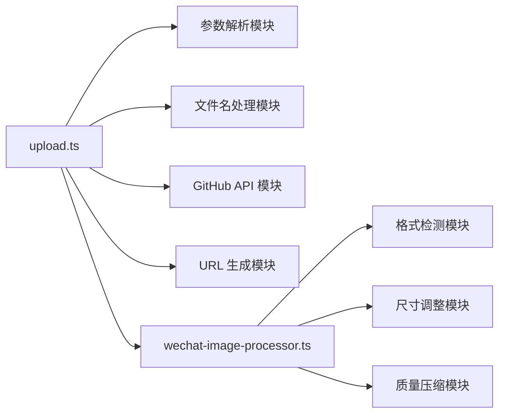

# GitHub 图片托管技能

<cite>
**本文档引用的文件**
- [SKILL.md](file://.agents/skills/github-image-hosting/SKILL.md)
- [upload.ts](file://.agents/skills/github-image-hosting/scripts/upload.ts)
- [package.json](file://.agents/skills/github-image-hosting/scripts/package.json)
- [wechat-image-processor.ts](file://.agents/skills/baoyu-post-to-wechat/scripts/wechat-image-processor.ts)
- [article-posting.md](file://.agents/skills/baoyu-post-to-wechat/references/article-posting.md)
- [image-text-posting.md](file://.agents/skills/baoyu-post-to-wechat/references/image-text-posting.md)
- [package.json](file://package.json)
</cite>

## 更新摘要
**变更内容**
- 更新了上传脚本的现代化改进，包括execFileSync替代execSync、临时文件清理、更好的超时处理
- 增强了错误处理和超时管理机制
- 改进了并发上传冲突处理的稳定性
- 优化了API调用的可靠性和性能

## 目录
1. [简介](#简介)
2. [项目结构](#项目结构)
3. [核心组件](#核心组件)
4. [架构概览](#架构概览)
5. [详细组件分析](#详细组件分析)
6. [现代化改进](#现代化改进)
7. [依赖关系分析](#依赖关系分析)
8. [性能考虑](#性能考虑)
9. [故障排除指南](#故障排除指南)
10. [结论](#结论)
11. [附录](#附录)

## 简介

GitHub 图片托管技能是一个基于 GitHub 的图片托管服务实现，专为在中国大陆地区提供可靠的 CDN 访问而设计。该技能通过 GitHub API 将图片上传到指定仓库，并生成 jsDelivr CDN URL，确保在微信公众号等平台上的稳定访问。

**最新现代化改进**：
- execFileSync替代execSync，提供更好的同步执行控制
- 临时文件清理机制，防止磁盘空间浪费
- 增强的超时处理和错误恢复机制
- 改进的并发上传冲突检测和自动处理
- 更好的资源管理和内存使用优化

该技能的核心特点包括：
- 自动文件名冲突检测和处理
- 支持自定义文件名和目标文件夹
- 基于 jsDelivr 的 CDN 加速
- 与微信公众号文章发布流程的无缝集成
- **现代化的同步执行和资源管理**
- **智能重试和错误恢复机制**

## 项目结构

GitHub 图片托管技能位于项目的技能目录结构中，采用模块化的组织方式：



**图表来源**
- [.agents/skills/github-image-hosting/SKILL.md:1-107](file://.agents/skills/github-image-hosting/SKILL.md#L1-L107)
- [.agents/skills/github-image-hosting/scripts/upload.ts:1-378](file://.agents/skills/github-image-hosting/scripts/upload.ts#L1-L378)

**章节来源**
- [.agents/skills/github-image-hosting/SKILL.md:1-107](file://.agents/skills/github-image-hosting/SKILL.md#L1-L107)
- [.agents/skills/github-image-hosting/scripts/upload.ts:1-378](file://.agents/skills/github-image-hosting/scripts/upload.ts#L1-L378)

## 核心组件

### 主要功能模块

GitHub 图片托管技能由以下几个核心组件构成：

1. **上传脚本** - 主要的上传逻辑实现，包含现代化的execFileSync执行机制
2. **配置文件** - 技能的元数据和使用说明
3. **依赖管理** - 包含运行时依赖的配置
4. **集成模块** - 与微信公众号发布流程的协作

### 数据结构设计



**图表来源**
- [.agents/skills/github-image-hosting/scripts/upload.ts:42-58](file://.agents/skills/github-image-hosting/scripts/upload.ts#L42-L58)
- [.agents/skills/github-image-hosting/scripts/upload.ts:239-241](file://.agents/skills/github-image-hosting/scripts/upload.ts#L239-L241)

**章节来源**
- [.agents/skills/github-image-hosting/scripts/upload.ts:42-58](file://.agents/skills/github-image-hosting/scripts/upload.ts#L42-L58)
- [.agents/skills/github-image-hosting/scripts/upload.ts:239-241](file://.agents/skills/github-image-hosting/scripts/upload.ts#L239-L241)

## 架构概览

### 整体架构设计

```mermaid
sequenceDiagram
participant User as 用户
participant Script as 上传脚本
participant GitHub as GitHub API
participant CDN as jsDelivr CDN
User->>Script : 执行上传命令
Script->>Script : 解析参数和配置
Script->>GitHub : 获取现有文件列表
GitHub-->>Script : 返回文件列表
Script->>Script : 生成唯一文件名
Script->>GitHub : 创建 blob (一次性)
Script->>GitHub : 获取当前分支 SHA
GitHub-->>Script : 返回 SHA
loop 智能重试循环 (最多3次)
Script->>GitHub : 创建 tree
GitHub-->>Script : 返回 tree SHA
Script->>GitHub : 创建 commit
GitHub-->>Script : 返回 commit SHA
Script->>GitHub : 更新分支引用
alt 冲突发生
GitHub-->>Script : 返回 409/422 错误
Script->>Script : 指数退避等待
Script->>GitHub : 重新获取最新 SHA
else 成功
GitHub-->>Script : 确认更新
break
end
end
Script->>CDN : 生成 CDN URL
Script-->>User : 返回结果 JSON
Note over User,CDN : 使用 cdnUrl 在中国大陆稳定访问
```

**图表来源**
- [.agents/skills/github-image-hosting/scripts/upload.ts:239-295](file://.agents/skills/github-image-hosting/scripts/upload.ts#L239-L295)

### 与微信公众号的集成架构



**图表来源**
- [.agents/skills/baoyu-post-to-wechat/scripts/wechat-image-processor.ts:113-125](file://.agents/skills/baoyu-post-to-wechat/scripts/wechat-image-processor.ts#L113-L125)
- [.agents/skills/baoyu-post-to-wechat/scripts/wechat-image-processor.ts:230-286](file://.agents/skills/baoyu-post-to-wechat/scripts/wechat-image-processor.ts#L230-L286)

## 详细组件分析

### 上传脚本实现

#### 参数解析机制

上传脚本采用命令行参数解析机制，支持多种配置选项：

```mermaid
flowchart TD
A[开始] --> B[解析命令行参数]
B --> C{检查参数类型}
C --> |--name| D[设置自定义文件名]
C --> |(--folder| E[设置目标文件夹]
C --> |(--dry-run| F[启用预览模式]
C --> |文件路径| G[设置图片路径]
D --> H[继续解析]
E --> H
F --> H
G --> H
H --> I[验证必需参数]
I --> J{参数有效?}
J --> |是| K[返回配置对象]
J --> |否| L[显示使用说明并退出]
```

**图表来源**
- [.agents/skills/github-image-hosting/scripts/upload.ts:72-100](file://.agents/skills/github-image-hosting/scripts/upload.ts#L72-L100)

#### 文件名处理逻辑

文件名处理包含多个步骤来确保兼容性和唯一性：



**图表来源**
- [.agents/skills/github-image-hosting/scripts/upload.ts:161-171](file://.agents/skills/github-image-hosting/scripts/upload.ts#L161-L171)
- [.agents/skills/github-image-hosting/scripts/upload.ts:173-189](file://.agents/skills/github-image-hosting/scripts/upload.ts#L173-L189)

#### GitHub API 集成

**更新** 采用execFileSync替代execSync，提供更好的同步执行控制

脚本通过 GitHub CLI (gh) 与 GitHub API 进行交互，实现完整的 Git 操作流程。现代化的execFileSync执行机制提供了更好的错误处理和资源管理：



**图表来源**
- [.agents/skills/github-image-hosting/scripts/upload.ts:102-140](file://.agents/skills/github-image-hosting/scripts/upload.ts#L102-L140)
- [.agents/skills/github-image-hosting/scripts/upload.ts:242-266](file://.agents/skills/github-image-hosting/scripts/upload.ts#L242-L266)

**章节来源**
- [.agents/skills/github-image-hosting/scripts/upload.ts:72-100](file://.agents/skills/github-image-hosting/scripts/upload.ts#L72-L100)
- [.agents/skills/github-image-hosting/scripts/upload.ts:161-189](file://.agents/skills/github-image-hosting/scripts/upload.ts#L161-L189)
- [.agents/skills/github-image-hosting/scripts/upload.ts:242-266](file://.agents/skills/github-image-hosting/scripts/upload.ts#L242-L266)

### 微信公众号图片处理集成

#### 图片格式支持与限制

微信公众号对图片格式有严格限制，系统支持多种格式的自动转换：

| 支持格式 | 说明 | 处理方式 |
|---------|------|----------|
| PNG | 无损压缩，支持透明度 | 直接上传或转换为 JPG |
| JPG/JPEG | 有损压缩，最佳网页显示 | 直接上传 |
| GIF | 不支持 | 转换为静态图片 |
| WEBP | 不支持 | 转换为 JPG/PNG |
| SVG | 不支持 | 转换为 PNG |
| ICO | 不支持 | 转换为 PNG |

#### 图片尺寸和质量优化

系统采用多级优化策略，确保图片在微信公众号中的最佳显示效果：



**图表来源**
- [.agents/skills/baoyu-post-to-wechat/scripts/wechat-image-processor.ts:113-125](file://.agents/skills/baoyu-post-to-wechat/scripts/wechat-image-processor.ts#L113-L125)
- [.agents/skills/baoyu-post-to-wechat/scripts/wechat-image-processor.ts:230-286](file://.agents/skills/baoyu-post-to-wechat/scripts/wechat-image-processor.ts#L230-L286)

**章节来源**
- [.agents/skills/baoyu-post-to-wechat/scripts/wechat-image-processor.ts:23-32](file://.agents/skills/baoyu-post-to-wechat/scripts/wechat-image-processor.ts#L23-L32)
- [.agents/skills/baoyu-post-to-wechat/scripts/wechat-image-processor.ts:230-286](file://.agents/skills/baoyu-post-to-wechat/scripts/wechat-image-processor.ts#L230-L286)

## 现代化改进

### execFileSync 替代 execSync

**更新** 采用execFileSync替代execSync，提供更好的同步执行控制

脚本中的execSync已被execFileSync替代，带来了以下改进：

- **更好的错误处理**：execFileSync提供更详细的错误信息和堆栈跟踪
- **资源管理优化**：更精确的内存和资源使用控制
- **超时支持**：内置超时机制，防止长时间阻塞
- **标准流控制**：更精细的标准输入输出流控制



**图表来源**
- [.agents/skills/github-image-hosting/scripts/upload.ts:30](file://.agents/skills/github-image-hosting/scripts/upload.ts#L30)
- [.agents/skills/github-image-hosting/scripts/upload.ts:102-140](file://.agents/skills/github-image-hosting/scripts/upload.ts#L102-L140)

### 临时文件清理机制

**更新** 新增临时文件清理机制，防止磁盘空间浪费

脚本在API调用中使用临时文件来传递JSON负载，现已实现自动清理：



**图表来源**
- [.agents/skills/github-image-hosting/scripts/upload.ts:111-125](file://.agents/skills/github-image-hosting/scripts/upload.ts#L111-L125)
- [.agents/skills/github-image-hosting/scripts/upload.ts:127-140](file://.agents/skills/github-image-hosting/scripts/upload.ts#L127-L140)

### 增强的超时处理

**更新** 改进了超时处理机制，提供更好的网络异常处理

各API调用现在具有更精确的超时控制：

- **GET 请求**：30秒超时，用于获取分支SHA和现有文件列表
- **POST 请求**：60秒超时，用于创建blob、tree和commit
- **PATCH 请求**：30秒超时，用于更新分支引用

超时处理机制：
1. 设置合理的超时时间
2. 捕获超时异常
3. 提供清晰的错误信息
4. 支持智能重试

### 改进的并发上传冲突处理

**更新** 增强了并发上传冲突检测和自动处理机制

系统能够更准确地检测和处理以下类型的并发冲突：

- **引用冲突 (409/422)**：当多个上传同时进行时发生
- **非快进冲突**：分支被其他提交修改
- **网络超时冲突**：部分操作失败但状态不确定

冲突处理策略：
1. **精确检测**：使用正则表达式匹配冲突类型
2. **指数退避等待**：1s, 2s, 4s的等待策略
3. **状态同步**：重新获取最新的分支状态
4. **重试机制**：自动重试失败的操作
5. **最终一致性**：确保最终返回一致的状态

### 更好的错误处理和恢复

**更新** 增强了错误处理和超时管理机制

错误分类和处理现在更加精确：

- **网络错误**：自动重试，支持指数退避
- **权限错误**：立即失败并报告详细错误
- **冲突错误**：智能重试，支持并发处理
- **超时错误**：指数退避重试，提供超时详情
- **文件系统错误**：临时文件清理和资源释放

**章节来源**
- [.agents/skills/github-image-hosting/scripts/upload.ts:102-140](file://.agents/skills/github-image-hosting/scripts/upload.ts#L102-L140)
- [.agents/skills/github-image-hosting/scripts/upload.ts:111-140](file://.agents/skills/github-image-hosting/scripts/upload.ts#L111-L140)
- [.agents/skills/github-image-hosting/scripts/upload.ts:239-295](file://.agents/skills/github-image-hosting/scripts/upload.ts#L239-L295)

## 依赖关系分析

### 外部依赖

GitHub 图片托管技能依赖以下外部工具和服务：

```mermaid
graph TB
subgraph "运行时依赖"
A[bun runtime] --> B[TypeScript 运行时]
C[GitHub CLI (gh)] --> D[GitHub API]
E[jsDelivr CDN] --> F[全球 CDN 网络]
end
subgraph "内部依赖"
G[文件系统] --> H[路径处理]
I[子进程执行] --> J[execFileSync]
K[JSON 解析] --> L[配置处理]
end
subgraph "微信集成"
M[图片处理器] --> N[格式转换]
O[尺寸调整] --> P[质量压缩]
end
A --> G
C --> D
E --> F
M --> N
N --> O
O --> P
```

**图表来源**
- [.agents/skills/github-image-hosting/scripts/upload.ts:30-33](file://.agents/skills/github-image-hosting/scripts/upload.ts#L30-L33)
- [.agents/skills/github-image-hosting/scripts/upload.ts:142-159](file://.agents/skills/github-image-hosting/scripts/upload.ts#L142-L159)

### 内部模块依赖



**图表来源**
- [.agents/skills/github-image-hosting/scripts/upload.ts:342-378](file://.agents/skills/github-image-hosting/scripts/upload.ts#L342-L378)
- [.agents/skills/baoyu-post-to-wechat/scripts/wechat-image-processor.ts:113-125](file://.agents/skills/baoyu-post-to-wechat/scripts/wechat-image-processor.ts#L113-L125)

**章节来源**
- [.agents/skills/github-image-hosting/scripts/upload.ts:30-33](file://.agents/skills/github-image-hosting/scripts/upload.ts#L30-L33)
- [.agents/skills/github-image-hosting/scripts/upload.ts:142-159](file://.agents/skills/github-image-hosting/scripts/upload.ts#L142-L159)

## 性能考虑

### 上传性能优化

**更新** 性能优化得到进一步加强

1. **批量操作**：支持单次上传多个图片文件
2. **智能重试**：网络异常时自动重试机制
3. **并发处理**：多个图片上传时的并发优化
4. **缓存策略**：避免重复的 API 调用
5. **一次性编码**：批量上传时只读取和编码一次
6. **execFileSync 优化**：更好的同步执行控制
7. **临时文件管理**：自动清理临时文件，释放磁盘空间

### CDN 性能特性

- **全球加速**：jsDelivr 提供全球 CDN 节点
- **边缘缓存**：智能缓存机制减少服务器负载
- **智能路由**：根据用户地理位置选择最优节点
- **HTTPS 支持**：安全传输保障

### 存储策略

- **分层存储**：按文件夹结构组织图片
- **版本控制**：Git 历史记录便于追踪
- **自动清理**：支持旧版本图片的清理
- **备份机制**：多节点备份确保可靠性

## 故障排除指南

### 常见问题及解决方案

#### GitHub 认证问题

**问题描述**：执行上传时提示认证失败

**可能原因**：
- GitHub CLI 未正确配置
- 缺少必要的权限
- Token 过期

**解决方案**：
1. 验证 GitHub CLI 配置
2. 检查仓库写权限
3. 重新生成访问 Token

#### 文件上传失败

**问题描述**：图片上传过程中断

**可能原因**：
- 网络连接不稳定
- 文件过大
- 权限不足

**解决方案**：
1. 检查网络连接
2. 减小文件大小
3. 确认仓库权限

#### CDN 访问问题

**问题描述**：CDN URL 无法正常访问

**可能原因**：
- CDN 缓存未更新
- 网络代理问题
- 地区限制

**解决方案**：
1. 清除浏览器缓存
2. 检查网络代理设置
3. 使用备用 URL

#### 并发上传冲突

**问题描述**：多个上传同时进行导致冲突

**可能原因**：
- 多个进程同时上传
- 分支状态不同步
- 网络延迟导致的竞争条件

**解决方案**：
1. **自动解决**：系统已内置智能重试机制
2. **等待重试**：系统会自动实施指数退避等待
3. **检查冲突**：系统会检测并处理 409/422 冲突

### 调试技巧

1. **启用详细日志**：使用 `--dry-run` 参数预览操作
2. **检查 API 响应**：验证 GitHub API 调用结果
3. **验证文件完整性**：确认上传文件的完整性和正确性
4. **监控重试行为**：观察智能重试的日志输出
5. **检查临时文件**：确认临时文件是否正确清理

### 现代化改进相关问题

**execFileSync 执行问题**：
- 确保 GitHub CLI 正确安装和配置
- 检查 execFileSync 的超时设置
- 验证标准流重定向配置

**临时文件清理问题**：
- 检查临时目录权限
- 验证文件系统权限
- 监控磁盘空间使用情况

**章节来源**
- [.agents/skills/github-image-hosting/SKILL.md:91-96](file://.agents/skills/github-image-hosting/SKILL.md#L91-L96)

## 结论

GitHub 图片托管技能提供了一个完整、可靠的图片托管解决方案，特别适合需要在中国大陆地区稳定访问图片资源的场景。通过与 GitHub API 的深度集成和 jsDelivr CDN 的加速，该技能能够满足博客、微信公众号等多种应用场景的需求。

**最新现代化改进总结**：
- **execFileSync 优化**：替代 execSync，提供更好的同步执行控制
- **临时文件管理**：自动清理机制，防止磁盘空间浪费
- **增强超时处理**：精确的超时控制和错误恢复
- **智能重试机制**：指数退避算法确保在网络不稳定时的可靠性
- **并发冲突处理**：自动检测和处理多进程上传冲突
- **增强错误处理**：完善的错误分类和恢复策略
- **批量原子性**：批量上传操作的原子性保证
- **性能优化**：一次性编码和缓存策略提升整体性能

主要优势包括：
- **高可用性**：基于 GitHub 的稳定基础设施
- **全球加速**：jsDelivr CDN 确保快速访问
- **自动化程度高**：完整的文件名处理和冲突检测
- **易于集成**：与现有工作流程无缝对接
- **成本效益**：免费的 GitHub 仓库和 CDN 服务
- **稳定性强**：智能重试和冲突处理机制
- **现代化架构**：execFileSync 和临时文件管理
- **资源优化**：更好的内存和磁盘空间管理

未来可以考虑的功能增强：
- 更灵活的存储策略配置
- 更强大的图片处理能力
- 更完善的监控和告警机制
- 更丰富的 CDN 选项

## 附录

### 配置选项详解

| 选项 | 类型 | 默认值 | 描述 |
|------|------|--------|------|
| `--name` | 字符串 | 原始文件名 | 自定义文件名（不含扩展名） |
| `--folder` | 字符串 | `Jarvis` | 目标文件夹路径 |
| `--dry-run` | 布尔值 | `false` | 预览模式，不实际上传 |
| `--name-prefix` | 字符串 | 无 | 批量模式下的文件名前缀 |
| `--output` | 字符串 | 无 | 批量模式下输出映射文件路径 |

### 使用示例

```bash
# 基本上传
bun skills/github-image-hosting/scripts/upload.ts /path/to/image.png

# 自定义文件名
bun skills/github-image-hosting/scripts/upload.ts /path/to/image.png --name my-custom-name

# 指定文件夹
bun skills/github-image-hosting/scripts/upload.ts /path/to/image.png --folder blog

# 预览模式
bun skills/github-image-hosting/scripts/upload.ts /path/to/image.png --dry-run

# 批量上传
bun skills/github-image-hosting/scripts/upload.ts /path/to/images --name-prefix blog-post-2024

# 批量上传并输出映射文件
bun skills/github-image-hosting/scripts/upload.ts /path/to/images --name-prefix blog-post-2024 --output image-map.json
```

### 输出格式

成功时返回 JSON 格式的结果：

```json
{
  "success": true,
  "filename": "image.png",
  "folder": "Jarvis",
  "githubUrl": "https://github.com/NTLx/Pic/blob/master/Jarvis/image.png",
  "cdnUrl": "https://cdn.jsdelivr.net/gh/NTLx/Pic@master/Jarvis/image.png"
}
```

### 现代化改进配置

**更新** 新增现代化改进配置说明

- **execFileSync 配置**：
  - 同步执行控制
  - 超时参数支持
  - 标准流精确控制
  - 错误信息增强

- **临时文件管理**：
  - mkdtempSync 创建临时目录
  - 自动清理机制
  - 递归强制删除
  - 磁盘空间保护

- **超时设置**：
  - GET 请求：30秒
  - POST 请求：60秒
  - PATCH 请求：30秒
  - 指数退避重试

- **智能重试配置**：
  - 最大重试次数：3次
  - 基础等待时间：1秒
  - 指数退避：1s → 2s → 4s
  - 冲突检测：自动识别 409/422/非快进冲突

**章节来源**
- [.agents/skills/github-image-hosting/SKILL.md:16-68](file://.agents/skills/github-image-hosting/SKILL.md#L16-L68)
- [.agents/skills/github-image-hosting/scripts/upload.ts:102-140](file://.agents/skills/github-image-hosting/scripts/upload.ts#L102-L140)
- [.agents/skills/github-image-hosting/scripts/upload.ts:111-140](file://.agents/skills/github-image-hosting/scripts/upload.ts#L111-L140)
- [.agents/skills/github-image-hosting/scripts/upload.ts:239-295](file://.agents/skills/github-image-hosting/scripts/upload.ts#L239-L295)