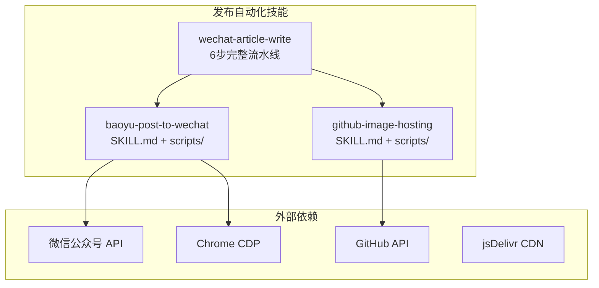
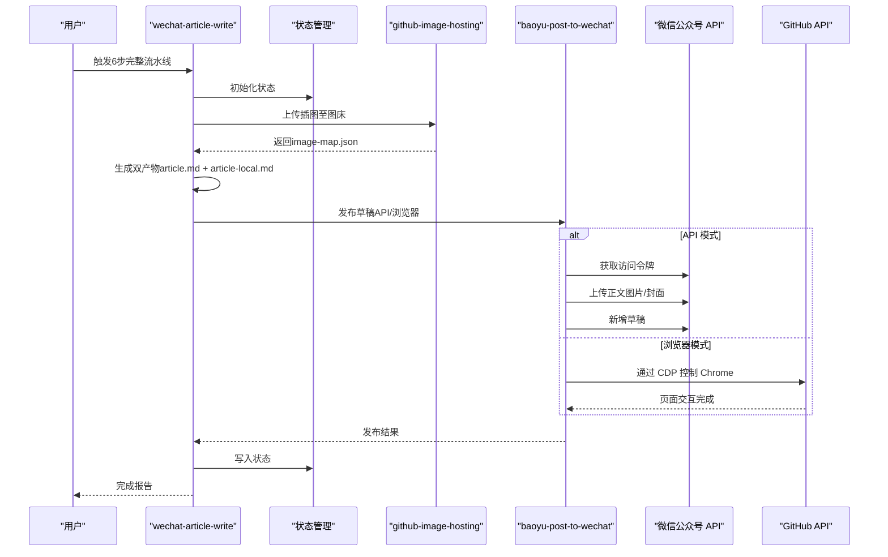
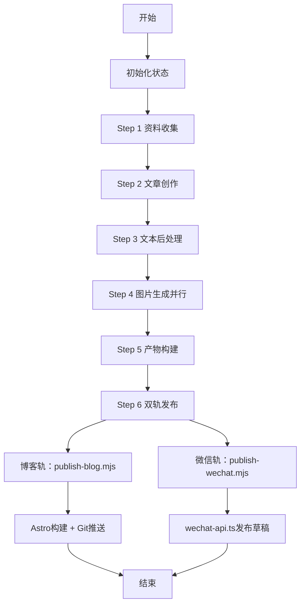
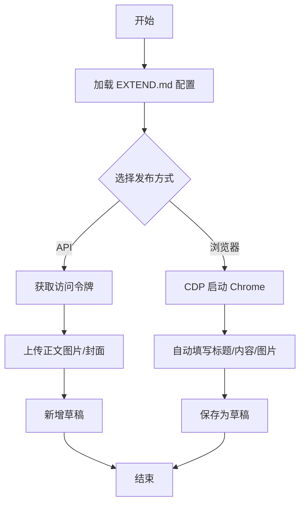
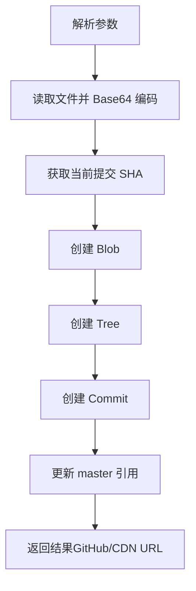
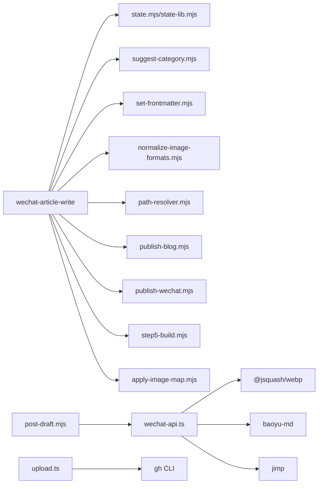

# 发布自动化技能

<cite>
**本文档引用的文件**
- [SKILL.md](file://.agents/skills/wechat-article-write/SKILL.md)
- [EXTEND.md](file://.agents/skills/wechat-article-write/EXTEND.md)
- [state.mjs](file://.agents/skills/wechat-article-write/scripts/state.mjs)
- [state-lib.mjs](file://.agents/skills/wechat-article-write/scripts/state-lib.mjs)
- [publish-blog.mjs](file://.agents/skills/wechat-article-write/scripts/publish-blog.mjs)
- [publish-wechat.mjs](file://.agents/skills/wechat-article-write/scripts/publish-wechat.mjs)
- [step5-build.mjs](file://.agents/skills/wechat-article-write/scripts/step5-build.mjs)
- [apply-image-map.mjs](file://.agents/skills/wechat-article-write/scripts/apply-image-map.mjs)
- [suggest-category.mjs](file://.agents/skills/wechat-article-write/scripts/suggest-category.mjs)
- [set-frontmatter.mjs](file://.agents/skills/wechat-article-write/scripts/set-frontmatter.mjs)
- [normalize-image-formats.mjs](file://.agents/skills/wechat-article-write/scripts/normalize-image-formats.mjs)
- [path-resolver.mjs](file://.agents/skills/wechat-article-write/scripts/path-resolver.mjs)
- [SKILL.md](file://.agents/skills/baoyu-post-to-wechat/SKILL.md)
- [wechat-api.ts](file://.agents/skills/baoyu-post-to-wechat/scripts/wechat-api.ts)
- [wechat-browser.ts](file://.agents/skills/baoyu-post-to-wechat/scripts/wechat-browser.ts)
- [wechat-extend-config.ts](file://.agents/skills/baoyu-post-to-wechat/scripts/wechat-extend-config.ts)
- [md-to-wechat.ts](file://.agents/skills/baoyu-post-to-wechat/scripts/md-to-wechat.ts)
- [wechat-image-processor.ts](file://.agents/skills/baoyu-post-to-wechat/scripts/wechat-image-processor.ts)
- [post-draft.mjs](file://.agents/skills/baoyu-post-to-wechat/scripts/post-draft.mjs)
- [package.json](file://.agents/skills/baoyu-post-to-wechat/scripts/package.json)
- [first-time-setup.md](file://.agents/skills/baoyu-post-to-wechat/references/config/first-time-setup.md)
- [multi-account.md](file://.agents/skills/baoyu-post-to-wechat/references/multi-account.md)
- [api-setup.md](file://.agents/skills/baoyu-post-to-wechat/references/api-setup.md)
- [SKILL.md](file://.agents/skills/github-image-hosting/SKILL.md)
- [upload.ts](file://.agents/skills/github-image-hosting/scripts/upload.ts)
- [package.json](file://.agents/skills/github-image-hosting/scripts/package.json)
</cite>

## 更新摘要
**变更内容**
- 微信文章写作技能从15步流程简化为6步流水线
- 实现双轨分离：博客轨消费Markdown + CDN URL，微信轨消费本地HTML + 本地图片
- 移除CDN回退机制，简化双产物机制
- 更新发布顺序：先博客后微信，确保sourceUrl稳定性
- 新增post-draft.mjs桥接脚本，优化微信发布流程

## 目录
1. [简介](#简介)
2. [项目结构](#项目结构)
3. [核心组件](#核心组件)
4. [架构总览](#架构总览)
5. [详细组件分析](#详细组件分析)
6. [依赖分析](#依赖分析)
7. [性能考虑](#性能考虑)
8. [故障排查指南](#故障排查指南)
9. [结论](#结论)
10. [附录](#附录)

## 简介
本文件面向 NTLx's Blog 的发布自动化技能模块，系统性梳理以下三大技能：
- **wechat-article-write**：微信公众号文章写作流水线（6步完整流程，端到端整合多技能，含图片上传与发布）
- **baoyu-post-to-wechat**：微信公众号文章发布（支持 API 与浏览器两种方式，含多账号与权限检查）
- **github-image-hosting**：GitHub 图床上传（jsDelivr CDN）

文档覆盖发布流程全链路、API 集成方法、权限与多账号机制、浏览器自动化、错误处理策略、性能优化与故障排查，并提供微信公众号开发的配置指南与调试方法。

## 项目结构
发布自动化技能位于 .agents/skills 目录下，采用"技能-脚本"组织方式：
- 技能目录包含 SKILL.md（技能说明）与 scripts/（可执行脚本）
- 各脚本通过 Bun 运行，依赖 Node.js 生态与第三方库
- wechat-article-write 作为编排技能，串联多个 baoyu-*、github-image-hosting、web-access 等技能

**图表来源**
- [.agents/skills/wechat-article-write/SKILL.md:14-16](file://.agents/skills/wechat-article-write/SKILL.md#L14-L16)
- [.agents/skills/baoyu-post-to-wechat/SKILL.md:1-268](file://.agents/skills/baoyu-post-to-wechat/SKILL.md#L1-L268)
- [.agents/skills/github-image-hosting/SKILL.md:1-107](file://.agents/skills/github-image-hosting/SKILL.md#L1-L107)

**章节来源**
- [.agents/skills/wechat-article-write/SKILL.md:1-260](file://.agents/skills/wechat-article-write/SKILL.md#L1-L260)
- [.agents/skills/baoyu-post-to-wechat/SKILL.md:1-268](file://.agents/skills/baoyu-post-to-wechat/SKILL.md#L1-L268)
- [.agents/skills/github-image-hosting/SKILL.md:1-107](file://.agents/skills/github-image-hosting/SKILL.md#L1-L107)

## 核心组件
- **wechat-article-write**
  - **6步完整流水线**：资料收集 → 文章创作 → 文本后处理 → 图片生成 → 产物构建 → 双轨发布
  - **双轨分离**：博客轨消费 Markdown + CDN URL（Astro Starlight 直接构建），微信轨消费本地 HTML + 本地图片（wechat-api.ts 直接读文件上传）
  - **状态管理系统**：state.mjs（命令行工具）+ state-lib.mjs（库函数），提供统一的状态读写和断点续跑能力
  - **关键门控**：质量门控、引用验证、格式统一检测、微信轨验证
- **baoyu-post-to-wechat**
  - API 发布：wechat-api.ts（令牌获取、正文图片上传、素材上传、草稿发布）
  - 浏览器发布：wechat-browser.ts（CDP 控制 Chrome，自动填写标题/内容/图片，保存草稿）
  - 配置与多账号：wechat-extend-config.ts（EXTEND.md 解析、账户解析、凭证加载）
  - Markdown 渲染：md-to-wechat.ts（占位符替换、主题渲染、HTML 输出）
  - 图片处理：wechat-image-processor.ts（格式检测、尺寸压缩、编码转换）
  - **桥接脚本**：post-draft.mjs（publish-wechat.mjs → wechat-api.ts 的参数转换）
- **github-image-hosting**
  - 上传脚本：upload.ts（gh CLI 调用、冲突检测、jsDelivr CDN 返回）

**章节来源**
- [.agents/skills/wechat-article-write/SKILL.md:14-16](file://.agents/skills/wechat-article-write/SKILL.md#L14-L16)
- [.agents/skills/wechat-article-write/scripts/state.mjs:1-61](file://.agents/skills/wechat-article-write/scripts/state.mjs#L1-L61)
- [.agents/skills/wechat-article-write/scripts/state-lib.mjs:1-63](file://.agents/skills/wechat-article-write/scripts/state-lib.mjs#L1-L63)
- [.agents/skills/wechat-article-write/scripts/publish-blog.mjs:1-293](file://.agents/skills/wechat-article-write/scripts/publish-blog.mjs#L1-L293)
- [.agents/skills/wechat-article-write/scripts/publish-wechat.mjs:1-147](file://.agents/skills/wechat-article-write/scripts/publish-wechat.mjs#L1-L147)
- [.agents/skills/wechat-article-write/scripts/step5-build.mjs:1-156](file://.agents/skills/wechat-article-write/scripts/step5-build.mjs#L1-L156)
- [.agents/skills/wechat-article-write/scripts/apply-image-map.mjs:1-167](file://.agents/skills/wechat-article-write/scripts/apply-image-map.mjs#L1-L167)
- [.agents/skills/baoyu-post-to-wechat/scripts/wechat-api.ts:1-200](file://.agents/skills/baoyu-post-to-wechat/scripts/wechat-api.ts#L1-L200)
- [.agents/skills/baoyu-post-to-wechat/scripts/wechat-browser.ts:1-742](file://.agents/skills/baoyu-post-to-wechat/scripts/wechat-browser.ts#L1-L742)
- [.agents/skills/baoyu-post-to-wechat/scripts/wechat-extend-config.ts:1-314](file://.agents/skills/baoyu-post-to-wechat/scripts/wechat-extend-config.ts#L1-L314)
- [.agents/skills/baoyu-post-to-wechat/scripts/md-to-wechat.ts:1-173](file://.agents/skills/baoyu-post-to-wechat/scripts/md-to-wechat.ts#L1-L173)
- [.agents/skills/baoyu-post-to-wechat/scripts/wechat-image-processor.ts:1-287](file://.agents/skills/baoyu-post-to-wechat/scripts/wechat-image-processor.ts#L1-L287)
- [.agents/skills/baoyu-post-to-wechat/scripts/post-draft.mjs:1-65](file://.agents/skills/baoyu-post-to-wechat/scripts/post-draft.mjs#L1-L65)
- [.agents/skills/github-image-hosting/scripts/upload.ts:1-237](file://.agents/skills/github-image-hosting/scripts/upload.ts#L1-L237)

## 架构总览
发布自动化由"编排层 + 技能层 + 外部服务"三层构成：
- **编排层**：wechat-article-write 负责6步完整流水线与门控，包含状态管理和双轨分离
- **技能层**：baoyu-post-to-wechat 提供文章发布（API/浏览器），github-image-hosting 提供图床上传
- **外部服务**：微信公众号 API、GitHub API、Chrome CDP、jsDelivr CDN

**图表来源**
- [.agents/skills/wechat-article-write/SKILL.md:41-52](file://.agents/skills/wechat-article-write/SKILL.md#L41-L52)
- [.agents/skills/wechat-article-write/scripts/publish-blog.mjs:17-23](file://.agents/skills/wechat-article-write/scripts/publish-blog.mjs#L17-L23)
- [.agents/skills/baoyu-post-to-wechat/scripts/wechat-api.ts:616-790](file://.agents/skills/baoyu-post-to-wechat/scripts/wechat-api.ts#L616-L790)
- [.agents/skills/github-image-hosting/scripts/upload.ts:136-220](file://.agents/skills/github-image-hosting/scripts/upload.ts#L136-L220)

## 详细组件分析

### wechat-article-write：微信文章写作流水线（6步完整流程）

**更新** 微信文章写作管线现已升级为6步完整流水线，实现了真正的双轨分离和简化。

#### 6步完整流水线
- **Step 1**：资料收集（硬门控）→ 通过web-access技能获取URL内容
- **Step 2**：文章创作（Skill工具调用）→ ljg-writes生成初稿 + 分类推荐
- **Step 3**：文本后处理（硬门控）→ humanizer-zh + baoyu-format-markdown
- **Step 4**：图片生成（并行）→ 封面图 + 信息图 + 插图并行生成
- **Step 5**：产物构建（硬门控）→ 图床上传 + 占位符替换 + HTML转换
- **Step 6**：双轨发布（先博客后微信）→ publish-blog.mjs + publish-wechat.mjs

#### 双轨分离设计
- **博客轨**：消费 article.md（包含 CDN URL），通过 Astro Starlight 直接构建
- **微信轨**：消费 article-wechat.html（包含本地图片路径），wechat-api.ts 直接读取本地文件上传
- **零共享中间产物**：两轨完全独立，互不依赖

#### 状态管理系统
- **state.mjs**：命令行工具，提供init/get/set/next/dump等状态操作
- **state-lib.mjs**：库函数，供所有Step脚本导入使用，避免重复spawn
- **统一状态写入**：大部分步骤都内置了状态写入，agent只需调用对应脚本

**图表来源**
- [.agents/skills/wechat-article-write/SKILL.md:41-52](file://.agents/skills/wechat-article-write/SKILL.md#L41-L52)
- [.agents/skills/wechat-article-write/scripts/state.mjs:12-16](file://.agents/skills/wechat-article-write/scripts/state.mjs#L12-L16)

**章节来源**
- [.agents/skills/wechat-article-write/SKILL.md:14-260](file://.agents/skills/wechat-article-write/SKILL.md#L14-L260)
- [.agents/skills/wechat-article-write/scripts/state.mjs:1-61](file://.agents/skills/wechat-article-write/scripts/state.mjs#L1-L61)
- [.agents/skills/wechat-article-write/scripts/state-lib.mjs:1-63](file://.agents/skills/wechat-article-write/scripts/state-lib.mjs#L1-L63)
- [.agents/skills/wechat-article-write/scripts/publish-blog.mjs:1-293](file://.agents/skills/wechat-article-write/scripts/publish-blog.mjs#L1-L293)
- [.agents/skills/wechat-article-write/scripts/publish-wechat.mjs:1-147](file://.agents/skills/wechat-article-write/scripts/publish-wechat.mjs#L1-L147)
- [.agents/skills/wechat-article-write/scripts/step5-build.mjs:1-156](file://.agents/skills/wechat-article-write/scripts/step5-build.mjs#L1-L156)
- [.agents/skills/wechat-article-write/scripts/apply-image-map.mjs:1-167](file://.agents/skills/wechat-article-write/scripts/apply-image-map.mjs#L1-L167)

### baoyu-post-to-wechat：微信公众号文章发布
- **发布方式**
  - API：适合快速、稳定发布，需 AppID/AppSecret；支持正文图片与封面上传、草稿新增
  - 浏览器：适合无需 API 凭证的场景，通过 CDP 自动化填写与保存
- **权限与配置**
  - EXTEND.md 支持全局与多账号配置，含默认主题、颜色、评论开关、Chrome 个人资料路径
  - 凭证加载顺序：EXTEND.md 账户字段 → 环境变量 → 项目级 .env → 用户级 .env
- **图片处理**
  - 正文图片上传前进行格式检测与必要转换，确保不超过 1MB 且为微信支持格式
  - 封面使用素材接口上传，正文图片使用正文图片接口返回 URL
- **工作流要点**
  - 不要预转换 Markdown 为 HTML；由脚本内部处理占位符与渲染
  - 默认将普通外链转为底部引用，可通过参数关闭
  - **零CDN依赖**：微信轨全程使用本地文件，wechat-api.ts直接读取本地图片上传

**图表来源**
- [.agents/skills/baoyu-post-to-wechat/SKILL.md:115-225](file://.agents/skills/baoyu-post-to-wechat/SKILL.md#L115-L225)
- [.agents/skills/baoyu-post-to-wechat/scripts/wechat-api.ts:616-790](file://.agents/skills/baoyu-post-to-wechat/scripts/wechat-api.ts#L616-L790)
- [.agents/skills/baoyu-post-to-wechat/scripts/wechat-browser.ts:126-653](file://.agents/skills/baoyu-post-to-wechat/scripts/wechat-browser.ts#L126-L653)

**章节来源**
- [.agents/skills/baoyu-post-to-wechat/SKILL.md:1-268](file://.agents/skills/baoyu-post-to-wechat/SKILL.md#L1-L268)
- [.agents/skills/baoyu-post-to-wechat/scripts/wechat-api.ts:1-200](file://.agents/skills/baoyu-post-to-wechat/scripts/wechat-api.ts#L1-L200)
- [.agents/skills/baoyu-post-to-wechat/scripts/wechat-browser.ts:1-742](file://.agents/skills/baoyu-post-to-wechat/scripts/wechat-browser.ts#L1-L742)
- [.agents/skills/baoyu-post-to-wechat/scripts/wechat-extend-config.ts:1-314](file://.agents/skills/baoyu-post-to-wechat/scripts/wechat-extend-config.ts#L1-L314)
- [.agents/skills/baoyu-post-to-wechat/scripts/wechat-image-processor.ts:1-287](file://.agents/skills/baoyu-post-to-wechat/scripts/wechat-image-processor.ts#L1-L287)
- [.agents/skills/baoyu-post-to-wechat/scripts/post-draft.mjs:1-65](file://.agents/skills/baoyu-post-to-wechat/scripts/post-draft.mjs#L1-L65)

### github-image-hosting：图片上传与 GitHub 集成
- **功能**
  - 上传图片到 NTLx/Pic 仓库，返回 GitHub 原图地址与 jsDelivr CDN 地址
  - 自动文件名冲突检测与清洗
- **工作流**
  - 解析参数 → 读取文件 → 获取现有文件列表 → 生成唯一文件名 → 创建 blob/tree/commit → 更新主分支引用
- **选项**
  - --name 自定义文件名（不含扩展）
  - --folder 目标目录（默认 Jarvis）
  - --dry-run 预览上传

**图表来源**
- [.agents/skills/github-image-hosting/scripts/upload.ts:136-220](file://.agents/skills/github-image-hosting/scripts/upload.ts#L136-L220)

**章节来源**
- [.agents/skills/github-image-hosting/SKILL.md:1-107](file://.agents/skills/github-image-hosting/SKILL.md#L1-L107)
- [.agents/skills/github-image-hosting/scripts/upload.ts:1-237](file://.agents/skills/github-image-hosting/scripts/upload.ts#L1-L237)

## 依赖分析
- **wechat-article-write 脚本依赖**
  - state.mjs/state-lib.mjs：统一状态管理
  - suggest-category.mjs：分类推荐
  - set-frontmatter.mjs：Frontmatter读写
  - normalize-image-formats.mjs：格式检测
  - path-resolver.mjs：路径解析
  - publish-blog.mjs/publish-wechat.mjs：发布编排
  - step5-build.mjs：产物构建
  - apply-image-map.mjs：占位符替换与双产物生成
- **baoyu-post-to-wechat 脚本依赖**
  - @jsquash/webp：WebP 解码
  - baoyu-chrome-cdp：Chrome CDP 工具
  - baoyu-md：Markdown 渲染与占位符处理
  - jimp：图片处理（缩放、透明度处理、编码）
  - post-draft.mjs：参数桥接
- **github-image-hosting 脚本依赖**
  - 通过 gh CLI 与 GitHub API 交互

**图表来源**
- [.agents/skills/wechat-article-write/scripts/state.mjs:18-47](file://.agents/skills/wechat-article-write/scripts/state.mjs#L18-L47)
- [.agents/skills/wechat-article-write/scripts/suggest-category.mjs:1-100](file://.agents/skills/wechat-article-write/scripts/suggest-category.mjs#L1-L100)
- [.agents/skills/wechat-article-write/scripts/set-frontmatter.mjs:1-150](file://.agents/skills/wechat-article-write/scripts/set-frontmatter.mjs#L1-L150)
- [.agents/skills/wechat-article-write/scripts/normalize-image-formats.mjs:1-120](file://.agents/skills/wechat-article-write/scripts/normalize-image-formats.mjs#L1-L120)
- [.agents/skills/wechat-article-write/scripts/path-resolver.mjs:1-80](file://.agents/skills/wechat-article-write/scripts/path-resolver.mjs#L1-L80)
- [.agents/skills/wechat-article-write/scripts/publish-blog.mjs:25-52](file://.agents/skills/wechat-article-write/scripts/publish-blog.mjs#L25-L52)
- [.agents/skills/wechat-article-write/scripts/publish-wechat.mjs:20-23](file://.agents/skills/wechat-article-write/scripts/publish-wechat.mjs#L20-L23)
- [.agents/skills/wechat-article-write/scripts/step5-build.mjs:57-71](file://.agents/skills/wechat-article-write/scripts/step5-build.mjs#L57-L71)
- [.agents/skills/wechat-article-write/scripts/apply-image-map.mjs:29-40](file://.agents/skills/wechat-article-write/scripts/apply-image-map.mjs#L29-L40)
- [.agents/skills/baoyu-post-to-wechat/scripts/package.json:1-12](file://.agents/skills/baoyu-post-to-wechat/scripts/package.json#L1-L12)
- [.agents/skills/github-image-hosting/scripts/package.json:1-2](file://.agents/skills/github-image-hosting/scripts/package.json#L1-L2)

**章节来源**
- [.agents/skills/wechat-article-write/scripts/state.mjs:1-61](file://.agents/skills/wechat-article-write/scripts/state.mjs#L1-L61)
- [.agents/skills/wechat-article-write/scripts/suggest-category.mjs:1-100](file://.agents/skills/wechat-article-write/scripts/suggest-category.mjs#L1-L100)
- [.agents/skills/wechat-article-write/scripts/set-frontmatter.mjs:1-150](file://.agents/skills/wechat-article-write/scripts/set-frontmatter.mjs#L1-L150)
- [.agents/skills/wechat-article-write/scripts/normalize-image-formats.mjs:1-120](file://.agents/skills/wechat-article-write/scripts/normalize-image-formats.mjs#L1-L120)
- [.agents/skills/wechat-article-write/scripts/path-resolver.mjs:1-80](file://.agents/skills/wechat-article-write/scripts/path-resolver.mjs#L1-L80)
- [.agents/skills/wechat-article-write/scripts/publish-blog.mjs:1-293](file://.agents/skills/wechat-article-write/scripts/publish-blog.mjs#L1-L293)
- [.agents/skills/wechat-article-write/scripts/publish-wechat.mjs:1-147](file://.agents/skills/wechat-article-write/scripts/publish-wechat.mjs#L1-L147)
- [.agents/skills/wechat-article-write/scripts/step5-build.mjs:1-156](file://.agents/skills/wechat-article-write/scripts/step5-build.mjs#L1-L156)
- [.agents/skills/wechat-article-write/scripts/apply-image-map.mjs:1-167](file://.agents/skills/wechat-article-write/scripts/apply-image-map.mjs#L1-L167)
- [.agents/skills/baoyu-post-to-wechat/scripts/package.json:1-12](file://.agents/skills/baoyu-post-to-wechat/scripts/package.json#L1-L12)
- [.agents/skills/github-image-hosting/scripts/package.json:1-2](file://.agents/skills/github-image-hosting/scripts/package.json#L1-L2)

## 性能考虑
- **6步流水线优化**
  - Step 4 图片生成三者并行执行，显著缩短总耗时
  - Step 5 产物构建一体化，避免重复上传和转换
- **双轨分离优化**
  - 博客轨直接消费 CDN URL，避免本地文件依赖
  - 微信轨直接消费本地 HTML，避免 CDN 传输延迟
- **状态管理优化**
  - state-lib.mjs避免重复spawn，提高状态写入效率
  - 断点续跑支持，减少重复执行
- **图片处理优化**
  - API 模式下正文图片自动压缩与格式转换，避免超限与不兼容
  - 统一格式检测在 Step 4 前执行，减少遗漏与重复处理
- **浏览器自动化优化**
  - CDP 直连用户 Chrome，避免重复登录与抓取失败
- **发布顺序优化**
  - 先博客后微信的发布顺序，确保sourceUrl的稳定性

**章节来源**
- [.agents/skills/wechat-article-write/SKILL.md:143-161](file://.agents/skills/wechat-article-write/SKILL.md#L143-L161)
- [.agents/skills/wechat-article-write/SKILL.md:179-205](file://.agents/skills/wechat-article-write/SKILL.md#L179-L205)
- [.agents/skills/wechat-article-write/scripts/state-lib.mjs:48-62](file://.agents/skills/wechat-article-write/scripts/state-lib.mjs#L48-L62)
- [.agents/skills/baoyu-post-to-wechat/scripts/wechat-image-processor.ts:230-287](file://.agents/skills/baoyu-post-to-wechat/scripts/wechat-image-processor.ts#L230-L287)

## 故障排查指南
- **常见问题与修复**
  - 缺少 API 凭证：按引导设置 AppID/AppSecret，或在 EXTEND.md/环境变量中配置
  - 访问令牌错误：检查凭证有效性与有效期
  - 未登录（浏览器模式）：首次运行会打开浏览器，扫码登录后继续
  - Chrome 未找到：设置 WECHAT_BROWSER_CHROME_PATH
  - 标题/摘要缺失：使用自动生成或手动提供
  - 无封面：添加 frontmatter cover 或放置 imgs/cover.png
  - 评论默认值不符：检查 EXTEND.md 中 need_open_comment/only_fans_can_comment
  - 粘贴失败：检查系统剪贴板权限
- **6步流程特定问题**
  - Step 2 分类确认失败：检查分类推荐准确性，必要时手动选择
  - Step 4 图片生成失败：检查图片后端配置，重试生成
  - Step 5 产物构建失败：检查image-map.json完整性，确认占位符与图片编号对齐
  - Step 6 博客发布失败：检查frontmatter字段映射，确保构建验证通过
  - Step 6 微信发布失败：检查sourceUrl可达性，确认封面和HTML文件存在
- **状态管理问题**
  - 状态写入失败：检查state-lib.mjs权限，确认posts目录可写
  - 断点续跑异常：使用state.mjs next查看当前步骤状态
- **双轨分离问题**
  - 博客轨CDN URL错误：检查article.md中的占位符替换是否正确执行
  - 微信轨本地路径错误：检查article-wechat.html中的本地图片路径
  - HTML转换失败：检查article.md格式和主题配置

**章节来源**
- [.agents/skills/baoyu-post-to-wechat/SKILL.md:242-254](file://.agents/skills/baoyu-post-to-wechat/SKILL.md#L242-L254)
- [.agents/skills/baoyu-post-to-wechat/references/multi-account.md:61-81](file://.agents/skills/baoyu-post-to-wechat/references/multi-account.md#L61-L81)
- [.agents/skills/baoyu-post-to-wechat/references/api-setup.md:1-42](file://.agents/skills/baoyu-post-to-wechat/references/api-setup.md#L1-L42)
- [.agents/skills/wechat-article-write/SKILL.md:208-224](file://.agents/skills/wechat-article-write/SKILL.md#L208-L224)
- [.agents/skills/wechat-article-write/scripts/publish-blog.mjs:228-272](file://.agents/skills/wechat-article-write/scripts/publish-blog.mjs#L228-L272)

## 结论
发布自动化技能通过6步完整流水线和现代化的状态管理、双轨分离设计，实现了从资料收集到文章发布的全链路自动化。wechat-article-write 提供了强大的编排能力，包含双轨分离、并行执行优化、统一状态管理等现代化特性；baoyu-post-to-wechat 提供可靠的 API 与浏览器双通道发布；github-image-hosting 则保障图片资源的稳定分发。配合完善的多账号与权限管理、错误处理与性能优化策略，整体方案具备良好的可维护性与扩展性。

## 附录
- **微信公众号开发配置指南**
  - 获取 AppID/AppSecret：登录微信公众平台 → 开发 → 基本配置
  - 保存位置：项目级 .baoyu-skills/.env 或用户级 ~/.baoyu-skills/.env
  - 多账号：在 EXTEND.md 中 accounts 块配置，按别名选择
- **6步流程配置**
  - quick_mode：推荐设置为true，实现全自动执行
  - default_publish_method：推荐设置为api，发布速度更快
- **调试方法**
  - 使用 --dry-run 预览渲染与上传行为
  - 检查 CDP 日志与 Chrome 会话状态
  - 核对 jsDelivr CDN 是否可用（国内网络）
  - 使用state.mjs查看和调试状态

**章节来源**
- [.agents/skills/baoyu-post-to-wechat/references/api-setup.md:15-42](file://.agents/skills/baoyu-post-to-wechat/references/api-setup.md#L15-L42)
- [.agents/skills/baoyu-post-to-wechat/references/multi-account.md:14-36](file://.agents/skills/baoyu-post-to-wechat/references/multi-account.md#L14-L36)
- [.agents/skills/wechat-article-write/EXTEND.md:17-27](file://.agents/skills/wechat-article-write/EXTEND.md#L17-L27)
- [.agents/skills/wechat-article-write/scripts/state.mjs:1-61](file://.agents/skills/wechat-article-write/scripts/state.mjs#L1-L61)