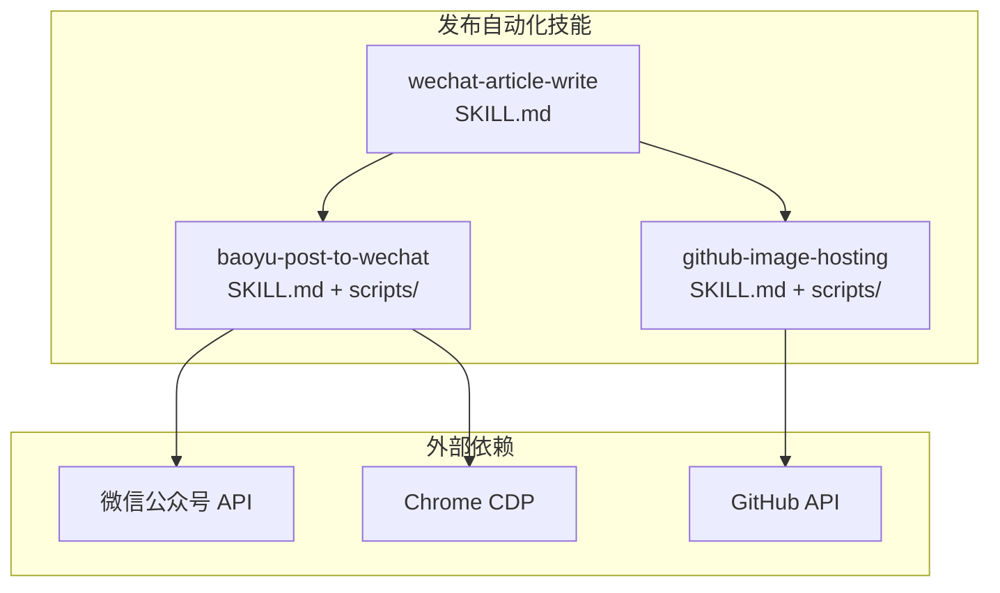
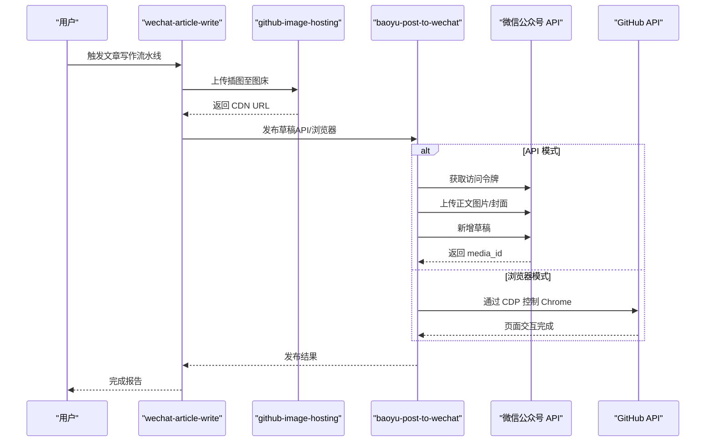
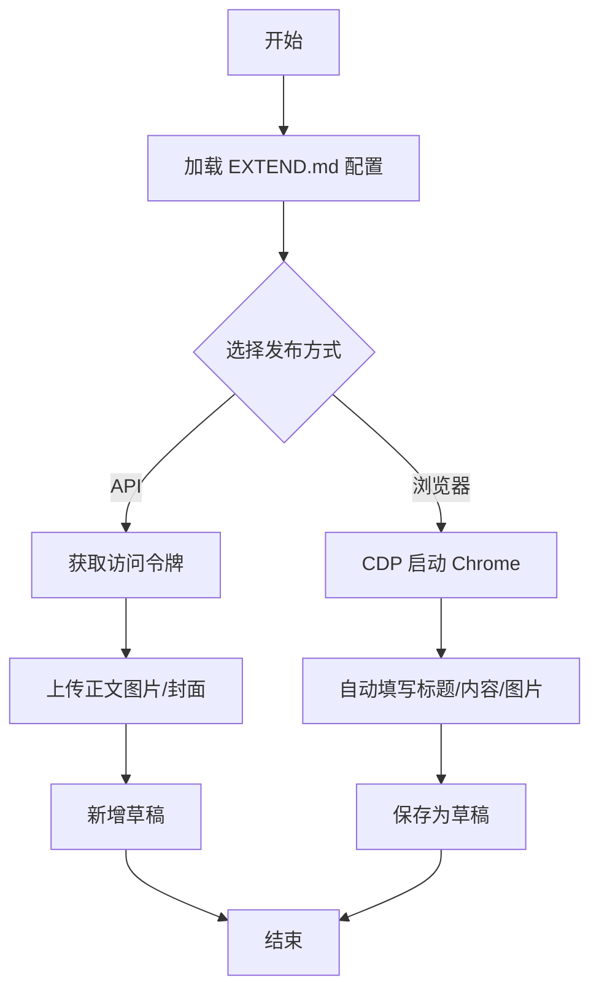
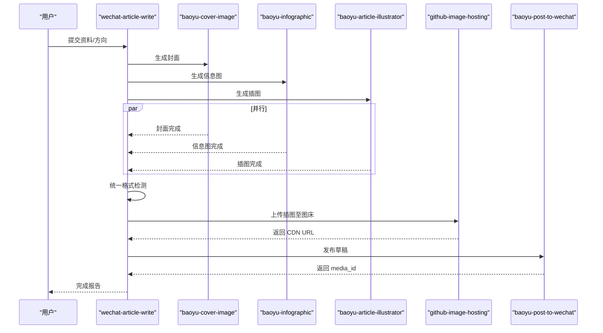
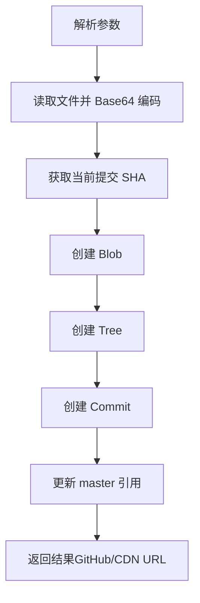
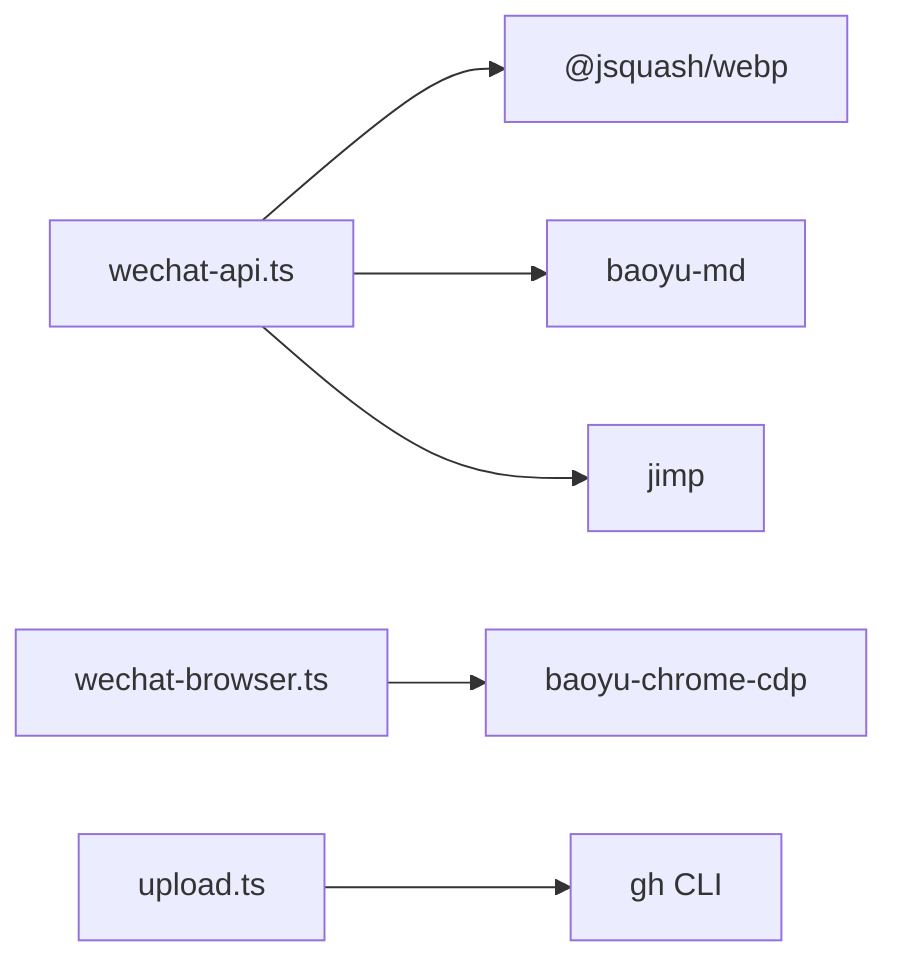

# 发布自动化技能

<cite>
**本文档引用的文件**
- [SKILL.md](file://.agents/skills/baoyu-post-to-wechat/SKILL.md)
- [wechat-api.ts](file://.agents/skills/baoyu-post-to-wechat/scripts/wechat-api.ts)
- [wechat-browser.ts](file://.agents/skills/baoyu-post-to-wechat/scripts/wechat-browser.ts)
- [wechat-extend-config.ts](file://.agents/skills/baoyu-post-to-wechat/scripts/wechat-extend-config.ts)
- [md-to-wechat.ts](file://.agents/skills/baoyu-post-to-wechat/scripts/md-to-wechat.ts)
- [wechat-image-processor.ts](file://.agents/skills/baoyu-post-to-wechat/scripts/wechat-image-processor.ts)
- [package.json](file://.agents/skills/baoyu-post-to-wechat/scripts/package.json)
- [first-time-setup.md](file://.agents/skills/baoyu-post-to-wechat/references/config/first-time-setup.md)
- [multi-account.md](file://.agents/skills/baoyu-post-to-wechat/references/multi-account.md)
- [api-setup.md](file://.agents/skills/baoyu-post-to-wechat/references/api-setup.md)
- [SKILL.md](file://.agents/skills/wechat-article-write/SKILL.md)
- [SKILL.md](file://.agents/skills/github-image-hosting/SKILL.md)
- [upload.ts](file://.agents/skills/github-image-hosting/scripts/upload.ts)
- [package.json](file://.agents/skills/github-image-hosting/scripts/package.json)
</cite>

## 目录
1. [简介](#简介)
2. [项目结构](#项目结构)
3. [核心组件](#核心组件)
4. [架构总览](#架构总览)
5. [详细组件分析](#详细组件分析)
6. [依赖分析](#依赖分析)
7. [性能考虑](#性能考虑)
8. [故障排查指南](#故障排查指南)
9. [结论](#结论)
10. [附录](#附录)

## 简介
本文件面向 NTLx's Blog 的发布自动化技能模块，系统性梳理以下三大技能：
- baoyu-post-to-wechat：微信公众号文章发布（支持 API 与浏览器两种方式，含多账号与权限检查）
- wechat-article-write：微信文章写作流水线（端到端整合多技能，含图片上传与发布）
- github-image-hosting：GitHub 图床上传（jsDelivr CDN）

文档覆盖发布流程全链路、API 集成方法、权限与多账号机制、浏览器自动化、错误处理策略、性能优化与故障排查，并提供微信公众号开发的配置指南与调试方法。

## 项目结构
发布自动化技能位于 .agents/skills 目录下，采用“技能-脚本”组织方式：
- 技能目录包含 SKILL.md（技能说明）与 scripts/（可执行脚本）
- 各脚本通过 Bun 运行，依赖 Node.js 生态与第三方库
- wechat-article-write 作为编排技能，串联多个 baoyu-*、github-image-hosting、web-access 等技能

图表来源
- [.agents/skills/baoyu-post-to-wechat/SKILL.md:1-268](file://.agents/skills/baoyu-post-to-wechat/SKILL.md#L1-L268)
- [.agents/skills/wechat-article-write/SKILL.md:1-1529](file://.agents/skills/wechat-article-write/SKILL.md#L1-L1529)
- [.agents/skills/github-image-hosting/SKILL.md:1-107](file://.agents/skills/github-image-hosting/SKILL.md#L1-L107)

章节来源
- [.agents/skills/baoyu-post-to-wechat/SKILL.md:1-268](file://.agents/skills/baoyu-post-to-wechat/SKILL.md#L1-L268)
- [.agents/skills/wechat-article-write/SKILL.md:1-1529](file://.agents/skills/wechat-article-write/SKILL.md#L1-L1529)
- [.agents/skills/github-image-hosting/SKILL.md:1-107](file://.agents/skills/github-image-hosting/SKILL.md#L1-L107)

## 核心组件
- baoyu-post-to-wechat
  - API 发布：wechat-api.ts（令牌获取、正文图片上传、素材上传、草稿发布）
  - 浏览器发布：wechat-browser.ts（CDP 控制 Chrome，自动填写标题/内容/图片，保存草稿）
  - 配置与多账号：wechat-extend-config.ts（EXTEND.md 解析、账户解析、凭证加载）
  - Markdown 渲染：md-to-wechat.ts（占位符替换、主题渲染、HTML 输出）
  - 图片处理：wechat-image-processor.ts（格式检测、尺寸压缩、编码转换）
- wechat-article-write
  - 端到端流水线：资料收集 → 文章创作 → 封面/信息图/插图并行 → 图床上传 → 去 AI 痕迹 → HTML 转换 → 发布草稿
  - 关键门控：质量门控、引用验证、格式统一检测
- github-image-hosting
  - 上传脚本：upload.ts（gh CLI 调用、冲突检测、jsDelivr CDN 返回）

章节来源
- [.agents/skills/baoyu-post-to-wechat/scripts/wechat-api.ts:1-796](file://.agents/skills/baoyu-post-to-wechat/scripts/wechat-api.ts#L1-L796)
- [.agents/skills/baoyu-post-to-wechat/scripts/wechat-browser.ts:1-742](file://.agents/skills/baoyu-post-to-wechat/scripts/wechat-browser.ts#L1-L742)
- [.agents/skills/baoyu-post-to-wechat/scripts/wechat-extend-config.ts:1-314](file://.agents/skills/baoyu-post-to-wechat/scripts/wechat-extend-config.ts#L1-L314)
- [.agents/skills/baoyu-post-to-wechat/scripts/md-to-wechat.ts:1-173](file://.agents/skills/baoyu-post-to-wechat/scripts/md-to-wechat.ts#L1-L173)
- [.agents/skills/baoyu-post-to-wechat/scripts/wechat-image-processor.ts:1-287](file://.agents/skills/baoyu-post-to-wechat/scripts/wechat-image-processor.ts#L1-L287)
- [.agents/skills/wechat-article-write/SKILL.md:1-1529](file://.agents/skills/wechat-article-write/SKILL.md#L1-L1529)
- [.agents/skills/github-image-hosting/scripts/upload.ts:1-237](file://.agents/skills/github-image-hosting/scripts/upload.ts#L1-L237)

## 架构总览
发布自动化由“编排层 + 技能层 + 外部服务”三层构成：
- 编排层：wechat-article-write 负责端到端流水线与门控
- 技能层：baoyu-post-to-wechat 提供文章发布（API/浏览器），github-image-hosting 提供图床上传
- 外部服务：微信公众号 API、GitHub API、Chrome CDP

图表来源
- [.agents/skills/wechat-article-write/SKILL.md:1-1529](file://.agents/skills/wechat-article-write/SKILL.md#L1-L1529)
- [.agents/skills/baoyu-post-to-wechat/scripts/wechat-api.ts:616-790](file://.agents/skills/baoyu-post-to-wechat/scripts/wechat-api.ts#L616-L790)
- [.agents/skills/github-image-hosting/scripts/upload.ts:136-220](file://.agents/skills/github-image-hosting/scripts/upload.ts#L136-L220)

## 详细组件分析

### baoyu-post-to-wechat：微信公众号文章发布
- 发布方式
  - API：适合快速、稳定发布，需 AppID/AppSecret；支持正文图片与封面上传、草稿新增
  - 浏览器：适合无需 API 凭证的场景，通过 CDP 自动化填写与保存
- 权限与配置
  - EXTEND.md 支持全局与多账号配置，含默认主题、颜色、评论开关、Chrome 个人资料路径
  - 凭证加载顺序：EXTEND.md 账户字段 → 环境变量 → 项目级 .env → 用户级 .env
- 图片处理
  - 正文图片上传前进行格式检测与必要转换，确保不超过 1MB 且为微信支持格式
  - 封面使用素材接口上传，正文图片使用正文图片接口返回 URL
- 工作流要点
  - 不要预转换 Markdown 为 HTML；由脚本内部处理占位符与渲染
  - 默认将普通外链转为底部引用，可通过参数关闭

图表来源
- [.agents/skills/baoyu-post-to-wechat/SKILL.md:115-225](file://.agents/skills/baoyu-post-to-wechat/SKILL.md#L115-L225)
- [.agents/skills/baoyu-post-to-wechat/scripts/wechat-api.ts:616-790](file://.agents/skills/baoyu-post-to-wechat/scripts/wechat-api.ts#L616-L790)
- [.agents/skills/baoyu-post-to-wechat/scripts/wechat-browser.ts:126-653](file://.agents/skills/baoyu-post-to-wechat/scripts/wechat-browser.ts#L126-L653)

章节来源
- [.agents/skills/baoyu-post-to-wechat/SKILL.md:1-268](file://.agents/skills/baoyu-post-to-wechat/SKILL.md#L1-L268)
- [.agents/skills/baoyu-post-to-wechat/scripts/wechat-api.ts:1-796](file://.agents/skills/baoyu-post-to-wechat/scripts/wechat-api.ts#L1-L796)
- [.agents/skills/baoyu-post-to-wechat/scripts/wechat-browser.ts:1-742](file://.agents/skills/baoyu-post-to-wechat/scripts/wechat-browser.ts#L1-L742)
- [.agents/skills/baoyu-post-to-wechat/scripts/wechat-extend-config.ts:1-314](file://.agents/skills/baoyu-post-to-wechat/scripts/wechat-extend-config.ts#L1-L314)
- [.agents/skills/baoyu-post-to-wechat/scripts/wechat-image-processor.ts:1-287](file://.agents/skills/baoyu-post-to-wechat/scripts/wechat-image-processor.ts#L1-L287)

### wechat-article-write：微信文章写作管线
- 端到端流程（13 步）
  - 依赖预检 → 资料收集（CDP/备用方案）→ 文章创作（ljg-writes）→ 质量门控 → 封面/信息图/插图并行 → 统一格式检测 → 图床上传 → CDN 等待 → Markdown 整合 → 去 AI 痕迹 → HTML 转换 → 发布草稿
- 关键门控
  - Step 2.4.1：字数、文末互动、原文引用、信息图引用
  - Step 4.5.5：信息图插入验证
  - Step 5：引用验证与格式检测（Gemini 后端返回 JPEG 但扩展名 .png 的修正）
- 并行策略
  - Step 3/4/4.5 三者并行，统一在 Step 5 前执行格式检测，避免遗漏

图表来源
- [.agents/skills/wechat-article-write/SKILL.md:119-156](file://.agents/skills/wechat-article-write/SKILL.md#L119-L156)
- [.agents/skills/wechat-article-write/SKILL.md:307-464](file://.agents/skills/wechat-article-write/SKILL.md#L307-L464)
- [.agents/skills/wechat-article-write/SKILL.md:466-751](file://.agents/skills/wechat-article-write/SKILL.md#L466-L751)
- [.agents/skills/wechat-article-write/SKILL.md:753-800](file://.agents/skills/wechat-article-write/SKILL.md#L753-L800)

章节来源
- [.agents/skills/wechat-article-write/SKILL.md:1-1529](file://.agents/skills/wechat-article-write/SKILL.md#L1-L1529)

### github-image-hosting：图片上传与 GitHub 集成
- 功能
  - 上传图片到 NTLx/Pic 仓库，返回 GitHub 原图地址与 jsDelivr CDN 地址
  - 自动文件名冲突检测与清洗
- 工作流
  - 解析参数 → 读取文件 → 获取现有文件列表 → 生成唯一文件名 → 创建 blob/tree/commit → 更新主分支引用
- 选项
  - --name 自定义文件名（不含扩展）
  - --folder 目标目录（默认 Jarvis）
  - --dry-run 预览上传

图表来源
- [.agents/skills/github-image-hosting/scripts/upload.ts:136-220](file://.agents/skills/github-image-hosting/scripts/upload.ts#L136-L220)

章节来源
- [.agents/skills/github-image-hosting/SKILL.md:1-107](file://.agents/skills/github-image-hosting/SKILL.md#L1-L107)
- [.agents/skills/github-image-hosting/scripts/upload.ts:1-237](file://.agents/skills/github-image-hosting/scripts/upload.ts#L1-L237)

## 依赖分析
- baoyu-post-to-wechat 脚本依赖
  - @jsquash/webp：WebP 解码
  - baoyu-chrome-cdp：Chrome CDP 工具
  - baoyu-md：Markdown 渲染与占位符处理
  - jimp：图片处理（缩放、透明度处理、编码）
- github-image-hosting 脚本依赖
  - 通过 gh CLI 与 GitHub API 交互

图表来源
- [.agents/skills/baoyu-post-to-wechat/scripts/package.json:1-12](file://.agents/skills/baoyu-post-to-wechat/scripts/package.json#L1-L12)
- [.agents/skills/github-image-hosting/scripts/package.json:1-2](file://.agents/skills/github-image-hosting/scripts/package.json#L1-L2)

章节来源
- [.agents/skills/baoyu-post-to-wechat/scripts/package.json:1-12](file://.agents/skills/baoyu-post-to-wechat/scripts/package.json#L1-L12)
- [.agents/skills/github-image-hosting/scripts/package.json:1-2](file://.agents/skills/github-image-hosting/scripts/package.json#L1-L2)

## 性能考虑
- 并行优化
  - wechat-article-write 中封面/信息图/插图并行执行，显著缩短总耗时
- 图片处理
  - API 模式下正文图片自动压缩与格式转换，避免超限与不兼容
  - 统一格式检测在 Step 5 前集中执行，减少遗漏与重复处理
- 浏览器自动化
  - CDP 直连用户 Chrome，避免重复登录与抓取失败
- CDN 传播
  - 图床上传后等待 30 秒，确保 jsDelivr 缓存更新

章节来源
- [.agents/skills/wechat-article-write/SKILL.md:138-157](file://.agents/skills/wechat-article-write/SKILL.md#L138-L157)
- [.agents/skills/wechat-article-write/SKILL.md:545-565](file://.agents/skills/wechat-article-write/SKILL.md#L545-L565)
- [.agents/skills/baoyu-post-to-wechat/scripts/wechat-image-processor.ts:230-287](file://.agents/skills/baoyu-post-to-wechat/scripts/wechat-image-processor.ts#L230-L287)

## 故障排查指南
- 常见问题与修复
  - 缺少 API 凭证：按引导设置 AppID/AppSecret，或在 EXTEND.md/环境变量中配置
  - 访问令牌错误：检查凭证有效性与有效期
  - 未登录（浏览器模式）：首次运行会打开浏览器，扫码登录后继续
  - Chrome 未找到：设置 WECHAT_BROWSER_CHROME_PATH
  - 标题/摘要缺失：使用自动生成或手动提供
  - 无封面：添加 frontmatter cover 或放置 imgs/cover.png
  - 评论默认值不符：检查 EXTEND.md 中 need_open_comment/only_fans_can_comment
  - 粘贴失败：检查系统剪贴板权限
- 多账号与权限
  - EXTEND.md 支持 accounts 块，按别名选择账户，支持 per-account 的 app_id/app_secret 与 chrome_profile_path
  - 凭证解析顺序：账户字段 → 环境变量（带账户前缀）→ 项目级 .env → 用户级 .env → 无前缀

章节来源
- [.agents/skills/baoyu-post-to-wechat/SKILL.md:242-254](file://.agents/skills/baoyu-post-to-wechat/SKILL.md#L242-L254)
- [.agents/skills/baoyu-post-to-wechat/references/multi-account.md:61-81](file://.agents/skills/baoyu-post-to-wechat/references/multi-account.md#L61-L81)
- [.agents/skills/baoyu-post-to-wechat/references/api-setup.md:1-42](file://.agents/skills/baoyu-post-to-wechat/references/api-setup.md#L1-L42)

## 结论
发布自动化技能通过清晰的职责划分与严格的门控机制，实现了从资料收集到文章发布的全链路自动化。baoyu-post-to-wechat 提供可靠的 API 与浏览器双通道发布，wechat-article-write 以并行与统一检测提升效率，github-image-hosting 则保障图片资源的稳定分发。配合完善的多账号与权限管理、错误处理与性能优化策略，整体方案具备良好的可维护性与扩展性。

## 附录
- 微信公众号开发配置指南
  - 获取 AppID/AppSecret：登录微信公众平台 → 开发 → 基本配置
  - 保存位置：项目级 .baoyu-skills/.env 或用户级 ~/.baoyu-skills/.env
  - 多账号：在 EXTEND.md 中 accounts 块配置，按别名选择
- 调试方法
  - 使用 --dry-run 预览渲染与上传行为
  - 检查 CDP 日志与 Chrome 会话状态
  - 核对 jsDelivr CDN 是否可用（国内网络）

章节来源
- [.agents/skills/baoyu-post-to-wechat/references/api-setup.md:15-42](file://.agents/skills/baoyu-post-to-wechat/references/api-setup.md#L15-L42)
- [.agents/skills/baoyu-post-to-wechat/references/multi-account.md:14-36](file://.agents/skills/baoyu-post-to-wechat/references/multi-account.md#L14-L36)