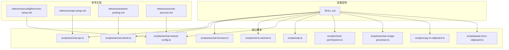
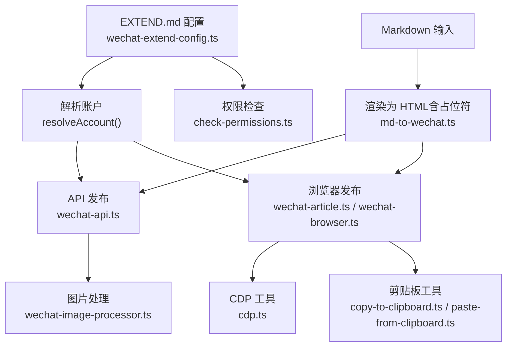
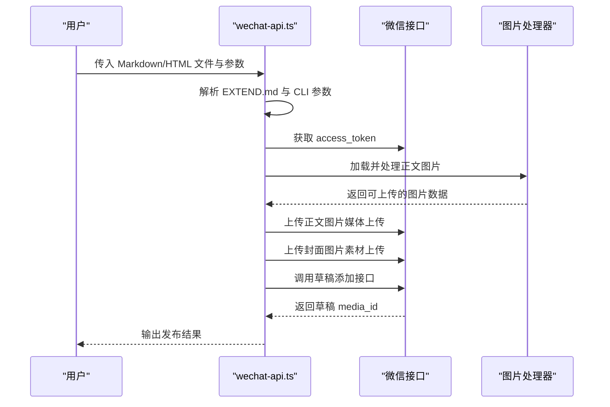
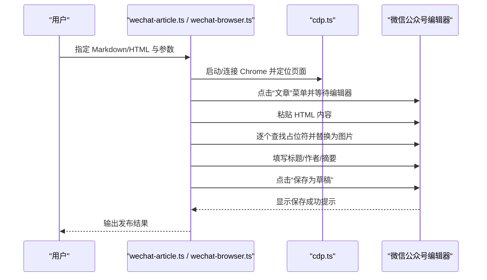
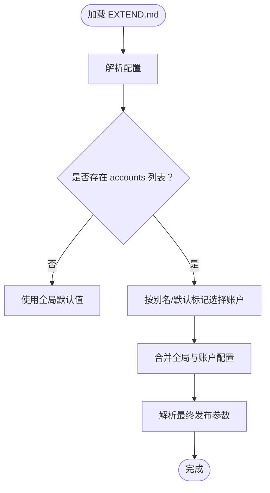
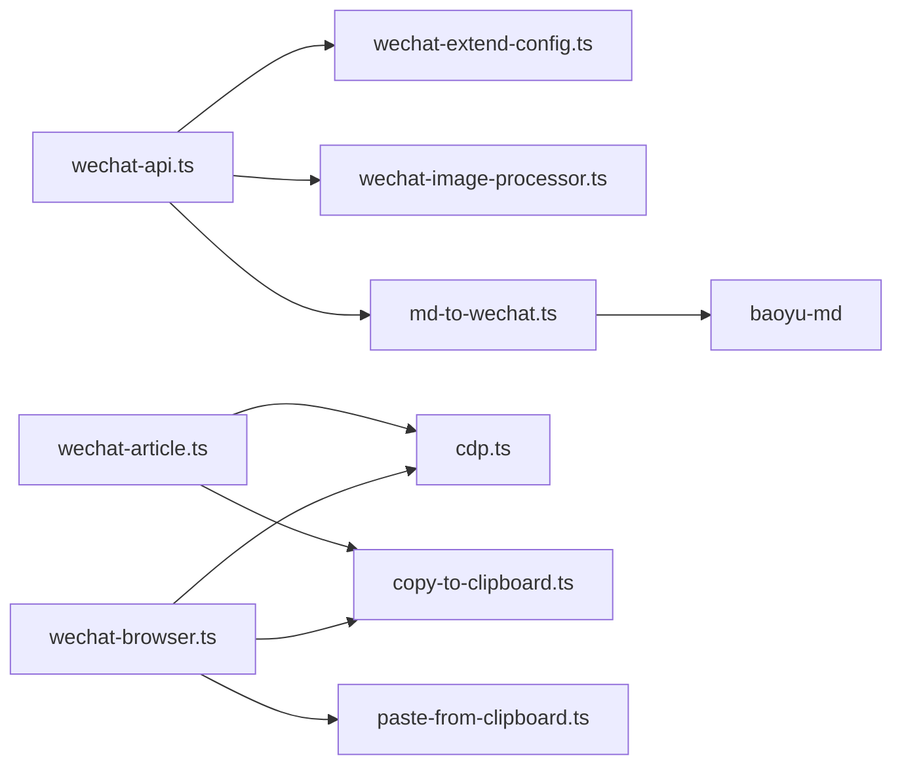

# 微信公众号发布技能

<cite>
**本文档引用的文件**
- [SKILL.md](file://.agents/skills/baoyu-post-to-wechat/SKILL.md)
- [first-time-setup.md](file://.agents/skills/baoyu-post-to-wechat/references/config/first-time-setup.md)
- [api-setup.md](file://.agents/skills/baoyu-post-to-wechat/references/api-setup.md)
- [article-posting.md](file://.agents/skills/baoyu-post-to-wechat/references/article-posting.md)
- [multi-account.md](file://.agents/skills/baoyu-post-to-wechat/references/multi-account.md)
- [wechat-api.ts](file://.agents/skills/baoyu-post-to-wechat/scripts/wechat-api.ts)
- [wechat-article.ts](file://.agents/skills/baoyu-post-to-wechat/scripts/wechat-article.ts)
- [wechat-browser.ts](file://.agents/skills/baoyu-post-to-wechat/scripts/wechat-browser.ts)
- [md-to-wechat.ts](file://.agents/skills/baoyu-post-to-wechat/scripts/md-to-wechat.ts)
- [wechat-extend-config.ts](file://.agents/skills/baoyu-post-to-wechat/scripts/wechat-extend-config.ts)
- [cdp.ts](file://.agents/skills/baoyu-post-to-wechat/scripts/cdp.ts)
- [check-permissions.ts](file://.agents/skills/baoyu-post-to-wechat/scripts/check-permissions.ts)
- [wechat-image-processor.ts](file://.agents/skills/baoyu-post-to-wechat/scripts/wechat-image-processor.ts)
- [copy-to-clipboard.ts](file://.agents/skills/baoyu-post-to-wechat/scripts/copy-to-clipboard.ts)
- [paste-from-clipboard.ts](file://.agents/skills/baoyu-post-to-wechat/scripts/paste-from-clipboard.ts)
</cite>

## 目录
1. [简介](#简介)
2. [项目结构](#项目结构)
3. [核心组件](#核心组件)
4. [架构总览](#架构总览)
5. [详细组件分析](#详细组件分析)
6. [依赖关系分析](#依赖关系分析)
7. [性能考虑](#性能考虑)
8. [故障排查指南](#故障排查指南)
9. [结论](#结论)
10. [附录](#附录)

## 简介
本技能用于将内容发布到微信公众号（服务号/订阅号），支持两种发布方式：
- API 方法：通过微信官方接口将文章保存至草稿箱，适合批量与自动化场景，速度快。
- 浏览器自动化方法：通过 Chrome CDP 控制浏览器完成文章编辑与发布，适合需要复杂排版或临时处理的场景。

技能提供统一的配置体系（EXTEND.md）、多账号支持、主题与颜色系统、封面图片处理、评论控制、以及完善的发布前检查与故障排查能力。

## 项目结构
技能目录位于 `.agents/skills/baoyu-post-to-wechat`，主要由以下部分组成：
- 参考文档：配置、API 设置、文章发布、多账号等说明
- 核心脚本：API 发布、浏览器发布、Markdown 渲染、CDP 工具、权限检查、图片处理等
- 技能说明：SKILL.md 提供用户交互、参数、使用示例与故障排查

**图表来源**
- [SKILL.md:1-268](file://.agents/skills/baoyu-post-to-wechat/SKILL.md#L1-L268)
- [wechat-api.ts:1-796](file://.agents/skills/baoyu-post-to-wechat/scripts/wechat-api.ts#L1-L796)
- [wechat-article.ts:1-849](file://.agents/skills/baoyu-post-to-wechat/scripts/wechat-article.ts#L1-L849)
- [wechat-browser.ts:1-742](file://.agents/skills/baoyu-post-to-wechat/scripts/wechat-browser.ts#L1-L742)
- [md-to-wechat.ts:1-173](file://.agents/skills/baoyu-post-to-wechat/scripts/md-to-wechat.ts#L1-L173)
- [wechat-extend-config.ts:1-314](file://.agents/skills/baoyu-post-to-wechat/scripts/wechat-extend-config.ts#L1-L314)
- [cdp.ts:1-256](file://.agents/skills/baoyu-post-to-wechat/scripts/cdp.ts#L1-L256)
- [check-permissions.ts:1-252](file://.agents/skills/baoyu-post-to-wechat/scripts/check-permissions.ts#L1-L252)
- [wechat-image-processor.ts:1-287](file://.agents/skills/baoyu-post-to-wechat/scripts/wechat-image-processor.ts#L1-L287)
- [copy-to-clipboard.ts:1-381](file://.agents/skills/baoyu-post-to-wechat/scripts/copy-to-clipboard.ts#L1-L381)
- [paste-from-clipboard.ts:1-195](file://.agents/skills/baoyu-post-to-wechat/scripts/paste-from-clipboard.ts#L1-L195)

**章节来源**
- [SKILL.md:1-268](file://.agents/skills/baoyu-post-to-wechat/SKILL.md#L1-L268)

## 核心组件
- 配置系统（EXTEND.md）：集中管理默认主题、颜色、默认发布方式、默认作者、评论开关、Chrome 配置、多账号信息等
- API 发布（wechat-api.ts）：获取 access_token、上传正文图片与封面、调用草稿接口、评论控制
- 浏览器发布（wechat-article.ts / wechat-browser.ts）：通过 CDP 自动化打开编辑器、粘贴内容、替换占位符、插入图片、保存草稿
- Markdown 渲染（md-to-wechat.ts）：将 Markdown 转换为带占位符的 HTML，并提取正文图片信息
- CDP 工具（cdp.ts）：启动/连接 Chrome、定位页面、元素点击、输入文本、等待新标签页
- 权限检查（check-permissions.ts）：检测 Chrome、剪贴板、快捷键、Bun 运行时、API 凭据等
- 图片处理（wechat-image-processor.ts）：正文图片压缩、格式转换、尺寸调整以满足微信接口限制
- 剪贴板工具（copy-to-clipboard.ts / paste-from-clipboard.ts）：跨平台复制图片/HTML 与发送粘贴快捷键

**章节来源**
- [wechat-api.ts:1-796](file://.agents/skills/baoyu-post-to-wechat/scripts/wechat-api.ts#L1-L796)
- [wechat-article.ts:1-849](file://.agents/skills/baoyu-post-to-wechat/scripts/wechat-article.ts#L1-L849)
- [wechat-browser.ts:1-742](file://.agents/skills/baoyu-post-to-wechat/scripts/wechat-browser.ts#L1-L742)
- [md-to-wechat.ts:1-173](file://.agents/skills/baoyu-post-to-wechat/scripts/md-to-wechat.ts#L1-L173)
- [wechat-extend-config.ts:1-314](file://.agents/skills/baoyu-post-to-wechat/scripts/wechat-extend-config.ts#L1-L314)
- [cdp.ts:1-256](file://.agents/skills/baoyu-post-to-wechat/scripts/cdp.ts#L1-L256)
- [check-permissions.ts:1-252](file://.agents/skills/baoyu-post-to-wechat/scripts/check-permissions.ts#L1-L252)
- [wechat-image-processor.ts:1-287](file://.agents/skills/baoyu-post-to-wechat/scripts/wechat-image-processor.ts#L1-L287)
- [copy-to-clipboard.ts:1-381](file://.agents/skills/baoyu-post-to-wechat/scripts/copy-to-clipboard.ts#L1-L381)
- [paste-from-clipboard.ts:1-195](file://.agents/skills/baoyu-post-to-wechat/scripts/paste-from-clipboard.ts#L1-L195)

## 架构总览
技能采用“配置驱动 + 多发布路径”的架构设计：
- 配置层：EXTEND.md 解析与解析结果（ResolvedAccount）贯穿所有发布流程
- 渲染层：Markdown 文章统一走 md-to-wechat.ts 生成带占位符的 HTML
- 发布层：API 或浏览器两条路径，分别对接微信接口与浏览器自动化
- 工具层：CDP、剪贴板、图片处理、权限检查等通用能力

**图表来源**
- [wechat-extend-config.ts:132-172](file://.agents/skills/baoyu-post-to-wechat/scripts/wechat-extend-config.ts#L132-L172)
- [md-to-wechat.ts:33-89](file://.agents/skills/baoyu-post-to-wechat/scripts/md-to-wechat.ts#L33-L89)
- [wechat-api.ts:616-790](file://.agents/skills/baoyu-post-to-wechat/scripts/wechat-api.ts#L616-L790)
- [wechat-article.ts:460-749](file://.agents/skills/baoyu-post-to-wechat/scripts/wechat-article.ts#L460-L749)
- [wechat-browser.ts:126-653](file://.agents/skills/baoyu-post-to-wechat/scripts/wechat-browser.ts#L126-L653)
- [wechat-image-processor.ts:230-286](file://.agents/skills/baoyu-post-to-wechat/scripts/wechat-image-processor.ts#L230-L286)
- [cdp.ts:108-150](file://.agents/skills/baoyu-post-to-wechat/scripts/cdp.ts#L108-L150)
- [copy-to-clipboard.ts:252-275](file://.agents/skills/baoyu-post-to-wechat/scripts/copy-to-clipboard.ts#L252-L275)
- [paste-from-clipboard.ts:142-154](file://.agents/skills/baoyu-post-to-wechat/scripts/paste-from-clipboard.ts#L142-L154)
- [check-permissions.ts:223-246](file://.agents/skills/baoyu-post-to-wechat/scripts/check-permissions.ts#L223-L246)

## 详细组件分析

### API 发布流程（wechat-api.ts）
- 访问令牌获取：根据 AppID/AppSecret 请求微信接口获取 access_token
- 图片处理与上传：
  - 正文图片：按需压缩/转码，使用媒体上传接口获取 URL
  - 封面图片：使用素材上传接口获取 media_id
-  草稿发布：构造文章对象（标题、摘要、作者、封面、正文 HTML、评论控制），调用草稿添加接口
- 元数据与主题：从 EXTEND.md 与 CLI 参数解析主题、颜色、评论开关等

**图表来源**
- [wechat-api.ts:66-80](file://.agents/skills/baoyu-post-to-wechat/scripts/wechat-api.ts#L66-L80)
- [wechat-api.ts:162-203](file://.agents/skills/baoyu-post-to-wechat/scripts/wechat-api.ts#L162-L203)
- [wechat-api.ts:245-351](file://.agents/skills/baoyu-post-to-wechat/scripts/wechat-api.ts#L245-L351)
- [wechat-api.ts:353-407](file://.agents/skills/baoyu-post-to-wechat/scripts/wechat-api.ts#L353-L407)
- [wechat-image-processor.ts:113-125](file://.agents/skills/baoyu-post-to-wechat/scripts/wechat-image-processor.ts#L113-L125)
- [wechat-image-processor.ts:230-286](file://.agents/skills/baoyu-post-to-wechat/scripts/wechat-image-processor.ts#L230-L286)

**章节来源**
- [wechat-api.ts:616-790](file://.agents/skills/baoyu-post-to-wechat/scripts/wechat-api.ts#L616-L790)
- [wechat-image-processor.ts:1-287](file://.agents/skills/baoyu-post-to-wechat/scripts/wechat-image-processor.ts#L1-L287)

### 浏览器发布流程（wechat-article.ts / wechat-browser.ts）
- 启动/连接 Chrome：优先复用已有实例，否则新建实例并连接 CDP
- 登录与页面导航：等待登录成功，进入主页并打开文章编辑器
- 内容粘贴：将渲染后的 HTML 粘贴到编辑器，逐个替换占位符为实际图片
- 保存草稿：触发保存为草稿按钮，等待提示确认

**图表来源**
- [wechat-article.ts:460-749](file://.agents/skills/baoyu-post-to-wechat/scripts/wechat-article.ts#L460-L749)
- [wechat-browser.ts:126-653](file://.agents/skills/baoyu-post-to-wechat/scripts/wechat-browser.ts#L126-L653)
- [cdp.ts:108-150](file://.agents/skills/baoyu-post-to-wechat/scripts/cdp.ts#L108-L150)

**章节来源**
- [wechat-article.ts:1-849](file://.agents/skills/baoyu-post-to-wechat/scripts/wechat-article.ts#L1-L849)
- [wechat-browser.ts:1-742](file://.agents/skills/baoyu-post-to-wechat/scripts/wechat-browser.ts#L1-L742)
- [cdp.ts:1-256](file://.agents/skills/baoyu-post-to-wechat/scripts/cdp.ts#L1-L256)

### 配置系统（EXTEND.md 与 wechat-extend-config.ts）
- 支持全局默认项：默认主题、默认颜色、默认发布方式、默认作者、评论开关、Chrome 配置
- 支持多账号：每个账号可独立设置默认发布方式、作者、评论开关、AppID/AppSecret、Chrome 配置
- 账户解析：根据 --account 别名或默认标记选择账户，合并全局与账户级配置
- 凭据加载：优先账户内配置，其次环境变量（支持带前缀的多账号变量），最后回退到全局变量

**图表来源**
- [wechat-extend-config.ts:132-172](file://.agents/skills/baoyu-post-to-wechat/scripts/wechat-extend-config.ts#L132-L172)
- [wechat-extend-config.ts:274-309](file://.agents/skills/baoyu-post-to-wechat/scripts/wechat-extend-config.ts#L274-L309)

**章节来源**
- [wechat-extend-config.ts:1-314](file://.agents/skills/baoyu-post-to-wechat/scripts/wechat-extend-config.ts#L1-L314)
- [first-time-setup.md:1-204](file://.agents/skills/baoyu-post-to-wechat/references/config/first-time-setup.md#L1-L204)
- [multi-account.md:1-102](file://.agents/skills/baoyu-post-to-wechat/references/multi-account.md#L1-L102)

### 主题与颜色系统
- 主题选项：default、grace、simple、modern
- 颜色预设：blue、green、vermilion、yellow、purple、sky、rose、olive、black、gray、pink、red、orange，或自定义十六进制
- 渲染策略：Markdown 渲染时应用主题与颜色，输出带占位符的 HTML，确保 API 与浏览器路径一致

**章节来源**
- [SKILL.md:74-76](file://.agents/skills/baoyu-post-to-wechat/SKILL.md#L74-L76)
- [md-to-wechat.ts:33-89](file://.agents/skills/baoyu-post-to-wechat/scripts/md-to-wechat.ts#L33-L89)

### 图片处理与封面上传（API 路径）
- 正文图片处理：超过大小限制或不被允许的格式时进行压缩/转码，优先 PNG，必要时转 JPEG
- 封面图片上传：使用素材上传接口，返回 media_id
- 占位符替换：将 HTML 中的占位符替换为上传后的 URL 或 media_id

**章节来源**
- [wechat-image-processor.ts:113-125](file://.agents/skills/baoyu-post-to-wechat/scripts/wechat-image-processor.ts#L113-L125)
- [wechat-image-processor.ts:230-286](file://.agents/skills/baoyu-post-to-wechat/scripts/wechat-image-processor.ts#L230-L286)
- [wechat-api.ts:245-351](file://.agents/skills/baoyu-post-to-wechat/scripts/wechat-api.ts#L245-L351)

### 评论控制配置
- 默认开启评论，全部读者可评论
- 可限制仅粉丝可评论
- 以上行为由 EXTEND.md 的 need_open_comment 与 only_fans_can_comment 决定，并在草稿添加请求中透传

**章节来源**
- [SKILL.md:58-60](file://.agents/skills/baoyu-post-to-wechat/SKILL.md#L58-L60)
- [wechat-api.ts:353-407](file://.agents/skills/baoyu-post-to-wechat/scripts/wechat-api.ts#L353-L407)

### 发布前检查与权限验证
- 检查 Chrome 是否可用、是否隔离运行、Bun 运行时、剪贴板权限、粘贴快捷键（macOS 使用 osascript，Linux 使用 xdotool/ydotool）
- 检查 API 凭据是否存在
- 对于 macOS，检查辅助功能与剪贴板写入能力

**章节来源**
- [check-permissions.ts:1-252](file://.agents/skills/baoyu-post-to-wechat/scripts/check-permissions.ts#L1-L252)
- [SKILL.md:84-103](file://.agents/skills/baoyu-post-to-wechat/SKILL.md#L84-L103)

## 依赖关系分析
- wechat-api.ts 依赖：
  - wechat-extend-config.ts：读取 EXTEND.md 与解析账户
  - wechat-image-processor.ts：图片处理与上传
  - md-to-wechat.ts：Markdown 渲染（间接）
- wechat-article.ts / wechat-browser.ts 依赖：
  - cdp.ts：Chrome 启动/连接、页面交互
  - copy-to-clipboard.ts / paste-from-clipboard.ts：跨平台粘贴
  - wechat-extend-config.ts：多账号与 Chrome 配置
- md-to-wechat.ts 依赖：
  - baoyu-md：Markdown 渲染、占位符替换、摘要提取等

**图表来源**
- [wechat-api.ts:1-12](file://.agents/skills/baoyu-post-to-wechat/scripts/wechat-api.ts#L1-L12)
- [wechat-article.ts:1-8](file://.agents/skills/baoyu-post-to-wechat/scripts/wechat-article.ts#L1-L8)
- [wechat-browser.ts:1-14](file://.agents/skills/baoyu-post-to-wechat/scripts/wechat-browser.ts#L1-L14)
- [md-to-wechat.ts:1-17](file://.agents/skills/baoyu-post-to-wechat/scripts/md-to-wechat.ts#L1-L17)

**章节来源**
- [wechat-api.ts:1-12](file://.agents/skills/baoyu-post-to-wechat/scripts/wechat-api.ts#L1-L12)
- [wechat-article.ts:1-8](file://.agents/skills/baoyu-post-to-wechat/scripts/wechat-article.ts#L1-L8)
- [wechat-browser.ts:1-14](file://.agents/skills/baoyu-post-to-wechat/scripts/wechat-browser.ts#L1-L14)
- [md-to-wechat.ts:1-17](file://.agents/skills/baoyu-post-to-wechat/scripts/md-to-wechat.ts#L1-L17)

## 性能考虑
- API 路径：
  - 图片压缩与格式转换在本地完成，避免重复网络传输
  - 正文图片与封面分别上传，减少单次请求体积
- 浏览器路径：
  - 优先复用现有 Chrome 实例，避免重复启动开销
  - 使用 CDP 直接操作 DOM，减少键盘输入延迟
- 配置缓存：
  - EXTEND.md 解析结果在流程中复用，避免重复 IO

[本节为通用建议，无需特定文件引用]

## 故障排查指南
常见问题与解决思路：
- 缺少 API 凭据：运行引导式设置，将 AppID/AppSecret 写入 .baoyu-skills/.env
- 访问令牌错误：检查凭据有效性与有效期
- 未登录（浏览器）：首次运行会打开浏览器，请扫码登录
- Chrome 未找到：设置 WECHAT_BROWSER_CHROME_PATH 或安装 Chrome
- 标题/摘要缺失：启用自动提取或手动提供
- 缺少封面：在 frontmatter 指定封面或在文章目录放置 imgs/cover.png
- 评论默认值不符：检查 EXTEND.md 中 need_open_comment 与 only_fans_can_comment
- 粘贴失败：检查系统剪贴板权限与快捷键工具（xdotool/ydotool/osascript）

**章节来源**
- [api-setup.md:1-42](file://.agents/skills/baoyu-post-to-wechat/references/api-setup.md#L1-L42)
- [SKILL.md:242-254](file://.agents/skills/baoyu-post-to-wechat/SKILL.md#L242-L254)
- [check-permissions.ts:28-246](file://.agents/skills/baoyu-post-to-wechat/scripts/check-permissions.ts#L28-L246)

## 结论
该技能提供了稳定、可扩展的微信公众号发布方案，兼顾自动化效率与人工排版灵活性。通过统一的配置体系与工具链，用户可在不同场景下选择最适合的发布方式，并获得一致的体验与结果。

[本节为总结性内容，无需特定文件引用]

## 附录

### 配置指南（EXTEND.md）
- 位置优先级：项目级 > XDG 配置目录 > 用户目录
- 关键键值：
  - default_theme / default_color：默认主题与颜色
  - default_publish_method：默认发布方式（api / browser）
  - default_author：默认作者
  - need_open_comment / only_fans_can_comment：评论控制
  - chrome_profile_path：Chrome 配置路径
  - accounts：多账号列表，每账号可覆盖上述键值

**章节来源**
- [SKILL.md:42-76](file://.agents/skills/baoyu-post-to-wechat/SKILL.md#L42-L76)
- [first-time-setup.md:139-204](file://.agents/skills/baoyu-post-to-wechat/references/config/first-time-setup.md#L139-L204)
- [multi-account.md:14-92](file://.agents/skills/baoyu-post-to-wechat/references/multi-account.md#L14-L92)

### API 凭证配置
- 优先级：EXTEND.md 账户配置 > 环境变量（支持带前缀的多账号变量） > 全局变量
- 引导式设置：当未检测到凭据时，按指引填写并保存至 .baoyu-skills/.env

**章节来源**
- [api-setup.md:1-42](file://.agents/skills/baoyu-post-to-wechat/references/api-setup.md#L1-L42)
- [wechat-extend-config.ts:274-309](file://.agents/skills/baoyu-post-to-wechat/scripts/wechat-extend-config.ts#L274-L309)

### Chrome 配置
- 启动参数：禁用自动化标识、最大化窗口
- 配置隔离：使用独立用户数据目录，避免与系统 Chrome 冲突
- 多账号隔离：每个账号可指定独立 Chrome 配置目录

**章节来源**
- [cdp.ts:108-132](file://.agents/skills/baoyu-post-to-wechat/scripts/cdp.ts#L108-L132)
- [multi-account.md:83-92](file://.agents/skills/baoyu-post-to-wechat/references/multi-account.md#L83-L92)

### 文章主题系统与颜色配置
- 主题：default、grace、simple、modern
- 颜色：预设名称或十六进制
- 应用：渲染时生效，确保 API 与浏览器路径一致

**章节来源**
- [SKILL.md:74-76](file://.agents/skills/baoyu-post-to-wechat/SKILL.md#L74-L76)
- [md-to-wechat.ts:33-89](file://.agents/skills/baoyu-post-to-wechat/scripts/md-to-wechat.ts#L33-L89)

### 元数据处理机制
- 标题：frontmatter.title > Markdown 首标题 > 自动生成
- 摘要：frontmatter.description/summary > 正文首段截断至 120 字
- 作者：CLI --author > frontmatter.author > EXTEND.md default_author
- 原文链接：frontmatter.sourceUrl/source_url

**章节来源**
- [wechat-api.ts:616-694](file://.agents/skills/baoyu-post-to-wechat/scripts/wechat-api.ts#L616-L694)
- [article-posting.md:34-58](file://.agents/skills/baoyu-post-to-wechat/references/article-posting.md#L34-L58)