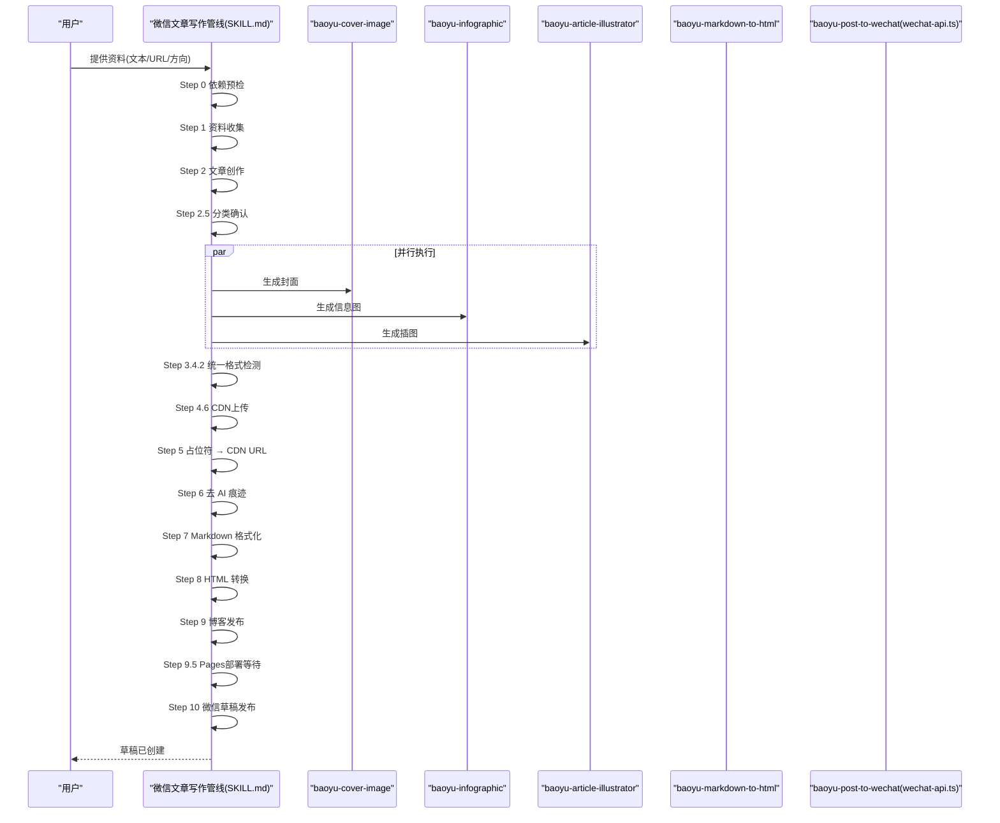
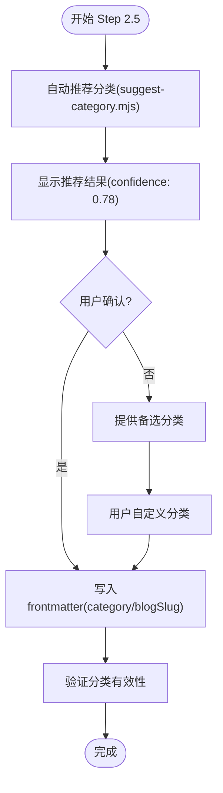
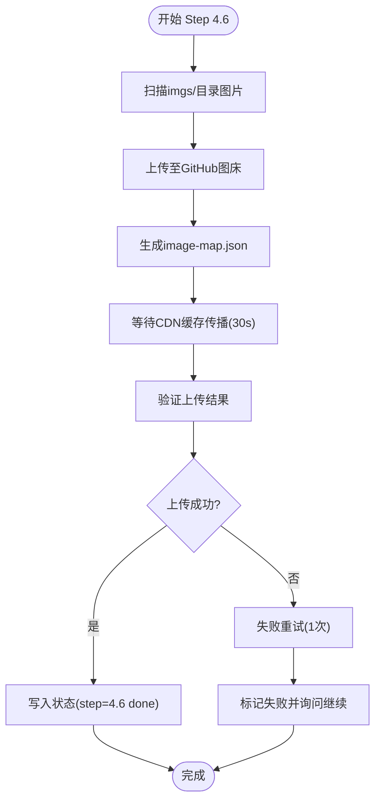
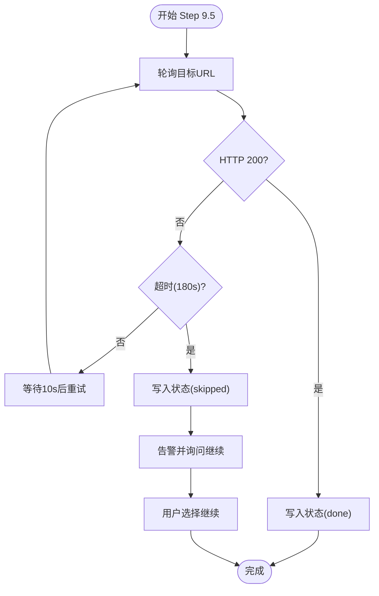
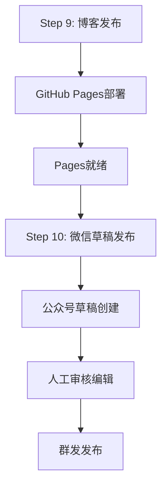
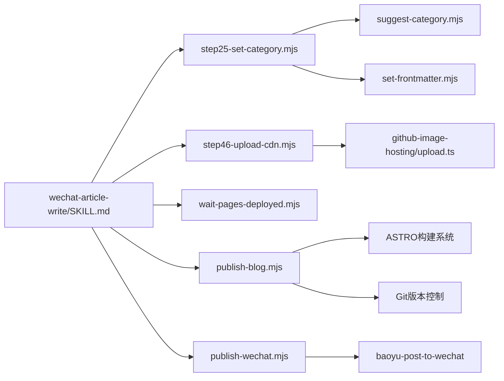

# 微信文章写作管线

<cite>
**本文档引用的文件**
- [SKILL.md](file://.agents/skills/wechat-article-write/SKILL.md)
- [EXTEND.md](file://.agents/skills/wechat-article-write/EXTEND.md)
- [step25-set-category.mjs](file://.agents/skills/wechat-article-write/scripts/step25-set-category.mjs)
- [step46-upload-cdn.mjs](file://.agents/skills/wechat-article-write/scripts/step46-upload-cdn.mjs)
- [wait-pages-deployed.mjs](file://.agents/skills/wechat-article-write/scripts/wait-pages-deployed.mjs)
- [publish-blog.mjs](file://.agents/skills/wechat-article-write/scripts/publish-blog.mjs)
- [publish-wechat.mjs](file://.agents/skills/wechat-article-write/scripts/publish-wechat.mjs)
- [cdn-fallback.md](file://.agents/skills/wechat-article-write/references/cdn-fallback.md)
</cite>

## 更新摘要
**变更内容**
- 将微信文章写作管线从13步流程升级到15步流程
- 新增 Category确认步骤（Step 2.5），实现文章分类的自动化推荐与确认
- 新增 CDN上传步骤（Step 4.6），前置图床上传并统一CDN缓存等待
- 新增 Pages部署等待步骤（Step 9.5），提供可选的部署状态监控
- 实施博客优先发布顺序，确保博客先行发布再进行微信草稿发布
- 完善双产物机制，支持CDN直连与本地降级的智能切换

## 目录
1. [简介](#简介)
2. [项目结构](#项目结构)
3. [核心组件](#核心组件)
4. [架构总览](#架构总览)
5. [详细组件分析](#详细组件分析)
6. [依赖关系分析](#依赖关系分析)
7. [性能考虑](#性能考虑)
8. [故障排查指南](#故障排查指南)
9. [结论](#结论)
10. [附录](#附录)

## 简介
本文件为"微信文章写作管线"的技术文档，面向希望自动化完成从资料收集到微信公众号草稿发布的全流程工程师与运营人员。文档系统性阐述：
- 全自动流水线的15个步骤（含信息图生成）及其并行策略
- EXTEND.md 配置文件的结构、参数与优先级
- 与微信公众号 API 的集成机制（草稿管理、媒体上传、发布控制）
- 图片处理与格式校验的统一策略
- 语义占位符系统与预飞行检查机制
- 与其他 AI 技能的协作与数据流转
- 调试方法、错误处理与性能优化建议

**更新** 重大升级：从13步流程升级到15步流程，新增Category确认、CDN上传、Pages部署等待等关键步骤

## 项目结构
微信文章写作管线位于 `.agents/skills/wechat-article-write`，并依赖多个 baoyu 系列技能与发布脚本。关键文件与职责如下：
- wechat-article-write/EXTEND.md：运行时配置（快速模式、默认发布方式）
- wechat-article-write/SKILL.md：流水线步骤、并行策略、质量门控与合规检查
- 新增脚本：step25-set-category.mjs（分类确认）、step46-upload-cdn.mjs（CDN上传）、wait-pages-deployed.mjs（部署等待）

```mermaid
graph TB
subgraph "微信文章写作管线"
WAW["wechat-article-write/SKILL.md"]
WAE["wechat-article-write/EXTEND.md"]
end
subgraph "新增脚本组件"
STEP25["step25-set-category.mjs<br/>分类确认"]
STEP46["step46-upload-cdn.mjs<br/>CDN上传"]
WAITPAGES["wait-pages-deployed.mjs<br/>部署等待"]
PUBLISHBLOG["publish-blog.mjs<br/>博客发布"]
PUBLISHWC["publish-wechat.mjs<br/>微信发布"]
END
subgraph "baoyu 系列技能"
BI["baoyu-cover-image/EXTEND.md"]
BA["baoyu-article-illustrator/EXTEND.md"]
BM["baoyu-markdown-to-html/EXTEND.md"]
BP["baoyu-post-to-wechat/EXTEND.md"]
end
WAW --> STEP25
WAW --> STEP46
WAW --> WAITPAGES
WAW --> PUBLISHBLOG
WAW --> PUBLISHWC
WAW --> BI
WAW --> BA
WAW --> BM
WAW --> BP
```

**图表来源**
- [SKILL.md](file://.agents/skills/wechat-article-write/SKILL.md)
- [EXTEND.md](file://.agents/skills/wechat-article-write/EXTEND.md)
- [step25-set-category.mjs](file://.agents/skills/wechat-article-write/scripts/step25-set-category.mjs)
- [step46-upload-cdn.mjs](file://.agents/skills/wechat-article-write/scripts/step46-upload-cdn.mjs)
- [wait-pages-deployed.mjs](file://.agents/skills/wechat-article-write/scripts/wait-pages-deployed.mjs)
- [publish-blog.mjs](file://.agents/skills/wechat-article-write/scripts/publish-blog.mjs)
- [publish-wechat.mjs](file://.agents/skills/wechat-article-write/scripts/publish-wechat.mjs)

**章节来源**
- [SKILL.md](file://.agents/skills/wechat-article-write/SKILL.md)
- [EXTEND.md](file://.agents/skills/wechat-article-write/EXTEND.md)

## 核心组件
- 微信文章写作管线（调度层）
  - 负责依赖预检、资料收集、文章创作、分类确认、封面/信息图/插图并行生成、CDN上传、图片格式统一校验、Markdown整合、去AI痕迹、HTML转换、博客发布、Pages部署等待、微信草稿发布等步骤
  - 关键原则：全自动执行、失败不阻塞、封面不上传图床、内联插图走CDN、博客优先发布顺序、统一格式检测修正
- 新增分类确认机制
  - step25-set-category.mjs：自动推荐文章分类并写入frontmatter，支持用户确认与自定义
  - 分类枚举：ai-coding、ai-agents、ai-industry、ai-models、security、engineering
- 新增CDN上传前置机制
  - step46-upload-cdn.mjs：统一上传所有图片至GitHub图床，生成image-map.json并等待CDN缓存
  - 支持30秒CDN缓存等待，确保后续步骤的稳定性
- 新增Pages部署监控
  - wait-pages-deployed.mjs：可选的部署状态监控，支持超时配置与状态写入
- 博客优先发布顺序
  - Step 9（博客发布）在Step 10（微信发布）之前执行，确保sourceUrl的准确性

**章节来源**
- [SKILL.md](file://.agents/skills/wechat-article-write/SKILL.md)
- [step25-set-category.mjs](file://.agents/skills/wechat-article-write/scripts/step25-set-category.mjs)
- [step46-upload-cdn.mjs](file://.agents/skills/wechat-article-write/scripts/step46-upload-cdn.mjs)
- [wait-pages-deployed.mjs](file://.agents/skills/wechat-article-write/scripts/wait-pages-deployed.mjs)

## 架构总览
微信文章写作管线采用"调度层 + 多技能并行 + 新增前置处理 + 微信发布脚本"的分层架构。调度层（SKILL.md）定义15步流程与并行策略；并行子流程（封面、信息图、插图）由对应技能完成；新增的前置处理包括分类确认和CDN上传；最终通过博客发布和微信发布脚本实现双轨发布。



**图表来源**
- [SKILL.md](file://.agents/skills/wechat-article-write/SKILL.md)

## 详细组件分析

### 新增分类确认机制（Step 2.5）
- step25-set-category.mjs
  - 自动调用suggest-category.mjs推荐文章分类，支持confidence评分
  - 通过set-frontmatter.mjs写入category和blogSlug字段
  - 支持用户确认、备选分类选择和自定义分类
  - 分类枚举：ai-coding、ai-agents、ai-industry、ai-models、security、engineering



**图表来源**
- [step25-set-category.mjs](file://.agents/skills/wechat-article-write/scripts/step25-set-category.mjs)

**章节来源**
- [step25-set-category.mjs](file://.agents/skills/wechat-article-write/scripts/step25-set-category.mjs)
- [SKILL.md](file://.agents/skills/wechat-article-write/SKILL.md)

### 新增CDN上传前置机制（Step 4.6）
- step46-upload-cdn.mjs
  - 统一上传imgs/目录下所有图片至GitHub图床
  - 生成image-map.json映射表，支持30秒CDN缓存等待
  - 使用纯ASCII命名规范，避免中文字符导致的JSON解析失败
  - 支持失败重试和状态写入



**图表来源**
- [step46-upload-cdn.mjs](file://.agents/skills/wechat-article-write/scripts/step46-upload-cdn.mjs)

**章节来源**
- [step46-upload-cdn.mjs](file://.agents/skills/wechat-article-write/scripts/step46-upload-cdn.mjs)
- [SKILL.md](file://.agents/skills/wechat-article-write/SKILL.md)

### 新增Pages部署等待机制（Step 9.5）
- wait-pages-deployed.mjs
  - 可选的部署状态监控，支持超时配置（默认180秒）
  - 轮询https://ntlx.github.io/articles/{slug}/确认部署完成
  - 支持HEAD和GET请求回退，自动写入状态（done/skipped）
  - 提供详细的探测日志和错误信息



**图表来源**
- [wait-pages-deployed.mjs](file://.agents/skills/wechat-article-write/scripts/wait-pages-deployed.mjs)

**章节来源**
- [wait-pages-deployed.mjs](file://.agents/skills/wechat-article-write/scripts/wait-pages-deployed.mjs)
- [SKILL.md](file://.agents/skills/wechat-article-write/SKILL.md)

### 博客优先发布顺序
- Step 9（博客发布）在Step 10（微信发布）之前执行
- sourceUrl在Step 2创作时已预先填入，确保微信草稿的"阅读原文"链接准确
- publish-blog.mjs负责frontmatter转换、文件复制、构建验证和git推送
- publish-wechat.mjs在Step 9完成后直接使用已验证的sourceUrl进行发布



**图表来源**
- [publish-blog.mjs](file://.agents/skills/wechat-article-write/scripts/publish-blog.mjs)
- [publish-wechat.mjs](file://.agents/skills/wechat-article-write/scripts/publish-wechat.mjs)

**章节来源**
- [publish-blog.mjs](file://.agents/skills/wechat-article-write/scripts/publish-blog.mjs)
- [publish-wechat.mjs](file://.agents/skills/wechat-article-write/scripts/publish-wechat.mjs)
- [SKILL.md](file://.agents/skills/wechat-article-write/SKILL.md)

### CDN降级策略完善
- cdn-fallback.md提供完整的CDN失败降级策略
- 双产物机制：article.md（CDN直连）和article-local.md（本地降级）
- run-with-cdn-fallback.sh统一处理降级逻辑，支持HTML转换和微信发布
- Step 8和Step 10的CDN超时自动切换到本地路径，成功后自动回写为CDN URL

**章节来源**
- [cdn-fallback.md](file://.agents/skills/wechat-article-write/references/cdn-fallback.md)
- [SKILL.md](file://.agents/skills/wechat-article-write/SKILL.md)

## 依赖关系分析
- 调度层依赖
  - wechat-article-write/SKILL.md 依赖新增脚本和EXTEND.md与.env
  - 依赖baoyu系列技能的EXTEND.md与脚本路径
- 新增脚本依赖
  - step25-set-category.mjs：依赖suggest-category.mjs和set-frontmatter.mjs
  - step46-upload-cdn.mjs：依赖github-image-hosting技能的upload.ts
  - wait-pages-deployed.mjs：独立脚本，无外部依赖
  - publish-blog.mjs：依赖ASTRO构建系统和Git
  - publish-wechat.mjs：依赖baoyu-post-to-wechat技能
- 发布层依赖
  - wechat-api.ts 依赖微信官方接口与图片处理模块
  - wechat-image-processor.ts 提供本地图像处理能力



**图表来源**
- [SKILL.md](file://.agents/skills/wechat-article-write/SKILL.md)
- [step25-set-category.mjs](file://.agents/skills/wechat-article-write/scripts/step25-set-category.mjs)
- [step46-upload-cdn.mjs](file://.agents/skills/wechat-article-write/scripts/step46-upload-cdn.mjs)
- [wait-pages-deployed.mjs](file://.agents/skills/wechat-article-write/scripts/wait-pages-deployed.mjs)
- [publish-blog.mjs](file://.agents/skills/wechat-article-write/scripts/publish-blog.mjs)
- [publish-wechat.mjs](file://.agents/skills/wechat-article-write/scripts/publish-wechat.mjs)

**章节来源**
- [SKILL.md](file://.agents/skills/wechat-article-write/SKILL.md)

## 性能考虑
- 并行执行优化
  - Step 3（封面）、Step 4（插图）、Step 4.5（信息图）必须并行，显著缩短图片生成耗时
  - 新增Step 2.5分类确认在并行生成前执行，避免后续步骤的重复工作
- CDN前置上传
  - Step 4.6统一上传所有图片，避免分散上传导致的重复工作和CDN缓存问题
  - 30秒CDN缓存等待集中处理，减少后续步骤的等待时间
- 博客优先发布
  - Step 9先于Step 10执行，确保sourceUrl的准确性，避免微信发布时的URL验证问题
- 双产物机制
  - Step 5同时生成article.md和article-local.md，支持CDN降级的无缝切换
- 状态写入内聚
  - 所有Step通过脚本内置状态写入，agent只需调用对应脚本，简化断点续跑

## 故障排查指南
- 依赖预检失败
  - 检查技能脚本路径与node_modules是否存在，必要时执行bun install
- 分类确认失败
  - 检查suggest-category.mjs是否正常运行，确认用户选择的分类在枚举范围内
- CDN上传失败
  - 检查GitHub token和仓库权限，确认图片文件格式正确（PNG/JPG/WebP）
  - 避免使用中文文件名，确保--name参数为纯ASCII
- Pages部署等待超时
  - 检查网络连接和GitHub Pages服务状态，适当增加超时时间
  - 确认博客发布已成功提交和推送
- 博客发布失败
  - 检查frontmatter字段完整性，确认blog-slug为纯ASCII kebab-case
  - 验证ASTRO构建是否通过，检查Git推送权限
- 微信发布失败
  - 检查sourceUrl是否可达，确认封面文件存在且格式正确
  - 验证微信公众号API配置和权限

**章节来源**
- [SKILL.md](file://.agents/skills/wechat-article-write/SKILL.md)
- [step25-set-category.mjs](file://.agents/skills/wechat-article-write/scripts/step25-set-category.mjs)
- [step46-upload-cdn.mjs](file://.agents/skills/wechat-article-write/scripts/step46-upload-cdn.mjs)
- [wait-pages-deployed.mjs](file://.agents/skills/wechat-article-write/scripts/wait-pages-deployed.mjs)
- [publish-blog.mjs](file://.agents/skills/wechat-article-write/scripts/publish-blog.mjs)
- [publish-wechat.mjs](file://.agents/skills/wechat-article-write/scripts/publish-wechat.mjs)

## 结论
微信文章写作管线通过15步流程的全面升级，实现了更加完善和可靠的自动化发布体系。新增的分类确认、CDN上传前置和Pages部署等待机制，显著提升了流程的智能化程度和稳定性。博客优先发布顺序确保了sourceUrl的准确性，双产物机制和CDN降级策略提供了更好的容错能力。新增脚本的模块化设计使得每个步骤的功能更加清晰，便于维护和扩展。遵循本文档的配置与流程建议，可显著提升生产效率与发布质量。

## 附录

### 新增脚本功能速查
- step25-set-category.mjs：文章分类确认与frontmatter写入
  - 自动推荐分类（confidence评分）
  - 用户确认与自定义支持
  - 分类枚举验证
- step46-upload-cdn.mjs：CDN上传前置
  - 统一图片上传至GitHub图床
  - image-map.json生成
  - 30秒CDN缓存等待
- wait-pages-deployed.mjs：Pages部署监控
  - 可选的部署状态轮询
  - 超时配置（默认180秒）
  - HEAD/GET请求回退
- publish-blog.mjs：博客发布
  - frontmatter转换（summary→description）
  - ASTRO构建验证
  - Git推送与状态管理
- publish-wechat.mjs：微信发布
  - sourceUrl探活检查
  - 草稿创建与状态写入

### 15步流程详细说明
- **Step 0**：依赖预检（必需）
- **Step 1**：资料收集
- **Step 2**：文章创作
- **Step 2.5**：分类确认（新增）
- **Step 3**：封面图生成
- **Step 4**：插图生成
- **Step 4.5**：信息图生成
- **Step 3.4.2**：统一格式检测
- **Step 4.6**：CDN上传（新增）
- **Step 5**：占位符→CDN URL
- **Step 6**：去AI痕迹
- **Step 7**：Markdown格式化
- **Step 8**：HTML转换
- **Step 9**：博客发布（博客优先）
- **Step 9.5**：Pages部署等待（新增）
- **Step 10**：微信草稿发布

### 配置项速查
- wechat-article-write/EXTEND.md
  - quick_mode：true/false
  - default_publish_method：api/browser
  - 依赖技能EXTEND.md路径与必需项
  - .env路径与变量
- 新增配置项
  - 分类确认：支持用户自定义分类
  - CDN上传：GitHub图床配置
  - Pages等待：超时和间隔参数

**章节来源**
- [EXTEND.md](file://.agents/skills/wechat-article-write/EXTEND.md)
- [step25-set-category.mjs](file://.agents/skills/wechat-article-write/scripts/step25-set-category.mjs)
- [step46-upload-cdn.mjs](file://.agents/skills/wechat-article-write/scripts/step46-upload-cdn.mjs)
- [wait-pages-deployed.mjs](file://.agents/skills/wechat-article-write/scripts/wait-pages-deployed.mjs)
- [publish-blog.mjs](file://.agents/skills/wechat-article-write/scripts/publish-blog.mjs)
- [publish-wechat.mjs](file://.agents/skills/wechat-article-write/scripts/publish-wechat.mjs)