# 微信文章写作管线

<cite>
**本文档引用的文件**
- [EXTEND.md](file://.agents/skills/wechat-article-write/EXTEND.md)
- [SKILL.md](file://.agents/skills/wechat-article-write/SKILL.md)
- [EXTEND.md](file://.baoyu-skills/baoyu-post-to-wechat/EXTEND.md)
- [wechat-extend-config.ts](file://.agents/skills/baoyu-post-to-wechat/scripts/wechat-extend-config.ts)
- [wechat-api.ts](file://.agents/skills/baoyu-post-to-wechat/scripts/wechat-api.ts)
- [wechat-image-processor.ts](file://.agents/skills/baoyu-post-to-wechat/scripts/wechat-image-processor.ts)
- [wechat-article.ts](file://.agents/skills/baoyu-post-to-wechat/scripts/wechat-article.ts)
- [md-to-wechat.ts](file://.agents/skills/baoyu-post-to-wechat/scripts/md-to-wechat.ts)
</cite>

## 目录
1. [简介](#简介)
2. [项目结构](#项目结构)
3. [核心组件](#核心组件)
4. [架构总览](#架构总览)
5. [详细组件分析](#详细组件分析)
6. [依赖关系分析](#依赖关系分析)
7. [性能考虑](#性能考虑)
8. [故障排查指南](#故障排查指南)
9. [结论](#结论)
10. [附录](#附录)

## 简介
本文件为"微信文章写作管线"的技术文档，面向希望自动化完成从资料收集到微信公众号草稿发布的全流程工程师与运营人员。文档系统性阐述：
- 全自动流水线的13个步骤（含信息图生成）及其并行策略
- EXTEND.md 配置文件的结构、参数与优先级
- 与微信公众号 API 的集成机制（草稿管理、媒体上传、发布控制）
- 图片处理与格式校验的统一策略
- 语义占位符系统与预飞行检查机制
- 与其他 AI 技能的协作与数据流转
- 调试方法、错误处理与性能优化建议

## 项目结构
微信文章写作管线位于 `.agents/skills/wechat-article-write`，并依赖多个 baoyu 系列技能与发布脚本。关键文件与职责如下：
- wechat-article-write/EXTEND.md：运行时配置（快速模式、默认发布方式）
- wechat-article-write/SKILL.md：流水线步骤、并行策略、质量门控与合规检查
- baoyu-post-to-wechat/EXTEND.md：微信发布配置（主题、颜色、默认作者、评论开关等）
- baoyu-post-to-wechat/scripts/wechat-extend-config.ts：EXTEND.md 解析与账户解析
- baoyu-post-to-wechat/scripts/wechat-api.ts：微信公众号 API 调用（令牌、上传、发布）
- baoyu-post-to-wechat/scripts/wechat-image-processor.ts：本地图像处理与格式检测
- baoyu-post-to-wechat/scripts/wechat-article.ts：浏览器自动化发布（备用方案）
- baoyu-post-to-wechat/scripts/md-to-wechat.ts：语义占位符转换与 HTML 渲染

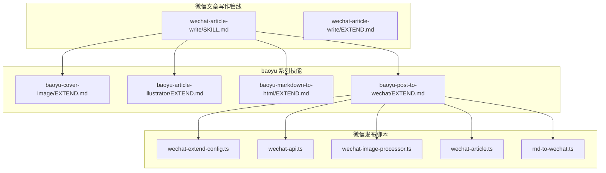

**图表来源**
- [SKILL.md](file://.agents/skills/wechat-article-write/SKILL.md)
- [EXTEND.md](file://.agents/skills/wechat-article-write/EXTEND.md)
- [EXTEND.md](file://.baoyu-skills/baoyu-post-to-wechat/EXTEND.md)
- [wechat-extend-config.ts](file://.agents/skills/baoyu-post-to-wechat/scripts/wechat-extend-config.ts)
- [wechat-api.ts](file://.agents/skills/baoyu-post-to-wechat/scripts/wechat-api.ts)
- [wechat-image-processor.ts](file://.agents/skills/baoyu-post-to-wechat/scripts/wechat-image-processor.ts)
- [wechat-article.ts](file://.agents/skills/baoyu-post-to-wechat/scripts/wechat-article.ts)
- [md-to-wechat.ts](file://.agents/skills/baoyu-post-to-wechat/scripts/md-to-wechat.ts)

**章节来源**
- [SKILL.md](file://.agents/skills/wechat-article-write/SKILL.md)
- [EXTEND.md](file://.agents/skills/wechat-article-write/EXTEND.md)

## 核心组件
- 微信文章写作管线（调度层）
  - 负责依赖预检、资料收集、文章创作、封面/信息图/插图并行生成、图片格式统一校验、图床上传、Markdown 整合、去 AI 痕迹、HTML 转换、发布到草稿等步骤
  - 关键原则：全自动执行、失败不阻塞、封面不上传图床、内联插图走 CDN、图片后端优先级与降级策略、统一格式检测修正
- 微信发布配置与解析
  - EXTEND.md 定义默认主题、颜色、默认作者、评论开关、默认发布方式等
  - wechat-extend-config.ts 解析 EXTEND.md，支持多账户、环境变量与 .env 注入
- 本地图像处理与格式检测
  - wechat-image-processor.ts 提供本地图像处理能力，支持格式检测、尺寸压缩、透明度处理等
  - 支持多种图像格式检测与转换，确保微信兼容性
- 语义占位符系统
  - md-to-wechat.ts 实现语义占位符转换，将 Markdown 中的图片引用转换为语义占位符
  - 支持占位符选择与替换、图片复制粘贴、摘要填写、保存草稿
- 微信公众号 API 调用
  - wechat-api.ts 实现 access_token 获取、正文图片与封面上传、草稿发布、占位符替换与兜底封面回退
- 浏览器自动化发布
  - wechat-article.ts 通过 CDP 控制 Chrome，实现标题、作者、摘要填写与内容粘贴、图片占位符替换、保存草稿

**章节来源**
- [SKILL.md](file://.agents/skills/wechat-article-write/SKILL.md)
- [EXTEND.md](file://.baoyu-skills/baoyu-post-to-wechat/EXTEND.md)
- [wechat-extend-config.ts](file://.agents/skills/baoyu-post-to-wechat/scripts/wechat-extend-config.ts)
- [wechat-image-processor.ts](file://.agents/skills/baoyu-post-to-wechat/scripts/wechat-image-processor.ts)
- [wechat-api.ts](file://.agents/skills/baoyu-post-to-wechat/scripts/wechat-api.ts)
- [wechat-article.ts](file://.agents/skills/baoyu-post-to-wechat/scripts/wechat-article.ts)
- [md-to-wechat.ts](file://.agents/skills/baoyu-post-to-wechat/scripts/md-to-wechat.ts)

## 架构总览
微信文章写作管线采用"调度层 + 多技能并行 + 微信发布脚本"的分层架构。调度层（SKILL.md）定义13步流程与并行策略；并行子流程（封面、信息图、插图）由对应技能完成；最终通过微信 API 或浏览器自动化发布到草稿。

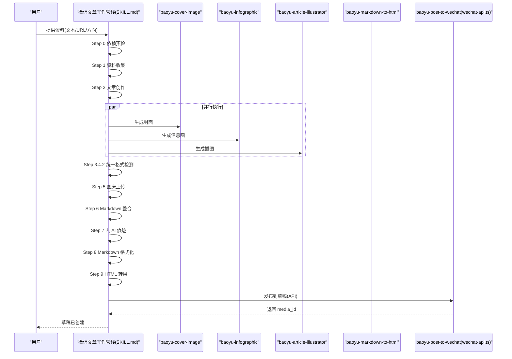

**图表来源**
- [SKILL.md](file://.agents/skills/wechat-article-write/SKILL.md)
- [wechat-api.ts](file://.agents/skills/baoyu-post-to-wechat/scripts/wechat-api.ts)

## 详细组件分析

### EXTEND.md 配置体系
- wechat-article-write/EXTEND.md
  - quick_mode：是否跳过中间确认，推荐 true
  - default_publish_method：默认发布方式，api 或 browser
  - 依赖技能配置：baoyu-cover-image、baoyu-article-illustrator、baoyu-markdown-to-html、baoyu-post-to-wechat 的 EXTEND.md 路径与必需项
  - 环境变量：.env 路径与所需变量（WECHAT_APP_ID、WECHAT_APP_SECRET、GITHUB_TOKEN、OPENAI_API_KEY 等）
- baoyu-post-to-wechat/EXTEND.md
  - default_theme、default_color、default_publish_method、default_author、need_open_comment、only_fans_can_comment
- baoyu-cover-image/EXTEND.md
  - preferred_text、default_aspect、quick_mode、language、preferred_image_backend
- baoyu-article-illustrator/EXTEND.md
  - language、preferred_image_backend
- baoyu-markdown-to-html/EXTEND.md
  - default_theme、default_color、default_font_family、default_font_size、default_cite、default_keep_title

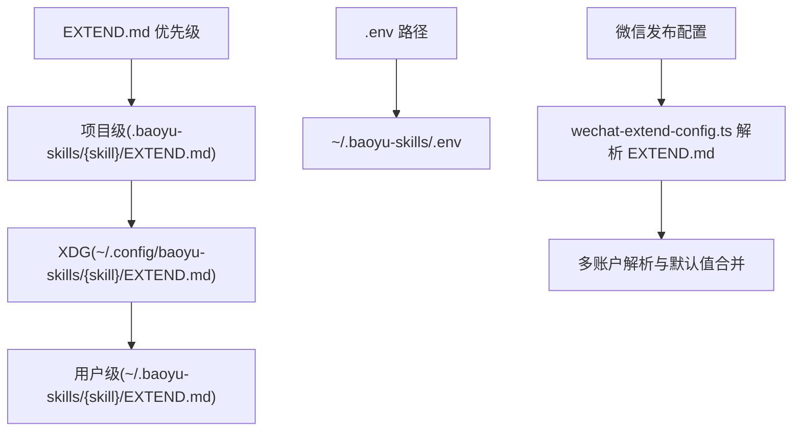

**图表来源**
- [EXTEND.md](file://.agents/skills/wechat-article-write/EXTEND.md)
- [EXTEND.md](file://.baoyu-skills/baoyu-post-to-wechat/EXTEND.md)
- [wechat-extend-config.ts](file://.agents/skills/baoyu-post-to-wechat/scripts/wechat-extend-config.ts)

**章节来源**
- [EXTEND.md](file://.agents/skills/wechat-article-write/EXTEND.md)
- [EXTEND.md](file://.baoyu-skills/baoyu-post-to-wechat/EXTEND.md)
- [EXTEND.md](file://.baoyu-skills/baoyu-cover-image/EXTEND.md)
- [EXTEND.md](file://.baoyu-skills/baoyu-article-illustrator/EXTEND.md)
- [EXTEND.md](file://.baoyu-skills/baoyu-markdown-to-html/EXTEND.md)
- [wechat-extend-config.ts](file://.agents/skills/baoyu-post-to-wechat/scripts/wechat-extend-config.ts)

### 本地图像处理与格式检测
- wechat-image-processor.ts
  - 提供本地图像处理能力，支持格式检测、尺寸压缩、透明度处理等
  - 支持多种图像格式检测与转换，确保微信兼容性
  - 支持 WebP、SVG、ICO 等特殊格式的处理与转换
  - 提供统一的图像处理接口，支持微信正文图片上传的格式要求

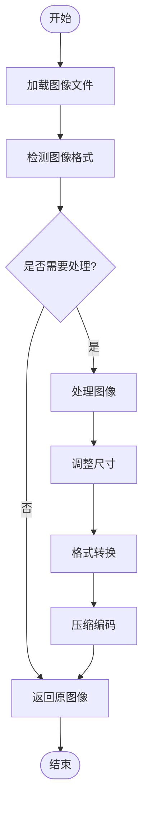

**图表来源**
- [wechat-image-processor.ts](file://.agents/skills/baoyu-post-to-wechat/scripts/wechat-image-processor.ts)

**章节来源**
- [wechat-image-processor.ts](file://.agents/skills/baoyu-post-to-wechat/scripts/wechat-image-processor.ts)

### 语义占位符系统
- md-to-wechat.ts
  - 实现语义占位符转换，将 Markdown 中的图片引用转换为语义占位符
  - 支持占位符选择与替换、图片复制粘贴、摘要填写、保存草稿
  - 提供语义化的图片占位符系统，避免直接使用本地路径或 CDN 链接

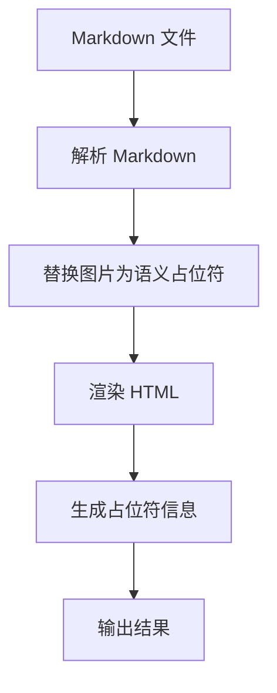

**图表来源**
- [md-to-wechat.ts](file://.agents/skills/baoyu-post-to-wechat/scripts/md-to-wechat.ts)

**章节来源**
- [md-to-wechat.ts](file://.agents/skills/baoyu-post-to-wechat/scripts/md-to-wechat.ts)

### 微信公众号 API 集成
- wechat-extend-config.ts
  - 解析 EXTEND.md，支持 accounts 列表、字段映射与布尔值转换
  - 支持多来源凭据注入：EXTEND.md 账户配置、环境变量、.env 文件
- wechat-api.ts
  - access_token 获取、正文图片与封面上传、草稿发布
  - 占位符替换：将 Markdown 渲染生成的占位符替换为 CDN/微信 URL
  - 兜底封面：news 类型无封面时复用正文首图 media_id
  - 格式检测与修正：基于文件魔数修正扩展名与内容类型，确保 URL 后缀与实际一致

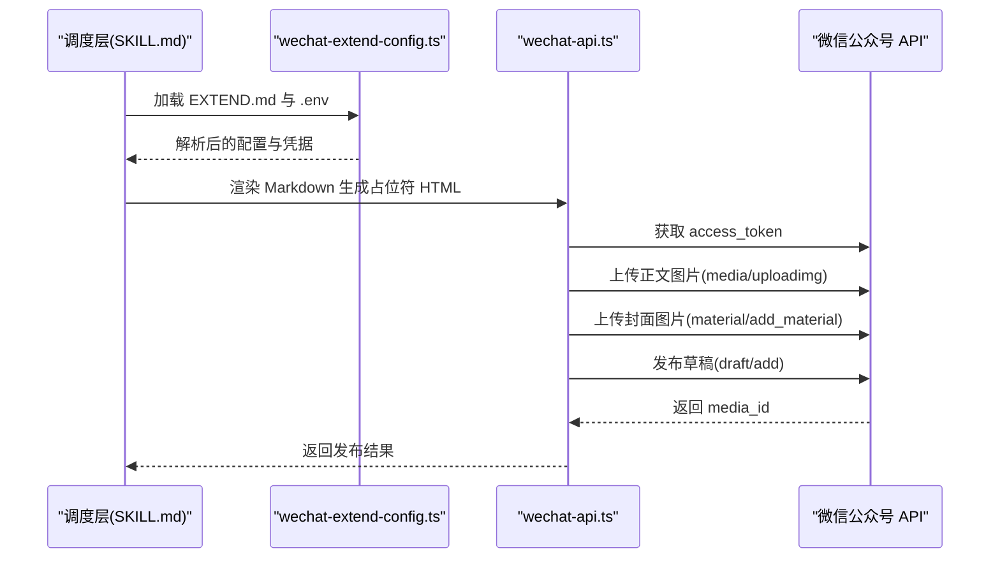

**图表来源**
- [wechat-extend-config.ts](file://.agents/skills/baoyu-post-to-wechat/scripts/wechat-extend-config.ts)
- [wechat-api.ts](file://.agents/skills/baoyu-post-to-wechat/scripts/wechat-api.ts)

**章节来源**
- [wechat-extend-config.ts](file://.agents/skills/baoyu-post-to-wechat/scripts/wechat-extend-config.ts)
- [wechat-api.ts](file://.agents/skills/baoyu-post-to-wechat/scripts/wechat-api.ts)

### 浏览器自动化发布（备用方案）
- wechat-article.ts
  - 通过 CDP 连接现有 Chrome 或启动新实例，自动完成登录态识别、菜单导航、编辑器填充与内容粘贴
  - 支持占位符选择与替换、图片复制粘贴、摘要填写、保存草稿
  - 适用于 API 发布受限或需要人工干预的场景

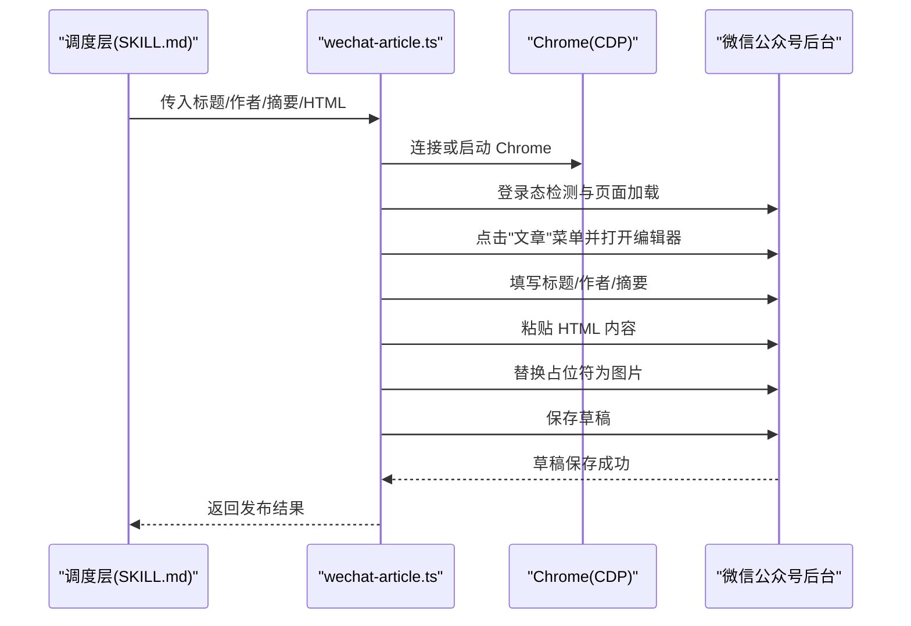

**图表来源**
- [wechat-article.ts](file://.agents/skills/baoyu-post-to-wechat/scripts/wechat-article.ts)

**章节来源**
- [wechat-article.ts](file://.agents/skills/baoyu-post-to-wechat/scripts/wechat-article.ts)

### 预飞行检查机制
- Step 0 依赖预检
  - 硬门控：Step 0 必须在所有后续步骤之前完成
  - 自动检查各技能是否已安装（通过 Skill 工具或脚本路径验证）
  - 检查各技能的 `scripts/node_modules` 是否存在
  - 对缺失的依赖自动执行 `bun install`
  - 检测脚本类型（TypeScript vs Bash），确保正确的执行方式

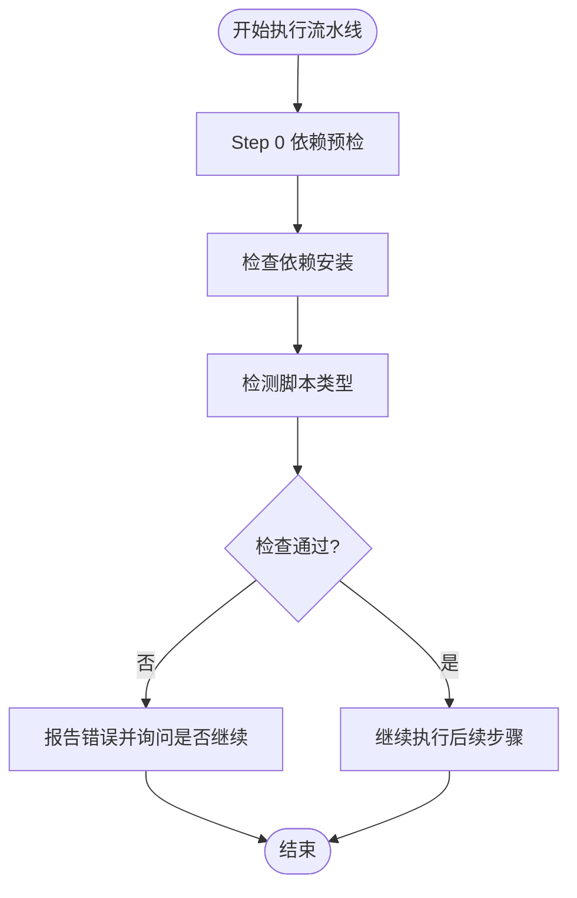

**图表来源**
- [SKILL.md](file://.agents/skills/wechat-article-write/SKILL.md)

**章节来源**
- [SKILL.md](file://.agents/skills/wechat-article-write/SKILL.md)

### 图片处理与格式统一校验
- 统一格式检测
  - 在封面、信息图、插图全部完成后，统一扫描所有图片，使用 file 命令检测实际格式，修正扩展名与引用路径
  - 修复 Gemini 后端返回 JPEG 内容但保存为 .png 的常见问题
- 图床上传与 CDN 替换
  - 插图上传至 GitHub 图床，获取 CDN URL 并替换 Markdown 中的引用
  - 上传前再次执行格式检测，确保 URL 后缀与实际内容一致

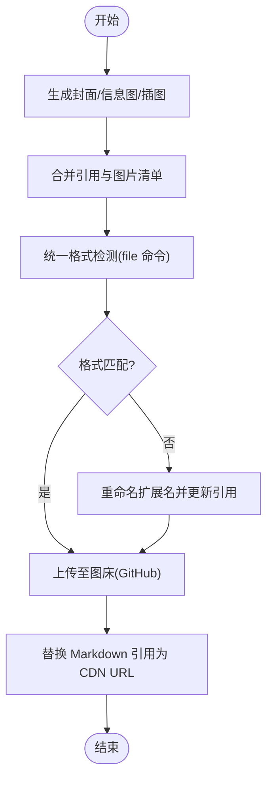

**图表来源**
- [SKILL.md](file://.agents/skills/wechat-article-write/SKILL.md)

**章节来源**
- [SKILL.md](file://.agents/skills/wechat-article-write/SKILL.md)

### 质量门控与合规检查
- Step 2.4.1 质量门控
  - 字数、文末互动、原文参考、信息图引用标记
- Step 4.5.5 插入验证
  - 信息图生成后立即验证文件存在与 draft.md 引用，避免后续步骤才发现缺失
- Step 5 前置门控
  - 插图引用验证与统一格式检测必须通过，否则不得进入图床上传

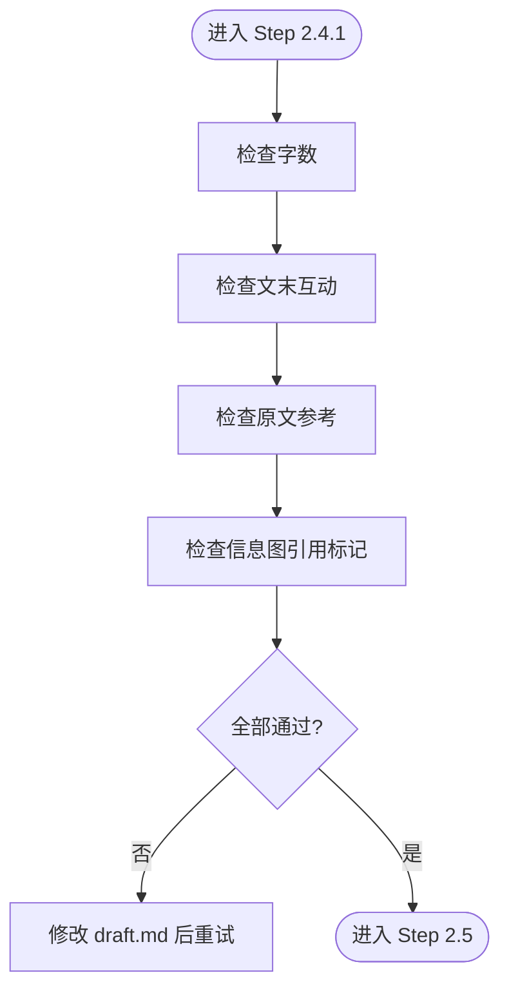

**图表来源**
- [SKILL.md](file://.agents/skills/wechat-article-write/SKILL.md)

**章节来源**
- [SKILL.md](file://.agents/skills/wechat-article-write/SKILL.md)

## 依赖关系分析
- 调度层依赖
  - wechat-article-write/SKILL.md 依赖 EXTEND.md 与 .env
  - 依赖 baoyu 系列技能的 EXTEND.md 与脚本路径
- 发布层依赖
  - wechat-extend-config.ts 依赖 EXTEND.md 与 .env
  - wechat-api.ts 依赖微信官方接口与图片处理模块
  - wechat-image-processor.ts 提供本地图像处理能力
  - wechat-article.ts 依赖 Chrome CDP 与剪贴板脚本
  - md-to-wechat.ts 提供语义占位符转换功能

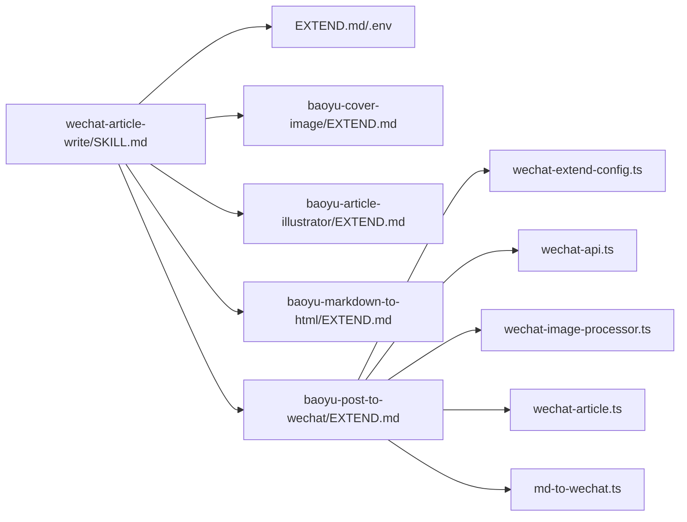

**图表来源**
- [SKILL.md](file://.agents/skills/wechat-article-write/SKILL.md)
- [EXTEND.md](file://.agents/skills/wechat-article-write/EXTEND.md)
- [wechat-extend-config.ts](file://.agents/skills/baoyu-post-to-wechat/scripts/wechat-extend-config.ts)
- [wechat-api.ts](file://.agents/skills/baoyu-post-to-wechat/scripts/wechat-api.ts)
- [wechat-image-processor.ts](file://.agents/skills/baoyu-post-to-wechat/scripts/wechat-image-processor.ts)
- [wechat-article.ts](file://.agents/skills/baoyu-post-to-wechat/scripts/wechat-article.ts)
- [md-to-wechat.ts](file://.agents/skills/baoyu-post-to-wechat/scripts/md-to-wechat.ts)

**章节来源**
- [SKILL.md](file://.agents/skills/wechat-article-write/SKILL.md)
- [EXTEND.md](file://.agents/skills/wechat-article-write/EXTEND.md)
- [wechat-extend-config.ts](file://.agents/skills/baoyu-post-to-wechat/scripts/wechat-extend-config.ts)
- [wechat-api.ts](file://.agents/skills/baoyu-post-to-wechat/scripts/wechat-api.ts)
- [wechat-image-processor.ts](file://.agents/skills/baoyu-post-to-wechat/scripts/wechat-image-processor.ts)
- [wechat-article.ts](file://.agents/skills/baoyu-post-to-wechat/scripts/wechat-article.ts)
- [md-to-wechat.ts](file://.agents/skills/baoyu-post-to-wechat/scripts/md-to-wechat.ts)

## 性能考虑
- 并行执行
  - Step 3（封面）、Step 4（插图）、Step 4.5（信息图）必须并行，显著缩短图片生成耗时
- 图片后端降级
  - 按 Gemini > Seedream > DashScope 顺序降级，减少审核拒绝导致的重试成本
- 统一格式检测
  - 避免分散处理造成的遗漏，集中一次修正所有图片，降低返工概率
- CDN 传播等待
  - 图床上传后等待 CDN 传播，避免早期引用 404
- 本地图像处理
  - 使用 wechat-image-processor.ts 进行本地图像处理，减少网络传输开销

## 故障排查指南
- 依赖预检失败
  - 检查技能脚本路径与 node_modules 是否存在，必要时执行 bun install
- 登录问题（浏览器发布）
  - 确保 Chrome 已开启调试端口，或使用 --cdp-port 指定端口；若已有登录态标签页，系统会自动复用
- 图片格式不匹配
  - 执行统一格式检测，修正 .png 实际为 JPEG 的情况，并同步更新 draft.md 引用
- 发布失败（API）
  - 检查 WECHAT_APP_ID/WECHAT_APP_SECRET 是否正确；确认封面/正文图片上传成功；核对草稿发布参数
- 引用缺失
  - Step 4.5 插图引用验证与 Step 5 前置门控均会拦截，需手动补写或重新生成
- 语义占位符问题
  - 检查 md-to-wechat.ts 的占位符转换是否正确，确保占位符与实际图片匹配

**章节来源**
- [SKILL.md](file://.agents/skills/wechat-article-write/SKILL.md)
- [wechat-api.ts](file://.agents/skills/baoyu-post-to-wechat/scripts/wechat-api.ts)
- [wechat-article.ts](file://.agents/skills/baoyu-post-to-wechat/scripts/wechat-article.ts)
- [md-to-wechat.ts](file://.agents/skills/baoyu-post-to-wechat/scripts/md-to-wechat.ts)

## 结论
微信文章写作管线通过严格的并行策略、统一的格式校验与完善的质量门控，实现了从资料收集到草稿发布的全自动化。EXTEND.md 与 .env 的分层配置体系保证了跨设备的一致性与安全性；微信 API 与浏览器双通道发布机制提升了容错能力。预飞行检查机制确保了依赖的完整性，语义占位符系统提供了更好的图片管理能力。遵循本文档的配置与流程建议，可显著提升生产效率与发布质量。

## 附录

### 配置项速查
- wechat-article-write/EXTEND.md
  - quick_mode：true/false
  - default_publish_method：api/browser
  - 依赖技能 EXTEND.md 路径与必需项
  - .env 路径与变量
- baoyu-post-to-wechat/EXTEND.md
  - default_theme、default_color、default_publish_method、default_author、need_open_comment、only_fans_can_comment
- baoyu-cover-image/EXTEND.md
  - preferred_text、default_aspect、quick_mode、language、preferred_image_backend
- baoyu-article-illustrator/EXTEND.md
  - language、preferred_image_backend
- baoyu-markdown-to-html/EXTEND.md
  - default_theme、default_color、default_font_family、default_font_size、default_cite、default_keep_title

### 新增功能说明
- 预飞行检查机制
  - 在所有后续步骤之前执行 Step 0 依赖预检，确保环境准备就绪
- 本地图像处理能力
  - 通过 wechat-image-processor.ts 提供本地图像处理，支持格式检测与转换
- 语义占位符系统
  - 通过 md-to-wechat.ts 实现语义化的图片占位符管理，避免直接使用本地路径或 CDN 链接

**章节来源**
- [EXTEND.md](file://.agents/skills/wechat-article-write/EXTEND.md)
- [EXTEND.md](file://.baoyu-skills/baoyu-post-to-wechat/EXTEND.md)
- [EXTEND.md](file://.baoyu-skills/baoyu-cover-image/EXTEND.md)
- [EXTEND.md](file://.baoyu-skills/baoyu-article-illustrator/EXTEND.md)
- [EXTEND.md](file://.baoyu-skills/baoyu-markdown-to-html/EXTEND.md)
- [wechat-extend-config.ts](file://.agents/skills/baoyu-post-to-wechat/scripts/wechat-extend-config.ts)
- [wechat-image-processor.ts](file://.agents/skills/baoyu-post-to-wechat/scripts/wechat-image-processor.ts)
- [md-to-wechat.ts](file://.agents/skills/baoyu-post-to-wechat/scripts/md-to-wechat.ts)