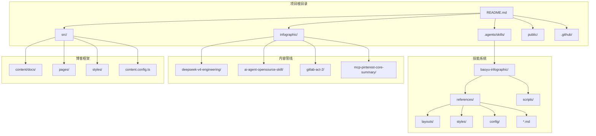
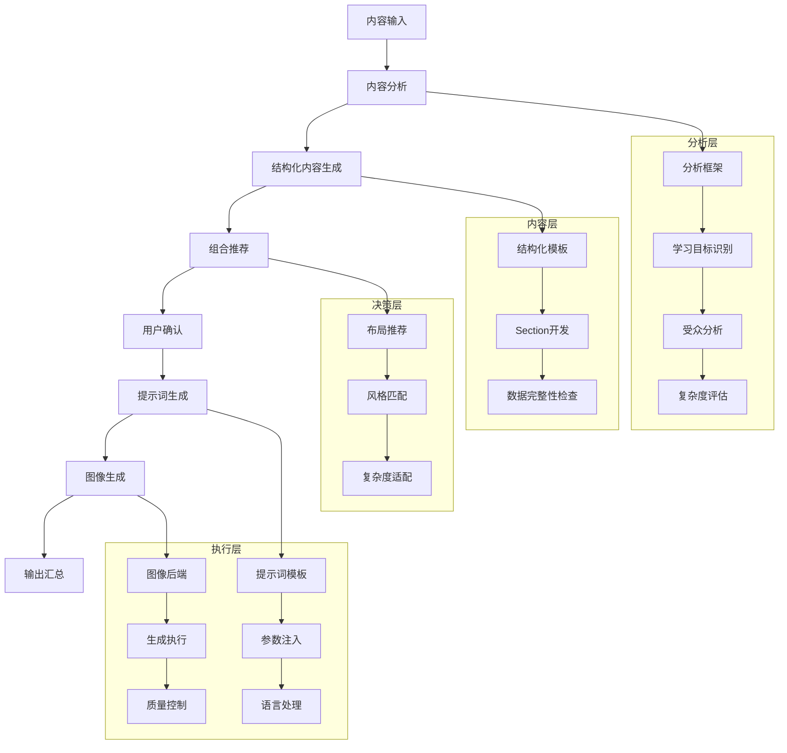
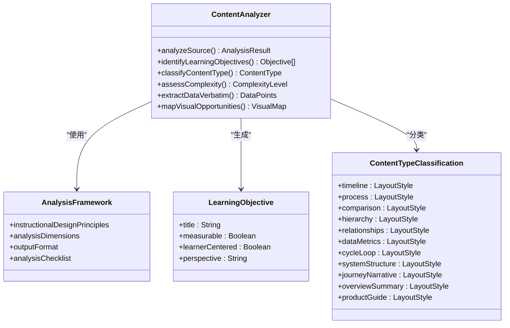
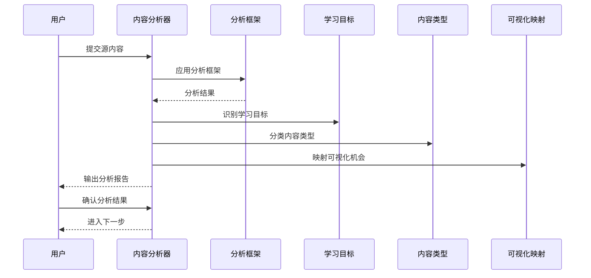
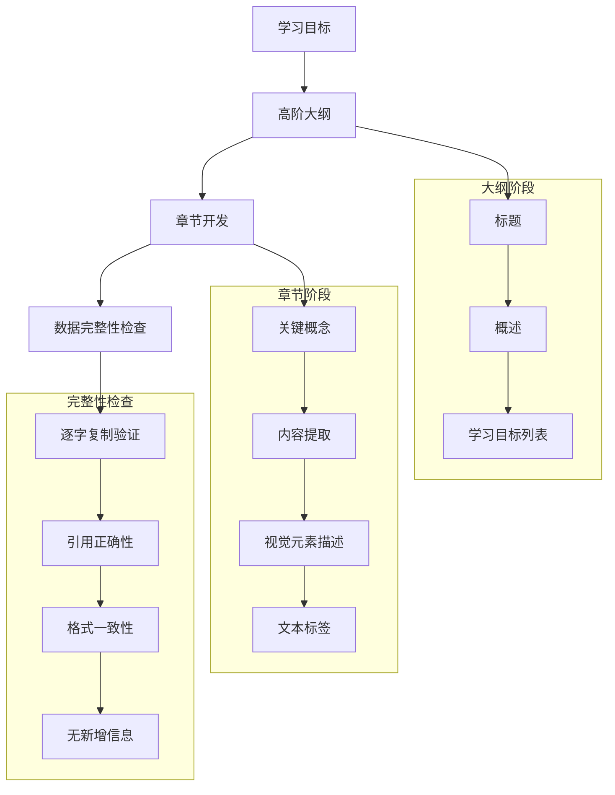
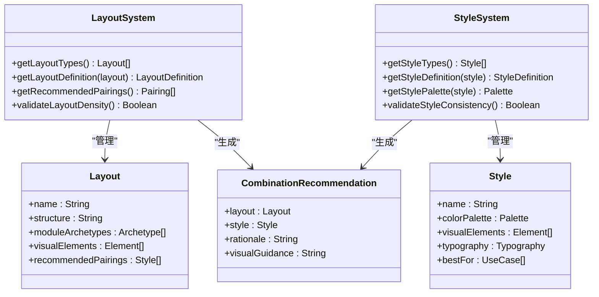
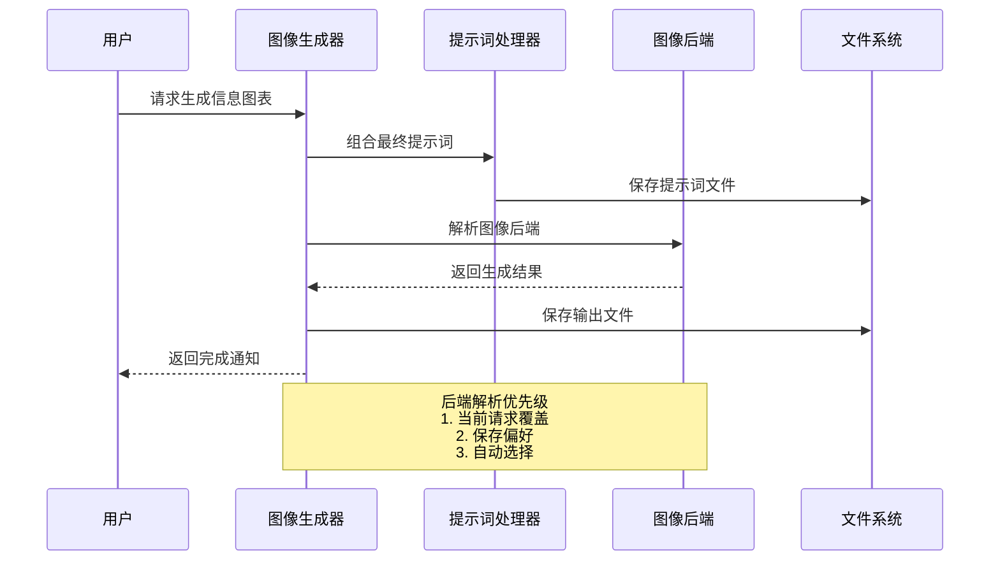
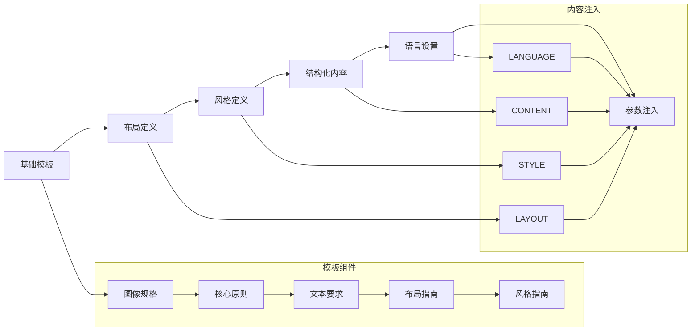
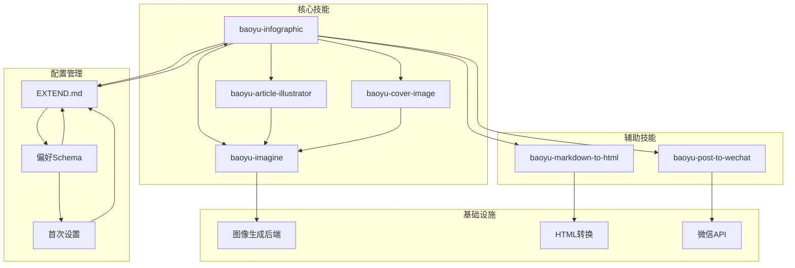
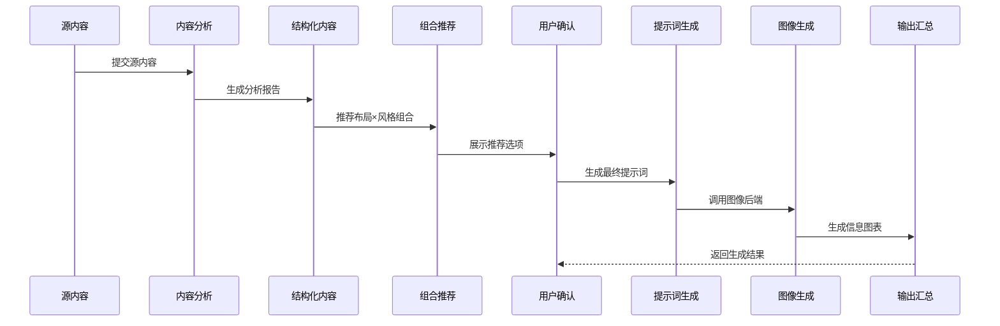

# 信息图表自动化

<cite>
**本文档引用的文件**
- [README.md](file://README.md)
- [package.json](file://package.json)
- [SKILL.md](file://.agents/skills/baoyu-infographic/SKILL.md)
- [base-prompt.md](file://.agents/skills/baoyu-infographic/references/base-prompt.md)
- [analysis-framework.md](file://.agents/skills/baoyu-infographic/references/analysis-framework.md)
- [structured-content-template.md](file://.agents/skills/baoyu-infographic/references/structured-content-template.md)
- [preferences-schema.md](file://.agents/skills/baoyu-infographic/references/config/preferences-schema.md)
- [first-time-setup.md](file://.agents/skills/baoyu-infographic/references/config/first-time-setup.md)
- [dense-modules.md](file://.agents/skills/baoyu-infographic/references/layouts/dense-modules.md)
- [craft-handmade.md](file://.agents/skills/baoyu-infographic/references/styles/craft-handmade.md)
- [source.md](file://infographic/deepseek-v4-engineering/source.md)
- [analysis.md](file://infographic/deepseek-v4-engineering/analysis.md)
- [structured-content.md](file://infographic/deepseek-v4-engineering/structured-content.md)
- [prompts/infographic.md](file://infographic/deepseek-v4-engineering/prompts/infographic.md)
- [src/content.config.ts](file://src/content.config.ts)
</cite>

## 目录
1. [简介](#简介)
2. [项目结构](#项目结构)
3. [核心组件](#核心组件)
4. [架构总览](#架构总览)
5. [详细组件分析](#详细组件分析)
6. [依赖关系分析](#依赖关系分析)
7. [性能考虑](#性能考虑)
8. [故障排除指南](#故障排除指南)
9. [结论](#结论)
10. [附录](#附录)

## 简介
本项目提供一套完整的信息图表自动化系统，基于 Astro Starlight 博客框架与 28 个 AI 技能，实现从内容分析到图像生成的一站式流程。系统核心围绕 baoyu-infographic 技能展开，支持 21 种布局类型与 22 种视觉风格的自由组合，能够根据内容特征智能推荐最优方案，并通过标准化的工作流确保输出质量与一致性。

系统采用"内容分析 → 结构化内容 → 组合推荐 → 确认选项 → 生成提示 → 图像生成 → 输出汇总"的七步工作流，结合 EXTEND.md 配置文件实现个性化偏好管理，支持多语言输出与多种图像后端选择。

## 项目结构
项目采用模块化设计，主要包含以下核心目录：



**图表来源**
- [README.md:75-90](file://README.md#L75-L90)
- [.agents/skills/baoyu-infographic/SKILL.md:1-324](file://.agents/skills/baoyu-infographic/SKILL.md#L1-L324)

**章节来源**
- [README.md:75-90](file://README.md#L75-L90)
- [package.json:1-19](file://package.json#L1-L19)

## 核心组件
信息图表自动化系统由以下核心组件构成：

### 1. baoyu-infographic 技能引擎
- **功能定位**：专业信息图表生成器，支持 21×22 的布局×风格组合
- **工作流**：七步标准化流程，确保输出质量与一致性
- **智能推荐**：基于内容类型、语调、复杂度自动推荐最优组合
- **配置管理**：EXTEND.md 支持个性化偏好设置

### 2. 内容分析框架
- **分析维度**：内容类型分类、学习目标识别、受众分析、复杂度评估
- **可视化映射**：识别可"展示而非讲述"的内容元素
- **数据完整性**：严格要求事实信息的逐字复制

### 3. 结构化内容模板
- **教学设计**：将源材料转换为设计师可用格式
- **内容完整性**：保持所有源数据逐字不变
- **设计分离**：明确区分内容与设计指令

### 4. 布局与风格库
- **布局系统**：21种布局类型，涵盖线性进展、层次结构、对比分析等
- **风格系统**：22种视觉风格，从手工制作到科技蓝图的广泛覆盖
- **最佳实践**：每种组合提供适用场景与视觉建议

**章节来源**
- [.agents/skills/baoyu-infographic/SKILL.md:100-177](file://.agents/skills/baoyu-infographic/SKILL.md#L100-L177)
- [.agents/skills/baoyu-infographic/references/analysis-framework.md:1-183](file://.agents/skills/baoyu-infographic/references/analysis-framework.md#L1-L183)
- [.agents/skills/baoyu-infographic/references/structured-content-template.md:1-245](file://.agents/skills/baoyu-infographic/references/structured-content-template.md#L1-L245)

## 架构总览
系统采用分层架构设计，从内容输入到最终输出形成完整的自动化流水线：



**图表来源**
- [.agents/skills/baoyu-infographic/SKILL.md:206-303](file://.agents/skills/baoyu-infographic/SKILL.md#L206-L303)
- [.agents/skills/baoyu-infographic/references/base-prompt.md:1-44](file://.agents/skills/baoyu-infographic/references/base-prompt.md#L1-L44)

## 详细组件分析

### 组件A：内容分析引擎
内容分析引擎是信息图表生成的基础，采用世界一流的课程设计思维：



**图表来源**
- [.agents/skills/baoyu-infographic/references/analysis-framework.md:14-183](file://.agents/skills/baoyu-infographic/references/analysis-framework.md#L14-L183)

#### 分析流程序列图


**图表来源**
- [.agents/skills/baoyu-infographic/references/analysis-framework.md:170-183](file://.agents/skills/baoyu-infographic/references/analysis-framework.md#L170-L183)

**章节来源**
- [.agents/skills/baoyu-infographic/references/analysis-framework.md:1-183](file://.agents/skills/baoyu-infographic/references/analysis-framework.md#L1-L183)

### 组件B：结构化内容生成器
结构化内容生成器负责将分析结果转换为设计师可用的格式：



**图表来源**
- [.agents/skills/baoyu-infographic/references/structured-content-template.md:13-245](file://.agents/skills/baoyu-infographic/references/structured-content-template.md#L13-L245)

#### 内容类型模板映射
系统针对不同内容类型提供专门的章节模板：

| 内容类型 | 章节模板 | 视觉元素 | 文本标签 |
|---------|---------|---------|---------|
| 流程/步骤 | 步骤编号 + 动作描述 | 数字化步骤图标 | 标题 + 动作标签 |
| 对比分析 | 左右对比表格 | 分割比较图 | 左右标签 |
| 层级结构 | 等级标识 + 包含内容 | 层叠图示 | 等级标题 |
| 数据统计 | 数值 + 上下文 + 对比 | 图表/数字强调 | 主要数值 + 标签 |

**章节来源**
- [.agents/skills/baoyu-infographic/references/structured-content-template.md:140-230](file://.agents/skills/baoyu-infographic/references/structured-content-template.md#L140-L230)

### 组件C：布局与风格管理系统
系统提供 21 种布局类型与 22 种视觉风格的组合能力：



**图表来源**
- [.agents/skills/baoyu-infographic/SKILL.md:96-177](file://.agents/skills/baoyu-infographic/SKILL.md#L96-L177)
- [.agents/skills/baoyu-infographic/references/layouts/dense-modules.md:1-74](file://.agents/skills/baoyu-infographic/references/layouts/dense-modules.md#L1-L74)
- [.agents/skills/baoyu-infographic/references/styles/craft-handmade.md:1-45](file://.agents/skills/baoyu-infographic/references/styles/craft-handmade.md#L1-L45)

#### 高密度模块布局详解
高密度模块布局是系统的核心布局之一，适用于数据丰富的信息图表：

| 模块类型 | 目的 | 内容要求 | 视觉强调 |
|---------|------|---------|---------|
| 品牌/选择数组 | 网格选项与推荐 | 4-8个项目，图标+名称+简述；突出"最佳选择" | 网格结构，高对比度 |
| 规格量表 | 质量/测量标尺 | 3-5级别，精确数值增量，质量指示器 | 坐标轴，刻度标记 |
| 深入解读 | 关键项目的详细分解 | 放大标注，内部组件，横截面或爆炸视图 | 细节标注，连接线 |
| 场景对比 | 并排使用案例 | 3-6场景，具体推荐与数据 | 对比箭头，流程指示 |
| 识别要点 | 检查清单 | 3-5检查方法：看/测试/检查/询问格式 | 清单符号，警告标记 |
| 警告/陷阱区 | 需避免的关键错误 | 3-5陷阱及后果，1-2正确方法；高对比度 | 警告符号，对比色 |
| 快速参考 | 紧凑摘要 | 密集表格，一行摘要，决策流程图或要点 | 紧凑排版，重点突出 |

**章节来源**
- [.agents/skills/baoyu-infographic/references/layouts/dense-modules.md:13-74](file://.agents/skills/baoyu-infographic/references/layouts/dense-modules.md#L13-L74)

### 组件D：图像生成与提示词系统
图像生成系统采用多后端支持与智能回退机制：



**图表来源**
- [.agents/skills/baoyu-infographic/SKILL.md:24-44](file://.agents/skills/baoyu-infographic/SKILL.md#L24-L44)

#### 提示词生成流程
系统采用模板驱动的提示词生成机制：



**图表来源**
- [.agents/skills/baoyu-infographic/references/base-prompt.md:1-44](file://.agents/skills/baoyu-infographic/references/base-prompt.md#L1-L44)

**章节来源**
- [.agents/skills/baoyu-infographic/SKILL.md:276-303](file://.agents/skills/baoyu-infographic/SKILL.md#L276-L303)
- [.agents/skills/baoyu-infographic/references/base-prompt.md:1-44](file://.agents/skills/baoyu-infographic/references/base-prompt.md#L1-L44)

## 依赖关系分析

### 技能系统依赖图


**图表来源**
- [.agents/skills/baoyu-infographic/SKILL.md:312-324](file://.agents/skills/baoyu-infographic/SKILL.md#L312-L324)
- [.agents/skills/baoyu-infographic/references/config/preferences-schema.md:1-127](file://.agents/skills/baoyu-infographic/references/config/preferences-schema.md#L1-L127)

### 配置文件结构
EXTEND.md 作为系统配置的核心文件，采用 YAML 格式定义用户偏好：

| 配置项 | 类型 | 默认值 | 描述 |
|-------|------|--------|------|
| preferred_layout | string/null | null | 预设布局，影响步骤3推荐 |
| preferred_style | string/null | null | 预设风格，影响步骤3推荐 |
| preferred_aspect | string/null | null | 默认宽高比，named或W:H |
| language | string/null | null | 输出语言，null=自动检测 |
| preferred_image_backend | string | auto | 图像后端选择策略 |
| custom_styles | array | [] | 自定义风格定义列表 |

**章节来源**
- [.agents/skills/baoyu-infographic/references/config/preferences-schema.md:8-44](file://.agents/skills/baoyu-infographic/references/config/preferences-schema.md#L8-L44)
- [.agents/skills/baoyu-infographic/references/config/first-time-setup.md:19-37](file://.agents/skills/baoyu-infographic/references/config/first-time-setup.md#L19-L37)

## 性能考虑
信息图表自动化系统在性能方面采用多项优化策略：

### 1. 缓存与重用机制
- **提示词缓存**：生成的提示词文件作为可重现记录保存
- **参考图片管理**：引用图片自动复制到输出目录
- **备份策略**：关键文件生成前自动备份，防止意外覆盖

### 2. 后端选择优化
- **优先级解析**：支持当前请求覆盖、保存偏好、自动选择的三层后端解析
- **智能回退**：当首选后端不可用时自动切换到备用方案
- **运行时原生工具优先**：优先使用运行时提供的原生图像生成工具

### 3. 内存与存储优化
- **渐进式处理**：每个步骤完成后才进入下一步，避免内存峰值
- **文件系统操作最小化**：减少不必要的文件读写操作
- **输出文件命名规范**：使用 kebab-case slug，冲突时自动添加时间戳

## 故障排除指南

### 常见问题与解决方案

#### 1. EXTEND.md 配置问题
**症状**：系统无法找到或解析配置文件
**解决步骤**：
1. 检查 EXTEND.md 文件路径优先级
2. 验证 YAML 格式正确性
3. 使用偏好 Schema 进行语法检查
4. 重新运行首次设置流程

#### 2. 图像生成失败
**症状**：图像生成过程中出现错误
**解决步骤**：
1. 检查图像后端可用性
2. 验证提示词文件完整性
3. 确认输出路径权限
4. 查看后端日志信息

#### 3. 内容分析异常
**症状**：分析结果不符合预期
**解决步骤**：
1. 检查源内容格式
2. 验证语言检测准确性
3. 确认复杂度评估逻辑
4. 重新运行分析流程

**章节来源**
- [.agents/skills/baoyu-infographic/SKILL.md:76-84](file://.agents/skills/baoyu-infographic/SKILL.md#L76-L84)
- [.agents/skills/baoyu-infographic/references/analysis-framework.md:170-183](file://.agents/skills/baoyu-infographic/references/analysis-framework.md#L170-L183)

## 结论
信息图表自动化系统通过标准化的工作流程、智能化的内容分析和灵活的布局风格组合，实现了从原始内容到专业信息图表的高效转化。系统的核心优势包括：

1. **标准化流程**：七步工作流确保输出质量和一致性
2. **智能推荐**：基于内容特征的自动组合推荐
3. **灵活配置**：EXTEND.md 支持个性化偏好设置
4. **多后端支持**：智能图像生成后端选择机制
5. **质量保证**：严格的验证检查和备份策略

该系统不仅适用于技术内容的信息图表制作，也可扩展应用于教育、商业、创意等多个领域的可视化需求，为内容创作者提供了强大的自动化工具支持。

## 附录

### 示例工作流演示
以 DeepSeek V4 工程整合哲学为例，展示完整的信息图表生成过程：



**图表来源**
- [infographic/deepseek-v4-engineering/source.md:1-37](file://infographic/deepseek-v4-engineering/source.md#L1-L37)
- [infographic/deepseek-v4-engineering/analysis.md:1-68](file://infographic/deepseek-v4-engineering/analysis.md#L1-L68)
- [infographic/deepseek-v4-engineering/structured-content.md:1-155](file://infographic/deepseek-v4-engineering/structured-content.md#L1-L155)

### 配置文件示例
EXTEND.md 的完整配置示例展示了系统如何通过配置文件实现个性化设置：

```yaml
---
version: 1
preferred_layout: dense-modules
preferred_style: morandi-journal
preferred_aspect: portrait
language: zh
preferred_image_backend: codex-imagegen
custom_styles:
  - name: my-brand
    description: "品牌一致的温暖粉彩信息图表"
    prompt_fragment: "使用品牌粉彩调色板(#F2C7B6, #B6D7E8, #C8E0B4)；圆角矩形；温暖的手绘轮廓；充足留白。"
---
```

**章节来源**
- [.agents/skills/baoyu-infographic/references/config/preferences-schema.md:107-127](file://.agents/skills/baoyu-infographic/references/config/preferences-schema.md#L107-L127)