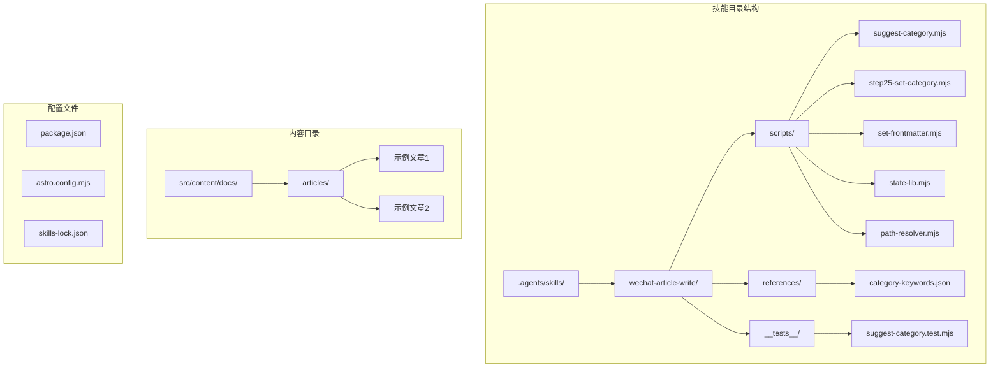
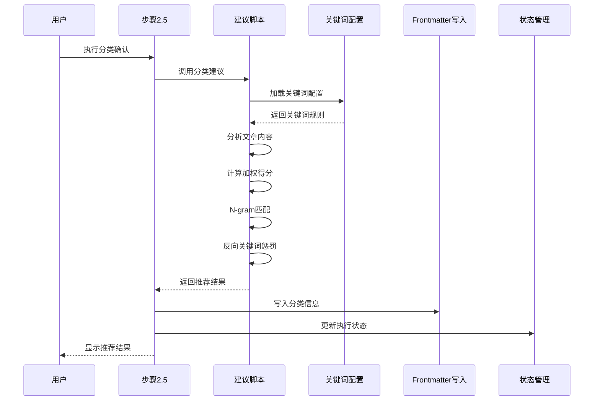
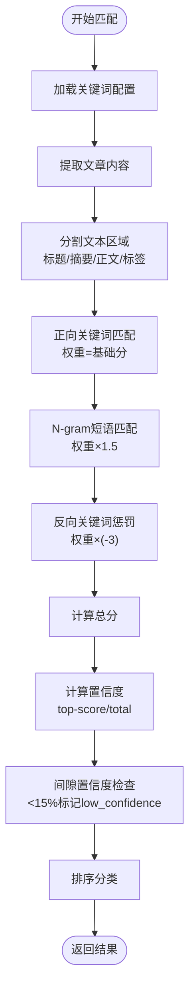
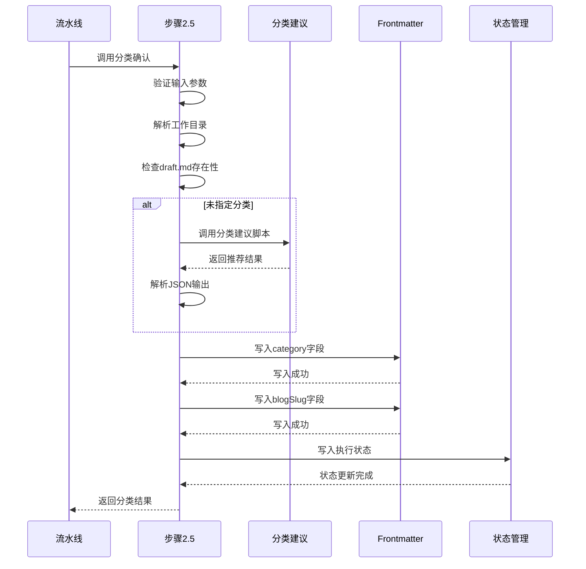
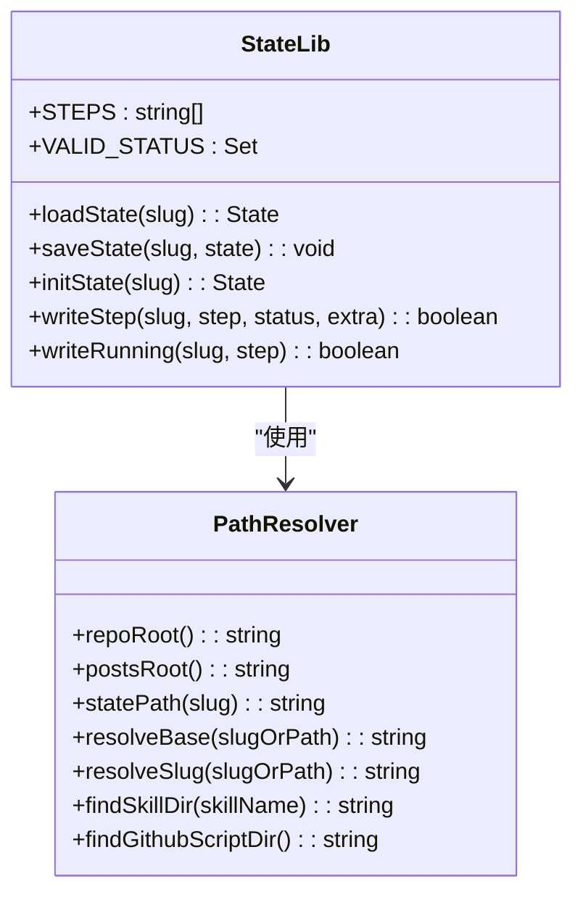
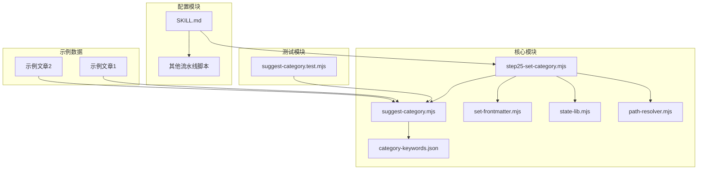
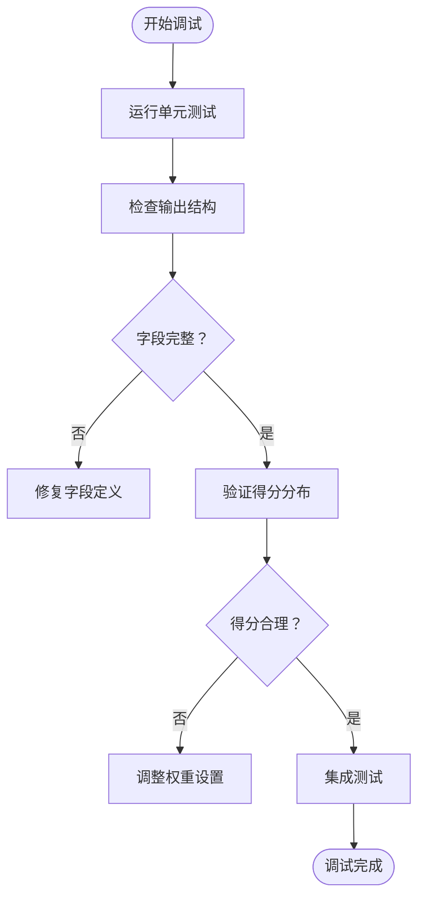

# 分类关键词系统

<cite>
**本文档引用的文件**
- [category-keywords.json](file://.agents/skills/wechat-article-write/references/category-keywords.json)
- [suggest-category.mjs](file://.agents/skills/wechat-article-write/scripts/suggest-category.mjs)
- [step25-set-category.mjs](file://.agents/skills/wechat-article-write/scripts/step25-set-category.mjs)
- [set-frontmatter.mjs](file://.agents/skills/wechat-article-write/scripts/set-frontmatter.mjs)
- [state-lib.mjs](file://.agents/skills/wechat-article-write/scripts/state-lib.mjs)
- [path-resolver.mjs](file://.agents/skills/wechat-article-write/scripts/path-resolver.mjs)
- [suggest-category.test.mjs](file://.agents/skills/wechat-article-write/__tests__/suggest-category.test.mjs)
- [SKILL.md](file://.agents/skills/wechat-article-write/SKILL.md)
- [2026-05-12-amazon-foundation-model-building-blocks.md](file://src/content/docs/articles/2026-05-12-amazon-foundation-model-building-blocks.md)
- [1930-ai-model-solves-modern-engineering.md](file://src/content/docs/articles/1930-ai-model-solves-modern-engineering.md)
- [README.md](file://README.md)
</cite>

## 目录
1. [简介](#简介)
2. [项目结构](#项目结构)
3. [核心组件](#核心组件)
4. [架构概览](#架构概览)
5. [详细组件分析](#详细组件分析)
6. [依赖关系分析](#依赖关系分析)
7. [性能考虑](#性能考虑)
8. [故障排除指南](#故障排除指南)
9. [结论](#结论)

## 简介

分类关键词系统是微信公众号文章写作技能中的一个关键模块，负责基于关键词匹配算法自动为文章推荐合适的分类。该系统采用多层评分机制，结合正向关键词、反向关键词、N-gram短语匹配和标签权重，为文章内容提供智能化的分类建议。

系统支持6个预定义分类：ai-coding（AI辅助编程）、ai-agents（Agent工程）、ai-industry（AI行业动态）、ai-models（模型与训练）、security（安全）、engineering（基础工程），并通过JSON配置文件进行维护和扩展。

## 项目结构

该项目采用技能驱动的架构设计，主要包含以下核心目录：

**图表来源**
- [.agents/skills/wechat-article-write/scripts/suggest-category.mjs:1-152](file://.agents/skills/wechat-article-write/scripts/suggest-category.mjs#L1-L152)
- [.agents/skills/wechat-article-write/references/category-keywords.json:1-83](file://.agents/skills/wechat-article-write/references/category-keywords.json#L1-L83)

**章节来源**
- [.agents/skills/wechat-article-write/SKILL.md:1-1500](file://.agents/skills/wechat-article-write/SKILL.md#L1-L1500)
- [README.md:75-90](file://README.md#L75-L90)

## 核心组件

### 关键词配置系统

系统的核心是基于JSON的关键词配置文件，定义了每个分类的关键词规则：

| 分类 | 关键词数量 | 反向关键词 | N-gram短语 |
|------|------------|------------|------------|
| ai-coding | 12个 | 5个 | 6个 |
| ai-agents | 12个 | 5个 | 6个 |
| ai-industry | 12个 | 5个 | 6个 |
| ai-models | 12个 | 5个 | 6个 |
| security | 12个 | 5个 | 6个 |
| engineering | 12个 | 5个 | 6个 |

### 分类评分算法

系统采用加权评分机制，对不同内容区域给予不同的权重：

- 标题权重：5分
- 摘要权重：5分  
- 标题权重：2分
- 正文权重：1分
- 标签权重：6分（显著高于正文）

**章节来源**
- [.agents/skills/wechat-article-write/references/category-keywords.json:1-83](file://.agents/skills/wechat-article-write/references/category-keywords.json#L1-L83)
- [.agents/skills/wechat-article-write/scripts/suggest-category.mjs:27-30](file://.agents/skills/wechat-article-write/scripts/suggest-category.mjs#L27-L30)

## 架构概览

分类关键词系统采用模块化设计，各组件职责明确：

**图表来源**
- [.agents/skills/wechat-article-write/scripts/step25-set-category.mjs:50-71](file://.agents/skills/wechat-article-write/scripts/step25-set-category.mjs#L50-L71)
- [.agents/skills/wechat-article-write/scripts/suggest-category.mjs:100-119](file://.agents/skills/wechat-article-write/scripts/suggest-category.mjs#L100-L119)

## 详细组件分析

### 关键词匹配引擎

关键词匹配引擎是系统的核心算法组件，负责将文章内容与预定义的关键词规则进行匹配：

**图表来源**
- [.agents/skills/wechat-article-write/scripts/suggest-category.mjs:72-98](file://.agents/skills/wechat-article-write/scripts/suggest-category.mjs#L72-L98)
- [.agents/skills/wechat-article-write/scripts/suggest-category.mjs:100-119](file://.agents/skills/wechat-article-write/scripts/suggest-category.mjs#L100-L119)

#### N-gram匹配机制

系统实现了智能的N-gram（2-词短语）匹配机制，为常见的关键词组合提供更高的权重：

| N-gram示例 | 分类 | 权重倍数 |
|------------|------|----------|
| AI coding | ai-coding | ×1.5 |
| 代码补全 | ai-coding | ×1.5 |
| agent harness | ai-agents | ×1.5 |
| 模型参数 | ai-models | ×1.5 |
| 安全漏洞 | security | ×1.5 |
| 高并发 | engineering | ×1.5 |

**章节来源**
- [.agents/skills/wechat-article-write/scripts/suggest-category.mjs:83-89](file://.agents/skills/wechat-article-write/scripts/suggest-category.mjs#L83-L89)

### 分类确认流程

步骤2.5（step25-set-category.mjs）实现了完整的分类确认流程：

**图表来源**
- [.agents/skills/wechat-article-write/scripts/step25-set-category.mjs:28-82](file://.agents/skills/wechat-article-write/scripts/step25-set-category.mjs#L28-L82)

**章节来源**
- [.agents/skills/wechat-article-write/scripts/step25-set-category.mjs:1-83](file://.agents/skills/wechat-article-write/scripts/step25-set-category.mjs#L1-L83)

### 前言字段管理

set-frontmatter.mjs提供了安全的Markdown前言字段管理功能：

| 操作类型 | 功能描述 | 语法示例 |
|----------|----------|----------|
| set | 设置字段值 | `bun run set-frontmatter.mjs file set key value` |
| remove | 删除字段 | `bun run set-frontmatter.mjs file remove key` |
| get | 获取字段值 | `bun run set-frontmatter.mjs file get key` |

系统采用YAML解析器，确保字段值的正确格式化和转义处理。

**章节来源**
- [.agents/skills/wechat-article-write/scripts/set-frontmatter.mjs:1-126](file://.agents/skills/wechat-article-write/scripts/set-frontmatter.mjs#L1-L126)

### 状态管理系统

state-lib.mjs实现了统一的状态管理机制：

**图表来源**
- [.agents/skills/wechat-article-write/scripts/state-lib.mjs:16-61](file://.agents/skills/wechat-article-write/scripts/state-lib.mjs#L16-L61)
- [.agents/skills/wechat-article-write/scripts/path-resolver.mjs:15-116](file://.agents/skills/wechat-article-write/scripts/path-resolver.mjs#L15-L116)

**章节来源**
- [.agents/skills/wechat-article-write/scripts/state-lib.mjs:1-61](file://.agents/skills/wechat-article-write/scripts/state-lib.mjs#L1-L61)

## 依赖关系分析

系统采用松耦合的模块化设计，各组件之间的依赖关系如下：

**图表来源**
- [.agents/skills/wechat-article-write/scripts/suggest-category.mjs:21-38](file://.agents/skills/wechat-article-write/scripts/suggest-category.mjs#L21-L38)
- [.agents/skills/wechat-article-write/scripts/step25-set-category.mjs:16-26](file://.agents/skills/wechat-article-write/scripts/step25-set-category.mjs#L16-L26)

### 关键依赖关系

1. **suggest-category.mjs** 依赖 **category-keywords.json** 提供关键词规则
2. **step25-set-category.mjs** 依赖 **suggest-category.mjs** 进行分类推荐
3. **step25-set-category.mjs** 依赖 **set-frontmatter.mjs** 写入分类信息
4. **所有脚本** 依赖 **path-resolver.mjs** 进行路径解析

**章节来源**
- [.agents/skills/wechat-article-write/__tests__/suggest-category.test.mjs:14-27](file://.agents/skills/wechat-article-write/__tests__/suggest-category.test.mjs#L14-L27)

## 性能考虑

### 算法复杂度分析

分类关键词系统的算法复杂度分析：

- **时间复杂度**: O(N × M × K)
  - N: 文章内容长度
  - M: 分类数量（6个）
  - K: 关键词匹配次数
  
- **空间复杂度**: O(K + S)
  - K: 关键词配置内存占用
  - S: 分类得分缓存

### 性能优化策略

1. **早期退出优化**: 当检测到高置信度匹配时提前结束
2. **缓存机制**: 关键词配置文件缓存到内存
3. **增量更新**: 支持关键词配置的增量维护
4. **并行处理**: 多分类并行评分计算

### 内存使用优化

- 关键词规则一次性加载到内存
- 分类得分使用对象缓存避免重复计算
- 文档内容按需解析，避免全量加载

## 故障排除指南

### 常见问题及解决方案

| 问题类型 | 症状 | 可能原因 | 解决方案 |
|----------|------|----------|----------|
| 关键词文件缺失 | 建议脚本报错"keywords file not found" | category-keywords.json不存在 | 检查文件路径和权限 |
| 分类推荐不准确 | 推荐分类与预期不符 | 关键词规则不匹配 | 调整关键词权重或添加新关键词 |
| 置信度过低 | low_confidence标记为true | top-2分类差距小于15% | 手动确认分类或调整关键词规则 |
| 前言字段写入失败 | set-frontmatter.mjs返回错误 | 文件格式不正确 | 检查Markdown格式和YAML语法 |

### 调试工具

系统提供了完善的调试和测试工具：

**图表来源**
- [.agents/skills/wechat-article-write/__tests__/suggest-category.test.mjs:29-53](file://.agents/skills/wechat-article-write/__tests__/suggest-category.test.mjs#L29-L53)

**章节来源**
- [.agents/skills/wechat-article-write/__tests__/suggest-category.test.mjs:1-143](file://.agents/skills/wechat-article-write/__tests__/suggest-category.test.mjs#L1-L143)

### 错误处理机制

系统实现了多层次的错误处理：

1. **文件存在性检查**: 确保必需文件存在
2. **参数验证**: 检查命令行参数的有效性
3. **JSON解析保护**: 安全解析外部输出
4. **状态回滚**: 失败时保持系统一致性

## 结论

分类关键词系统通过智能化的关键词匹配算法，为微信公众号文章写作提供了高效、准确的自动化分类解决方案。系统的主要优势包括：

1. **模块化设计**: 清晰的组件分离和职责划分
2. **可扩展性**: 基于JSON配置的关键词规则维护
3. **智能化评分**: 多层次的加权评分和置信度计算
4. **可靠性**: 完善的错误处理和状态管理机制

该系统不仅提高了文章分类的准确性，还为内容管理和分发提供了强有力的技术支撑。通过持续的关键词规则优化和算法改进，系统能够适应不断变化的内容分类需求。

未来的发展方向包括：
- 增加机器学习模型支持
- 扩展到更多分类维度
- 优化移动端适配
- 增强多语言支持