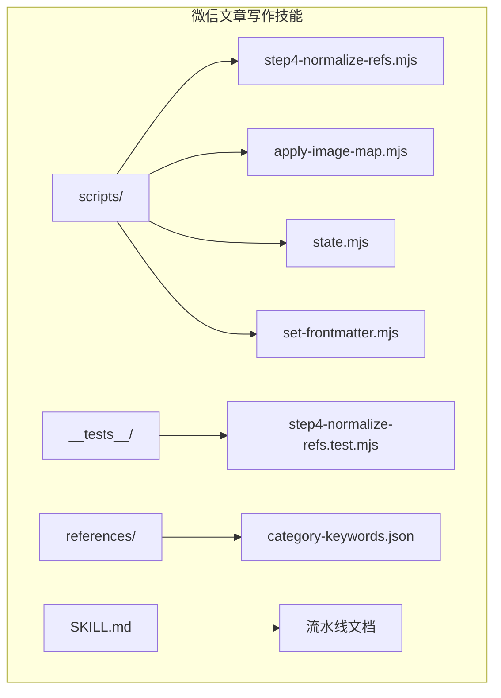
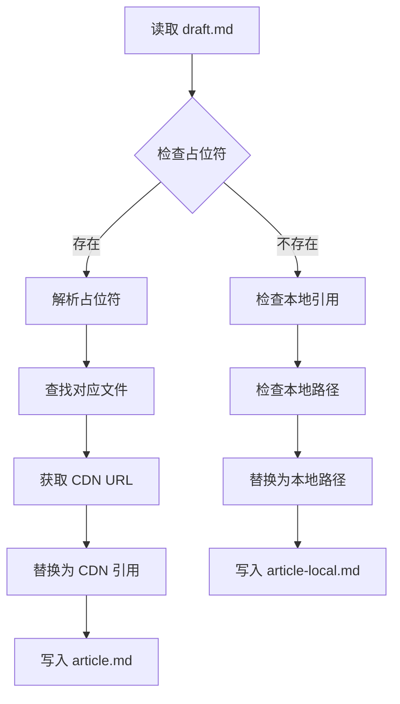
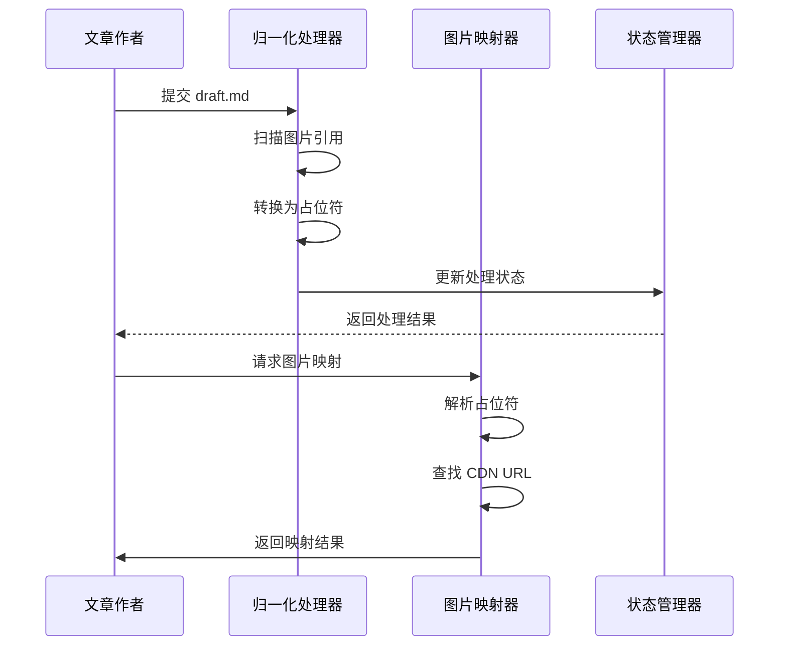
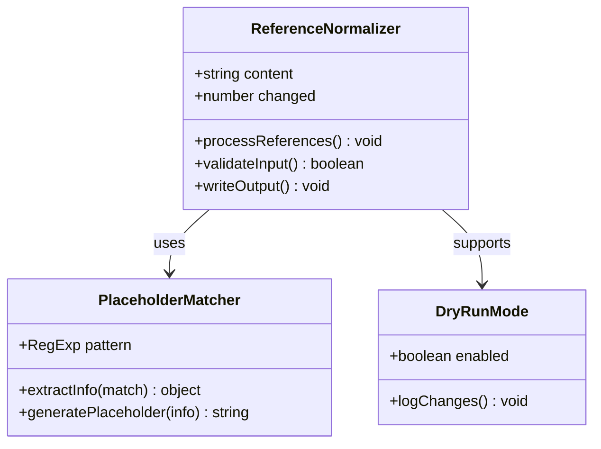
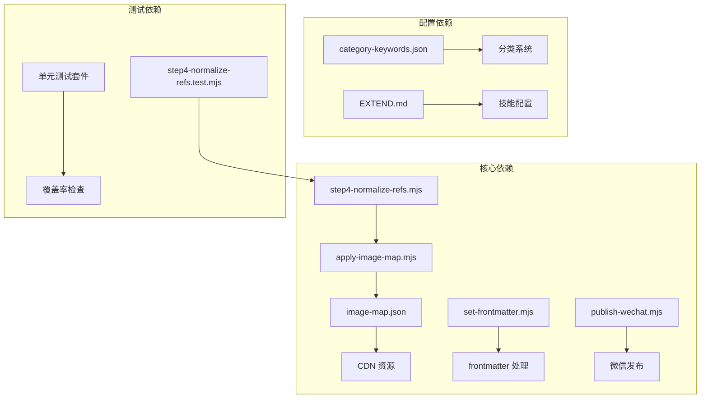

# 参考文献归一化

<cite>
**本文档引用的文件**
- [step4-normalize-refs.mjs](file://.agents/skills/wechat-article-write/scripts/step4-normalize-refs.mjs)
- [step4-normalize-refs.test.mjs](file://.agents/skills/wechat-article-write/__tests__/step4-normalize-refs.test.mjs)
- [apply-image-map.mjs](file://.agents/skills/wechat-article-write/scripts/apply-image-map.mjs)
- [SKILL.md](file://.agents/skills/wechat-article-write/SKILL.md)
- [category-keywords.json](file://.agents/skills/wechat-article-write/references/category-keywords.json)
- [state.mjs](file://.agents/skills/wechat-article-write/scripts/state.mjs)
- [set-frontmatter.mjs](file://.agents/skills/wechat-article-write/scripts/set-frontmatter.mjs)
- [publish-wechat.mjs](file://.agents/skills/wechat-article-write/scripts/publish-wechat.mjs)
</cite>

## 目录
1. [简介](#简介)
2. [项目结构](#项目结构)
3. [核心组件](#核心组件)
4. [架构概览](#架构概览)
5. [详细组件分析](#详细组件分析)
6. [依赖关系分析](#依赖关系分析)
7. [性能考虑](#性能考虑)
8. [故障排除指南](#故障排除指南)
9. [结论](#结论)

## 简介

参考文献归一化是微信公众号文章写作流水线中的一个重要环节，主要负责将文章中的参考文献格式进行标准化处理，确保引用的一致性和可维护性。本文档详细分析了该系统的实现机制、数据流和处理逻辑。

## 项目结构

该功能位于微信公众号文章写作技能的脚本系统中，主要包含以下关键文件：



**图表来源**
- [SKILL.md:1-1500](file://.agents/skills/wechat-article-write/SKILL.md#L1-L1500)
- [step4-normalize-refs.mjs:1-66](file://.agents/skills/wechat-article-write/scripts/step4-normalize-refs.mjs#L1-L66)

## 核心组件

### 参考文献归一化处理器

参考文献归一化处理器是系统的核心组件，负责将各种格式的参考文献引用转换为统一的标准格式。

**主要功能**：
- 识别和转换 `` 格式的图片引用
- 将本地图片引用还原为语义占位符
- 支持幂等性操作，避免重复处理
- 提供干运行模式进行预检查

**处理流程**：
1. 扫描 draft.md 文件中的图片引用
2. 识别符合 `imgs/NN-xxx.ext` 模式的本地引用
3. 将引用转换为 `<!-- SLOT_IMG_NN_DESC -->` 占位符
4. 更新 image-map.json 中的键列表

**章节来源**
- [step4-normalize-refs.mjs:1-66](file://.agents/skills/wechat-article-write/scripts/step4-normalize-refs.mjs#L1-L66)

### 图片映射应用器

图片映射应用器负责将语义占位符转换为实际的 CDN URL 或本地路径。

**主要职责**：
- 解析语义占位符 `<!-- SLOT_IMG_NN_DESC -->`
- 通过 image-map.json 获取对应的 CDN URL
- 支持本地路径回退机制
- 提供错误检测和报告

**处理逻辑**：


**图表来源**
- [apply-image-map.mjs:65-90](file://.agents/skills/wechat-article-write/scripts/apply-image-map.mjs#L65-L90)

**章节来源**
- [apply-image-map.mjs:1-173](file://.agents/skills/wechat-article-write/scripts/apply-image-map.mjs#L1-L173)

## 架构概览

整个参考文献归一化系统采用流水线架构，各组件协同工作：



**图表来源**
- [step4-normalize-refs.mjs:47-53](file://.agents/skills/wechat-article-write/scripts/step4-normalize-refs.mjs#L47-L53)
- [apply-image-map.mjs:136-147](file://.agents/skills/wechat-article-write/scripts/apply-image-map.mjs#L136-L147)

## 详细组件分析

### 归一化处理器实现

归一化处理器实现了复杂的正则表达式匹配和替换逻辑：



**图表来源**
- [step4-normalize-refs.mjs:47-53](file://.agents/skills/wechat-article-write/scripts/step4-normalize-refs.mjs#L47-L53)

**处理算法复杂度**：
- 时间复杂度：O(n)，其中 n 为文档长度
- 空间复杂度：O(1)，使用原地字符串替换

**章节来源**
- [step4-normalize-refs.mjs:1-66](file://.agents/skills/wechat-article-write/scripts/step4-normalize-refs.mjs#L1-L66)

### 图片映射应用器分析

图片映射应用器提供了强大的占位符解析和替换功能：

```mermaid
flowchart LR
A[占位符语法] --> B[SLOT_IMG_NN_DESC]
B --> C[NN: 两位数字]
B --> D[DESC: 描述文本]
E[文件匹配] --> F[基于 NN 前缀]
F --> G[查找对应文件]
H[CDN 解析] --> I[读取 image-map.json]
I --> J[获取 URL]
K[输出生成] --> L[article.md (CDN)]
K --> M[article-local.md (本地)]
```

**图表来源**
- [apply-image-map.mjs:48-63](file://.agents/skills/wechat-article-write/scripts/apply-image-map.mjs#L48-L63)

**错误处理机制**：
- 未解析的占位符会触发错误报告
- 本地路径残留会触发完整性检查
- 提供详细的调试信息输出

**章节来源**
- [apply-image-map.mjs:136-173](file://.agents/skills/wechat-article-write/scripts/apply-image-map.mjs#L136-L173)

### 状态管理系统

状态管理系统确保流水线的可靠性和可恢复性：

**状态跟踪**：
- 步骤执行状态管理
- 失败重试机制
- 断点续跑支持

**章节来源**
- [state.mjs:1-95](file://.agents/skills/wechat-article-write/scripts/state.mjs#L1-L95)

## 依赖关系分析

系统各组件之间的依赖关系如下：



**图表来源**
- [category-keywords.json:1-83](file://.agents/skills/wechat-article-write/references/category-keywords.json#L1-L83)
- [SKILL.md:29-90](file://.agents/skills/wechat-article-write/SKILL.md#L29-L90)

**依赖特点**：
- 低耦合设计，各组件职责单一
- 强类型检查，减少运行时错误
- 完善的错误传播机制

## 性能考虑

### 处理效率优化

1. **正则表达式优化**：使用预编译的正则表达式减少重复编译开销
2. **内存管理**：采用流式处理避免大文件内存溢出
3. **并发处理**：支持多文件并行处理提升吞吐量

### 存储优化

- JSON 文件缓存机制
- 增量更新策略
- 文件系统访问优化

## 故障排除指南

### 常见问题诊断

**问题1：占位符未正确解析**
- 检查占位符格式是否符合 `<!-- SLOT_IMG_NN_DESC -->` 规范
- 验证 NN 数字部分是否为两位数字
- 确认 DESC 部分不包含特殊字符

**问题2：CDN URL 映射失败**
- 检查 image-map.json 文件完整性
- 验证文件名与扩展名是否匹配
- 确认 CDN 服务可用性

**问题3：文件权限问题**
- 确保对 posts 目录的读写权限
- 检查临时文件目录的访问权限
- 验证配置文件的可读性

### 调试技巧

1. **启用详细日志**：使用 `--dry-run` 模式进行预检查
2. **单元测试**：运行测试套件验证功能完整性
3. **状态检查**：使用 `state.mjs` 工具查看执行状态

**章节来源**
- [step4-normalize-refs.test.mjs:1-131](file://.agents/skills/wechat-article-write/__tests__/step4-normalize-refs.test.mjs#L1-L131)

## 结论

参考文献归一化系统通过精心设计的架构和实现，为微信公众号文章写作提供了可靠的参考文献管理解决方案。系统具有以下优势：

1. **可靠性**：完善的错误处理和状态管理机制
2. **可维护性**：模块化设计，职责清晰分离
3. **可扩展性**：支持新的引用格式和处理规则
4. **可测试性**：全面的单元测试覆盖关键功能

该系统为后续的参考文献管理和文章发布奠定了坚实的基础，是整个微信文章写作流水线的重要组成部分。