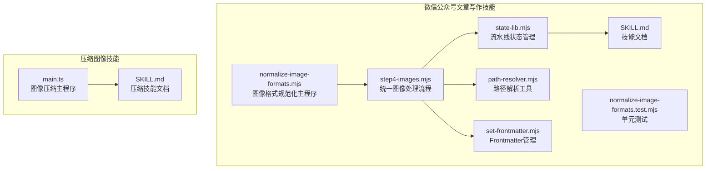
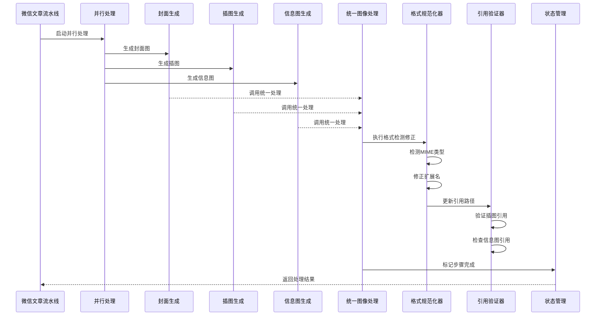
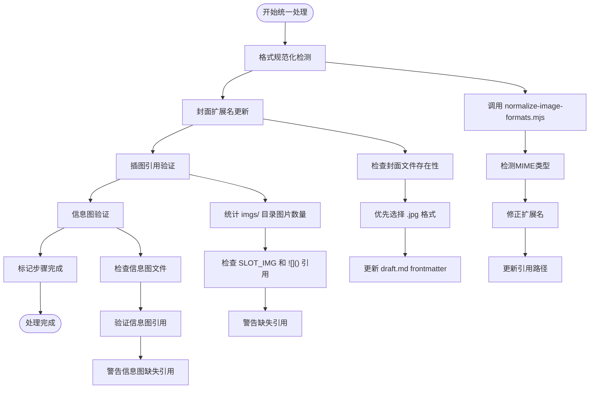
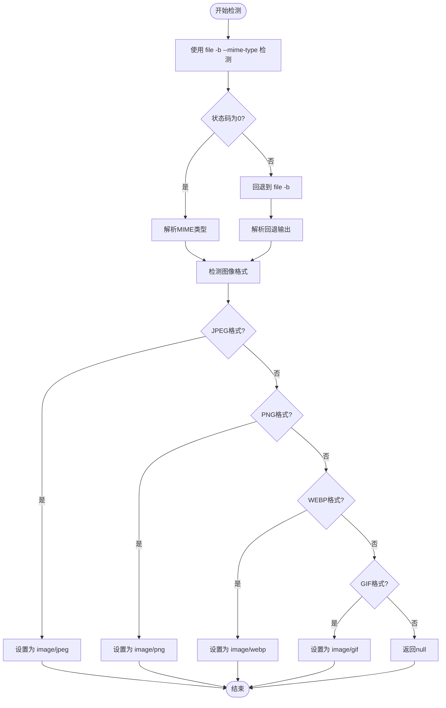
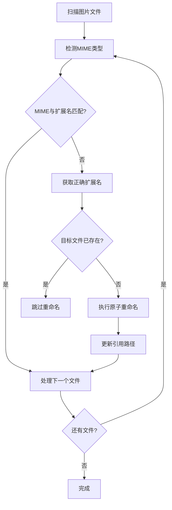
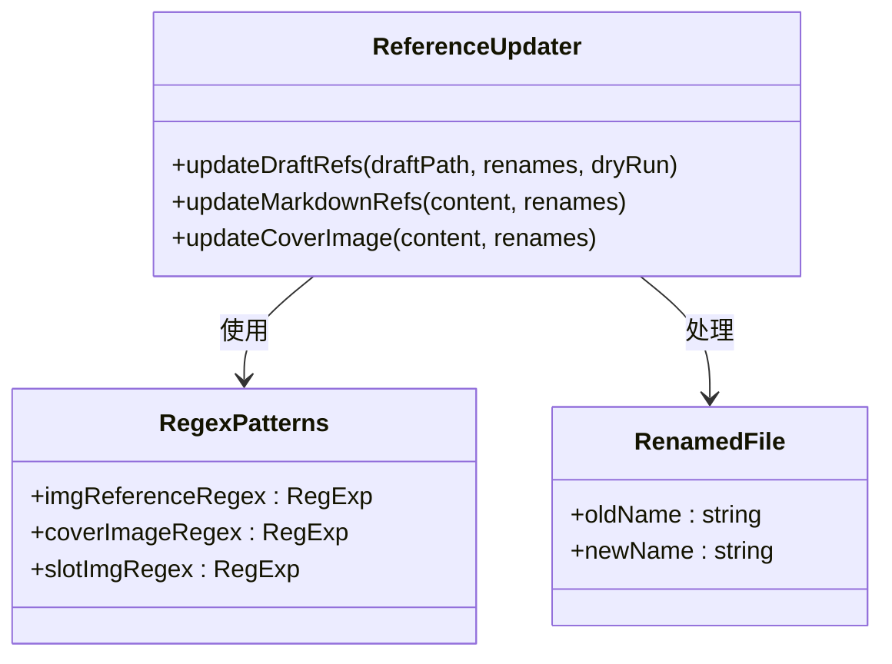
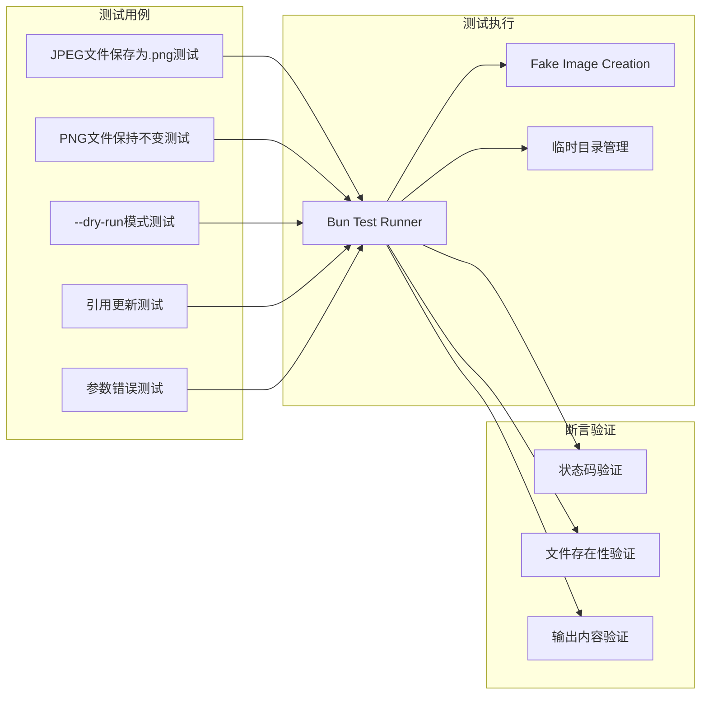
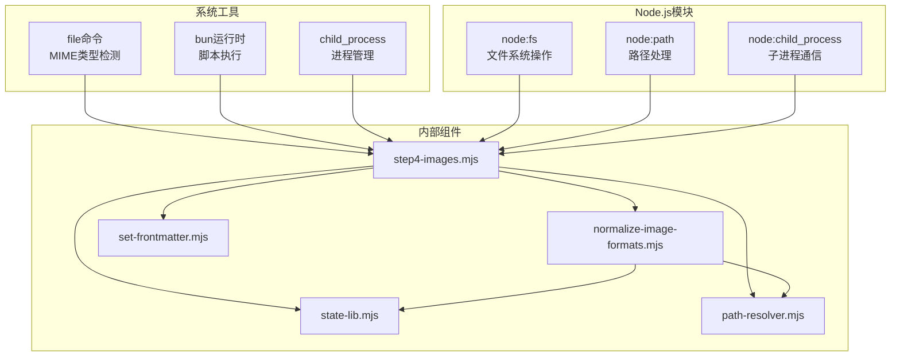
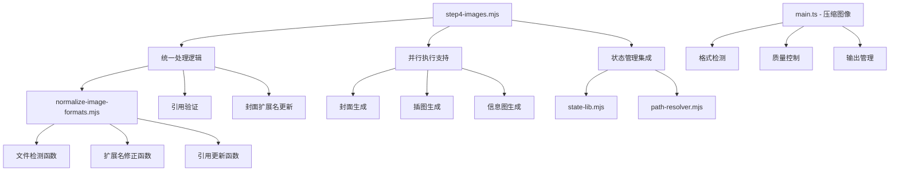

# 图像格式规范化

<cite>
**本文档引用的文件**
- [normalize-image-formats.mjs](file://.agents/skills/wechat-article-write/scripts/normalize-image-formats.mjs)
- [normalize-image-formats.test.mjs](file://.agents/skills/wechat-article-write/__tests__/normalize-image-formats.test.mjs)
- [SKILL.md](file://.agents/skills/wechat-article-write/SKILL.md)
- [step4-images.mjs](file://.agents/skills/wechat-article-write/scripts/step4-images.mjs)
- [state-lib.mjs](file://.agents/skills/wechat-article-write/scripts/state-lib.mjs)
- [path-resolver.mjs](file://.agents/skills/wechat-article-write/scripts/path-resolver.mjs)
- [set-frontmatter.mjs](file://.agents/skills/wechat-article-write/scripts/set-frontmatter.mjs)
- [main.ts](file://.agents/skills/baoyu-compress-image/scripts/main.ts)
- [SKILL.md](file://.agents/skills/baoyu-compress-image/SKILL.md)
</cite>

## 更新摘要
**变更内容**
- 更新了图像处理流程的整合情况，从多个专门脚本合并为统一的step4-images.mjs
- 新增了并行执行策略的描述，涵盖封面、插图和信息图的并行生成
- 更新了架构概览和详细组件分析以反映新的统一处理流程
- 增强了故障排除指南，包含新的step4-images.mjs特有的验证机制

## 目录
1. [简介](#简介)
2. [项目结构](#项目结构)
3. [核心组件](#核心组件)
4. [架构概览](#架构概览)
5. [详细组件分析](#详细组件分析)
6. [依赖分析](#依赖分析)
7. [性能考虑](#性能考虑)
8. [故障排除指南](#故障排除指南)
9. [结论](#结论)

## 简介

图像格式规范化是微信公众号文章写作流水线中的关键环节，专门解决AI图像生成后端返回的格式不匹配问题。该系统通过MIME类型检测、扩展名修正和引用更新，确保所有图片文件的格式与扩展名保持一致，避免后续CDN上传和微信HTML处理过程中的格式不匹配错误。

**更新** 系统现已整合为统一的step4-images.mjs脚本，实现了封面、插图和信息图的并行处理和统一验证。

## 项目结构

该功能主要分布在微信公众号文章写作技能中，包含以下核心文件：



**图表来源**
- [.agents/skills/wechat-article-write/scripts/normalize-image-formats.mjs:1-173](file://.agents/skills/wechat-article-write/scripts/normalize-image-formats.mjs#L1-L173)
- [.agents/skills/wechat-article-write/scripts/step4-images.mjs:1-81](file://.agents/skills/wechat-article-write/scripts/step4-images.mjs#L1-L81)

## 核心组件

### 统一图像处理流程

`step4-images.mjs` 是整合后的核心组件，负责：

- **统一格式检测修正**：调用normalize-image-formats.mjs进行MIME类型检测和扩展名修正
- **封面扩展名更新**：自动检测并更新draft.md中coverImage的扩展名
- **插图引用验证**：验证imgs/目录中的图片数量与draft.md引用的一致性
- **信息图验证**：检查信息图文件的存在性和引用完整性
- **并行执行支持**：支持封面、插图和信息图的并行生成流程

### 图像格式规范化主程序

`normalize-image-formats.mjs` 作为独立模块被step4-images.mjs调用，负责：

- **MIME类型检测**：使用系统`file`命令检测文件的真实格式
- **扩展名修正**：根据MIME类型自动修正不匹配的文件扩展名
- **引用更新**：更新draft.md中的图片引用路径
- **幂等性保证**：重复运行不会产生额外变更

### 状态管理和路径解析

- **state-lib.mjs**：提供流水线状态的初始化、标记和查询功能
- **path-resolver.mjs**：统一处理项目路径解析，支持环境变量配置

**章节来源**
- [.agents/skills/wechat-article-write/scripts/step4-images.mjs:1-81](file://.agents/skills/wechat-article-write/scripts/step4-images.mjs#L1-L81)
- [.agents/skills/wechat-article-write/scripts/normalize-image-formats.mjs:1-173](file://.agents/skills/wechat-article-write/scripts/normalize-image-formats.mjs#L1-L173)
- [.agents/skills/wechat-article-write/scripts/state-lib.mjs:1-63](file://.agents/skills/wechat-article-write/scripts/state-lib.mjs#L1-L63)
- [.agents/skills/wechat-article-write/scripts/path-resolver.mjs:1-25](file://.agents/skills/wechat-article-write/scripts/path-resolver.mjs#L1-L25)

## 架构概览



**图表来源**
- [.agents/skills/wechat-article-write/scripts/step4-images.mjs:27-80](file://.agents/skills/wechat-article-write/scripts/step4-images.mjs#L27-L80)
- [.agents/skills/wechat-article-write/scripts/normalize-image-formats.mjs:133-157](file://.agents/skills/wechat-article-write/scripts/normalize-image-formats.mjs#L133-L157)

## 详细组件分析

### 统一处理流程

step4-images.mjs实现了四个关键处理步骤：



**图表来源**
- [.agents/skills/wechat-article-write/scripts/step4-images.mjs:27-80](file://.agents/skills/wechat-article-write/scripts/step4-images.mjs#L27-L80)

### MIME类型检测机制

系统采用多层次的MIME类型检测策略：



**图表来源**
- [.agents/skills/wechat-article-write/scripts/normalize-image-formats.mjs:29-43](file://.agents/skills/wechat-article-write/scripts/normalize-image-formats.mjs#L29-L43)

### 扩展名修正算法

扩展名修正采用原子重命名策略，确保操作的安全性和幂等性：



**图表来源**
- [.agents/skills/wechat-article-write/scripts/normalize-image-formats.mjs:59-80](file://.agents/skills/wechat-article-write/scripts/normalize-image-formats.mjs#L59-L80)

### 引用更新机制

系统能够智能识别和更新多种格式的图片引用：



**图表来源**
- [.agents/skills/wechat-article-write/scripts/normalize-image-formats.mjs:87-108](file://.agents/skills/wechat-article-write/scripts/normalize-image-formats.mjs#L87-L108)

**章节来源**
- [.agents/skills/wechat-article-write/scripts/normalize-image-formats.mjs:29-173](file://.agents/skills/wechat-article-write/scripts/normalize-image-formats.mjs#L29-L173)
- [.agents/skills/wechat-article-write/scripts/step4-images.mjs:1-81](file://.agents/skills/wechat-article-write/scripts/step4-images.mjs#L1-L81)

### 测试框架

单元测试确保系统的可靠性和幂等性：



**图表来源**
- [.agents/skills/wechat-article-write/__tests__/normalize-image-formats.test.mjs:62-140](file://.agents/skills/wechat-article-write/__tests__/normalize-image-formats.test.mjs#L62-L140)

**章节来源**
- [.agents/skills/wechat-article-write/__tests__/normalize-image-formats.test.mjs:1-140](file://.agents/skills/wechat-article-write/__tests__/normalize-image-formats.test.mjs#L1-L140)

## 依赖分析

### 外部依赖

系统依赖以下外部工具和库：



**图表来源**
- [.agents/skills/wechat-article-write/scripts/normalize-image-formats.mjs:23-25](file://.agents/skills/wechat-article-write/scripts/normalize-image-formats.mjs#L23-L25)
- [.agents/skills/wechat-article-write/scripts/step4-images.mjs:14-18](file://.agents/skills/wechat-article-write/scripts/step4-images.mjs#L14-L18)

### 内部依赖关系



**图表来源**
- [.agents/skills/wechat-article-write/scripts/step4-images.mjs:27-80](file://.agents/skills/wechat-article-write/scripts/step4-images.mjs#L27-L80)
- [.agents/skills/wechat-article-write/scripts/normalize-image-formats.mjs:112-173](file://.agents/skills/wechat-article-write/scripts/normalize-image-formats.mjs#L112-L173)
- [.agents/skills/baoyu-compress-image/scripts/main.ts:91-164](file://.agents/skills/baoyu-compress-image/scripts/main.ts#L91-L164)

**章节来源**
- [.agents/skills/wechat-article-write/scripts/step4-images.mjs:1-81](file://.agents/skills/wechat-article-write/scripts/step4-images.mjs#L1-L81)
- [.agents/skills/wechat-article-write/scripts/normalize-image-formats.mjs:112-173](file://.agents/skills/wechat-article-write/scripts/normalize-image-formats.mjs#L112-L173)
- [.agents/skills/baoyu-compress-image/scripts/main.ts:1-318](file://.agents/skills/baoyu-compress-image/scripts/main.ts#L1-L318)

## 性能考虑

### 并行处理优化

系统采用并行处理策略减少整体处理时间：

- **并行生成**：封面、插图和信息图同时生成，充分利用系统资源
- **统一处理**：所有图像处理在step4-images.mjs中统一调度，避免重复启动
- **原子操作**：使用renameSync确保操作的原子性，避免部分完成状态
- **幂等设计**：重复运行不会产生额外的文件操作

### 内存管理

- **流式处理**：大文件处理时采用流式读取，避免内存溢出
- **渐进式更新**：引用更新采用正则表达式替换，内存占用恒定
- **状态最小化**：使用state-lib.mjs提供轻量级状态管理

### 并发处理

系统支持并行处理多个图片文件，提高整体处理效率。

## 故障排除指南

### 常见问题及解决方案

| 问题类型 | 症状 | 解决方案 |
|---------|------|----------|
| MIME检测失败 | 返回null或undefined | 检查file命令安装和权限 |
| 文件重命名冲突 | 目标文件已存在 | 手动清理冲突文件或使用--dry-run模式 |
| 引用更新不完整 | 部分引用未更新 | 检查draft.md格式是否符合预期 |
| 权限错误 | 文件操作失败 | 确保脚本有相应目录的读写权限 |
| 并行处理失败 | 某个图像生成失败 | 检查对应图像生成技能的配置和API密钥 |
| 状态同步问题 | 步骤状态不一致 | 使用state.mjs检查和修复状态文件 |

### 调试模式

系统提供--dry-run模式进行安全测试：

```bash
# 预览变更而不实际执行
bun run normalize-image-formats.mjs posts/2026-05-12-article-title --dry-run
```

**更新** 新增了step4-images.mjs特有的调试和验证功能：

```bash
# 检查图像引用一致性
bun run step4-images.mjs posts/2026-05-12-article-title
```

**章节来源**
- [.agents/skills/wechat-article-write/scripts/normalize-image-formats.mjs:118-127](file://.agents/skills/wechat-article-write/scripts/normalize-image-formats.mjs#L118-L127)
- [.agents/skills/wechat-article-write/scripts/step4-images.mjs:51-74](file://.agents/skills/wechat-article-write/scripts/step4-images.mjs#L51-L74)

## 结论

图像格式规范化系统通过自动化MIME类型检测、扩展名修正和引用更新，有效解决了AI图像生成过程中的格式不匹配问题。该系统现已整合为统一的step4-images.mjs脚本，具有以下优势：

- **统一处理流程**：整合了原本分散的多个专门脚本，提供一致的处理体验
- **并行执行支持**：支持封面、插图和信息图的并行生成，显著提升处理效率
- **自动化程度高**：无需人工干预，自动完成格式检测、修正和验证
- **幂等性强**：支持重复运行，确保结果的一致性
- **安全性高**：采用原子重命名和备份机制，避免数据丢失
- **可扩展性好**：模块化设计便于功能扩展和维护
- **状态管理完善**：集成状态跟踪，支持断点续跑和错误恢复

该系统是微信公众号文章写作流水线中不可或缺的重要组成部分，为后续的CDN上传和微信HTML处理奠定了坚实的基础。统一的处理流程不仅简化了操作，还提高了系统的可靠性和维护性。