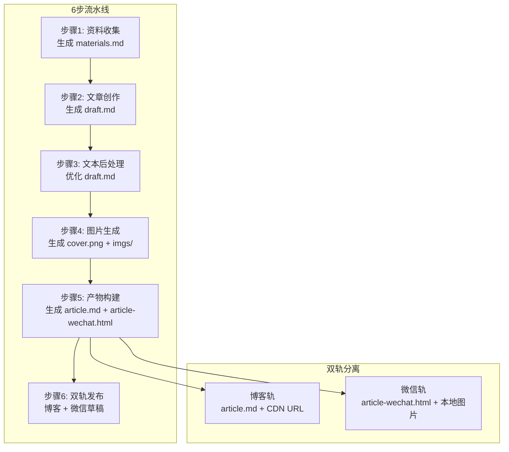
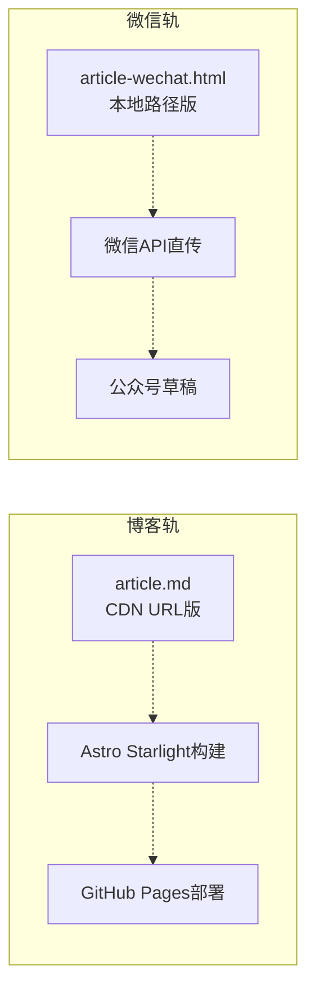
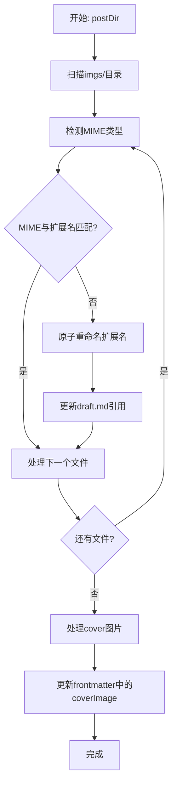

# 微信文章写作管线

<cite>
**本文档引用的文件**
- [EXTEND.md](file://.agents/skills/wechat-article-write/EXTEND.md)
- [pipeline.mjs](file://.agents/skills/wechat-article-write/scripts/pipeline.mjs)
- [state.mjs](file://.agents/skills/wechat-article-write/scripts/state.mjs)
- [state-lib.mjs](file://.agents/skills/wechat-article-write/scripts/state-lib.mjs)
- [config-lib.mjs](file://.agents/skills/wechat-article-write/scripts/config-lib.mjs)
- [step1-collect.mjs](file://.agents/skills/wechat-article-write/scripts/step1-collect.mjs)
- [step2-write.mjs](file://.agents/skills/wechat-article-write/scripts/step2-write.mjs)
- [step3-polish.mjs](file://.agents/skills/wechat-article-write/scripts/step3-polish.mjs)
- [step4-images.mjs](file://.agents/skills/wechat-article-write/scripts/step4-images.mjs)
- [step5-build.mjs](file://.agents/skills/wechat-article-write/scripts/step5-build.mjs)
- [publish-blog.mjs](file://.agents/skills/wechat-article-write/scripts/publish-blog.mjs)
- [publish-wechat.mjs](file://.agents/skills/wechat-article-write/scripts/publish-wechat.mjs)
- [suggest-category.mjs](file://.agents/skills/wechat-article-write/scripts/suggest-category.mjs)
- [set-frontmatter.mjs](file://.agents/skills/wechat-article-write/scripts/set-frontmatter.mjs)
- [normalize-image-formats.mjs](file://.agents/skills/wechat-article-write/scripts/normalize-image-formats.mjs)
- [apply-image-map.mjs](file://.agents/skills/wechat-article-write/scripts/apply-image-map.mjs)
</cite>

## 更新摘要
**变更内容**
- 新增干运行(dry-run)功能支持：所有关键步骤均支持 --dry-run 模式
- 增强博客slug解析系统：支持 --blog-slug 参数覆盖和自动解析
- 改进发布脚本：新增 --no-push、--no-build、--allow-non-main 等选项
- 管道编排器改进：支持 --auto 模式下的智能执行和状态检查
- 图像托管脚本现代化：增强 CDN 上传和占位符映射功能
- 新增全面测试套件：覆盖核心功能的单元测试

## 目录
1. [简介](#简介)
2. [6步流水线架构](#6步流水线架构)
3. [核心组件](#核心组件)
4. [详细流程分析](#详细流程分析)
5. [配置文件详解](#配置文件详解)
6. [状态管理系统](#状态管理系统)
7. [双轨发布机制](#双轨发布机制)
8. [图片处理与格式校验](#图片处理与格式校验)
9. [干运行(dry-run)功能](#干运行dry-run功能)
10. [故障排查指南](#故障排查指南)
11. [性能优化建议](#性能优化建议)
12. [测试与验证](#测试与验证)
13. [结论](#结论)

## 简介
微信文章写作管线是一个完整的自动化发布系统，专为微信公众号文章创作而设计。该系统采用全新的6步流水线架构，从资料收集到最终发布实现了高度自动化的端到端流程。

**核心特点**：
- **6步线性流程**：collect → write → polish → images → build → publish
- **双轨分离架构**：博客轨和微信轨完全独立，零共享中间产物
- **全自动执行**：中间步骤不停顿，失败不阻塞
- **统一状态管理**：基于精简状态库的步骤跟踪
- **智能分类推荐**：基于关键词匹配的分类系统
- **集中配置管理**：config-lib.mjs 统一读取各技能配置
- **管道编排器**：pipeline.mjs 提供最小编排和自动执行
- **完整的测试支持**：单元测试覆盖核心功能
- **干运行(dry-run)模式**：支持无副作用的执行验证
- **增强的博客slug解析**：灵活的slug生成和覆盖机制

**更新**：系统已完全迁移至新的6步流水线架构，移除了复杂的15步状态机，采用更直观的线性流程设计，显著提升了系统的可维护性和执行效率。新增的干运行功能和增强的slug解析系统进一步提升了开发体验和可靠性。

## 6步流水线架构

微信文章写作管线采用全新的6步线性架构，每个步骤都有明确的目标和产出：



**图表来源**
- [pipeline.mjs](file://.agents/skills/wechat-article-write/scripts/pipeline.mjs)

**章节来源**
- [pipeline.mjs](file://.agents/skills/wechat-article-write/scripts/pipeline.mjs)

## 核心组件

### 管道编排器
系统新增了最小编排器 pipeline.mjs，提供智能的步骤管理和自动执行能力：

- **智能状态查询**：根据当前状态返回下一步指令
- **Agent引导**：Step 1-4 提供详细的 Agent 操作指导
- **自动执行**：--auto 模式自动执行确定性步骤（Step 5/6）
- **子状态检查**：避免重复执行已成功的发布步骤
- **干运行支持**：--auto 模式下支持干运行验证

### 集中配置管理
config-lib.mjs 提供统一的配置解析和管理：

- **多技能配置**：从 .baoyu-skills 目录读取各技能 EXTEND.md
- **默认值管理**：每个配置项都有硬编码的后备值
- **类型转换**：自动处理布尔值、数字等基本类型
- **缓存机制**：进程内缓存避免重复读取

### 流水线状态管理
系统采用增强的状态管理系统，支持步骤跟踪和断点续跑：

- **状态结构**：包含 slug、started_at、last_complete_step、publish、failed_step
- **子状态分离**：Step 6 包含博客和微信两个独立子状态
- **失败恢复**：支持从失败步骤自动恢复执行
- **完成检测**：全部完成时返回 "done"

### 资料收集组件
负责从各种来源收集文章素材，支持URL、文件路径和粘贴文本：

- **多源支持**：web-access技能提供统一的联网访问接口
- **内容合并**：将多个来源的内容合并到materials.md
- **质量检查**：字数检测和低质量警告

### 文章创作组件
基于ljg-writes技能生成初稿，包含智能分类推荐：

- **字数控制**：目标2500-3500字，硬性下限2500字
- **分类系统**：自动推荐分类，低置信度时人工确认
- **模板规范**：强制使用语义占位符的draft.md模板
- **slug解析**：支持自动slug生成和手动覆盖

### 图片生成组件
并行生成封面、插图和信息图表：

- **并行执行**：封面、插图、信息图同时生成
- **格式统一**：自动修正图片格式陷阱
- **引用验证**：确保图片引用与实际文件一致

### 产物构建组件
生成最终的发布产物：

- **CDN上传**：统一上传imgs/目录到GitHub图床
- **占位符替换**：生成CDN版和本地版两种article文件
- **HTML转换**：生成微信专用的article-wechat.html
- **干运行支持**：--dry-run 模式验证构建过程

### 发布组件
双轨发布到博客和微信：

- **博客发布**：通过publish-blog.mjs发布到GitHub Pages
- **微信发布**：通过publish-wechat.mjs发布到微信草稿
- **顺序控制**：博客优先，确保sourceUrl可用
- **增强选项**：支持多种发布控制选项

**章节来源**
- [pipeline.mjs](file://.agents/skills/wechat-article-write/scripts/pipeline.mjs)
- [config-lib.mjs](file://.agents/skills/wechat-article-write/scripts/config-lib.mjs)
- [state-lib.mjs](file://.agents/skills/wechat-article-write/scripts/state-lib.mjs)
- [step1-collect.mjs](file://.agents/skills/wechat-article-write/scripts/step1-collect.mjs)
- [step2-write.mjs](file://.agents/skills/wechat-article-write/scripts/step2-write.mjs)
- [step4-images.mjs](file://.agents/skills/wechat-article-write/scripts/step4-images.mjs)
- [step5-build.mjs](file://.agents/skills/wechat-article-write/scripts/step5-build.mjs)
- [publish-blog.mjs](file://.agents/skills/wechat-article-write/scripts/publish-blog.mjs)
- [publish-wechat.mjs](file://.agents/skills/wechat-article-write/scripts/publish-wechat.mjs)

## 详细流程分析

### 步骤1：资料收集
资料收集是整个流水线的第一步，负责从各种来源获取文章素材：

**Agent动作**：
- 检测输入类型（URL / 文件路径 / 粘贴文本）
- 通过web-access技能获取URL内容
- 联网搜索通过google.com/ncr访问
- 合并所有资料到materials.md

**脚本验证**：
- 检查materials.md存在且非空
- 低质量检测：字数<200字打印警告（非阻塞）
- 写入状态信息

**章节来源**
- [step1-collect.mjs](file://.agents/skills/wechat-article-write/scripts/step1-collect.mjs)

### 步骤2：文章创作
文章创作阶段生成初稿并进行智能分类：

**Agent动作**：
1. 通过ljg-writes技能生成文章初稿
2. 运行suggest-category.mjs推荐分类
3. 低置信度时人工确认分类和blog-slug
4. 使用set-frontmatter.mjs写入frontmatter

**draft.md模板**：
- 强制使用语义占位符：<!-- SLOT_IMG_00_INFOGRAPHIC -->
- 包含必需字段：title、date、summary、category、coverImage、sourceUrl
- 支持文末互动和原文参考区块

**质量门控**：
- 字数≥2500（硬性下限）
- frontmatter完整性检查
- 正文无H1标题
- 读后感类文章必须包含原文参考

**章节来源**
- [step2-write.mjs](file://.agents/skills/wechat-article-write/scripts/step2-write.mjs)
- [suggest-category.mjs](file://.agents/skills/wechat-article-write/scripts/suggest-category.mjs)

### 步骤3：文本后处理
对draft.md进行语言优化和格式标准化：

**处理范围**：
- 仅处理正文内容（frontmatter之后，原文参考之前）
- 语义占位符<!-- SLOT_IMG_ -->不会被修改

**处理流程**：
1. 通过humanizer-zh处理正文内容
2. 通过baoyu-format-markdown格式化
3. 保持语义占位符不变

**验证**：
- 检查draft.md存在且非空
- 记录文件大小信息

**章节来源**
- [step3-polish.mjs](file://.agents/skills/wechat-article-write/scripts/step3-polish.mjs)

### 步骤4：图片生成
并行生成封面、插图和信息图表：

**并行执行**：
- **封面生成**：baoyu-cover-image，自动选择类型和风格
- **插图生成**：baoyu-article-illustrator，生成3-5张图片
- **信息图表**：baoyu-infographic，可选生成

**质量控制**：
1. 统一格式检测修正（MIME/扩展名不匹配）
2. 更新coverImage扩展名
3. 插图引用一致性验证
4. 信息图表插入验证

**章节来源**
- [step4-images.mjs](file://.agents/skills/wechat-article-write/scripts/step4-images.mjs)
- [normalize-image-formats.mjs](file://.agents/skills/wechat-article-write/scripts/normalize-image-formats.mjs)

### 步骤5：产物构建
生成最终的发布产物：

**构建流程**：
1. **CDN上传**：上传imgs/*到GitHub图床，生成image-map.json
2. **占位符替换**：生成article.md（CDN URL版）
3. **本地版本**：生成article-local.md（本地路径版）
4. **HTML转换**：将draft.md转换为article-wechat.html

**验证检查**：
- article.md无占位符残留
- article.md无本地路径引用
- article-wechat.html非空且包含内联CSS
- 移除font-family样式声明

**干运行支持**：
- --dry-run 模式验证构建过程但不实际执行
- --reuse-image-map 重用现有image-map.json

**章节来源**
- [step5-build.mjs](file://.agents/skills/wechat-article-write/scripts/step5-build.mjs)
- [apply-image-map.mjs](file://.agents/skills/wechat-article-write/scripts/apply-image-map.mjs)

### 步骤6：双轨发布
博客轨和微信轨并行发布：

**发布顺序**：博客优先，微信草稿在后

**博客轨（publish-blog.mjs）**：
- frontmatter转换：summary→description，添加$schema
- 写入src/content/docs/articles/<slug>.md
- Astro构建验证
- Git提交和推送
- **增强选项**：--no-push、--no-build、--allow-non-main、--dry-run

**微信轨（publish-wechat.mjs）**：
- 读取article.md frontmatter，提取title和sourceUrl
- 可选的sourceUrl探活检查
- 调用baoyu-post-to-wechat发布草稿
- **增强选项**：--no-skip-deploy-check、--dry-run

**章节来源**
- [publish-blog.mjs](file://.agents/skills/wechat-article-write/scripts/publish-blog.mjs)
- [publish-wechat.mjs](file://.agents/skills/wechat-article-write/scripts/publish-wechat.mjs)

## 配置文件详解

### EXTEND.md配置
wechat-article-write的运行时配置文件：

**核心配置项**：
- **quick_mode**：true/false，是否跳过中间确认步骤
- **default_publish_method**：api/browser，默认发布方式

**依赖技能配置**：
- baoyu-cover-image：quick_mode: true
- baoyu-article-illustrator：quick_mode: true, preferred_image_backend
- baoyu-markdown-to-html：default_theme, default_color
- baoyu-post-to-wechat：default_author, default_publish_method

**环境变量**：
- WECHAT_APP_ID/WECHAT_APP_SECRET：微信公众号API
- GITHUB_TOKEN/GITHUB_REPO：GitHub图床
- OPENAI_API_KEY：图片生成后端

**章节来源**
- [EXTEND.md](file://.agents/skills/wechat-article-write/EXTEND.md)

### 集中配置管理
config-lib.mjs 提供统一的配置解析和管理：

**配置读取机制**：
- 自动读取 .baoyu-skills/*/EXTEND.md 的 frontmatter
- 解析为配置字典，脚本默认值由 config-lib 从 EXTEND.md 读取
- CLI 参数仍可覆盖所有配置

**支持的配置项**：
- markdownToHtml：default_theme, default_color, default_font_size, default_cite, default_keep_title
- postToWechat：default_author, default_theme, default_color, default_publish_method, need_open_comment, only_fans_can_comment
- coverImage：preferred_image_backend, quick_mode, language, default_aspect
- imagine：preferred_image_backend, default_model
- infographic：preferred_image_backend, preferred_style, preferred_layout
- illustrator：preferred_image_backend, preferred_style, default_output_dir

**章节来源**
- [config-lib.mjs](file://.agents/skills/wechat-article-write/scripts/config-lib.mjs)

### 分类关键词系统
系统使用基于关键词匹配的智能分类推荐：

**分类体系**：
- ai-coding：代码生成、编程辅助、AI编程
- ai-agents：智能体框架、多智能体、工作流编排
- ai-industry：AI行业动态、商业分析、投资融资
- ai-models：大模型、训练技术、推理优化
- security：网络安全、漏洞分析、攻防技术
- engineering：工程实践、架构设计、运维部署

**关键词匹配算法**：
- 正向关键词匹配
- N-gram短语匹配（2词组合）
- anti-keyword惩罚机制
- frontmatter tags加权
- gap置信度计算

**章节来源**
- [suggest-category.mjs](file://.agents/skills/wechat-article-write/scripts/suggest-category.mjs)

## 状态管理系统

### 增强状态库
系统采用增强的状态管理方案，支持步骤跟踪和断点续跑：

**状态结构**：
```javascript
{
  slug: "2026-05-16-langchain",
  started_at: "2026-05-16T00:00:00Z",
  last_complete_step: 3,
  publish: {
    blog: "done" | "blocked" | "failed" | "pending",
    wechat: "done" | "failed" | "pending"
  },
  failed_step: { step, error, at } | null
}
```

**状态操作**：
- **initState**：初始化状态（不存在时创建）
- **markStepDone**：标记步骤完成
- **markStepFailed**：标记步骤失败
- **markBlogDone**：标记博客发布完成/阻塞
- **markWechatDone**：标记微信发布完成
- **markWechatFailed**：标记微信发布失败
- **nextStep**：获取下一个应执行的步骤

**断点续跑**：
- state.mjs next返回last_complete_step + 1
- 支持从任意步骤重新开始
- 失败步骤会被重新执行

**章节来源**
- [state-lib.mjs](file://.agents/skills/wechat-article-write/scripts/state-lib.mjs)

### 管道编排器
pipeline.mjs 提供智能的步骤管理和自动执行：

**核心功能**：
- **状态查询**：读取当前状态并返回下一步指令
- **Agent引导**：Step 1-4 提供详细的 Agent 操作指导
- **自动执行**：--auto 模式自动执行确定性步骤（Step 5/6）
- **子状态检查**：避免重复执行已成功的发布步骤

**执行模式**：
- **默认模式**：仅报告状态，不执行文件写入、发布或网络操作
- **自动模式**：--auto 时自动串行执行确定性步骤
- **子状态管理**：检查博客/微信子状态避免重复执行

**章节来源**
- [pipeline.mjs](file://.agents/skills/wechat-article-write/scripts/pipeline.mjs)

## 双轨发布机制

### 架构设计理念
系统采用完全分离的双轨发布架构，两轨之间零共享中间产物：



**图表来源**
- [publish-blog.mjs](file://.agents/skills/wechat-article-write/scripts/publish-blog.mjs)
- [publish-wechat.mjs](file://.agents/skills/wechat-article-write/scripts/publish-wechat.mjs)

### 发布顺序控制
**博客优先策略**：
- Step 9（博客发布）在Step 10（微信发布）之前执行
- sourceUrl在Step 2创作时预先填入
- 确保微信草稿的"阅读原文"链接准确

**增强发布选项**：
- **--no-push**：不执行git push，仅本地写入
- **--no-build**：跳过Astro构建步骤
- **--allow-non-main**：允许在非main分支发布
- **--dry-run**：干运行模式验证发布过程

**Pages部署等待**：
- 可选的部署状态监控
- 超时配置（默认180秒）
- 支持HEAD和GET请求回退

**章节来源**
- [publish-blog.mjs](file://.agents/skills/wechat-article-write/scripts/publish-blog.mjs)
- [publish-wechat.mjs](file://.agents/skills/wechat-article-write/scripts/publish-wechat.mjs)

## 图片处理与格式校验

### 格式陷阱解决方案
系统专门解决Gemini等图片后端的格式陷阱问题：

**问题描述**：
- Gemini返回JPEG内容但保存为.png扩展名
- 导致后续流程（CDN上传、微信HTML）格式不匹配

**解决方案**：
1. **MIME检测**：使用`file -b --mime-type`检测实际格式
2. **扩展名修正**：自动将.png重命名为.jpg
3. **引用更新**：更新draft.md中的所有图片引用
4. **幂等性保证**：重复运行结果相同

**处理流程**：


**图表来源**
- [normalize-image-formats.mjs](file://.agents/skills/wechat-article-write/scripts/normalize-image-formats.mjs)

### 占位符映射系统
系统使用语义占位符确保图片引用的灵活性：

**占位符语法**：
- `<!-- SLOT_IMG_NN_DESC -->`：注释形式占位符
- ``：Markdown图片语法

**映射策略**：
1. **CDN版本**：将占位符替换为CDN URL
2. **本地版本**：将占位符替换为本地路径
3. **引用兼容**：兼容插图agent提前替换的图片语法

**验证机制**：
- 检查article.md无占位符残留
- 检查article.md无本地路径引用
- 检查image-map.json完整性

**章节来源**
- [normalize-image-formats.mjs](file://.agents/skills/wechat-article-write/scripts/normalize-image-formats.mjs)
- [apply-image-map.mjs](file://.agents/skills/wechat-article-write/scripts/apply-image-map.mjs)

## 干运行(dry-run)功能

### 功能概述
系统全面支持干运行(dry-run)模式，允许在不实际执行的情况下验证流程：

**支持的干运行步骤**：
- **Step 1-4**：资料收集、文章创作、文本后处理、图片生成
- **Step 5**：产物构建（--dry-run）
- **Step 6**：博客发布（--dry-run）、微信发布（--dry-run）

### 干运行实现机制

**Step 5 干运行**：
- 验证image-map.json存在性和有效性
- 检查SLOT_IMG占位符映射完整性
- 输出构建统计信息但不执行实际操作
- 支持 --reuse-image-map 选项

**Step 6 干运行**：
- **博客发布**：验证frontmatter字段和目标路径
- **微信发布**：验证HTML文件和封面图片存在性
- 输出将要执行的命令但不实际运行

**配置验证**：
- 验证CDN上传配置
- 检查GitHub图床凭据
- 验证微信公众号API配置

**章节来源**
- [step5-build.mjs](file://.agents/skills/wechat-article-write/scripts/step5-build.mjs)
- [publish-blog.mjs](file://.agents/skills/wechat-article-write/scripts/publish-blog.mjs)
- [publish-wechat.mjs](file://.agents/skills/wechat-article-write/scripts/publish-wechat.mjs)

## 故障排查指南

### 常见问题诊断

**步骤执行失败**：
- 检查state.mjs next输出确定失败步骤
- 查看failed_step.error获取错误详情
- 使用markStepFailed重新标记失败状态

**图片格式问题**：
- 验证Gemini后端返回的图片格式
- 使用normalize-image-formats.mjs的--dry-run模式调试
- 检查file命令可用性和MIME检测功能

**CDN上传失败**：
- 检查GitHub token和仓库权限
- 确认图片文件格式正确（PNG/JPG/WebP）
- 避免使用中文文件名，确保--name参数为纯ASCII

**博客发布失败**：
- 检查frontmatter字段完整性
- 验证blog-slug为纯ASCII kebab-case
- 确认ASTRO构建通过和Git推送权限
- 使用 --allow-non-main 跳过分支检查

**微信发布失败**：
- 检查sourceUrl是否可达
- 验证封面文件存在且格式正确
- 确认article-wechat.html和本地图片路径正确
- 使用 --no-skip-deploy-check 强制探活

### 调试工具

**状态监控**：
- 使用state-lib.mjs的loadState检查当前状态
- 通过state.mjs查看步骤执行历史
- 监控.pipeline-state.json文件变化

**日志分析**：
- 检查各步骤脚本的标准输出
- 查看错误码含义和处理逻辑
- 分析失败步骤的具体原因

**干运行调试**：
- 使用 --dry-run 模式验证流程
- 检查配置文件和环境变量
- 验证文件路径和权限

**章节来源**
- [state-lib.mjs](file://.agents/skills/wechat-article-write/scripts/state-lib.mjs)
- [normalize-image-formats.mjs](file://.agents/skills/wechat-article-write/scripts/normalize-image-formats.mjs)
- [publish-blog.mjs](file://.agents/skills/wechat-article-write/scripts/publish-blog.mjs)
- [publish-wechat.mjs](file://.agents/skills/wechat-article-write/scripts/publish-wechat.mjs)

## 性能优化建议

### 执行效率优化

**并行处理**：
- 步骤3（封面）、步骤4（插图）、步骤4.5（信息图）并行执行
- 减少图片生成的总耗时
- 避免重复的图片上传操作

**资源利用**：
- CDN前置上传，避免分散上传
- 移除CDN缓存等待，提升执行速度
- 双轨分离减少资源竞争

**内存管理**：
- 本地HTML转换使用内存中处理
- 避免不必要的文件IO操作
- 及时清理临时文件

### 系统稳定性

**错误处理**：
- 失败不阻塞，继续执行后续步骤
- 图片后端自动降级（Gemini → Seedream → DashScope）
- 上传失败重试1次机制

**质量保证**：
- 统一的格式检测和修正
- 多层次的验证检查
- 断点续跑支持

**章节来源**
- [step4-images.mjs](file://.agents/skills/wechat-article-write/scripts/step4-images.mjs)
- [step5-build.mjs](file://.agents/skills/wechat-article-write/scripts/step5-build.mjs)
- [publish-blog.mjs](file://.agents/skills/wechat-article-write/scripts/publish-blog.mjs)

## 测试与验证

### 单元测试套件
系统包含完整的单元测试套件，覆盖核心功能：

**测试覆盖范围**：
- normalize-image-formats.mjs：MIME检测、扩展名修正、引用更新
- path-resolver.mjs：路径解析、环境变量处理
- 状态管理：状态初始化、步骤跟踪、断点续跑
- 发布脚本：博客发布、微信发布功能验证

**测试特性**：
- **幂等性测试**：确保重复运行不影响结果
- **干运行模式**：--dry-run模式验证变更但不实际执行
- **边界条件**：测试空目录、不存在文件等异常情况
- **环境变量**：测试PIPELINE_POSTS_ROOT和PIPELINE_REPO_ROOT

**测试执行**：
- 使用Bun测试框架
- 每个测试使用独立临时目录
- 测试结束后自动清理

**章节来源**
- [normalize-image-formats.test.js](file://.agents/skills/wechat-article-write/__tests__/normalize-image-formats.test.js)
- [path-resolver.test.js](file://.agents/skills/wechat-article-write/__tests__/path-resolver.test.js)

### 验证流程
系统提供多层次的验证机制：

**步骤级验证**：
- 每个步骤完成后检查产出文件
- 验证文件格式和内容完整性
- 记录详细的验证信息

**集成测试**：
- 端到端流程测试
- 错误场景模拟
- 断点续跑测试

**干运行验证**：
- --dry-run 模式下的流程验证
- 配置文件和环境变量检查
- 权限和路径验证

**章节来源**
- [step1-collect.mjs](file://.agents/skills/wechat-article-write/scripts/step1-collect.mjs)
- [step2-write.mjs](file://.agents/skills/wechat-article-write/scripts/step2-write.mjs)
- [step5-build.mjs](file://.agents/skills/wechat-article-write/scripts/step5-build.mjs)

## 结论

微信文章写作管线经过全新6步架构重构，实现了更高效、更稳定的自动化发布系统。新架构移除了复杂的15步状态机，采用直观的线性流程，显著提升了系统的可维护性和执行效率。

**主要改进**：
- **简化流程**：从15步减少到6步，降低复杂度
- **双轨分离**：博客轨和微信轨完全独立，零共享产物
- **智能状态管理**：增强状态库支持断点续跑和子状态分离
- **统一配置管理**：config-lib.mjs集中读取各技能配置
- **管道编排器**：pipeline.mjs提供智能编排和自动执行
- **统一工具模块**：路径解析、格式校验、占位符映射一体化
- **质量保证**：多层次验证确保发布质量
- **完整测试支持**：单元测试覆盖核心功能
- **干运行功能**：支持无副作用的执行验证
- **增强slug解析**：灵活的slug生成和覆盖机制

**技术亮点**：
- 全自动执行，失败不阻塞
- 智能分类推荐，支持人工确认
- 图片格式陷阱自动修正
- CDN统一上传，避免缓存问题
- 双轨发布顺序控制
- 完整的测试套件支持
- 干运行模式保障开发安全
- 增强的发布选项满足不同需求

遵循本文档的配置与流程建议，可显著提升微信公众号文章的创作和发布效率，实现从素材收集到最终发布的完整自动化流程。新增的干运行功能和增强的slug解析系统进一步提升了开发体验和系统的可靠性。