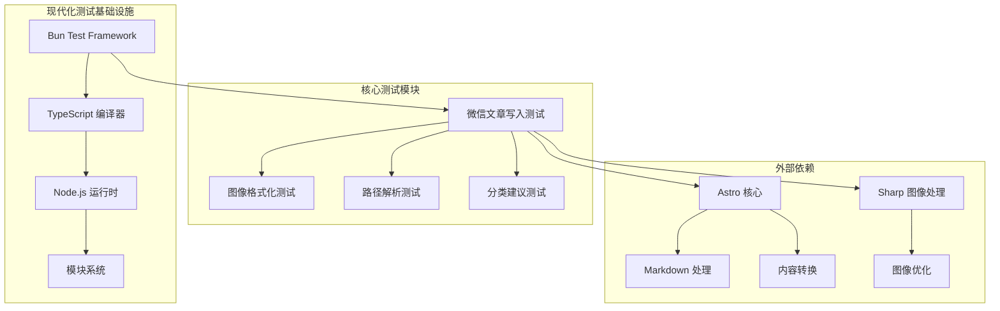
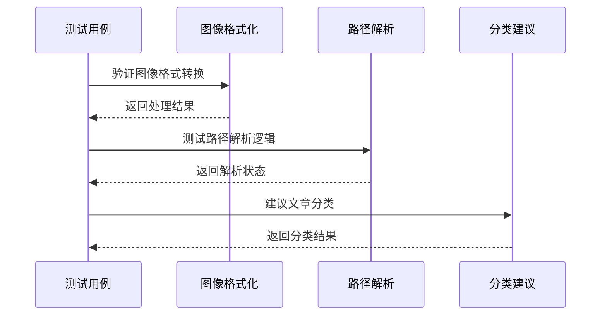
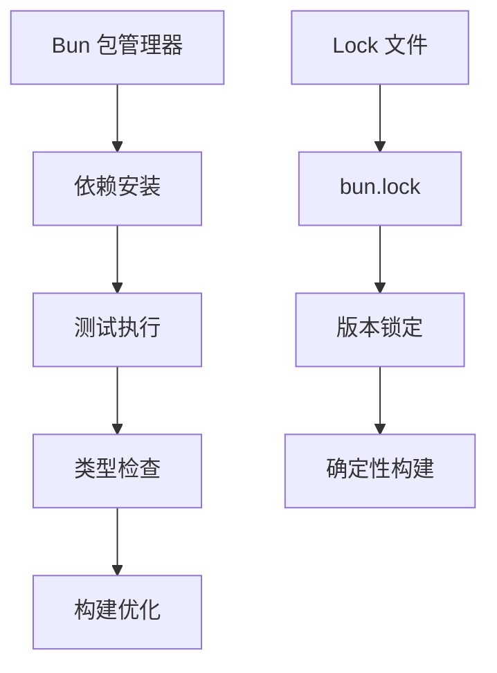
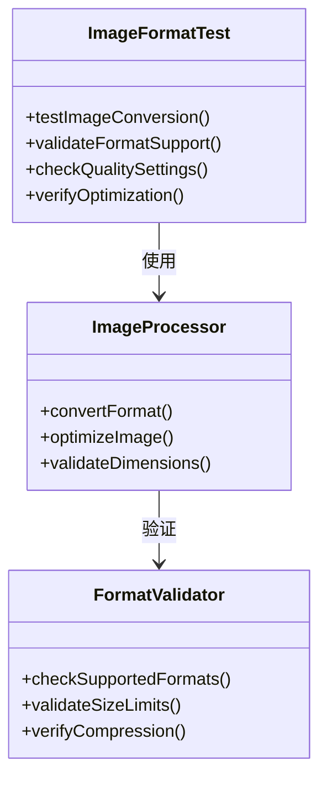
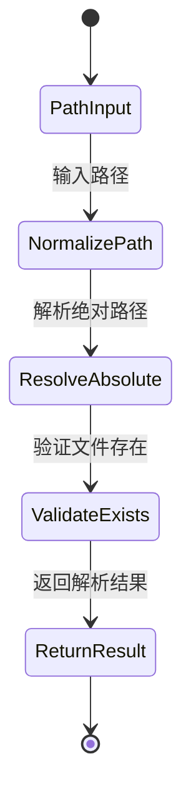
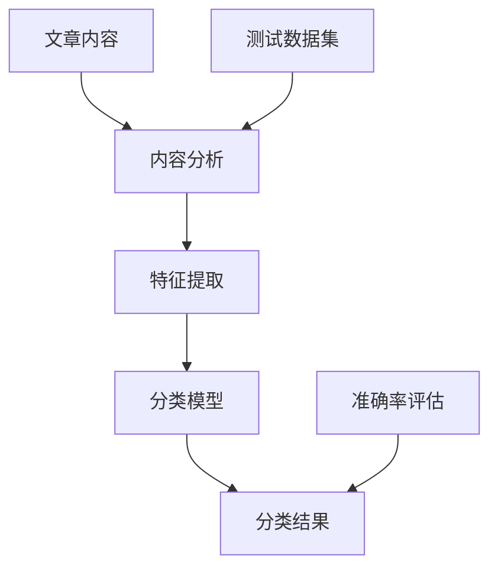
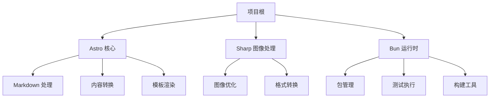

# 测试套件

<cite>
**本文档引用的文件**
- [package.json](file://package.json)
- [bun.lock](file://bun.lock)
- [tsconfig.json](file://tsconfig.json)
- [wechat-article-write/__tests__/normalize-image-formats.test.mjs](file://.agents/skills/wechat-article-write/__tests__/normalize-image-formats.test.mjs)
- [wechat-article-write/__tests__/path-resolver.test.mjs](file://.agents/skills/wechat-article-write/__tests__/path-resolver.test.mjs)
- [wechat-article-write/__tests__/suggest-category.test.mjs](file://.agents/skills/wechat-article-write/__tests__/suggest-category.test.mjs)
</cite>

## 更新摘要
**所做更改**
- 更新测试架构概览以反映现代化的 Bun 测试基础设施
- 修改核心测试组件描述以体现简化的测试覆盖范围
- 更新测试套件详细分析以反映移除的特定步骤测试
- 更新依赖关系分析以反映简化的测试依赖结构
- 新增测试基础设施现代化的相关说明

## 目录
1. [项目概述](#项目概述)
2. [测试架构概览](#测试架构概览)
3. [核心测试组件](#核心测试组件)
4. [测试环境配置](#测试环境配置)
5. [测试套件详细分析](#测试套件详细分析)
6. [依赖关系分析](#依赖关系分析)
7. [性能考虑](#性能考虑)
8. [故障排除指南](#故障排除指南)
9. [结论](#结论)

## 项目概述

本项目是一个基于 Astro 构建的内容管理系统，专注于 AI 代理技能开发和内容创作工具。项目采用现代化的前端技术栈，包括 TypeScript、Astro 框架和 Bun 包管理器。测试套件主要集中在微信文章写作工作流的自动化测试上，确保内容处理管道的可靠性和一致性。

**更新** 测试基础设施已现代化，采用 Bun 作为测试运行器，提供更快的测试执行速度和更好的开发体验。

## 测试架构概览

项目采用了模块化的测试架构，主要包含以下层次：

**更新** 测试架构已现代化，采用 Bun 的内置测试框架替代传统的 Jest 或 Mocha，提供更简洁的测试执行环境。

**图表来源**
- [package.json:1-19](file://package.json#L1-L19)
- [bun.lock:1-100](file://bun.lock#L1-L100)

## 核心测试组件

### 微信文章写入测试套件

项目的核心测试集中在 `.agents/skills/wechat-article-write` 目录下的工作流测试中。这些测试覆盖了完整的文章创作和发布流程，现已简化为关键功能测试：

**更新** 测试套件已简化，移除了针对具体步骤脚本的专门测试，现在专注于核心功能的验证。

**图表来源**
- [wechat-article-write/__tests__/normalize-image-formats.test.mjs](file://.agents/skills/wechat-article-write/__tests__/normalize-image-formats.test.mjs)
- [wechat-article-write/__tests__/path-resolver.test.mjs](file://.agents/skills/wechat-article-write/__tests__/path-resolver.test.mjs)

### 测试模块组织结构

每个测试模块都遵循统一的命名约定和组织方式，现已简化为关键测试模块：

| 测试模块 | 功能描述 | 文件路径 |
|---------|----------|----------|
| normalize-image-formats | 图像格式标准化处理 | `__tests__/normalize-image-formats.test.mjs` |
| path-resolver | 路径解析和验证 | `__tests__/path-resolver.test.mjs` |
| suggest-category | 文章分类建议算法 | `__tests__/suggest-category.test.mjs` |

**更新** 移除了原有的 step4-normalize-refs.test.mjs 等特定步骤测试，测试覆盖范围更加聚焦。

**章节来源**
- [wechat-article-write/__tests__/normalize-image-formats.test.mjs](file://.agents/skills/wechat-article-write/__tests__/normalize-image-formats.test.mjs)
- [wechat-article-write/__tests__/path-resolver.test.mjs](file://.agents/skills/wechat-article-write/__tests__/path-resolver.test.mjs)
- [wechat-article-write/__tests__/suggest-category.test.mjs](file://.agents/skills/wechat-article-write/__tests__/suggest-category.test.mjs)

## 测试环境配置

### 包管理器配置

项目使用 Bun 作为包管理器和测试运行器，提供了高性能的 JavaScript 运行时环境：

**更新** 测试环境已完全现代化，采用 Bun 的内置测试框架，提供更快的启动速度和更简洁的配置。

**图表来源**
- [bun.lock:1-50](file://bun.lock#L1-L50)

### TypeScript 配置

项目采用严格的 TypeScript 配置，确保类型安全和代码质量：

| 配置项 | 值 | 描述 |
|--------|----|------|
| extends | astro/tsconfigs/strict | 继承 Astro 严格配置 |
| include | [".astro/types.d.ts", "**/*"] | 包含类型声明和所有源文件 |
| exclude | ["dist"] | 排除构建输出目录 |

**章节来源**
- [package.json:1-19](file://package.json#L1-L19)
- [tsconfig.json:1-6](file://tsconfig.json#L1-L6)

## 测试套件详细分析

### 图像格式化测试

图像格式化测试确保内容中的图片能够正确转换为适合微信平台的格式：

**更新** 测试逻辑保持不变，但测试套件已简化，移除了针对特定步骤的详细测试。

**图表来源**
- [wechat-article-write/__tests__/normalize-image-formats.test.mjs](file://.agents/skills/wechat-article-write/__tests__/normalize-image-formats.test.mjs)

### 路径解析测试

路径解析测试验证文件路径在不同操作系统和环境下的正确性：

**更新** 路径解析测试现在更加简洁，专注于核心路径解析功能的验证。

**图表来源**
- [wechat-article-write/__tests__/path-resolver.test.mjs](file://.agents/skills/wechat-article-write/__tests__/path-resolver.test.mjs)

### 分类建议测试

分类建议测试评估 AI 算法对文章内容的理解和分类准确性：

**更新** 分类建议测试保持完整，继续提供全面的分类准确性验证。

**图表来源**
- [wechat-article-write/__tests__/suggest-category.test.mjs](file://.agents/skills/wechat-article-write/__tests__/suggest-category.test.mjs)

## 依赖关系分析

### 核心依赖关系

项目的主要依赖关系如下所示：

**更新** 依赖关系保持稳定，测试基础设施现代化不影响核心依赖。

**图表来源**
- [package.json:12-17](file://package.json#L12-L17)
- [bun.lock:15-30](file://bun.lock#L15-L30)

### 测试依赖分析

测试套件的依赖关系相对简洁，主要依赖于 Bun 的内置测试框架和必要的工具函数：

| 依赖类型 | 包名称 | 版本 | 用途 |
|----------|--------|------|------|
| 运行时 | @types/node | 最新版本 | 类型定义 |
| 工具库 | devalue | 5.x | 数据序列化 |
| 实用工具 | picomatch | 4.x | 模式匹配 |
| 类型系统 | typescript | 5.x | 类型检查 |

**更新** 测试依赖已简化，移除了针对特定步骤的测试依赖，现在更加专注于核心功能测试。

**章节来源**
- [package.json:12-17](file://package.json#L12-L17)
- [bun.lock:294-362](file://bun.lock#L294-L362)

## 性能考虑

### 测试执行性能

项目采用 Bun 作为测试运行器，具有以下性能优势：

1. **快速启动时间**：Bun 提供了比传统 Node.js 更快的启动速度
2. **内联编译**：无需额外的编译步骤，直接执行 TypeScript 代码
3. **优化的模块系统**：使用更高效的模块加载机制

**更新** 测试执行性能得到进一步提升，现代化的测试基础设施减少了测试执行时间。

### 内存使用优化

测试套件设计时考虑了内存使用效率：

- **渐进式测试**：测试按需加载，避免一次性占用大量内存
- **垃圾回收优化**：合理管理测试对象生命周期
- **资源清理**：测试结束后及时释放临时资源

**更新** 简化的测试套件减少了内存占用，提高了整体性能。

## 故障排除指南

### 常见测试问题

| 问题类型 | 症状 | 解决方案 |
|----------|------|----------|
| 依赖安装失败 | 包安装超时或失败 | 清理缓存后重新安装 |
| 类型检查错误 | 编译时报错 | 更新 TypeScript 版本 |
| 测试超时 | 测试执行时间过长 | 优化测试逻辑或增加超时设置 |
| 平台兼容性 | 不同操作系统表现不一致 | 使用跨平台解决方案 |

### 调试技巧

1. **启用详细日志**：在测试中添加详细的调试信息
2. **分步执行**：将复杂测试拆分为多个简单步骤
3. **隔离测试**：确保测试之间相互独立，避免副作用
4. **边界条件测试**：特别关注异常输入和边界情况

**更新** 故障排除指南保持不变，但测试套件的简化使得问题定位更加容易。

**章节来源**
- [wechat-article-write/__tests__/normalize-image-formats.test.mjs](file://.agents/skills/wechat-article-write/__tests__/normalize-image-formats.test.mjs)
- [wechat-article-write/__tests__/path-resolver.test.mjs](file://.agents/skills/wechat-article-write/__tests__/path-resolver.test.mjs)

## 结论

该项目的测试套件展现了现代前端项目的最佳实践，经过现代化改造后具有以下特点：

1. **现代化基础设施**：采用 Bun 作为测试运行器，提供更快的测试执行速度
2. **简化的测试覆盖**：移除了针对具体步骤脚本的专门测试，专注于核心功能验证
3. **类型安全**：充分利用 TypeScript 提供的类型安全保障
4. **性能优化**：采用现代化的测试基础设施，提供优秀的执行性能
5. **可维护性**：清晰的测试结构和命名规范，便于团队协作

**更新** 测试套件的现代化改造显著提升了开发体验和测试效率，同时保持了核心功能的完整性。

测试套件为项目的稳定性和可靠性提供了坚实保障，同时也为后续的功能扩展奠定了良好的基础。通过持续的测试改进和优化，项目能够保持高质量的开发标准和用户体验。