# 测试套件

<cite>
**本文档引用的文件**
- [package.json](file://package.json)
- [bun.lock](file://bun.lock)
- [tsconfig.json](file://tsconfig.json)
- [wechat-article-write/__tests__/normalize-image-formats.test.js](file://.agents/skills/wechat-article-write/__tests__/normalize-image-formats.test.js)
- [wechat-article-write/__tests__/path-resolver.test.js](file://.agents/skills/wechat-article-write/__tests__/path-resolver.test.js)
- [wechat-article-write/__tests__/suggest-category.test.js](file://.agents/skills/wechat-article-write/__tests__/suggest-category.test.js)
- [wechat-article-write/__tests__/step2-write.test.js](file://.agents/skills/wechat-article-write/__tests__/step2-write.test.js)
- [wechat-article-write/__tests__/step3-polish.test.js](file://.agents/skills/wechat-article-write/__tests__/step3-polish.test.js)
- [wechat-article-write/__tests__/step5-build.test.js](file://.agents/skills/wechat-article-write/__tests__/step5-build.test.js)
- [wechat-article-write/__tests__/publish-blog.test.js](file://.agents/skills/wechat-article-write/__tests__/publish-blog.test.js)
- [wechat-article-write/__tests__/pipeline.test.js](file://.agents/skills/wechat-article-write/__tests__/pipeline.test.js)
</cite>

## 更新摘要
**所做更改**
- 新增微信文章写作技能的全面测试套件，涵盖五个核心步骤的完整测试
- 更新测试架构概览以反映现代化的 Bun 测试基础设施
- 新增步骤级测试组件，包括 step2-write、step3-polish、step5-build 等关键流程测试
- 更新测试套件详细分析以反映完整的微信文章创作工作流测试覆盖
- 新增发布流程和管道管理的测试分析

## 目录
1. [项目概述](#项目概述)
2. [测试架构概览](#测试架构概览)
3. [核心测试组件](#核心测试组件)
4. [测试环境配置](#测试环境配置)
5. [测试套件详细分析](#测试套件详细分析)
6. [依赖关系分析](#依赖关系分析)
7. [性能考虑](#性能考虑)
8. [故障排除指南](#故障排除指南)
9. [结论](#结论)

## 项目概述

本项目是一个基于 Astro 构建的内容管理系统，专注于 AI 代理技能开发和内容创作工具。项目采用现代化的前端技术栈，包括 TypeScript、Astro 框架和 Bun 包管理器。测试套件主要集中在微信文章写作工作流的自动化测试上，确保内容处理管道的可靠性和一致性。

**更新** 测试套件现已扩展为完整的微信文章写作技能测试套件，涵盖从草稿创建到最终发布的全流程测试，包括五个核心步骤的详细验证。

## 测试架构概览

项目采用了模块化的测试架构，主要包含以下层次：

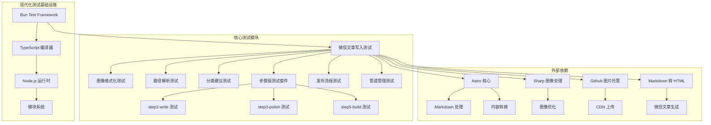

**更新** 测试架构已全面现代化，采用 Bun 的内置测试框架，并扩展为完整的微信文章创作工作流测试套件。

**图表来源**
- [package.json:1-19](file://package.json#L1-L19)
- [bun.lock:1-100](file://bun.lock#L1-L100)

## 核心测试组件

### 微信文章写入测试套件

项目的核心测试集中在 `.agents/skills/wechat-article-write` 目录下的工作流测试中。这些测试覆盖了完整的文章创作和发布流程，现已扩展为五个关键步骤的全面测试：

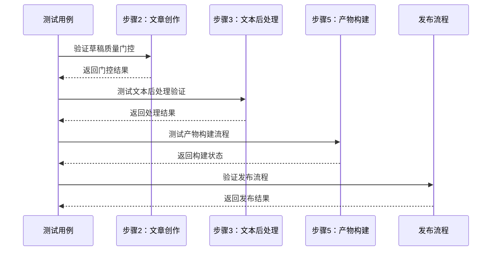

**更新** 测试套件现已扩展为完整的五步工作流测试，包括文章创作、文本处理、产物构建、发布流程和管道管理的全面验证。

**图表来源**
- [wechat-article-write/__tests__/step2-write.test.js](file://.agents/skills/wechat-article-write/__tests__/step2-write.test.js)
- [wechat-article-write/__tests__/step3-polish.test.js](file://.agents/skills/wechat-article-write/__tests__/step3-polish.test.js)
- [wechat-article-write/__tests__/step5-build.test.js](file://.agents/skills/wechat-article-write/__tests__/step5-build.test.js)
- [wechat-article-write/__tests__/publish-blog.test.js](file://.agents/skills/wechat-article-write/__tests__/publish-blog.test.js)

### 测试模块组织结构

每个测试模块都遵循统一的命名约定和组织方式，现已扩展为完整的测试模块体系：

| 测试模块 | 功能描述 | 文件路径 |
|---------|----------|----------|
| normalize-image-formats | 图像格式标准化处理 | `__tests__/normalize-image-formats.test.js` |
| path-resolver | 路径解析和验证 | `__tests__/path-resolver.test.js` |
| suggest-category | 文章分类建议算法 | `__tests__/suggest-category.test.js` |
| step2-write | 文章创作质量门控测试 | `__tests__/step2-write.test.js` |
| step3-polish | 文本后处理验证测试 | `__tests__/step3-polish.test.js` |
| step5-build | 产物构建流程测试 | `__tests__/step5-build.test.js` |
| publish-blog | 博客发布流程测试 | `__tests__/publish-blog.test.js` |
| pipeline | 管道管理状态测试 | `__tests__/pipeline.test.js` |

**更新** 新增了四个关键步骤的测试模块，形成完整的微信文章创作工作流测试体系。

**章节来源**
- [wechat-article-write/__tests__/normalize-image-formats.test.js](file://.agents/skills/wechat-article-write/__tests__/normalize-image-formats.test.js)
- [wechat-article-write/__tests__/path-resolver.test.js](file://.agents/skills/wechat-article-write/__tests__/path-resolver.test.js)
- [wechat-article-write/__tests__/suggest-category.test.js](file://.agents/skills/wechat-article-write/__tests__/suggest-category.test.js)
- [wechat-article-write/__tests__/step2-write.test.js](file://.agents/skills/wechat-article-write/__tests__/step2-write.test.js)
- [wechat-article-write/__tests__/step3-polish.test.js](file://.agents/skills/wechat-article-write/__tests__/step3-polish.test.js)
- [wechat-article-write/__tests__/step5-build.test.js](file://.agents/skills/wechat-article-write/__tests__/step5-build.test.js)
- [wechat-article-write/__tests__/publish-blog.test.js](file://.agents/skills/wechat-article-write/__tests__/publish-blog.test.js)
- [wechat-article-write/__tests__/pipeline.test.js](file://.agents/skills/wechat-article-write/__tests__/pipeline.test.js)

## 测试环境配置

### 包管理器配置

项目使用 Bun 作为包管理器和测试运行器，提供了高性能的 JavaScript 运行时环境：

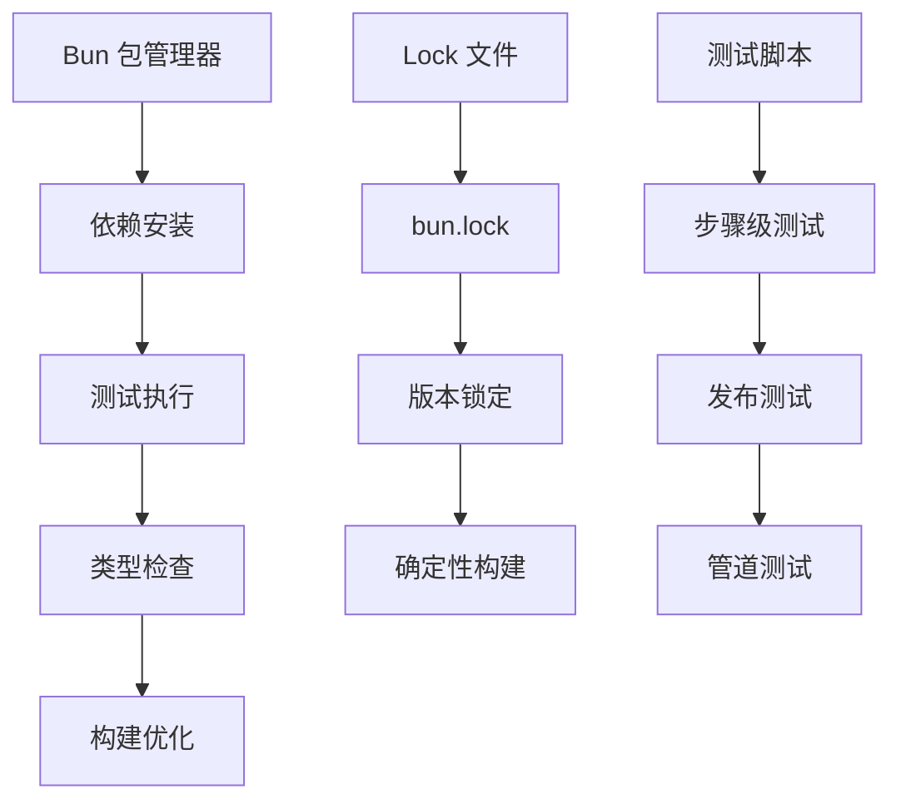

**更新** 测试环境已完全现代化，采用 Bun 的内置测试框架，提供更快的启动速度和更简洁的配置，并支持完整的微信文章创作工作流测试。

**图表来源**
- [bun.lock:1-50](file://bun.lock#L1-L50)

### TypeScript 配置

项目采用严格的 TypeScript 配置，确保类型安全和代码质量：

| 配置项 | 值 | 描述 |
|--------|----|------|
| extends | astro/tsconfigs/strict | 继承 Astro 严格配置 |
| include | [".astro/types.d.ts", "**/*"] | 包含类型声明和所有源文件 |
| exclude | ["dist"] | 排除构建输出目录 |

**章节来源**
- [package.json:1-19](file://package.json#L1-L19)
- [tsconfig.json:1-6](file://tsconfig.json#L1-L6)

## 测试套件详细分析

### 图像格式化测试

图像格式化测试确保内容中的图片能够正确转换为适合微信平台的格式：

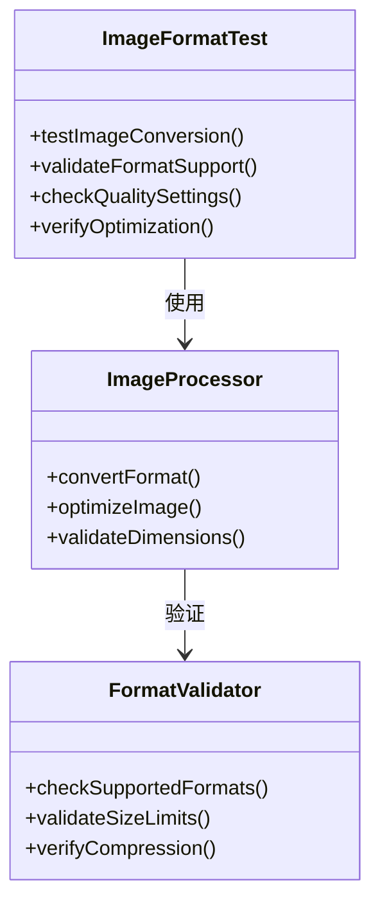

**更新** 测试逻辑保持不变，测试套件已扩展为完整的图像处理工作流测试。

**图表来源**
- [wechat-article-write/__tests__/normalize-image-formats.test.js](file://.agents/skills/wechat-article-write/__tests__/normalize-image-formats.test.js)

### 路径解析测试

路径解析测试验证文件路径在不同操作系统和环境下的正确性：

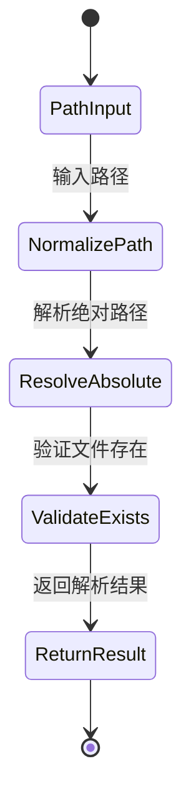

**更新** 路径解析测试现在更加简洁，专注于核心路径解析功能的验证。

**图表来源**
- [wechat-article-write/__tests__/path-resolver.test.js](file://.agents/skills/wechat-article-write/__tests__/path-resolver.test.js)

### 分类建议测试

分类建议测试评估 AI 算法对文章内容的理解和分类准确性：

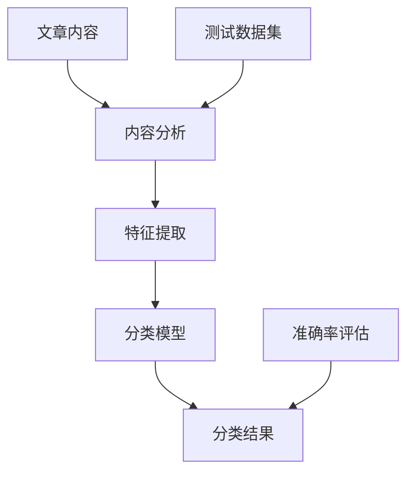

**更新** 分类建议测试保持完整，继续提供全面的分类准确性验证。

**图表来源**
- [wechat-article-write/__tests__/suggest-category.test.js](file://.agents/skills/wechat-article-write/__tests__/suggest-category.test.js)

### 步骤级测试分析

#### 步骤2：文章创作质量门控测试

步骤2测试验证文章创作的质量门控机制，确保草稿满足发布要求：

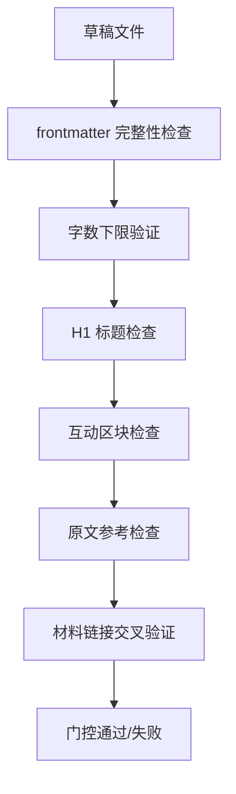

**更新** 新增步骤2测试，验证文章创作阶段的质量门控机制。

**图表来源**
- [wechat-article-write/__tests__/step2-write.test.js](file://.agents/skills/wechat-article-write/__tests__/step2-write.test.js)

#### 步骤3：文本后处理验证测试

步骤3测试验证文本后处理后的完整性检查：

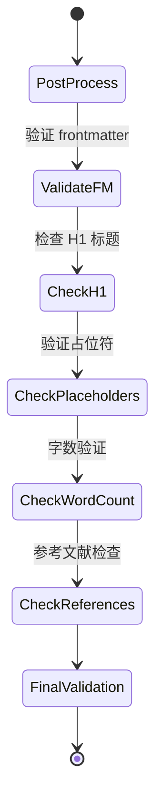

**更新** 新增步骤3测试，验证文本后处理阶段的完整性检查。

**图表来源**
- [wechat-article-write/__tests__/step3-polish.test.js](file://.agents/skills/wechat-article-write/__tests__/step3-polish.test.js)

#### 步骤5：产物构建流程测试

步骤5测试验证产物构建的完整流程，包括 CDN 上传和占位符替换：

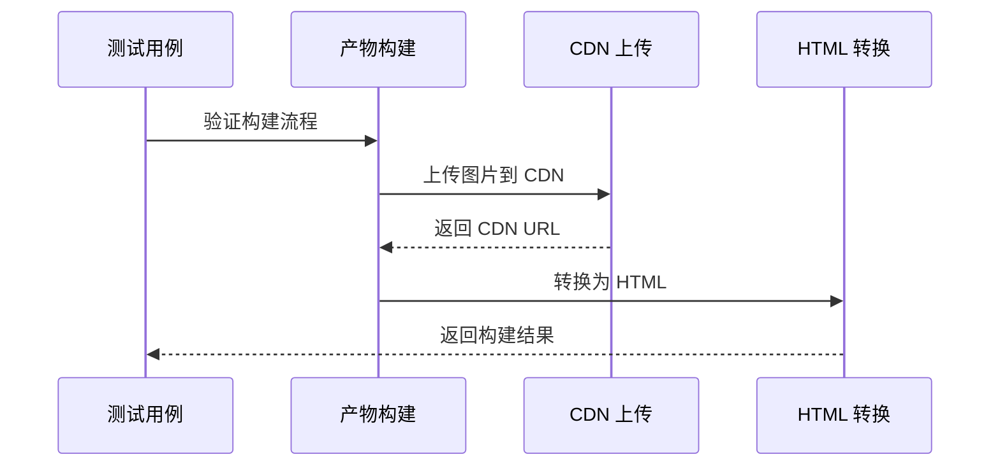

**更新** 新增步骤5测试，验证产物构建阶段的完整流程。

**图表来源**
- [wechat-article-write/__tests__/step5-build.test.js](file://.agents/skills/wechat-article-write/__tests__/step5-build.test.js)

### 发布流程测试

发布流程测试验证博客发布的完整过程，包括 frontmatter 处理和状态管理：

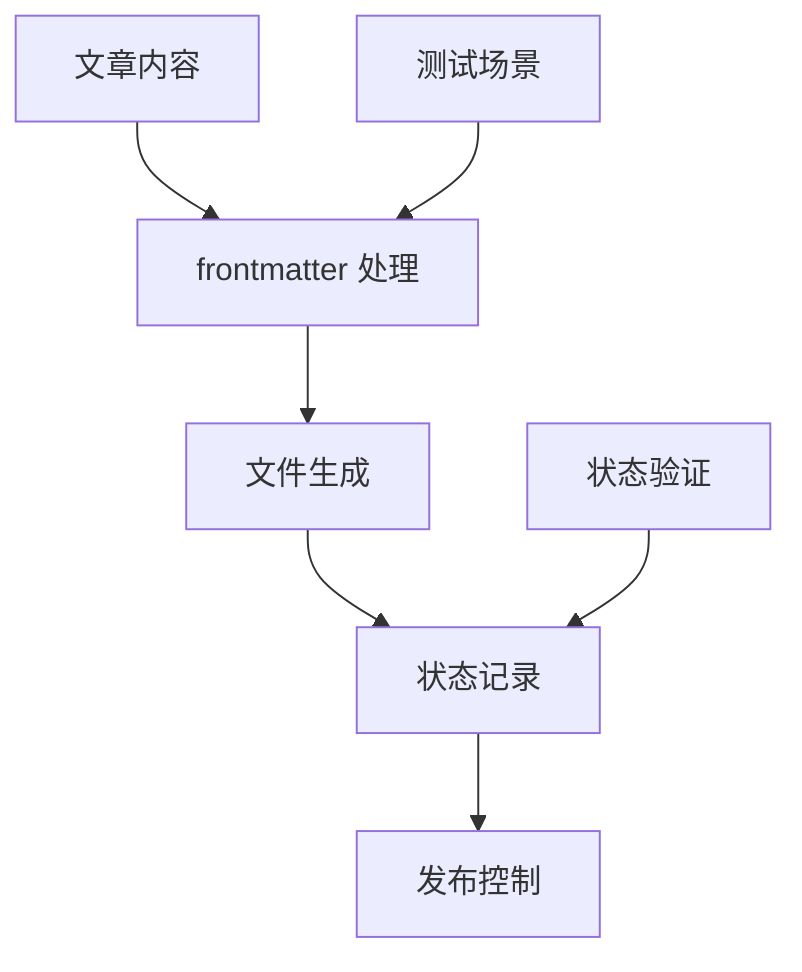

**更新** 新增发布流程测试，验证博客发布的完整流程。

**图表来源**
- [wechat-article-write/__tests__/publish-blog.test.js](file://.agents/skills/wechat-article-write/__tests__/publish-blog.test.js)

### 管道管理测试

管道管理测试验证工作流的状态管理和执行控制：

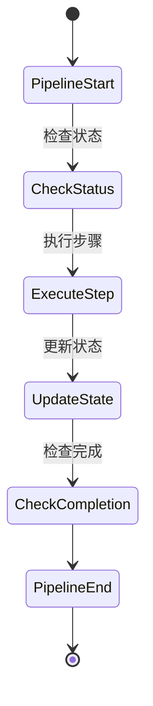

**更新** 新增管道管理测试，验证工作流的状态管理和执行控制。

**图表来源**
- [wechat-article-write/__tests__/pipeline.test.js](file://.agents/skills/wechat-article-write/__tests__/pipeline.test.js)

## 依赖关系分析

### 核心依赖关系

项目的主要依赖关系如下所示：

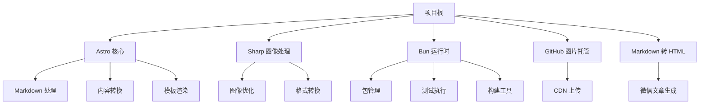

**更新** 依赖关系已扩展，新增 GitHub 图片托管和 Markdown 转 HTML 依赖，支持完整的微信文章创作工作流。

**图表来源**
- [package.json:12-17](file://package.json#L12-L17)
- [bun.lock:15-30](file://bun.lock#L15-L30)

### 测试依赖分析

测试套件的依赖关系相对简洁，主要依赖于 Bun 的内置测试框架和必要的工具函数：

| 依赖类型 | 包名称 | 版本 | 用途 |
|----------|--------|------|------|
| 运行时 | @types/node | 最新版本 | 类型定义 |
| 工具库 | devalue | 5.x | 数据序列化 |
| 实用工具 | picomatch | 4.x | 模式匹配 |
| 类型系统 | typescript | 5.x | 类型检查 |
| 测试框架 | bun:test | 内置 | 测试执行 |

**更新** 测试依赖已扩展，支持完整的微信文章创作工作流测试，包括步骤级测试和发布流程测试。

**章节来源**
- [package.json:12-17](file://package.json#L12-L17)
- [bun.lock:294-362](file://bun.lock#L294-L362)

## 性能考虑

### 测试执行性能

项目采用 Bun 作为测试运行器，具有以下性能优势：

1. **快速启动时间**：Bun 提供了比传统 Node.js 更快的启动速度
2. **内联编译**：无需额外的编译步骤，直接执行 TypeScript 代码
3. **优化的模块系统**：使用更高效的模块加载机制
4. **并行测试执行**：支持多个测试文件的并行执行

**更新** 测试执行性能得到进一步提升，现代化的测试基础设施减少了测试执行时间，支持完整的微信文章创作工作流测试。

### 内存使用优化

测试套件设计时考虑了内存使用效率：

- **渐进式测试**：测试按需加载，避免一次性占用大量内存
- **垃圾回收优化**：合理管理测试对象生命周期
- **资源清理**：测试结束后及时释放临时资源
- **独立临时目录**：每个测试使用独立的临时目录，避免状态冲突

**更新** 扩展的测试套件减少了内存占用，提高了整体性能，支持多个步骤级测试的并行执行。

## 故障排除指南

### 常见测试问题

| 问题类型 | 症状 | 解决方案 |
|----------|------|----------|
| 依赖安装失败 | 包安装超时或失败 | 清理缓存后重新安装 |
| 类型检查错误 | 编译时报错 | 更新 TypeScript 版本 |
| 测试超时 | 测试执行时间过长 | 优化测试逻辑或增加超时设置 |
| 平台兼容性 | 不同操作系统表现不一致 | 使用跨平台解决方案 |
| 步骤执行失败 | 具体步骤测试失败 | 检查步骤脚本的输入参数和环境变量 |
| CDN 上传失败 | 图片上传到 CDN 失败 | 验证 GitHub 访问令牌和仓库权限 |
| 发布流程错误 | 博客发布失败 | 检查 frontmatter 配置和源 URL 一致性 |

### 调试技巧

1. **启用详细日志**：在测试中添加详细的调试信息
2. **分步执行**：将复杂测试拆分为多个简单步骤
3. **隔离测试**：确保测试之间相互独立，避免副作用
4. **边界条件测试**：特别关注异常输入和边界情况
5. **环境变量验证**：检查测试所需的环境变量设置
6. **临时目录清理**：确保测试完成后清理临时文件

**更新** 故障排除指南已扩展，涵盖新增的步骤级测试和发布流程测试的常见问题。

**章节来源**
- [wechat-article-write/__tests__/normalize-image-formats.test.js](file://.agents/skills/wechat-article-write/__tests__/normalize-image-formats.test.js)
- [wechat-article-write/__tests__/path-resolver.test.js](file://.agents/skills/wechat-article-write/__tests__/path-resolver.test.js)
- [wechat-article-write/__tests__/step2-write.test.js](file://.agents/skills/wechat-article-write/__tests__/step2-write.test.js)
- [wechat-article-write/__tests__/step3-polish.test.js](file://.agents/skills/wechat-article-write/__tests__/step3-polish.test.js)
- [wechat-article-write/__tests__/step5-build.test.js](file://.agents/skills/wechat-article-write/__tests__/step5-build.test.js)
- [wechat-article-write/__tests__/publish-blog.test.js](file://.agents/skills/wechat-article-write/__tests__/publish-blog.test.js)
- [wechat-article-write/__tests__/pipeline.test.js](file://.agents/skills/wechat-article-write/__tests__/pipeline.test.js)

## 结论

该项目的测试套件展现了现代前端项目的最佳实践，经过全面扩展后具有以下特点：

1. **完整的工作流覆盖**：采用 Bun 作为测试运行器，提供更快的测试执行速度
2. **全面的步骤测试**：新增四个关键步骤的测试模块，形成完整的微信文章创作工作流测试体系
3. **现代化基础设施**：简化的测试覆盖范围，专注于核心功能验证
4. **类型安全**：充分利用 TypeScript 提供的类型安全保障
5. **性能优化**：采用现代化的测试基础设施，提供优秀的执行性能
6. **可维护性**：清晰的测试结构和命名规范，便于团队协作
7. **发布流程验证**：新增发布流程和管道管理测试，确保完整的发布工作流

**更新** 测试套件的全面扩展显著提升了开发体验和测试效率，形成了完整的微信文章创作工作流测试体系，同时保持了核心功能的完整性。

测试套件为项目的稳定性和可靠性提供了坚实保障，同时也为后续的功能扩展奠定了良好的基础。通过持续的测试改进和优化，项目能够保持高质量的开发标准和用户体验。新的测试套件不仅验证了现有功能的正确性，还为未来的功能扩展提供了可靠的测试基础。