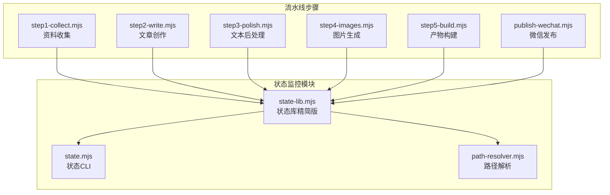
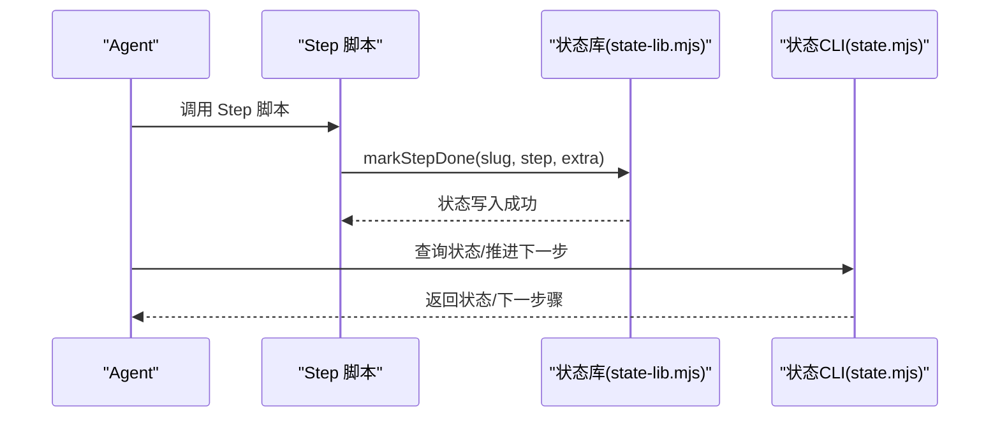
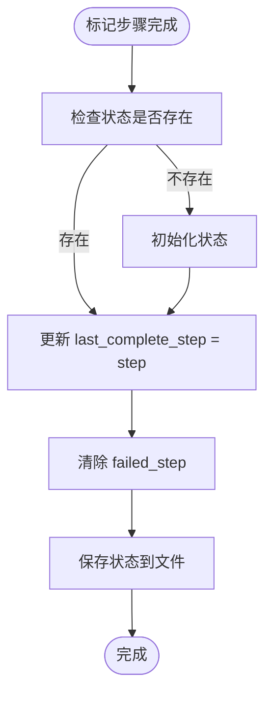
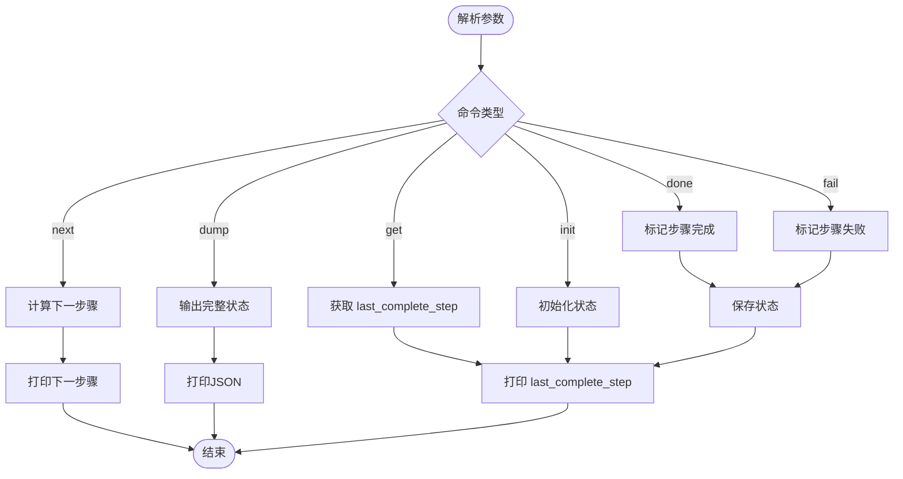
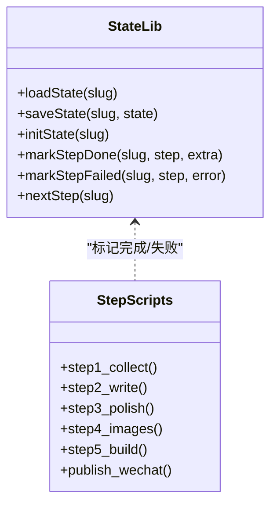
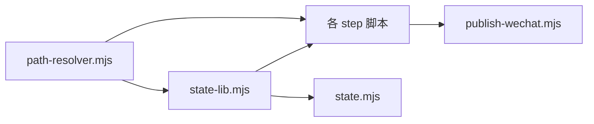

# 状态监控

<cite>
**本文档引用的文件**
- [README.md](file://README.md)
- [package.json](file://package.json)
- [state-lib.mjs](file://.agents/skills/wechat-article-write/scripts/state-lib.mjs)
- [state.mjs](file://.agents/skills/wechat-article-write/scripts/state.mjs)
- [path-resolver.mjs](file://.agents/skills/wechat-article-write/scripts/path-resolver.mjs)
- [publish-wechat.mjs](file://.agents/skills/wechat-article-write/scripts/publish-wechat.mjs)
- [step1-collect.mjs](file://.agents/skills/wechat-article-write/scripts/step1-collect.mjs)
- [step2-write.mjs](file://.agents/skills/wechat-article-write/scripts/step2-write.mjs)
- [step3-polish.mjs](file://.agents/skills/wechat-article-write/scripts/step3-polish.mjs)
- [step4-images.mjs](file://.agents/skills/wechat-article-write/scripts/step4-images.mjs)
- [step5-build.mjs](file://.agents/skills/wechat-article-write/scripts/step5-build.mjs)
- [SKILL.md](file://.agents/skills/wechat-article-write/SKILL.md)
</cite>

## 更新摘要
**变更内容**
- 状态管理系统从复杂的6状态×15步状态机简化为简单的last_complete_step计数器
- 移除了详细的步骤完成状态跟踪，采用更简洁的状态管理模式
- 更新了状态库、CLI工具和所有步骤脚本以适配新的状态管理方法
- 保持了完整的可观测性和断点续跑能力

## 目录
1. [简介](#简介)
2. [项目结构](#项目结构)
3. [核心组件](#核心组件)
4. [架构总览](#架构总览)
5. [详细组件分析](#详细组件分析)
6. [依赖关系分析](#依赖关系分析)
7. [性能考量](#性能考量)
8. [故障排查指南](#故障排查指南)
9. [结论](#结论)

## 简介
本项目采用端到端的自动化流水线生成微信公众号文章，配套实现了简化的"状态监控"机制，用于跟踪每个步骤的执行状态、异常与进度。状态监控通过统一的状态文件与命令行工具实现，支持实时观察与断点续跑，确保复杂流水线的可观测性与可维护性。

**更新** 状态管理系统已从复杂的6状态×15步状态机简化为基于last_complete_step计数器的简单模式，移除了详细的步骤完成状态跟踪，提升了系统的简洁性和可维护性。

## 项目结构
- 状态监控核心位于 wechat-article-write 技能的 scripts 目录，包含状态库、CLI 工具与实时监控脚本。
- 每个 Step 脚本在执行前后通过状态库写入状态，形成可查询、可追踪的流水线状态。
- 状态文件采用 JSON 格式，按日期 slug 组织，便于并行与并发场景下的状态管理。

**图表来源**
- [state-lib.mjs:1-63](file://.agents/skills/wechat-article-write/scripts/state-lib.mjs#L1-L63)
- [state.mjs:1-61](file://.agents/skills/wechat-article-write/scripts/state.mjs#L1-L61)
- [path-resolver.mjs:1-25](file://.agents/skills/wechat-article-write/scripts/path-resolver.mjs#L1-L25)
- [step1-collect.mjs:1-44](file://.agents/skills/wechat-article-write/scripts/step1-collect.mjs#L1-L44)
- [step2-write.mjs:1-86](file://.agents/skills/wechat-article-write/scripts/step2-write.mjs#L1-L86)
- [step3-polish.mjs:1-34](file://.agents/skills/wechat-article-write/scripts/step3-polish.mjs#L1-L34)
- [step4-images.mjs:1-81](file://.agents/skills/wechat-article-write/scripts/step4-images.mjs#L1-L81)
- [step5-build.mjs:1-156](file://.agents/skills/wechat-article-write/scripts/step5-build.mjs#L1-L156)
- [publish-wechat.mjs:1-147](file://.agents/skills/wechat-article-write/scripts/publish-wechat.mjs#L1-L147)

**章节来源**
- [README.md:1-99](file://README.md#L1-L99)
- [package.json:1-19](file://package.json#L1-L19)

## 核心组件
- 状态库（state-lib.mjs）
  - 定义简化的状态结构：{ slug, started_at, last_complete_step: number, failed_step: { step, error } | null }
  - last_complete_step: 0 表示尚未开始，1-6 表示已完成的步骤
  - 提供初始化、标记完成、标记失败和计算下一步的函数
- 状态 CLI（state.mjs）
  - 提供 init/get/next/done/fail/dump 等子命令，封装状态库逻辑
  - next 命令返回 last_complete_step + 1
- 路径解析（path-resolver.mjs）
  - 统一解析仓库根目录、posts 目录与状态文件路径
- 流水线步骤（各 step*.mjs）
  - 每个步骤在完成后调用 markStepDone(slug, step, extra)，形成完整的执行轨迹
- 发布脚本（publish-wechat.mjs）
  - 在关键节点调用 markStepDone，确保发布过程的可观测性

**更新** 状态库已简化为只包含last_complete_step计数器，移除了复杂的步骤状态跟踪，提升了系统的简洁性。

**章节来源**
- [state-lib.mjs:1-63](file://.agents/skills/wechat-article-write/scripts/state-lib.mjs#L1-L63)
- [state.mjs:1-61](file://.agents/skills/wechat-article-write/scripts/state.mjs#L1-L61)
- [path-resolver.mjs:1-25](file://.agents/skills/wechat-article-write/scripts/path-resolver.mjs#L1-L25)
- [publish-wechat.mjs:1-147](file://.agents/skills/wechat-article-write/scripts/publish-wechat.mjs#L1-L147)

## 架构总览
状态监控贯穿整个流水线生命周期：从资料收集、文章创作、文本后处理、图片生成、产物构建，再到最终发布。每个步骤通过状态库标记完成，CLI 提供查询与观察能力。

**图表来源**
- [state-lib.mjs:39-63](file://.agents/skills/wechat-article-write/scripts/state-lib.mjs#L39-L63)
- [state.mjs:1-61](file://.agents/skills/wechat-article-write/scripts/state.mjs#L1-L61)
- [step1-collect.mjs:43](file://.agents/skills/wechat-article-write/scripts/step1-collect.mjs#L43)
- [step2-write.mjs:85](file://.agents/skills/wechat-article-write/scripts/step2-write.mjs#L85)
- [step3-polish.mjs:33](file://.agents/skills/wechat-article-write/scripts/step3-polish.mjs#L33)
- [step4-images.mjs:80](file://.agents/skills/wechat-article-write/scripts/step4-images.mjs#L80)
- [step5-build.mjs:155](file://.agents/skills/wechat-article-write/scripts/step5-build.mjs#L155)
- [publish-wechat.mjs:145](file://.agents/skills/wechat-article-write/scripts/publish-wechat.mjs#L145)

## 详细组件分析

### 状态库（state-lib.mjs）
- 设计要点
  - 简化的状态结构：只包含 last_complete_step 和 failed_step 信息
  - 初始化逻辑避免重复创建，保存时自动创建目录
  - 提供标记完成和标记失败的便捷函数，保证状态写入的合法性
- 关键行为
  - 加载状态：读取 JSON，不存在返回 null
  - 保存状态：确保父目录存在，原子写入
  - 初始化状态：首次写入时创建基础结构，last_complete_step = 0
  - 标记完成：更新 last_complete_step 为当前步骤，清除 failed_step
  - 标记失败：记录失败步骤和错误信息
  - 计算下一步：返回 Math.min(last_complete_step + 1, 6)

**更新** 状态库已简化为只包含last_complete_step计数器，移除了复杂的步骤状态跟踪逻辑。

**图表来源**
- [state-lib.mjs:39-63](file://.agents/skills/wechat-article-write/scripts/state-lib.mjs#L39-L63)

**章节来源**
- [state-lib.mjs:1-63](file://.agents/skills/wechat-article-write/scripts/state-lib.mjs#L1-L63)

### 状态 CLI（state.mjs）
- 设计要点
  - 子命令封装：init/get/next/done/fail/dump，参数解析与输出格式化
  - 校验逻辑：确保步骤在 1-6 范围内
  - 下一步计算：next 返回 last_complete_step + 1
- 使用场景
  - 断点续跑：通过 next 获取下一步骤
  - 状态诊断：dump 输出完整状态

**图表来源**
- [state.mjs:1-61](file://.agents/skills/wechat-article-write/scripts/state.mjs#L1-L61)

**章节来源**
- [state.mjs:1-61](file://.agents/skills/wechat-article-write/scripts/state.mjs#L1-L61)

### 路径解析（path-resolver.mjs）
- 设计要点
  - 统一仓库根目录与 posts 目录解析，支持多种输入形式
  - 提供状态文件路径解析能力
- 价值
  - 保证状态文件路径稳定，避免因路径问题导致的状态读写失败

**章节来源**
- [path-resolver.mjs:1-25](file://.agents/skills/wechat-article-write/scripts/path-resolver.mjs#L1-L25)

### 流水线步骤与状态写入
- 资料收集（step1-collect.mjs）
  - 验证 materials.md 存在且非空，低质量检测（字数 < 200 打印警告，非阻塞）
  - 调用 markStepDone(slug, 1, info) 标记步骤完成
- 文章创作（step2-write.mjs）
  - 校验 draft.md 字数 ≥ 2500、frontmatter 完整、格式规范
  - 调用 markStepDone(slug, 2, info) 或 markStepFailed 标记结果
- 文本后处理（step3-polish.mjs）
  - 验证 draft.md 经过处理后存在且非空
  - 调用 markStepDone(slug, 3, info) 或 markStepFailed 标记结果
- 图片生成（step4-images.mjs）
  - 统一格式检测修正、封面扩展名更新、插图引用验证
  - 调用 markStepDone(slug, 4, info) 标记步骤完成
- 产物构建（step5-build.mjs）
  - 上传图片到 CDN、占位符替换、HTML 转换、验证
  - 调用 markStepDone(slug, 5, info) 或 markStepFailed 标记结果
- 发布（publish-wechat.mjs）
  - 读取 frontmatter、探活 sourceUrl、调用发布脚本
  - 调用 markStepDone(slug, 6, info) 标记发布完成

**更新** 所有步骤脚本都已更新为使用简化的状态管理方法，通过markStepDone函数标记步骤完成。

**图表来源**
- [state-lib.mjs:1-63](file://.agents/skills/wechat-article-write/scripts/state-lib.mjs#L1-L63)
- [step1-collect.mjs:43](file://.agents/skills/wechat-article-write/scripts/step1-collect.mjs#L43)
- [step2-write.mjs:85](file://.agents/skills/wechat-article-write/scripts/step2-write.mjs#L85)
- [step3-polish.mjs:33](file://.agents/skills/wechat-article-write/scripts/step3-polish.mjs#L33)
- [step4-images.mjs:80](file://.agents/skills/wechat-article-write/scripts/step4-images.mjs#L80)
- [step5-build.mjs:155](file://.agents/skills/wechat-article-write/scripts/step5-build.mjs#L155)
- [publish-wechat.mjs:145](file://.agents/skills/wechat-article-write/scripts/publish-wechat.mjs#L145)

**章节来源**
- [step1-collect.mjs:1-44](file://.agents/skills/wechat-article-write/scripts/step1-collect.mjs#L1-L44)
- [step2-write.mjs:1-86](file://.agents/skills/wechat-article-write/scripts/step2-write.mjs#L1-L86)
- [step3-polish.mjs:1-34](file://.agents/skills/wechat-article-write/scripts/step3-polish.mjs#L1-L34)
- [step4-images.mjs:1-81](file://.agents/skills/wechat-article-write/scripts/step4-images.mjs#L1-L81)
- [step5-build.mjs:1-156](file://.agents/skills/wechat-article-write/scripts/step5-build.mjs#L1-L156)
- [publish-wechat.mjs:1-147](file://.agents/skills/wechat-article-write/scripts/publish-wechat.mjs#L1-L147)

## 依赖关系分析
- 组件耦合
  - 所有步骤脚本依赖状态库进行状态写入，耦合度低、职责单一
  - CLI 仅依赖状态库暴露的接口，便于扩展与替换
- 外部依赖
  - 文件系统：状态文件读写
  - 子进程：图床上传、格式转换等外部脚本调用
- 潜在风险
  - 文件并发写入：多个步骤脚本同时访问状态文件，需注意原子写入
  - 路径解析：确保环境变量与目录权限正确

**图表来源**
- [state-lib.mjs:1-63](file://.agents/skills/wechat-article-write/scripts/state-lib.mjs#L1-L63)
- [state.mjs:1-61](file://.agents/skills/wechat-article-write/scripts/state.mjs#L1-L61)
- [path-resolver.mjs:1-25](file://.agents/skills/wechat-article-write/scripts/path-resolver.mjs#L1-L25)
- [publish-wechat.mjs:1-147](file://.agents/skills/wechat-article-write/scripts/publish-wechat.mjs#L1-L147)

**章节来源**
- [state-lib.mjs:1-63](file://.agents/skills/wechat-article-write/scripts/state-lib.mjs#L1-L63)
- [state.mjs:1-61](file://.agents/skills/wechat-article-write/scripts/state.mjs#L1-L61)
- [path-resolver.mjs:1-25](file://.agents/skills/wechat-article-write/scripts/path-resolver.mjs#L1-L25)
- [publish-wechat.mjs:1-147](file://.agents/skills/wechat-article-write/scripts/publish-wechat.mjs#L1-L147)

## 性能考量
- I/O 优化
  - 状态写入采用原子写入，减少竞态与损坏风险
- 并发处理
  - 多步骤并行执行时，确保状态写入的幂等性与一致性
- 可观测性
  - last_complete_step 提升当前完成状态可见性
  - next 命令提供断点续跑的决策依据

## 故障排查指南
- 状态文件缺失
  - 现象：CLI 返回错误或状态为 null
  - 处理：确认日期 slug 正确，检查 posts 目录与权限；使用 CLI init 初始化
- 步骤标记错误
  - 现象：markStepDone 调用时报 invalid step 错误
  - 处理：核对步骤编号在 1-6 范围内；修正后重试
- 发布失败
  - 现象：发布脚本退出码非 0
  - 处理：检查 sourceUrl 探活、微信技能脚本存在性与参数；启用 dry-run 验证命令

**章节来源**
- [state.mjs:38-61](file://.agents/skills/wechat-article-write/scripts/state.mjs#L38-L61)
- [step2-write.mjs:42-46](file://.agents/skills/wechat-article-write/scripts/step2-write.mjs#L42-L46)
- [publish-wechat.mjs:104-147](file://.agents/skills/wechat-article-write/scripts/publish-wechat.mjs#L104-L147)

## 结论
本项目通过简化的状态库、CLI 工具，构建了覆盖全流水线的状态监控体系。每个步骤的状态标记与断点续跑能力，显著提升了复杂自动化流程的可观测性与可维护性。新的last_complete_step计数器设计简化了状态管理逻辑，同时保持了完整的功能完整性。建议在扩展新步骤时遵循现有模式，确保状态一致性与监控覆盖。