# 管道验证系统

<cite>
**本文档引用的文件**
- [README.md](file://README.md)
- [package.json](file://package.json)
- [astro.config.mjs](file://astro.config.mjs)
- [.agents/skills/wechat-article-write/SKILL.md](file://.agents/skills/wechat-article-write/SKILL.md)
- [.agents/skills/wechat-article-write/scripts/state.mjs](file://.agents/skills/wechat-article-write/scripts/state.mjs)
- [.agents/skills/wechat-article-write/scripts/state-lib.mjs](file://.agents/skills/wechat-article-write/scripts/state-lib.mjs)
- [.agents/skills/wechat-article-write/scripts/publish-blog.mjs](file://.agents/skills/wechat-article-write/scripts/publish-blog.mjs)
- [.agents/skills/wechat-article-write/scripts/publish-wechat.mjs](file://.agents/skills/wechat-article-write/scripts/publish-wechat.mjs)
- [.agents/skills/wechat-article-write/scripts/step1-collect.mjs](file://.agents/skills/wechat-article-write/scripts/step1-collect.mjs)
- [.agents/skills/wechat-article-write/scripts/step2-write.mjs](file://.agents/skills/wechat-article-write/scripts/step2-write.mjs)
- [.agents/skills/wechat-article-write/scripts/step3-polish.mjs](file://.agents/skills/wechat-article-write/scripts/step3-polish.mjs)
- [.agents/skills/wechat-article-write/scripts/step4-images.mjs](file://.agents/skills/wechat-article-write/scripts/step4-images.mjs)
- [.agents/skills/wechat-article-write/scripts/step5-build.mjs](file://.agents/skills/wechat-article-write/scripts/step5-build.mjs)
- [.agents/skills/wechat-article-write/scripts/normalize-image-formats.mjs](file://.agents/skills/wechat-article-write/scripts/normalize-image-formats.mjs)
- [.agents/skills/wechat-article-write/scripts/apply-image-map.mjs](file://.agents/skills/wechat-article-write/scripts/apply-image-map.mjs)
- [.agents/skills/wechat-article-write/scripts/set-frontmatter.mjs](file://.agents/skills/wechat-article-write/scripts/set-frontmatter.mjs)
</cite>

## 更新摘要
**所做更改**
- 更新了验证系统架构，移除了独立的 validate-pipeline.sh 脚本
- 新增了内联验证方法的详细说明和实现细节
- 更新了各步骤脚本的验证逻辑和错误处理机制
- 完善了状态管理和故障排除指南

## 目录
1. [简介](#简介)
2. [项目结构](#项目结构)
3. [核心组件](#核心组件)
4. [架构概览](#架构概览)
5. [详细组件分析](#详细组件分析)
6. [依赖关系分析](#依赖关系分析)
7. [性能考虑](#性能考虑)
8. [故障排除指南](#故障排除指南)
9. [结论](#结论)

## 简介

管道验证系统是一个基于 Astro Starlight 构建的自动化内容创作和发布平台，专门用于微信公众号文章的全流程自动化处理。该系统实现了从资料收集到最终发布的15个阶段流水线，支持博客轨和微信轨的双轨分离发布模式。

**重大更新**：系统已完全重构验证架构，原有的独立验证脚本 validate-pipeline.sh 已被移除，验证逻辑现在内置于各个步骤脚本中，实现了更加简洁高效的验证流程。

系统的核心特色包括：
- **内联验证**：验证逻辑直接嵌入各步骤脚本，无需独立的验证脚本
- **全自动流水线**：从资料收集到最终发布的一站式自动化处理
- **双轨分离**：博客轨（Markdown + CDN URL）和微信轨（本地文件）零共享中间产物
- **断点续跑**：完善的进度跟踪和状态管理机制
- **并行执行**：图片生成等耗时步骤的并行优化
- **质量门控**：多层级的质量检查和验证机制

## 项目结构

该项目采用模块化的技能系统架构，主要目录结构如下：

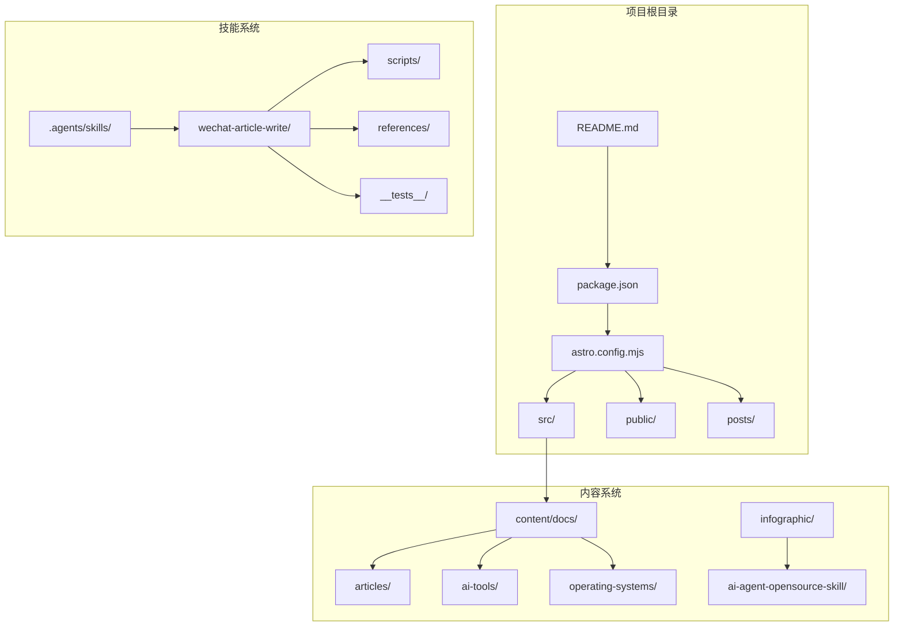

**图表来源**
- [README.md:75-90](file://README.md#L75-L90)
- [package.json:1-19](file://package.json#L1-L19)

**章节来源**
- [README.md:75-90](file://README.md#L75-L90)
- [package.json:1-19](file://package.json#L1-L19)

## 核心组件

### 微信公众号文章写作技能

`wechat-article-write` 技能是整个管道验证系统的核心，实现了15个阶段的完整流水线：

| 阶段 | 动作 | 使用技能 | 产出 | 验证方式 |
|------|------|---------|------|----------|
| 0 | 依赖预检 + CDP健康检测 | 自动检查 + bun install + CDP预检 | 就绪环境 | 内置状态检查 |
| 1 | 资料收集 + 低质量检测 | web-access（唯一联网入口） | materials.md | 文件存在性 + 字数验证 |
| 2 | 文章创作 | ljg-writes（Skill工具调用） | draft.md（含语义占位符） | 字数门控 + frontmatter完整性 |
| 2.4.1 | 质量门控 | 自动检查字数/互动/引用/数据点 | draft.md（验证通过） | 内置验证 + 状态标记 |
| 2.5 | 文章分类确认 | suggest-category.mjs + set-frontmatter.mjs | draft.md（含category） | 分类白名单 + blog-slug验证 |
| **3+4+4.5** | **封面图 + 插图 + 信息图（并行）** | Agent并行：baoyu-cover-image ∥ baoyu-article-illustrator ∥ baoyu-infographic | cover.png + imgs/00-infographic + imgs/01..N | 格式修正 + 引用一致性验证 |
| 3.4.2 | 统一格式检测 | file命令检测 + 扩展名修正 | imgs/*.jpg, cover.jpg | MIME类型检测 + 扩展名修正 |
| 4.6 | 图床上传（前置CDN） | github-image-hosting | image-map.json | 上传状态 + 文件存在性 |
| 5 | 占位符 → CDN URL | apply-image-map.mjs | article.md（博客CDN版）+ article-local.md（微信本地路径版） | 占位符消解 + 路径验证 |
| 6 | 去AI痕迹 | humanizer-zh（必须执行） | article.md（优化后） | 文件存在性 + 大小验证 |
| 7 | Markdown格式化 | baoyu-format-markdown | article.md（排版后） | 内置验证 + 状态标记 |
| 8 | HTML转换（微信轨专用） | baoyu-markdown-to-html | article-wechat.html | HTML生成 + CSS验证 |
| **9** | **博客发布轨**（先发布） | publish-blog.mjs：frontmatter转换 + astro sync + git push | src/content/docs/articles/{slug}.md → 触发Pages部署 | 构建验证 + Git操作 |
| 9.5 | 等待Pages部署就绪（可选） | wait-pages-deployed.mjs：轮询ntlx.github.io | 部署确认 | HTTP状态检查 |
| **10** | **发布到公众号草稿**（后发布） | publish-wechat.mjs（使用article-wechat.html + 本地图片路径） | 公众号草稿 | 探活检查 + 发布验证 |

**章节来源**
- [.agents/skills/wechat-article-write/SKILL.md:129-151](file://.agents/skills/wechat-article-write/SKILL.md#L129-L151)

### 状态管理系统

系统实现了完整的状态跟踪机制，通过 `.pipeline-state.json` 文件记录每个阶段的执行状态：

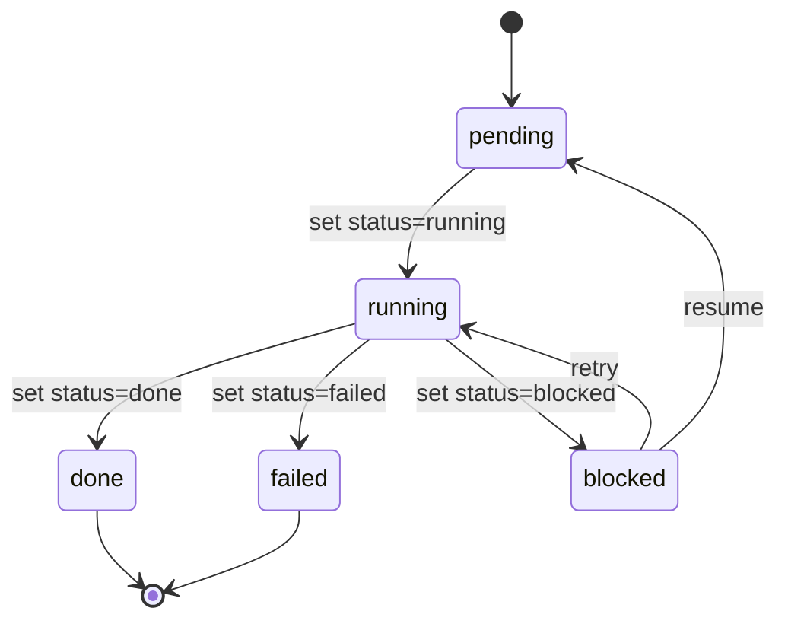

**图表来源**
- [.agents/skills/wechat-article-write/scripts/state.mjs:17-22](file://.agents/skills/wechat-article-write/scripts/state.mjs#L17-L22)

**章节来源**
- [.agents/skills/wechat-article-write/scripts/state.mjs:1-61](file://.agents/skills/wechat-article-write/scripts/state.mjs#L1-L61)
- [.agents/skills/wechat-article-write/scripts/state-lib.mjs:1-63](file://.agents/skills/wechat-article-write/scripts/state-lib.mjs#L1-L63)

## 架构概览

系统采用分层架构设计，实现了高度模块化的技能系统：

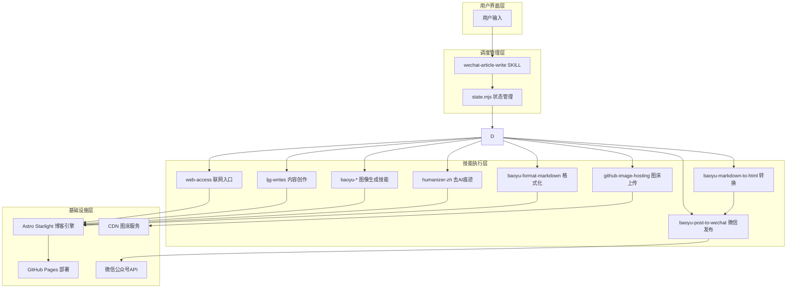

**图表来源**
- [.agents/skills/wechat-article-write/SKILL.md:18-25](file://.agents/skills/wechat-article-write/SKILL.md#L18-L25)

## 详细组件分析

### 发布博客组件（Step 9）

发布博客组件实现了博客轨的完整发布流程，包括前端元数据转换、文件写入、构建验证和Git操作：

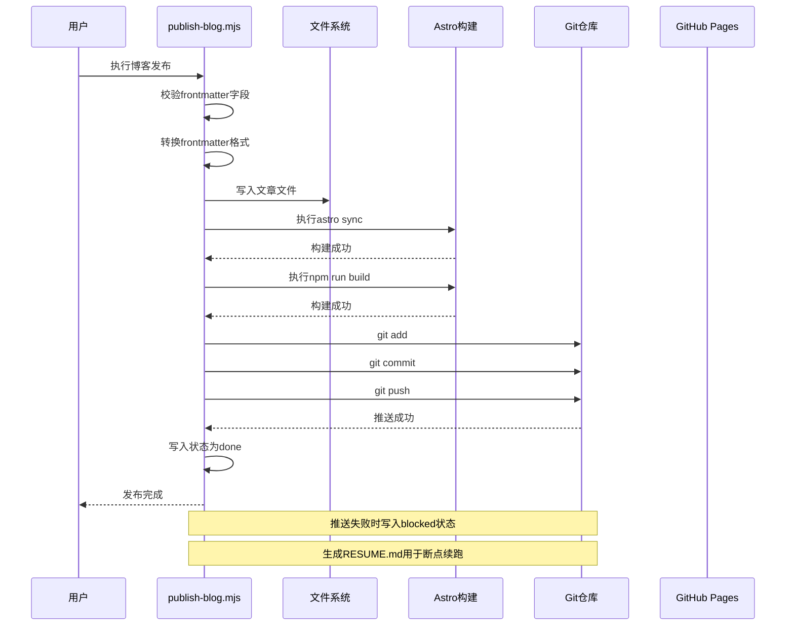

**图表来源**
- [.agents/skills/wechat-article-write/scripts/publish-blog.mjs:17-301](file://.agents/skills/wechat-article-write/scripts/publish-blog.mjs#L17-L301)

**章节来源**
- [.agents/skills/wechat-article-write/scripts/publish-blog.mjs:1-293](file://.agents/skills/wechat-article-write/scripts/publish-blog.mjs#L1-L293)

### 发布微信组件（Step 10）

发布微信组件负责将文章发布到微信公众号草稿箱，采用本地文件处理模式：

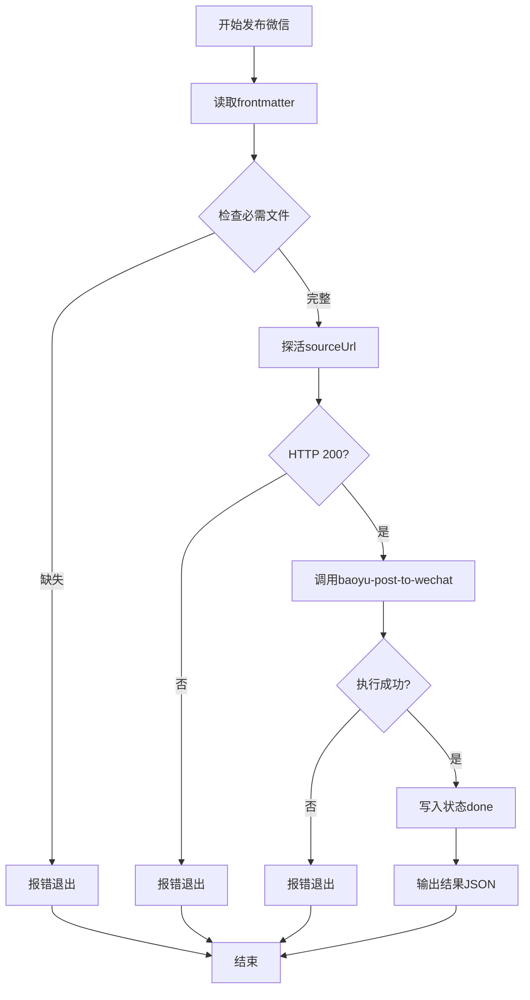

**图表来源**
- [.agents/skills/wechat-article-write/scripts/publish-wechat.mjs:1-147](file://.agents/skills/wechat-article-write/scripts/publish-wechat.mjs#L1-L147)

**章节来源**
- [.agents/skills/wechat-article-write/scripts/publish-wechat.mjs:1-147](file://.agents/skills/wechat-article-write/scripts/publish-wechat.mjs#L1-L147)

### 状态管理组件

状态管理组件提供了完整的流水线状态跟踪功能：

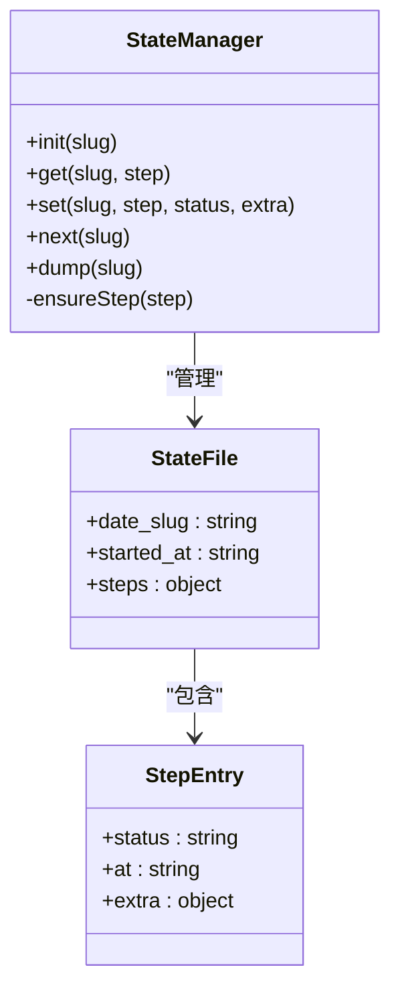

**图表来源**
- [.agents/skills/wechat-article-write/scripts/state.mjs:15-61](file://.agents/skills/wechat-article-write/scripts/state.mjs#L15-L61)
- [.agents/skills/wechat-article-write/scripts/state-lib.mjs:15-63](file://.agents/skills/wechat-article-write/scripts/state-lib.mjs#L15-L63)

**章节来源**
- [.agents/skills/wechat-article-write/scripts/state.mjs:1-61](file://.agents/skills/wechat-article-write/scripts/state.mjs#L1-L61)
- [.agents/skills/wechat-article-write/scripts/state-lib.mjs:1-63](file://.agents/skills/wechat-article-write/scripts/state-lib.mjs#L1-L63)

### 内联验证系统

**重大更新**：验证系统已完全重构，移除了独立的 validate-pipeline.sh 脚本，验证逻辑现在内置于各个步骤脚本中。

#### 步骤1：资料收集验证

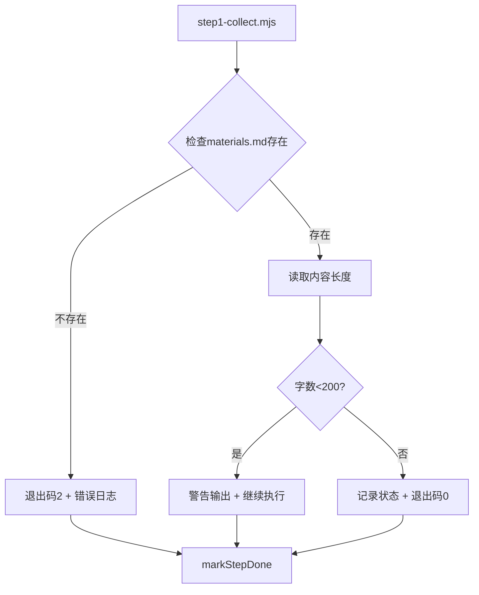

**图表来源**
- [.agents/skills/wechat-article-write/scripts/step1-collect.mjs:25-44](file://.agents/skills/wechat-article-write/scripts/step1-collect.mjs#L25-L44)

#### 步骤2：文章创作质量门控

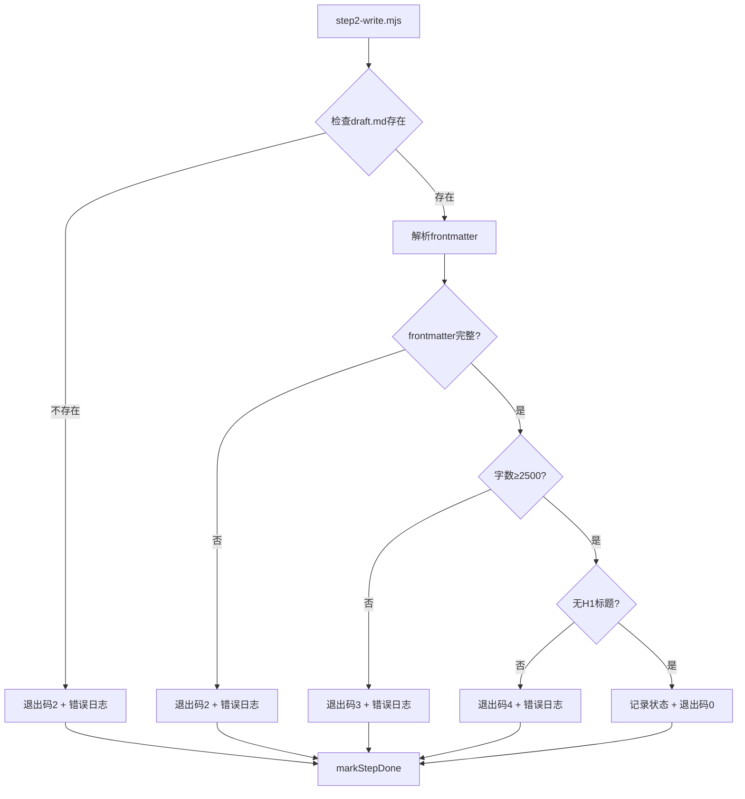

**图表来源**
- [.agents/skills/wechat-article-write/scripts/step2-write.mjs:27-86](file://.agents/skills/wechat-article-write/scripts/step2-write.mjs#L27-L86)

#### 步骤3：文本后处理验证

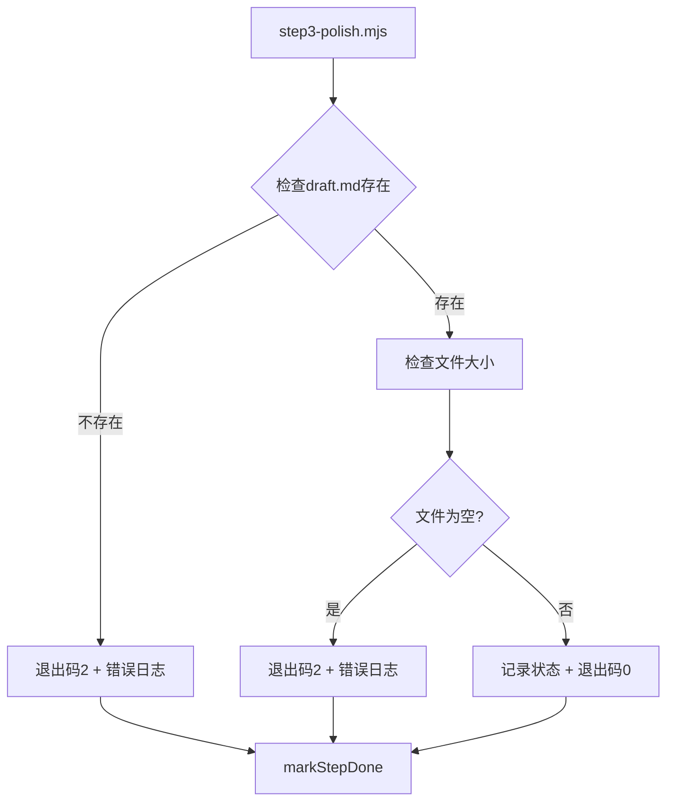

**图表来源**
- [.agents/skills/wechat-article-write/scripts/step3-polish.mjs:19-34](file://.agents/skills/wechat-article-write/scripts/step3-polish.mjs#L19-L34)

#### 步骤4：图片生成完成验证

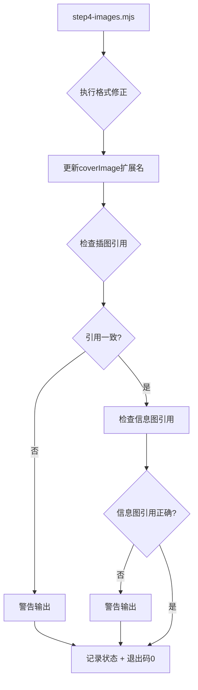

**图表来源**
- [.agents/skills/wechat-article-write/scripts/step4-images.mjs:27-81](file://.agents/skills/wechat-article-write/scripts/step4-images.mjs#L27-L81)

#### 步骤5：产物构建验证

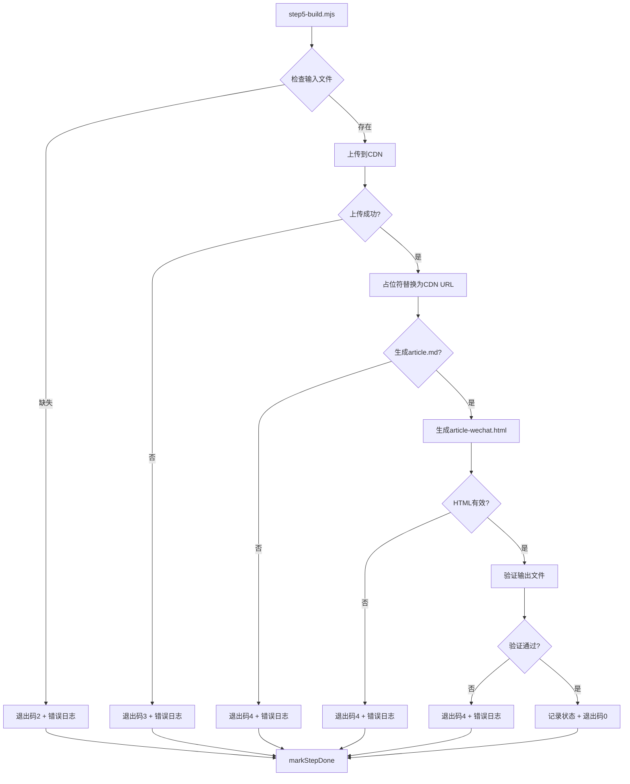

**图表来源**
- [.agents/skills/wechat-article-write/scripts/step5-build.mjs:44-156](file://.agents/skills/wechat-article-write/scripts/step5-build.mjs#L44-L156)

**章节来源**
- [.agents/skills/wechat-article-write/scripts/step1-collect.mjs:1-44](file://.agents/skills/wechat-article-write/scripts/step1-collect.mjs#L1-L44)
- [.agents/skills/wechat-article-write/scripts/step2-write.mjs:1-86](file://.agents/skills/wechat-article-write/scripts/step2-write.mjs#L1-L86)
- [.agents/skills/wechat-article-write/scripts/step3-polish.mjs:1-34](file://.agents/skills/wechat-article-write/scripts/step3-polish.mjs#L1-L34)
- [.agents/skills/wechat-article-write/scripts/step4-images.mjs:1-81](file://.agents/skills/wechat-article-write/scripts/step4-images.mjs#L1-L81)
- [.agents/skills/wechat-article-write/scripts/step5-build.mjs:1-156](file://.agents/skills/wechat-article-write/scripts/step5-build.mjs#L1-L156)

## 依赖关系分析

系统采用了清晰的依赖层次结构：

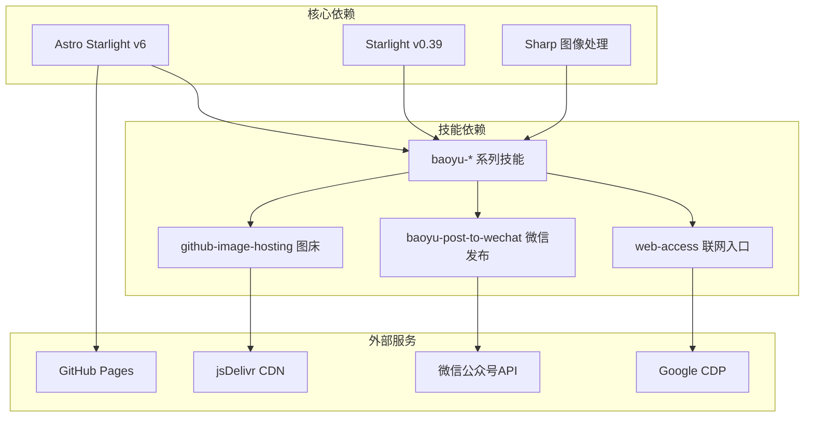

**图表来源**
- [package.json:12-17](file://package.json#L12-L17)
- [README.md:66-74](file://README.md#L66-L74)

**章节来源**
- [package.json:1-19](file://package.json#L1-L19)
- [README.md:66-74](file://README.md#L66-L74)

## 性能考虑

系统在性能优化方面采用了多项策略：

### 并行执行优化
- **图片生成并行化**：封面图、插图、信息图三者并行执行，最大缩短50%的等待时间
- **统一格式检测**：集中处理所有图片格式修正，避免重复检测
- **CDN缓存利用**：图床上传后复用CDN链接，减少重复传输

### 内联验证优化
- **即时验证**：验证逻辑直接嵌入各步骤，避免额外的验证脚本开销
- **原子操作**：每个验证步骤都是独立的原子操作，便于并行执行
- **错误快速反馈**：验证失败立即终止，减少无效计算

### 状态持久化
- **断点续跑**：每个阶段都有状态记录，支持意外中断后的恢复
- **RESUME.md生成**：推送失败时自动生成续跑指引
- **状态原子性**：每个阶段的状态更新都是原子操作

### 资源管理
- **内存优化**：大文件处理时采用流式读取
- **并发控制**：合理控制并行任务数量，避免资源争用
- **错误隔离**：单个步骤失败不影响整体流程

## 故障排除指南

### 常见问题及解决方案

#### 1. 依赖安装失败
**症状**：技能依赖检查失败
**解决**：
- 检查网络连接和npm registry配置
- 清理node_modules后重新安装
- 验证bun版本兼容性

#### 2. CDP连接问题
**症状**：web-access技能无法连接Chrome
**解决**：
- 确认Chrome已启动且调试端口开放
- 检查防火墙设置
- 重启Chrome DevTools Protocol服务

#### 3. 图片格式问题
**症状**：Gemini后端返回的PNG文件扩展名错误
**解决**：
- 执行统一格式检测脚本
- 手动重命名扩展名并更新引用
- 验证file命令检测结果

#### 4. Git推送失败
**症状**：博客发布后无法推送至GitHub
**解决**：
- 检查SSH密钥或HTTPS凭据
- 验证网络连接和代理设置
- 查看RESUME.md中的续跑指引

#### 5. 微信发布失败
**症状**：公众号草稿发布失败
**解决**：
- 验证sourceUrl探活结果
- 检查微信API权限配置
- 确认本地文件路径正确

#### 6. 内联验证失败
**症状**：各步骤验证失败
**解决**：
- 检查对应步骤的错误输出
- 验证输入文件的完整性和正确性
- 查看状态文件中的详细错误信息
- 使用dry-run模式测试步骤执行

**章节来源**
- [.agents/skills/wechat-article-write/scripts/publish-blog.mjs:234-284](file://.agents/skills/wechat-article-write/scripts/publish-blog.mjs#L234-L284)
- [.agents/skills/wechat-article-write/scripts/publish-wechat.mjs:107-114](file://.agents/skills/wechat-article-write/scripts/publish-wechat.mjs#L107-L114)

## 结论

管道验证系统是一个设计精良的自动化内容创作平台，经过完全重构后具有以下显著优势：

### 技术优势
- **模块化设计**：清晰的技能系统架构，便于维护和扩展
- **内联验证**：验证逻辑直接嵌入各步骤，提高了系统的简洁性和效率
- **状态管理完善**：完整的断点续跑和错误恢复机制
- **性能优化到位**：并行执行和资源管理策略有效提升效率
- **质量保证严格**：多层级的质量检查确保输出内容质量

### 实践价值
- **降低门槛**：自动化处理复杂的内容创作流程
- **提高效率**：内联验证减少了额外的验证脚本开销
- **保证质量**：严格的门控机制确保内容符合发布标准
- **增强可靠性**：完善的错误处理和恢复机制

### 发展前景
该系统为内容创作者提供了一个强大而可靠的自动化平台，通过持续优化和功能扩展，有望在AI辅助内容创作领域发挥更大的作用。其模块化的设计理念和内联验证架构也为未来的功能扩展和技术演进奠定了良好的基础。

**重大更新总结**：验证系统的完全重构移除了独立的validate-pipeline.sh脚本，实现了更加简洁高效的内联验证方法。这种变化不仅简化了验证流程，还提高了系统的整体性能和可靠性，为用户提供了更好的使用体验。