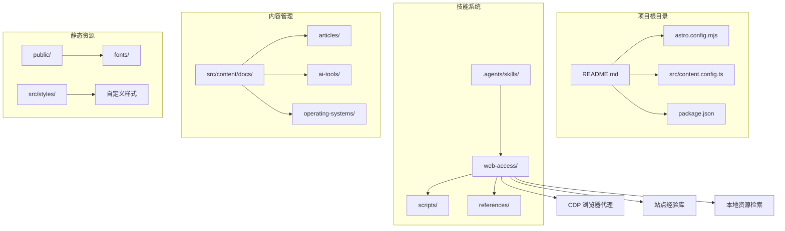
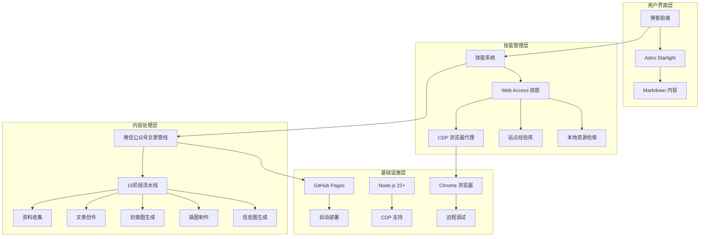
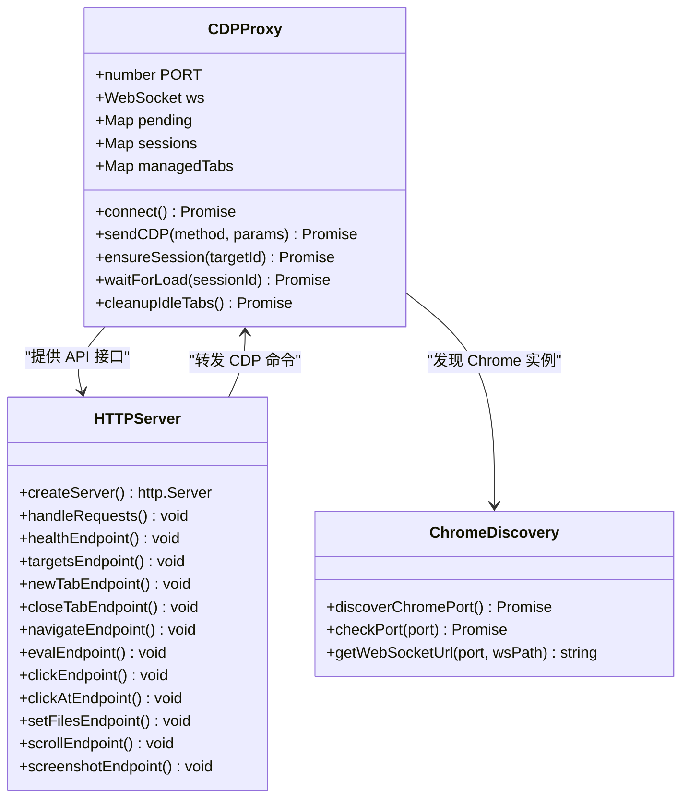
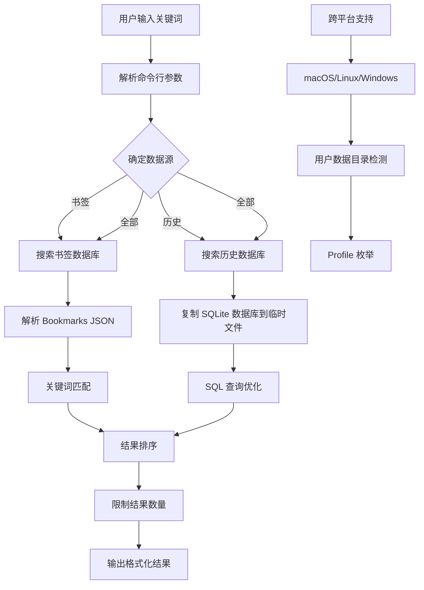
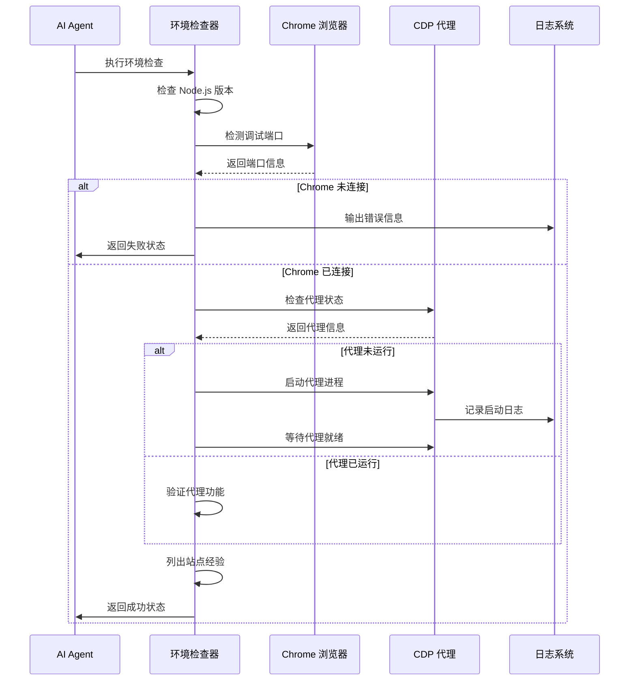
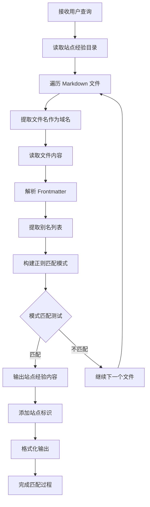
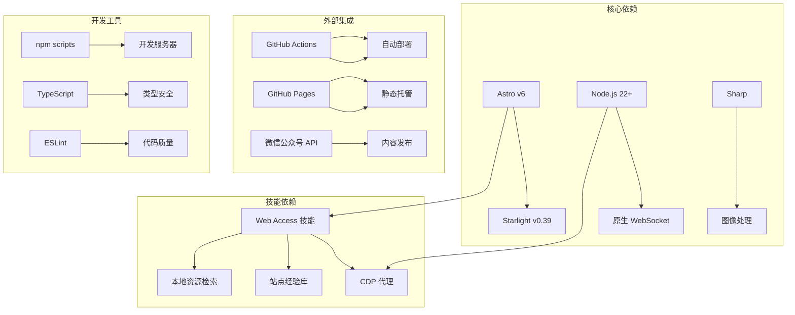

# 网页访问诊断

<cite>
**本文档引用的文件**
- [README.md](file://README.md)
- [astro.config.mjs](file://astro.config.mjs)
- [src/content.config.ts](file://src/content.config.ts)
- [package.json](file://package.json)
- [.agents/skills/web-access/README.md](file://.agents/skills/web-access/README.md)
- [.agents/skills/web-access/scripts/cdp-proxy.mjs](file://.agents/skills/web-access/scripts/cdp-proxy.mjs)
- [.agents/skills/web-access/scripts/check-deps.mjs](file://.agents/skills/web-access/scripts/check-deps.mjs)
- [.agents/skills/web-access/scripts/find-url.mjs](file://.agents/skills/web-access/scripts/find-url.mjs)
- [.agents/skills/web-access/scripts/match-site.mjs](file://.agents/skills/web-access/scripts/match-site.mjs)
- [.agents/skills/web-access/references/cdp-api.md](file://.agents/skills/web-access/references/cdp-api.md)
</cite>

## 目录
1. [简介](#简介)
2. [项目结构](#项目结构)
3. [核心组件](#核心组件)
4. [架构概览](#架构概览)
5. [详细组件分析](#详细组件分析)
6. [依赖关系分析](#依赖关系分析)
7. [性能考虑](#性能考虑)
8. [故障排除指南](#故障排除指南)
9. [结论](#结论)

## 简介

这是一个基于 Astro Starlight 构建的个人技术博客项目，专注于网页访问诊断和浏览器自动化能力。项目集成了强大的 Web Access 技能，为 AI Agent 提供完整的联网能力和浏览器自动化操作。

该项目的主要特色包括：
- 基于 Astro Starlight 的现代化博客平台
- 完整的 SEO 优化和 RSS 订阅功能
- 强大的网页访问诊断能力
- 支持多种 AI Agent 生态系统
- 本地 Chrome 资源检索功能

## 项目结构

项目采用模块化设计，主要包含以下核心部分：



**图表来源**
- [README.md:75-90](file://README.md#L75-L90)
- [astro.config.mjs:1-130](file://astro.config.mjs#L1-L130)

**章节来源**
- [README.md:75-99](file://README.md#L75-L99)
- [astro.config.mjs:1-130](file://astro.config.mjs#L1-L130)

## 核心组件

### Web Access 技能系统

Web Access 技能是整个项目的核心组件，提供了以下关键功能：

#### 主要能力
- **联网工具自动选择**：WebSearch/WebFetch/curl/Jina/CDP 按场景自主判断
- **CDP 浏览器操作**：直连用户日常 Chrome，天然携带登录态
- **三种点击方式**：/click（JS click）、/clickAt（CDP 真实鼠标事件）、/setFiles（文件上传）
- **本地 Chrome 书签/历史检索**：find-url.mjs 查询公网搜不到的目标
- **并行分治**：多目标时分发子 Agent 并行执行
- **站点经验积累**：按域名存储操作经验，跨 session 复用

#### CDP Proxy API
- **HTTP API**：提供完整的浏览器自动化接口
- **WebSocket 连接**：直接操控 Chrome 实例
- **自动发现**：智能检测 Chrome 调试端口
- **闲置清理**：自动关闭长时间未使用的标签页

**章节来源**
- [.agents/skills/web-access/README.md:34-45](file://.agents/skills/web-access/README.md#L34-L45)
- [.agents/skills/web-access/README.md:119-141](file://.agents/skills/web-access/README.md#L119-L141)

## 架构概览

项目采用分层架构设计，从底层基础设施到上层应用功能形成了完整的生态系统：



**图表来源**
- [README.md:20-29](file://README.md#L20-L29)
- [astro.config.mjs:1-130](file://astro.config.mjs#L1-L130)

## 详细组件分析

### CDP 浏览器代理系统

CDP（Chrome DevTools Protocol）代理系统是 Web Access 技能的核心组件，提供了完整的浏览器自动化能力。

#### 核心功能模块



**图表来源**
- [.agents/skills/web-access/scripts/cdp-proxy.mjs:13-221](file://.agents/skills/web-access/scripts/cdp-proxy.mjs#L13-L221)
- [.agents/skills/web-access/scripts/cdp-proxy.mjs:320-588](file://.agents/skills/web-access/scripts/cdp-proxy.mjs#L320-L588)

#### 端点功能分析

| 端点 | 方法 | 功能描述 | 使用场景 |
|------|------|----------|----------|
| /health | GET | 健康检查 | 系统状态监控 |
| /targets | GET | 列出所有页面 | 管理当前标签页 |
| /new | GET | 创建新后台 tab | 打开新页面 |
| /close | GET | 关闭指定 tab | 清理资源 |
| /navigate | GET | 导航到新 URL | 页面跳转 |
| /back | GET | 后退一页 | 浏览历史 |
| /info | GET | 获取页面信息 | 页面状态检查 |
| /eval | POST | 执行 JavaScript | 数据提取 |
| /click | POST | JS 点击元素 | 简单交互 |
| /clickAt | POST | 真鼠标点击 | 复杂交互 |
| /setFiles | POST | 文件上传 | 表单提交 |
| /scroll | GET | 滚动页面 | 内容加载 |
| /screenshot | GET | 截图功能 | 数据可视化 |

**章节来源**
- [.agents/skills/web-access/scripts/cdp-proxy.mjs:320-588](file://.agents/skills/web-access/scripts/cdp-proxy.mjs#L320-L588)
- [.agents/skills/web-access/references/cdp-api.md:10-107](file://.agents/skills/web-access/references/cdp-api.md#L10-L107)

### 本地 Chrome 资源检索系统

find-url.mjs 提供了强大的本地 Chrome 资源检索能力，能够从书签和历史记录中定位 URL。

#### 检索功能架构



**图表来源**
- [.agents/skills/web-access/scripts/find-url.mjs:26-215](file://.agents/skills/web-access/scripts/find-url.mjs#L26-L215)

#### 支持的数据源

| 数据源 | 文件位置 | 功能特性 | 适用场景 |
|--------|----------|----------|----------|
| 书签 | Bookmarks | 结构化层次 | 快速定位重要网站 |
| 历史 | History (SQLite) | 时间序列分析 | 回溯访问记录 |
| Profile | Local State | 多用户支持 | 多账户环境 |

**章节来源**
- [.agents/skills/web-access/scripts/find-url.mjs:83-149](file://.agents/skills/web-access/scripts/find-url.mjs#L83-L149)

### 环境检查和依赖管理系统

check-deps.mjs 提供了完整的环境检查和依赖管理功能，确保 Web Access 技能正常运行。

#### 依赖检查流程



**图表来源**
- [.agents/skills/web-access/scripts/check-deps.mjs:141-172](file://.agents/skills/web-access/scripts/check-deps.mjs#L141-L172)

**章节来源**
- [.agents/skills/web-access/scripts/check-deps.mjs:17-172](file://.agents/skills/web-access/scripts/check-deps.mjs#L17-L172)

### 站点经验匹配系统

match-site.mjs 提供了智能的站点经验匹配功能，能够根据用户输入自动匹配相应的站点经验文件。

#### 匹配算法流程



**图表来源**
- [.agents/skills/web-access/scripts/match-site.mjs:14-47](file://.agents/skills/web-access/scripts/match-site.mjs#L14-L47)

**章节来源**
- [.agents/skills/web-access/scripts/match-site.mjs:1-47](file://.agents/skills/web-access/scripts/match-site.mjs#L1-L47)

## 依赖关系分析

项目采用了模块化的依赖管理策略，各个组件之间保持松耦合的设计。



**图表来源**
- [package.json:12-18](file://package.json#L12-L18)
- [README.md:66-74](file://README.md#L66-L74)

**章节来源**
- [package.json:1-19](file://package.json#L1-19)
- [astro.config.mjs:1-130](file://astro.config.mjs#L1-L130)

## 性能考虑

### CDP 代理性能优化

CDP 代理系统采用了多项性能优化策略：

- **连接池管理**：复用 WebSocket 连接，减少连接建立开销
- **命令队列**：异步处理 CDP 命令，避免阻塞
- **超时控制**：30秒命令超时，防止长时间阻塞
- **内存管理**：及时清理未使用的会话和标签页

### 浏览器自动化优化

- **智能等待**：页面加载完成后才执行后续操作
- **懒加载处理**：滚动后等待 800ms 让懒加载内容加载完成
- **资源清理**：闲置标签页 15 分钟后自动关闭
- **错误恢复**：连接断开后自动重连

### 本地资源检索优化

- **SQLite 临时文件**：查询前复制数据库到临时文件，避免锁定
- **SQL 查询优化**：使用合适的索引和查询条件
- **结果限制**：默认限制 20 条结果，可配置
- **跨 Profile 合并**：智能合并多个 Profile 的历史记录

## 故障排除指南

### 常见问题及解决方案

#### Chrome 连接问题

| 问题症状 | 可能原因 | 解决方案 |
|----------|----------|----------|
| Chrome 未开启远程调试端口 | 未在 chrome://inspect/#remote-debugging 中启用 | 打开调试页面并勾选 Allow remote debugging |
| WebSocket 连接失败 | 端口被占用或防火墙阻止 | 检查端口占用情况，关闭冲突程序 |
| 连接超时 | Chrome 授权弹窗未处理 | 点击 Chrome 弹窗中的 Allow 按钮 |
| 代理进程异常退出 | Node.js 版本过低 | 升级到 Node.js 22+ |

#### CDP 命令执行问题

| 问题症状 | 可能原因 | 解决方案 |
|----------|----------|----------|
| attach 失败 | targetId 无效或标签页已关闭 | 使用 /targets 获取最新标签页列表 |
| 页面长时间无响应 | 网络延迟或页面卡死 | 检查网络连接，重试操作 |
| JavaScript 执行错误 | 选择器不正确或页面结构变化 | 更新选择器，检查页面 DOM 结构 |
| 文件上传失败 | 文件路径不正确或权限问题 | 检查文件路径和权限设置 |

#### 本地资源检索问题

| 问题症状 | 可能原因 | 解决方案 |
|----------|----------|----------|
| 未找到 sqlite3 命令 | SQLite 未安装 | 在 Windows 上使用 winget 安装，macOS/Linux 通常自带 |
| 书签查询无结果 | 无关键词或书签无时间维度 | 添加关键词或使用 --only history 参数 |
| 历史查询速度慢 | 数据库过大 | 使用 --since 参数限制时间范围 |
| 跨平台路径问题 | 不同操作系统的用户数据目录不同 | 系统自动检测，无需手动配置 |

**章节来源**
- [.agents/skills/web-access/references/cdp-api.md:99-107](file://.agents/skills/web-access/references/cdp-api.md#L99-L107)
- [.agents/skills/web-access/scripts/find-url.mjs:143-145](file://.agents/skills/web-access/scripts/find-url.mjs#L143-L145)

### 调试技巧

#### 启用详细日志

```bash
# 设置调试级别
export DEBUG=web-access:*
export NODE_DEBUG=cdp-proxy

# 查看代理日志
tail -f ~/cdp-proxy.log
```

#### 环境检查

```bash
# 检查依赖
node "${CLAUDE_SKILL_DIR}/scripts/check-deps.mjs"

# 测试 CDP 连接
curl -s http://localhost:3456/health
curl -s http://localhost:3456/targets
```

#### 站点经验验证

```bash
# 匹配站点经验
node "${CLAUDE_SKILL_DIR}/scripts/match-site.mjs" "小红书搜索"

# 查找本地 URL
node "${CLAUDE_SKILL_DIR}/scripts/find-url.mjs" 财务小智
```

## 结论

这个网页访问诊断项目展现了现代 AI Agent 技能系统的强大能力。通过精心设计的架构和丰富的功能特性，项目为用户提供了完整的网页访问和浏览器自动化解决方案。

### 主要优势

1. **完整的浏览器自动化**：通过 CDP 协议实现真正的浏览器操作
2. **智能环境管理**：自动检测和配置运行环境
3. **本地资源集成**：深度整合 Chrome 本地数据
4. **多平台支持**：支持 Windows、macOS 和 Linux
5. **错误处理完善**：提供详细的错误诊断和恢复机制

### 技术亮点

- **模块化设计**：清晰的组件分离和职责划分
- **性能优化**：多项性能优化策略确保高效运行
- **扩展性强**：易于添加新的站点经验和功能
- **用户友好**：提供详细的文档和使用指导

### 应用前景

该项目不仅适用于个人博客内容创作，还可以扩展到各种需要网页访问和数据提取的场景，为 AI Agent 提供强大的在线能力支撑。其设计理念和实现方式为类似的技能开发提供了优秀的参考范例。