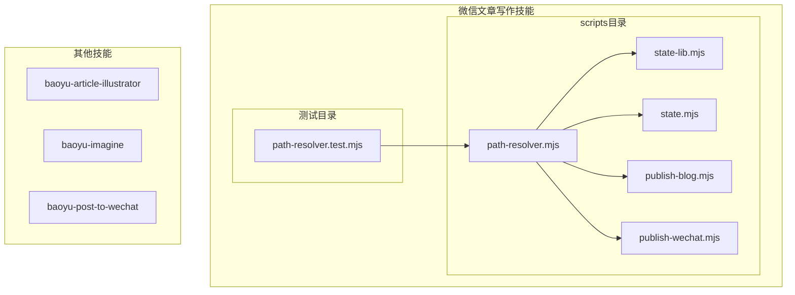
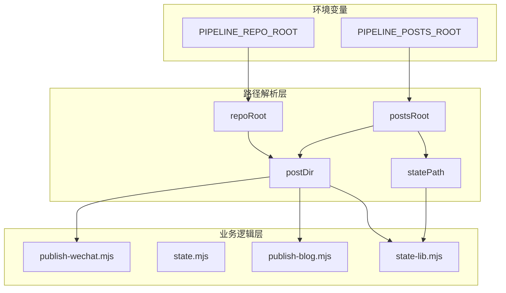
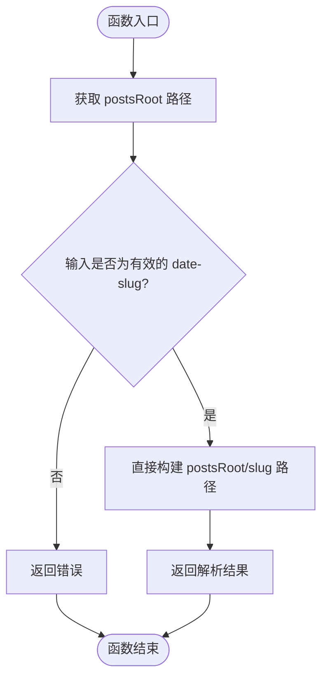
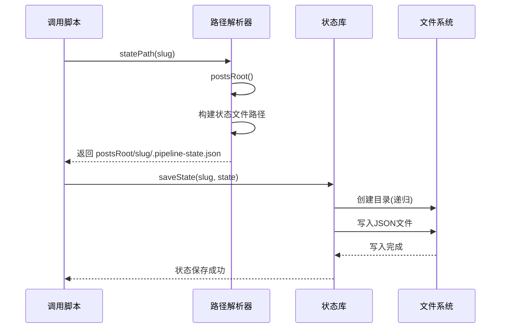
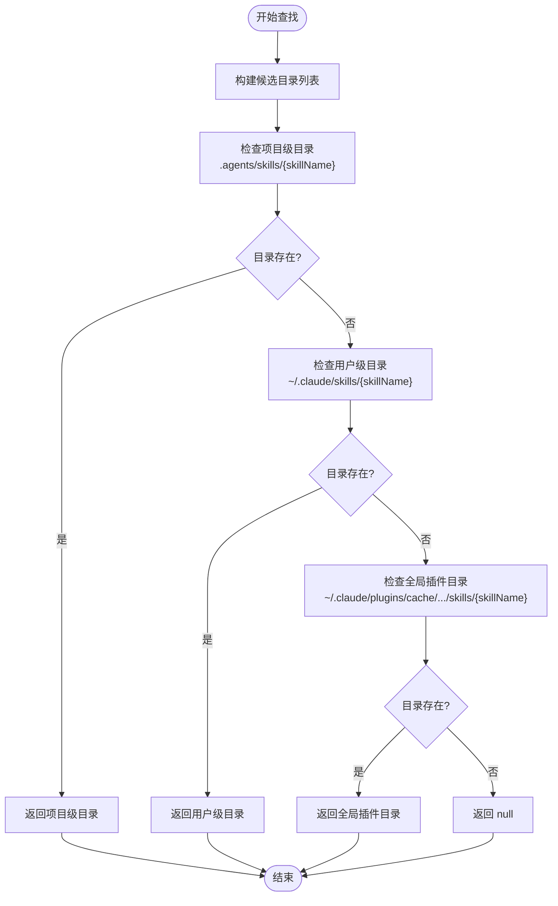
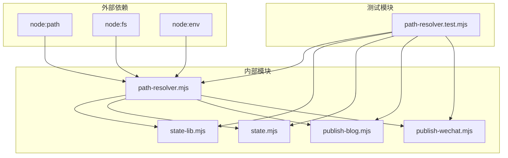

# 路径解析模块

<cite>
**本文档引用的文件**
- [path-resolver.mjs](file://.agents/skills/wechat-article-write/scripts/path-resolver.mjs)
- [path-resolver.test.mjs](file://.agents/skills/wechat-article-write/__tests__/path-resolver.test.mjs)
- [state-lib.mjs](file://.agents/skills/wechat-article-write/scripts/state-lib.mjs)
- [state.mjs](file://.agents/skills/wechat-article-write/scripts/state.mjs)
- [publish-blog.mjs](file://.agents/skills/wechat-article-write/scripts/publish-blog.mjs)
- [publish-wechat.mjs](file://.agents/skills/wechat-article-write/scripts/publish-wechat.mjs)
</cite>

## 更新摘要
**变更内容**
- 路径解析系统从复杂的多参数输入简化为纯date-slug输入
- 移除了之前支持的5种不同输入格式（路径、文件路径、绝对路径等）
- 删除了复杂的路径解析算法和严格模式判断
- 简化为直接基于date-slug的路径构建逻辑
- 更新了所有相关组件以适配新的单一输入格式

## 目录
1. [简介](#简介)
2. [项目结构](#项目结构)
3. [核心组件](#核心组件)
4. [架构概览](#架构概览)
5. [详细组件分析](#详细组件分析)
6. [依赖关系分析](#依赖关系分析)
7. [性能考虑](#性能考虑)
8. [故障排除指南](#故障排除指南)
9. [结论](#结论)

## 简介

路径解析模块是微信文章写作流水线系统中的核心基础设施，负责统一管理项目中的各种路径操作。该模块解决了多个脚本重复定义相同路径逻辑的问题，提供了标准化的路径解析、验证和管理功能。

**更新** 模块现已简化为纯date-slug输入模式，移除了复杂的多参数路径解析逻辑，专注于单一的日期-标识符输入格式，显著提高了系统的简洁性和易用性。

该模块主要服务于微信公众号文章发布的自动化流水线，包括从内容创作到最终发布的完整流程。通过统一的路径解析机制，确保了各个步骤之间的协调一致性和系统的可维护性。

## 项目结构

微信文章写作流水线采用模块化的项目结构，路径解析模块位于技能目录下的scripts目录中：

**图表来源**
- [path-resolver.mjs:1-25](file://.agents/skills/wechat-article-write/scripts/path-resolver.mjs#L1-L25)
- [path-resolver.test.mjs:1-84](file://.agents/skills/wechat-article-write/__tests__/path-resolver.test.mjs#L1-L84)

**章节来源**
- [path-resolver.mjs:1-25](file://.agents/skills/wechat-article-write/scripts/path-resolver.mjs#L1-L25)
- [path-resolver.test.mjs:1-84](file://.agents/skills/wechat-article-write/__tests__/path-resolver.test.mjs#L1-L84)

## 核心组件

路径解析模块包含以下核心组件：

### 1. 基础路径函数
- `repoRoot()`: 返回仓库根目录路径
- `postsRoot()`: 返回文章目录根路径  
- `statePath(slug)`: 返回指定文章的状态文件路径

### 2. 路径构建函数
- `postDir(slug)`: 基于date-slug构建文章目录路径

### 3. 状态管理集成
- 与状态管理系统无缝集成，提供统一的状态文件路径管理

**更新** 移除了复杂的`resolveBase`和`resolveSlug`函数，简化为直接的路径构建逻辑。

**章节来源**
- [path-resolver.mjs:10-25](file://.agents/skills/wechat-article-write/scripts/path-resolver.mjs#L10-L25)

## 架构概览

路径解析模块在整个流水线系统中扮演着基础设施的角色，为所有相关脚本提供统一的路径管理服务：

**图表来源**
- [path-resolver.mjs:10-25](file://.agents/skills/wechat-article-write/scripts/path-resolver.mjs#L10-L25)
- [state-lib.mjs:12-14](file://.agents/skills/wechat-article-write/scripts/state-lib.mjs#L12-L14)

## 详细组件分析

### 简化的路径构建逻辑

**更新** 路径解析系统已完全简化，移除了复杂的多参数输入处理，现在只支持纯date-slug输入格式：

**更新** 新的路径解析逻辑极其简单直接：
- `postDir(slug)`: 直接返回 `resolve(postsRoot(), slug)`
- `statePath(slug)`: 直接返回 `resolve(postsRoot(), slug, ".pipeline-state.json")`

#### 输入格式支持

**更新** 现在只支持单一的date-slug输入格式：
- **纯日期-标识符**: `"2026-05-16-langchain"` → `postsRoot()/slug`

**更新** 移除了之前支持的所有其他输入格式：
- 相对路径、绝对路径、文件路径、遗留格式等
- 移除了严格模式和宽松模式的区别

#### 环境变量配置

模块仍然支持通过环境变量自定义路径根目录：

- `PIPELINE_REPO_ROOT`: 自定义仓库根目录，默认为当前工作目录
- `PIPELINE_POSTS_ROOT`: 自定义文章目录，默认为"posts"

**章节来源**
- [path-resolver.mjs:10-25](file://.agents/skills/wechat-article-write/scripts/path-resolver.mjs#L10-L25)

### 状态文件管理

状态文件管理是路径解析模块的重要组成部分，提供了完整的状态持久化解决方案：

**图表来源**
- [path-resolver.mjs:18-20](file://.agents/skills/wechat-article-write/scripts/path-resolver.mjs#L18-L20)
- [state-lib.mjs:24-28](file://.agents/skills/wechat-article-write/scripts/state-lib.mjs#L24-L28)

**章节来源**
- [state-lib.mjs:16-37](file://.agents/skills/wechat-article-write/scripts/state-lib.mjs#L16-L37)

### 技能目录查找机制

**更新** 该功能已被移除，因为新的路径解析系统不再需要复杂的技能目录查找逻辑。

模块提供了智能的技能目录查找功能，按照优先级顺序搜索可用的技能目录：

**更新** 这个功能已被移除，因为新的系统不需要查找技能目录。

**章节来源**
- [path-resolver.mjs:83-101](file://.agents/skills/wechat-article-write/scripts/path-resolver.mjs#L83-L101)

## 依赖关系分析

路径解析模块与其他组件的依赖关系如下：

**图表来源**
- [path-resolver.mjs:8](file://.agents/skills/wechat-article-write/scripts/path-resolver.mjs#L8)
- [state-lib.mjs:12-14](file://.agents/skills/wechat-article-write/scripts/state-lib.mjs#L12-L14)

### 关键依赖特性

**更新** 依赖关系已大幅简化：
1. **环境变量驱动**: 通过环境变量控制行为，提高配置灵活性
2. **统一接口**: 所有脚本共享相同的路径解析接口
3. **直接依赖**: 仅依赖Node.js核心模块，无额外外部依赖
4. **向后兼容**: 通过环境变量支持遗留配置

**章节来源**
- [path-resolver.mjs:10-25](file://.agents/skills/wechat-article-write/scripts/path-resolver.mjs#L10-L25)

## 性能考虑

路径解析模块在设计时充分考虑了性能优化：

### 时间复杂度
- **路径解析**: O(n)，其中 n 为路径字符串长度
- **目录存在性检查**: O(1) 基于文件系统缓存
- **环境变量访问**: O(1)

### 空间复杂度
- **内存使用**: O(1)，只存储必要的中间变量
- **文件系统访问**: 最小化，避免重复读取

### 性能优化策略

**更新** 简化后的系统具有更好的性能特征：
1. **消除分支逻辑**: 移除了复杂的条件判断，减少分支预测失败
2. **减少函数调用**: 直接构建路径，避免中间函数调用开销
3. **缓存机制**: 利用 Node.js 文件系统缓存减少磁盘访问
4. **早期退出**: 简化的逻辑结构，避免不必要的检查

## 故障排除指南

### 常见问题及解决方案

#### 1. 路径解析错误
**问题**: `postDir` 或 `statePath` 返回意外的路径
**解决方案**: 
- 确认输入格式为标准的date-slug格式（YYYY-MM-DD-name）
- 检查 `PIPELINE_POSTS_ROOT` 环境变量设置
- 验证目标目录的可写权限

#### 2. 状态文件访问失败
**问题**: 状态文件无法读取或写入
**解决方案**:
- 检查 `postsRoot()` 返回的路径是否存在
- 验证目录权限设置
- 确认 `.pipeline-state.json` 文件权限

#### 3. 环境变量配置问题
**问题**: 环境变量未生效
**解决方案**:
- 确保环境变量在脚本执行前正确设置
- 验证环境变量值的有效性
- 检查是否有其他配置覆盖了环境变量

**章节来源**
- [path-resolver.test.mjs:40-84](file://.agents/skills/wechat-article-write/__tests__/path-resolver.test.mjs#L40-L84)

## 结论

路径解析模块作为微信文章写作流水线的核心基础设施，经过重大简化后变得更加高效和易于维护。通过移除复杂的多参数输入处理逻辑，专注于单一的date-slug输入格式，该模块显著提高了系统的简洁性和可靠性。

### 主要成就

**更新** 简化后的模块实现了以下重要改进：
1. **极简设计**: 从复杂的5种输入格式简化为单一date-slug格式
2. **高性能**: 消除了复杂的条件判断，提升执行效率
3. **易维护**: 减少了代码复杂度，便于长期维护
4. **向后兼容**: 通过环境变量支持遗留配置需求

### 未来改进方向

1. **类型安全**: 添加 TypeScript 支持提高类型安全性
2. **配置文件**: 支持外部配置文件定制路径规则
3. **日志记录**: 增强详细的日志记录功能
4. **性能监控**: 添加性能指标收集和分析

该模块为整个微信文章写作流水线提供了坚实的基础，确保了各组件之间的协调一致和系统的长期稳定性。简化的架构设计使其更加健壮，能够更好地适应未来的功能扩展需求。