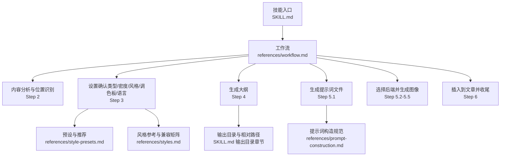
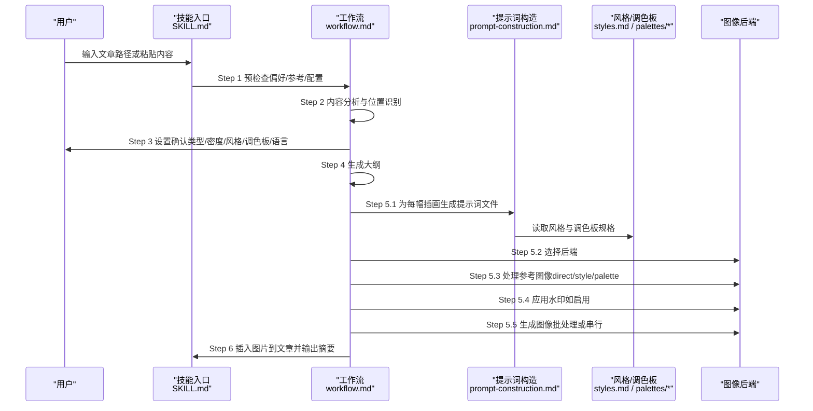
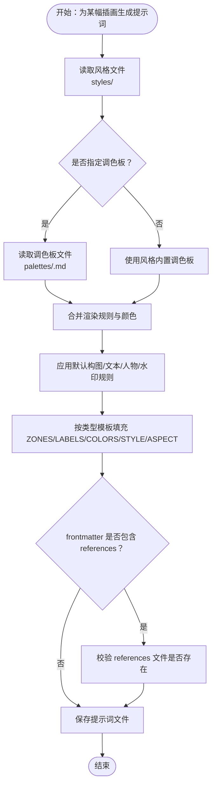
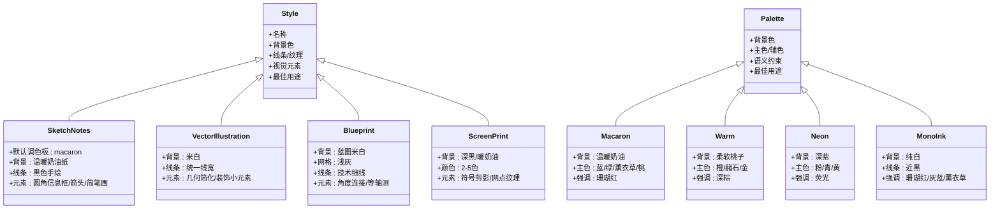
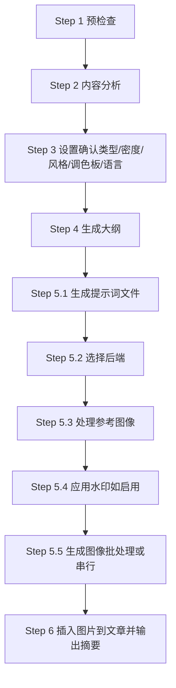
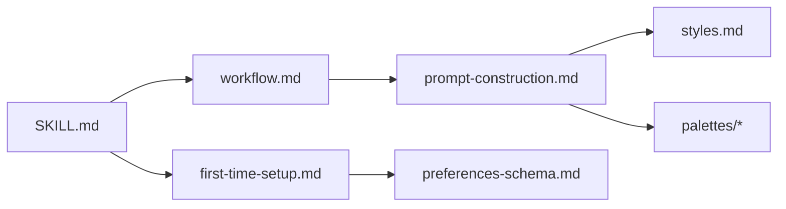

# baoyu-article-illustrator 文章插画技能

<cite>
**本文引用的文件**
- [SKILL.md](file://.agents/skills/baoyu-article-illustrator/SKILL.md)
- [system.md](file://.agents/skills/baoyu-article-illustrator/prompts/system.md)
- [prompt-construction.md](file://.agents/skills/baoyu-article-illustrator/references/prompt-construction.md)
- [style-presets.md](file://.agents/skills/baoyu-article-illustrator/references/style-presets.md)
- [styles.md](file://.agents/skills/baoyu-article-illustrator/references/styles.md)
- [usage.md](file://.agents/skills/baoyu-article-illustrator/references/usage.md)
- [workflow.md](file://.agents/skills/baoyu-article-illustrator/references/workflow.md)
- [first-time-setup.md](file://.agents/skills/baoyu-article-illustrator/references/config/first-time-setup.md)
- [preferences-schema.md](file://.agents/skills/baoyu-article-illustrator/references/config/preferences-schema.md)
- [macaron.md](file://.agents/skills/baoyu-article-illustrator/references/palettes/macaron.md)
- [warm.md](file://.agents/skills/baoyu-article-illustrator/references/palettes/warm.md)
- [neon.md](file://.agents/skills/baoyu-article-illustrator/references/palettes/neon.md)
- [mono-ink.md](file://.agents/skills/baoyu-article-illustrator/references/palettes/mono-ink.md)
- [sketch-notes.md](file://.agents/skills/baoyu-article-illustrator/references/styles/sketch-notes.md)
- [vector-illustration.md](file://.agents/skills/baoyu-article-illustrator/references/styles/vector-illustration.md)
- [blueprint.md](file://.agents/skills/baoyu-article-illustrator/references/styles/blueprint.md)
- [screen-print.md](file://.agents/skills/baoyu-article-illustrator/references/styles/screen-print.md)
</cite>

## 目录
1. [简介](#简介)
2. [项目结构](#项目结构)
3. [核心组件](#核心组件)
4. [架构总览](#架构总览)
5. [详细组件分析](#详细组件分析)
6. [依赖关系分析](#依赖关系分析)
7. [性能考虑](#性能考虑)
8. [故障排查指南](#故障排查指南)
9. [结论](#结论)
10. [附录](#附录)

## 简介
baoyu-article-illustrator 是一个面向文章内容的智能插画生成技能，采用“类型 × 风格 × 调色板”三维一致性策略，自动分析文章结构与可视化需求，生成与内容契合的插画。其核心目标是：
- 基于文章内容识别视觉增益点
- 通过系统化的提示词构建与风格模板，确保插画风格统一
- 支持多种艺术风格与调色板组合，覆盖技术、知识、叙事、编辑等多种场景
- 提供可复现的工作流：先生成提示词文件，再由后端批量或顺序生成图像

本技能强调“一致性”与“可复现性”：每幅插画均对应一个独立的提示词文件，作为生成记录与回放依据；同时支持参考图像的直接引用、风格抽取与调色板提取。

## 项目结构
技能位于 .agents/skills/baoyu-article-illustrator 目录下，主要包含以下子模块：
- prompts：系统级提示词模板（system.md）
- references：工作流、样式、调色板、配置与用法说明
- 样式与调色板：每个风格与调色板对应独立文档，定义视觉元素、渲染规则与最佳用途
- SKILL.md：技能说明、工具选择、确认策略、输出目录与偏好管理

图表来源
- [SKILL.md: 84-93:84-93](file://.agents/skills/baoyu-article-illustrator/SKILL.md#L84-L93)
- [workflow.md: 1-432:1-432](file://.agents/skills/baoyu-article-illustrator/references/workflow.md#L1-L432)
- [prompt-construction.md: 1-460:1-460](file://.agents/skills/baoyu-article-illustrator/references/prompt-construction.md#L1-L460)
- [style-presets.md: 1-88:1-88](file://.agents/skills/baoyu-article-illustrator/references/style-presets.md#L1-L88)
- [styles.md: 1-237:1-237](file://.agents/skills/baoyu-article-illustrator/references/styles.md#L1-L237)
- [usage.md: 1-83:1-83](file://.agents/skills/baoyu-article-illustrator/references/usage.md#L1-L83)

章节来源
- [.agents/skills/baoyu-article-illustrator/SKILL.md: 10-241:10-241](file://.agents/skills/baoyu-article-illustrator/SKILL.md#L10-L241)

## 核心组件
- 工作流引擎：基于 references/workflow.md 的六步流程，确保可重复与可审计
- 提示词构造器：基于 references/prompt-construction.md 的模板化与规范化流程
- 风格与调色板：通过 references/styles.md 与 references/palettes/* 定义风格与色彩约束
- 预设系统：references/style-presets.md 提供内容类型到类型/风格/调色板的推荐映射
- 配置与偏好：references/config/first-time-setup.md 与 references/config/preferences-schema.md 管理偏好与首选项
- 后端选择与生成：SKILL.md 的“图像生成工具”规则决定后端选择与执行策略

章节来源
- [workflow.md: 1-432:1-432](file://.agents/skills/baoyu-article-illustrator/references/workflow.md#L1-L432)
- [prompt-construction.md: 1-460:1-460](file://.agents/skills/baoyu-article-illustrator/references/prompt-construction.md#L1-L460)
- [style-presets.md: 1-88:1-88](file://.agents/skills/baoyu-article-illustrator/references/style-presets.md#L1-L88)
- [styles.md: 1-237:1-237](file://.agents/skills/baoyu-article-illustrator/references/styles.md#L1-L237)
- [first-time-setup.md: 1-141:1-141](file://.agents/skills/baoyu-article-illustrator/references/config/first-time-setup.md#L1-L141)
- [preferences-schema.md: 1-133:1-133](file://.agents/skills/baoyu-article-illustrator/references/config/preferences-schema.md#L1-L133)

## 架构总览
技能采用“输入 → 分析 → 确认 → 大纲 → 提示词 → 生成 → 插入”的流水线式架构。关键特性：
- 强制保存提示词文件：在任何图像生成前必须存在对应的提示词文件，保证可复现性
- 参考图像处理：支持直接引用、风格抽取与调色板抽取三种用法，并在提示词中以 frontmatter 或正文形式体现
- 风格与调色板一致性：通过“类型 × 风格 × 调色板”三维组合，确保视觉一致
- 后端选择策略：优先运行时原生工具，其次非原生工具，必要时询问用户

图表来源
- [SKILL.md: 24-50:24-50](file://.agents/skills/baoyu-article-illustrator/SKILL.md#L24-L50)
- [workflow.md: 297-396:297-396](file://.agents/skills/baoyu-article-illustrator/references/workflow.md#L297-L396)
- [prompt-construction.md: 303-326:303-326](file://.agents/skills/baoyu-article-illustrator/references/prompt-construction.md#L303-L326)
- [styles.md: 1-L237:1-237](file://.agents/skills/baoyu-article-illustrator/references/styles.md#L1-L237)

## 详细组件分析

### 组件一：提示词构造与分析框架
- 文件格式与前置元数据：每个提示词文件包含 YAML frontmatter（illustration_id、type、style、palette、references），以及类型特定的模板内容
- 默认构图要求：简洁布局、充足留白、避免复杂背景、主元素居中或按内容需要定位
- 颜色规范：颜色用于渲染指导，禁止在图像中显示颜色名称、十六进制值或调色板标签
- 人物绘制：卡通化简化、符号化表达，避免写实
- 文本规范：大而清晰、手写风格字体、关键词为主、匹配文章语言
- 类型模板：针对 infographic、scene、flowchart、comparison、framework、timeline 的结构化模板
- 屏幕印刷风格覆盖：当 style 为 screen-print 时，替换为单色块、无渐变、网点纹理与负形叙事
- 调色板覆盖规则：读取风格文件的渲染规则，读取调色板文件的颜色与背景，调色板颜色替换风格默认色，背景替换风格默认背景，保留风格纹理描述

图表来源
- [prompt-construction.md: 303-326:303-326](file://.agents/skills/baoyu-article-illustrator/references/prompt-construction.md#L303-L326)
- [prompt-construction.md: 413-442:413-442](file://.agents/skills/baoyu-article-illustrator/references/prompt-construction.md#L413-L442)
- [workflow.md: 314-325:314-325](file://.agents/skills/baoyu-article-illustrator/references/workflow.md#L314-L325)

章节来源
- [prompt-construction.md: 1-460:1-460](file://.agents/skills/baoyu-article-illustrator/references/prompt-construction.md#L1-L460)
- [workflow.md: 297-326:297-326](file://.agents/skills/baoyu-article-illustrator/references/workflow.md#L297-L326)

### 组件二：风格与调色板体系
- 核心风格：sketch-notes（默认）、vector-illustration、notion、warm、minimal、blueprint、watercolor、elegant、editorial、scientific、chalkboard、fantasy-animation、flat、flat-doodle、intuition-machine、nature、pixel-art、playful、retro、sketch、screen-print、vintage
- 调色板：macaron（柔和马卡龙色块）、warm（暖色系）、neon（霓虹高对比）、mono-ink（纯黑与语义色）
- 兼容矩阵：Type × Style 兼容性表，指导在不同类型下选择合适风格
- 自动选择：按内容信号与类型自动推荐风格，无强信号时默认 sketch-notes
- 屏幕印刷风格：限制颜色数量、强调负形叙事与网点纹理

图表来源
- [styles.md: 21-237:21-237](file://.agents/skills/baoyu-article-illustrator/references/styles.md#L21-L237)
- [sketch-notes.md: 1-92:1-92](file://.agents/skills/baoyu-article-illustrator/references/styles/sketch-notes.md#L1-L92)
- [vector-illustration.md: 1-58:1-58](file://.agents/skills/baoyu-article-illustrator/references/styles/vector-illustration.md#L1-L58)
- [blueprint.md: 1-58:1-58](file://.agents/skills/baoyu-article-illustrator/references/styles/blueprint.md#L1-L58)
- [screen-print.md: 1-71:1-71](file://.agents/skills/baoyu-article-illustrator/references/styles/screen-print.md#L1-L71)
- [macaron.md: 1-34:1-34](file://.agents/skills/baoyu-article-illustrator/references/palettes/macaron.md#L1-L34)
- [warm.md: 1-33:1-33](file://.agents/skills/baoyu-article-illustrator/references/palettes/warm.md#L1-L33)
- [neon.md: 1-34:1-34](file://.agents/skills/baoyu-article-illustrator/references/palettes/neon.md#L1-L34)
- [mono-ink.md: 1-43:1-43](file://.agents/skills/baoyu-article-illustrator/references/palettes/mono-ink.md#L1-L43)

章节来源
- [styles.md: 1-237:1-237](file://.agents/skills/baoyu-article-illustrator/references/styles.md#L1-L237)
- [style-presets.md: 1-88:1-88](file://.agents/skills/baoyu-article-illustrator/references/style-presets.md#L1-L88)
- [sketch-notes.md: 1-92:1-92](file://.agents/skills/baoyu-article-illustrator/references/styles/sketch-notes.md#L1-L92)
- [vector-illustration.md: 1-58:1-58](file://.agents/skills/baoyu-article-illustrator/references/styles/vector-illustration.md#L1-L58)
- [blueprint.md: 1-58:1-58](file://.agents/skills/baoyu-article-illustrator/references/styles/blueprint.md#L1-L58)
- [screen-print.md: 1-71:1-71](file://.agents/skills/baoyu-article-illustrator/references/styles/screen-print.md#L1-L71)
- [macaron.md: 1-34:1-34](file://.agents/skills/baoyu-article-illustrator/references/palettes/macaron.md#L1-L34)
- [warm.md: 1-33:1-33](file://.agents/skills/baoyu-article-illustrator/references/palettes/warm.md#L1-L33)
- [neon.md: 1-34:1-34](file://.agents/skills/baoyu-article-illustrator/references/palettes/neon.md#L1-L34)
- [mono-ink.md: 1-43:1-43](file://.agents/skills/baoyu-article-illustrator/references/palettes/mono-ink.md#L1-L43)

### 组件三：工作流与执行策略
- 步骤划分：预检查 → 分析 → 确认 → 生成大纲 → 生成提示词 → 生成图像 → 收尾
- 参考图像处理：支持直接引用（--ref）、风格抽取（描述到提示词正文）、调色板抽取（颜色列表到提示词正文）
- 后端选择：优先运行时原生工具，其次唯一非原生工具，否则询问用户
- 批量生成：若后端支持批处理且已存在多个提示词文件，则优先使用批处理接口
- 水印：若启用，按偏好配置添加到提示词
- 输出目录：支持同目录、文章子目录、独立子目录、独立主题目录四种模式，相对路径插入到文章

图表来源
- [workflow.md: 3-L432:3-432](file://.agents/skills/baoyu-article-illustrator/references/workflow.md#L3-L432)
- [SKILL.md: 84-93:84-93](file://.agents/skills/baoyu-article-illustrator/SKILL.md#L84-L93)

章节来源
- [workflow.md: 1-432:1-432](file://.agents/skills/baoyu-article-illustrator/references/workflow.md#L1-L432)
- [SKILL.md: 84-241:84-241](file://.agents/skills/baoyu-article-illustrator/SKILL.md#L84-L241)

### 组件四：配置与首选项管理
- 首次设置：引导用户完成水印、默认风格、输出目录与保存位置的选择，并生成 EXTEND.md
- 偏好模式：支持项目级与用户级 EXTEND.md，优先级明确
- 偏好字段：水印开关/内容/位置、默认风格、默认调色板、语言、默认输出目录、首选图像后端、自定义风格
- 修改方式：直接编辑 EXTEND.md、重新触发首次设置、常用一键修改（如固定后端、切换默认风格/调色板）

章节来源
- [first-time-setup.md: 1-141:1-141](file://.agents/skills/baoyu-article-illustrator/references/config/first-time-setup.md#L1-L141)
- [preferences-schema.md: 1-133:1-133](file://.agents/skills/baoyu-article-illustrator/references/config/preferences-schema.md#L1-L133)
- [SKILL.md: 228-241:228-241](file://.agents/skills/baoyu-article-illustrator/SKILL.md#L228-L241)

## 依赖关系分析
- 组件耦合
  - 工作流对提示词构造强依赖：必须先有提示词文件才能生成图像
  - 提示词构造对风格与调色板弱耦合：通过文件读取与合并规则实现
  - 后端选择对运行时环境强依赖：优先原生工具，其次非原生工具，最后用户确认
- 关键依赖链
  - workflow.md → prompt-construction.md（生成提示词）
  - prompt-construction.md → styles.md / palettes/*（风格与调色板）
  - SKILL.md → workflow.md（后端选择与确认策略）
  - first-time-setup.md / preferences-schema.md → SKILL.md（偏好解析）

图表来源
- [workflow.md: 1-L432:1-432](file://.agents/skills/baoyu-article-illustrator/references/workflow.md#L1-L432)
- [prompt-construction.md: 1-L460:1-460](file://.agents/skills/baoyu-article-illustrator/references/prompt-construction.md#L1-L460)
- [styles.md: 1-L237:1-237](file://.agents/skills/baoyu-article-illustrator/references/styles.md#L1-L237)
- [preferences-schema.md: 1-L133:1-133](file://.agents/skills/baoyu-article-illustrator/references/config/preferences-schema.md#L1-L133)
- [SKILL.md: 1-L241:1-241](file://.agents/skills/baoyu-article-illustrator/SKILL.md#L1-L241)

章节来源
- [workflow.md: 1-432:1-432](file://.agents/skills/baoyu-article-illustrator/references/workflow.md#L1-L432)
- [prompt-construction.md: 1-460:1-460](file://.agents/skills/baoyu-article-illustrator/references/prompt-construction.md#L1-L460)
- [styles.md: 1-237:1-237](file://.agents/skills/baoyu-article-illustrator/references/styles.md#L1-L237)
- [preferences-schema.md: 1-133:1-133](file://.agents/skills/baoyu-article-illustrator/references/config/preferences-schema.md#L1-L133)
- [SKILL.md: 1-241:1-241](file://.agents/skills/baoyu-article-illustrator/SKILL.md#L1-L241)

## 性能考虑
- 批处理优先：当后端支持批处理且已有多个提示词文件时，优先使用批处理接口，减少进程启动与往返开销
- 串行回退：若后端不支持批处理，按顺序生成，避免并发带来的资源争用
- 提示词先行：强制保存提示词文件，避免重复计算与网络传输，提升可复现性与重试效率
- 参考图像处理：仅在实际文件存在时才写入 frontmatter，避免无效引用导致的错误重试
- 水印与语言：在提示阶段注入，避免生成后再处理的额外成本

## 故障排查指南
- 未找到 EXTEND.md
  - 现象：阻塞在 Step 1.5，提示需先完成首次设置
  - 处理：运行首次设置流程，生成 EXTEND.md 后继续
- 提示词文件缺失
  - 现象：生成阶段报错，提示缺少提示词文件
  - 处理：检查 Step 5.1 是否成功生成 prompts/NN-{type}-{slug}.md，确认 frontmatter 与模板内容
- 参考图像 frontmatter 不一致
  - 现象：frontmatter 包含 references，但文件不存在
  - 处理：删除 frontmatter 中的 references 字段，或确保文件存在
- 后端不可用
  - 现象：无法选择或生成图像
  - 处理：根据 SKILL.md 的后端选择规则，切换首选后端或询问用户
- 生成失败
  - 现象：某幅图像生成失败
  - 处理：按 workflow.md 的重试策略进行一次重试，记录失败原因并继续

章节来源
- [workflow.md: 84-107:84-107](file://.agents/skills/baoyu-article-illustrator/references/workflow.md#L84-L107)
- [workflow.md: 327-336:327-336](file://.agents/skills/baoyu-article-illustrator/references/workflow.md#L327-L336)
- [workflow.md: 354-359:354-359](file://.agents/skills/baoyu-article-illustrator/references/workflow.md#L354-L359)
- [SKILL.md: 26-36:26-36](file://.agents/skills/baoyu-article-illustrator/SKILL.md#L26-L36)
- [workflow.md: 395](file://.agents/skills/baoyu-article-illustrator/references/workflow.md#L395)

## 结论
baoyu-article-illustrator 通过“类型 × 风格 × 调色板”的三维一致性策略，结合系统化的提示词构造与严格的工作流控制，实现了从文章内容到插画图像的自动化与可复现生成。其优势在于：
- 明确的提示词文件规范，确保可复现与可审计
- 丰富的风格与调色板库，覆盖技术、知识、叙事与编辑场景
- 严谨的参考图像处理与兼容矩阵，提升风格一致性
- 灵活的后端选择与批量生成策略，兼顾易用性与性能

## 附录

### 使用示例：从文章大纲到插画生成的完整流程
- 技术文章（数据密集）
  - 选择类型：infographic
  - 选择风格：blueprint
  - 命令：baoyu-article-illustrator api-design.md --type infographic --style blueprint
- 同类内容使用预设
  - 命令：baoyu-article-illustrator api-design.md --preset tech-explainer
- 个人故事
  - 命令：baoyu-article-illustrator journey.md --preset storytelling
- 教程（步骤多）
  - 命令：baoyu-article-illustrator how-to-deploy.md --preset tutorial --density rich
- 意见文章（海报风格）
  - 命令：baoyu-article-illustrator opinion.md --preset opinion-piece
- 预设覆盖
  - 命令：baoyu-article-illustrator article.md --preset tech-explainer --style notion

章节来源
- [usage.md: 52-83:52-83](file://.agents/skills/baoyu-article-illustrator/references/usage.md#L52-L83)

### 图像尺寸与系统提示词
- 系统提示词（system.md）规定了图像类型、方向、宽高比与文字风格等基础约束，确保生成结果符合技能预期

章节来源
- [system.md: 1-33:1-33](file://.agents/skills/baoyu-article-illustrator/prompts/system.md#L1-L33)