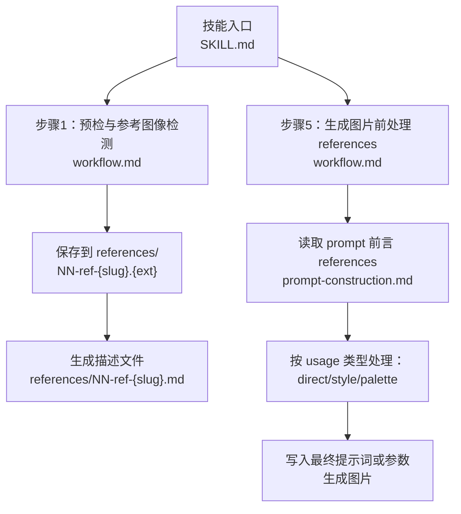
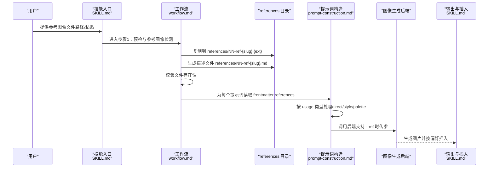
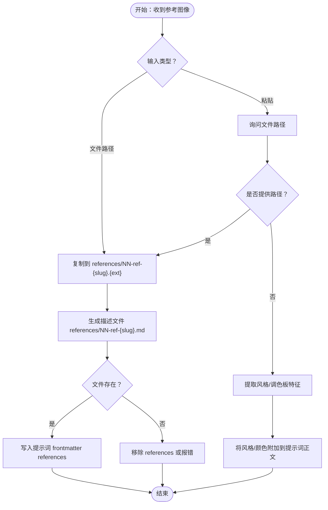
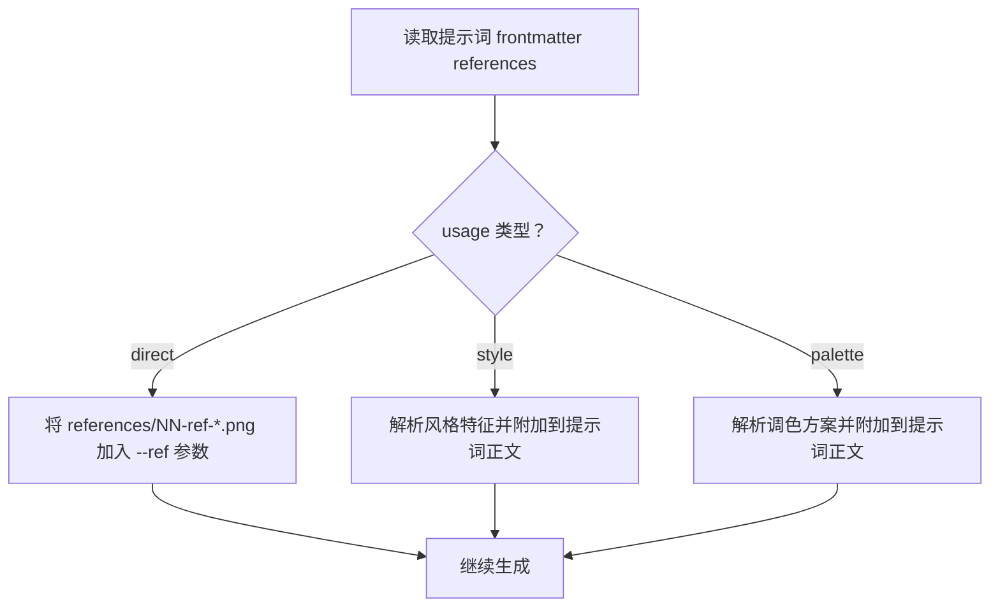
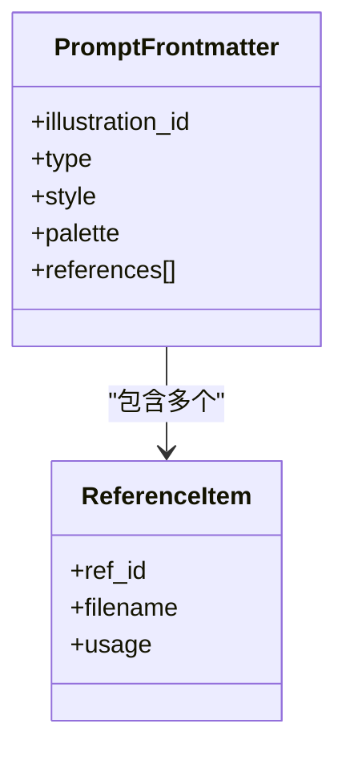
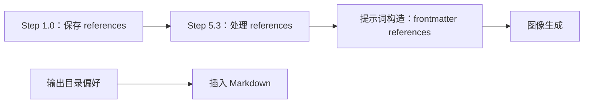

# 参考图像处理

<cite>
**本文引用的文件**
- [SKILL.md](file://.agents/skills/baoyu-article-illustrator/SKILL.md)
- [workflow.md](file://.agents/skills/baoyu-article-illustrator/references/workflow.md)
- [prompt-construction.md](file://.agents/skills/baoyu-article-illustrator/references/prompt-construction.md)
- [usage.md](file://.agents/skills/baoyu-article-illustrator/references/usage.md)
- [styles.md](file://.agents/skills/baoyu-article-illustrator/references/styles.md)
- [style-presets.md](file://.agents/skills/baoyu-article-illustrator/references/style-presets.md)
- [styles/sketch-notes.md](file://.agents/skills/baoyu-article-illustrator/references/styles/sketch-notes.md)
- [palettes/macaron.md](file://.agents/skills/baoyu-article-illustrator/references/palettes/macaron.md)
- [first-time-setup.md](file://.agents/skills/baoyu-article-illustrator/references/config/first-time-setup.md)
- [preferences-schema.md](file://.agents/skills/baoyu-article-illustrator/references/config/preferences-schema.md)
- [system.md](file://.agents/skills/baoyu-article-illustrator/prompts/system.md)
</cite>

## 目录
1. [简介](#简介)
2. [项目结构](#项目结构)
3. [核心组件](#核心组件)
4. [架构总览](#架构总览)
5. [详细组件分析](#详细组件分析)
6. [依赖关系分析](#依赖关系分析)
7. [性能与可扩展性](#性能与可扩展性)
8. [故障排查指南](#故障排查指南)
9. [结论](#结论)
10. [附录：最佳实践与处理技巧](#附录最佳实践与处理技巧)

## 简介
本文件面向 baoyu-article-illustrator 技能中的“参考图像处理”能力，系统阐述参考图像的检测、存储、描述与处理流程；详解 direct（直接）、style（风格）、palette（调色板）三种使用方式的差异与适用场景；说明参考图像文件的自动命名与保存规则（NN-ref-{slug}.{ext}）；解释如何在提示词 frontmatter 的 references 字段中配置；并从风格迁移、色彩匹配、构图参考等角度说明参考图像对插画生成质量与一致性的提升作用，最后给出选择与处理的最佳实践。

## 项目结构
参考图像处理位于 baoyu-article-illustrator 技能的参考资料与工作流文档中，核心涉及：
- 技能说明与工作流：SKILL.md、references/workflow.md
- 提示词构造与 references 配置：references/prompt-construction.md
- 样式与调色板规范：references/styles.md、references/palettes/*
- 使用方式与输出目录：references/usage.md、SKILL.md
- 首次配置与偏好：references/config/first-time-setup.md、references/config/preferences-schema.md
- 系统提示模板：prompts/system.md

图表来源
- [SKILL.md:51-56](file://.agents/skills/baoyu-article-illustrator/SKILL.md#L51-L56)
- [workflow.md:5-51](file://.agents/skills/baoyu-article-illustrator/references/workflow.md#L5-L51)
- [prompt-construction.md:7-49](file://.agents/skills/baoyu-article-illustrator/references/prompt-construction.md#L7-L49)

章节来源
- [SKILL.md:51-56](file://.agents/skills/baoyu-article-illustrator/SKILL.md#L51-L56)
- [workflow.md:5-51](file://.agents/skills/baoyu-article-illustrator/references/workflow.md#L5-L51)
- [prompt-construction.md:7-49](file://.agents/skills/baoyu-article-illustrator/references/prompt-construction.md#L7-L49)

## 核心组件
- 参考图像检测与保存：当用户提供参考图像时，系统会将其复制到 references/ 子目录，并生成对应的描述文件；仅当文件实际存在时才写入提示词 frontmatter 的 references 字段。
- references 前言字段：每个提示词文件的 frontmatter 可包含 references 列表，每项含 ref_id、filename、usage（direct/style/palette）。
- usage 处理策略：根据 usage 决定是传给后端作为 --ref 参数、还是将风格/色彩特征转为文本加入提示词。
- 自动命名与冲突处理：文件名采用 NN-ref-{slug}.{ext}，若冲突则追加时间戳后缀。
- 输出路径与插入：根据 EXTEND.md 的 default_output_dir 决定图片插入相对路径。

章节来源
- [workflow.md:17-51](file://.agents/skills/baoyu-article-illustrator/references/workflow.md#L17-L51)
- [prompt-construction.md:7-49](file://.agents/skills/baoyu-article-illustrator/references/prompt-construction.md#L7-L49)
- [SKILL.md:184-208](file://.agents/skills/baoyu-article-illustrator/SKILL.md#L184-L208)

## 架构总览
下图展示参考图像从输入到生成阶段的关键交互与决策点。

图表来源
- [SKILL.md:51-56](file://.agents/skills/baoyu-article-illustrator/SKILL.md#L51-L56)
- [workflow.md:17-51](file://.agents/skills/baoyu-article-illustrator/references/workflow.md#L17-L51)
- [prompt-construction.md:7-49](file://.agents/skills/baoyu-article-illustrator/references/prompt-construction.md#L7-L49)
- [SKILL.md:184-208](file://.agents/skills/baoyu-article-illustrator/SKILL.md#L184-L208)

## 详细组件分析

### 组件A：参考图像检测与保存（Step 1.0）
- 输入类型识别：文件路径、对话粘贴、无法提供路径（仅提取风格/调色板）。
- 文件命名与保存：references/NN-ref-{slug}.{ext}，其中 NN 递增编号，slug 来自用户描述或自动生成，冲突时追加时间戳。
- 描述文件：references/NN-ref-{slug}.md，包含 ref_id、filename 与简要说明。
- 前言 references 写入条件：仅当 references/NN-ref-{slug}.{ext} 实际存在时才写入提示词 frontmatter 的 references 字段；否则报错或转为文本附加。

图表来源
- [workflow.md:7-51](file://.agents/skills/baoyu-article-illustrator/references/workflow.md#L7-L51)
- [prompt-construction.md:21-28](file://.agents/skills/baoyu-article-illustrator/references/prompt-construction.md#L21-L28)

章节来源
- [workflow.md:7-51](file://.agents/skills/baoyu-article-illustrator/references/workflow.md#L7-L51)
- [prompt-construction.md:21-28](file://.agents/skills/baoyu-article-illustrator/references/prompt-construction.md#L21-L28)

### 组件B：usage 类型与处理策略（Step 5.3）
- direct：将参考图像作为主视觉参考，通过后端参数（如 --ref）传递给生成器，用于风格迁移与构图参考。
- style：仅提取风格特征（线条、纹理、情绪、排版等），将这些特征以文本形式加入提示词，不传入图像。
- palette：仅提取色彩方案，将颜色映射与语义加入提示词，不传入图像。

图表来源
- [workflow.md:350-376](file://.agents/skills/baoyu-article-illustrator/references/workflow.md#L350-L376)
- [prompt-construction.md:29-49](file://.agents/skills/baoyu-article-illustrator/references/prompt-construction.md#L29-L49)

章节来源
- [workflow.md:350-376](file://.agents/skills/baoyu-article-illustrator/references/workflow.md#L350-L376)
- [prompt-construction.md:29-49](file://.agents/skills/baoyu-article-illustrator/references/prompt-construction.md#L29-L49)

### 组件C：提示词构造与 references 前言
- frontmatter 结构：illustration_id、type、style、palette（可选）、references（仅当 references/ 文件存在时）。
- references 列表：每项包含 ref_id、filename、usage。
- 文本附加：当风格/调色板来自口头提取且无对应文件时，需将颜色与风格描述附加到提示词正文，而非 frontmatter references。

图表来源
- [prompt-construction.md:7-19](file://.agents/skills/baoyu-article-illustrator/references/prompt-construction.md#L7-L19)

章节来源
- [prompt-construction.md:7-19](file://.agents/skills/baoyu-article-illustrator/references/prompt-construction.md#L7-L19)

### 组件D：样式与调色板对生成的影响
- 样式（style）：决定线条、纹理、情绪、元素与排版等渲染规则。例如 sketch-notes 强调“手绘感、暖色纸张、柔和色块、简洁分节”。
- 调色板（palette）：覆盖样式的默认色彩，同时保留样式纹理描述。例如 macaron 软粉系配色与暖奶油背景。
- 建议：优先使用 style + palette 的组合，确保风格一致与色彩协调；必要时再引入 direct 参考图像进行构图或细节微调。

章节来源
- [styles.md:19-48](file://.agents/skills/baoyu-article-illustrator/references/styles.md#L19-L48)
- [styles/sketch-notes.md:14-41](file://.agents/skills/baoyu-article-illustrator/references/styles/sketch-notes.md#L14-L41)
- [palettes/macaron.md:10-29](file://.agents/skills/baoyu-article-illustrator/references/palettes/macaron.md#L10-L29)
- [prompt-construction.md:413-442](file://.agents/skills/baoyu-article-illustrator/references/prompt-construction.md#L413-L442)

## 依赖关系分析
- 工作流依赖：Step 1.0 的 references 保存是 Step 5.3 references 处理的前提；只有 frontmatter references 对应的实际文件存在，才能进入 direct/style/palette 的处理分支。
- 提示词构造依赖：frontmatter references 的存在与否直接影响是否将 references 写入提示词；否则需将风格/色彩附加到正文。
- 输出路径依赖：default_output_dir 决定图片插入相对路径，影响最终 Markdown 中的占位符。

图表来源
- [workflow.md:17-51](file://.agents/skills/baoyu-article-illustrator/references/workflow.md#L17-L51)
- [prompt-construction.md:21-28](file://.agents/skills/baoyu-article-illustrator/references/prompt-construction.md#L21-L28)
- [SKILL.md:184-208](file://.agents/skills/baoyu-article-illustrator/SKILL.md#L184-L208)

章节来源
- [workflow.md:17-51](file://.agents/skills/baoyu-article-illustrator/references/workflow.md#L17-L51)
- [prompt-construction.md:21-28](file://.agents/skills/baoyu-article-illustrator/references/prompt-construction.md#L21-L28)
- [SKILL.md:184-208](file://.agents/skills/baoyu-article-illustrator/SKILL.md#L184-L208)

## 性能与可扩展性
- 批量生成：当存在多个提示词文件且后端支持批量接口时，优先使用批量接口以减少往返开销；否则顺序生成。
- 后端能力探测：若后端不支持 --ref，则将风格/色彩转换为文本附加到提示词，避免失败。
- 文件校验：在生成前验证 references 文件是否存在，避免无效引用导致失败重试。

章节来源
- [SKILL.md:167-170](file://.agents/skills/baoyu-article-illustrator/SKILL.md#L167-L170)
- [workflow.md:350-376](file://.agents/skills/baoyu-article-illustrator/references/workflow.md#L350-L376)

## 故障排查指南
- references 写入后找不到文件：检查 references/NN-ref-{slug}.{ext} 是否存在；若不存在，删除 frontmatter 中的 references 字段或修正文件路径。
- 未保存 references 却写入 frontmatter：仅当文件实际保存到 references/ 目录时才写入 references；否则按“口头提取”流程将风格/色彩附加到提示词正文。
- 输出路径不正确：确认 EXTEND.md 的 default_output_dir 设置；不同值会影响 Markdown 中插入的相对路径。
- 语言不一致：若文章语言与偏好设置不同，需在确认步骤中选择正确的语言选项。
- 首次运行无 EXTEND.md：必须先完成首次配置流程，再继续后续步骤。

章节来源
- [prompt-construction.md:21-28](file://.agents/skills/baoyu-article-illustrator/references/prompt-construction.md#L21-L28)
- [SKILL.md:184-208](file://.agents/skills/baoyu-article-illustrator/SKILL.md#L184-L208)
- [first-time-setup.md:12-18](file://.agents/skills/baoyu-article-illustrator/references/config/first-time-setup.md#L12-L18)

## 结论
参考图像处理通过“检测—保存—描述—前言—处理—生成”的闭环，实现了风格迁移、色彩匹配与构图参考的统一管理。direct 适合需要严格构图或品牌元素的场景；style 与 palette 更侧重风格与色彩的一致性；三者结合可显著提升插画生成的质量与一致性。建议在偏好设置中明确输出目录与水印策略，并在提示词构造中遵循 frontmatter references 的约束，确保可复现与可追溯。

## 附录：最佳实践与处理技巧
- 选择策略
  - direct：当参考图像与目标插画高度相似（构图、主体、品牌元素）时使用，便于风格迁移与细节对齐。
  - style：当参考图像主要提供风格特征（线条、纹理、情绪）但无需具体图像时使用，适合快速风格对齐。
  - palette：当参考图像主要提供色彩方案时使用，适合统一色调与语义色。
- 命名与组织
  - 使用清晰的 slug 表达用途（如 diagram、brand、chart），避免与现有文件冲突；冲突时系统自动追加时间戳。
  - 将 references/ 下的文件与提示词一一对应，便于回溯与修改。
- 提示词构造
  - 优先使用 style + palette 组合；必要时再引入 direct。
  - 在 COLORS 与 STYLE 区域明确语义与限制，避免模型将颜色值渲染为可见文本标签。
- 后端适配
  - 若后端支持 --ref，优先使用；否则将风格/色彩转为文本附加到提示词。
  - 批量生成优先于逐个生成，提高效率。
- 偏好与输出
  - 在 EXTEND.md 中设置 default_output_dir，确保 Markdown 插入路径与项目结构一致。
  - 如需水印，提前在偏好中启用并设定位置与透明度。

章节来源
- [prompt-construction.md:70-121](file://.agents/skills/baoyu-article-illustrator/references/prompt-construction.md#L70-L121)
- [prompt-construction.md:453-460](file://.agents/skills/baoyu-article-illustrator/references/prompt-construction.md#L453-L460)
- [SKILL.md:184-208](file://.agents/skills/baoyu-article-illustrator/SKILL.md#L184-L208)
- [preferences-schema.md:69-76](file://.agents/skills/baoyu-article-illustrator/references/config/preferences-schema.md#L69-L76)