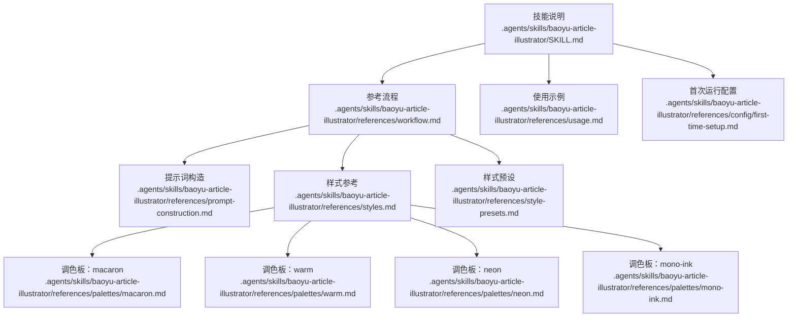
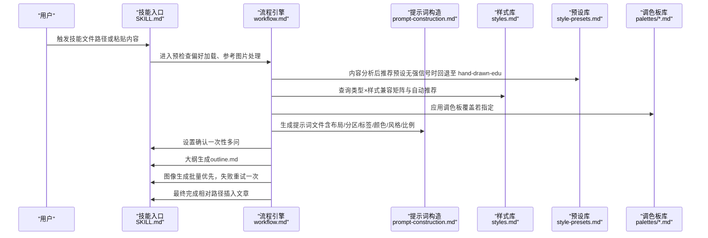
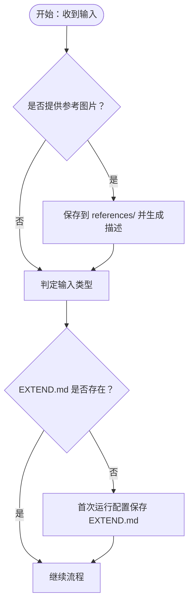
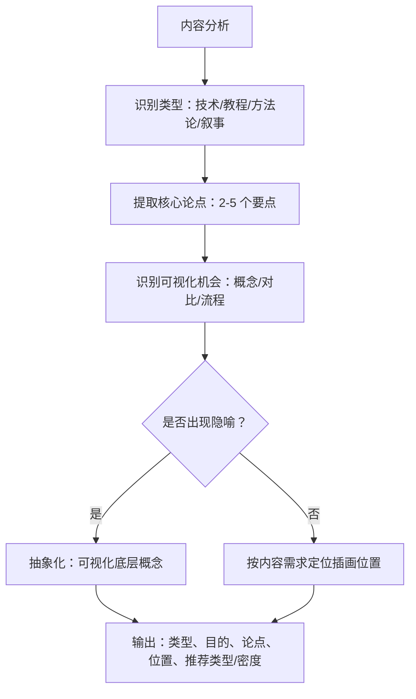
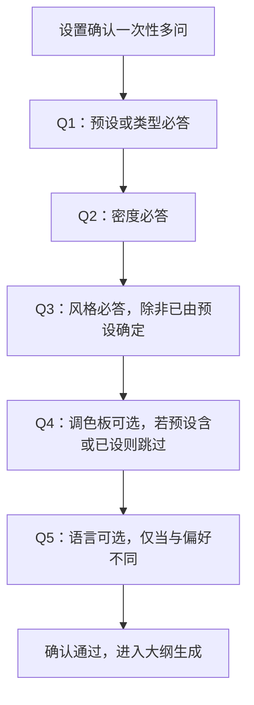
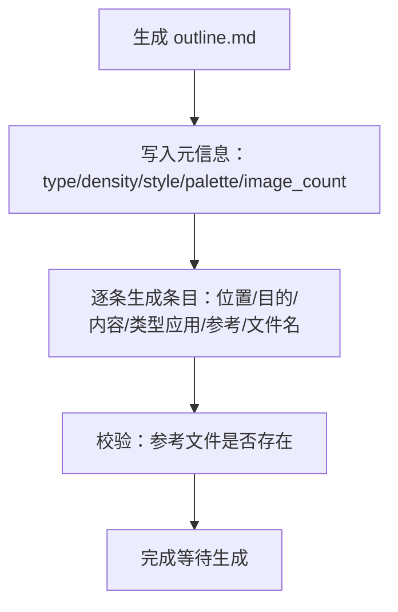
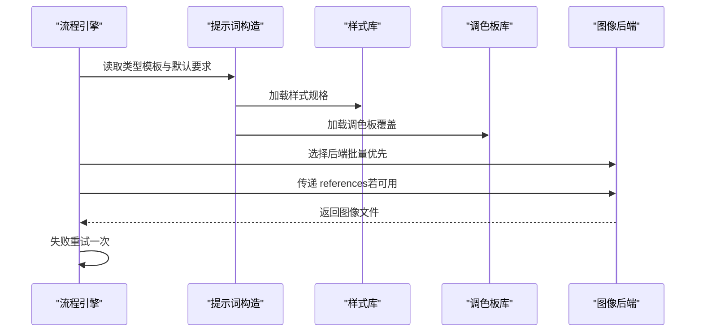
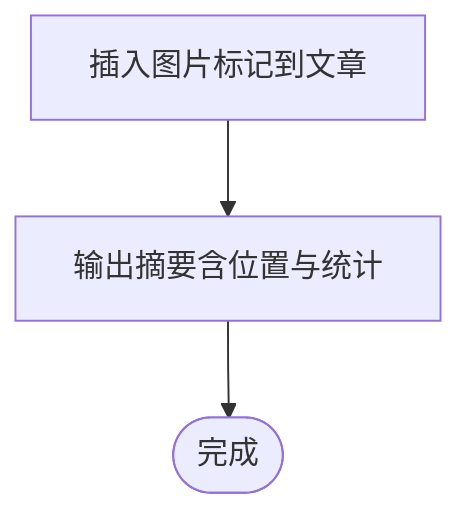
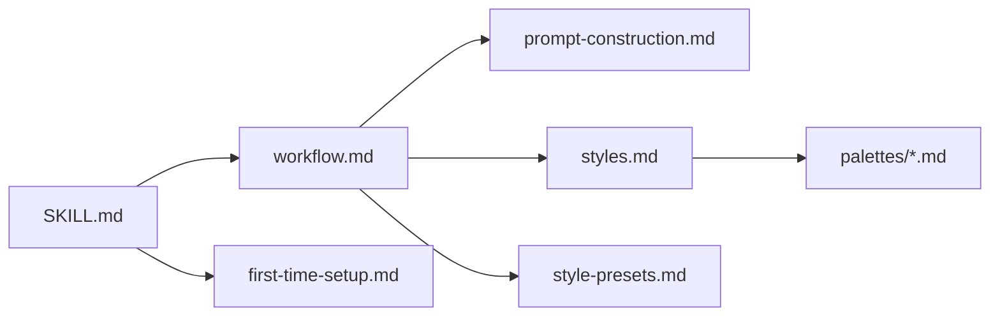

# 工作流程与分析框架

<cite>
**本文引用的文件**
- [SKILL.md](file://.agents/skills/baoyu-article-illustrator/SKILL.md)
- [workflow.md](file://.agents/skills/baoyu-article-illustrator/references/workflow.md)
- [prompt-construction.md](file://.agents/skills/baoyu-article-illustrator/references/prompt-construction.md)
- [styles.md](file://.agents/skills/baoyu-article-illustrator/references/styles.md)
- [usage.md](file://.agents/skills/baoyu-article-illustrator/references/usage.md)
- [first-time-setup.md](file://.agents/skills/baoyu-article-illustrator/references/config/first-time-setup.md)
- [style-presets.md](file://.agents/skills/baoyu-article-illustrator/references/style-presets.md)
- [macaron.md](file://.agents/skills/baoyu-article-illustrator/references/palettes/macaron.md)
- [warm.md](file://.agents/skills/baoyu-article-illustrator/references/palettes/warm.md)
- [neon.md](file://.agents/skills/baoyu-article-illustrator/references/palettes/neon.md)
- [mono-ink.md](file://.agents/skills/baoyu-article-illustrator/references/palettes/mono-ink.md)
</cite>

## 目录
1. [简介](#简介)
2. [项目结构](#项目结构)
3. [核心组件](#核心组件)
4. [架构总览](#架构总览)
5. [详细组件分析](#详细组件分析)
6. [依赖关系分析](#依赖关系分析)
7. [性能考量](#性能考量)
8. [故障排查指南](#故障排查指南)
9. [结论](#结论)
10. [附录](#附录)

## 简介
本文件系统化阐述 baoyu-article-illustrator 技能在“文章分析—插画生成”的全流程工作模式与分析框架。围绕六大阶段（预检查、内容分析、设置确认、大纲生成、图像生成、最终完成），逐项给出执行规则、关键决策点与质量保障机制，并重点解析内容分析中的文章类型识别（技术类、教程类、方法论类、叙事类）、核心论点提取与插画位置识别策略，以及分析框架如何判定“是否需要视觉辅助”和“插画的可视化目的”。文末提供流程示例与最佳实践建议，帮助用户在不同场景下稳定产出高质量插画。

## 项目结构
该技能位于 agents/skills/baoyu-article-illustrator 目录，核心由“技能说明 + 参考流程 + 提示词构造 + 样式与调色板 + 首次运行配置 + 使用示例”构成。整体采用“参考文件驱动”的结构：技能说明定义目标与策略，参考流程定义步骤与规则，提示词构造规范模板字段，样式与调色板提供风格一致性约束，首次运行配置确保偏好可复现，使用示例提供典型场景。

图表来源
- [.agents/skills/baoyu-article-illustrator/SKILL.md:1-241](file://.agents/skills/baoyu-article-illustrator/SKILL.md#L1-L241)
- [.agents/skills/baoyu-article-illustrator/references/workflow.md:1-432](file://.agents/skills/baoyu-article-illustrator/references/workflow.md#L1-L432)
- [.agents/skills/baoyu-article-illustrator/references/prompt-construction.md:1-460](file://.agents/skills/baoyu-article-illustrator/references/prompt-construction.md#L1-L460)
- [.agents/skills/baoyu-article-illustrator/references/styles.md:1-237](file://.agents/skills/baoyu-article-illustrator/references/styles.md#L1-L237)
- [.agents/skills/baoyu-article-illustrator/references/style-presets.md:1-88](file://.agents/skills/baoyu-article-illustrator/references/style-presets.md#L1-L88)
- [.agents/skills/baoyu-article-illustrator/references/palettes/macaron.md:1-34](file://.agents/skills/baoyu-article-illustrator/references/palettes/macaron.md#L1-L34)
- [.agents/skills/baoyu-article-illustrator/references/palettes/warm.md:1-33](file://.agents/skills/baoyu-article-illustrator/references/palettes/warm.md#L1-L33)
- [.agents/skills/baoyu-article-illustrator/references/palettes/neon.md:1-34](file://.agents/skills/baoyu-article-illustrator/references/palettes/neon.md#L1-L34)
- [.agents/skills/baoyu-article-illustrator/references/palettes/mono-ink.md:1-43](file://.agents/skills/baoyu-article-illustrator/references/palettes/mono-ink.md#L1-L43)
- [.agents/skills/baoyu-article-illustrator/references/usage.md:1-83](file://.agents/skills/baoyu-article-illustrator/references/usage.md#L1-L83)
- [.agents/skills/baoyu-article-illustrator/references/config/first-time-setup.md:1-141](file://.agents/skills/baoyu-article-illustrator/references/config/first-time-setup.md#L1-L141)

章节来源
- [.agents/skills/baoyu-article-illustrator/SKILL.md:1-241](file://.agents/skills/baoyu-article-illustrator/SKILL.md#L1-L241)
- [.agents/skills/baoyu-article-illustrator/references/workflow.md:1-432](file://.agents/skills/baoyu-article-illustrator/references/workflow.md#L1-L432)

## 核心组件
- 技能说明（SKILL.md）：定义目标、工具选择、确认策略、三维度（Type×Style×Palette）组合、输出目录与修改策略。
- 参考流程（workflow.md）：分步流程与规则，包含参考图片处理、输入类型判定、偏好加载、内容分析、设置确认、大纲生成、图像生成与最终插入。
- 提示词构造（prompt-construction.md）：统一的提示词文件格式、默认构图要求、颜色规范、人物渲染、文本规范、类型模板与水印集成。
- 样式参考（styles.md）：核心样式、样式矩阵、按类型自动推荐、样式特征描述与调色板兼容性。
- 样式预设（style-presets.md）：按类别与内容类型的预设推荐表，支持覆盖与回退策略。
- 调色板（palettes/*.md）：macaron、warm、neon、mono-ink 的背景、色彩、语义约束与适用场景。
- 使用示例（usage.md）：命令语法、选项、输入模式与典型场景示例。
- 首次运行配置（first-time-setup.md）：偏好初始化流程、保存位置与模板。

章节来源
- [.agents/skills/baoyu-article-illustrator/SKILL.md:84-241](file://.agents/skills/baoyu-article-illustrator/SKILL.md#L84-L241)
- [.agents/skills/baoyu-article-illustrator/references/workflow.md:1-432](file://.agents/skills/baoyu-article-illustrator/references/workflow.md#L1-L432)
- [.agents/skills/baoyu-article-illustrator/references/prompt-construction.md:1-460](file://.agents/skills/baoyu-article-illustrator/references/prompt-construction.md#L1-L460)
- [.agents/skills/baoyu-article-illustrator/references/styles.md:1-237](file://.agents/skills/baoyu-article-illustrator/references/styles.md#L1-L237)
- [.agents/skills/baoyu-article-illustrator/references/style-presets.md:1-88](file://.agents/skills/baoyu-article-illustrator/references/style-presets.md#L1-L88)
- [.agents/skills/baoyu-article-illustrator/references/palettes/macaron.md:1-34](file://.agents/skills/baoyu-article-illustrator/references/palettes/macaron.md#L1-L34)
- [.agents/skills/baoyu-article-illustrator/references/palettes/warm.md:1-33](file://.agents/skills/baoyu-article-illustrator/references/palettes/warm.md#L1-L33)
- [.agents/skills/baoyu-article-illustrator/references/palettes/neon.md:1-34](file://.agents/skills/baoyu-article-illustrator/references/palettes/neon.md#L1-L34)
- [.agents/skills/baoyu-article-illustrator/references/palettes/mono-ink.md:1-43](file://.agents/skills/baoyu-article-illustrator/references/palettes/mono-ink.md#L1-L43)
- [.agents/skills/baoyu-article-illustrator/references/usage.md:1-83](file://.agents/skills/baoyu-article-illustrator/references/usage.md#L1-L83)
- [.agents/skills/baoyu-article-illustrator/references/config/first-time-setup.md:1-141](file://.agents/skills/baoyu-article-illustrator/references/config/first-time-setup.md#L1-L141)

## 架构总览
下图展示从“文章输入”到“插画插入”的端到端流程，强调各阶段的输入、决策与输出，以及与参考文件的映射关系。

图表来源
- [.agents/skills/baoyu-article-illustrator/SKILL.md:84-241](file://.agents/skills/baoyu-article-illustrator/SKILL.md#L84-L241)
- [.agents/skills/baoyu-article-illustrator/references/workflow.md:1-432](file://.agents/skills/baoyu-article-illustrator/references/workflow.md#L1-L432)
- [.agents/skills/baoyu-article-illustrator/references/prompt-construction.md:1-460](file://.agents/skills/baoyu-article-illustrator/references/prompt-construction.md#L1-L460)
- [.agents/skills/baoyu-article-illustrator/references/styles.md:1-237](file://.agents/skills/baoyu-article-illustrator/references/styles.md#L1-L237)
- [.agents/skills/baoyu-article-illustrator/references/style-presets.md:1-88](file://.agents/skills/baoyu-article-illustrator/references/style-presets.md#L1-L88)
- [.agents/skills/baoyu-article-illustrator/references/palettes/macaron.md:1-34](file://.agents/skills/baoyu-article-illustrator/references/palettes/macaron.md#L1-L34)
- [.agents/skills/baoyu-article-illustrator/references/palettes/warm.md:1-33](file://.agents/skills/baoyu-article-illustrator/references/palettes/warm.md#L1-L33)
- [.agents/skills/baoyu-article-illustrator/references/palettes/neon.md:1-34](file://.agents/skills/baoyu-article-illustrator/references/palettes/neon.md#L1-L34)
- [.agents/skills/baoyu-article-illustrator/references/palettes/mono-ink.md:1-43](file://.agents/skills/baoyu-article-illustrator/references/palettes/mono-ink.md#L1-L43)

## 详细组件分析

### 预检查阶段（Step 1）
- 参考图片处理：若用户提供图片，必须保存到 references/ 并写入描述；若仅口头提取风格/调色，则直接追加到提示词正文，不写 frontmatter references。
- 输入类型判定：文件路径输入按偏好 default_output_dir 决定输出目录；粘贴内容输入强制独立目录 illustrations/{topic-slug}/。
- 偏好加载：优先级顺序查找 EXTEND.md，未找到则阻塞进入首次运行配置流程。
- 状态与配置：针对已有图像、更新方式等进行一次性询问，避免重复劳动。

图表来源
- [.agents/skills/baoyu-article-illustrator/references/workflow.md:5-110](file://.agents/skills/baoyu-article-illustrator/references/workflow.md#L5-L110)
- [.agents/skills/baoyu-article-illustrator/references/config/first-time-setup.md:1-141](file://.agents/skills/baoyu-article-illustrator/references/config/first-time-setup.md#L1-L141)

章节来源
- [.agents/skills/baoyu-article-illustrator/references/workflow.md:5-110](file://.agents/skills/baoyu-article-illustrator/references/workflow.md#L5-L110)
- [.agents/skills/baoyu-article-illustrator/references/config/first-time-setup.md:1-141](file://.agents/skills/baoyu-article-illustrator/references/config/first-time-setup.md#L1-L141)

### 内容分析（Step 2）
- 文章类型识别：技术类、教程类、方法论类、叙事类。结合内容信号与可视化目的，决定类型与密度。
- 核心论点提取：提炼 2–5 个主观点，作为插画可视化的“信息锚点”。
- 插画位置识别：优先核心论点、抽象概念、数据对比、流程步骤；避免直译隐喻、装饰性场景与泛泛而谈。
- 参考图片分析：对每张参考图分析风格特征、内容主体、适用位置与使用建议（direct/style/palette）。

图表来源
- [.agents/skills/baoyu-article-illustrator/references/workflow.md:114-165](file://.agents/skills/baoyu-article-illustrator/references/workflow.md#L114-L165)

章节来源
- [.agents/skills/baoyu-article-illustrator/references/workflow.md:114-165](file://.agents/skills/baoyu-article-illustrator/references/workflow.md#L114-L165)

### 设置确认（Step 3）
- 硬性门槛：必须在生成前完成确认，除非用户明确跳过（如“直接生成”等表达）。
- 一次性多问：最多 4 个问题，必问 Q1/Q2/Q3；若 Q1 选预设则跳过 Q3；若已设定 preferred_palette 或预设含调色则跳过 Q4。
- 推荐策略：无强信号时默认 hand-drawn-edu；按内容类型查 style-presets.md 推荐主/备预设；密度按长度与复杂度选择。
- 语言：当文章语言不同于 EXTEND.md 中 language 时，必须确认语言选项。

图表来源
- [.agents/skills/baoyu-article-illustrator/SKILL.md:127-142](file://.agents/skills/baoyu-article-illustrator/SKILL.md#L127-L142)
- [.agents/skills/baoyu-article-illustrator/references/workflow.md:167-252](file://.agents/skills/baoyu-article-illustrator/references/workflow.md#L167-L252)
- [.agents/skills/baoyu-article-illustrator/references/style-presets.md:62-88](file://.agents/skills/baoyu-article-illustrator/references/style-presets.md#L62-L88)

章节来源
- [.agents/skills/baoyu-article-illustrator/SKILL.md:127-142](file://.agents/skills/baoyu-article-illustrator/SKILL.md#L127-L142)
- [.agents/skills/baoyu-article-illustrator/references/workflow.md:167-252](file://.agents/skills/baoyu-article-illustrator/references/workflow.md#L167-L252)
- [.agents/skills/baoyu-article-illustrator/references/style-presets.md:62-88](file://.agents/skills/baoyu-article-illustrator/references/style-presets.md#L62-L88)

### 大纲生成（Step 4）
- 输出 outline.md，包含类型、密度、风格、调色板、图片数量与条目列表。
- 每条目需注明：位置、目的、视觉内容、类型应用、参考分配与使用方式、文件名。
- 参考图片：仅当 references/ 下实际存在文件时才写入 frontmatter；否则不写。

图表来源
- [.agents/skills/baoyu-article-illustrator/references/workflow.md:255-295](file://.agents/skills/baoyu-article-illustrator/references/workflow.md#L255-L295)

章节来源
- [.agents/skills/baoyu-article-illustrator/references/workflow.md:255-295](file://.agents/skills/baoyu-article-illustrator/references/workflow.md#L255-L295)

### 图像生成（Step 5）
- 提示词文件前置：每个插画必须先保存提示词文件，且文件名与类型一致；不得直接传入内联提示词。
- 模板与规范：严格遵循类型模板，包含布局、分区、标签（必须使用文章中的具体数字/术语/指标/引述）、颜色（语义化）、风格、比例。
- 参考处理：若 references/ 存在对应文件，则按 direct/style/palette 使用；若技能不支持 --ref 则转为文本描述。
- 批量优先：若后端支持批量接口，优先批量生成；否则顺序生成。
- 水印：若启用则在提示中加入水印指令。
- 失败重试：单图失败时自动重试一次。

图表来源
- [.agents/skills/baoyu-article-illustrator/references/workflow.md:297-397](file://.agents/skills/baoyu-article-illustrator/references/workflow.md#L297-L397)
- [.agents/skills/baoyu-article-illustrator/references/prompt-construction.md:1-460](file://.agents/skills/baoyu-article-illustrator/references/prompt-construction.md#L1-L460)
- [.agents/skills/baoyu-article-illustrator/references/styles.md:1-237](file://.agents/skills/baoyu-article-illustrator/references/styles.md#L1-L237)

章节来源
- [.agents/skills/baoyu-article-illustrator/references/workflow.md:297-397](file://.agents/skills/baoyu-article-illustrator/references/workflow.md#L297-L397)
- [.agents/skills/baoyu-article-illustrator/references/prompt-construction.md:1-460](file://.agents/skills/baoyu-article-illustrator/references/prompt-construction.md#L1-L460)

### 最终完成（Step 6）
- 更新文章：按 default_output_dir 计算相对路径，插入 Markdown 图片标记，alt 文本使用文章语言的简洁描述。
- 输出摘要：包含文章路径、类型/密度/风格/位置/生成统计与失败明细（如有）。

图表来源
- [.agents/skills/baoyu-article-illustrator/references/workflow.md:399-432](file://.agents/skills/baoyu-article-illustrator/references/workflow.md#L399-L432)

章节来源
- [.agents/skills/baoyu-article-illustrator/references/workflow.md:399-432](file://.agents/skills/baoyu-article-illustrator/references/workflow.md#L399-L432)

## 依赖关系分析
- 技能说明与流程：SKILL.md 定义总体策略，workflow.md 细化步骤与规则，二者耦合度高，共同决定行为边界。
- 提示词构造与样式/调色板：prompt-construction.md 强依赖 styles.md 的类型模板与风格规则，以及 palettes/*.md 的颜色覆盖与约束。
- 预设与内容分析：style-presets.md 在 Step 3 中用于根据内容类型推荐主/备预设，形成“内容→类型/风格/密度”的闭环。
- 配置与运行：first-time-setup.md 保证 EXTEND.md 的存在与正确性，避免后续流程被阻断。

图表来源
- [.agents/skills/baoyu-article-illustrator/SKILL.md:1-241](file://.agents/skills/baoyu-article-illustrator/SKILL.md#L1-L241)
- [.agents/skills/baoyu-article-illustrator/references/workflow.md:1-432](file://.agents/skills/baoyu-article-illustrator/references/workflow.md#L1-L432)
- [.agents/skills/baoyu-article-illustrator/references/prompt-construction.md:1-460](file://.agents/skills/baoyu-article-illustrator/references/prompt-construction.md#L1-L460)
- [.agents/skills/baoyu-article-illustrator/references/styles.md:1-237](file://.agents/skills/baoyu-article-illustrator/references/styles.md#L1-L237)
- [.agents/skills/baoyu-article-illustrator/references/style-presets.md:1-88](file://.agents/skills/baoyu-article-illustrator/references/style-presets.md#L1-L88)
- [.agents/skills/baoyu-article-illustrator/references/palettes/macaron.md:1-34](file://.agents/skills/baoyu-article-illustrator/references/palettes/macaron.md#L1-L34)
- [.agents/skills/baoyu-article-illustrator/references/palettes/warm.md:1-33](file://.agents/skills/baoyu-article-illustrator/references/palettes/warm.md#L1-L33)
- [.agents/skills/baoyu-article-illustrator/references/palettes/neon.md:1-34](file://.agents/skills/baoyu-article-illustrator/references/palettes/neon.md#L1-L34)
- [.agents/skills/baoyu-article-illustrator/references/palettes/mono-ink.md:1-43](file://.agents/skills/baoyu-article-illustrator/references/palettes/mono-ink.md#L1-L43)
- [.agents/skills/baoyu-article-illustrator/references/config/first-time-setup.md:1-141](file://.agents/skills/baoyu-article-illustrator/references/config/first-time-setup.md#L1-L141)

章节来源
- [.agents/skills/baoyu-article-illustrator/SKILL.md:1-241](file://.agents/skills/baoyu-article-illustrator/SKILL.md#L1-L241)
- [.agents/skills/baoyu-article-illustrator/references/workflow.md:1-432](file://.agents/skills/baoyu-article-illustrator/references/workflow.md#L1-L432)
- [.agents/skills/baoyu-article-illustrator/references/prompt-construction.md:1-460](file://.agents/skills/baoyu-article-illustrator/references/prompt-construction.md#L1-L460)
- [.agents/skills/baoyu-article-illustrator/references/styles.md:1-237](file://.agents/skills/baoyu-article-illustrator/references/styles.md#L1-L237)
- [.agents/skills/baoyu-article-illustrator/references/style-presets.md:1-88](file://.agents/skills/baoyu-article-illustrator/references/style-presets.md#L1-L88)
- [.agents/skills/baoyu-article-illustrator/references/palettes/macaron.md:1-34](file://.agents/skills/baoyu-article-illustrator/references/palettes/macaron.md#L1-L34)
- [.agents/skills/baoyu-article-illustrator/references/palettes/warm.md:1-33](file://.agents/skills/baoyu-article-illustrator/references/palettes/warm.md#L1-L33)
- [.agents/skills/baoyu-article-illustrator/references/palettes/neon.md:1-34](file://.agents/skills/baoyu-article-illustrator/references/palettes/neon.md#L1-L34)
- [.agents/skills/baoyu-article-illustrator/references/palettes/mono-ink.md:1-43](file://.agents/skills/baoyu-article-illustrator/references/palettes/mono-ink.md#L1-L43)
- [.agents/skills/baoyu-article-illustrator/references/config/first-time-setup.md:1-141](file://.agents/skills/baoyu-article-illustrator/references/config/first-time-setup.md#L1-L141)

## 性能考量
- 批量优先：当后端支持批量接口时优先使用，减少子代理开销与往返时间。
- 顺序生成：在无批量能力时采用顺序生成，便于调试与资源控制。
- 失败重试：单图失败自动重试一次，降低整体失败率。
- 文件组织：严格的文件命名与目录结构（outline.md、prompts/、NN-type-slug.png）提升可维护性与可追溯性。

## 故障排查指南
- 提示词缺失：若提示词文件未保存，流程会阻塞；请先保存再执行生成。
- 参考文件缺失：frontmatter 中列出 references/ 文件但实际不存在，需修正 frontmatter 或删除 references 字段。
- 后端不可用：若首选后端不可用，按技能说明的“图像生成工具”规则选择替代方案或提示用户。
- 语言不匹配：当文章语言与偏好 language 不一致，必须在设置确认阶段明确选择。
- 输出路径冲突：粘贴内容模式下，若目标目录存在同名源文件，会自动备份；请检查备份文件以避免覆盖。

章节来源
- [.agents/skills/baoyu-article-illustrator/references/workflow.md:327-397](file://.agents/skills/baoyu-article-illustrator/references/workflow.md#L327-L397)
- [.agents/skills/baoyu-article-illustrator/references/usage.md:1-83](file://.agents/skills/baoyu-article-illustrator/references/usage.md#L1-L83)

## 结论
baoyu-article-illustrator 将“内容分析—风格选择—提示词构建—图像生成—文章插入”形成闭环，通过三维度（Type×Style×Palette）与预设体系实现风格一致性，通过严格的提示词模板与参考图片处理确保可复现性与可控性。其分析框架强调“抽象化隐喻、聚焦核心论点、按需定位插画”，并在每一步提供明确的规则与回退策略，适合在多样化文章类型中稳定产出高质量插画。

## 附录

### 实际流程示例（示例一：技术类文章）
- 输入：技术文章（API 设计）
- 步骤：
  1) 预检查：加载 EXTEND.md，保存参考图片（若有），判定输出目录。
  2) 内容分析：识别为技术类，核心论点为“设计原则、数据流、错误处理”；建议位置在“架构图解处”“数据流说明处”“错误处理策略处”。
  3) 设置确认：推荐预设 tech-explainer（infographic + blueprint），密度 balanced，语言与偏好一致。
  4) 大纲生成：生成 outline.md，标注各插画的目的、视觉内容与参考分配。
  5) 图像生成：按类型模板构造提示词，保存 prompts/NN-infographic-*.md，选择后端批量生成。
  6) 最终完成：相对路径插入文章，输出摘要。

章节来源
- [.agents/skills/baoyu-article-illustrator/references/style-presets.md:11-19](file://.agents/skills/baoyu-article-illustrator/references/style-presets.md#L11-L19)
- [.agents/skills/baoyu-article-illustrator/references/workflow.md:114-165](file://.agents/skills/baoyu-article-illustrator/references/workflow.md#L114-L165)
- [.agents/skills/baoyu-article-illustrator/references/prompt-construction.md:124-174](file://.agents/skills/baoyu-article-illustrator/references/prompt-construction.md#L124-L174)

### 实际流程示例（示例二：教程类文章）
- 输入：教程文章（部署指南）
- 步骤：
  1) 预检查：粘贴内容模式，输出目录为 illustrations/{topic-slug}/。
  2) 内容分析：识别为教程类，核心论点为“前置条件、安装步骤、验证方法”；建议位置在“步骤之间”“关键节点”。
  3) 设置确认：推荐预设 tutorial（flowchart + vector-illustration），密度 rich。
  4) 大纲生成：生成 outline.md，标注“流程图”“步骤连接”“关键节点”。
  5) 图像生成：按 flowchart 模板构造提示词，必要时使用 references（direct/style/palette）。
  6) 最终完成：相对路径插入文章，输出摘要。

章节来源
- [.agents/skills/baoyu-article-illustrator/references/style-presets.md:26-28](file://.agents/skills/baoyu-article-illustrator/references/style-presets.md#L26-L28)
- [.agents/skills/baoyu-article-illustrator/references/workflow.md:205-228](file://.agents/skills/baoyu-article-illustrator/references/workflow.md#L205-L228)
- [.agents/skills/baoyu-article-illustrator/references/prompt-construction.md:205-228](file://.agents/skills/baoyu-article-illustrator/references/prompt-construction.md#L205-L228)

### 实际流程示例（示例三：叙事类文章）
- 输入：个人故事（成长经历）
- 步骤：
  1) 预检查：加载 EXTEND.md，保存参考图片（若有）。
  2) 内容分析：识别为叙事类，核心论点为“转折点、情感变化、收获总结”；建议位置在“关键时刻”“情感高潮”。
  3) 设置确认：推荐预设 storytelling（scene + warm），密度 per-section。
  4) 大纲生成：生成 outline.md，标注“氛围营造”“情绪表达”“象征性场景”。
  5) 图像生成：按 scene 模板构造提示词，必要时使用 references（palette）。
  6) 最终完成：相对路径插入文章，输出摘要。

章节来源
- [.agents/skills/baoyu-article-illustrator/references/style-presets.md:49-51](file://.agents/skills/baoyu-article-illustrator/references/style-presets.md#L49-L51)
- [.agents/skills/baoyu-article-illustrator/references/workflow.md:192-214](file://.agents/skills/baoyu-article-illustrator/references/workflow.md#L192-L214)
- [.agents/skills/baoyu-article-illustrator/references/prompt-construction.md:192-204](file://.agents/skills/baoyu-article-illustrator/references/prompt-construction.md#L192-L204)

### 最佳实践建议
- 明确“是否需要视觉辅助”：仅在读者理解存在认知负担、抽象概念或复杂流程时添加插画。
- 确定“插画的可视化目的”：信息传达（数据/结构）、过程演示（流程/步骤）、情感共鸣（场景/隐喻）。
- 保持风格一致性：优先使用预设；若自定义风格，确保与类型兼容并符合样式矩阵。
- 严格使用文章数据：标签必须使用原文中的具体数字、术语、指标、引述，避免泛泛而谈。
- 控制颜色语义：按调色板规范使用颜色，避免在图像中显示颜色名称、十六进制值或角色标签。
- 参考图片策略：尽量保存到 references/ 并在 frontmatter 中声明；若无法保存，口头提取风格/调色并直接写入提示词正文。
- 批量优先：在后端支持时优先批量生成，提高效率与一致性。

章节来源
- [.agents/skills/baoyu-article-illustrator/references/prompt-construction.md:70-121](file://.agents/skills/baoyu-article-illustrator/references/prompt-construction.md#L70-L121)
- [.agents/skills/baoyu-article-illustrator/references/styles.md:51-96](file://.agents/skills/baoyu-article-illustrator/references/styles.md#L51-L96)
- [.agents/skills/baoyu-article-illustrator/references/palettes/macaron.md:27-29](file://.agents/skills/baoyu-article-illustrator/references/palettes/macaron.md#L27-L29)
- [.agents/skills/baoyu-article-illustrator/references/palettes/warm.md:26-28](file://.agents/skills/baoyu-article-illustrator/references/palettes/warm.md#L26-L28)
- [.agents/skills/baoyu-article-illustrator/references/palettes/neon.md:27-29](file://.agents/skills/baoyu-article-illustrator/references/palettes/neon.md#L27-L29)
- [.agents/skills/baoyu-article-illustrator/references/palettes/mono-ink.md:25-27](file://.agents/skills/baoyu-article-illustrator/references/palettes/mono-ink.md#L25-L27)