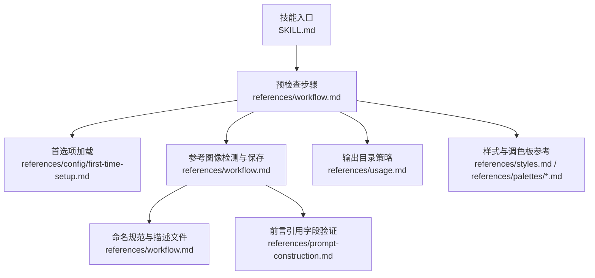
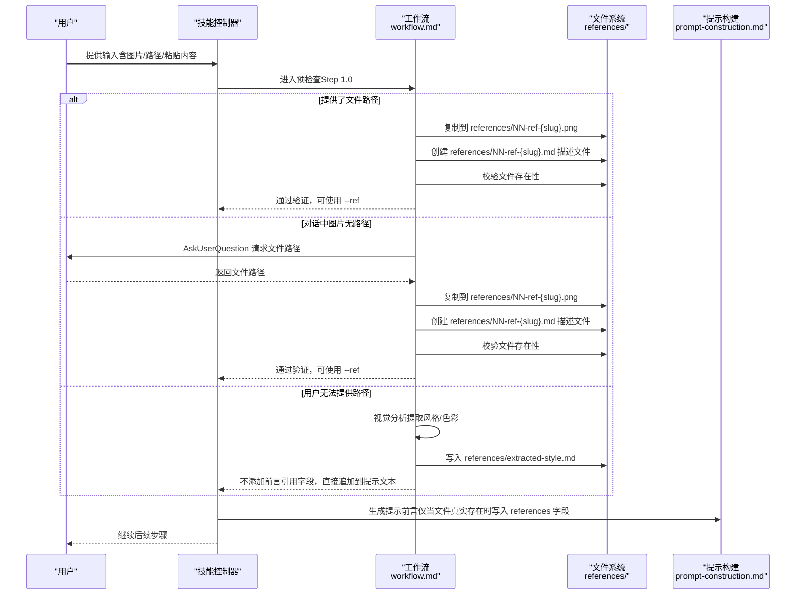
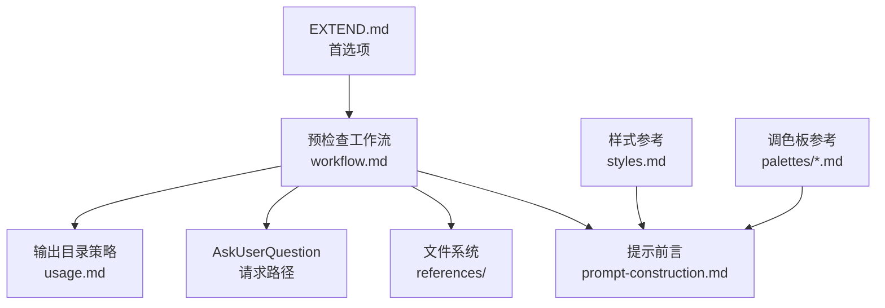

# 阶段一：预检查

<cite>
**本文档引用的文件**
- [SKILL.md](file://.agents/skills/baoyu-article-illustrator/SKILL.md)
- [workflow.md](file://.agents/skills/baoyu-article-illustrator/references/workflow.md)
- [first-time-setup.md](file://.agents/skills/baoyu-article-illustrator/references/config/first-time-setup.md)
- [prompt-construction.md](file://.agents/skills/baoyu-article-illustrator/references/prompt-construction.md)
- [styles.md](file://.agents/skills/baoyu-article-illustrator/references/styles.md)
- [style-presets.md](file://.agents/skills/baoyu-article-illustrator/references/style-presets.md)
- [usage.md](file://.agents/skills/baoyu-article-illustrator/references/usage.md)
- [sketch-notes.md](file://.agents/skills/baoyu-article-illustrator/references/styles/sketch-notes.md)
- [macaron.md](file://.agents/skills/baoyu-article-illustrator/references/palettes/macaron.md)
</cite>

## 目录
1. [简介](#简介)
2. [项目结构](#项目结构)
3. [核心组件](#核心组件)
4. [架构总览](#架构总览)
5. [详细组件分析](#详细组件分析)
6. [依赖关系分析](#依赖关系分析)
7. [性能考量](#性能考量)
8. [故障排查指南](#故障排查指南)
9. [结论](#结论)
10. [附录](#附录)

## 简介
本阶段文档聚焦 baoyu-article-illustrator 技能在“预检查”阶段对“参考图像”的检测与保存机制，覆盖三种典型输入类型：
- 提供了文件路径（本地或网络）
- 对话中粘贴/上传的图片（无路径）
- 用户无法提供路径的情况

文档将系统阐述：
- 每种输入类型的处理流程与操作步骤
- 文件命名规范与描述文件格式
- 前言中“引用字段”的添加时机与验证机制
- 口头提取风格与色彩时的处理方式
- 实际操作示例与最佳实践建议

## 项目结构
技能相关资料集中于 .agents/skills/baoyu-article-illustrator/references 下，包含工作流、首选项设置、样式与调色板等文档；技能元数据与使用规则位于 SKILL.md。

图表来源
- [SKILL.md:95-113](file://.agents/skills/baoyu-article-illustrator/SKILL.md#L95-L113)
- [workflow.md:1-53](file://.agents/skills/baoyu-article-illustrator/references/workflow.md#L1-L53)
- [usage.md:35-51](file://.agents/skills/baoyu-article-illustrator/references/usage.md#L35-L51)

章节来源
- [SKILL.md:95-113](file://.agents/skills/baoyu-article-illustrator/SKILL.md#L95-L113)
- [workflow.md:1-53](file://.agents/skills/baoyu-article-illustrator/references/workflow.md#L1-L53)
- [usage.md:35-51](file://.agents/skills/baoyu-article-illustrator/references/usage.md#L35-L51)

## 核心组件
- 预检查工作流：定义参考图像检测、保存与验证的步骤与规则
- 首选项加载：确保 EXTEND.md 存在并完成首次设置
- 命名与描述：统一的文件命名与描述文件格式
- 引用字段与验证：仅当文件真实存在时才写入前言引用字段
- 输出目录策略：根据输入类型选择合适的输出位置
- 样式与调色板：为口头提取的风格与色彩提供参考与约束

章节来源
- [workflow.md:1-53](file://.agents/skills/baoyu-article-illustrator/references/workflow.md#L1-L53)
- [prompt-construction.md:21-49](file://.agents/skills/baoyu-article-illustrator/references/prompt-construction.md#L21-L49)
- [usage.md:35-51](file://.agents/skills/baoyu-article-illustrator/references/usage.md#L35-L51)

## 架构总览
下图展示“预检查”阶段从输入到参考图像落盘与验证的关键交互：

图表来源
- [workflow.md:5-51](file://.agents/skills/baoyu-article-illustrator/references/workflow.md#L5-L51)
- [prompt-construction.md:21-28](file://.agents/skills/baoyu-article-illustrator/references/prompt-construction.md#L21-L28)

## 详细组件分析

### 输入类型与处理流程
- 文件路径提供
  - 步骤：复制到 references/NN-ref-{slug}.png；创建描述文件 references/NN-ref-{slug}.md；校验文件存在性
  - 结果：可在提示前言中添加 references 字段，并通过 --ref 使用
- 对话中图片（无路径）
  - 步骤：请求用户提供文件路径；收到路径后执行上述“文件路径提供”的相同流程
  - 结果：同上
- 用户无法提供路径
  - 步骤：视觉分析提取风格与色彩；写入 references/extracted-style.md；不添加前言引用字段，直接将风格/色彩追加到提示文本
  - 结果：不使用 --ref，避免错误引用

章节来源
- [workflow.md:7-27](file://.agents/skills/baoyu-article-illustrator/references/workflow.md#L7-L27)

### 文件命名规范与描述文件格式
- 图像文件命名：references/NN-ref-{slug}.png
  - NN：两位递增编号（如 01, 02…）
  - slug：主题关键词短语，kebab-case，冲突时追加日期时间戳
- 描述文件命名：references/NN-ref-{slug}.md
  - YAML 前言包含 ref_id 与 filename
  - 正文为用户描述或自动生成描述
- 示例与模板参见工作流文档中的“描述文件格式”与“验证”部分

章节来源
- [workflow.md:17-36](file://.agents/skills/baoyu-article-illustrator/references/workflow.md#L17-L36)

### 前言引用字段的添加时机与验证机制
- 仅当文件真实保存至 references/ 目录时，才在提示前言中添加 references 字段
- 若前言中标注了 references，但对应文件不存在，则视为错误，需修正前言或移除引用字段
- 验证方法：在写入前先测试文件是否存在，再决定是否写入前言

章节来源
- [prompt-construction.md:21-28](file://.agents/skills/baoyu-article-illustrator/references/prompt-construction.md#L21-L28)
- [workflow.md:341-359](file://.agents/skills/baoyu-article-illustrator/references/workflow.md#L341-L359)

### 口头提取风格与色彩的处理方式
- 当无法获取文件路径时，对图片进行视觉分析，提取颜色与风格特征
- 将提取结果写入 references/extracted-style.md
- 在提示文本中直接追加“颜色”和“风格”说明，不写入前言引用字段
- 该做法避免了错误引用与后续处理复杂度

章节来源
- [workflow.md:22-27](file://.agents/skills/baoyu-article-illustrator/references/workflow.md#L22-L27)

### 输出目录策略与粘贴内容处理
- 文件路径输入：遵循 EXTEND.md 的 default_output_dir 设置（same-dir、imgs-subdir、illustrations-subdir、independent）
- 粘贴内容输入：固定使用 illustrations/{topic-slug}/ 目录，并在目标目录存在 source.md 时自动备份重命名
- 该策略确保粘贴模式的独立性与可追溯性

章节来源
- [usage.md:35-51](file://.agents/skills/baoyu-article-illustrator/references/usage.md#L35-L51)
- [workflow.md:54-62](file://.agents/skills/baoyu-article-illustrator/references/workflow.md#L54-L62)

### 首选项加载与首次设置
- 首选项文件 EXTEND.md 必须存在且可解析，否则必须先完成首次设置流程
- 首次设置涵盖水印、默认风格、输出目录、保存位置等关键偏好
- 完成设置后方可继续参考图像检测与后续步骤

章节来源
- [SKILL.md:97-112](file://.agents/skills/baoyu-article-illustrator/SKILL.md#L97-L112)
- [first-time-setup.md:10-18](file://.agents/skills/baoyu-article-illustrator/references/config/first-time-setup.md#L10-L18)

### 样式与调色板参考
- 样式参考：通过 styles.md 与各样式文件（如 sketch-notes.md）明确风格特性、兼容类型与渲染规则
- 调色板参考：通过 palettes/*.md 明确颜色与背景约束，支持在提示中替换默认色
- 口头提取的风格/色彩可据此约束，避免与样式/调色板冲突

章节来源
- [styles.md:1-237](file://.agents/skills/baoyu-article-illustrator/references/styles.md#L1-L237)
- [sketch-notes.md:1-92](file://.agents/skills/baoyu-article-illustrator/references/styles/sketch-notes.md#L1-L92)
- [macaron.md:1-34](file://.agents/skills/baoyu-article-illustrator/references/palettes/macaron.md#L1-L34)

## 依赖关系分析
- 预检查依赖 EXTEND.md 的存在与正确配置
- 参考图像检测依赖 AskUserQuestion 工具（在无路径时请求路径）
- 前言引用字段依赖文件系统中的实际文件存在性
- 输出目录策略依赖 usage.md 中的规则与 EXTEND.md 的配置

图表来源
- [SKILL.md:97-112](file://.agents/skills/baoyu-article-illustrator/SKILL.md#L97-L112)
- [workflow.md:5-51](file://.agents/skills/baoyu-article-illustrator/references/workflow.md#L5-L51)
- [prompt-construction.md:21-28](file://.agents/skills/baoyu-article-illustrator/references/prompt-construction.md#L21-L28)
- [usage.md:35-51](file://.agents/skills/baoyu-article-illustrator/references/usage.md#L35-L51)

## 性能考量
- 避免不必要的文件复制与 IO：仅在确认路径有效后执行复制
- 减少重复校验：在复制完成后一次性校验文件存在性
- 降低提示构建成本：口头提取时直接注入文本，减少额外文件读取
- 批量处理：若后续步骤支持批量接口，优先使用批量以提升吞吐

## 故障排查指南
- 问题：提示前言包含 references，但对应文件不存在
  - 排查：检查 references/NN-ref-{slug}.png 是否存在
  - 处理：删除前言中的 references 字段或补充缺失文件
- 问题：粘贴内容模式下目标目录已有 source.md
  - 排查：确认是否触发了备份重命名
  - 处理：保留备份文件，继续生成新内容
- 问题：未完成首次设置即开始参考图像检测
  - 排查：检查 EXTEND.md 是否存在
  - 处理：先完成首次设置，再继续后续步骤
- 问题：口头提取风格/色彩与样式/调色板冲突
  - 排查：核对样式与调色板约束
  - 处理：以样式/调色板为准，必要时调整提示文本

章节来源
- [workflow.md:341-359](file://.agents/skills/baoyu-article-illustrator/references/workflow.md#L341-L359)
- [workflow.md:61](file://.agents/skills/baoyu-article-illustrator/references/workflow.md#L61)
- [first-time-setup.md:12-18](file://.agents/skills/baoyu-article-illustrator/references/config/first-time-setup.md#L12-L18)

## 结论
预检查阶段通过严格的输入类型识别、文件命名与描述规范、前言引用字段的条件写入以及输出目录策略，确保参考图像的可靠落地与后续生成流程的稳定性。对于无法提供路径的情况，采用“口头提取 + 文本注入”的方式，既保证一致性又避免错误引用。配合 EXTEND.md 的首选项与样式/调色板参考，可进一步提升生成质量与可追溯性。

## 附录

### 实际操作示例与最佳实践
- 文件路径提供
  - 步骤：复制到 references/01-ref-example.png；创建 01-ref-example.md；校验存在性；在提示前言中添加 references 字段
  - 最佳实践：确保 slug 唯一且简洁；冲突时自动追加时间戳
- 对话中图片（无路径）
  - 步骤：请求用户返回路径；收到路径后执行“文件路径提供”的相同流程
  - 最佳实践：在 AskUserQuestion 中明确说明需要完整路径（本地或网络均可）
- 用户无法提供路径
  - 步骤：视觉分析提取风格/色彩；写入 extracted-style.md；在提示文本中追加说明
  - 最佳实践：尽量提供可复现的描述（如主色、风格关键词），避免模糊表述

章节来源
- [workflow.md:7-27](file://.agents/skills/baoyu-article-illustrator/references/workflow.md#L7-L27)
- [prompt-construction.md:37-49](file://.agents/skills/baoyu-article-illustrator/references/prompt-construction.md#L37-L49)