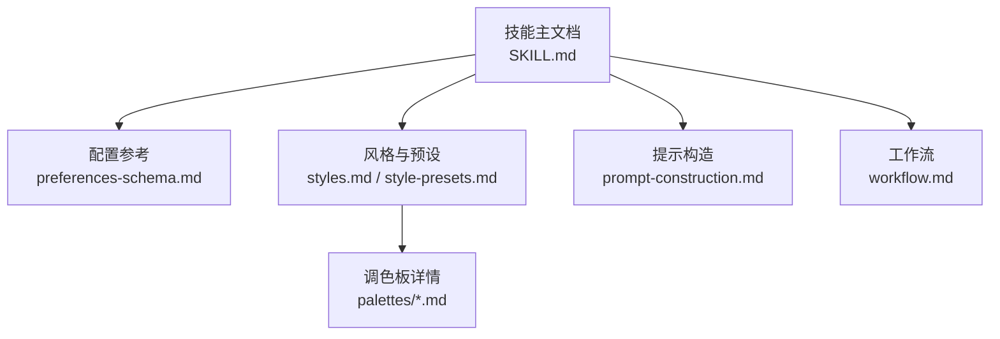
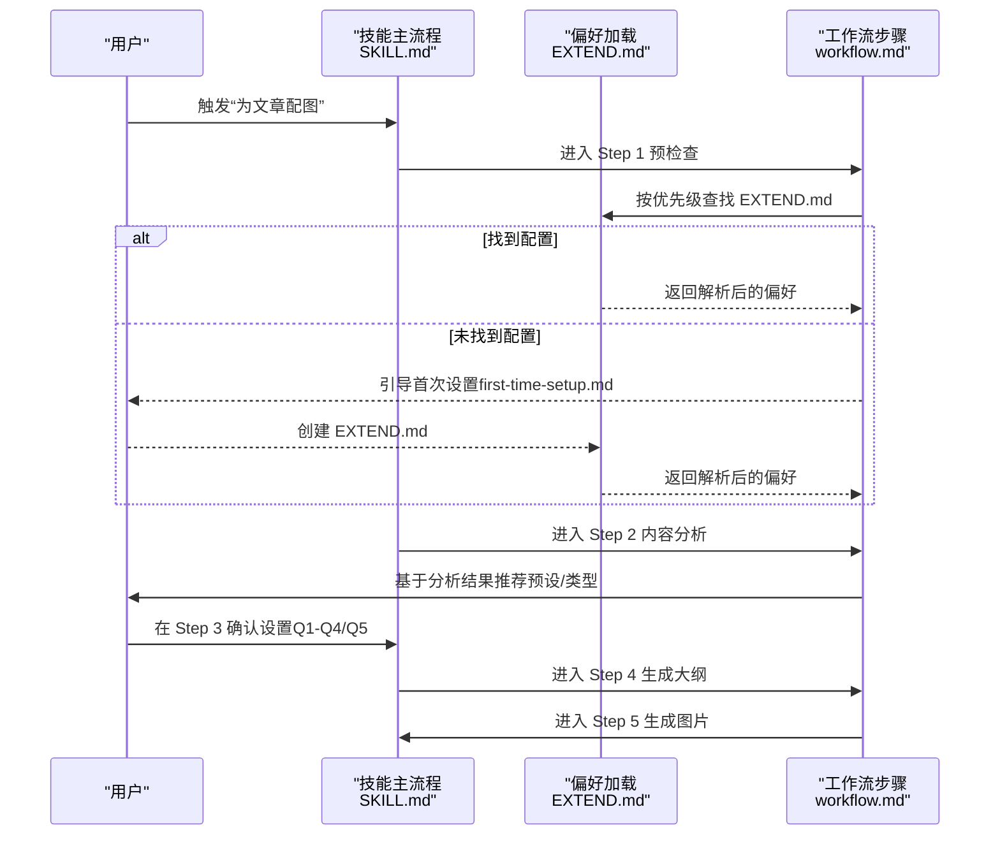
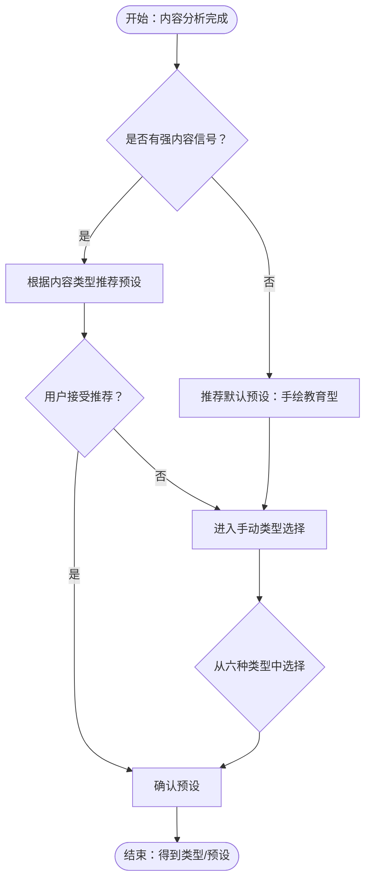

# 阶段三：确认设置

<cite>
**本文引用的文件**
- [SKILL.md](file://.agents/skills/baoyu-article-illustrator/SKILL.md)
- [preferences-schema.md](file://.agents/skills/baoyu-article-illustrator/references/config/preferences-schema.md)
- [first-time-setup.md](file://.agents/skills/baoyu-article-illustrator/references/config/first-time-setup.md)
- [style-presets.md](file://.agents/skills/baoyu-article-illustrator/references/style-presets.md)
- [styles.md](file://.agents/skills/baoyu-article-illustrator/references/styles.md)
- [prompt-construction.md](file://.agents/skills/baoyu-article-illustrator/references/prompt-construction.md)
- [workflow.md](file://.agents/skills/baoyu-article-illustrator/references/workflow.md)
- [macaron.md](file://.agents/skills/baoyu-article-illustrator/references/palettes/macaron.md)
- [warm.md](file://.agents/skills/baoyu-article-illustrator/references/palettes/warm.md)
- [neon.md](file://.agents/skills/baoyu-article-illustrator/references/palettes/neon.md)
- [mono-ink.md](file://.agents/skills/baoyu-article-illustrator/references/palettes/mono-ink.md)
</cite>

## 目录
1. [简介](#简介)
2. [项目结构](#项目结构)
3. [核心组件](#核心组件)
4. [架构总览](#架构总览)
5. [详细组件分析](#详细组件分析)
6. [依赖关系分析](#依赖关系分析)
7. [性能考量](#性能考量)
8. [故障排查指南](#故障排查指南)
9. [结论](#结论)
10. [附录](#附录)

## 简介
本阶段文档聚焦 baoyu-article-illustrator 技能在“确认设置”阶段的四问配置流程，围绕以下目标展开：
- Q1：预设或类型选择（基于内容分析推荐预设，否则手动选择类型）
- Q2：密度选择（最小、平衡、按章节、丰富四种选项）
- Q3：风格选择（基于首选风格和兼容性矩阵）
- Q4：调色板选择（默认、马卡龙、暖色调、霓虹等）

同时，文档将系统阐述 EXTEND.md 的优先级与配置项、核心风格的选择原则、预设与手动设置的区别、参考图像的使用建议，并给出设置决策的最佳实践与常见场景处理方案。

## 项目结构
baoyu-article-illustrator 技能在“确认设置”阶段依赖于以下关键参考文件：
- 技能主文档：定义工作流、确认策略、后端选择规则、输出目录等
- 配置参考：偏好模式 EXTEND.md 的字段、默认值与示例
- 风格与预设：风格库、兼容性矩阵、预设映射表
- 提示构造：提示模板、颜色规范、参考图像用法
- 工作流：步骤定义与执行顺序



图表来源
- [SKILL.md: 84-142:84-142](file://.agents/skills/baoyu-article-illustrator/SKILL.md#L84-L142)
- [preferences-schema.md: 1-133:1-133](file://.agents/skills/baoyu-article-illustrator/references/config/preferences-schema.md#L1-L133)
- [styles.md: 1-237:1-237](file://.agents/skills/baoyu-article-illustrator/references/styles.md#L1-L237)
- [style-presets.md: 1-88:1-88](file://.agents/skills/baoyu-article-illustrator/references/style-presets.md#L1-L88)
- [prompt-construction.md: 1-460:1-460](file://.agents/skills/baoyu-article-illustrator/references/prompt-construction.md#L1-L460)
- [workflow.md: 1-200:1-200](file://.agents/skills/baoyu-article-illustrator/references/workflow.md#L1-L200)

章节来源
- [.agents/skills/baoyu-article-illustrator/SKILL.md: 84-142:84-142](file://.agents/skills/baoyu-article-illustrator/SKILL.md#L84-L142)

## 核心组件
- 四问确认流程（Q1-Q4）与语言选项（Q5）
- 预设与手动设置的差异与适用场景
- 密度层级与风格兼容性矩阵
- 调色板覆盖规则与最佳使用范围
- 参考图像的引入与提示构造规则

章节来源
- [.agents/skills/baoyu-article-illustrator/SKILL.md: 127-142:127-142](file://.agents/skills/baoyu-article-illustrator/SKILL.md#L127-L142)
- [.agents/skills/baoyu-article-illustrator/references/styles.md: 51-96:51-96](file://.agents/skills/baoyu-article-illustrator/references/styles.md#L51-L96)
- [.agents/skills/baoyu-article-illustrator/references/style-presets.md: 3-88:3-88](file://.agents/skills/baoyu-article-illustrator/references/style-presets.md#L3-L88)
- [.agents/skills/baoyu-article-illustrator/references/palettes/macaron.md: 1-34:1-34](file://.agents/skills/baoyu-article-illustrator/references/palettes/macaron.md#L1-L34)
- [.agents/skills/baoyu-article-illustrator/references/palettes/warm.md: 1-33:1-33](file://.agents/skills/baoyu-article-illustrator/references/palettes/warm.md#L1-L33)
- [.agents/skills/baoyu-article-illustrator/references/palettes/neon.md: 1-34:1-34](file://.agents/skills/baoyu-article-illustrator/references/palettes/neon.md#L1-L34)
- [.agents/skills/baoyu-article-illustrator/references/palettes/mono-ink.md: 1-43:1-43](file://.agents/skills/baoyu-article-illustrator/references/palettes/mono-ink.md#L1-L43)

## 架构总览
下图展示了“确认设置”阶段在整体工作流中的位置与关键交互：



图表来源
- [SKILL.md: 84-142:84-142](file://.agents/skills/baoyu-article-illustrator/SKILL.md#L84-L142)
- [first-time-setup.md: 10-18:10-18](file://.agents/skills/baoyu-article-illustrator/references/config/first-time-setup.md#L10-L18)
- [workflow.md: 1-200:1-200](file://.agents/skills/baoyu-article-illustrator/references/workflow.md#L1-L200)

## 详细组件分析

### Q1：预设或类型选择（基于内容分析推荐预设，否则手动选择类型）
- 推荐路径：当内容分析有明确信号时，优先依据“内容类型 → 预设推荐表”选择预设；若无强信号，默认推荐“手绘教育型”预设。
- 预设含义：预设是“类型 + 风格 + 可选调色板”的组合快捷方式，用户可直接选用，也可在后续步骤中覆盖风格或调色板。
- 手动类型：若用户不接受推荐，可从六种类型中选择：信息图、场景、流程图、对比、框架、时间线。
- 与兼容性的关系：手动类型需结合“类型 × 风格兼容性矩阵”，确保风格与类型匹配度高。



图表来源
- [style-presets.md: 62-81:62-81](file://.agents/skills/baoyu-article-illustrator/references/style-presets.md#L62-L81)
- [styles.md: 77-96:77-96](file://.agents/skills/baoyu-article-illustrator/references/styles.md#L77-L96)
- [SKILL.md: 135-136:135-136](file://.agents/skills/baoyu-article-illustrator/SKILL.md#L135-L136)

章节来源
- [.agents/skills/baoyu-article-illustrator/references/style-presets.md: 62-81:62-81](file://.agents/skills/baoyu-article-illustrator/references/style-presets.md#L62-L81)
- [.agents/skills/baoyu-article-illustrator/references/styles.md: 77-96:77-96](file://.agents/skills/baoyu-article-illustrator/references/styles.md#L77-L96)
- [.agents/skills/baoyu-article-illustrator/SKILL.md: 135-136:135-136](file://.agents/skills/baoyu-article-illustrator/SKILL.md#L135-L136)

### Q2：密度选择（最小、平衡、按章节、丰富四种选项）
- 四个层级对应不同视觉复杂度与信息承载量：
  - 最小：1-2 个要点，强调极简
  - 平衡：3-5 个要点，兼顾清晰与信息量
  - 按章节：按原文段落/章节生成对应插图，适合长文分节
  - 丰富：6+ 个要点，适合数据密集型内容
- 选择建议：
  - 章节型文章优先“按章节”，便于与原文结构对齐
  - 数据/技术类文章可选“平衡”或“丰富”，确保数据可读性
  - 教育/入门类文章可选“最小”或“平衡”，避免认知负荷

章节来源
- [.agents/skills/baoyu-article-illustrator/SKILL.md: 136](file://.agents/skills/baoyu-article-illustrator/SKILL.md#L136)

### Q3：风格选择（基于首选风格和兼容性矩阵）
- 首选风格：来自 EXTEND.md 的首选风格，作为初始候选之一；若未设置，则由内容分析驱动自动选择。
- 兼容性矩阵：不同类型与风格的适配度不同，应优先选择“高度推荐”或“兼容”的风格组合。
- 自动选择规则：当无强信号时，默认优先“手绘教育型”风格；当内容分析给出明确信号时，按“按内容信号 → 推荐类型/风格”进行选择。

```mermaid
classDiagram
class 类型 {
+信息图
+场景
+流程图
+对比
+框架
+时间线
}
class 风格 {
+手绘笔记
+矢量插画
+极简平面
+蓝图
+水彩
+优雅
+温暖
+新闻风格
+科学风
+屏幕印刷
+墨线笔记
}
类型 "1" <---> "多" 风格 : "兼容性矩阵"
```

图表来源
- [styles.md: 51-62:51-62](file://.agents/skills/baoyu-article-illustrator/references/styles.md#L51-L62)
- [styles.md: 64-96:64-96](file://.agents/skills/baoyu-article-illustrator/references/styles.md#L64-L96)

章节来源
- [.agents/skills/baoyu-article-illustrator/references/styles.md: 51-62:51-62](file://.agents/skills/baoyu-article-illustrator/references/styles.md#L51-L62)
- [.agents/skills/baoyu-article-illustrator/references/styles.md: 64-96:64-96](file://.agents/skills/baoyu-article-illustrator/references/styles.md#L64-L96)

### Q4：调色板选择（默认、马卡龙、暖色调、霓虹等）
- 默认：使用风格内置色彩方案
- 马卡龙：柔和粉彩块面，适合知识/教学/入门类内容
- 暖色调：暖色为主、无冷色，适合产品/品牌/个人成长类内容
- 霓虹：暗底高亮，适合游戏/复古/流行文化/前卫内容
- 调色板覆盖规则：调色板会替换风格默认色板，背景色也会被替换，但保留风格纹理描述
- 与风格的兼容性：某些风格与特定调色板更契合，例如墨线笔记与单色墨水调色板搭配效果最佳

章节来源
- [.agents/skills/baoyu-article-illustrator/references/styles.md: 214-237:214-237](file://.agents/skills/baoyu-article-illustrator/references/styles.md#L214-L237)
- [.agents/skills/baoyu-article-illustrator/references/palettes/macaron.md: 1-34:1-34](file://.agents/skills/baoyu-article-illustrator/references/palettes/macaron.md#L1-L34)
- [.agents/skills/baoyu-article-illustrator/references/palettes/warm.md: 1-33:1-33](file://.agents/skills/baoyu-article-illustrator/references/palettes/warm.md#L1-L33)
- [.agents/skills/baoyu-article-illustrator/references/palettes/neon.md: 1-34:1-34](file://.agents/skills/baoyu-article-illustrator/references/palettes/neon.md#L1-L34)
- [.agents/skills/baoyu-article-illustrator/references/palettes/mono-ink.md: 1-43:1-43](file://.agents/skills/baoyu-article-illustrator/references/palettes/mono-ink.md#L1-L43)

### EXTEND.md 配置优先级与核心设置
- 优先级（按找到即停）：
  1) 项目内偏好文件
  2) XDG 用户配置
  3) 用户家目录偏好
- 关键字段（节选）：
  - 首选风格：名称与描述（可覆盖）
  - 首选调色板：名称（可为空）
  - 输出语言：自动或指定
  - 默认输出目录：与最终插入 Markdown 的相对路径相关
  - 图像后端偏好：自动/询问/固定某后端
  - 水印：开关、内容、位置
- 修改方式：直接编辑、重新配置交互式引导、常用一键修改

章节来源
- [.agents/skills/baoyu-article-illustrator/SKILL.md: 99-112:99-112](file://.agents/skills/baoyu-article-illustrator/SKILL.md#L99-L112)
- [.agents/skills/baoyu-article-illustrator/references/config/preferences-schema.md: 14-58:14-58](file://.agents/skills/baoyu-article-illustrator/references/config/preferences-schema.md#L14-L58)
- [.agents/skills/baoyu-article-illustrator/SKILL.md: 228-241:228-241](file://.agents/skills/baoyu-article-illustrator/SKILL.md#L228-L241)

### 预设与手动设置的区别
- 预设：一次性确定“类型 + 风格 + 可选调色板”，减少后续确认成本；若选择了预设，Q3（风格）与 Q4（调色板）可跳过或仅做微调
- 手动：逐维确认，灵活性更高，适合对风格/调色板有明确偏好的场景
- 优先级：若内容分析给出强信号，优先按推荐预设；否则回到手动类型选择

章节来源
- [.agents/skills/baoyu-article-illustrator/references/style-presets.md: 3](file://.agents/skills/baoyu-article-illustrator/references/style-presets.md#L3)
- [.agents/skills/baoyu-article-illustrator/SKILL.md: 131-138:131-138](file://.agents/skills/baoyu-article-illustrator/SKILL.md#L131-L138)

### 参考图像使用建议
- 引入时机：在确认设置之后、生成图片之前，通过参考图像指导风格与调色板
- 三种用途：
  - 直接参考：作为主要视觉参考传给后端
  - 风格参考：仅提取风格特征写入提示文本
  - 调色板参考：提取色板信息写入提示文本
- 提示构造：当存在参考文件时，应在提示文件的 frontmatter 中声明；若口头提取则追加到提示正文

章节来源
- [.agents/skills/baoyu-article-illustrator/SKILL.md: 51-56:51-56](file://.agents/skills/baoyu-article-illustrator/SKILL.md#L51-L56)
- [.agents/skills/baoyu-article-illustrator/references/prompt-construction.md: 21-49:21-49](file://.agents/skills/baoyu-article-illustrator/references/prompt-construction.md#L21-L49)

## 依赖关系分析
- “确认设置”依赖于内容分析结果与风格/预设/调色板参考
- EXTEND.md 的存在与否决定是否先走首次设置流程
- 后端选择与输出目录受 EXTEND.md 影响，进而影响最终插入路径


图表来源
- [SKILL.md: 127-142:127-142](file://.agents/skills/baoyu-article-illustrator/SKILL.md#L127-L142)
- [SKILL.md: 24-41:24-41](file://.agents/skills/baoyu-article-illustrator/SKILL.md#L24-L41)
- [SKILL.md: 184-194:184-194](file://.agents/skills/baoyu-article-illustrator/SKILL.md#L184-L194)

章节来源
- [.agents/skills/baoyu-article-illustrator/SKILL.md: 24-41:24-41](file://.agents/skills/baoyu-article-illustrator/SKILL.md#L24-L41)
- [.agents/skills/baoyu-article-illustrator/SKILL.md: 184-194:184-194](file://.agents/skills/baoyu-article-illustrator/SKILL.md#L184-L194)

## 性能考量
- 降低生成成本：优先使用“按章节”密度，减少单图复杂度；必要时采用预设以减少反复确认
- 合理选择风格：与类型兼容度高的风格能提升一次成稿率，减少重绘次数
- 调色板克制：避免过度使用高饱和色，保持提示简洁明确，有助于模型稳定渲染

## 故障排查指南
- 未找到 EXTEND.md
  - 现象：首次运行被阻断，引导进行首次设置
  - 处理：完成首次设置并保存偏好文件后再继续
- 后端不可用
  - 现象：无法生成图片或需要选择后端
  - 处理：根据偏好设置选择自动/询问/固定后端，或在当前请求中临时指定
- 提示文件缺失
  - 现象：生成阶段报错要求保存提示文件
  - 处理：严格按要求在生成前保存提示文件，确保结构化字段齐全
- 调色板冲突
  - 现象：某些风格与调色板组合效果不佳
  - 处理：遵循兼容性矩阵与覆盖规则，必要时回退到默认风格色

章节来源
- [.agents/skills/baoyu-article-illustrator/SKILL.md: 99-112:99-112](file://.agents/skills/baoyu-article-illustrator/SKILL.md#L99-L112)
- [.agents/skills/baoyu-article-illustrator/SKILL.md: 24-41:24-41](file://.agents/skills/baoyu-article-illustrator/SKILL.md#L24-L41)
- [.agents/skills/baoyu-article-illustrator/SKILL.md: 159-171:159-171](file://.agents/skills/baoyu-article-illustrator/SKILL.md#L159-L171)

## 结论
“确认设置”阶段通过四问将内容分析、风格/预设/调色板与密度策略有机结合，既保证一致性又保留灵活性。合理利用 EXTEND.md 的优先级与配置项、遵循兼容性矩阵与覆盖规则、善用参考图像，可在保证质量的同时提升效率。建议在长文/数据密集型内容中采用“按章节”密度与“平衡/丰富”风格组合，在入门/知识类内容中采用“手绘教育型”预设与马卡龙/暖色调调色板。

## 附录
- 设置决策最佳实践
  - 通用文章：默认“手绘教育型”预设 + 马卡龙调色板
  - 技术/方法论：蓝图/矢量风格 + 暖色调
  - 对比/评测：对比类型 + 矢量风格 + 马卡龙
  - 故事/情感：场景类型 + 温暖/水彩风格
  - 前卫/流行：场景类型 + 屏幕印刷 + 霓虹调色板
- 常见场景处理方案
  - 无强信号：采用默认预设，后续再微调风格/密度
  - 多类型混杂：拆分为多个子段落，分别应用不同密度与风格
  - 高密度数据：优先“平衡”或“丰富”，配合简洁风格与清晰标注
  - 品牌/产品：优先暖色调与简洁风格，突出品牌识别元素