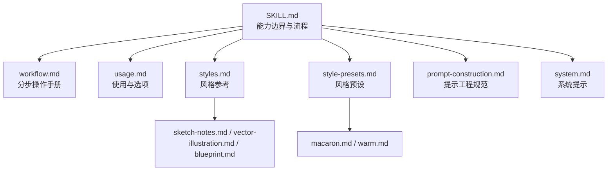
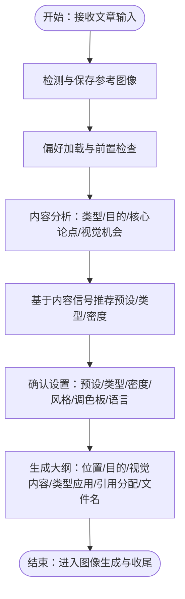
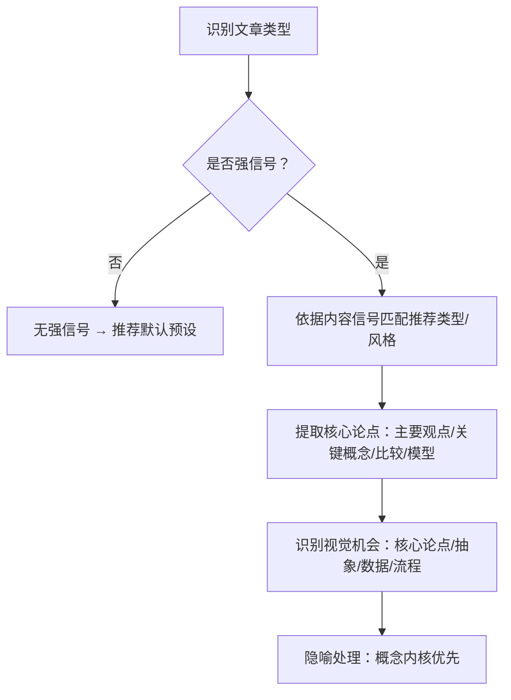
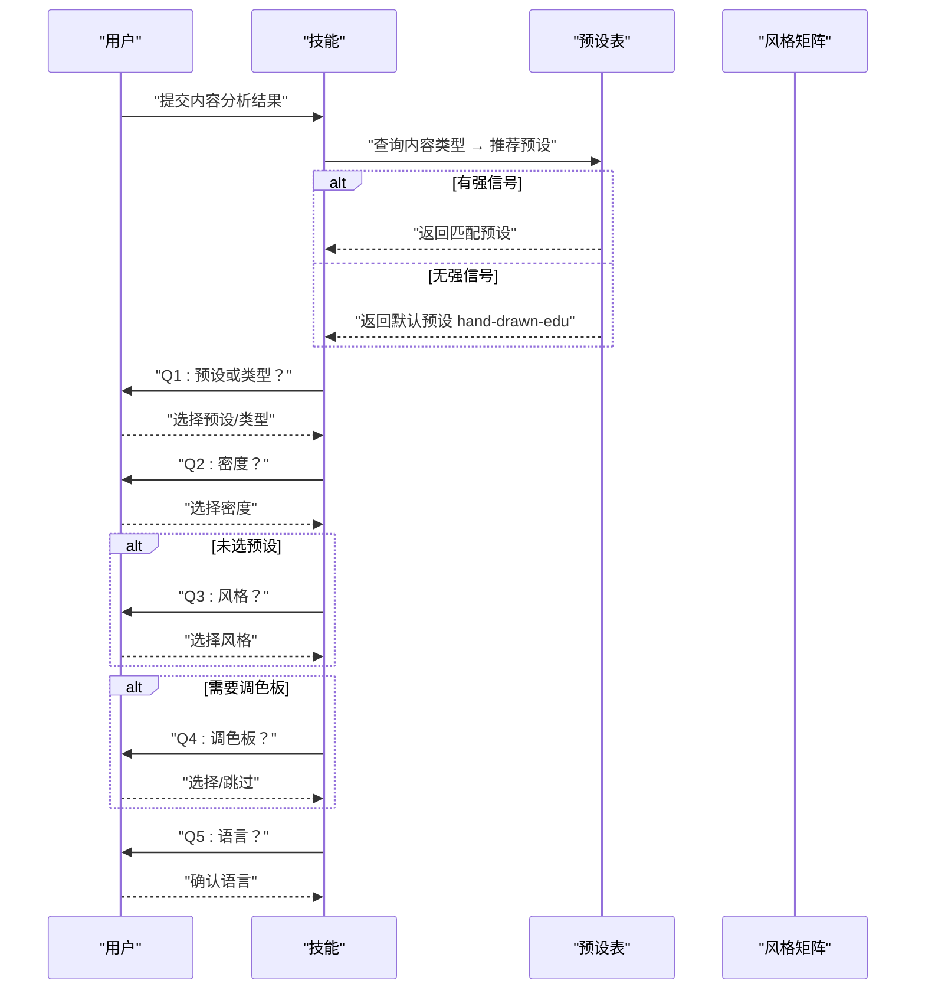
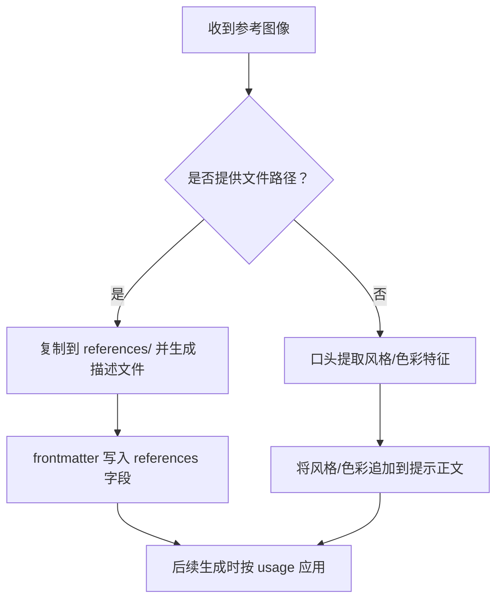
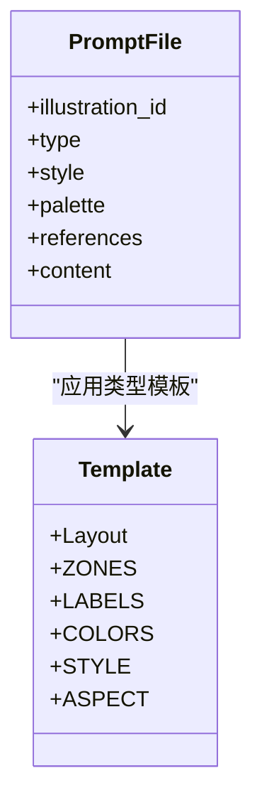
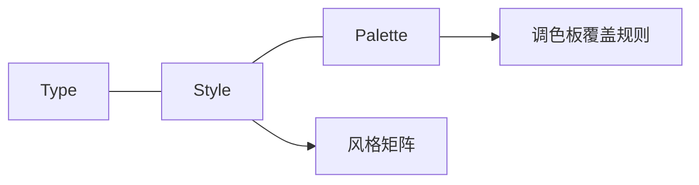
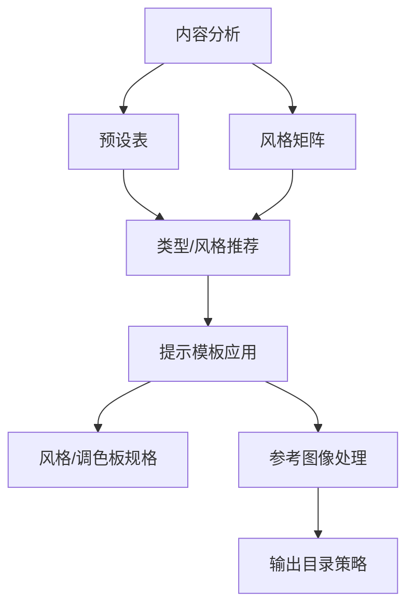

# 阶段二：设置与分析

<cite>
**本文引用的文件**
- [SKILL.md](file://.agents/skills/baoyu-article-illustrator/SKILL.md)
- [workflow.md](file://.agents/skills/baoyu-article-illustrator/references/workflow.md)
- [prompt-construction.md](file://.agents/skills/baoyu-article-illustrator/references/prompt-construction.md)
- [usage.md](file://.agents/skills/baoyu-article-illustrator/references/usage.md)
- [styles.md](file://.agents/skills/baoyu-article-illustrator/references/styles.md)
- [style-presets.md](file://.agents/skills/baoyu-article-illustrator/references/style-presets.md)
- [sketch-notes.md](file://.agents/skills/baoyu-article-illustrator/references/styles/sketch-notes.md)
- [vector-illustration.md](file://.agents/skills/baoyu-article-illustrator/references/styles/vector-illustration.md)
- [blueprint.md](file://.agents/skills/baoyu-article-illustrator/references/styles/blueprint.md)
- [macaron.md](file://.agents/skills/baoyu-article-illustrator/references/palettes/macaron.md)
- [warm.md](file://.agents/skills/baoyu-article-illustrator/references/palettes/warm.md)
- [system.md](file://.agents/skills/baoyu-article-illustrator/prompts/system.md)
</cite>

## 目录
1. [引言](#引言)
2. [项目结构](#项目结构)
3. [核心组件](#核心组件)
4. [架构总览](#架构总览)
5. [详细组件分析](#详细组件分析)
6. [依赖关系分析](#依赖关系分析)
7. [性能考量](#性能考量)
8. [故障排除指南](#故障排除指南)
9. [结论](#结论)
10. [附录](#附录)

## 引言
本阶段聚焦“设置与分析”环节，围绕 baoyu-article-illustrator 技能在文章插画创作中的五大关键要素进行系统化梳理与实操指导：
- 文章类型识别：技术类、教程类、方法论类、叙事类
- 插画目的判断：信息性、可视化、想象性
- 核心论点提取：主要观点、关键概念、比较对比、框架模型
- 视觉机会识别与推荐类型密度确定
- 如何避免字面化描绘隐喻，如何识别适合插画的位置（核心论点、抽象概念、数据比较、流程工作流）
- 参考图像分析的具体方法

目标是帮助用户在不深入代码的前提下，掌握从内容到视觉表达的完整分析路径，并通过统一的三维度（Type × Style × Palette）与模板化提示工程，确保产出既贴合内容又风格一致。

## 项目结构
该技能采用“配置优先 + 流程驱动”的组织方式，核心由以下部分构成：
- 技能说明与流程：SKILL.md 定义能力边界、工作流步骤、三维度组合与输出规范
- 分步操作手册：workflow.md 提供每一步的检测、分析、确认、大纲生成、图像生成与收尾细节
- 提示工程规范：prompt-construction.md 给出 YAML 前置元数据、布局/分区/标签/色彩/风格/宽高比等结构化模板
- 使用与选项：usage.md 汇总命令语法、输入模式与输出目录策略
- 风格与调色板：styles.md、style-presets.md、各风格/调色板规格文件（如 sketch-notes、vector-illustration、blueprint、macaron、warm）
- 系统提示：system.md 给出基础图像规格、语言与风格约束

图表来源
- [SKILL.md:84-93](file://.agents/skills/baoyu-article-illustrator/SKILL.md#L84-L93)
- [workflow.md:1-432](file://.agents/skills/baoyu-article-illustrator/references/workflow.md#L1-L432)
- [usage.md:1-83](file://.agents/skills/baoyu-article-illustrator/references/usage.md#L1-L83)
- [styles.md:1-237](file://.agents/skills/baoyu-article-illustrator/references/styles.md#L1-L237)
- [style-presets.md:1-88](file://.agents/skills/baoyu-article-illustrator/references/style-presets.md#L1-L88)
- [prompt-construction.md:1-460](file://.agents/skills/baoyu-article-illustrator/references/prompt-construction.md#L1-L460)
- [system.md:1-33](file://.agents/skills/baoyu-article-illustrator/prompts/system.md#L1-L33)

章节来源
- [SKILL.md:84-93](file://.agents/skills/baoyu-article-illustrator/SKILL.md#L84-L93)
- [workflow.md:1-432](file://.agents/skills/baoyu-article-illustrator/references/workflow.md#L1-L432)

## 核心组件
- 设置与分析（Step 2）：完成内容类型识别、插画目的判断、核心论点提取、视觉机会识别与推荐类型密度
- 确认设置（Step 3）：基于内容信号与偏好，选择预设或手动指定 Type/Style/Palette/Density/Language
- 大纲生成（Step 4）：产出包含位置、目的、视觉内容、类型应用、引用分配与文件名的 outline.md
- 图像生成（Step 5）：严格前置保存 prompt 文件，按类型模板构建提示，处理参考图像，批量/顺序生成并应用水印
- 收尾（Step 6）：相对路径插入图片，汇总输出

章节来源
- [SKILL.md:114-126](file://.agents/skills/baoyu-article-illustrator/SKILL.md#L114-L126)
- [SKILL.md:127-142](file://.agents/skills/baoyu-article-illustrator/SKILL.md#L127-L142)
- [SKILL.md:143-156](file://.agents/skills/baoyu-article-illustrator/SKILL.md#L143-L156)
- [SKILL.md:157-173](file://.agents/skills/baoyu-article-illustrator/SKILL.md#L157-L173)
- [SKILL.md:174-183](file://.agents/skills/baoyu-article-illustrator/SKILL.md#L174-L183)

## 架构总览
下图展示“设置与分析”阶段的关键交互与决策节点，包括内容分析、预设推荐、密度与风格选择、参考图像处理与最终大纲输出。

图表来源
- [workflow.md:3-110](file://.agents/skills/baoyu-article-illustrator/references/workflow.md#L3-L110)
- [workflow.md:112-165](file://.agents/skills/baoyu-article-illustrator/references/workflow.md#L112-L165)
- [workflow.md:167-253](file://.agents/skills/baoyu-article-illustrator/references/workflow.md#L167-L253)
- [style-presets.md:62-81](file://.agents/skills/baoyu-article-illustrator/references/style-presets.md#L62-L81)

章节来源
- [workflow.md:112-165](file://.agents/skills/baoyu-article-illustrator/references/workflow.md#L112-L165)
- [style-presets.md:62-81](file://.agents/skills/baoyu-article-illustrator/references/style-presets.md#L62-L81)

## 详细组件分析

### 组件A：内容分析与类型识别
- 内容类型识别：技术类、教程类、方法论类、叙事类
- 插画目的判断：信息性（解释概念）、可视化（数据/流程）、想象性（场景/隐喻）
- 核心论点提取：主要观点、关键概念、比较对比、框架模型
- 视觉机会识别：核心论点、抽象概念、数据比较、流程工作流
- 隐喻处理原则：避免字面化描绘，转而呈现其背后的概念内核

图表来源
- [workflow.md:114-146](file://.agents/skills/baoyu-article-illustrator/references/workflow.md#L114-L146)
- [style-presets.md:62-81](file://.agents/skills/baoyu-article-illustrator/references/style-presets.md#L62-L81)

章节来源
- [workflow.md:114-146](file://.agents/skills/baoyu-article-illustrator/references/workflow.md#L114-L146)
- [style-presets.md:62-81](file://.agents/skills/baoyu-article-illustrator/references/style-presets.md#L62-L81)

### 组件B：确认设置与密度确定
- 预设优先：若内容分析有明确信号，优先推荐对应预设；否则默认推荐 `hand-drawn-edu`
- 密度层级：minimal（1-2）、balanced（3-5）、per-section（推荐）、rich（6+）
- 风格选择：若未指定预设，按类型兼容矩阵与偏好给出候选
- 调色板：若预设未包含则可选 macaron/warm/neon 或默认风格色
- 语言：当文章语言不同于偏好时必须确认

图表来源
- [workflow.md:167-253](file://.agents/skills/baoyu-article-illustrator/references/workflow.md#L167-L253)
- [style-presets.md:62-81](file://.agents/skills/baoyu-article-illustrator/references/style-presets.md#L62-L81)
- [styles.md:51-96](file://.agents/skills/baoyu-article-illustrator/references/styles.md#L51-L96)

章节来源
- [workflow.md:167-253](file://.agents/skills/baoyu-article-illustrator/references/workflow.md#L167-L253)
- [styles.md:51-96](file://.agents/skills/baoyu-article-illustrator/references/styles.md#L51-L96)
- [style-presets.md:62-81](file://.agents/skills/baoyu-article-illustrator/references/style-presets.md#L62-L81)

### 组件C：参考图像分析与应用
- 参考图像保存：仅当文件实际存在于 references/ 目录时才写入 frontmatter 的 references 字段
- 三种用法：direct（直接参考）、style（风格特征）、palette（色彩方案）
- 无法提供文件时：可口头提取风格/色彩，追加至提示正文而非 frontmatter
- 处理流程：验证文件存在 → 读取 frontmatter → 按 usage 类型转换为参数或文本描述

图表来源
- [workflow.md:5-51](file://.agents/skills/baoyu-article-illustrator/references/workflow.md#L5-L51)
- [prompt-construction.md:21-49](file://.agents/skills/baoyu-article-illustrator/references/prompt-construction.md#L21-L49)

章节来源
- [workflow.md:5-51](file://.agents/skills/baoyu-article-illustrator/references/workflow.md#L5-L51)
- [prompt-construction.md:21-49](file://.agents/skills/baoyu-article-illustrator/references/prompt-construction.md#L21-L49)

### 组件D：提示工程与模板应用
- 每个提示文件包含 YAML frontmatter（illustration_id/type/style/palette/references）与类型特定模板
- 必备结构：布局、分区、标签（必须使用文章中的具体数字/术语/指标/引文）、色彩（语义化）、风格规则、宽高比
- 默认要求：简洁构图、充足留白、无复杂背景、主体居中或按内容需要定位
- 屏蔽可见文本标签：颜色值与名称仅为渲染指引，不得作为可见文本出现在图像中
- 水印：若启用，在提示末尾追加水印说明

图表来源
- [prompt-construction.md:3-19](file://.agents/skills/baoyu-article-illustrator/references/prompt-construction.md#L3-L19)
- [prompt-construction.md:122-173](file://.agents/skills/baoyu-article-illustrator/references/prompt-construction.md#L122-L173)
- [prompt-construction.md:317-325](file://.agents/skills/baoyu-article-illustrator/references/prompt-construction.md#L317-L325)

章节来源
- [prompt-construction.md:3-19](file://.agents/skills/baoyu-article-illustrator/references/prompt-construction.md#L3-L19)
- [prompt-construction.md:122-173](file://.agents/skills/baoyu-article-illustrator/references/prompt-construction.md#L122-L173)
- [prompt-construction.md:317-325](file://.agents/skills/baoyu-article-illustrator/references/prompt-construction.md#L317-L325)

### 组件E：三维度组合与风格/调色板
- Type（类型）：infographic/scene/flowchart/comparison/framework/timeline
- Style（风格）：sketch-notes/vector-illustration/blueprint 等
- Palette（调色板）：macaron/warm/neon/mono-ink 等
- 兼容性矩阵：不同 Type 与 Style 的适配程度，决定首选/次选风格
- 调色板覆盖：指定调色板时替换风格默认色，保留纹理描述

图表来源
- [SKILL.md:57-68](file://.agents/skills/baoyu-article-illustrator/SKILL.md#L57-L68)
- [styles.md:51-62](file://.agents/skills/baoyu-article-illustrator/references/styles.md#L51-L62)
- [prompt-construction.md:413-443](file://.agents/skills/baoyu-article-illustrator/references/prompt-construction.md#L413-L443)

章节来源
- [SKILL.md:57-68](file://.agents/skills/baoyu-article-illustrator/SKILL.md#L57-L68)
- [styles.md:51-62](file://.agents/skills/baoyu-article-illustrator/references/styles.md#L51-L62)
- [prompt-construction.md:413-443](file://.agents/skills/baoyu-article-illustrator/references/prompt-construction.md#L413-L443)

## 依赖关系分析
- 内容分析依赖预设表与风格矩阵，用于自动选择类型与风格
- 提示工程依赖风格/调色板规格文件，确保渲染一致性
- 参考图像处理依赖文件存在性校验，防止错误引用
- 输出目录策略受偏好配置影响，决定插入路径与文件命名

图表来源
- [style-presets.md:62-81](file://.agents/skills/baoyu-article-illustrator/references/style-presets.md#L62-L81)
- [styles.md:51-96](file://.agents/skills/baoyu-article-illustrator/references/styles.md#L51-L96)
- [prompt-construction.md:314-316](file://.agents/skills/baoyu-article-illustrator/references/prompt-construction.md#L314-L316)
- [workflow.md:350-376](file://.agents/skills/baoyu-article-illustrator/references/workflow.md#L350-L376)
- [SKILL.md:184-194](file://.agents/skills/baoyu-article-illustrator/SKILL.md#L184-L194)

章节来源
- [style-presets.md:62-81](file://.agents/skills/baoyu-article-illustrator/references/style-presets.md#L62-L81)
- [styles.md:51-96](file://.agents/skills/baoyu-article-illustrator/references/styles.md#L51-L96)
- [prompt-construction.md:314-316](file://.agents/skills/baoyu-article-illustrator/references/prompt-construction.md#L314-L316)
- [workflow.md:350-376](file://.agents/skills/baoyu-article-illustrator/references/workflow.md#L350-L376)
- [SKILL.md:184-194](file://.agents/skills/baoyu-article-illustrator/SKILL.md#L184-L194)

## 性能考量
- 批量生成优先：当已有多个提示文件且任务为纯生成时，优先使用后端的批处理接口，减少子代理开销
- 顺序生成兜底：若后端无批处理能力，则按顺序生成，保证稳定性
- 失败重试：单张失败时自动重试一次，降低整体中断概率
- 提示复用：prompt 文件作为可追溯记录，便于切换后端或回放

章节来源
- [SKILL.md:167-171](file://.agents/skills/baoyu-article-illustrator/SKILL.md#L167-L171)
- [workflow.md:337-340](file://.agents/skills/baoyu-article-illustrator/references/workflow.md#L337-L340)
- [workflow.md:390-396](file://.agents/skills/baoyu-article-illustrator/references/workflow.md#L390-L396)

## 故障排除指南
- 未找到 EXTEND.md：必须先完成首次设置，再继续后续步骤
- 提示文件缺失：生成前必须确保所有提示文件已保存，否则会阻断执行
- 参考图像 frontmatter 错误：若 frontmatter 中列出文件但不存在，需修正或移除 references 字段
- 语言不匹配：当文章语言不同于偏好设置时，必须在确认设置阶段进行选择
- 生成失败：单次失败自动重试一次；若仍失败，记录原因并继续

章节来源
- [SKILL.md:95-113](file://.agents/skills/baoyu-article-illustrator/SKILL.md#L95-L113)
- [workflow.md:327-336](file://.agents/skills/baoyu-article-illustrator/references/workflow.md#L327-L336)
- [workflow.md:341-345](file://.agents/skills/baoyu-article-illustrator/references/workflow.md#L341-L345)
- [workflow.md:384-396](file://.agents/skills/baoyu-article-illustrator/references/workflow.md#L384-L396)

## 结论
“设置与分析”阶段通过系统化的五要素分析与严格的确认流程，将文章内容转化为可执行的视觉计划。借助预设表与风格矩阵，技能能够在无强信号时提供安全默认，在有强信号时精准匹配类型与风格。配合参考图像处理与提示工程规范，最终形成高质量、一致性的插画产出路径。建议在实际使用中：
- 先完成偏好配置与首次设置
- 在分析阶段充分识别隐喻与抽象概念，避免字面化
- 优先使用预设，必要时再手动微调类型/风格/密度/调色板
- 严格遵循提示工程规范，确保标签与色彩语义化
- 利用参考图像增强风格一致性与主题契合度

## 附录
- 实际应用示例（步骤化）：
  - 输入：一篇技术文章（含数据与流程）
  - 步骤：
    1) 预检：加载 EXTEND.md，检测并保存参考图像
    2) 分析：识别为“技术类”，插画目的是“信息性/可视化”，核心论点为“架构/流程/指标”
    3) 确认：推荐预设“tech-explainer”（infographic + blueprint），密度“per-section”，风格“blueprint”，调色板默认
    4) 大纲：为每个核心论点与流程节点生成位置、目的、视觉内容与文件名
    5) 生成：按模板保存提示文件，应用参考图像（如适用），批量生成并插入文章

章节来源
- [style-presets.md:11-19](file://.agents/skills/baoyu-article-illustrator/references/style-presets.md#L11-L19)
- [workflow.md:112-165](file://.agents/skills/baoyu-article-illustrator/references/workflow.md#L112-L165)
- [usage.md:52-83](file://.agents/skills/baoyu-article-illustrator/references/usage.md#L52-L83)