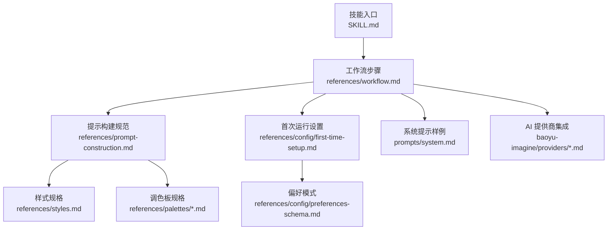
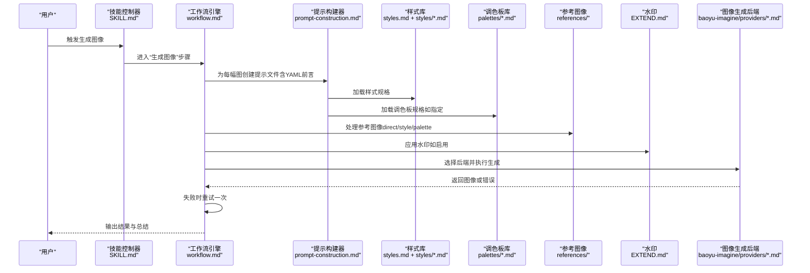
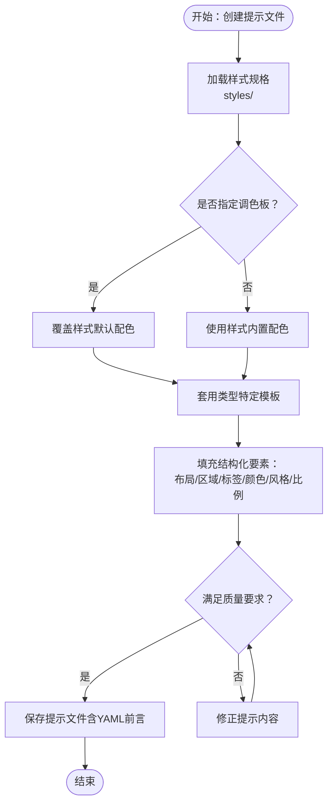
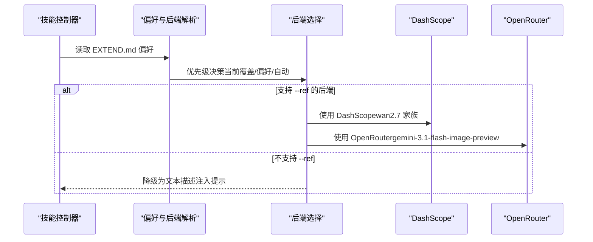
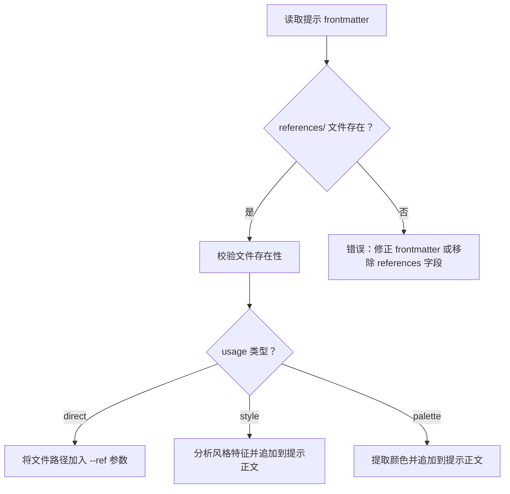
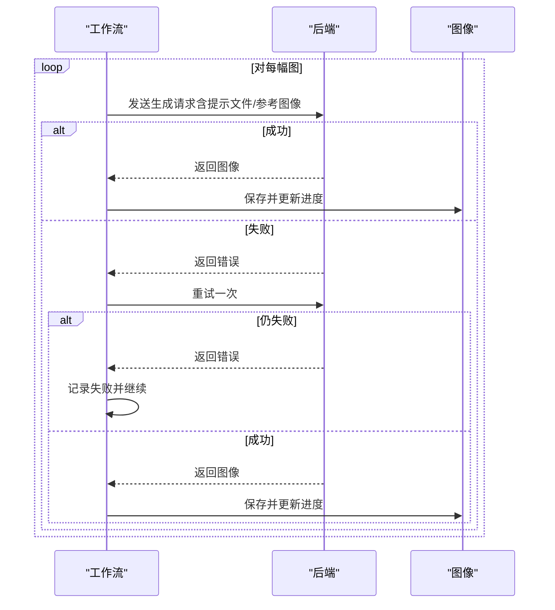
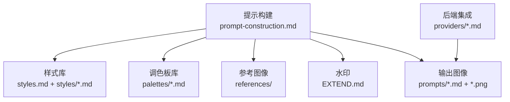

# 阶段五：生成图像

<cite>
**本文引用的文件**
- [SKILL.md](file://.agents/skills/baoyu-article-illustrator/SKILL.md)
- [workflow.md](file://.agents/skills/baoyu-article-illustrator/references/workflow.md)
- [prompt-construction.md](file://.agents/skills/baoyu-article-illustrator/references/prompt-construction.md)
- [style-presets.md](file://.agents/skills/baoyu-article-illustrator/references/style-presets.md)
- [styles.md](file://.agents/skills/baoyu-article-illustrator/references/styles.md)
- [styles/blueprint.md](file://.agents/skills/baoyu-article-illustrator/references/styles/blueprint.md)
- [palettes/macaron.md](file://.agents/skills/baoyu-article-illustrator/references/palettes/macaron.md)
- [first-time-setup.md](file://.agents/skills/baoyu-article-illustrator/references/config/first-time-setup.md)
- [preferences-schema.md](file://.agents/skills/baoyu-article-illustrator/references/config/preferences-schema.md)
- [system.md](file://.agents/skills/baoyu-article-illustrator/prompts/system.md)
- [dashscope.md](file://.agents/skills/baoyu-imagine/references/providers/dashscope.md)
- [openrouter.md](file://.agents/skills/baoyu-imagine/references/providers/openrouter.md)
</cite>

## 目录
1. [简介](#简介)
2. [项目结构](#项目结构)
3. [核心组件](#核心组件)
4. [架构总览](#架构总览)
5. [详细组件分析](#详细组件分析)
6. [依赖关系分析](#依赖关系分析)
7. [性能考量](#性能考量)
8. [故障排除指南](#故障排除指南)
9. [结论](#结论)
10. [附录](#附录)

## 简介
本章节聚焦“baoyu-article-illustrator”技能在“生成图像”阶段的完整流程与实现细节，围绕五个子步骤展开：5.1 提示文件创建（YAML 前言、样式规格加载、调色板规格、类型特定模板、质量要求）、5.2 生成技能选择、5.3 参考图像处理（直接使用、风格提取、调色板提取）、5.4 水印应用、5.5 图像生成执行。文档将系统阐述提示构建的质量要求（布局、区域、标签、颜色、风格、比例）、参考图像处理的三种方式、生成失败的重试机制，以及与不同 AI 提供商的集成方式，并提供最佳实践与故障排除建议。

## 项目结构
该技能以“三维度”（Type × Style × Palette）为核心，结合用户偏好与内容分析，输出可复现的提示文件与最终图像。关键目录与文件如下：
- 根技能定义与工作流：SKILL.md、references/workflow.md
- 提示构建规范：references/prompt-construction.md
- 风格与调色板：references/styles.md、references/styles/*.md、references/palettes/*.md
- 首次运行设置与偏好：references/config/first-time-setup.md、references/config/preferences-schema.md
- 系统提示样例：prompts/system.md
- 与 AI 提供商集成参考：.agents/skills/baoyu-imagine/references/providers/*.md

图表来源
- [SKILL.md: 84-241:84-241](file://.agents/skills/baoyu-article-illustrator/SKILL.md#L84-L241)
- [workflow.md: 1-432:1-432](file://.agents/skills/baoyu-article-illustrator/references/workflow.md#L1-L432)
- [prompt-construction.md: 1-460:1-460](file://.agents/skills/baoyu-article-illustrator/references/prompt-construction.md#L1-L460)
- [styles.md: 1-237:1-237](file://.agents/skills/baoyu-article-illustrator/references/styles.md#L1-L237)
- [preferences-schema.md: 1-133:1-133](file://.agents/skills/baoyu-article-illustrator/references/config/preferences-schema.md#L1-L133)
- [system.md: 1-33:1-33](file://.agents/skills/baoyu-article-illustrator/prompts/system.md#L1-L33)
- [dashscope.md: 1-70:1-70](file://.agents/skills/baoyu-imagine/references/providers/dashscope.md#L1-L70)
- [openrouter.md: 1-20:1-20](file://.agents/skills/baoyu-imagine/references/providers/openrouter.md#L1-L20)

章节来源
- [SKILL.md: 84-241:84-241](file://.agents/skills/baoyu-article-illustrator/SKILL.md#L84-L241)
- [workflow.md: 1-432:1-432](file://.agents/skills/baoyu-article-illustrator/references/workflow.md#L1-L432)

## 核心组件
- 提示文件与 YAML 前言：每个图像生成任务必须先保存独立的提示文件，包含 illustration_id、type、style、palette（如指定）等元数据，确保可复现性与跨后端迁移能力。
- 样式规格加载：根据所选 style 文件读取视觉元素、风格规则与渲染指令，作为提示构建的基础。
- 调色板规格：当指定 palette 时，覆盖 style 的默认配色；若未指定，则沿用 style 内置配色。
- 类型特定模板：依据 Type（infographic/scene/flowchart/comparison/framework/timeline）套用对应模板，强制包含布局、区域、标签、颜色、风格、比例等结构化要素。
- 质量要求：提示中必须明确布局结构、具体数据/标签、视觉关系、语义化颜色、风格特征与最终比例，避免模糊描述与通用装饰。
- 参考图像处理：支持 direct（直接使用）、style（风格提取）、palette（调色板提取）三种方式；仅当 references/ 下存在实际文件时才写入 frontmatter。
- 水印应用：若启用，按偏好位置与透明度添加到提示末尾。
- 生成执行与重试：优先使用后端批处理接口（若可用），否则顺序生成；失败时自动重试一次并继续流程。

章节来源
- [SKILL.md: 157-172:157-172](file://.agents/skills/baoyu-article-illustrator/SKILL.md#L157-L172)
- [workflow.md: 297-396:297-396](file://.agents/skills/baoyu-article-illustrator/references/workflow.md#L297-L396)
- [prompt-construction.md: 1-460:1-460](file://.agents/skills/baoyu-article-illustrator/references/prompt-construction.md#L1-L460)
- [preferences-schema.md: 14-58:14-58](file://.agents/skills/baoyu-article-illustrator/references/config/preferences-schema.md#L14-L58)

## 架构总览
下图展示从“生成图像”阶段开始，提示构建、样式/调色板加载、参考图像处理、水印与生成执行的关键交互。

图表来源
- [SKILL.md: 24-41:24-41](file://.agents/skills/baoyu-article-illustrator/SKILL.md#L24-L41)
- [workflow.md: 297-396:297-396](file://.agents/skills/baoyu-article-illustrator/references/workflow.md#L297-L396)
- [prompt-construction.md: 122-460:122-460](file://.agents/skills/baoyu-article-illustrator/references/prompt-construction.md#L122-L460)
- [styles.md: 1-237:1-237](file://.agents/skills/baoyu-article-illustrator/references/styles.md#L1-L237)
- [preferences-schema.md: 14-58:14-58](file://.agents/skills/baoyu-article-illustrator/references/config/preferences-schema.md#L14-L58)
- [dashscope.md: 1-70:1-70](file://.agents/skills/baoyu-imagine/references/providers/dashscope.md#L1-L70)
- [openrouter.md: 1-20:1-20](file://.agents/skills/baoyu-imagine/references/providers/openrouter.md#L1-L20)

## 详细组件分析

### 5.1 提示文件创建：YAML 前言、样式规格加载、调色板规格、类型特定模板、质量要求
- YAML 前言字段
  - illustration_id：唯一标识
  - type：infographic/scene/flowchart/comparison/framework/timeline
  - style：如 vector-illustration、sketch-notes、blueprint 等
  - palette：可选，如 macaron、warm、neon
  - references：仅当 references/ 下存在实际文件时才写入
- 样式规格加载
  - 读取 styles/<style>.md 获取视觉元素、风格规则与渲染指令
  - 示例：blueprint 强调工程精度、网格对齐、技术绘图线条与几何形状
- 调色板规格
  - 若指定 palette，则覆盖 style 默认配色；否则使用 style 内置配色
  - 示例：macaron 软粉彩块 + 温暖奶油背景，强调块状信息区块与少量强调色
- 类型特定模板
  - 强制包含：布局（Layout）、区域（ZONES）、标签（LABELS）、颜色（COLORS）、风格（STYLE）、比例（ASPECT）
  - 模板示例：infographic + sketch-notes + macaron；flowchart + vector-illustration；scene + warm 等
- 质量要求
  - 布局：清晰的网格/径向/层级/左右/上下结构
  - 区域：每个视觉区段包含具体数值、术语、指标、引述
  - 标签：使用文章中的真实数字、术语、指标、引述，避免泛泛而谈
  - 颜色：给出语义化配色，且不得将颜色名称、十六进制值或调色板标签作为可见文本
  - 风格：严格遵循样式规则（线条、纹理、情绪、人物表现）
  - 比例：明确最终比例（如 16:9）

图表来源
- [prompt-construction.md: 122-460:122-460](file://.agents/skills/baoyu-article-illustrator/references/prompt-construction.md#L122-L460)
- [styles/blueprint.md: 1-58:1-58](file://.agents/skills/baoyu-article-illustrator/references/styles/blueprint.md#L1-L58)
- [palettes/macaron.md: 1-34:1-34](file://.agents/skills/baoyu-article-illustrator/references/palettes/macaron.md#L1-L34)

章节来源
- [prompt-construction.md: 1-460:1-460](file://.agents/skills/baoyu-article-illustrator/references/prompt-construction.md#L1-L460)
- [styles.md: 1-237:1-237](file://.agents/skills/baoyu-article-illustrator/references/styles.md#L1-L237)
- [styles/blueprint.md: 1-58:1-58](file://.agents/skills/baoyu-article-illustrator/references/styles/blueprint.md#L1-L58)
- [palettes/macaron.md: 1-34:1-34](file://.agents/skills/baoyu-article-illustrator/references/palettes/macaron.md#L1-L34)

### 5.2 生成技能选择
- 后端选择优先级
  - 当前请求覆盖 > 已保存偏好 > 自动选择（优先运行时原生工具，其次已安装非原生后端，最后询问用户）
- 批处理策略
  - 若多个提示文件已就绪且任务为纯生成，优先使用后端批处理接口；否则顺序生成
- 与 AI 提供商集成
  - DashScope：支持多模型家族与尺寸规则，wan2.7 家族支持最多 9 张参考图像，部分模型支持 --ref
  - OpenRouter：推荐 google/gemini-3.1-flash-image-preview，支持图像输入/输出与参考图像工作流

图表来源
- [SKILL.md: 26-36:26-36](file://.agents/skills/baoyu-article-illustrator/SKILL.md#L26-L36)
- [workflow.md: 346-349:346-349](file://.agents/skills/baoyu-article-illustrator/references/workflow.md#L346-L349)
- [dashscope.md: 1-70:1-70](file://.agents/skills/baoyu-imagine/references/providers/dashscope.md#L1-L70)
- [openrouter.md: 1-20:1-20](file://.agents/skills/baoyu-imagine/references/providers/openrouter.md#L1-L20)

章节来源
- [SKILL.md: 26-36:26-36](file://.agents/skills/baoyu-article-illustrator/SKILL.md#L26-L36)
- [workflow.md: 346-349:346-349](file://.agents/skills/baoyu-article-illustrator/references/workflow.md#L346-L349)
- [dashscope.md: 1-70:1-70](file://.agents/skills/baoyu-imagine/references/providers/dashscope.md#L1-L70)
- [openrouter.md: 1-20:1-20](file://.agents/skills/baoyu-imagine/references/providers/openrouter.md#L1-L20)

### 5.3 参考图像处理：直接使用、风格提取、调色板提取
- 直接使用（direct）
  - 将 references/NN-ref-*.png 作为 --ref 参数传给支持该参数的后端
- 风格提取（style）
  - 分析参考图像的线条、纹理、构图与风格特征，将描述追加到提示正文（不写 frontmatter）
- 调色板提取（palette）
  - 从参考图像提取主色与辅色，将颜色信息追加到提示正文（不写 frontmatter）
- 前提条件
  - 仅当 references/ 下存在实际文件时，才在 frontmatter 中写入 references 字段
  - 若 frontmatter 中列出文件但不存在，需修正或移除 references 字段

图表来源
- [workflow.md: 350-383:350-383](file://.agents/skills/baoyu-article-illustrator/references/workflow.md#L350-L383)
- [prompt-construction.md: 21-48:21-48](file://.agents/skills/baoyu-article-illustrator/references/prompt-construction.md#L21-L48)

章节来源
- [workflow.md: 350-383:350-383](file://.agents/skills/baoyu-article-illustrator/references/workflow.md#L350-L383)
- [prompt-construction.md: 21-48:21-48](file://.agents/skills/baoyu-article-illustrator/references/prompt-construction.md#L21-L48)

### 5.4 水印应用
- 来源：EXTEND.md 中的 watermark.enabled、content、position、opacity
- 应用：在提示末尾追加“包含轻微水印”的说明，位置与透明度遵循偏好设置
- 适用范围：所有生成的图像

章节来源
- [preferences-schema.md: 14-18:14-18](file://.agents/skills/baoyu-article-illustrator/references/config/preferences-schema.md#L14-L18)
- [prompt-construction.md: 453-460:453-460](file://.agents/skills/baoyu-article-illustrator/references/prompt-construction.md#L453-L460)

### 5.5 图像生成执行：批处理、回退与重试
- 执行策略
  - 多图生成：优先使用后端批处理接口；若无批处理则顺序生成
  - 子代理：仅在每幅图仍需单独提示迭代或创意探索时使用
- 失败重试
  - 任一图像生成失败时，自动重试一次；若仍失败则记录原因并继续后续生成
- 输出命名与插入
  - 按 output_dir 与默认输出目录策略生成相对路径，插入到文章中相应段落之后

图表来源
- [workflow.md: 388-396:388-396](file://.agents/skills/baoyu-article-illustrator/references/workflow.md#L388-L396)

章节来源
- [workflow.md: 388-396:388-396](file://.agents/skills/baoyu-article-illustrator/references/workflow.md#L388-L396)

## 依赖关系分析
- 组件耦合
  - 提示构建依赖样式与调色板库；参考图像处理依赖 references/ 目录；水印依赖 EXTEND.md；生成执行依赖后端能力（是否支持 --ref）
- 外部依赖
  - DashScope 与 OpenRouter 的模型家族、尺寸规则与参考图像支持情况直接影响生成策略
- 潜在循环依赖
  - 通过“提示文件先行保存”的硬性要求，避免了生成阶段对工作流其他阶段的反向依赖

图表来源
- [prompt-construction.md: 1-460:1-460](file://.agents/skills/baoyu-article-illustrator/references/prompt-construction.md#L1-L460)
- [styles.md: 1-237:1-237](file://.agents/skills/baoyu-article-illustrator/references/styles.md#L1-L237)
- [preferences-schema.md: 14-58:14-58](file://.agents/skills/baoyu-article-illustrator/references/config/preferences-schema.md#L14-L58)
- [dashscope.md: 1-70:1-70](file://.agents/skills/baoyu-imagine/references/providers/dashscope.md#L1-L70)
- [openrouter.md: 1-20:1-20](file://.agents/skills/baoyu-imagine/references/providers/openrouter.md#L1-L20)

章节来源
- [prompt-construction.md: 1-460:1-460](file://.agents/skills/baoyu-article-illustrator/references/prompt-construction.md#L1-L460)
- [styles.md: 1-237:1-237](file://.agents/skills/baoyu-article-illustrator/references/styles.md#L1-L237)
- [preferences-schema.md: 14-58:14-58](file://.agents/skills/baoyu-article-illustrator/references/config/preferences-schema.md#L14-L58)
- [dashscope.md: 1-70:1-70](file://.agents/skills/baoyu-imagine/references/providers/dashscope.md#L1-L70)
- [openrouter.md: 1-20:1-20](file://.agents/skills/baoyu-imagine/references/providers/openrouter.md#L1-L20)

## 性能考量
- 批处理优先：在可用时优先使用后端批处理接口，减少往返与并发开销
- 顺序生成：在无批处理能力时，顺序生成可简化错误处理与资源管理
- 参考图像处理：对不支持 --ref 的后端，将参考图像转换为文本描述，避免额外网络传输
- 尺寸与比例：根据目标比例选择合适尺寸，避免过大像素导致内存与带宽压力

## 故障排除指南
- 提示文件缺失
  - 现象：生成前检查失败
  - 处理：确认每个提示文件均保存至 prompts/NN-{type}-{slug}.md
- references 前言错误
  - 现象：frontmatter 中列出文件但文件不存在
  - 处理：删除 references 字段或修正文件路径
- 颜色文本泄露
  - 现象：图像中出现颜色名称、十六进制值或调色板标签
  - 处理：在提示中明确“颜色值仅为渲染指导，不得显示为可见文本”
- 生成失败
  - 现象：单幅图像生成失败
  - 处理：自动重试一次；若仍失败，记录原因并继续后续生成
- 后端不支持 --ref
  - 现象：使用 DashScope 或 OpenRouter 时无法传递参考图像
  - 处理：将参考图像转换为文本描述并追加到提示正文

章节来源
- [workflow.md: 327-334:327-334](file://.agents/skills/baoyu-article-illustrator/references/workflow.md#L327-L334)
- [prompt-construction.md: 21-48:21-48](file://.agents/skills/baoyu-article-illustrator/references/prompt-construction.md#L21-L48)
- [prompt-construction.md: 72-78:72-78](file://.agents/skills/baoyu-article-illustrator/references/prompt-construction.md#L72-L78)
- [workflow.md: 388-396:388-396](file://.agents/skills/baoyu-article-illustrator/references/workflow.md#L388-L396)
- [dashscope.md: 54-58:54-58](file://.agents/skills/baoyu-imagine/references/providers/dashscope.md#L54-L58)
- [openrouter.md: 14-20:14-20](file://.agents/skills/baoyu-imagine/references/providers/openrouter.md#L14-L20)

## 结论
“生成图像”阶段通过严格的提示文件创建、样式与调色板加载、参考图像处理、水印应用与生成执行，确保输出图像在风格、色彩与信息传达上与文章内容高度一致。借助可复现的提示文件与跨后端兼容的设计，该阶段既保证了质量，又具备良好的扩展性与容错能力。建议在实际使用中遵循提示质量要求与参考图像处理规范，并根据后端能力选择合适的生成策略。

## 附录
- 最佳实践
  - 在保存提示文件前完成样式与调色板的最终确认
  - 使用类型特定模板强制结构化要素，避免模糊描述
  - 明确标注颜色语义与不可见文本约束
  - 优先使用支持 --ref 的后端进行直接参考图像生成
- 快速参考
  - 提示文件命名：NN-{type}-{slug}.md
  - 输出目录策略：same-dir、imgs-subdir、illustrations-subdir、independent
  - 偏好字段：watermark、preferred_style、preferred_palette、language、preferred_image_backend、default_output_dir

章节来源
- [SKILL.md: 184-241:184-241](file://.agents/skills/baoyu-article-illustrator/SKILL.md#L184-L241)
- [preferences-schema.md: 14-58:14-58](file://.agents/skills/baoyu-article-illustrator/references/config/preferences-schema.md#L14-L58)
- [style-presets.md: 1-88:1-88](file://.agents/skills/baoyu-article-illustrator/references/style-presets.md#L1-L88)