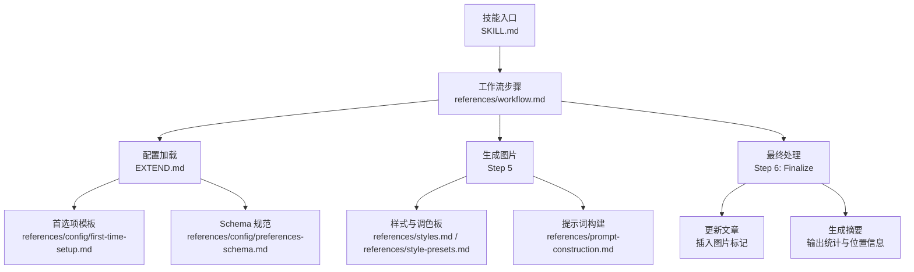
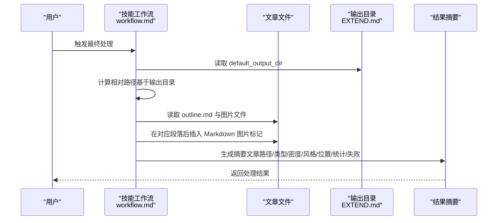
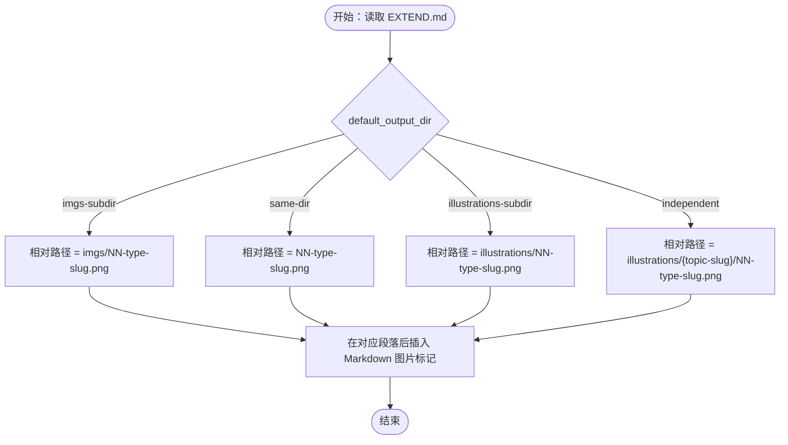
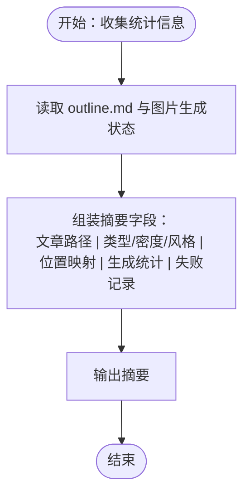
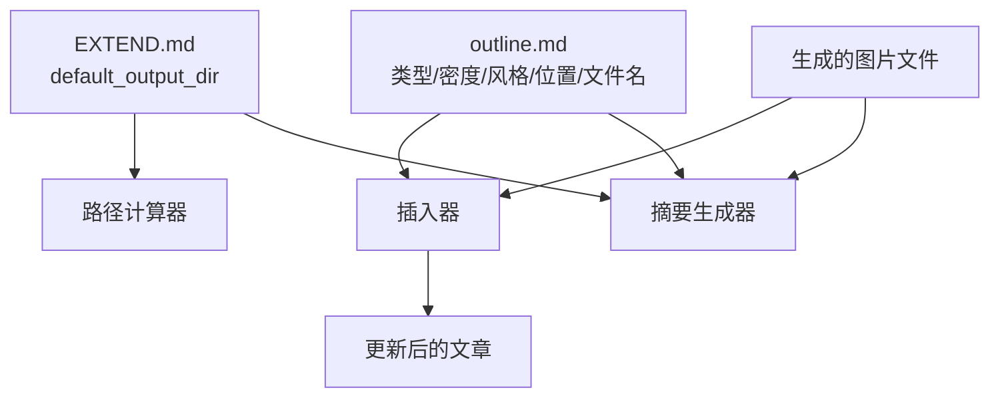

# 阶段六：最终处理

<cite>
**本文档引用的文件**
- [SKILL.md](file://.agents/skills/baoyu-article-illustrator/SKILL.md)
- [workflow.md](file://.agents/skills/baoyu-article-illustrator/references/workflow.md)
- [usage.md](file://.agents/skills/baoyu-article-illustrator/references/usage.md)
- [prompt-construction.md](file://.agents/skills/baoyu-article-illustrator/references/prompt-construction.md)
- [first-time-setup.md](file://.agents/skills/baoyu-article-illustrator/references/config/first-time-setup.md)
- [preferences-schema.md](file://.agents/skills/baoyu-article-illustrator/references/config/preferences-schema.md)
- [styles.md](file://.agents/skills/baoyu-article-illustrator/references/styles.md)
- [style-presets.md](file://.agents/skills/baoyu-article-illustrator/references/style-presets.md)
- [blueprint.md](file://.agents/skills/baoyu-article-illustrator/references/styles/blueprint.md)
- [vector-illustration.md](file://.agents/skills/baoyu-article-illustrator/references/styles/vector-illustration.md)
- [notion.md](file://.agents/skills/baoyu-article-illustrator/references/styles/notion.md)
- [macaron.md](file://.agents/skills/baoyu-article-illustrator/references/palettes/macaron.md)
- [warm.md](file://.agents/skills/baoyu-article-illustrator/references/palettes/warm.md)
- [neon.md](file://.agents/skills/baoyu-article-illustrator/references/palettes/neon.md)
</cite>

## 目录
1. [简介](#简介)
2. [项目结构](#项目结构)
3. [核心组件](#核心组件)
4. [架构概览](#架构概览)
5. [详细组件分析](#详细组件分析)
6. [依赖分析](#依赖分析)
7. [性能考虑](#性能考虑)
8. [故障排除指南](#故障排除指南)
9. [结论](#结论)

## 简介
本阶段文档聚焦 baoyu-article-illustrator 技能在最终处理阶段的实现机制，重点阐述文章更新流程、图片标记插入逻辑、替代文本规范以及输出摘要生成规则。文档基于技能工作流的第6步（Finalize）进行深入解析，并结合输出目录配置提供不同场景下的插入示例与验证方法。

## 项目结构
baoyu-article-illustrator 技能采用基于参考文档的工作流设计，核心文件组织如下：
- 技能总览与工作流：SKILL.md、references/workflow.md
- 配置与首选项：references/config/first-time-setup.md、references/config/preferences-schema.md
- 样式与调色板：references/styles.md、references/style-presets.md、具体样式/调色板规格文件
- 提示词构建：references/prompt-construction.md
- 使用示例：references/usage.md

**图表来源**
- [SKILL.md: 174-241:174-241](file://.agents/skills/baoyu-article-illustrator/SKILL.md#L174-L241)
- [workflow.md: 399-432:399-432](file://.agents/skills/baoyu-article-illustrator/references/workflow.md#L399-L432)
- [first-time-setup.md: 116-134:116-134](file://.agents/skills/baoyu-article-illustrator/references/config/first-time-setup.md#L116-L134)
- [preferences-schema.md: 10-42:10-42](file://.agents/skills/baoyu-article-illustrator/references/config/preferences-schema.md#L10-L42)

**章节来源**
- [SKILL.md: 174-241:174-241](file://.agents/skills/baoyu-article-illustrator/SKILL.md#L174-L241)
- [workflow.md: 399-432:399-432](file://.agents/skills/baoyu-article-illustrator/references/workflow.md#L399-L432)

## 核心组件
- 文章更新器（最终处理）：负责将生成的图片以 Markdown 图片语法插入到对应段落之后，并根据输出目录配置计算相对路径。
- 替代文本（alt text）生成器：依据文章语言与内容要点，生成简洁明确的描述性文本。
- 输出摘要生成器：汇总文章路径、类型/密度/风格信息、图片位置映射、生成统计与失败记录。
- 目录路径计算器：根据 default_output_dir 配置，确定不同输出模式下的插入路径格式。

关键行为与约束：
- 插入路径严格相对文章文件路径计算，确保在不同部署环境下链接有效。
- 替代文本必须简洁、准确反映图片内容，且语言与文章一致。
- 摘要包含“文章路径”“类型/密度/风格”“位置信息”“生成统计”“失败记录”等字段。

**章节来源**
- [SKILL.md: 176-182:176-182](file://.agents/skills/baoyu-article-illustrator/SKILL.md#L176-L182)
- [workflow.md: 401-431:401-431](file://.agents/skills/baoyu-article-illustrator/references/workflow.md#L401-L431)

## 架构概览
最终处理阶段的控制流围绕“更新文章 + 生成摘要”两条主线展开，同时依赖于前序步骤生成的 outline.md、图片文件与 EXTEND.md 配置。

**图表来源**
- [workflow.md: 401-431:401-431](file://.agents/skills/baoyu-article-illustrator/references/workflow.md#L401-L431)
- [SKILL.md: 184-208:184-208](file://.agents/skills/baoyu-article-illustrator/SKILL.md#L184-L208)

## 详细组件分析

### 组件一：文章更新机制与路径计算
- 目标：在文章中合适位置插入图片标记，保证链接在不同部署环境可用。
- 路径计算规则：
  - 当 default_output_dir 为 imgs-subdir：插入路径为 imgs/NN-{type}-{slug}.png
  - 当 default_output_dir 为 same-dir：插入路径为 NN-{type}-{slug}.png
  - 当 default_output_dir 为 illustrations-subdir：插入路径为 illustrations/NN-{type}-{slug}.png
  - 当 default_output_dir 为 independent：插入路径为 illustrations/{topic-slug}/NN-{type}-{slug}.png（相对工作目录）
- 计算依据：最终处理时以“文章文件所在目录”为基准，计算相对于该目录的相对路径；对于 independent 模式，插入路径相对工作目录。

**图表来源**
- [SKILL.md: 184-208:184-208](file://.agents/skills/baoyu-article-illustrator/SKILL.md#L184-L208)
- [workflow.md: 403-410:403-410](file://.agents/skills/baoyu-article-illustrator/references/workflow.md#L403-L410)

**章节来源**
- [SKILL.md: 184-208:184-208](file://.agents/skills/baoyu-article-illustrator/SKILL.md#L184-L208)
- [workflow.md: 403-410:403-410](file://.agents/skills/baoyu-article-illustrator/references/workflow.md#L403-L410)

### 组件二：替代文本（alt text）规范
- 语言一致性：替代文本需使用与文章相同的语言，确保无障碍阅读体验。
- 简洁性：描述应简明扼要，突出图片的核心信息点，避免冗长或模糊表述。
- 内容相关性：必须准确反映图片所呈现的概念或数据，避免与正文描述冲突。
- 生成建议：可参考 outline.md 中的“Visual Content”“Purpose”等字段提炼关键词，形成面向读者的描述。

**章节来源**
- [workflow.md: 412](file://.agents/skills/baoyu-article-illustrator/references/workflow.md#L412)

### 组件三：输出摘要生成
摘要格式包含以下关键字段：
- 文章：显示文章路径
- 类型/密度/风格：展示本次处理的类型、密度等级与风格
- 位置：列出每张图片插入的具体段落位置
- 生成统计：显示已生成/总数
- 失败记录：若存在失败，列出失败原因与对应图片

**图表来源**
- [workflow.md: 414-431:414-431](file://.agents/skills/baoyu-article-illustrator/references/workflow.md#L414-L431)

**章节来源**
- [workflow.md: 414-431:414-431](file://.agents/skills/baoyu-article-illustrator/references/workflow.md#L414-L431)

### 组件四：不同输出目录配置下的插入示例
- imgs-subdir（推荐）：插入 
- same-dir：插入 
- illustrations-subdir：插入 
- independent：插入 

注意：上述路径均相对文章文件所在目录计算；independent 模式下，插入路径还相对工作目录。

**章节来源**
- [SKILL.md: 188-193:188-193](file://.agents/skills/baoyu-article-illustrator/SKILL.md#L188-L193)
- [workflow.md: 405-410:405-410](file://.agents/skills/baoyu-article-illustrator/references/workflow.md#L405-L410)

### 组件五：最终成果验证方法
- 文件数量核对：比较输出目录中图片文件数量与 outline.md 中的图像计数是否一致。
- 引用一致性检查：逐条核对摘要中的“位置映射”，确保文章中相应段落后存在对应图片标记。
- 路径有效性验证：在目标站点环境下预览，确认图片可正常加载。
- 失败项复盘：对失败记录逐一排查，必要时补充或修正提示词后重试。

**章节来源**
- [workflow.md: 424-431:424-431](file://.agents/skills/baoyu-article-illustrator/references/workflow.md#L424-L431)

## 依赖分析
最终处理阶段的关键依赖关系如下：
- EXTEND.md：决定 default_output_dir，进而影响路径计算。
- outline.md：提供图片文件名、位置信息与类型/密度/风格元数据。
- 图片文件：与 outline.md 中的条目一一对应，用于生成摘要与插入标记。
- 样式/调色板：虽然不直接影响最终处理，但会影响 alt text 的语义准确性与风格一致性。

**图表来源**
- [SKILL.md: 184-208:184-208](file://.agents/skills/baoyu-article-illustrator/SKILL.md#L184-L208)
- [workflow.md: 401-431:401-431](file://.agents/skills/baoyu-article-illustrator/references/workflow.md#L401-L431)

**章节来源**
- [SKILL.md: 184-208:184-208](file://.agents/skills/baoyu-article-illustrator/SKILL.md#L184-L208)
- [workflow.md: 401-431:401-431](file://.agents/skills/baoyu-article-illustrator/references/workflow.md#L401-L431)

## 性能考虑
- 路径计算复杂度：O(N)，N 为 outline 条目数量，主要开销在于遍历与字符串拼接。
- 文件 I/O：读取 outline.md 与写入文章文件，建议批量操作减少磁盘往返。
- 摘要生成：基于已有元数据聚合，时间复杂度低，空间开销小。
- 建议：在大规模批量处理时，优先使用独立输出目录（independent）以避免路径冲突，并在插入前进行一次性校验。

## 故障排除指南
- 插入路径无效
  - 现象：图片无法加载或链接错误
  - 排查：确认 default_output_dir 与实际输出目录一致；检查相对路径是否正确
  - 参考：[SKILL.md: 184-208:184-208](file://.agents/skills/baoyu-article-illustrator/SKILL.md#L184-L208)
- 替代文本不符合规范
  - 现象：无障碍访问体验差或与内容不符
  - 排查：对照 outline.md 的“Visual Content”“Purpose”，确保语言一致、描述简洁
  - 参考：[workflow.md: 412](file://.agents/skills/baoyu-article-illustrator/references/workflow.md#L412)
- 摘要缺失或不完整
  - 现象：缺少“位置映射”“生成统计”“失败记录”
  - 排查：确认图片生成状态与 outline.md 是否匹配；检查失败项并补充
  - 参考：[workflow.md: 414-431:414-431](file://.agents/skills/baoyu-article-illustrator/references/workflow.md#L414-L431)
- 独立输出目录冲突
  - 现象：independent 模式下插入路径相对工作目录导致跨项目引用失效
  - 排查：在部署时统一相对路径约定，或切换到同目录/子目录模式
  - 参考：[SKILL.md: 193](file://.agents/skills/baoyu-article-illustrator/SKILL.md#L193)

**章节来源**
- [SKILL.md: 184-208:184-208](file://.agents/skills/baoyu-article-illustrator/SKILL.md#L184-L208)
- [workflow.md: 412-431:412-431](file://.agents/skills/baoyu-article-illustrator/references/workflow.md#L412-L431)

## 结论
最终处理阶段通过严格的路径计算、规范化的替代文本与结构化摘要生成，确保文章更新的准确性与可维护性。配合不同输出目录配置，可在多种部署环境中保持图片链接的有效性。建议在批量处理时采用独立输出目录并进行一次性验证，以提升整体效率与质量。