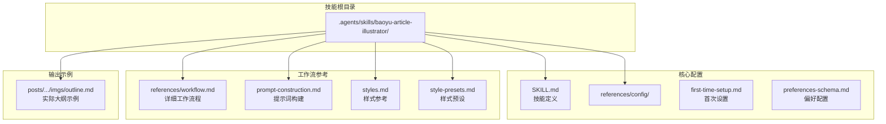
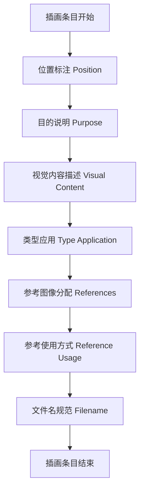
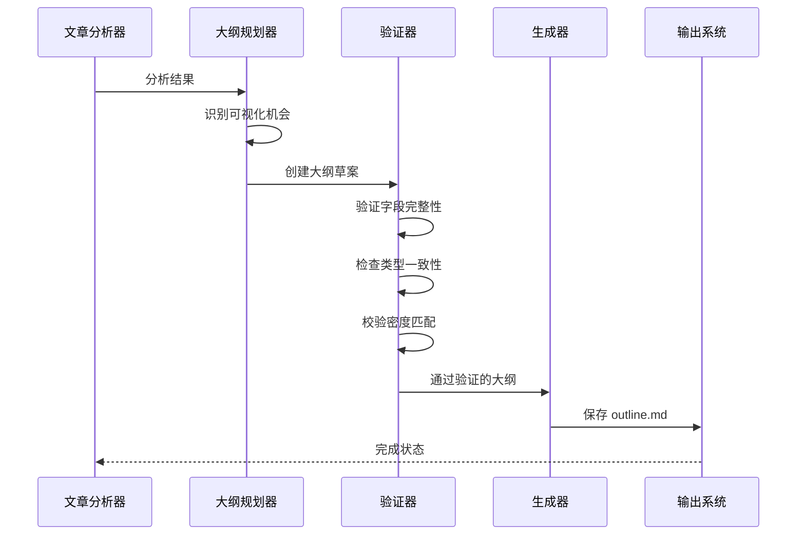
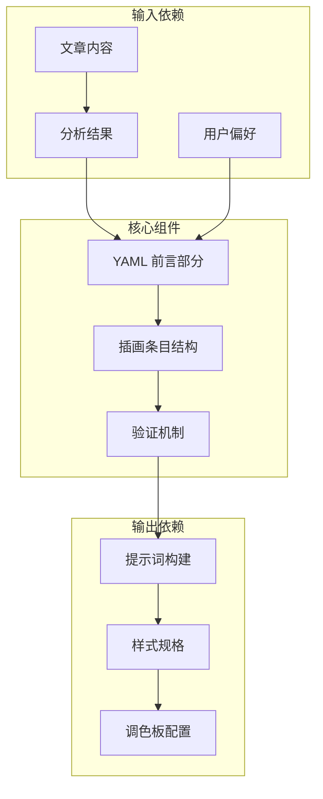

# 阶段四：生成大纲

<cite>
**本文档引用的文件**
- [SKILL.md](file://.agents/skills/baoyu-article-illustrator/SKILL.md)
- [workflow.md](file://.agents/skills/baoyu-article-illustrator/references/workflow.md)
- [prompt-construction.md](file://.agents/skills/baoyu-article-illustrator/references/prompt-construction.md)
- [styles.md](file://.agents/skills/baoyu-article-illustrator/references/styles.md)
- [style-presets.md](file://.agents/skills/baoyu-article-illustrator/references/style-presets.md)
- [first-time-setup.md](file://.agents/skills/baoyu-article-illustrator/references/config/first-time-setup.md)
- [outline.md](file://posts/2026-04-16-qwen-beats-opus-pelican/imgs/outline.md)
</cite>

## 目录
1. [简介](#简介)
2. [项目结构](#项目结构)
3. [核心组件](#核心组件)
4. [架构概览](#架构概览)
5. [详细组件分析](#详细组件分析)
6. [依赖关系分析](#依赖关系分析)
7. [性能考虑](#性能考虑)
8. [故障排除指南](#故障排除指南)
9. [结论](#结论)
10. [附录](#附录)

## 简介

本文件详细阐述 baoyu-article-illustrator 技能中大纲生成功能的完整实现。大纲生成是整个工作流的关键环节，负责将文章分析结果转化为结构化的插画计划，确保每个插画都有明确的位置、目的、视觉内容和执行标准。

该功能遵循严格的 YAML 前言部分规范，包含 type、density、style、image_count 字段，并为每个插画条目提供详细的位置标注、目的说明、视觉内容描述、类型应用、参考图像分配和文件名规范。

## 项目结构

baoyu-article-illustrator 技能采用模块化设计，大纲生成功能位于以下关键目录中：



**图表来源**
- [SKILL.md:1-241](file://.agents/skills/baoyu-article-illustrator/SKILL.md#L1-L241)
- [workflow.md:1-432](file://.agents/skills/baoyu-article-illustrator/references/workflow.md#L1-L432)

**章节来源**
- [SKILL.md:84-93](file://.agents/skills/baoyu-article-illustrator/SKILL.md#L84-L93)
- [workflow.md:255-295](file://.agents/skills/baoyu-article-illustrator/references/workflow.md#L255-L295)

## 核心组件

大纲生成功能由以下核心组件构成：

### YAML 前言部分规范

大纲文件的 YAML 前言部分必须包含以下必需字段：

| 字段名 | 类型 | 必需性 | 描述 | 示例值 |
|--------|------|--------|------|--------|
| type | 字符串 | 必需 | 插画类型 | infographic, scene, flowchart, comparison, framework, timeline, mixed |
| density | 字符串 | 必需 | 密度级别 | minimal, balanced, per-section, rich |
| style | 字符串 | 必需 | 风格选择 | vector-illustration, blueprint, notion, warm, minimal, etc. |
| image_count | 整数 | 必需 | 插画总数 | 4, 6, 8等 |

### 插画条目结构

每个插画条目必须包含以下标准化字段：



**图表来源**
- [workflow.md:274-286](file://.agents/skills/baoyu-article-illustrator/references/workflow.md#L274-L286)

**章节来源**
- [workflow.md:274-286](file://.agents/skills/baoyu-article-illustrator/references/workflow.md#L274-L286)

## 架构概览

大纲生成工作流采用分层架构设计，确保每个环节都有明确的职责和质量控制点：



**图表来源**
- [workflow.md:255-295](file://.agents/skills/baoyu-article-illustrator/references/workflow.md#L255-L295)

## 详细组件分析

### YAML 前言部分详细规范

#### 类型字段 (type)
类型字段决定了插画的整体表现形式和适用场景：

| 类型 | 适用场景 | 特征描述 |
|------|----------|----------|
| infographic | 数据可视化、技术说明 | 结构化信息展示，强调清晰度和可读性 |
| scene | 叙事性内容、情感表达 | 故事情节展现，注重氛围营造 |
| flowchart | 流程说明、步骤展示 | 过程导向，强调逻辑关系 |
| comparison | 对比分析、选择建议 | 并列对比，突出差异性 |
| framework | 模型架构、概念体系 | 结构化框架，强调层次关系 |
| timeline | 时间序列、发展历程 | 时序性强，强调演进过程 |
| mixed | 组合多种类型 | 灵活应用，适应复杂内容 |

#### 密度字段 (density)
密度字段控制插画的数量和分布策略：

| 密度级别 | 插画数量范围 | 适用内容特征 | 使用场景 |
|----------|-------------|-------------|----------|
| minimal | 1-2张 | 核心概念阐述 | 简短文章，重点突出 |
| balanced | 3-5张 | 主要章节覆盖 | 中等长度文章，全面展示 |
| per-section | 每节至少1张 | 章节结构清晰 | 结构化教程，逐节讲解 |
| rich | 6张及以上 | 复杂主题分解 | 学术论文，深度分析 |

#### 风格字段 (style)
风格字段决定视觉呈现的美学特征：

| 风格类别 | 核心特征 | 适用类型 | 最佳实践 |
|----------|----------|----------|----------|
| vector-illustration | 扁平矢量，几何简化 | infographic, flowchart, framework | 现代科技感，高可读性 |
| blueprint | 技术蓝图，精确线条 | infographic, framework | 工程师风格，专业严谨 |
| notion | 最小手绘，简洁明了 | infographic, flowchart | 知识分享，SaaS产品 |
| warm | 温暖友好，自然质感 | scene, timeline | 生活化内容，个人故事 |
| minimal | 极简主义，留白艺术 | infographic, comparison | 哲学思考，核心概念 |
| screen-print | 喷墨海报，有限色彩 | scene, comparison | 观点表达，文化评论 |

#### 调色板字段 (palette)
调色板字段提供颜色方案的定制能力：

| 调色板 | 主要色彩 | 使用场景 | 注意事项 |
|--------|----------|----------|----------|
| default | 风格默认色彩 | 通用场景 | 保持风格一致性 |
| macaron | 柔和马卡龙色系 | 教育内容，知识分享 | 轻松友好的学习氛围 |
| warm | 温暖大地色调 | 产品展示，生活方式 | 适合品牌推广和生活类内容 |
| neon | 荧光霓虹色彩 | 游戏娱乐，流行文化 | 适度使用，避免视觉疲劳 |

**章节来源**
- [workflow.md:259-272](file://.agents/skills/baoyu-article-illustrator/references/workflow.md#L259-L272)
- [styles.md:51-62](file://.agents/skills/baoyu-article-illustrator/references/styles.md#L51-L62)

### 插画条目详细规范

#### 位置标注 (Position)
位置标注必须精确指向文章中的具体段落或章节：

**格式要求：**
- 明确的段落引用
- 包含上下文信息
- 避免模糊表述

**示例格式：**
```
**Position**: After paragraph "核心论点阐述" (before the existing comparison image)
**Position**: Between sections "方法介绍" and "实验结果"
**Position**: At the beginning of chapter "技术背景"
```

#### 目的说明 (Purpose)
目的说明应清晰阐述该插画解决的具体问题：

**写作要点：**
- 解释为什么需要这个插画
- 说明预期的读者收益
- 避免技术术语，保持通俗易懂

**示例：**
```
**Purpose**: Visual hook — show the absurd-yet-revealing pelican test result in split comparison format
**Purpose**: Visualize the "ceiling of sufficiency" concept — tasks have a quality ceiling, and once reached, extra capability is wasted
```

#### 视觉内容描述 (Visual Content)
视觉内容描述必须具体、可执行：

**描述要素：**
- 具体的视觉元素
- 明确的布局结构
- 可量化的数据指标
- 适当的色彩搭配

**示例：**
```
**Visual Content**: Left side: Qwen's pelican — well-formed bicycle frame, clouds, plump pelican throat pouch, text "Pelican on a Bicycle!". Right side: Opus's pelican — crooked bicycle frame, no clouds, pelican looking back with barely visible pouch. Clear winner indicator on left.
```

#### 类型应用 (Type Application)
类型应用字段确保插画与整体设计风格的一致性：

**应用原则：**
- 与 YAML 前言部分的 type 字段保持一致
- 符合内容的逻辑结构
- 便于后续生成器处理

#### 参考图像分配 (References)
参考图像分配用于指导插画生成过程：

**分配规则：**
- 基于 Step 2.4 分析结果
- 明确参考图像的使用方式
- 提供具体的参考图像标识

#### 参考使用方式 (Reference Usage)
参考使用方式定义参考图像的具体用途：

| 使用方式 | 说明 | 应用场景 |
|----------|------|----------|
| direct | 直接参考图像的外观特征 | 需要精确复制视觉风格 |
| style | 仅参考风格特征 | 需要提取风格元素但不直接复制 |
| palette | 仅参考色彩方案 | 需要颜色灵感但不涉及具体图像 |

#### 文件名规范 (Filename)
文件名必须遵循统一的命名约定：

**命名格式：**
```
NN-{type}-{slug}.png
```

**命名规则：**
- NN：两位数字的序号（01, 02, 03...）
- {type}：插画类型（infographic, scene, flowchart, comparison, framework, timeline）
- {slug}：描述性的短语，使用连字符连接（如 "pelican-test"）

**示例：**
```
01-comparison-pelican-test.png
02-infographic-sufficient-ceiling.png
03-framework-three-convergences.png
04-comparison-tool-matching.png
```

**章节来源**
- [workflow.md:274-286](file://.agents/skills/baoyu-article-illustrator/references/workflow.md#L274-L286)
- [prompt-construction.md:124-140](file://.agents/skills/baoyu-article-illustrator/references/prompt-construction.md#L124-L140)

### 大纲验证要求

大纲生成后必须通过严格的质量验证：

#### 内容需求支撑验证
- 每个位置都必须有明确的内容需求支撑
- 位置标注必须与文章结构相匹配
- 目的说明必须解释插画的必要性

#### 类型一致性验证
- 插画类型必须与 YAML 前言部分一致
- 类型应用字段必须正确反映插画的实际用途
- 不同类型的插画必须有明确的区分

#### 风格反映验证
- 插画描述必须体现所选风格的特征
- 色彩搭配必须符合风格规范
- 布局结构必须符合风格要求

#### 数量匹配验证
- image_count 字段必须与实际插画数量一致
- 密度级别必须与插画数量相匹配
- 插画分布必须符合密度策略

#### 参考分配合理性验证
- 参考图像必须基于 Step 2.4 分析结果
- 参考使用方式必须合理
- 参考图像必须存在且可用

**章节来源**
- [workflow.md:288-294](file://.agents/skills/baoyu-article-illustrator/references/workflow.md#L288-L294)

## 依赖关系分析

大纲生成功能与其他组件存在密切的依赖关系：



**图表来源**
- [workflow.md:255-295](file://.agents/skills/baoyu-article-illustrator/references/workflow.md#L255-L295)
- [prompt-construction.md:303-326](file://.agents/skills/baoyu-article-illustrator/references/prompt-construction.md#L303-L326)

**章节来源**
- [workflow.md:255-295](file://.agents/skills/baoyu-article-illustrator/references/workflow.md#L255-L295)
- [prompt-construction.md:303-326](file://.agents/skills/baoyu-article-illustrator/references/prompt-construction.md#L303-L326)

## 性能考虑

大纲生成的性能优化策略：

### 内存管理
- 大纲文件通常较小，内存占用有限
- 建议使用流式处理避免大文件加载
- 合理的缓存策略减少重复计算

### 处理效率
- 验证规则应按成本递增顺序排列
- 早期失败可以避免不必要的处理
- 批量验证优于单个验证

### 错误恢复
- 验证失败时提供详细的错误信息
- 支持增量修复和重试机制
- 保持数据完整性

## 故障排除指南

### 常见问题及解决方案

#### YAML 前言部分错误
**问题：** 字段缺失或格式错误
**解决方案：** 
- 检查必需字段是否完整
- 验证字段类型和值域
- 使用 YAML 验证工具

#### 位置标注不准确
**问题：** 位置引用模糊或不存在
**解决方案：**
- 确保段落引用明确具体
- 验证文章结构完整性
- 提供上下文信息

#### 类型应用不一致
**问题：** 插画类型与描述不符
**解决方案：**
- 重新评估插画的实际用途
- 检查类型兼容性矩阵
- 调整类型选择

#### 参考图像问题
**问题：** 参考图像不可用或使用不当
**解决方案：**
- 验证参考图像存在性
- 检查参考使用方式
- 更新参考分配

**章节来源**
- [workflow.md:288-294](file://.agents/skills/baoyu-article-illustrator/references/workflow.md#L288-L294)

## 结论

大纲生成功能通过严格的结构化规范和验证机制，确保每个插画都能有效地服务于文章内容。该功能不仅提供了清晰的执行指导，还建立了质量保证体系，为后续的图像生成和文章整合奠定了坚实基础。

通过遵循本文档的规范和最佳实践，用户可以创建高质量的大纲，确保插画与文章内容的完美契合，提升整体的阅读体验和信息传达效果。

## 附录

### 实际示例分析

基于实际的大纲文件示例，我们可以看到完整的实现效果：


**图表来源**
- [outline.md:1-40](file://posts/2026-04-16-qwen-beats-opus-pelican/imgs/outline.md#L1-L40)

### 最佳实践清单

#### 设计阶段
- 深入理解文章内容和目标受众
- 选择合适的插画类型和风格
- 确定合理的密度策略

#### 实施阶段
- 严格按照规范编写每个字段
- 提供具体可执行的视觉描述
- 确保位置标注的准确性

#### 验证阶段
- 自行检查所有字段完整性
- 邀请同事进行同行评审
- 进行最终的质量把关

#### 维护阶段
- 定期回顾和优化现有大纲
- 收集用户反馈并改进
- 保持与最新规范同步