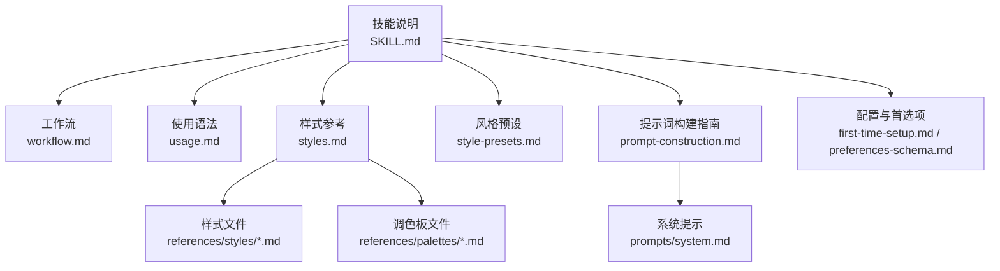
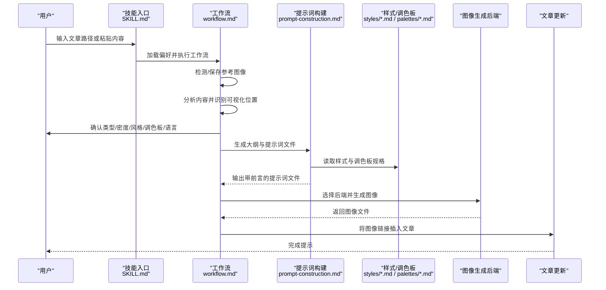
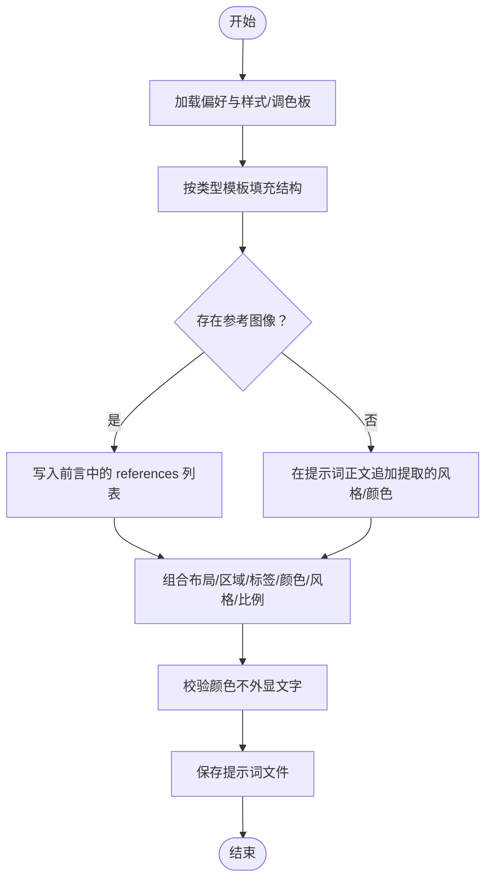
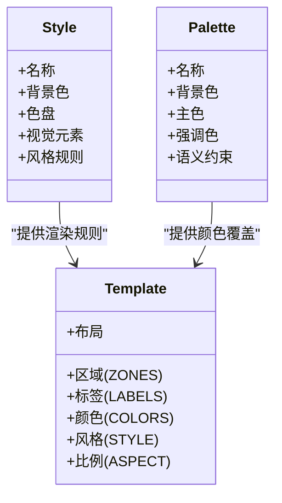
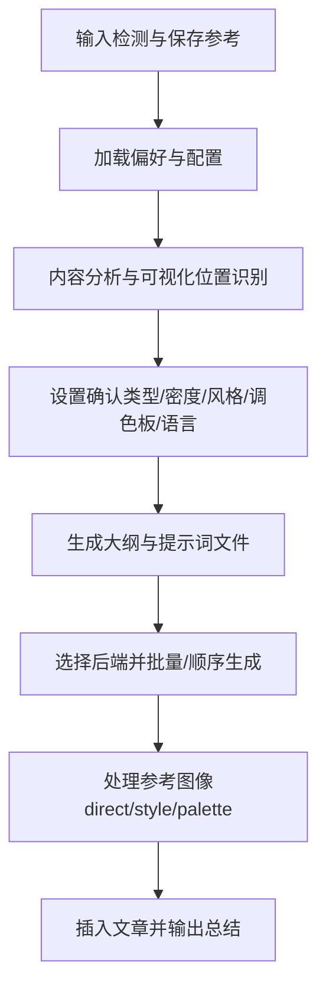
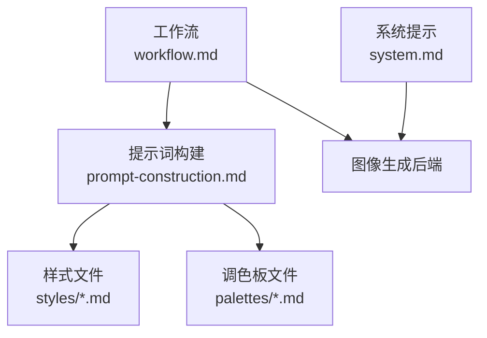

# 提示词构建与模板

<cite>
**本文引用的文件**
- [SKILL.md](file://.agents/skills/baoyu-article-illustrator/SKILL.md)
- [prompt-construction.md](file://.agents/skills/baoyu-article-illustrator/references/prompt-construction.md)
- [styles.md](file://.agents/skills/baoyu-article-illustrator/references/styles.md)
- [style-presets.md](file://.agents/skills/baoyu-article-illustrator/references/style-presets.md)
- [usage.md](file://.agents/skills/baoyu-article-illustrator/references/usage.md)
- [workflow.md](file://.agents/skills/baoyu-article-illustrator/references/workflow.md)
- [system.md](file://.agents/skills/baoyu-article-illustrator/prompts/system.md)
- [blueprint.md](file://.agents/skills/baoyu-article-illustrator/references/styles/blueprint.md)
- [vector-illustration.md](file://.agents/skills/baoyu-article-illustrator/references/styles/vector-illustration.md)
- [sketch-notes.md](file://.agents/skills/baoyu-article-illustrator/references/styles/sketch-notes.md)
- [macaron.md](file://.agents/skills/baoyu-article-illustrator/references/palettes/macaron.md)
- [warm.md](file://.agents/skills/baoyu-article-illustrator/references/palettes/warm.md)
- [neon.md](file://.agents/skills/baoyu-article-illustrator/references/palettes/neon.md)
- [mono-ink.md](file://.agents/skills/baoyu-article-illustrator/references/palettes/mono-ink.md)
- [first-time-setup.md](file://.agents/skills/baoyu-article-illustrator/references/config/first-time-setup.md)
- [preferences-schema.md](file://.agents/skills/baoyu-article-illustrator/references/config/preferences-schema.md)
</cite>

## 目录
1. [简介](#简介)
2. [项目结构](#项目结构)
3. [核心组件](#核心组件)
4. [架构总览](#架构总览)
5. [详细组件分析](#详细组件分析)
6. [依赖关系分析](#依赖关系分析)
7. [性能考量](#性能考量)
8. [故障排查指南](#故障排查指南)
9. [结论](#结论)
10. [附录](#附录)

## 简介
本文件面向 baoyu-article-illustrator 技能的提示词构建与模板系统，系统性阐述如何基于“类型 × 风格 × 调色板”的三维一致性，将文章内容转化为结构化的插画提示词，并规范提示词文件的保存格式、命名与版本管理。文档覆盖以下关键主题：
- ZONES（区域）、LABELS（标签）、COLORS（颜色）、STYLE（风格）、ASPECT（比例）等提示词要素的定义、作用与使用规则
- 不同类型插画（信息图、场景、流程图、对比图、框架图、时间线）的模板设计原则与应用策略
- 提示词文件的命名规范、保存位置、版本管理与回溯机制
- 最佳实践与常见问题的解决方案

## 项目结构
技能相关资料集中于 .agents/skills/baoyu-article-illustrator 目录，包含技能说明、参考文档、样式与调色板定义、配置与首选项等。核心文件如下：
- 技能说明：SKILL.md
- 参考文档：prompt-construction.md、styles.md、style-presets.md、usage.md、workflow.md
- 系统提示：prompts/system.md
- 样式与调色板：references/styles/*.md、references/palettes/*.md
- 配置与首选项：references/config/first-time-setup.md、references/config/preferences-schema.md

**图表来源**
- [SKILL.md:1-241](file://.agents/skills/baoyu-article-illustrator/SKILL.md#L1-L241)
- [workflow.md:1-432](file://.agents/skills/baoyu-article-illustrator/references/workflow.md#L1-L432)
- [usage.md:1-83](file://.agents/skills/baoyu-article-illustrator/references/usage.md#L1-L83)
- [styles.md:1-237](file://.agents/skills/baoyu-article-illustrator/references/styles.md#L1-L237)
- [style-presets.md:1-88](file://.agents/skills/baoyu-article-illustrator/references/style-presets.md#L1-L88)
- [prompt-construction.md:1-460](file://.agents/skills/baoyu-article-illustrator/references/prompt-construction.md#L1-L460)
- [system.md:1-33](file://.agents/skills/baoyu-article-illustrator/prompts/system.md#L1-L33)

**章节来源**
- [SKILL.md:1-241](file://.agents/skills/baoyu-article-illustrator/SKILL.md#L1-L241)

## 核心组件
- 类型（Type）：信息图、场景、流程图、对比图、框架图、时间线。用于确定插画的结构性组织方式与表达重点。
- 风格（Style）：手绘笔记、矢量插画、蓝图、水彩、海报等。决定线条、色彩、纹理、排版与情绪基调。
- 调色板（Palette）：macaron、warm、neon、mono-ink 等。在风格基础上进行色彩覆盖与语义化约束。
- 提示词模板（Template）：按类型划分的结构化模板，强制包含布局、区域、标签、颜色、风格特征与比例。
- 工作流（Workflow）：从输入检测、偏好加载、内容分析、设置确认、大纲生成到图像生成与落位的完整流程。

**章节来源**
- [SKILL.md:57-93](file://.agents/skills/baoyu-article-illustrator/SKILL.md#L57-L93)
- [styles.md:1-237](file://.agents/skills/baoyu-article-illustrator/references/styles.md#L1-L237)
- [style-presets.md:1-88](file://.agents/skills/baoyu-article-illustrator/references/style-presets.md#L1-L88)
- [prompt-construction.md:1-460](file://.agents/skills/baoyu-article-illustrator/references/prompt-construction.md#L1-L460)
- [workflow.md:1-432](file://.agents/skills/baoyu-article-illustrator/references/workflow.md#L1-L432)

## 架构总览
下图展示从用户输入到最终图像落位的关键步骤与数据流：

**图表来源**
- [SKILL.md:84-206](file://.agents/skills/baoyu-article-illustrator/SKILL.md#L84-L206)
- [workflow.md:297-432](file://.agents/skills/baoyu-article-illustrator/references/workflow.md#L297-L432)
- [prompt-construction.md:1-460](file://.agents/skills/baoyu-article-illustrator/references/prompt-construction.md#L1-L460)
- [styles.md:1-237](file://.agents/skills/baoyu-article-illustrator/references/styles.md#L1-L237)

## 详细组件分析

### 提示词构建与模板系统
- 文件格式与前言字段
  - 使用 YAML 前言 + 内容体的结构，前言包含插画标识、类型、风格、可选调色板与参考图像列表。
  - 参考图像仅当文件实际存在于 references/ 目录时才写入前言；否则需在提示词正文追加提取的风格与颜色信息。
- 默认构图要求
  - 清晰构图、充足留白、避免复杂背景、主元素居中或按内容需要定位、图形与主题一致、通过留白突出核心信息。
- 颜色规范
  - 颜色以十六进制值作为渲染指导，严禁在图像中显示颜色名称、十六进制码或调色板标签的文字。
- 人物绘制
  - 使用简化卡通剪影或符号化表情，避免写实人像与细节面部刻画；多角色时体现体型多样性；通过姿态与简单手势传达情感。
- 文字规范
  - 字号大而清晰、手写风格字体优先、内容精炼为关键词与核心概念、与文章语言一致。
- 提示词原则
  - 先布局结构，再具体数据/标签，再视觉关系，再语义化颜色，再风格特征，最后指定比例与复杂度等级。
- 类型模板
  - 信息图：强调网格/径向/层级布局，明确区域、标签、颜色映射、风格与 16:9 比例。
  - 场景：聚焦焦点对象、氛围、情绪温度与风格。
  - 流程图：明确步骤序列、连接关系与风格。
  - 对比图：左右分栏与视觉分隔，强调对比。
  - 框架图：结构形态（层级/网络/矩阵）、节点与关系。
  - 时间线：方向（水平/垂直）、事件与标记。
- 屏幕印刷风格覆盖
  - 当风格为 screen-print 时，替换为扁平色块、无渐变、半调点纹理、负空间叙事、剪影与几何构图、粗体无衬线字体融入构图。
- 调色板覆盖规则
  - 读取样式文件获取渲染规则；读取调色板文件获取颜色与背景；调色板颜色替换样式的默认色盘；调色板背景替换样式背景（保留纹理描述）；构建提示词：样式渲染指令 + 调色板颜色。
- 避免事项
  - 避免模糊描述、直译隐喻、缺失具体标签/注释、通用装饰元素。
- 水印集成
  - 若启用水印，在提示词末尾追加“包含一个位于某位置的细微水印”等说明。

**图表来源**
- [prompt-construction.md:1-460](file://.agents/skills/baoyu-article-illustrator/references/prompt-construction.md#L1-L460)

**章节来源**
- [prompt-construction.md:1-460](file://.agents/skills/baoyu-article-illustrator/references/prompt-construction.md#L1-L460)

### 样式与调色板
- 样式参考
  - 核心样式简表：手绘（sketch-notes 默认）、矢量（vector-illustration）、极简（notion）、科幻（blueprint）、新闻（editorial）、场景（warm/watercolor）、海报（screen-print）。
  - 样式画廊：包含多种风格的描述与适用场景，支持按类型与内容信号自动推荐。
  - 类型 × 样式兼容矩阵：明确不同类型的高推荐/兼容/不推荐组合。
- 调色板
  - macaron：柔和马卡龙色块与暖奶油背景，适合知识类与教育类内容。
  - warm：暖色系为主（橙/赭/金），无冷色，现代复古感，适合品牌与生活方式。
  - neon：暗背景上的高对比霓虹色，适合游戏、复古科技与流行文化。
  - mono-ink：纯白画布与黑墨，稀疏语义色（珊瑚红/哑光青/灰薰衣草），适合专业视觉笔记与前后对比。
- 覆盖规则
  - 调色板覆盖样式默认色盘与背景，保留样式纹理描述。

**图表来源**
- [styles.md:1-237](file://.agents/skills/baoyu-article-illustrator/references/styles.md#L1-L237)
- [style-presets.md:1-88](file://.agents/skills/baoyu-article-illustrator/references/style-presets.md#L1-L88)
- [macaron.md:1-34](file://.agents/skills/baoyu-article-illustrator/references/palettes/macaron.md#L1-L34)
- [warm.md:1-33](file://.agents/skills/baoyu-article-illustrator/references/palettes/warm.md#L1-L33)
- [neon.md:1-34](file://.agents/skills/baoyu-article-illustrator/references/palettes/neon.md#L1-L34)
- [mono-ink.md:1-43](file://.agents/skills/baoyu-article-illustrator/references/palettes/mono-ink.md#L1-L43)

**章节来源**
- [styles.md:1-237](file://.agents/skills/baoyu-article-illustrator/references/styles.md#L1-L237)
- [style-presets.md:1-88](file://.agents/skills/baoyu-article-illustrator/references/style-presets.md#L1-L88)
- [macaron.md:1-34](file://.agents/skills/baoyu-article-illustrator/references/palettes/macaron.md#L1-L34)
- [warm.md:1-33](file://.agents/skills/baoyu-article-illustrator/references/palettes/warm.md#L1-L33)
- [neon.md:1-34](file://.agents/skills/baoyu-article-illustrator/references/palettes/neon.md#L1-L34)
- [mono-ink.md:1-43](file://.agents/skills/baoyu-article-illustrator/references/palettes/mono-ink.md#L1-L43)

### 工作流与提示词文件管理
- 步骤概览
  - 预检查：检测并保存参考图像、加载偏好、确定输出目录。
  - 内容分析：识别内容类型、目的、核心论点与可视化位置。
  - 设置确认：类型/密度/风格/调色板/语言的最终确认。
  - 大纲生成：保存 outline.md，包含类型、密度、风格、图片数量与可选参考。
  - 图像生成：为每个插画创建提示词文件，遵循类型模板与结构化要素，保存至 prompts/ 子目录。
  - 结束：将图像链接插入文章并输出总结。
- 提示词文件命名与保存
  - 命名：NN-{type}-{slug}.md，其中 NN 为两位序号，type 为类型，slug 为 2-4 个单词的短横线连接形式。
  - 冲突处理：若同名冲突，自动追加日期时间戳后缀。
  - 保存位置：与输出目录一致，通常在 {article-dir}/illustrations/ 或独立目录。
- 版本管理与回溯
  - 提示词文件即“可复现记录”，可在不同后端间切换而不重算；失败时可重试一次。
  - 如需修改，更新提示词 → 重新生成 → 更新参考；新增/删除按修改流程操作。

**图表来源**
- [workflow.md:1-432](file://.agents/skills/baoyu-article-illustrator/references/workflow.md#L1-L432)
- [SKILL.md:184-206](file://.agents/skills/baoyu-article-illustrator/SKILL.md#L184-L206)

**章节来源**
- [workflow.md:1-432](file://.agents/skills/baoyu-article-illustrator/references/workflow.md#L1-L432)
- [SKILL.md:184-206](file://.agents/skills/baoyu-article-illustrator/SKILL.md#L184-L206)

### 系统提示与生成约束
- 系统提示用于统一生成器的风格与质量控制，例如手绘风格、16:9 横版、简洁信息呈现、文本手写字体等。
- 生成器需遵循“渲染指导只用于颜色，不得在图像中显示颜色名称/十六进制码/调色板标签”。

**章节来源**
- [system.md:1-33](file://.agents/skills/baoyu-article-illustrator/prompts/system.md#L1-L33)
- [prompt-construction.md:70-80](file://.agents/skills/baoyu-article-illustrator/references/prompt-construction.md#L70-L80)

### 配置与首选项
- 首次设置
  - 引导用户完成水印、默认风格、输出目录与保存位置的选择，生成 EXTEND.md。
- 首选项模式
  - 支持启用/禁用水印、设置默认风格、语言、输出目录、首选图像后端、自定义样式等。
- 后续修改
  - 可直接编辑 EXTEND.md 或重新触发首次设置以变更偏好。

**章节来源**
- [first-time-setup.md:1-141](file://.agents/skills/baoyu-article-illustrator/references/config/first-time-setup.md#L1-L141)
- [preferences-schema.md:1-133](file://.agents/skills/baoyu-article-illustrator/references/config/preferences-schema.md#L1-L133)

## 依赖关系分析
- 组件耦合
  - 提示词构建依赖样式与调色板文件；工作流驱动提示词生成与图像生成；系统提示统一生成器风格。
- 外部依赖
  - 图像生成后端（如 baoyu-imagine、Codex imagegen 等）由首选项与运行时环境决定。
- 潜在循环依赖
  - 未发现直接循环；样式/调色板与提示词模板为单向依赖。
- 接口契约
  - 提示词文件必须先于生成；参考图像仅在文件存在时写入前言；生成后端需支持批量接口以提升效率。

**图表来源**
- [prompt-construction.md:1-460](file://.agents/skills/baoyu-article-illustrator/references/prompt-construction.md#L1-L460)
- [styles.md:1-237](file://.agents/skills/baoyu-article-illustrator/references/styles.md#L1-L237)
- [workflow.md:1-432](file://.agents/skills/baoyu-article-illustrator/references/workflow.md#L1-L432)
- [system.md:1-33](file://.agents/skills/baoyu-article-illustrator/prompts/system.md#L1-L33)

**章节来源**
- [prompt-construction.md:1-460](file://.agents/skills/baoyu-article-illustrator/references/prompt-construction.md#L1-L460)
- [workflow.md:1-432](file://.agents/skills/baoyu-article-illustrator/references/workflow.md#L1-L432)

## 性能考量
- 批量生成优先：当多个提示词文件已就绪且任务为纯生成时，优先使用后端的批量接口，减少子代理开销。
- 顺序生成：若后端无批量能力，则按序生成，确保稳定性。
- 失败重试：单次失败自动重试一次，降低整体中断概率。
- 参考图像处理：尽量使用后端支持的 --ref 参数传递，避免冗长文本描述导致上下文膨胀。

**章节来源**
- [workflow.md:337-340](file://.agents/skills/baoyu-article-illustrator/references/workflow.md#L337-L340)
- [prompt-construction.md:453-460](file://.agents/skills/baoyu-article-illustrator/references/prompt-construction.md#L453-L460)

## 故障排查指南
- 未找到 EXTEND.md
  - 现象：阻塞式提示需先完成首次设置。
  - 处理：运行首次设置流程，生成 EXTEND.md 后继续。
- 提示词文件缺失
  - 现象：生成前必须存在提示词文件。
  - 处理：确认 outline.md 中的每个插画都对应 prompts/NN-{type}-{slug}.md 文件。
- 参考图像前言错误
  - 现象：frontmatter 中列出的参考文件不存在。
  - 处理：删除 references 字段或补全文件。
- 颜色外显问题
  - 现象：模型在图像中显示颜色名称/十六进制码/调色板标签。
  - 处理：在提示词中明确“颜色值与名称仅为渲染指导，不得显示为可见文本”。
- 后端不可用或冲突
  - 现象：首选后端不可用或存在多个非原生后端。
  - 处理：根据首选项与运行时工具选择策略，必要时询问用户一次性确认。

**章节来源**
- [first-time-setup.md:10-18](file://.agents/skills/baoyu-article-illustrator/references/config/first-time-setup.md#L10-L18)
- [workflow.md:341-345](file://.agents/skills/baoyu-article-illustrator/references/workflow.md#L341-L345)
- [prompt-construction.md:70-80](file://.agents/skills/baoyu-article-illustrator/references/prompt-construction.md#L70-L80)
- [SKILL.md:24-41](file://.agents/skills/baoyu-article-illustrator/SKILL.md#L24-L41)

## 结论
该系统通过“类型 × 风格 × 调色板”的三维一致性，结合结构化提示词模板与严格的文件管理规范，实现了从文章内容到插画提示词再到图像生成的高效闭环。遵循本文档的规则与最佳实践，可显著提升提示词质量、生成稳定性与可维护性。

## 附录

### 提示词要素详解
- ZONES（区域）
  - 明确每一块视觉区域的内容与职责，避免模糊描述。
- LABELS（标签）
  - 必须使用文章中的具体数字、术语、指标与引述，不得使用泛化占位符。
- COLORS（颜色）
  - 使用调色板或样式默认色盘，严格遵守“不得在图像中显示颜色名称/十六进制码/调色板标签”的约束。
- STYLE（风格）
  - 依据样式文件的渲染规则与视觉元素，描述线条、纹理、情绪与排版。
- ASPECT（比例）
  - 明确比例（如 16:9），并在提示词末尾标注复杂度等级。

**章节来源**
- [prompt-construction.md:111-121](file://.agents/skills/baoyu-article-illustrator/references/prompt-construction.md#L111-L121)

### 类型模板速查
- 信息图：强调网格/径向/层级布局，明确区域、标签、颜色映射、风格与 16:9 比例。
- 场景：聚焦焦点对象、氛围、情绪温度与风格。
- 流程图：明确步骤序列、连接关系与风格。
- 对比图：左右分栏与视觉分隔，强调对比。
- 框架图：结构形态（层级/网络/矩阵）、节点与关系。
- 时间线：方向（水平/垂直）、事件与标记。

**章节来源**
- [prompt-construction.md:122-220](file://.agents/skills/baoyu-article-illustrator/references/prompt-construction.md#L122-L220)

### 样式与调色板示例
- blueprint：工程蓝图风格，强调精确线条与技术图表。
- vector-illustration：扁平矢量风格，强调几何简化与复古软色。
- sketch-notes：手绘笔记风格，强调单页解释器的三段式布局与马卡龙色块。
- macaron：马卡龙柔和色块与奶油背景。
- warm：暖色系为主，无冷色。
- neon：暗背景高对比霓虹色。
- mono-ink：纯白画布与黑墨，稀疏语义色。

**章节来源**
- [blueprint.md:1-58](file://.agents/skills/baoyu-article-illustrator/references/styles/blueprint.md#L1-L58)
- [vector-illustration.md:1-58](file://.agents/skills/baoyu-article-illustrator/references/styles/vector-illustration.md#L1-L58)
- [sketch-notes.md:1-92](file://.agents/skills/baoyu-article-illustrator/references/styles/sketch-notes.md#L1-L92)
- [macaron.md:1-34](file://.agents/skills/baoyu-article-illustrator/references/palettes/macaron.md#L1-L34)
- [warm.md:1-33](file://.agents/skills/baoyu-article-illustrator/references/palettes/warm.md#L1-L33)
- [neon.md:1-34](file://.agents/skills/baoyu-article-illustrator/references/palettes/neon.md#L1-L34)
- [mono-ink.md:1-43](file://.agents/skills/baoyu-article-illustrator/references/palettes/mono-ink.md#L1-L43)

### 使用与命令示例
- 自动选择类型与风格：基于内容自动推断。
- 指定类型/风格/密度：通过命令行参数覆盖。
- 预设快捷键：使用 --preset 一键组合类型+风格（可选调色板）。
- 输出目录：支持同目录、文章子目录、独立目录等选项。

**章节来源**
- [usage.md:1-83](file://.agents/skills/baoyu-article-illustrator/references/usage.md#L1-L83)
- [style-presets.md:1-88](file://.agents/skills/baoyu-article-illustrator/references/style-presets.md#L1-L88)