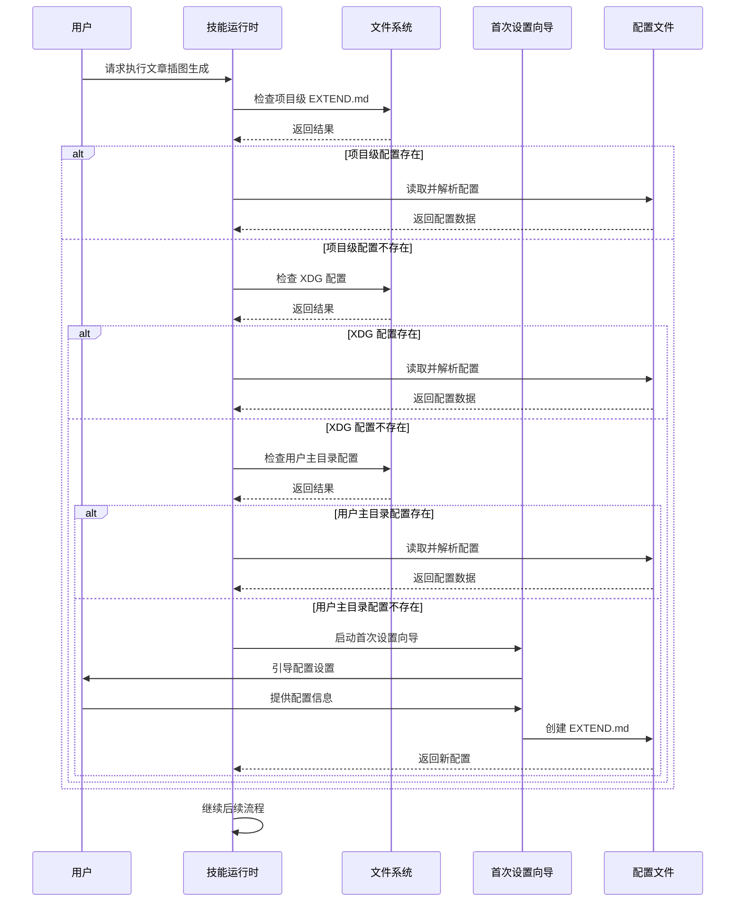
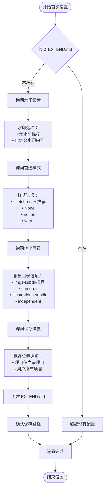
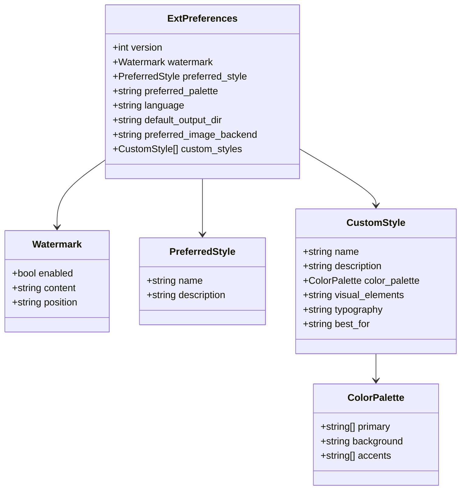
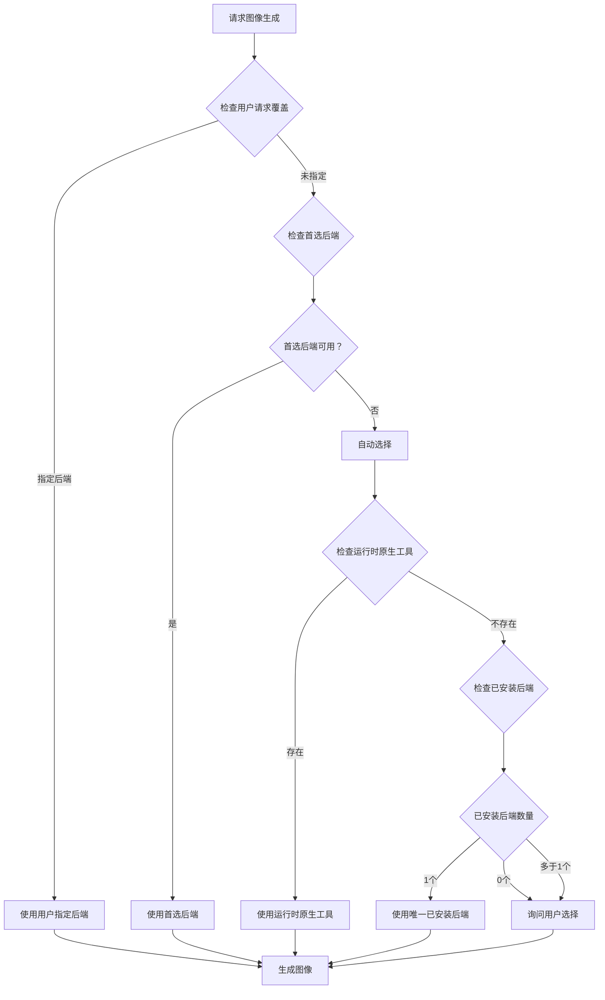
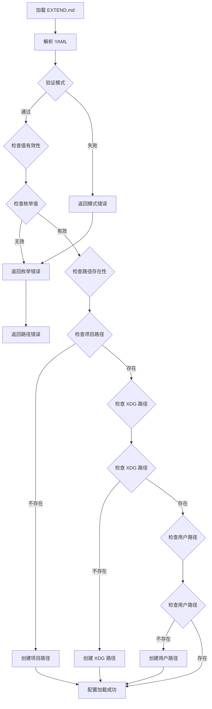
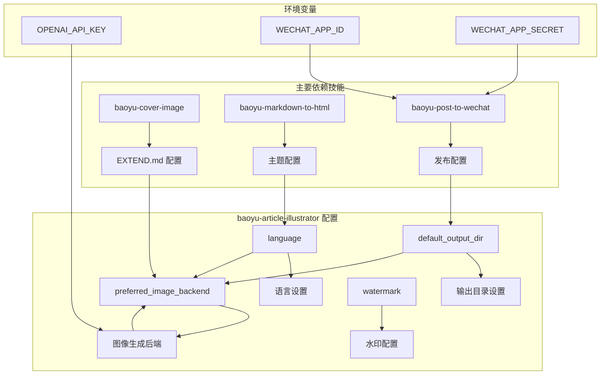

# 配置管理与首选项

<cite>
**本文档引用的文件**
- [SKILL.md](file://.agents/skills/baoyu-article-illustrator/SKILL.md)
- [preferences-schema.md](file://.agents/skills/baoyu-article-illustrator/references/config/preferences-schema.md)
- [first-time-setup.md](file://.agents/skills/baoyu-article-illustrator/references/config/first-time-setup.md)
- [workflow.md](file://.agents/skills/baoyu-article-illustrator/references/workflow.md)
- [usage.md](file://.agents/skills/baoyu-article-illustrator/references/usage.md)
- [styles.md](file://.agents/skills/baoyu-article-illustrator/references/styles.md)
- [style-presets.md](file://.agents/skills/baoyu-article-illustrator/references/style-presets.md)
- [macaron.md](file://.agents/skills/baoyu-article-illustrator/references/palettes/macaron.md)
- [warm.md](file://.agents/skills/baoyu-article-illustrator/references/palettes/warm.md)
- [wechat-article-write/EXTEND.md](file://.agents/skills/wechat-article-write/EXTEND.md)
</cite>

## 目录
1. [简介](#简介)
2. [项目结构](#项目结构)
3. [核心组件](#核心组件)
4. [架构概览](#架构概览)
5. [详细组件分析](#详细组件分析)
6. [依赖关系分析](#依赖关系分析)
7. [性能考虑](#性能考虑)
8. [故障排除指南](#故障排除指南)
9. [结论](#结论)

## 简介

baoyu-article-illustrator 技能的配置管理与首选项系统是一个基于 YAML 的配置框架，采用三层优先级查找机制来管理用户的偏好设置。该系统通过 EXTEND.md 文件实现配置持久化，支持项目级、XDG 规范级和用户主目录级三种配置存储位置，确保配置的灵活性和可移植性。

系统的核心功能包括：
- **配置优先级管理**：自动检测和应用最高优先级的配置文件
- **首次设置向导**：引导用户完成初始配置
- **偏好项管理**：涵盖图像生成、样式选择、输出目录等全方位配置
- **交互式重配置**：支持动态修改和重新配置

## 项目结构

baoyu-article-illustrator 技能的配置相关文件组织结构如下：

```mermaid
graph TB
subgraph "配置文件层次结构"
A[EXTEND.md 配置文件] --> B[项目级配置<br/>.baoyu-skills/baoyu-article-illustrator/EXTEND.md]
A --> C[XDG 配置<br/>${XDG_CONFIG_HOME}/baoyu-skills/baoyu-article-illustrator/EXTEND.md]
A --> D[用户主目录配置<br/>~/.baoyu-skills/baoyu-article-illustrator/EXTEND.md]
end
subgraph "配置参考文件"
E[首选项模式] --> F[preferences-schema.md]
G[首次设置向导] --> H[first-time-setup.md]
I[工作流规范] --> J[workflow.md]
K[使用说明] --> L[usage.md]
end
subgraph "样式和调色板"
M[样式参考] --> N[styles.md]
O[样式预设] --> P[style-presets.md]
Q[调色板] --> R[macaron.md]
Q --> S[warm.md]
end
A --> E
A --> G
A --> I
A --> K
A --> M
A --> O
A --> Q
```

**图表来源**
- [SKILL.md: 99-112:99-112](file://.agents/skills/baoyu-article-illustrator/SKILL.md#L99-L112)
- [preferences-schema.md: 10-42:10-42](file://.agents/skills/baoyu-article-illustrator/references/config/preferences-schema.md#L10-L42)

**章节来源**
- [SKILL.md: 95-112:95-112](file://.agents/skills/baoyu-article-illustrator/SKILL.md#L95-L112)
- [workflow.md: 84-111:84-111](file://.agents/skills/baoyu-article-illustrator/references/workflow.md#L84-L111)

## 核心组件

### 配置文件优先级系统

系统采用三层优先级查找机制，确保配置的正确性和一致性：

| 优先级 | 路径 | 作用域 | 查找逻辑 |
|--------|------|--------|----------|
| 1 | `.baoyu-skills/baoyu-article-illustrator/EXTEND.md` | 项目级 | 最高优先级，仅当前项目有效 |
| 2 | `${XDG_CONFIG_HOME:-$HOME/.config}/baoyu-skills/baoyu-article-illustrator/EXTEND.md` | XDG 规范级 | 符合 XDG 基础目录规范 |
| 3 | `$HOME/.baoyu-skills/baoyu-article-illustrator/EXTEND.md` | 用户主目录级 | 全局用户配置 |

### 首选项配置项完整列表

系统支持以下关键配置项：

#### 基础配置项

| 配置项 | 类型 | 默认值 | 描述 |
|--------|------|--------|------|
| `version` | 整数 | 1 | 配置版本号 |
| `watermark.enabled` | 布尔值 | false | 是否启用水印 |
| `watermark.content` | 字符串 | "" | 水印内容（@用户名或自定义文本） |
| `watermark.position` | 枚举 | bottom-right | 水印位置（四个角或底部中央） |
| `preferred_style.name` | 字符串 | null | 首选样式名称 |
| `preferred_style.description` | 字符串 | "" | 自定义样式描述或覆盖说明 |
| `preferred_palette` | 字符串 | null | 首选调色板（macaron、warm、neon 或 null） |
| `language` | 字符串 | null | 输出语言设置（zh、en、ja、ko、auto） |
| `default_output_dir` | 枚举 | null | 默认输出目录设置 |
| `preferred_image_backend` | 字符串 | auto | 图像生成后端偏好 |
| `custom_styles` | 数组 | [] | 用户自定义样式集合 |

#### 输出目录配置选项

| 选项值 | 实际路径 | 相对文章路径 |
|--------|----------|--------------|
| `same-dir` | `{article-dir}/` | `NN-{type}-{slug}.png` |
| `illustrations-subdir` | `{article-dir}/illustrations/` | `illustrations/NN-{type}-{slug}.png` |
| `independent` | `illustrations/{topic-slug}/` | `illustrations/{topic-slug}/NN-{type}-{slug}.png` |

#### 水印位置选项

| 选项值 | 描述 |
|--------|------|
| `bottom-right` | 底部右侧（默认，最常用） |
| `bottom-left` | 底部左侧 |
| `bottom-center` | 底部中央 |
| `top-right` | 顶部右侧 |

**章节来源**
- [preferences-schema.md: 46-58:46-58](file://.agents/skills/baoyu-article-illustrator/references/config/preferences-schema.md#L46-L58)
- [preferences-schema.md: 69-76:69-76](file://.agents/skills/baoyu-article-illustrator/references/config/preferences-schema.md#L69-L76)
- [preferences-schema.md: 60-68:60-68](file://.agents/skills/baoyu-article-illustrator/references/config/preferences-schema.md#L60-L68)
- [SKILL.md: 184-194:184-194](file://.agents/skills/baoyu-article-illustrator/SKILL.md#L184-L194)

## 架构概览

### 配置加载流程



**图表来源**
- [SKILL.md: 97-111:97-111](file://.agents/skills/baoyu-article-illustrator/SKILL.md#L97-L111)
- [workflow.md: 84-111:84-111](file://.agents/skills/baoyu-article-illustrator/references/workflow.md#L84-L111)

### 首次设置流程



**图表来源**
- [first-time-setup.md: 22-38:22-38](file://.agents/skills/baoyu-article-illustrator/references/config/first-time-setup.md#L22-L38)
- [first-time-setup.md: 46-100:46-100](file://.agents/skills/baoyu-article-illustrator/references/config/first-time-setup.md#L46-L100)

**章节来源**
- [first-time-setup.md: 20-141:20-141](file://.agents/skills/baoyu-article-illustrator/references/config/first-time-setup.md#L20-L141)

## 详细组件分析

### 配置文件结构分析

EXTEND.md 配置文件采用 YAML 前言格式，具有严格的结构要求：



**图表来源**
- [preferences-schema.md: 10-42:10-42](file://.agents/skills/baoyu-article-illustrator/references/config/preferences-schema.md#L10-L42)

### 图像生成后端选择机制

系统支持灵活的图像生成后端选择，具有智能的自动选择逻辑：



**图表来源**
- [SKILL.md: 24-41:24-41](file://.agents/skills/baoyu-article-illustrator/SKILL.md#L24-L41)

### 样式和调色板系统

系统提供了丰富的样式和调色板选择，支持自定义样式扩展：

#### 核心样式选项

| 样式类别 | 推荐用途 | 主要特点 |
|----------|----------|----------|
| `sketch-notes` | 教育类文章 | 温暖米色纸张，手绘线条，柔和粉彩色块 |
| `vector-illustration` | 技术教程 | 现代扁平矢量，几何形状，清晰层次 |
| `notion` | SaaS产品 | 简约手绘线条，中性色调，干净背景 |
| `warm` | 个人成长 | 温暖大地色调，柔和桃粉色，无冷色系 |
| `blueprint` | 技术架构 | 精确技术线条，网格布局，数据导向 |
| `watercolor` | 生活方式 | 软艺术效果，自然温暖，梦幻氛围 |

#### 调色板系统

| 调色板 | 主要颜色 | 使用场景 | 特点 |
|--------|----------|----------|------|
| `macaron` | 蓝天、薄荷、薰衣草、桃子 | 教育知识 | 柔和粉彩色块，适合学习材料 |
| `warm` | 橙色、赭石、金黄、深棕 | 品牌产品 | 温暖地球色调，现代复古感 |
| `neon` | 粉红、青色、黄色、深紫 | 游戏动漫 | 荧光色彩，暗色背景，流行文化 |
| `mono-ink` | 黑白配色，少量强调色 | 专业视觉笔记 | 黑色墨水配白色背景，强调色点缀 |

**章节来源**
- [styles.md: 7-17:7-17](file://.agents/skills/baoyu-article-illustrator/references/styles.md#L7-L17)
- [styles.md: 214-237:214-237](file://.agents/skills/baoyu-article-illustrator/references/styles.md#L214-L237)
- [macaron.md: 1-34:1-34](file://.agents/skills/baoyu-article-illustrator/references/palettes/macaron.md#L1-L34)
- [warm.md: 1-33:1-33](file://.agents/skills/baoyu-article-illustrator/references/palettes/warm.md#L1-L33)

### 配置验证和错误处理

系统实现了完善的配置验证机制：



**图表来源**
- [SKILL.md: 97-111:97-111](file://.agents/skills/baoyu-article-illustrator/SKILL.md#L97-L111)
- [workflow.md: 84-111:84-111](file://.agents/skills/baoyu-article-illustrator/references/workflow.md#L84-L111)

**章节来源**
- [SKILL.md: 95-112:95-112](file://.agents/skills/baoyu-article-illustrator/SKILL.md#L95-L112)
- [workflow.md: 84-111:84-111](file://.agents/skills/baoyu-article-illustrator/references/workflow.md#L84-L111)

## 依赖关系分析

### 技能间配置依赖关系

baoyu-article-illustrator 技能与其他相关技能存在配置依赖关系：



**图表来源**
- [wechat-article-write/EXTEND.md: 35-38:35-38](file://.agents/skills/wechat-article-write/EXTEND.md#L35-L38)
- [wechat-article-write/EXTEND.md: 48-61:48-61](file://.agents/skills/wechat-article-write/EXTEND.md#L48-L61)

### 配置文件依赖链

系统配置文件之间存在明确的依赖关系：

| 依赖文件 | 被依赖文件 | 依赖关系 | 作用 |
|----------|------------|----------|------|
| `preferences-schema.md` | `EXTEND.md` | 模式定义 | 验证配置格式 |
| `first-time-setup.md` | `EXTEND.md` | 设置向导 | 初始化配置 |
| `workflow.md` | `EXTEND.md` | 工作流控制 | 执行流程控制 |
| `styles.md` | `EXTEND.md` | 样式选择 | 样式参考 |
| `style-presets.md` | `EXTEND.md` | 预设选择 | 快速配置 |

**章节来源**
- [wechat-article-write/EXTEND.md: 29-38:29-38](file://.agents/skills/wechat-article-write/EXTEND.md#L29-L38)

## 性能考虑

### 配置加载性能优化

系统在配置加载方面采用了多项性能优化措施：

1. **延迟加载**：配置文件仅在需要时才进行解析和验证
2. **缓存机制**：已解析的配置在会话期间缓存，避免重复解析
3. **并行检查**：多级配置文件检查采用并行策略，提高查找效率
4. **增量更新**：支持配置的增量更新，避免全量重载

### 存储和访问优化

- **文件系统优化**：合理组织配置文件结构，减少文件系统查询次数
- **内存管理**：配置数据在内存中保持轻量级表示，避免不必要的数据复制
- **I/O 优化**：批量处理配置文件操作，减少磁盘 I/O 次数

## 故障排除指南

### 常见配置问题及解决方案

#### 配置文件找不到

**问题症状**：系统无法找到任何 EXTEND.md 配置文件

**解决步骤**：
1. 检查配置文件是否存在
2. 验证文件权限设置
3. 确认文件路径正确性
4. 运行首次设置向导重新创建配置

#### 配置格式错误

**问题症状**：配置文件解析失败，显示 YAML 错误

**解决步骤**：
1. 使用 YAML 验证工具检查语法
2. 对照 `preferences-schema.md` 检查字段格式
3. 确认枚举值在允许范围内
4. 验证数组和对象结构

#### 配置冲突

**问题症状**：多个配置文件同时存在导致冲突

**解决步骤**：
1. 确认配置优先级顺序
2. 删除不需要的配置文件
3. 清理缓存数据
4. 重新启动技能

#### 首次设置失败

**问题症状**：首次设置向导无法正常运行

**解决步骤**：
1. 检查网络连接
2. 验证用户输入的有效性
3. 确认目标目录可写
4. 查看日志文件获取详细错误信息

### 调试和诊断

系统提供了多种调试和诊断工具：

1. **配置验证器**：检查配置文件的完整性和有效性
2. **日志记录**：详细记录配置加载过程和错误信息
3. **状态报告**：显示当前生效的配置项和来源
4. **兼容性检查**：验证配置与当前环境的兼容性

**章节来源**
- [SKILL.md: 228-241:228-241](file://.agents/skills/baoyu-article-illustrator/SKILL.md#L228-L241)

## 结论

baoyu-article-illustrator 技能的配置管理与首选项系统通过精心设计的三层优先级架构，为用户提供了灵活、可靠且易于使用的配置体验。系统不仅支持基本的配置管理功能，还提供了完整的首次设置向导、交互式重配置能力和丰富的样式调色板选择。

该系统的成功之处在于：
- **层次化的配置管理**：通过项目级、XDG 和用户级三个层次确保配置的灵活性
- **智能化的配置选择**：自动检测和应用最优配置，减少用户干预
- **完善的错误处理**：提供全面的错误检测和恢复机制
- **良好的扩展性**：支持用户自定义样式和配置项的扩展

对于开发者而言，该系统提供了清晰的配置接口和完善的文档支持；对于最终用户而言，系统通过直观的交互界面和智能的配置建议，大大降低了使用门槛。这种平衡的设计使得 baoyu-article-illustrator 技能在保持强大功能的同时，也具备了优秀的用户体验。