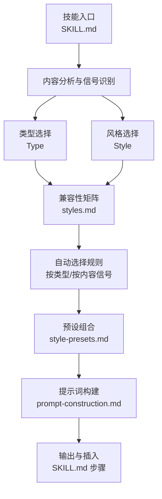
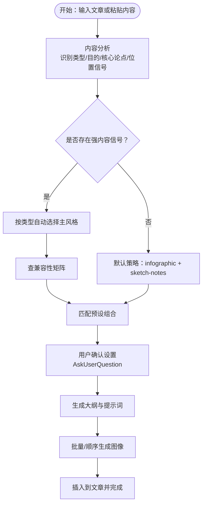
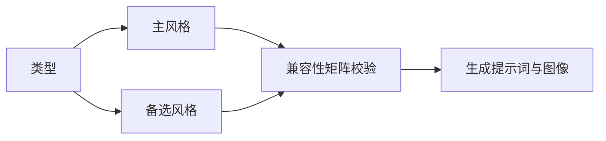
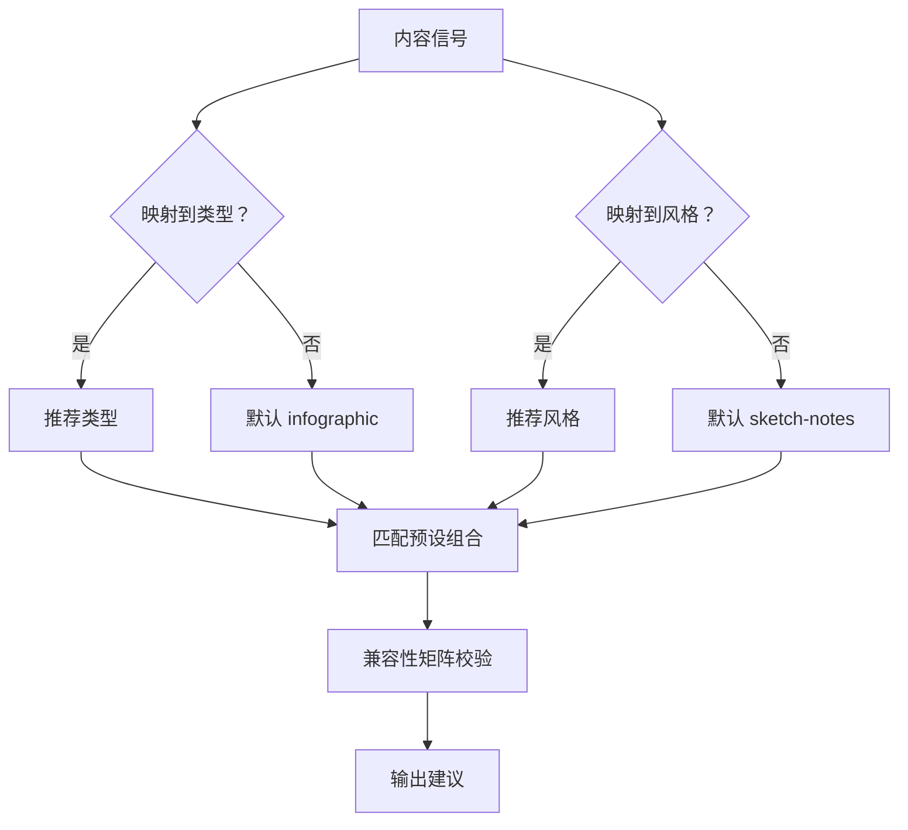
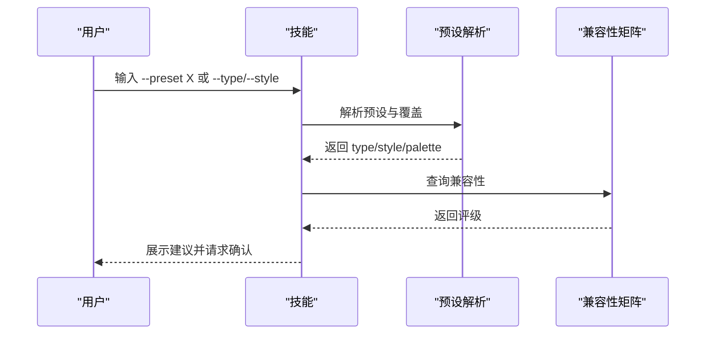
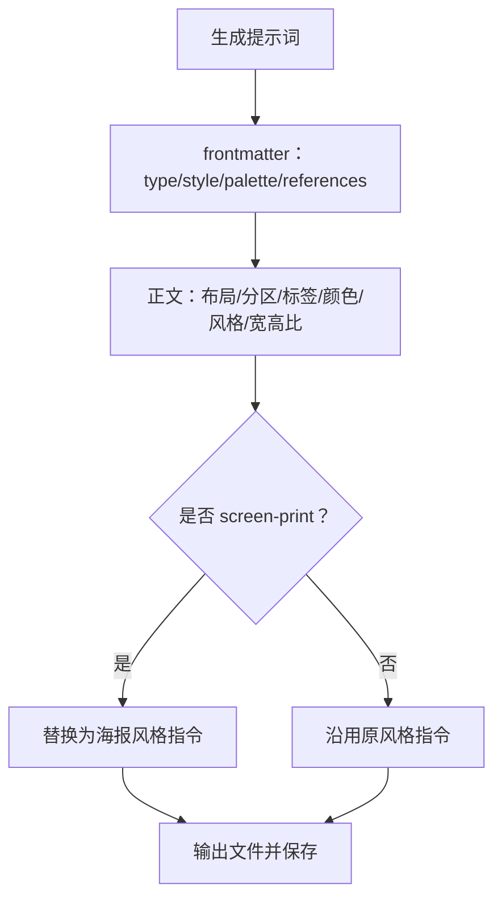
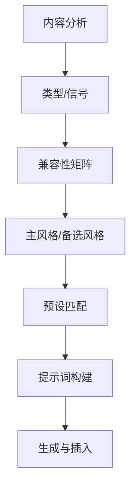

# 兼容性矩阵

<cite>
**本文引用的文件**
- [SKILL.md](file://.agents/skills/baoyu-article-illustrator/SKILL.md)
- [styles.md](file://.agents/skills/baoyu-article-illustrator/references/styles.md)
- [style-presets.md](file://.agents/skills/baoyu-article-illustrator/references/style-presets.md)
- [prompt-construction.md](file://.agents/skills/baoyu-article-illustrator/references/prompt-construction.md)
- [usage.md](file://.agents/skills/baoyu-article-illustrator/references/usage.md)
- [first-time-setup.md](file://.agents/skills/baoyu-article-illustrator/references/config/first-time-setup.md)
- [sketch-notes.md](file://.agents/skills/baoyu-article-illustrator/references/styles/sketch-notes.md)
- [vector-illustration.md](file://.agents/skills/baoyu-article-illustrator/references/styles/vector-illustration.md)
- [blueprint.md](file://.agents/skills/baoyu-article-illustrator/references/styles/blueprint.md)
- [notion.md](file://.agents/skills/baoyu-article-illustrator/references/styles/notion.md)
- [warm.md](file://.agents/skills/baoyu-article-illustrator/references/styles/warm.md)
</cite>

## 目录
1. [简介](#简介)
2. [项目结构](#项目结构)
3. [核心组件](#核心组件)
4. [架构总览](#架构总览)
5. [详细组件分析](#详细组件分析)
6. [依赖关系分析](#依赖关系分析)
7. [性能考量](#性能考量)
8. [故障排查指南](#故障排查指南)
9. [结论](#结论)
10. [附录](#附录)

## 简介
本文件面向 baoyu-article-illustrator 技能，系统化梳理“图表类型 × 艺术风格”的兼容性矩阵与自动选择规则，明确兼容性评级（✓✓高度推荐、✓兼容、✗不推荐）的判断依据，并给出基于内容信号的风格决策流程、使用示例与最佳实践建议。读者可据此在不同文章主题与表达目标下，快速确定合适的 Type × Style × Palette 组合。

## 项目结构
该技能围绕“三维度”（Type × Style × Palette）组织能力，核心参考材料包括：
- 类型与风格参考：references/styles.md
- 预设组合：references/style-presets.md
- 提示词构建规范：references/prompt-construction.md
- 使用方式与示例：references/usage.md
- 首次配置流程：references/config/first-time-setup.md
- 单个风格细节：references/styles/*.md（如 sketch-notes、vector-illustration、blueprint、notion、warm）



**图表来源**
- [SKILL.md:84-93](file://.agents/skills/baoyu-article-illustrator/SKILL.md#L84-L93)
- [styles.md:51-96](file://.agents/skills/baoyu-article-illustrator/references/styles.md#L51-L96)
- [style-presets.md:62-81](file://.agents/skills/baoyu-article-illustrator/references/style-presets.md#L62-L81)
- [prompt-construction.md:122-140](file://.agents/skills/baoyu-article-illustrator/references/prompt-construction.md#L122-L140)

**章节来源**
- [SKILL.md:67-93](file://.agents/skills/baoyu-article-illustrator/SKILL.md#L67-L93)
- [usage.md:3-24](file://.agents/skills/baoyu-article-illustrator/references/usage.md#L3-L24)

## 核心组件
- 图表类型（Type）
  - infographic、scene、flowchart、comparison、framework、timeline
- 艺术风格（Style）
  - vector-illustration、notion、elegant、warm、minimal、blueprint、watercolor、editorial、scientific、chalkboard、fantasy-animation、flat、flat-doodle、intuition-machine、nature、pixel-art、playful、retro、sketch、screen-print、sketch-notes、ink-notes、vintage
- 色彩调色板（Palette）
  - macaron、warm、neon、mono-ink（可覆盖风格默认色）

上述维度在技能工作流中协同作用：先由内容分析给出类型与风格倾向，再结合兼容性矩阵与自动选择规则，最终形成 Type × Style × Palette 的稳定组合。

**章节来源**
- [SKILL.md:69-82](file://.agents/skills/baoyu-article-illustrator/SKILL.md#L69-L82)
- [styles.md:21-49](file://.agents/skills/baoyu-article-illustrator/references/styles.md#L21-L49)
- [styles.md:214-225](file://.agents/skills/baoyu-article-illustrator/references/styles.md#L214-L225)

## 架构总览
下图展示从内容信号到风格选择、再到兼容性矩阵与自动规则的决策链路。



**图表来源**
- [styles.md:64-96](file://.agents/skills/baoyu-article-illustrator/references/styles.md#L64-L96)
- [style-presets.md:62-81](file://.agents/skills/baoyu-article-illustrator/references/style-presets.md#L62-L81)
- [SKILL.md:114-141](file://.agents/skills/baoyu-article-illustrator/SKILL.md#L114-L141)

## 详细组件分析

### 兼容性矩阵与评级标准
- 评级含义
  - ✓✓ 高度推荐：风格与类型在视觉语言、布局与表达目标上高度契合
  - ✓ 兼容：风格与类型基本匹配，但可能需注意细节调整
  - ✗ 不推荐：风格与类型存在明显违和，易导致信息传达失真
- 判定依据
  - 视觉语言一致性：线条、色彩、质感是否与类型表达一致
  - 布局与焦点：是否利于承载类型所需的结构化/叙事化/对比化信息
  - 表达目标：是否有助于达成“信息/可视化/想象”的目标

```mermaid
table
title 图表类型 × 风格 兼容性矩阵节选
head
col 0 类型/风格
col 1 sketch-notes
col 2 vector-illustration
col 3 notion
col 4 warm
col 5 minimal
col 6 blueprint
col 7 watercolor
col 8 elegant
col 9 editorial
col 10 scientific
col 11 screen-print
row 0 infographic
cell ✓✓
cell ✓✓
cell ✓✓
cell ✓
cell ✓✓
cell ✓✓
cell ✓
cell ✓✓
cell ✓✓
cell ✓✓
cell ✓
row 1 scene
cell ✗
cell ✓
cell ✓
cell ✓✓
cell ✓
cell ✗
cell ✓✓
cell ✓
cell ✓✓
cell ✗
cell ✓✓
row 2 flowchart
cell ✓✓
cell ✓✓
cell ✓✓
cell ✓
cell ✓
cell ✓✓
cell ✗
cell ✓
cell ✓✓
cell ✓
cell ✗
row 3 comparison
cell ✓✓
cell ✓✓
cell ✓✓
cell ✓
cell ✓✓
cell ✓
cell ✓
cell ✓✓
cell ✓✓
cell ✓
cell ✓
row 4 framework
cell ✓✓
cell ✓✓
cell ✓✓
cell ✓
cell ✓✓
cell ✓✓
cell ✗
cell ✓
cell ✓
cell ✓✓
cell ✓
row 5 timeline
cell ✓
cell ✓
cell ✓✓
cell ✓
cell ✓
cell ✓
cell ✓✓
cell ✓✓
cell ✓✓
cell ✓
cell ✓
```

**图表来源**
- [styles.md:51-62](file://.agents/skills/baoyu-article-illustrator/references/styles.md#L51-L62)

**章节来源**
- [styles.md:51-62](file://.agents/skills/baoyu-article-illustrator/references/styles.md#L51-L62)

### 自动选择规则（按类型）
当无强内容信号时，默认采用“infographic + sketch-notes”。若存在明确信号，则按类型优先选择主风格，辅以备选风格。



**图表来源**
- [styles.md:64-75](file://.agents/skills/baoyu-article-illustrator/references/styles.md#L64-L75)

**章节来源**
- [styles.md:64-75](file://.agents/skills/baoyu-article-illustrator/references/styles.md#L64-L75)

### 自动选择规则（按内容信号）
内容信号直接影响类型与风格的推荐组合，帮助在复杂主题中快速收敛到合适方案。



**图表来源**
- [styles.md:77-96](file://.agents/skills/baoyu-article-illustrator/references/styles.md#L77-L96)

**章节来源**
- [styles.md:77-96](file://.agents/skills/baoyu-article-illustrator/references/styles.md#L77-L96)

### 预设组合与覆盖规则
- 预设（--preset）一键展开为 type + style + 可选 palette
- 用户可在预设基础上覆盖 type 或 style；显式 flag 优先级高于预设
- 推荐在“无强信号”时优先考虑 hand-drawn-edu 系列预设



**图表来源**
- [style-presets.md:62-81](file://.agents/skills/baoyu-article-illustrator/references/style-presets.md#L62-L81)
- [styles.md:64-75](file://.agents/skills/baoyu-article-illustrator/references/styles.md#L64-L75)

**章节来源**
- [style-presets.md:62-81](file://.agents/skills/baoyu-article-illustrator/references/style-presets.md#L62-L81)

### 提示词构建与风格约束
- 每张图需保存独立 prompt 文件（prompts/NN-{type}-{slug}.md），包含 YAML frontmatter 与类型模板
- 强制要求：清洁构图、留白、无复杂背景、主体居中或按内容需要定位
- 文字：大字号、手写体风格、关键词为主、与文章语言一致
- 彩色：仅作渲染指导，不得显示颜色名/十六进制/调色板标签为可见文本
- 人物：简化卡通剪影或符号化表情，避免写实
- 特殊风格覆盖：screen-print 强制扁平色块、网点纹理、几何构图、负空间叙事



**图表来源**
- [prompt-construction.md:3-19](file://.agents/skills/baoyu-article-illustrator/references/prompt-construction.md#L3-L19)
- [prompt-construction.md:52-67](file://.agents/skills/baoyu-article-illustrator/references/prompt-construction.md#L52-L67)
- [prompt-construction.md:381-411](file://.agents/skills/baoyu-article-illustrator/references/prompt-construction.md#L381-L411)

**章节来源**
- [prompt-construction.md:3-19](file://.agents/skills/baoyu-article-illustrator/references/prompt-construction.md#L3-L19)
- [prompt-construction.md:52-67](file://.agents/skills/baoyu-article-illustrator/references/prompt-construction.md#L52-L67)
- [prompt-construction.md:381-411](file://.agents/skills/baoyu-article-illustrator/references/prompt-construction.md#L381-L411)

### 单风格细节对兼容性的影响
- sketch-notes：单页概念图友好，适合 infographic、framework、flowchart、comparison；scene 不推荐
- vector-illustration：扁平矢量风格，infographic/flowchart/framework 优秀；blueprint 亦可
- blueprint：技术蓝图风，infographic/flowchart/framework 优秀；scene 不推荐
- notion：极简手绘线稿，infographic/flowchart 优秀；scene/minimal 可用
- warm：亲和友好，scene/warm 优秀；infographic/timeline 可用

**章节来源**
- [sketch-notes.md:78-88](file://.agents/skills/baoyu-article-illustrator/references/styles/sketch-notes.md#L78-L88)
- [vector-illustration.md:55-58](file://.agents/skills/baoyu-article-illustrator/references/styles/vector-illustration.md#L55-L58)
- [blueprint.md:55-58](file://.agents/skills/baoyu-article-illustrator/references/styles/blueprint.md#L55-L58)
- [notion.md:56-59](file://.agents/skills/baoyu-article-illustrator/references/styles/notion.md#L56-L59)
- [warm.md:56-59](file://.agents/skills/baoyu-article-illustrator/references/styles/warm.md#L56-L59)

## 依赖关系分析
- 内容分析依赖于文章的语言、主题与结构，决定类型与风格倾向
- 兼容性矩阵与自动选择规则共同决定主风格与备选风格
- 预设组合在主风格与备选风格之外提供“一键可用”的稳定组合
- 提示词构建规范确保风格与类型在视觉层面保持一致
- 输出阶段严格遵循 SKILL.md 的步骤与路径约定



**图表来源**
- [styles.md:64-96](file://.agents/skills/baoyu-article-illustrator/references/styles.md#L64-L96)
- [style-presets.md:62-81](file://.agents/skills/baoyu-article-illustrator/references/style-presets.md#L62-L81)
- [prompt-construction.md:122-140](file://.agents/skills/baoyu-article-illustrator/references/prompt-construction.md#L122-L140)
- [SKILL.md:174-183](file://.agents/skills/baoyu-article-illustrator/SKILL.md#L174-L183)

**章节来源**
- [SKILL.md:174-183](file://.agents/skills/baoyu-article-illustrator/SKILL.md#L174-L183)

## 性能考量
- 批量生成优先：当后端支持批量接口时，优先使用批量以提升吞吐
- 重试机制：失败时允许一次重试，减少人工干预
- 输出目录策略：合理设置 default_output_dir，便于后续插入与维护

**章节来源**
- [SKILL.md:167-170](file://.agents/skills/baoyu-article-illustrator/SKILL.md#L167-L170)

## 故障排查指南
- 未找到 EXTEND.md：首次运行会触发 first-time-setup，按提示完成偏好设置后再继续
- 未保存 prompt 文件即开始生成：会阻塞并提示必须先保存 prompt 文件
- 后端不可用：根据 SKILL.md 的工具选择规则，优先使用运行时原生工具，其次回退到已安装的非原生后端
- 水印问题：若启用水印，请在 EXTEND.md 中配置水印内容与位置

**章节来源**
- [first-time-setup.md:10-18](file://.agents/skills/baoyu-article-illustrator/references/config/first-time-setup.md#L10-L18)
- [SKILL.md:36-38](file://.agents/skills/baoyu-article-illustrator/SKILL.md#L36-L38)
- [SKILL.md:28-34](file://.agents/skills/baoyu-article-illustrator/SKILL.md#L28-L34)

## 结论
通过“内容信号 → 类型/风格自动选择 → 兼容性矩阵校验 → 预设覆盖 → 提示词构建 → 生成与插入”的闭环，baoyu-article-illustrator 能在多样的文章主题中稳定产出高质量插图。建议在无强信号时优先采用 hand-drawn-edu 系列预设，遇到复杂主题时结合内容信号与兼容性矩阵进行微调，确保风格与类型在视觉与信息层面高度一致。

## 附录

### 使用示例与最佳实践
- 技术数据类文章：使用 tech-explainer 预设（infographic + blueprint），突出技术精确性
- 流程教程类文章：使用 tutorial 预设（flowchart + vector-illustration），强调步骤清晰
- 个人故事类文章：使用 storytelling 预设（scene + warm），营造情感氛围
- 商业对比类文章：使用 business-compare 预设（comparison + elegant），体现专业感
- 观点评论类文章：使用 opinion-piece 预设（scene + screen-print），强化视觉冲击力
- 复杂系统类文章：使用 system-design 预设（framework + blueprint），强调架构与层级

最佳实践要点
- 优先使用预设，必要时再覆盖 type 或 style
- 在无强信号时默认 hand-drawn-edu，确保通用可读性
- 严格遵守提示词构建规范，避免渲染出可见的颜色标签
- 保持留白与简洁，避免过度装饰干扰信息传达

**章节来源**
- [usage.md:52-82](file://.agents/skills/baoyu-article-illustrator/references/usage.md#L52-L82)
- [style-presets.md:62-81](file://.agents/skills/baoyu-article-illustrator/references/style-presets.md#L62-L81)
- [prompt-construction.md:70-78](file://.agents/skills/baoyu-article-illustrator/references/prompt-construction.md#L70-L78)