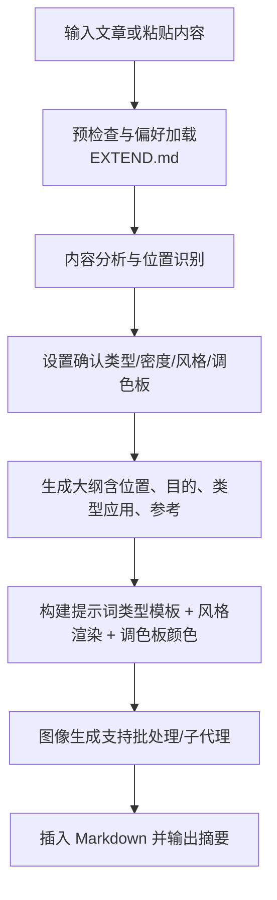
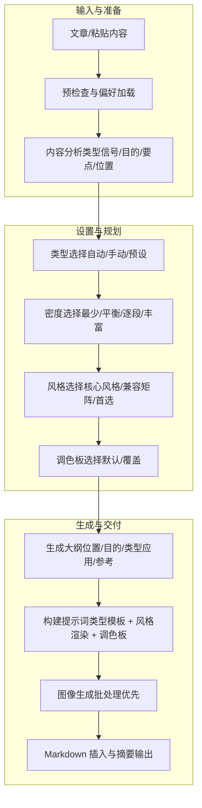
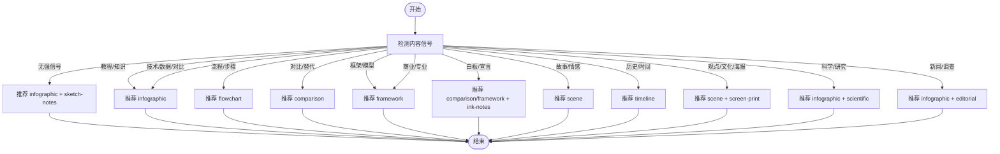

# 图表类型系统

<cite>
**本文引用的文件**
- [SKILL.md](file://.agents/skills/baoyu-article-illustrator/SKILL.md)
- [prompt-construction.md](file://.agents/skills/baoyu-article-illustrator/references/prompt-construction.md)
- [style-presets.md](file://.agents/skills/baoyu-article-illustrator/references/style-presets.md)
- [styles.md](file://.agents/skills/baoyu-article-illustrator/references/styles.md)
- [workflow.md](file://.agents/skills/baoyu-article-illustrator/references/workflow.md)
- [usage.md](file://.agents/skills/baoyu-article-illustrator/references/usage.md)
- [system.md](file://.agents/skills/baoyu-article-illustrator/prompts/system.md)
- [macaron.md](file://.agents/skills/baoyu-article-illustrator/references/palettes/macaron.md)
- [warm.md](file://.agents/skills/baoyu-article-illustrator/references/palettes/warm.md)
- [neon.md](file://.agents/skills/baoyu-article-illustrator/references/palettes/neon.md)
- [mono-ink.md](file://.agents/skills/baoyu-article-illustrator/references/palettes/mono-ink.md)
- [sketch-notes.md](file://.agents/skills/baoyu-article-illustrator/references/styles/sketch-notes.md)
- [vector-illustration.md](file://.agents/skills/baoyu-article-illustrator/references/styles/vector-illustration.md)
- [screen-print.md](file://.agents/skills/baoyu-article-illustrator/references/styles/screen-print.md)
</cite>

## 目录
1. [简介](#简介)
2. [项目结构](#项目结构)
3. [核心组件](#核心组件)
4. [架构总览](#架构总览)
5. [详细组件分析](#详细组件分析)
6. [依赖关系分析](#依赖关系分析)
7. [性能与可扩展性](#性能与可扩展性)
8. [故障排查指南](#故障排查指南)
9. [结论](#结论)
10. [附录](#附录)

## 简介
本文件系统化阐述 baoyu-article-illustrator 技能在“文章插图”任务中使用的图表类型体系，围绕六种图表类型（信息图 infographic、场景 scene、流程图 flowchart、对比 comparison、框架 framework、时间线 timeline）展开：设计理念、适用场景、视觉特征、布局特点、最佳使用时机，并提供类型选择的决策树与自动选择规则。同时给出风格与调色板的组合策略、提示词模板与工作流步骤，辅以可视化图示帮助用户在真实内容中做出正确判断。

## 项目结构
该技能以“类型 × 风格 × 调色板”的三维一致性为核心，通过明确的工作流与提示词模板确保生成结果在语义、构图与风格上保持连贯。

**图示来源**
- [workflow.md: 步骤概览:1-432](file://.agents/skills/baoyu-article-illustrator/references/workflow.md#L1-L432)
- [SKILL.md: 工作流清单:84-93](file://.agents/skills/baoyu-article-illustrator/SKILL.md#L84-L93)

**章节来源**
- [.agents/skills/baoyu-article-illustrator/SKILL.md:1-241](file://.agents/skills/baoyu-article-illustrator/SKILL.md#L1-L241)
- [.agents/skills/baoyu-article-illustrator/references/workflow.md:1-432](file://.agents/skills/baoyu-article-illustrator/references/workflow.md#L1-L432)

## 核心组件
- 类型维度（Type）
  - infographic：数据、指标、技术类信息
  - scene：叙事、情感类画面
  - flowchart：过程、流程
  - comparison：并列对比、选项
  - framework：模型、架构
  - timeline：历史、演进
- 风格维度（Style）
  - 提供核心风格与完整画廊，覆盖手绘、矢量、极简、蓝图、水彩、海报等多种风格
- 调色板维度（Palette）
  - macaron（马卡龙）、warm（暖色）、neon（霓虹）、mono-ink（纯黑墨水）等，用于覆盖风格默认色彩

**章节来源**
- [.agents/skills/baoyu-article-illustrator/SKILL.md:57-83](file://.agents/skills/baoyu-article-illustrator/SKILL.md#L57-L83)
- [.agents/skills/baoyu-article-illustrator/references/styles.md:1-237](file://.agents/skills/baoyu-article-illustrator/references/styles.md#L1-L237)
- [.agents/skills/baoyu-article-illustrator/references/palettes/macaron.md:1-34](file://.agents/skills/baoyu-article-illustrator/references/palettes/macaron.md#L1-L34)
- [.agents/skills/baoyu-article-illustrator/references/palettes/warm.md:1-33](file://.agents/skills/baoyu-article-illustrator/references/palettes/warm.md#L1-L33)
- [.agents/skills/baoyu-article-illustrator/references/palettes/neon.md:1-34](file://.agents/skills/baoyu-article-illustrator/references/palettes/neon.md#L1-L34)
- [.agents/skills/baoyu-article-illustrator/references/palettes/mono-ink.md:1-43](file://.agents/skills/baoyu-article-illustrator/references/palettes/mono-ink.md#L1-L43)

## 架构总览
下图展示“类型 × 风格 × 调色板”三维度如何在工作流中协同作用，从内容分析到最终图像插入的全链路。

**图示来源**
- [workflow.md: 步骤详解:112-432](file://.agents/skills/baoyu-article-illustrator/references/workflow.md#L112-L432)
- [prompt-construction.md: 提示词模板与规则:1-460](file://.agents/skills/baoyu-article-illustrator/references/prompt-construction.md#L1-L460)
- [styles.md: 类型×风格兼容矩阵:51-96](file://.agents/skills/baoyu-article-illustrator/references/styles.md#L51-L96)

## 详细组件分析

### 类型一：信息图 infographic
- 设计理念
  - 将复杂信息转化为直观、易读的图形化表达；强调“所见即所得”的信息密度与层级
- 视觉特征
  - 区域化布局（网格/径向/分层），信息区块以柔和色块填充，配合简单图标与手写式标题
  - 强调留白与清晰的视觉层次，避免过度装饰
- 布局特点
  - 单页解释器式布局：顶部大标题，中部 2–6 个圆角信息框，底部一句话总结
- 最佳使用时机
  - 数据/指标解读、技术概念解释、教程/入门、产品特性说明、知识汇总
- 典型风格组合
  - 默认：sketch-notes + macaron（马卡龙）
  - 技术深挖：blueprint；知识分享：vector-illustration；新闻数据：editorial
- 自动选择规则
  - 当无强信号时，默认推荐 infographic + sketch-notes；若内容偏向技术/数据/比较/数字，倾向 blueprint 或 vector-illustration

**章节来源**
- [.agents/skills/baoyu-article-illustrator/SKILL.md:69-79](file://.agents/skills/baoyu-article-illustrator/SKILL.md#L69-L79)
- [.agents/skills/baoyu-article-illustrator/references/styles.md:97-114](file://.agents/skills/baoyu-article-illustrator/references/styles.md#L97-L114)
- [.agents/skills/baoyu-article-illustrator/references/prompt-construction.md:124-174](file://.agents/skills/baoyu-article-illustrator/references/prompt-construction.md#L124-L174)
- [.agents/skills/baoyu-article-illustrator/references/styles.md:64-76](file://.agents/skills/baoyu-article-illustrator/references/styles.md#L64-L76)

### 类型二：场景 scene
- 设计理念
  - 通过氛围与情绪传达故事内核，强调“情境感”而非具象人物
- 视觉特征
  - 主题焦点明确，光线/色调/环境营造特定情绪；适合温暖/水彩/海报风格
- 布局特点
  - 可采用对称/中心构图，强调负空间与象征性元素
- 最佳使用时机
  - 个人随笔、成长故事、旅行/生活方式、文化评论、情感体验
- 典型风格组合
  - 温暖/水彩（亲和/艺术感）；海报风格（screen-print，用于观点/文化表达）
- 自动选择规则
  - 内容信号为“故事/情感/旅程/体验”，优先 scene；若为观点/文化/电影化叙述，倾向 screen-print

**章节来源**
- [.agents/skills/baoyu-article-illustrator/SKILL.md:69-79](file://.agents/skills/baoyu-article-illustrator/SKILL.md#L69-L79)
- [.agents/skills/baoyu-article-illustrator/references/styles.md:145-156](file://.agents/skills/baoyu-article-illustrator/references/styles.md#L145-L156)
- [.agents/skills/baoyu-article-illustrator/references/prompt-construction.md:192-203](file://.agents/skills/baoyu-article-illustrator/references/prompt-construction.md#L192-L203)
- [.agents/skills/baoyu-article-illustrator/references/styles.md:77-95](file://.agents/skills/baoyu-article-illustrator/references/styles.md#L77-L95)

### 类型三：流程图 flowchart
- 设计理念
  - 将过程/步骤可视化，强调顺序、分支与连接关系
- 视觉特征
  - 步骤容器（矩形/圆角）+ 箭头连接；强调高对比度与可读性
- 布局特点
  - 左→右、上→下或环形布局，适合线性流程或循环迭代
- 最佳使用时机
  - 教程/操作指南、入职流程、系统操作、问题排查
- 典型风格组合
  - sketch-notes（手绘友好）；vector-illustration（现代简洁）；notion（极简）；blueprint（工程感）
- 自动选择规则
  - 内容信号为“步骤/流程/工作流/教程”，优先 flowchart；若偏工程/系统，倾向 blueprint 或 vector-illustration

**章节来源**
- [.agents/skills/baoyu-article-illustrator/SKILL.md:69-79](file://.agents/skills/baoyu-article-illustrator/SKILL.md#L69-L79)
- [.agents/skills/baoyu-article-illustrator/references/styles.md:157-168](file://.agents/skills/baoyu-article-illustrator/references/styles.md#L157-L168)
- [.agents/skills/baoyu-article-illustrator/references/prompt-construction.md:205-228](file://.agents/skills/baoyu-article-illustrator/references/prompt-construction.md#L205-L228)
- [.agents/skills/baoyu-article-illustrator/references/styles.md:64-76](file://.agents/skills/baoyu-article-illustrator/references/styles.md#L64-L76)

### 类型四：对比 comparison
- 设计理念
  - 并列呈现两种及以上方案/状态，突出差异与权衡
- 视觉特征
  - 分割式布局，左右或上下两侧分别承载对比项；强调视觉分离与色码区分
- 布局特点
  - 中间分割线/几何边界；可加入桥接箭头/注释说明转变
- 最佳使用时机
  - 产品对比、方案选择、前后对比、正反论证、替代方案
- 典型风格组合
  - vector-illustration（清晰对比）；elegant（商务对比）；ink-notes（专业视觉笔记，强调风险/收益）
- 自动选择规则
  - 内容信号为“vs/优缺点/前后/替代”，优先 comparison；manifesto/白板类倾向 ink-notes

**章节来源**
- [.agents/skills/baoyu-article-illustrator/SKILL.md:69-79](file://.agents/skills/baoyu-article-illustrator/SKILL.md#L69-L79)
- [.agents/skills/baoyu-article-illustrator/references/styles.md:169-174](file://.agents/skills/baoyu-article-illustrator/references/styles.md#L169-L174)
- [.agents/skills/baoyu-article-illustrator/references/prompt-construction.md:256-311](file://.agents/skills/baoyu-article-illustrator/references/prompt-construction.md#L256-L311)
- [.agents/skills/baoyu-article-illustrator/references/styles.md:77-95](file://.agents/skills/baoyu-article-illustrator/references/styles.md#L77-L95)

### 类型五：框架 framework
- 设计理念
  - 展示概念/模块/角色之间的关系与层级，强调系统性与结构性
- 视觉特征
  - 节点（圆形/矩形）+ 连接线；强调层次与流向
- 布局特点
  - 分层/网络/矩阵式布局；可包含“系统主体”与“外部输入”
- 最佳使用时机
  - 方法论/模型、架构设计、组织结构、生态关系
- 典型风格组合
  - blueprint（工程/系统感）；vector-illustration（现代简洁）；ink-notes（白板/宣言）
- 自动选择规则
  - 内容信号为“框架/模型/架构/原则”，优先 framework；若为系统设计/工程，倾向 blueprint

**章节来源**
- [.agents/skills/baoyu-article-illustrator/SKILL.md:69-79](file://.agents/skills/baoyu-article-illustrator/SKILL.md#L69-L79)
- [.agents/skills/baoyu-article-illustrator/references/styles.md:175-180](file://.agents/skills/baoyu-article-illustrator/references/styles.md#L175-L180)
- [.agents/skills/baoyu-article-illustrator/references/prompt-construction.md:312-364](file://.agents/skills/baoyu-article-illustrator/references/prompt-construction.md#L312-L364)
- [.agents/skills/baoyu-article-illustrator/references/styles.md:77-95](file://.agents/skills/baoyu-article-illustrator/references/styles.md#L77-L95)

### 类型六：时间线 timeline
- 设计理念
  - 按时间顺序呈现事件/里程碑，强调演进与转折
- 视觉特征
  - 横向/纵向时间轴，标记关键节点；强调节奏与对比
- 布局特点
  - 时间轴为主干，节点卡片承载事件；可加入区间/阶段划分
- 最佳使用时机
  - 历史回顾、发展脉络、成长历程、产品演进、路线图
- 典型风格组合
  - elegant（正式/历史感）；warm（亲和/成长感）；screen-print（海报化表达）
- 自动选择规则
  - 内容信号为“历史/时间/进展/演变”，优先 timeline；若为成长/个人历程，倾向 warm

**章节来源**
- [.agents/skills/baoyu-article-illustrator/SKILL.md:69-79](file://.agents/skills/baoyu-article-illustrator/SKILL.md#L69-L79)
- [.agents/skills/baoyu-article-illustrator/references/styles.md:181-192](file://.agents/skills/baoyu-article-illustrator/references/styles.md#L181-L192)
- [.agents/skills/baoyu-article-illustrator/references/prompt-construction.md:365-379](file://.agents/skills/baoyu-article-illustrator/references/prompt-construction.md#L365-L379)
- [.agents/skills/baoyu-article-illustrator/references/styles.md:77-95](file://.agents/skills/baoyu-article-illustrator/references/styles.md#L77-L95)

### 类型选择决策树与自动规则
- 内容信号驱动的自动选择
  - 无强信号 → 推荐 infographic + sketch-notes（通用教育风）
  - 知识/教程/学习 → infographic（sketch-notes/vector-illustration/notion）
  - 产品/效率/工具 → infographic（sketch-notes/notion/vector-illustration）
  - 步骤/流程/教程 → flowchart（sketch-notes/vector-illustration/notion）
  - API/指标/数据/对比/数字 → infographic（blueprint/vector-illustration）
  - 技术/AI/编程/开发/代码 → infographic（vector-illustration/blueprint）
  - 框架/模型/架构/原则 → framework（blueprint/vector-illustration）
  - vs/优缺点/前后/替代 → comparison（vector-illustration/notion/ink-notes）
  - 白板/宣言/思维转变/专业视觉笔记 → comparison/framework（ink-notes）
  - 故事/情感/旅程/体验 → scene（warm/watercolor）
  - 历史/时间/进步/演化 → timeline（elegant/warm）
  - 商业/专业/战略/企业 → framework（elegant）
  - 观点/评论/文化/哲学/电影化/海报 → scene（screen-print）
  - 生物/化学/医学/科学 → infographic（scientific）
  - 解说/新闻/杂志/调查 → infographic（editorial）

**图示来源**
- [styles.md: 内容信号→类型/风格推荐:77-95](file://.agents/skills/baoyu-article-illustrator/references/styles.md#L77-L95)
- [style-presets.md: 内容类型→预设推荐:62-81](file://.agents/skills/baoyu-article-illustrator/references/style-presets.md#L62-L81)

**章节来源**
- [.agents/skills/baoyu-article-illustrator/references/styles.md:77-95](file://.agents/skills/baoyu-article-illustrator/references/styles.md#L77-L95)
- [.agents/skills/baoyu-article-illustrator/references/style-presets.md:62-81](file://.agents/skills/baoyu-article-illustrator/references/style-presets.md#L62-L81)

### 提示词模板与类型应用
- 通用要求
  - 布局结构优先：先描述分区/流向/方向
  - 具体标签：使用文章中的具体数值、术语、引用
  - 视觉关系：元素间的连接方式
  - 语义配色：基于含义的颜色选择（如红色=警告/强调）
  - 风格特征：线条/纹理/情绪
  - 宽高比与复杂度
- 类型模板要点
  - infographic：标题 + 布局 + ZONES（含具体数据）+ LABELS（原文术语）+ COLORS（语义色）+ STYLE + ASPECT
  - scene：标题 + 焦点 + 氛围 + 情绪 + 色温 + STYLE + ASPECT
  - flowchart：标题 + 布局 + STEPS（编号+简述）+ CONNECTIONS + STYLE + ASPECT
  - comparison：标题 + 左侧/右侧 + 分隔 + STYLE + ASPECT
  - framework：标题 + 结构 + NODES + RELATIONSHIPS + STYLE + ASPECT
  - timeline：标题 + 方向 + EVENTS + MARKERS + STYLE + ASPECT

**章节来源**
- [.agents/skills/baoyu-article-illustrator/references/prompt-construction.md:122-460](file://.agents/skills/baoyu-article-illustrator/references/prompt-construction.md#L122-L460)

### 风格与调色板组合策略
- 核心风格与类型兼容性
  - infographic：sketch-notes、vector-illustration、notion、blueprint、editorial（高度推荐）
  - scene：warm、watercolor、elegant（高度推荐）
  - flowchart：sketch-notes、vector-illustration、notion、blueprint（高度推荐）
  - comparison：sketch-notes、vector-illustration、notion、elegant（高度推荐）
  - framework：sketch-notes、blueprint、vector-illustration、notion（高度推荐）
  - timeline：elegant、sketch-notes、warm、editorial（高度推荐）
- 调色板覆盖规则
  - 指定调色板时，替换风格默认色；背景可替换但保留风格纹理描述
  - 不指定时使用风格内置色
- 典型组合示例
  - infographic + sketch-notes + macaron（默认/教育风）
  - infographic + vector-illustration + warm（品牌/产品）
  - flowchart + ink-notes + mono-ink（专业视觉笔记）
  - scene + screen-print（观点/文化）
  - timeline + elegant（正式/历史感）

**章节来源**
- [.agents/skills/baoyu-article-illustrator/references/styles.md:51-96](file://.agents/skills/baoyu-article-illustrator/references/styles.md#L51-L96)
- [.agents/skills/baoyu-article-illustrator/references/prompt-construction.md:413-443](file://.agents/skills/baoyu-article-illustrator/references/prompt-construction.md#L413-L443)
- [.agents/skills/baoyu-article-illustrator/references/palettes/macaron.md:1-34](file://.agents/skills/baoyu-article-illustrator/references/palettes/macaron.md#L1-L34)
- [.agents/skills/baoyu-article-illustrator/references/palettes/warm.md:1-33](file://.agents/skills/baoyu-article-illustrator/references/palettes/warm.md#L1-L33)
- [.agents/skills/baoyu-article-illustrator/references/palettes/neon.md:1-34](file://.agents/skills/baoyu-article-illustrator/references/palettes/neon.md#L1-L34)
- [.agents/skills/baoyu-article-illustrator/references/palettes/mono-ink.md:1-43](file://.agents/skills/baoyu-article-illustrator/references/palettes/mono-ink.md#L1-L43)

### 使用示例与视觉效果对比
- 示例一：技术数据解读（infographic + blueprint）
  - 适用：API 文档、系统指标、技术深度解析
  - 特征：技术精度、网格布局、数据聚焦、蓝白配色
- 示例二：教程步骤（flowchart + vector-illustration）
  - 适用：安装/部署/操作指南
  - 特征：清晰箭头、几何步骤容器、高对比色
- 示例三：产品对比（comparison + elegant）
  - 适用：竞品评测、功能对比
  - 特征：左右分割、色码区分、专业排版
- 示例四：个人成长（scene + warm）
  - 适用：成长故事、反思随笔
  - 特征：暖色调、自然纹理、情感氛围
- 示例五：历史演进（timeline + elegant）
  - 适用：里程碑回顾、路线图
  - 特征：正式标记、优雅排版、时间节奏
- 示例六：观点表达（scene + screen-print）
  - 适用：评论/文化/哲学
  - 特征：双色/三色限制、负空间叙事、复古质感

**章节来源**
- [.agents/skills/baoyu-article-illustrator/references/style-presets.md:11-61](file://.agents/skills/baoyu-article-illustrator/references/style-presets.md#L11-L61)
- [.agents/skills/baoyu-article-illustrator/references/usage.md:52-83](file://.agents/skills/baoyu-article-illustrator/references/usage.md#L52-L83)

## 依赖关系分析
- 组件耦合
  - 类型选择依赖内容分析结果与风格兼容矩阵
  - 提示词模板依赖类型模板与风格/调色板规范
  - 生成阶段依赖提示词文件与参考图片处理
- 外部依赖
  - 图像生成后端（可选：runtime 原生/第三方技能）
  - 参考图片（direct/style/palette 三种用法）
- 循环依赖
  - 未发现循环依赖；工作流单向推进

**图示来源**
- [workflow.md: 生成提示词与生成图像:297-396](file://.agents/skills/baoyu-article-illustrator/references/workflow.md#L297-L396)
- [prompt-construction.md: 类型模板与规则:122-460](file://.agents/skills/baoyu-article-illustrator/references/prompt-construction.md#L122-L460)
- [styles.md: 类型×风格兼容矩阵:51-96](file://.agents/skills/baoyu-article-illustrator/references/styles.md#L51-L96)

**章节来源**
- [.agents/skills/baoyu-article-illustrator/references/workflow.md:297-396](file://.agents/skills/baoyu-article-illustrator/references/workflow.md#L297-L396)
- [.agents/skills/baoyu-article-illustrator/references/prompt-construction.md:122-460](file://.agents/skills/baoyu-article-illustrator/references/prompt-construction.md#L122-L460)
- [.agents/skills/baoyu-article-illustrator/references/styles.md:51-96](file://.agents/skills/baoyu-article-illustrator/references/styles.md#L51-L96)

## 性能与可扩展性
- 批处理优先：当存在多个已保存提示词文件且仅需生成时，优先使用后端的批处理接口，减少子代理开销
- 生成失败重试：单次失败自动重试一次，降低人工干预成本
- 参考图片处理：按 direct/style/palette 三类路径处理，避免冗余传输
- 可扩展点
  - 新增风格/调色板：遵循现有渲染规则与覆盖逻辑
  - 新增类型：补充类型模板与兼容矩阵
  - 后端适配：统一通过“图像生成工具”选择规则接入

**章节来源**
- [.agents/skills/baoyu-article-illustrator/references/workflow.md:337-340](file://.agents/skills/baoyu-article-illustrator/references/workflow.md#L337-L340)
- [.agents/skills/baoyu-article-illustrator/references/workflow.md:390-396](file://.agents/skills/baoyu-article-illustrator/references/workflow.md#L390-L396)

## 故障排查指南
- 提示词文件缺失
  - 现象：生成前校验失败
  - 处理：先保存所有提示词文件再执行生成
- 参考图片未保存却写入 frontmatter
  - 现象：frontmatter 与实际文件不一致
  - 处理：删除 references 字段或补全文件
- 语言不匹配
  - 现象：文本与文章语言不符
  - 处理：根据提示选择文章语言或 EXTEND.md 设置
- 密度与位置不一致
  - 现象：图像数量与密度设定不符
  - 处理：调整密度或修改大纲中的位置分配

**章节来源**
- [.agents/skills/baoyu-article-illustrator/references/workflow.md:327-336](file://.agents/skills/baoyu-article-illustrator/references/workflow.md#L327-L336)
- [.agents/skills/baoyu-article-illustrator/references/workflow.md:341-345](file://.agents/skills/baoyu-article-illustrator/references/workflow.md#L341-L345)
- [.agents/skills/baoyu-article-illustrator/references/workflow.md:233-240](file://.agents/skills/baoyu-article-illustrator/references/workflow.md#L233-L240)

## 结论
该图表类型系统以“类型 × 风格 × 调色板”为核心，结合内容信号驱动的自动选择与严格的提示词模板，确保生成结果在语义、构图与风格上的一致性。通过决策树与典型组合示例，用户可在不同内容场景中快速做出正确选择，并获得稳定、可复现的视觉产出。

## 附录
- 快速对照表
  - 类型 → 推荐风格（部分）
    - infographic：sketch-notes/vector-illustration/blueprint/editorial
    - scene：warm/watercolor/screen-print
    - flowchart：sketch-notes/vector-illustration/notion/blueprint
    - comparison：sketch-notes/vector-illustration/notion/elegant
    - framework：sketch-notes/blueprint/vector-illustration/notion
    - timeline：elegant/sketch-notes/warm/editorial
  - 调色板覆盖：指定时替换风格默认色；未指定则使用风格内置色
  - 提示词模板：先布局/再标签/后风格/最后宽高比

**章节来源**
- [.agents/skills/baoyu-article-illustrator/references/styles.md:51-96](file://.agents/skills/baoyu-article-illustrator/references/styles.md#L51-L96)
- [.agents/skills/baoyu-article-illustrator/references/prompt-construction.md:413-443](file://.agents/skills/baoyu-article-illustrator/references/prompt-construction.md#L413-L443)