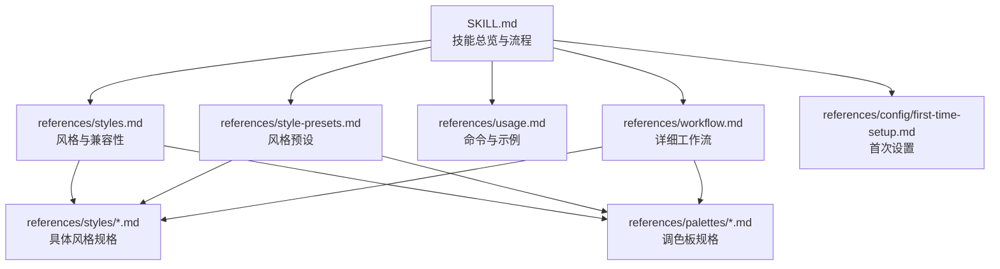
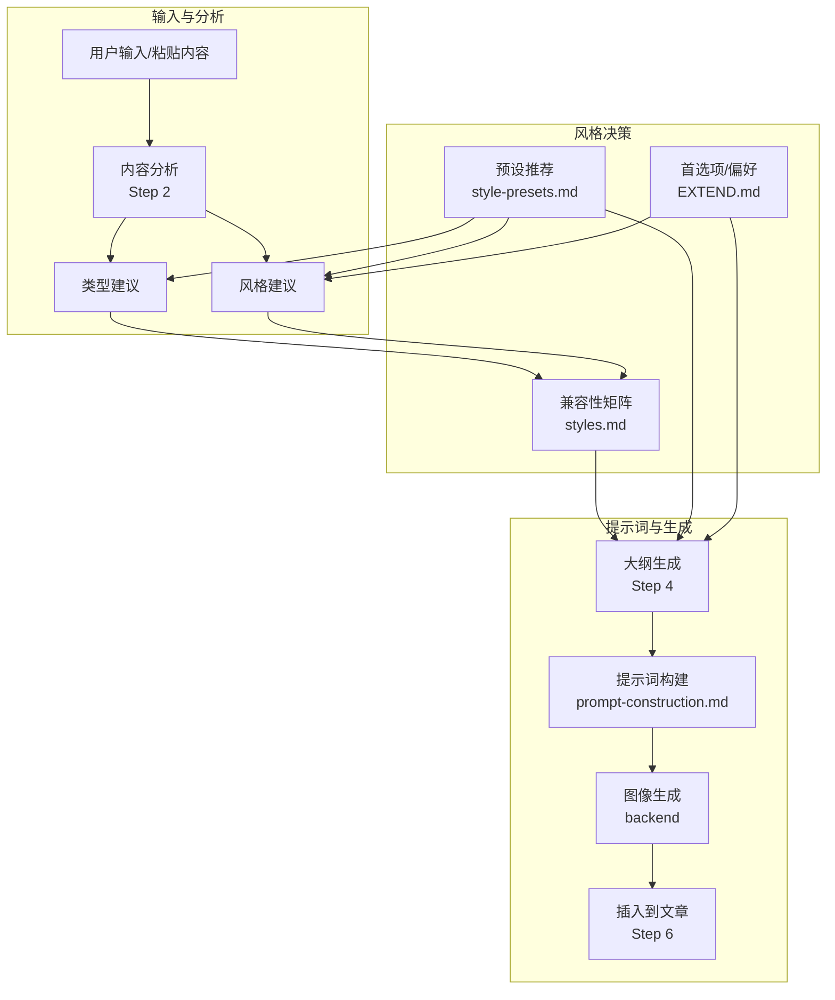
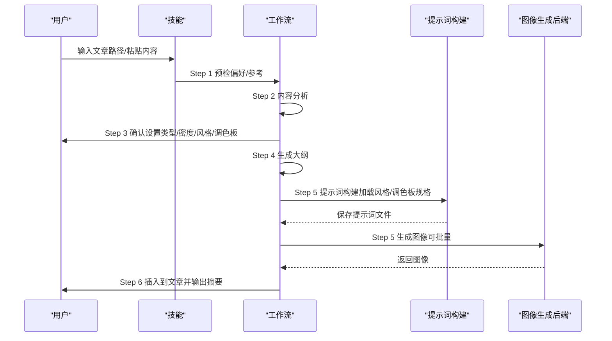
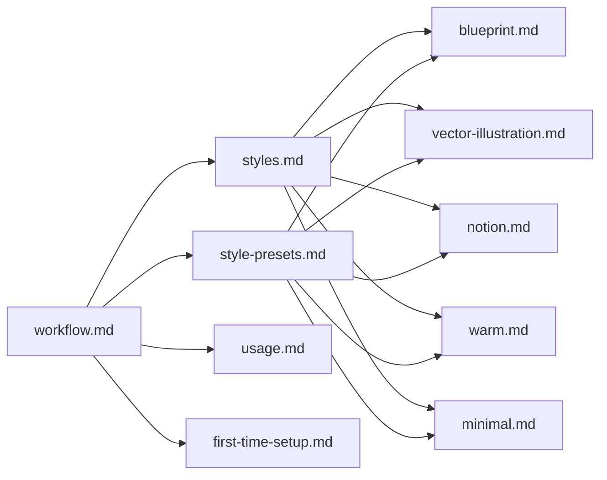

# 艺术风格库

<cite>
**本文引用的文件**
- [SKILL.md](file://.agents/skills/baoyu-article-illustrator/SKILL.md)
- [styles.md](file://.agents/skills/baoyu-article-illustrator/references/styles.md)
- [style-presets.md](file://.agents/skills/baoyu-article-illustrator/references/style-presets.md)
- [usage.md](file://.agents/skills/baoyu-article-illustrator/references/usage.md)
- [workflow.md](file://.agents/skills/baoyu-article-illustrator/references/workflow.md)
- [first-time-setup.md](file://.agents/skills/baoyu-article-illustrator/references/config/first-time-setup.md)
- [blueprint.md](file://.agents/skills/baoyu-article-illustrator/references/styles/blueprint.md)
- [vector-illustration.md](file://.agents/skills/baoyu-article-illustrator/references/styles/vector-illustration.md)
- [notion.md](file://.agents/skills/baoyu-article-illustrator/references/styles/notion.md)
- [warm.md](file://.agents/skills/baoyu-article-illustrator/references/styles/warm.md)
- [minimal.md](file://.agents/skills/baoyu-article-illustrator/references/styles/minimal.md)
</cite>

## 目录
1. [简介](#简介)
2. [项目结构](#项目结构)
3. [核心组件](#核心组件)
4. [架构总览](#架构总览)
5. [详细组件分析](#详细组件分析)
6. [依赖关系分析](#依赖关系分析)
7. [性能考量](#性能考量)
8. [故障排查指南](#故障排查指南)
9. [结论](#结论)
10. [附录](#附录)

## 简介
本文件为 baoyu-article-illustrator 技能的艺术风格库提供系统化、可操作的参考与使用指南。内容覆盖核心风格与完整风格画廊的视觉特征、设计理念、适用内容类型与最佳实践，并提供风格选择指南与兼容性矩阵，帮助用户基于内容性质快速做出合适的选择。

## 项目结构
该技能以“类型 × 风格 × 调色板”三维一致性为核心，围绕以下关键参考文档组织：
- 核心参考：SKILL.md（技能总览与流程）、styles.md（风格与兼容性）、style-presets.md（预设）、usage.md（命令与示例）、workflow.md（详细流程）
- 配置与首选项：first-time-setup.md（首次设置）、EXTEND.md（偏好文件）
- 具体风格与调色板：各风格与调色板的独立规格文件（如 blueprint.md、vector-illustration.md、notion.md、warm.md、minimal.md）

图表来源
- [SKILL.md:1-241](file://.agents/skills/baoyu-article-illustrator/SKILL.md#L1-L241)
- [styles.md:1-237](file://.agents/skills/baoyu-article-illustrator/references/styles.md#L1-L237)
- [style-presets.md:1-88](file://.agents/skills/baoyu-article-illustrator/references/style-presets.md#L1-L88)
- [usage.md:1-83](file://.agents/skills/baoyu-article-illustrator/references/usage.md#L1-L83)
- [workflow.md:1-432](file://.agents/skills/baoyu-article-illustrator/references/workflow.md#L1-L432)
- [first-time-setup.md:1-141](file://.agents/skills/baoyu-article-illustrator/references/config/first-time-setup.md#L1-L141)

章节来源
- [SKILL.md:1-241](file://.agents/skills/baoyu-article-illustrator/SKILL.md#L1-L241)
- [styles.md:1-237](file://.agents/skills/baoyu-article-illustrator/references/styles.md#L1-L237)
- [style-presets.md:1-88](file://.agents/skills/baoyu-article-illustrator/references/style-presets.md#L1-L88)
- [usage.md:1-83](file://.agents/skills/baoyu-article-illustrator/references/usage.md#L1-L83)
- [workflow.md:1-432](file://.agents/skills/baoyu-article-illustrator/references/workflow.md#L1-L432)
- [first-time-setup.md:1-141](file://.agents/skills/baoyu-article-illustrator/references/config/first-time-setup.md#L1-L141)

## 核心组件
- 类型（Type）：信息结构维度，包括信息图、场景、流程图、对比、框架、时间线等，用于决定视觉呈现的结构性与叙事方式。
- 风格（Style）：渲染与表现维度，涵盖矢量插画、手绘笔记、极简、蓝图、水彩、编辑风、科学风、粉笔风、幻想动画、扁平、像素风、俏皮、复古、素描、丝网印刷、复古等，强调视觉语言与情绪表达。
- 调色板（Palette）：色彩方案维度，支持对风格默认色进行覆盖，如马卡龙、暖色、霓虹、单色墨水等，强化品牌或主题氛围。

章节来源
- [SKILL.md:57-68](file://.agents/skills/baoyu-article-illustrator/SKILL.md#L57-L68)
- [styles.md:21-49](file://.agents/skills/baoyu-article-illustrator/references/styles.md#L21-L49)
- [styles.md:214-226](file://.agents/skills/baoyu-article-illustrator/references/styles.md#L214-L226)

## 架构总览
风格体系以“类型 × 风格 × 调色板”的一致性为准则，结合内容分析与用户偏好，自动或半自动地完成风格推荐、提示词构建与图像生成。

图表来源
- [workflow.md:112-167](file://.agents/skills/baoyu-article-illustrator/references/workflow.md#L112-L167)
- [styles.md:51-96](file://.agents/skills/baoyu-article-illustrator/references/styles.md#L51-L96)
- [style-presets.md:62-81](file://.agents/skills/baoyu-article-illustrator/references/style-presets.md#L62-L81)
- [SKILL.md:228-241](file://.agents/skills/baoyu-article-illustrator/SKILL.md#L228-L241)

## 详细组件分析

### 核心风格与完整风格画廊
- 核心风格（简化选择）：手绘、矢量、极简扁平、科幻、编辑风、场景、海报，便于快速决策。
- 完整风格画廊：矢量插画、Notion风、优雅、暖色、极简、蓝图、水彩、编辑风、科学、粉笔、幻想动画、扁平、扁平涂鸦、直觉机器、自然、像素风、俏皮、复古、素描、丝网印刷、手绘笔记、墨水笔记、复古。

章节来源
- [styles.md:3-17](file://.agents/skills/baoyu-article-illustrator/references/styles.md#L3-L17)
- [styles.md:21-49](file://.agents/skills/baoyu-article-illustrator/references/styles.md#L21-L49)

### 风格特性与视觉特征
- 蓝图（blueprint）：工程精度、蓝画像布、网格纹理、技术制图线条、直角连接、等距/正交投影；适合技术架构、系统设计、数据流程、工程文档。
- 矢量插画（vector-illustration）：平面矢量、统一黑线、几何简化、儿童绘本风格、闭合轮廓、圆润转角、装饰元素（太阳、云朵、星星）；适合教育、创意、儿童、品牌展示。
- Notion（notion）：极简手绘线条、智力感、最大留白、单概念聚焦、柔和彩铅色、手写体；适合知识分享、教程、SaaS、生产力。
- 暖色（warm）：温暖亲和、软纸纹理、圆形形状、友好角色、太阳光、心形、舒适灯光、柔和渐变；适合个人成长、生活方式、教育、情感故事。
- 极简（minimal）：极致简洁、负空间、单焦点、细线、简单几何、单强调色；适合哲学、冥想、本质概念。

章节来源
- [blueprint.md:1-58](file://.agents/skills/baoyu-article-illustrator/references/styles/blueprint.md#L1-L58)
- [vector-illustration.md:1-58](file://.agents/skills/baoyu-article-illustrator/references/styles/vector-illustration.md#L1-L58)
- [notion.md:1-59](file://.agents/skills/baoyu-article-illustrator/references/styles/notion.md#L1-L59)
- [warm.md:1-59](file://.agents/skills/baoyu-article-illustrator/references/styles/warm.md#L1-L59)
- [minimal.md:1-59](file://.agents/skills/baoyu-article-illustrator/references/styles/minimal.md#L1-L59)

### 类型 × 风格兼容性矩阵
- 建议优先组合：信息图 + 手绘笔记、信息图 + 蓝图、信息图 + 矢量插画、流程图 + 手绘笔记、对比 + 手绘笔记、框架 + 蓝图等。
- 不推荐组合：场景 + 矢量插画、流程图 + 丝网印刷等。

章节来源
- [styles.md:51-62](file://.agents/skills/baoyu-article-illustrator/references/styles.md#L51-L62)

### 自动风格选择策略
- 按类型自动：当无强信号时，默认推荐手绘笔记；不同类型的主次风格见“按类型自动”表。
- 按内容信号自动：依据知识、教程、产品、流程、数据、科技、框架、对比、宣言、故事、历史、商业、观点、生物医学、新闻等信号，给出类型与风格建议。

章节来源
- [styles.md:64-96](file://.agents/skills/baoyu-article-illustrator/references/styles.md#L64-L96)

### 风格选择指南与最佳实践
- 通用建议
  - 无强内容信号：优先手绘笔记（信息图），强调可读性与通用性。
  - 教育/知识类：矢量插画或手绘笔记；马卡龙调色提升亲和力。
  - 科技/系统设计：蓝图；强调工程感与清晰度。
  - 流程/教程：信息图 + 矢量插画或手绘笔记；强调步骤与可读性。
  - 数据/对比：信息图 + 蓝图或编辑风；强调数据表达与对比。
  - 故事/情感：暖色或水彩；强调人情味与画面感。
  - 观点/文化：丝网印刷；强调海报风格与概念表达。
- 最佳实践
  - 使用“类型 × 风格 × 调色板”三维一致性，确保视觉连贯。
  - 在提示词中明确布局区段、标签、颜色与风格规则，避免模糊描述。
  - 参考风格规格文件中的背景、色板、视觉元素与风格规则，严格遵循。

章节来源
- [styles.md:97-237](file://.agents/skills/baoyu-article-illustrator/references/styles.md#L97-L237)
- [workflow.md:299-345](file://.agents/skills/baoyu-article-illustrator/references/workflow.md#L299-L345)

### 风格与调色板组合示例
- 教育信息图 + 手绘笔记 + 马卡龙：适合单页解释器、概念总结、入门文章。
- 技术说明 + 蓝图：适合API文档、系统指标、技术深度解析。
- 产品展示 + 矢量插画 + 暖色：适合产品介绍、团队介绍、功能卡片。
- 对比分析 + 丝网印刷：适合观点辩论、正反对比、文化评论。

章节来源
- [style-presets.md:20-61](file://.agents/skills/baoyu-article-illustrator/references/style-presets.md#L20-L61)

### 提示词构建与生成流程
- 步骤概览：内容分析 → 确认设置（类型/密度/风格/调色板）→ 大纲生成 → 提示词构建 → 图像生成 → 插入文章。
- 关键要求：每个插图必须先保存提示词文件；提示词需包含布局、区段、标签（使用原文数据）、颜色（调色板或风格默认）、风格规则与宽高比；若存在参考图片，按 direct/style/palette 使用。

图表来源
- [workflow.md:1-432](file://.agents/skills/baoyu-article-illustrator/references/workflow.md#L1-L432)
- [SKILL.md:84-93](file://.agents/skills/baoyu-article-illustrator/SKILL.md#L84-L93)

章节来源
- [workflow.md:1-432](file://.agents/skills/baoyu-article-illustrator/references/workflow.md#L1-L432)
- [SKILL.md:84-93](file://.agents/skills/baoyu-article-illustrator/SKILL.md#L84-L93)

## 依赖关系分析
- 组件耦合
  - 工作流依赖风格与调色板规格文件，以保证提示词与生成的一致性。
  - 预设模块依赖风格与调色板规格，提供一键式类型+风格+可选调色板组合。
  - 首次设置模块负责偏好落地，影响风格推荐与输出目录等行为。
- 外部依赖
  - 图像生成后端（Codex、Hermes、baoyu-imagine等）通过“图像生成工具”规则选择与批处理策略决定执行方式。

图表来源
- [workflow.md:1-432](file://.agents/skills/baoyu-article-illustrator/references/workflow.md#L1-L432)
- [styles.md:1-237](file://.agents/skills/baoyu-article-illustrator/references/styles.md#L1-L237)
- [style-presets.md:1-88](file://.agents/skills/baoyu-article-illustrator/references/style-presets.md#L1-L88)
- [usage.md:1-83](file://.agents/skills/baoyu-article-illustrator/references/usage.md#L1-L83)
- [first-time-setup.md:1-141](file://.agents/skills/baoyu-article-illustrator/references/config/first-time-setup.md#L1-L141)
- [blueprint.md:1-58](file://.agents/skills/baoyu-article-illustrator/references/styles/blueprint.md#L1-L58)
- [vector-illustration.md:1-58](file://.agents/skills/baoyu-article-illustrator/references/styles/vector-illustration.md#L1-L58)
- [notion.md:1-59](file://.agents/skills/baoyu-article-illustrator/references/styles/notion.md#L1-L59)
- [warm.md:1-59](file://.agents/skills/baoyu-article-illustrator/references/styles/warm.md#L1-L59)
- [minimal.md:1-59](file://.agents/skills/baoyu-article-illustrator/references/styles/minimal.md#L1-L59)

章节来源
- [workflow.md:1-432](file://.agents/skills/baoyu-article-illustrator/references/workflow.md#L1-L432)
- [styles.md:1-237](file://.agents/skills/baoyu-article-illustrator/references/styles.md#L1-L237)
- [style-presets.md:1-88](file://.agents/skills/baoyu-article-illustrator/references/style-presets.md#L1-L88)
- [usage.md:1-83](file://.agents/skills/baoyu-article-illustrator/references/usage.md#L1-L83)
- [first-time-setup.md:1-141](file://.agents/skills/baoyu-article-illustrator/references/config/first-time-setup.md#L1-L141)

## 性能考量
- 批量生成优先：当已有多个提示词文件且任务为纯生成时，优先使用后端的批量接口，减少子代理开销。
- 顺序生成回退：若后端不支持批量，则采用顺序生成，确保稳定性。
- 提示词质量：高质量提示词可降低重试概率，提高整体效率。

章节来源
- [workflow.md:337-345](file://.agents/skills/baoyu-article-illustrator/references/workflow.md#L337-L345)
- [SKILL.md:157-172](file://.agents/skills/baoyu-article-illustrator/SKILL.md#L157-L172)

## 故障排查指南
- 未找到偏好文件（EXTEND.md）：首次运行会阻塞在“首次设置”，完成后方可继续。
- 提示词文件缺失：生成前必须保存提示词文件，否则会报错；请检查保存路径与命名。
- 参考图片未保存却写入frontmatter：若文件不存在，需修正frontmatter或移除references字段。
- 后端不可用：按“图像生成工具”规则选择可用后端；若多后端存在，按提示一次性询问。
- 语言不匹配：当文章语言与偏好语言不一致时，需在确认阶段单独确认。

章节来源
- [first-time-setup.md:84-107](file://.agents/skills/baoyu-article-illustrator/references/config/first-time-setup.md#L84-L107)
- [workflow.md:327-345](file://.agents/skills/baoyu-article-illustrator/references/workflow.md#L327-L345)
- [SKILL.md:24-50](file://.agents/skills/baoyu-article-illustrator/SKILL.md#L24-L50)
- [workflow.md:233-240](file://.agents/skills/baoyu-article-illustrator/references/workflow.md#L233-L240)

## 结论
通过“类型 × 风格 × 调色板”的三维一致性与严格的提示词规范，baoyu-article-illustrator 能够在不同内容类型下稳定产出高质量插图。建议用户优先使用预设作为起点，再根据内容信号与品牌需求微调风格与调色板，确保视觉连贯与表达精准。

## 附录

### 风格选择速查表
- 无强信号：信息图 + 手绘笔记（默认）
- 教育/知识：信息图 + 矢量插画 或 手绘笔记；可选马卡龙调色
- 科技/系统：信息图 + 蓝图；强调工程感
- 流程/教程：流程图 + 矢量插画 或 手绘笔记；强调步骤
- 数据/对比：信息图 + 蓝图 或 编辑风；强调对比
- 故事/情感：场景 + 暖色 或 水彩；强调人情味
- 观点/文化：场景 + 丝网印刷；强调海报风格

章节来源
- [styles.md:64-96](file://.agents/skills/baoyu-article-illustrator/references/styles.md#L64-L96)
- [style-presets.md:62-81](file://.agents/skills/baoyu-article-illustrator/references/style-presets.md#L62-L81)