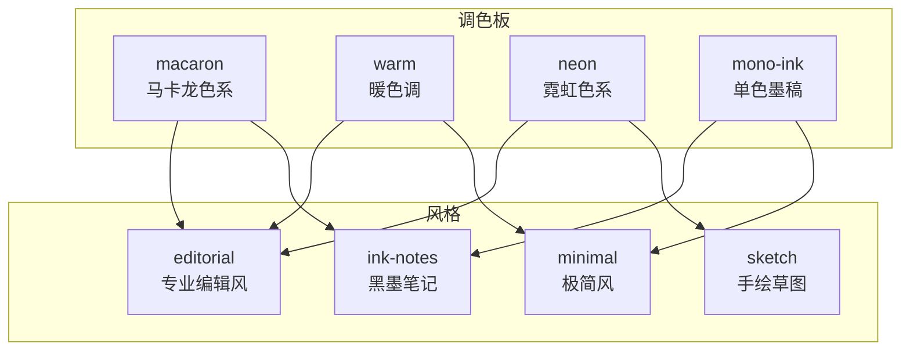
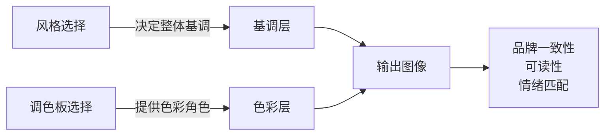
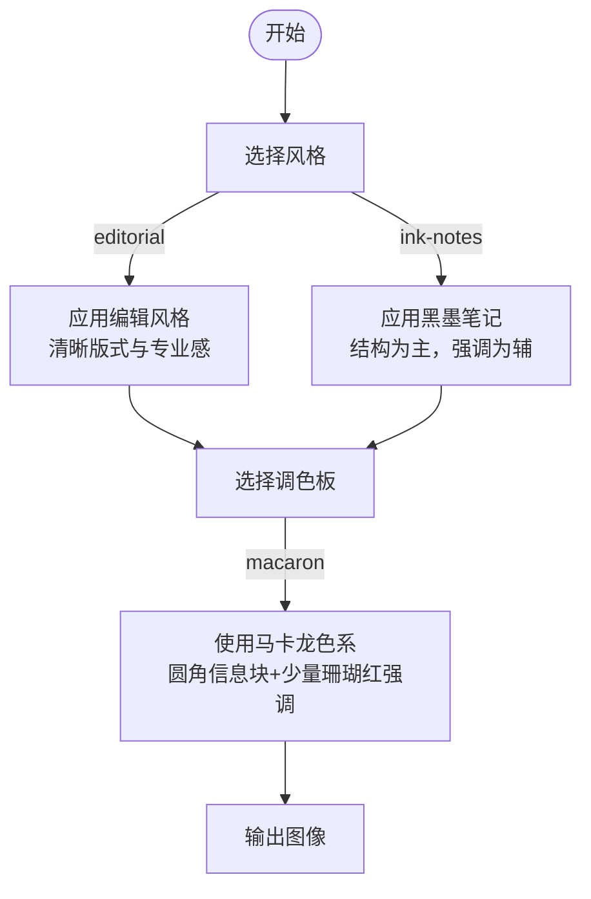
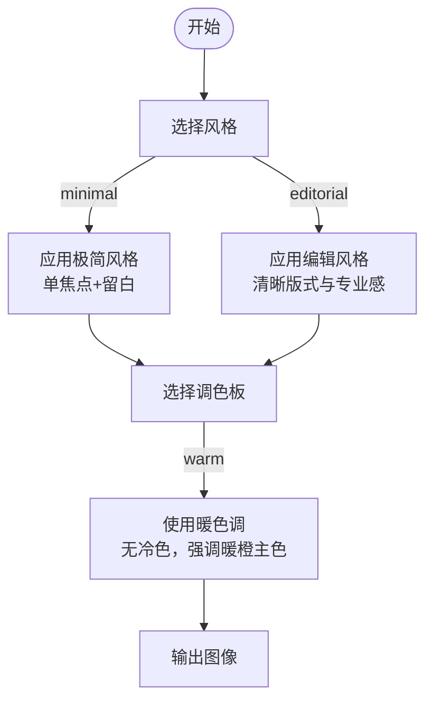
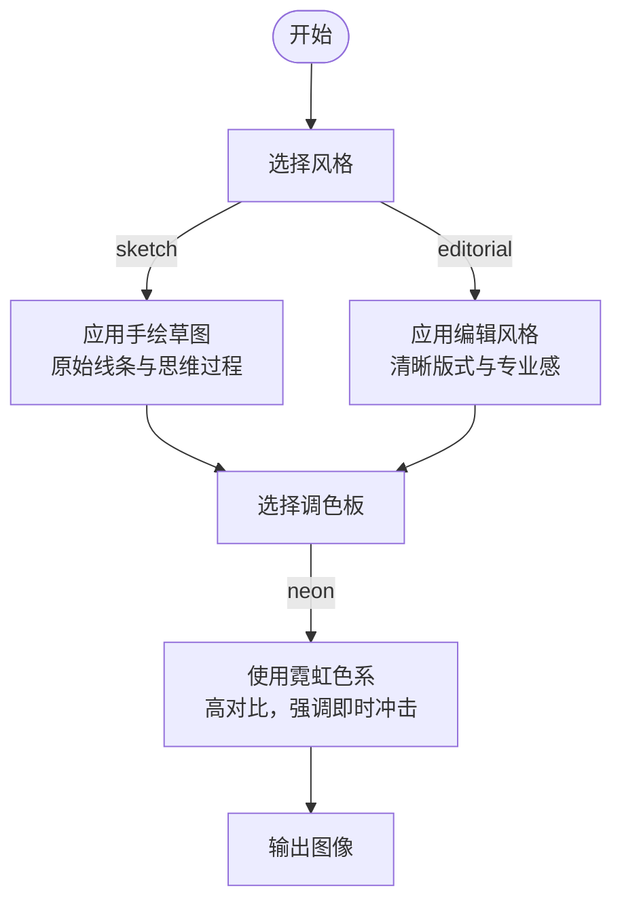
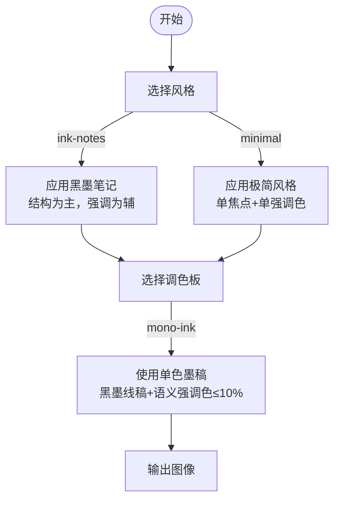
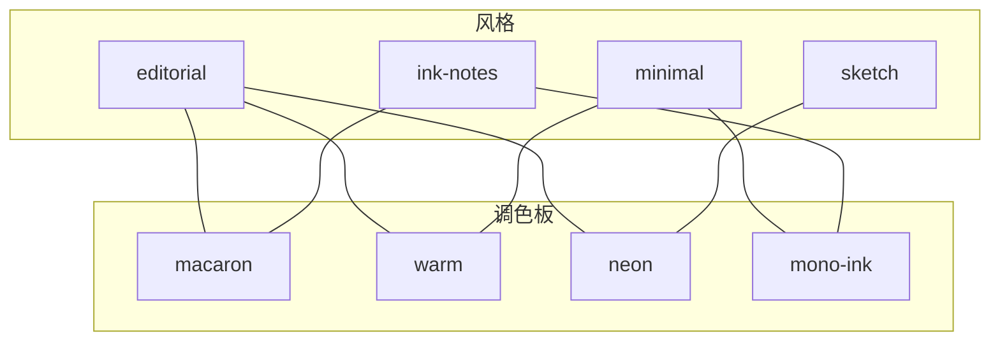

# 调色板系统

<cite>
**本文引用的文件**
- [macaron.md](file://.agents/skills/baoyu-article-illustrator/references/palettes/macaron.md)
- [warm.md](file://.agents/skills/baoyu-article-illustrator/references/palettes/warm.md)
- [neon.md](file://.agents/skills/baoyu-article-illustrator/references/palettes/neon.md)
- [mono-ink.md](file://.agents/skills/baoyu-article-illustrator/references/palettes/mono-ink.md)
- [editorial.md](file://.agents/skills/baoyu-article-illustrator/references/styles/editorial.md)
- [minimal.md](file://.agents/skills/baoyu-article-illustrator/references/styles/minimal.md)
- [ink-notes.md](file://.agents/skills/baoyu-article-illustrator/references/styles/ink-notes.md)
- [sketch.md](file://.agents/skills/baoyu-article-illustrator/references/styles/sketch.md)
</cite>

## 目录
1. [简介](#简介)
2. [项目结构](#项目结构)
3. [核心组件](#核心组件)
4. [架构总览](#架构总览)
5. [详细组件分析](#详细组件分析)
6. [依赖关系分析](#依赖关系分析)
7. [性能考量](#性能考量)
8. [故障排查指南](#故障排查指南)
9. [结论](#结论)
10. [附录](#附录)

## 简介
本文件面向 baoyu-article-illustrator 技能的“调色板系统”，系统性阐述四种主要调色板（macaron、warm、neon、mono-ink）的设计理念、色彩构成、语义约束与适用场景，并结合艺术风格（如 editorial、minimal、ink-notes、sketch）给出组合规则与优先级建议。文档同时提供调色板覆盖的实现逻辑与视觉效果对比，帮助读者在实际创作中做出一致、高效且富有表现力的选择。

## 项目结构
调色板与风格均以 Markdown 文档形式组织于技能参考目录中，便于检索与维护。调色板侧重“色彩角色与用途”，风格侧重“整体美学与元素规范”。两者通过“组合规则”协同决定最终图像的视觉呈现。

图表来源
- [macaron.md:1-34](file://.agents/skills/baoyu-article-illustrator/references/palettes/macaron.md#L1-L34)
- [warm.md:1-33](file://.agents/skills/baoyu-article-illustrator/references/palettes/warm.md#L1-L33)
- [neon.md:1-34](file://.agents/skills/baoyu-article-illustrator/references/palettes/neon.md#L1-L34)
- [mono-ink.md:1-43](file://.agents/skills/baoyu-article-illustrator/references/palettes/mono-ink.md#L1-L43)
- [editorial.md:1-60](file://.agents/skills/baoyu-article-illustrator/references/styles/editorial.md#L1-L60)
- [minimal.md:1-59](file://.agents/skills/baoyu-article-illustrator/references/styles/minimal.md#L1-L59)
- [ink-notes.md:1-91](file://.agents/skills/baoyu-article-illustrator/references/styles/ink-notes.md#L1-L91)
- [sketch.md:1-58](file://.agents/skills/baoyu-article-illustrator/references/styles/sketch.md#L1-L58)

章节来源
- [.agents/skills/baoyu-article-illustrator/references/palettes/macaron.md:1-34](file://.agents/skills/baoyu-article-illustrator/references/palettes/macaron.md#L1-L34)
- [.agents/skills/baoyu-article-illustrator/references/palettes/warm.md:1-33](file://.agents/skills/baoyu-article-illustrator/references/palettes/warm.md#L1-L33)
- [.agents/skills/baoyu-article-illustrator/references/palettes/neon.md:1-34](file://.agents/skills/baoyu-article-illustrator/references/palettes/neon.md#L1-L34)
- [.agents/skills/baoyu-article-illustrator/references/palettes/mono-ink.md:1-43](file://.agents/skills/baoyu-article-illustrator/references/palettes/mono-ink.md#L1-L43)
- [.agents/skills/baoyu-article-illustrator/references/styles/editorial.md:1-60](file://.agents/skills/baoyu-article-illustrator/references/styles/editorial.md#L1-L60)
- [.agents/skills/baoyu-article-illustrator/references/styles/minimal.md:1-59](file://.agents/skills/baoyu-article-illustrator/references/styles/minimal.md#L1-L59)
- [.agents/skills/baoyu-article-illustrator/references/styles/ink-notes.md:1-91](file://.agents/skills/baoyu-article-illustrator/references/styles/ink-notes.md#L1-L91)
- [.agents/skills/baoyu-article-illustrator/references/styles/sketch.md:1-58](file://.agents/skills/baoyu-article-illustrator/references/styles/sketch.md#L1-L58)

## 核心组件
- 调色板（Palette）
  - macaron：柔和马卡龙色块，强调信息区块的圆角卡片背景与适度强调色，适用于知识类与教学类内容。
  - warm：暖色地景，无冷色，现代复古感，适合产品展示、团队介绍、品牌内容。
  - neon：暗底高对比霓虹色，强调即时视觉冲击，适合游戏、复古科技、流行文化主题。
  - mono-ink：纯白画布+黑墨线稿，仅以语义强调色点缀（风险/问题/积极/中性），严格限制彩色像素占比，适合专业视觉笔记与白板讲解。
- 风格（Style）
  - editorial：杂志风格专业信息图，强调清晰叙事与版式结构。
  - minimal：极致简洁，单焦点、留白与几何形态，强调克制与聚焦。
  - ink-notes：黑墨笔记风格，延续 mike rohde 式视觉笔记传统，强调结构性与语义强调。
  - sketch：原始手绘草图，强调“在进行中”的真实感与思维过程。

章节来源
- [.agents/skills/baoyu-article-illustrator/references/palettes/macaron.md:1-34](file://.agents/skills/baoyu-article-illustrator/references/palettes/macaron.md#L1-L34)
- [.agents/skills/baoyu-article-illustrator/references/palettes/warm.md:1-33](file://.agents/skills/baoyu-article-illustrator/references/palettes/warm.md#L1-L33)
- [.agents/skills/baoyu-article-illustrator/references/palettes/neon.md:1-34](file://.agents/skills/baoyu-article-illustrator/references/palettes/neon.md#L1-L34)
- [.agents/skills/baoyu-article-illustrator/references/palettes/mono-ink.md:1-43](file://.agents/skills/baoyu-article-illustrator/references/palettes/mono-ink.md#L1-L43)
- [.agents/skills/baoyu-article-illustrator/references/styles/editorial.md:1-60](file://.agents/skills/baoyu-article-illustrator/references/styles/editorial.md#L1-L60)
- [.agents/skills/baoyu-article-illustrator/references/styles/minimal.md:1-59](file://.agents/skills/baoyu-article-illustrator/references/styles/minimal.md#L1-L59)
- [.agents/skills/baoyu-article-illustrator/references/styles/ink-notes.md:1-91](file://.agents/skills/baoyu-article-illustrator/references/styles/ink-notes.md#L1-L91)
- [.agents/skills/baoyu-article-illustrator/references/styles/sketch.md:1-58](file://.agents/skills/baoyu-article-illustrator/references/styles/sketch.md#L1-L58)

## 架构总览
调色板与风格的协同遵循“风格决定整体基调，调色板提供色彩骨架与语义约束”的原则。风格文档通常给出背景与主色范围，调色板则细化角色色与使用边界；二者共同决定最终图像的可读性、情绪与品牌一致性。

## 详细组件分析

### macaron（马卡龙色系）
- 设计特色
  - 背景为温暖奶油色，带有细微纸纹；强调信息区块的圆角卡片背景。
  - 主要角色色包括深炭灰用于标题与轮廓，以及多种马卡龙色作为信息块填充。
  - 强调色为珊瑚红，用于关键数据、警告与重点强调，应少量使用。
- 适用场景
  - 教育类内容、知识分享、概念解释、教程、技术摘要、入职材料。
- 语义约束
  - 不应在图像中直接渲染颜色名称、十六进制码或角色标签为可见文本。
- 组合建议
  - 与 editorial 配合可强化信息区块的层次与可读性；与 ink-notes 协作时，可用马卡龙色作为语义强调的补充（需严格控制比例）。

图表来源
- [macaron.md:1-34](file://.agents/skills/baoyu-article-illustrator/references/palettes/macaron.md#L1-L34)
- [editorial.md:1-60](file://.agents/skills/baoyu-article-illustrator/references/styles/editorial.md#L1-L60)
- [ink-notes.md:1-91](file://.agents/skills/baoyu-article-illustrator/references/styles/ink-notes.md#L1-L91)

章节来源
- [.agents/skills/baoyu-article-illustrator/references/palettes/macaron.md:1-34](file://.agents/skills/baoyu-article-illustrator/references/palettes/macaron.md#L1-L34)
- [.agents/skills/baoyu-article-illustrator/references/styles/editorial.md:1-60](file://.agents/skills/baoyu-article-illustrator/references/styles/editorial.md#L1-L60)
- [.agents/skills/baoyu-article-illustrator/references/styles/ink-notes.md:1-91](file://.agents/skills/baoyu-article-illustrator/references/styles/ink-notes.md#L1-L91)

### warm（暖色调）
- 设计特色
  - 背景为柔和桃粉，带有温暖纸质感；强调暖色系主次关系，避免任何冷色（绿/蓝/紫）。
  - 主要角色色包括深炭灰轮廓、暖橙为主色、赤土/金黄为辅助与高光。
- 适用场景
  - 产品展示、团队介绍、功能网格、品牌内容、个人成长、生活方式。
- 语义约束
  - 严禁在图像中直接渲染颜色名称、十六进制码或角色标签为可见文本。
- 组合建议
  - 与 minimal 搭配可形成“暖色结构+极简表达”的平衡；与 editorial 结合可增强亲和力与专业度。

图表来源
- [warm.md:1-33](file://.agents/skills/baoyu-article-illustrator/references/palettes/warm.md#L1-L33)
- [minimal.md:1-59](file://.agents/skills/baoyu-article-illustrator/references/styles/minimal.md#L1-L59)
- [editorial.md:1-60](file://.agents/skills/baoyu-article-illustrator/references/styles/editorial.md#L1-L60)

章节来源
- [.agents/skills/baoyu-article-illustrator/references/palettes/warm.md:1-33](file://.agents/skills/baoyu-article-illustrator/references/palettes/warm.md#L1-L33)
- [.agents/skills/baoyu-article-illustrator/references/styles/minimal.md:1-59](file://.agents/skills/baoyu-article-illustrator/references/styles/minimal.md#L1-L59)
- [.agents/skills/baoyu-article-illustrator/references/styles/editorial.md:1-60](file://.agents/skills/baoyu-article-illustrator/references/styles/editorial.md#L1-L60)

### neon（霓虹色系）
- 设计特色
  - 背景为深紫，纹理可为细网格或纯暗色；强调高对比霓虹色，突出即时视觉冲击。
  - 主要角色色包括深紫主背景、深青作为区域区分、热粉/电青/霓虹黄为主次强调。
- 适用场景
  - 游戏、复古科技、80/90年代怀旧内容、大胆编辑性内容、潮流与流行文化。
- 语义约束
  - 严禁在图像中直接渲染颜色名称、十六进制码或角色标签为可见文本。
- 组合建议
  - 与 sketch 配合可形成“原始手绘线条+霓虹高亮”的反差张力；与 editorial 结合需谨慎，避免喧宾夺主。

图表来源
- [neon.md:1-34](file://.agents/skills/baoyu-article-illustrator/references/palettes/neon.md#L1-L34)
- [sketch.md:1-58](file://.agents/skills/baoyu-article-illustrator/references/styles/sketch.md#L1-L58)
- [editorial.md:1-60](file://.agents/skills/baoyu-article-illustrator/references/styles/editorial.md#L1-L60)

章节来源
- [.agents/skills/baoyu-article-illustrator/references/palettes/neon.md:1-34](file://.agents/skills/baoyu-article-illustrator/references/palettes/neon.md#L1-L34)
- [.agents/skills/baoyu-article-illustrator/references/styles/sketch.md:1-58](file://.agents/skills/baoyu-article-illustrator/references/styles/sketch.md#L1-L58)
- [.agents/skills/baoyu-article-illustrator/references/styles/editorial.md:1-60](file://.agents/skills/baoyu-article-illustrator/references/styles/editorial.md#L1-L60)

### mono-ink（单色墨稿）
- 设计特色
  - 纯白画布，无纹理与杂色；黑墨线稿承担所有结构元素（线条、文字、图形、箭头）。
  - 仅以语义强调色点缀：珊瑚红（风险/问题/缺口）、柔和水鸭色（积极/方案/“之后”状态）、薰衣柔灰（中性标签/分类）。
  - 彩色像素总量不得超过画布的 10%；浅灰可做轻微区域背景但不得喧宾夺主。
- 适用场景
  - 专业视觉笔记、前后对比文章、技术宣言、框架类比、白板讲解式解释。
- 兼容性
  - 与 ink-notes 兼容（默认搭配）；与 minimal 可视为严格单色变体（可舍弃风格内置强调色）。
  - 不建议与 sketch-notes 搭配（其“不使用纯白背景”规则冲突）；也不建议与色彩浓重风格（如 warm、elegant、watercolor、fantasy-animation）混用。
- 组合建议
  - 与 ink-notes 协同可强化“结构线稿+语义强调”的专业表达；与 minimal 结合可形成“极致单色+内容派生强调色”的平衡。

图表来源
- [mono-ink.md:1-43](file://.agents/skills/baoyu-article-illustrator/references/palettes/mono-ink.md#L1-L43)
- [ink-notes.md:1-91](file://.agents/skills/baoyu-article-illustrator/references/styles/ink-notes.md#L1-L91)
- [minimal.md:1-59](file://.agents/skills/baoyu-article-illustrator/references/styles/minimal.md#L1-L59)

章节来源
- [.agents/skills/baoyu-article-illustrator/references/palettes/mono-ink.md:1-43](file://.agents/skills/baoyu-article-illustrator/references/palettes/mono-ink.md#L1-L43)
- [.agents/skills/baoyu-article-illustrator/references/styles/ink-notes.md:1-91](file://.agents/skills/baoyu-article-illustrator/references/styles/ink-notes.md#L1-L91)
- [.agents/skills/baoyu-article-illustrator/references/styles/minimal.md:1-59](file://.agents/skills/baoyu-article-illustrator/references/styles/minimal.md#L1-L59)

## 依赖关系分析
- 调色板与风格的耦合度
  - macaron 与 warm 更偏向“信息区块与暖意表达”，适合 editorial 与 minimal。
  - neon 与 sketch 的组合更强调“原始线条+高对比强调”，适合需要视觉张力的内容。
  - mono-ink 与 ink-notes/ minimal 的组合强调“结构优先+语义强调”，适合专业表达与白板讲解。
- 冲突与规避
  - mono-ink 与 sketch-notes 冲突（背景规则不同）。
  - mono-ink 与色彩浓重风格（如 warm/elegant/watercolor/fantasy-animation）不兼容，因会削弱其“单色克制”的表达。
- 优先级建议
  - 当风格已确定基调后，优先选择与之在“情感与可读性”上互补的调色板；若风格本身强调极简，则优先考虑 mono-ink 或 warm 的极简变体。

图表来源
- [editorial.md:1-60](file://.agents/skills/baoyu-article-illustrator/references/styles/editorial.md#L1-L60)
- [minimal.md:1-59](file://.agents/skills/baoyu-article-illustrator/references/styles/minimal.md#L1-L59)
- [ink-notes.md:1-91](file://.agents/skills/baoyu-article-illustrator/references/styles/ink-notes.md#L1-L91)
- [sketch.md:1-58](file://.agents/skills/baoyu-article-illustrator/references/styles/sketch.md#L1-L58)
- [macaron.md:1-34](file://.agents/skills/baoyu-article-illustrator/references/palettes/macaron.md#L1-L34)
- [warm.md:1-33](file://.agents/skills/baoyu-article-illustrator/references/palettes/warm.md#L1-L33)
- [neon.md:1-34](file://.agents/skills/baoyu-article-illustrator/references/palettes/neon.md#L1-L34)
- [mono-ink.md:1-43](file://.agents/skills/baoyu-article-illustrator/references/palettes/mono-ink.md#L1-L43)

章节来源
- [.agents/skills/baoyu-article-illustrator/references/styles/editorial.md:1-60](file://.agents/skills/baoyu-article-illustrator/references/styles/editorial.md#L1-L60)
- [.agents/skills/baoyu-article-illustrator/references/styles/minimal.md:1-59](file://.agents/skills/baoyu-article-illustrator/references/styles/minimal.md#L1-L59)
- [.agents/skills/baoyu-article-illustrator/references/styles/ink-notes.md:1-91](file://.agents/skills/baoyu-article-illustrator/references/styles/ink-notes.md#L1-L91)
- [.agents/skills/baoyu-article-illustrator/references/styles/sketch.md:1-58](file://.agents/skills/baoyu-article-illustrator/references/styles/sketch.md#L1-L58)
- [.agents/skills/baoyu-article-illustrator/references/palettes/macaron.md:1-34](file://.agents/skills/baoyu-article-illustrator/references/palettes/macaron.md#L1-L34)
- [.agents/skills/baoyu-article-illustrator/references/palettes/warm.md:1-33](file://.agents/skills/baoyu-article-illustrator/references/palettes/warm.md#L1-L33)
- [.agents/skills/baoyu-article-illustrator/references/palettes/neon.md:1-34](file://.agents/skills/baoyu-article-illustrator/references/palettes/neon.md#L1-L34)
- [.agents/skills/baoyu-article-illustrator/references/palettes/mono-ink.md:1-43](file://.agents/skills/baoyu-article-illustrator/references/palettes/mono-ink.md#L1-L43)

## 性能考量
- 调色板对渲染的影响
  - 高对比（neon）与大量强调色（macaron）可能增加图像复杂度，影响生成时间与资源消耗。
  - 单色（mono-ink）可降低色彩计算开销，提升稳定性和一致性。
- 品牌一致性与可读性
  - 保持风格与调色板的组合稳定，有助于建立统一的品牌视觉语言，减少不必要的风格切换导致的认知负担。
- 建议
  - 在批量生成场景中优先选择 mono-ink 或 warm 的极简变体，以平衡质量与效率。

## 故障排查指南
- 常见问题
  - 图像出现过多彩色像素或强调色滥用：检查 mono-ink 的强调色占比是否超过 10%，或 macaron 的强调色使用频率是否过高。
  - 背景与风格冲突：如尝试将 mono-ink 与 sketch-notes 搭配，需调整背景策略以符合风格要求。
  - 霓虹色与风格不协调：neon 适合高冲击场景，与 editorial 的专业克制可能产生冲突，需评估目标受众与语境。
- 排查步骤
  - 明确风格基调与目标受众，确认调色板是否与其情绪与可读性相匹配。
  - 回顾调色板的语义约束与使用边界，确保未在图像中渲染颜色名称、十六进制码或角色标签。
  - 如出现视觉拥挤，优先减少强调色数量或采用单色方案。

章节来源
- [.agents/skills/baoyu-article-illustrator/references/palettes/mono-ink.md:21-28](file://.agents/skills/baoyu-article-illustrator/references/palettes/mono-ink.md#L21-L28)
- [.agents/skills/baoyu-article-illustrator/references/palettes/macaron.md:23-30](file://.agents/skills/baoyu-article-illustrator/references/palettes/macaron.md#L23-L30)
- [.agents/skills/baoyu-article-illustrator/references/styles/ink-notes.md:55-76](file://.agents/skills/baoyu-article-illustrator/references/styles/ink-notes.md#L55-L76)

## 结论
调色板系统通过“风格决定基调、调色板提供骨架”的方式，为 baoyu-article-illustrator 技能提供了清晰的视觉决策框架。macaron 与 warm 适合信息密度较高且强调亲和力的内容；neon 适合需要即时视觉冲击的主题；mono-ink 则是专业表达与白板讲解的首选。遵循语义约束与组合优先级，可在保证品牌一致性的同时，最大化内容的可读性与表现力。

## 附录
- 最佳实践清单
  - 明确风格基调后再选择调色板，确保情绪与可读性一致。
  - 严格遵守调色板的语义约束，不在图像中渲染颜色名称、十六进制码或角色标签。
  - 控制强调色使用频率与占比（尤其是 mono-ink 不得超过 10%）。
  - 在品牌内容中优先采用 warm 与 editorial 的组合，以兼顾专业度与亲和力。
  - 批量生成时优先选择 mono-ink 或 warm 的极简变体，以提升稳定性与效率。