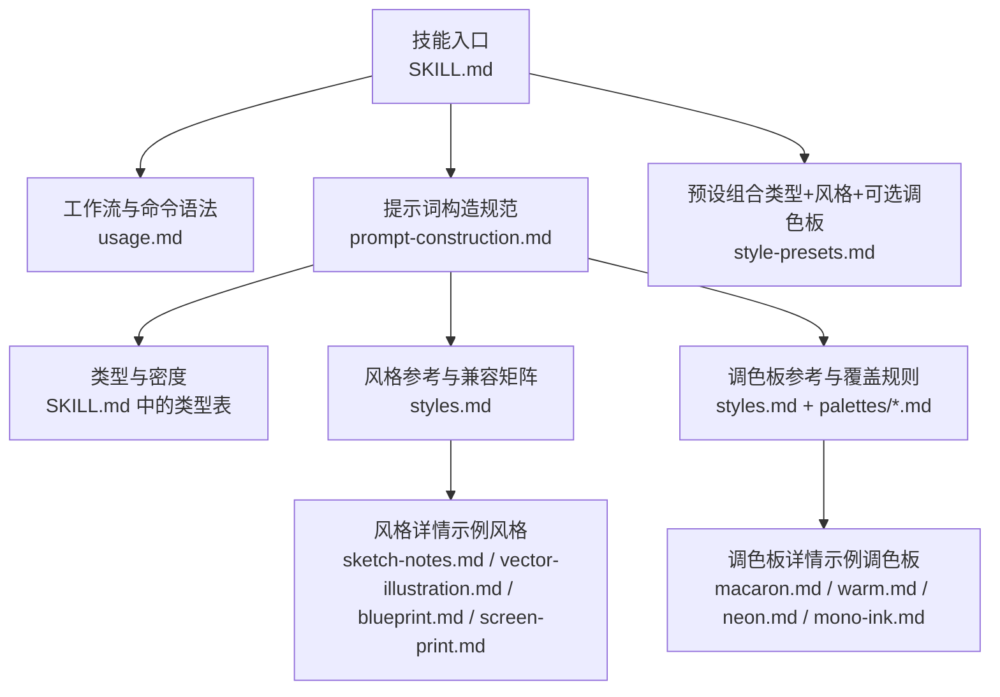
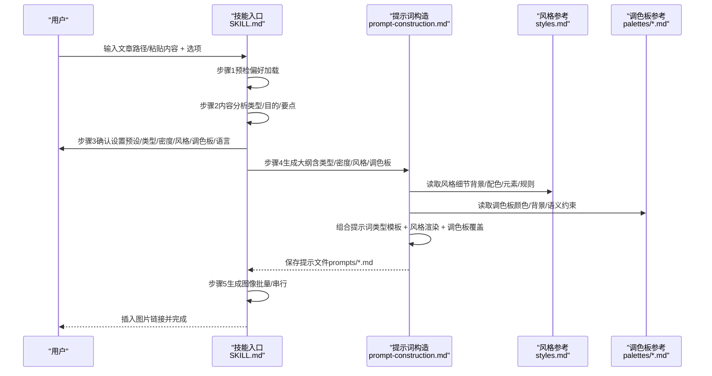
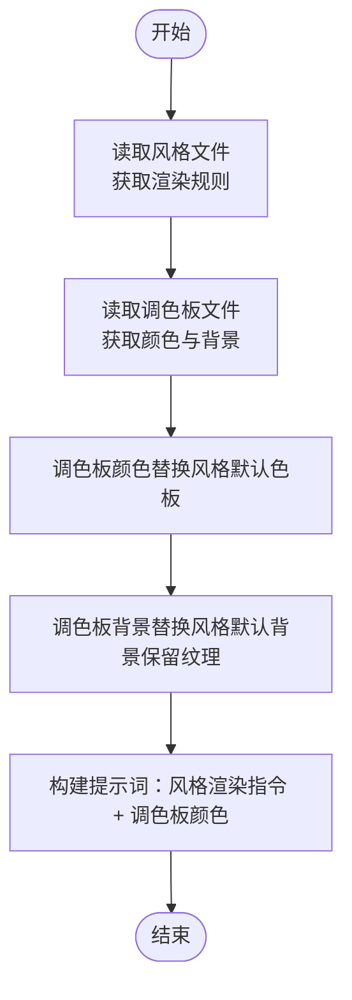
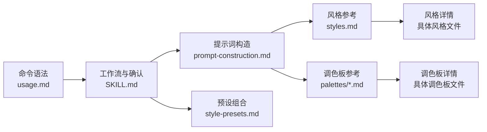

# 风格与调色板系统

<cite>
**本文引用的文件**
- [SKILL.md](file://.agents/skills/baoyu-article-illustrator/SKILL.md)
- [system.md](file://.agents/skills/baoyu-article-illustrator/prompts/system.md)
- [prompt-construction.md](file://.agents/skills/baoyu-article-illustrator/references/prompt-construction.md)
- [style-presets.md](file://.agents/skills/baoyu-article-illustrator/references/style-presets.md)
- [styles.md](file://.agents/skills/baoyu-article-illustrator/references/styles.md)
- [usage.md](file://.agents/skills/baoyu-article-illustrator/references/usage.md)
- [macaron.md](file://.agents/skills/baoyu-article-illustrator/references/palettes/macaron.md)
- [warm.md](file://.agents/skills/baoyu-article-illustrator/references/palettes/warm.md)
- [neon.md](file://.agents/skills/baoyu-article-illustrator/references/palettes/neon.md)
- [mono-ink.md](file://.agents/skills/baoyu-article-illustrator/references/palettes/mono-ink.md)
- [sketch-notes.md](file://.agents/skills/baoyu-article-illustrator/references/styles/sketch-notes.md)
- [vector-illustration.md](file://.agents/skills/baoyu-article-illustrator/references/styles/vector-illustration.md)
- [blueprint.md](file://.agents/skills/baoyu-article-illustrator/references/styles/blueprint.md)
- [screen-print.md](file://.agents/skills/baoyu-article-illustrator/references/styles/screen-print.md)
</cite>

## 目录
1. [简介](#简介)
2. [项目结构](#项目结构)
3. [核心组件](#核心组件)
4. [架构总览](#架构总览)
5. [详细组件分析](#详细组件分析)
6. [依赖关系分析](#依赖关系分析)
7. [性能考量](#性能考量)
8. [故障排查指南](#故障排查指南)
9. [结论](#结论)
10. [附录](#附录)

## 简介
本文件面向 baoyu-article-illustrator 技能的风格与调色板系统，系统化阐述 Type × Style × Palette 三维组合的设计理念、实现机制与使用方法。重点覆盖：
- 六种插画类型（信息图表、场景、流程图、比较图、框架图、时间线）的定位与适用场景
- 艺术风格模板（如蓝图、粉笔板、编辑风格、优雅、水彩等）的设计理念与视觉特征
- 调色板系统（默认调色板、macaron、暖色调、霓虹色、单色墨水等）的工作机制与选择策略
- 风格选择最佳实践与兼容性指南

## 项目结构
技能以“参考文档 + 提示词构造规则”的方式组织风格与调色板知识，便于在生成前统一构建提示词并确保一致性。

**图表来源**
- [SKILL.md:57-93](file://.agents/skills/baoyu-article-illustrator/SKILL.md#L57-L93)
- [usage.md:1-83](file://.agents/skills/baoyu-article-illustrator/references/usage.md#L1-L83)
- [prompt-construction.md:122-460](file://.agents/skills/baoyu-article-illustrator/references/prompt-construction.md#L122-L460)
- [styles.md:21-237](file://.agents/skills/baoyu-article-illustrator/references/styles.md#L21-L237)
- [style-presets.md:1-88](file://.agents/skills/baoyu-article-illustrator/references/style-presets.md#L1-L88)

**章节来源**
- [SKILL.md:57-93](file://.agents/skills/baoyu-article-illustrator/SKILL.md#L57-L93)
- [usage.md:1-83](file://.agents/skills/baoyu-article-illustrator/references/usage.md#L1-L83)

## 核心组件
- 类型（Type）：决定插画的结构性与表达重心，包含 infographic、scene、flowchart、comparison、framework、timeline 六类，分别适用于数据可视化、叙事氛围、流程步骤、对比分析、概念模型与时间演进。
- 风格（Style）：定义渲染方式与视觉语言，涵盖 vector-illustration、blueprint、screen-print、sketch-notes、watercolor、elegant 等风格，每种风格有明确的背景、配色、元素与规则。
- 调色板（Palette）：对风格默认配色进行覆盖或补充，支持 macaron（马卡龙）、warm（暖色）、neon（霓虹）、mono-ink（单色墨水）等，强调语义约束与文本安全。

**章节来源**
- [SKILL.md:69-83](file://.agents/skills/baoyu-article-illustrator/SKILL.md#L69-L83)
- [styles.md:21-48](file://.agents/skills/baoyu-article-illustrator/references/styles.md#L21-L48)
- [styles.md:214-228](file://.agents/skills/baoyu-article-illustrator/references/styles.md#L214-L228)
- [prompt-construction.md:413-443](file://.agents/skills/baoyu-article-illustrator/references/prompt-construction.md#L413-L443)

## 架构总览
Type × Style × Palette 的组合通过“先类型后风格再调色板”的顺序构建提示词，并在生成前保存为独立的提示文件，确保可复现与可回溯。

**图表来源**
- [SKILL.md:84-206](file://.agents/skills/baoyu-article-illustrator/SKILL.md#L84-L206)
- [prompt-construction.md:122-460](file://.agents/skills/baoyu-article-illustrator/references/prompt-construction.md#L122-L460)
- [styles.md:21-237](file://.agents/skills/baoyu-article-illustrator/references/styles.md#L21-L237)
- [style-presets.md:1-88](file://.agents/skills/baoyu-article-illustrator/references/style-presets.md#L1-L88)

## 详细组件分析

### 类型系统（Type）
- 信息图表（infographic）：聚焦数据、指标与技术内容，适合用清晰的分区与图标传达要点。
- 场景（scene）：强调叙事与情感，适合个人故事、生活方式与文化主题。
- 流程图（flowchart）：强调过程与步骤，适合教程、工作流与操作指引。
- 比较图（comparison）：强调对比与选择，适合产品评测、方案对比与思维转变。
- 框架图（framework）：强调模型与架构，适合概念模型、系统设计与白板讲解。
- 时间线（timeline）：强调历史与演化，适合里程碑回顾与成长历程。

建议选择原则：
- 无强信号时优先 infographic；技术/数据类倾向 infographic 或 framework；叙事/情感类倾向 scene；流程/步骤类倾向 flowchart；对比/评测类倾向 comparison；模型/架构类倾向 framework；历史/演进类倾向 timeline。

**章节来源**
- [SKILL.md:69-83](file://.agents/skills/baoyu-article-illustrator/SKILL.md#L69-L83)
- [styles.md:64-96](file://.agents/skills/baoyu-article-illustrator/references/styles.md#L64-L96)

### 风格系统（Style）
- vector-illustration：扁平矢量风格，几何简化、线条统一，适合知识类与技术类内容。
- blueprint：工程蓝图风格，严谨、网格化、强调技术精度，适合系统设计与架构图。
- screen-print：丝网印刷风格，强调限量色彩、点状纹理与象征叙事，适合观点类与文化评论。
- sketch-notes：手绘笔记风格，暖色纸张、黑线勾勒、马卡龙色块，适合教育与入门类内容。
- watercolor：水彩风格，柔和自然、富有温度，适合生活、旅行与创意主题。
- elegant：精致高雅，适合商业与思想领导力内容。
- 其他风格（如 notion、scientific、chalkboard、fantasy-animation、flat、flat-doodle、intuition-machine、nature、pixel-art、playful、retro、sketch、vintage）按需选用，详见风格参考与兼容矩阵。

风格特性与推荐搭配：
- infographic + sketch-notes：默认友好、易理解、适合单页解释器。
- infographic + vector-illustration：现代专业、高可读性。
- flowchart + vector-illustration：步骤清晰、连接明确。
- comparison + vector-illustration：左右分栏、对比直观。
- framework + blueprint：精确连接、层级清晰。
- scene + watercolor：艺术氛围、情感丰富。
- scene + screen-print：观点强烈、视觉冲击。

**章节来源**
- [styles.md:21-48](file://.agents/skills/baoyu-article-illustrator/references/styles.md#L21-L48)
- [styles.md:97-212](file://.agents/skills/baoyu-article-illustrator/references/styles.md#L97-L212)
- [sketch-notes.md:1-92](file://.agents/skills/baoyu-article-illustrator/references/styles/sketch-notes.md#L1-L92)
- [vector-illustration.md:1-58](file://.agents/skills/baoyu-article-illustrator/references/styles/vector-illustration.md#L1-L58)
- [blueprint.md:1-58](file://.agents/skills/baoyu-article-illustrator/references/styles/blueprint.md#L1-L58)
- [screen-print.md:1-71](file://.agents/skills/baoyu-article-illustrator/references/styles/screen-print.md#L1-L71)

### 调色板系统（Palette）
- 默认调色板：由风格自身提供，保证风格识别度与一致性。
- macaron（马卡龙）：软粉彩块 + 温暖奶油底色，适合教育、知识分享与入门内容。
- warm（暖色）：暖土色调 + 柔软桃粉底色，强调品牌、产品与生活方式。
- neon（霓虹）：深紫底 + 高对比霓虹色，适合游戏、复古与流行文化。
- mono-ink（单色墨水）：纯白画布 + 黑墨线 + 稀疏语义色（红/青/灰），适合专业视觉笔记与前后对比。

覆盖规则：
- 读取风格文件 → 获取渲染规则（视觉元素、风格规则、线条处理）
- 读取调色板文件 → 获取颜色与背景
- 调色板颜色替换风格默认色板
- 调色板背景替换风格默认背景（保留风格纹理描述）
- 构建提示：风格渲染指令 + 调色板颜色

**图表来源**
- [prompt-construction.md:413-443](file://.agents/skills/baoyu-article-illustrator/references/prompt-construction.md#L413-L443)

**章节来源**
- [prompt-construction.md:413-443](file://.agents/skills/baoyu-article-illustrator/references/prompt-construction.md#L413-L443)
- [macaron.md:1-34](file://.agents/skills/baoyu-article-illustrator/references/palettes/macaron.md#L1-L34)
- [warm.md:1-33](file://.agents/skills/baoyu-article-illustrator/references/palettes/warm.md#L1-L33)
- [neon.md:1-34](file://.agents/skills/baoyu-article-illustrator/references/palettes/neon.md#L1-L34)
- [mono-ink.md:1-43](file://.agents/skills/baoyu-article-illustrator/references/palettes/mono-ink.md#L1-L43)

### 预设与最佳实践
- 预设（preset）：一键组合 type + style + 可选 palette，覆盖通用场景与强信号内容。
- 默认预设：当内容无强信号时，优先推荐 hand-drawn-edu（信息图表 + 手绘笔记 + 马卡龙），适合大多数知识类与入门类文章。
- 内容到预设映射：根据 Step 2 的内容分析结果，从预设表中选择主推与备选，再允许用户微调。
- 覆盖规则：显式 --type/--style/--palette 会覆盖预设值。

风格选择最佳实践：
- 无强信号：默认 sketch-notes（→ hand-drawn-edu）
- 技术/数据：blueprint 或 vector-illustration
- 教育/教程：sketch-notes 或 vector-illustration
- 流程/步骤：sketch-notes 或 vector-illustration
- 对比/评测：vector-illustration 或 elegant
- 白板/框架：blueprint 或 vector-illustration
- 叙事/情感：warm 或 watercolor
- 观点/文化：screen-print
- 学术/研究：scientific

兼容性指南：
- Type × Style 兼容矩阵：不同类型的推荐风格与不推荐风格一目了然，避免风格与类型不匹配导致的阅读负担。
- 单色墨水（mono-ink）与风格的兼容性：严格单色风格（如 minimal）更契合；与暖色/优雅/水彩等色彩丰富的风格搭配时需谨慎，避免削弱风格识别度。

**章节来源**
- [style-presets.md:5-88](file://.agents/skills/baoyu-article-illustrator/references/style-presets.md#L5-L88)
- [styles.md:51-96](file://.agents/skills/baoyu-article-illustrator/references/styles.md#L51-L96)
- [styles.md:214-237](file://.agents/skills/baoyu-article-illustrator/references/styles.md#L214-L237)

## 依赖关系分析
- 提示词构造依赖风格与调色板参考，二者共同决定最终渲染效果。
- 预设作为高层封装，内部仍遵循 Type × Style × Palette 的组合逻辑。
- 命令语法与工作流定义了输入、输出与生成策略，确保一致性与可复现性。

**图表来源**
- [usage.md:1-83](file://.agents/skills/baoyu-article-illustrator/references/usage.md#L1-L83)
- [SKILL.md:84-206](file://.agents/skills/baoyu-article-illustrator/SKILL.md#L84-L206)
- [prompt-construction.md:122-460](file://.agents/skills/baoyu-article-illustrator/references/prompt-construction.md#L122-L460)
- [styles.md:21-237](file://.agents/skills/baoyu-article-illustrator/references/styles.md#L21-L237)
- [style-presets.md:1-88](file://.agents/skills/baoyu-article-illustrator/references/style-presets.md#L1-L88)

**章节来源**
- [usage.md:1-83](file://.agents/skills/baoyu-article-illustrator/references/usage.md#L1-L83)
- [SKILL.md:84-206](file://.agents/skills/baoyu-article-illustrator/SKILL.md#L84-L206)

## 性能考量
- 批量生成优先：当存在多个已保存的提示文件时，优先使用后端提供的批量接口，减少子代理开销。
- 串行回退：若后端无批量能力，则按顺序生成，确保稳定性。
- 提示文件先行：强制保存提示文件，避免重复生成与漂移，提升整体效率与一致性。

**章节来源**
- [SKILL.md:157-172](file://.agents/skills/baoyu-article-illustrator/SKILL.md#L157-L172)

## 故障排查指南
- 文本泄露风险：调色板颜色仅作渲染指导，严禁在图像中显示颜色名称、十六进制值或调色板标签。提示词中应明确该约束。
- 引用文件缺失：frontmatter 中列出的引用文件必须真实存在，否则需移除引用字段或改为在提示正文追加描述。
- 风格与类型不兼容：参考兼容矩阵，避免将不适合的风格用于特定类型，导致信息传达困难。
- 单色墨水冲突：mono-ink 与纯白背景风格（如某些 sketch-notes 变体）存在冲突，应避免直接组合。
- 语言与排版：文本风格需与内容语言一致，标点风格也应匹配。

**章节来源**
- [prompt-construction.md:70-95](file://.agents/skills/baoyu-article-illustrator/references/prompt-construction.md#L70-L95)
- [prompt-construction.md:21-48](file://.agents/skills/baoyu-article-illustrator/references/prompt-construction.md#L21-L48)
- [styles.md:51-62](file://.agents/skills/baoyu-article-illustrator/references/styles.md#L51-L62)
- [mono-ink.md:25-28](file://.agents/skills/baoyu-article-illustrator/references/palettes/mono-ink.md#L25-L28)

## 结论
Type × Style × Palette 三维组合系统通过“先类型后风格再调色板”的提示词构建流程，实现了风格一致性与内容适配性的平衡。借助预设与兼容矩阵，用户可在不同内容类型与表达目标间快速做出合理选择；通过调色板覆盖规则与语义约束，确保视觉表达既美观又安全。建议在无强信号时采用默认预设，在强信号场景下结合内容分析与风格特性进行微调。

## 附录
- 常用命令与示例参见使用文档
- 风格与调色板的完整参考位于 styles.md 与各风格/调色板详情文件
- 提示词构造模板与覆盖规则位于 prompt-construction.md

**章节来源**
- [usage.md:52-83](file://.agents/skills/baoyu-article-illustrator/references/usage.md#L52-L83)
- [styles.md:21-237](file://.agents/skills/baoyu-article-illustrator/references/styles.md#L21-L237)
- [prompt-construction.md:122-460](file://.agents/skills/baoyu-article-illustrator/references/prompt-construction.md#L122-L460)