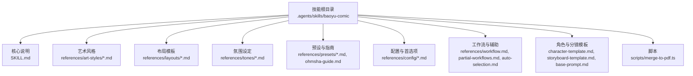
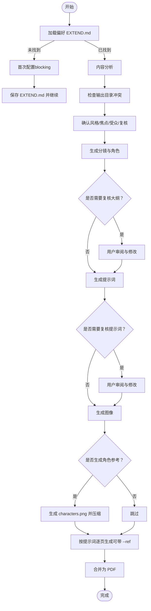
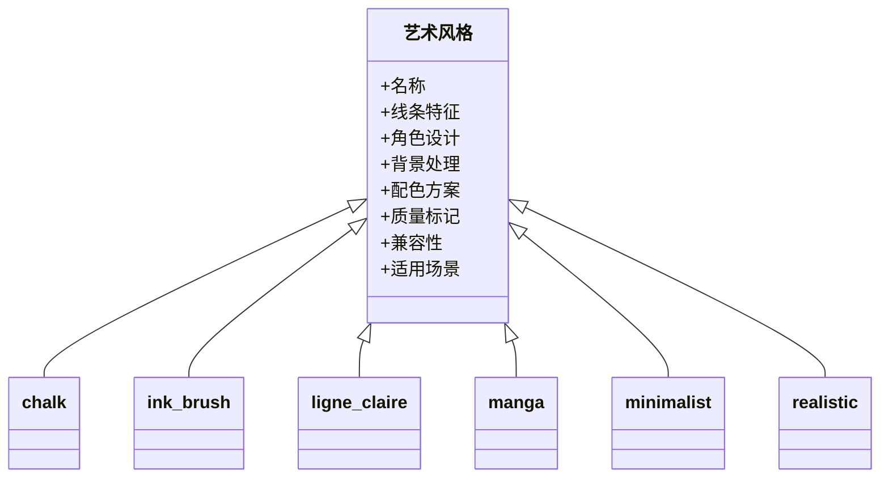
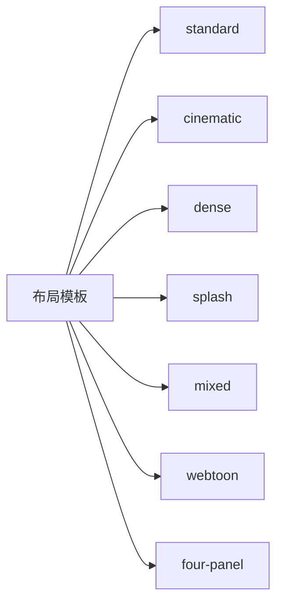
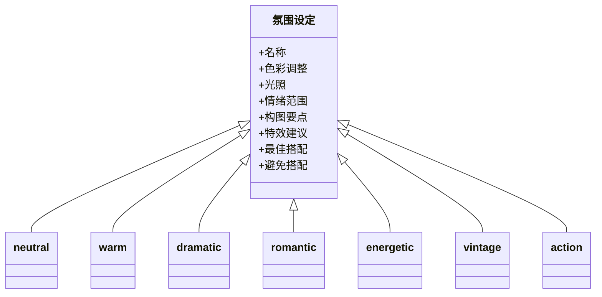
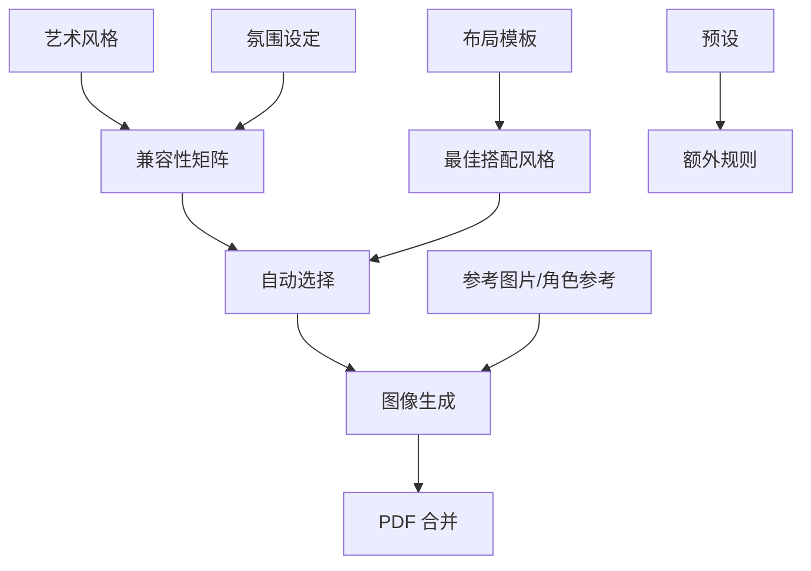

# baoyu-comic 漫画生成技能

<cite>
**本文引用的文件**
- [SKILL.md](file://.agents/skills/baoyu-comic/SKILL.md)
- [chalk.md](file://.agents/skills/baoyu-comic/references/art-styles/chalk.md)
- [ink-brush.md](file://.agents/skills/baoyu-comic/references/art-styles/ink-brush.md)
- [ligne-claire.md](file://.agents/skills/baoyu-comic/references/art-styles/ligne-claire.md)
- [manga.md](file://.agents/skills/baoyu-comic/references/art-styles/manga.md)
- [minimalist.md](file://.agents/skills/baoyu-comic/references/art-styles/minimalist.md)
- [realistic.md](file://.agents/skills/baoyu-comic/references/art-styles/realistic.md)
- [cinematic.md](file://.agents/skills/baoyu-comic/references/layouts/cinematic.md)
- [dense.md](file://.agents/skills/baoyu-comic/references/layouts/dense.md)
- [four-panel.md](file://.agents/skills/baoyu-comic/references/layouts/four-panel.md)
- [mixed.md](file://.agents/skills/baoyu-comic/references/layouts/mixed.md)
- [splash.md](file://.agents/skills/baoyu-comic/references/layouts/splash.md)
- [standard.md](file://.agents/skills/baoyu-comic/references/layouts/standard.md)
- [webtoon.md](file://.agents/skills/baoyu-comic/references/layouts/webtoon.md)
- [action.md](file://.agents/skills/baoyu-comic/references/tones/action.md)
- [dramatic.md](file://.agents/skills/baoyu-comic/references/tones/dramatic.md)
- [energetic.md](file://.agents/skills/baoyu-comic/references/tones/energetic.md)
- [neutral.md](file://.agents/skills/baoyu-comic/references/tones/neutral.md)
- [romantic.md](file://.agents/skills/baoyu-comic/references/tones/romantic.md)
- [vintage.md](file://.agents/skills/baoyu-comic/references/tones/vintage.md)
- [warm.md](file://.agents/skills/baoyu-comic/references/tones/warm.md)
- [merge-to-pdf.ts](file://.agents/skills/baoyu-comic/scripts/merge-to-pdf.ts)
- [ohmsha-guide.md](file://.agents/skills/baoyu-comic/references/ohmsha-guide.md)
- [watermark-guide.md](file://.agents/skills/baoyu-comic/references/config/watermark-guide.md)
- [preferences-schema.md](file://.agents/skills/baoyu-comic/references/config/preferences-schema.md)
- [first-time-setup.md](file://.agents/skills/baoyu-comic/references/config/first-time-setup.md)
- [auto-selection.md](file://.agents/skills/baoyu-comic/references/auto-selection.md)
- [workflow.md](file://.agents/skills/baoyu-comic/references/workflow.md)
- [partial-workflows.md](file://.agents/skills/baoyu-comic/references/partial-workflows.md)
- [character-template.md](file://.agents/skills/baoyu-comic/references/character-template.md)
- [storyboard-template.md](file://.agents/skills/baoyu-comic/references/storyboard-template.md)
- [base-prompt.md](file://.agents/skills/baoyu-comic/references/base-prompt.md)
</cite>

## 目录
1. [简介](#简介)
2. [项目结构](#项目结构)
3. [核心组件](#核心组件)
4. [架构总览](#架构总览)
5. [详细组件分析](#详细组件分析)
6. [依赖关系分析](#依赖关系分析)
7. [性能与可扩展性](#性能与可扩展性)
8. [故障排查指南](#故障排查指南)
9. [结论](#结论)
10. [附录](#附录)

## 简介
baoyu-comic 是一个支持多艺术风格与氛围组合的知识类漫画生成技能，能够基于输入内容自动生成包含分镜脚本、角色模板、提示词与图像的完整漫画作品，并支持将页面合并为 PDF 的后续处理。技能覆盖多种艺术风格（如 chalk、ink-brush、ligne-claire、manga、minimalist、realistic）、布局模板（standard、cinematic、dense、splash、mixed、webtoon、four-panel）以及氛围（tone）设定（neutral、warm、dramatic、romantic、energetic、vintage、action），并通过预设（ohmsha、wuxia、shoujo、concept-story、four-panel）提供特定主题的规则化组合。

技能强调可复现性：每幅图的最终提示词需先写入独立文件，再调用后端生成图像；同时支持参考图片（direct/style/palette）与字符参考（character sheet）在生成阶段协同使用，以保证风格一致性与角色识别度。输出目录采用话题 slug 命名，包含源文件、分析报告、分镜脚本、角色资料、提示词与图像，并最终生成 PDF。

## 项目结构
技能位于 .agents/skills/baoyu-comic 目录下，主要由以下部分组成：
- 核心说明与工作流：SKILL.md
- 艺术风格定义：references/art-styles/*.md
- 布局模板：references/layouts/*.md
- 氛围设定：references/tones/*.md
- 预设与指南：references/presets/*.md、references/ohmsha-guide.md
- 配置与首选项：references/config/*.md
- 工作流与辅助文档：references/workflow.md、references/partial-workflows.md、references/auto-selection.md
- 角色与分镜模板：references/character-template.md、references/storyboard-template.md、references/base-prompt.md
- 脚本：scripts/merge-to-pdf.ts（PDF 合并）

图表来源
- [SKILL.md](file://.agents/skills/baoyu-comic/SKILL.md)
- [chalk.md](file://.agents/skills/baoyu-comic/references/art-styles/chalk.md)
- [cinematic.md](file://.agents/skills/baoyu-comic/references/layouts/cinematic.md)
- [action.md](file://.agents/skills/baoyu-comic/references/tones/action.md)
- [ohmsha-guide.md](file://.agents/skills/baoyu-comic/references/ohmsha-guide.md)
- [preferences-schema.md](file://.agents/skills/baoyu-comic/references/config/preferences-schema.md)
- [workflow.md](file://.agents/skills/baoyu-comic/references/workflow.md)
- [partial-workflows.md](file://.agents/skills/baoyu-comic/references/partial-workflows.md)
- [auto-selection.md](file://.agents/skills/baoyu-comic/references/auto-selection.md)
- [character-template.md](file://.agents/skills/baoyu-comic/references/character-template.md)
- [storyboard-template.md](file://.agents/skills/baoyu-comic/references/storyboard-template.md)
- [base-prompt.md](file://.agents/skills/baoyu-comic/references/base-prompt.md)
- [merge-to-pdf.ts](file://.agents/skills/baoyu-comic/scripts/merge-to-pdf.ts)

章节来源
- [.agents/skills/baoyu-comic/SKILL.md](file://.agents/skills/baoyu-comic/SKILL.md)

## 核心组件
- 艺术风格（art styles）
  - 支持风格：ligne-claire、manga、realistic、ink-brush、chalk、minimalist
  - 每种风格定义线条、角色设计、背景、字体、视觉元素、默认配色、质量标记、兼容性与适用场景
- 布局模板（layouts）
  - 支持布局：standard、cinematic、dense、splash、mixed、webtoon、four-panel
  - 定义面板数量、网格配置、阅读节奏与最佳搭配风格
- 氛围设定（tones）
  - 支持氛围：neutral、warm、dramatic、romantic、energetic、vintage、action
  - 提供色彩调整、光照、情绪范围、构图要点与特效建议
- 预设（presets）
  - ohmsha（manga + neutral）、wuxia（ink-brush + action）、shoujo（manga + romantic）、concept-story（manga + warm）、four-panel（minimalist + neutral + 四格布局）
- 参考图片与角色参考
  - 支持 direct/style/palette 三种用法；角色参考可在多页漫画中作为统一身份锚点
- 输出与合并
  - 输出目录 comic/{topic-slug}/，包含 analysis.md、storyboard.md、characters/*、prompts/*.md、*.png，最终生成 {slug}.pdf

章节来源
- [.agents/skills/baoyu-comic/SKILL.md](file://.agents/skills/baoyu-comic/SKILL.md)
- [.agents/skills/baoyu-comic/references/art-styles/chalk.md](file://.agents/skills/baoyu-comic/references/art-styles/chalk.md)
- [.agents/skills/baoyu-comic/references/art-styles/ink-brush.md](file://.agents/skills/baoyu-comic/references/art-styles/ink-brush.md)
- [.agents/skills/baoyu-comic/references/art-styles/ligne-claire.md](file://.agents/skills/baoyu-comic/references/art-styles/ligne-claire.md)
- [.agents/skills/baoyu-comic/references/art-styles/manga.md](file://.agents/skills/baoyu-comic/references/art-styles/manga.md)
- [.agents/skills/baoyu-comic/references/art-styles/minimalist.md](file://.agents/skills/baoyu-comic/references/art-styles/minimalist.md)
- [.agents/skills/baoyu-comic/references/art-styles/realistic.md](file://.agents/skills/baoyu-comic/references/art-styles/realistic.md)
- [.agents/skills/baoyu-comic/references/layouts/cinematic.md](file://.agents/skills/baoyu-comic/references/layouts/cinematic.md)
- [.agents/skills/baoyu-comic/references/layouts/dense.md](file://.agents/skills/baoyu-comic/references/layouts/dense.md)
- [.agents/skills/baoyu-comic/references/layouts/four-panel.md](file://.agents/skills/baoyu-comic/references/layouts/four-panel.md)
- [.agents/skills/baoyu-comic/references/layouts/mixed.md](file://.agents/skills/baoyu-comic/references/layouts/mixed.md)
- [.agents/skills/baoyu-comic/references/layouts/splash.md](file://.agents/skills/baoyu-comic/references/layouts/splash.md)
- [.agents/skills/baoyu-comic/references/layouts/standard.md](file://.agents/skills/baoyu-comic/references/layouts/standard.md)
- [.agents/skills/baoyu-comic/references/layouts/webtoon.md](file://.agents/skills/baoyu-comic/references/layouts/webtoon.md)
- [.agents/skills/baoyu-comic/references/tones/action.md](file://.agents/skills/baoyu-comic/references/tones/action.md)
- [.agents/skills/baoyu-comic/references/tones/dramatic.md](file://.agents/skills/baoyu-comic/references/tones/dramatic.md)
- [.agents/skills/baoyu-comic/references/tones/energetic.md](file://.agents/skills/baoyu-comic/references/tones/energetic.md)
- [.agents/skills/baoyu-comic/references/tones/neutral.md](file://.agents/skills/baoyu-comic/references/tones/neutral.md)
- [.agents/skills/baoyu-comic/references/tones/romantic.md](file://.agents/skills/baoyu-comic/references/tones/romantic.md)
- [.agents/skills/baoyu-comic/references/tones/vintage.md](file://.agents/skills/baoyu-comic/references/tones/vintage.md)
- [.agents/skills/baoyu-comic/references/tones/warm.md](file://.agents/skills/baoyu-comic/references/tones/warm.md)

## 架构总览
技能整体工作流分为“准备—确认—生成—合并—完成”九步，贯穿偏好加载、内容分析、分镜与角色生成、提示词构建、图像生成、PDF 合并与总结报告。图像生成工具选择遵循优先级：当前请求覆盖 > 保存偏好 > 自动选择 > 用户询问；每次会话仅选择一次后端。提示词必须先落盘再调用后端，确保可复现与可回溯。

图表来源
- [.agents/skills/baoyu-comic/SKILL.md](file://.agents/skills/baoyu-comic/SKILL.md)

章节来源
- [.agents/skills/baoyu-comic/SKILL.md](file://.agents/skills/baoyu-comic/SKILL.md)

## 详细组件分析

### 艺术风格组件
- chalk（粉笔画风）
  - 特点：手绘粉笔质感、不完美线条、粉笔尘效果、友好简化角色、黑板背景
  - 兼容性：neutral、warm、vintage、energetic 较佳；dramatic、romantic、action 不适配
  - 适用：教学、课堂、知识分享
- ink-brush（水墨画风）
  - 特点：毛笔动态线条、墨晕、高对比、传统构图、有限彩度
  - 兼容性：neutral、warm、dramatic、vintage、action 较佳；romantic 不适配
  - 适用：历史故事、武术、传统叙事
- ligne-claire（清线画风）
  - 特点：均匀线条、平涂无渐变、细节背景、清晰阅读流
  - 兼容性：neutral、warm、dramatic、vintage、energetic 较佳；romantic 不适配、action 不佳
  - 适用：教育、传记、历史
- manga（日漫画风）
  - 特点：大眼表情、动感线条、情绪符号、动态构图
  - 兼容性：neutral、warm、dramatic、romantic、energetic、action 较佳；vintage 不适配
  - 适用：教程、恋爱、动作、成长
- minimalist（极简画风）
  - 特点：纯黑线条、大量留白、少量强调色、近似线条人
  - 兼容性：neutral、warm、energetic 较佳；dramatic、vintage、romantic、action 不适配
  - 适用：商业寓言、四格、快读教育
- realistic（写实画风）
  - 特点：数字绘画、真实比例、柔和渐变、专业色调
  - 兼容性：neutral、warm、dramatic、vintage、action 较佳；romantic 不适配
  - 适用：专业话题、生活、成熟教育

图表来源
- [.agents/skills/baoyu-comic/references/art-styles/chalk.md](file://.agents/skills/baoyu-comic/references/art-styles/chalk.md)
- [.agents/skills/baoyu-comic/references/art-styles/ink-brush.md](file://.agents/skills/baoyu-comic/references/art-styles/ink-brush.md)
- [.agents/skills/baoyu-comic/references/art-styles/ligne-claire.md](file://.agents/skills/baoyu-comic/references/art-styles/ligne-claire.md)
- [.agents/skills/baoyu-comic/references/art-styles/manga.md](file://.agents/skills/baoyu-comic/references/art-styles/manga.md)
- [.agents/skills/baoyu-comic/references/art-styles/minimalist.md](file://.agents/skills/baoyu-comic/references/art-styles/minimalist.md)
- [.agents/skills/baoyu-comic/references/art-styles/realistic.md](file://.agents/skills/baoyu-comic/references/art-styles/realistic.md)

章节来源
- [.agents/skills/baoyu-comic/references/art-styles/chalk.md](file://.agents/skills/baoyu-comic/references/art-styles/chalk.md)
- [.agents/skills/baoyu-comic/references/art-styles/ink-brush.md](file://.agents/skills/baoyu-comic/references/art-styles/ink-brush.md)
- [.agents/skills/baoyu-comic/references/art-styles/ligne-claire.md](file://.agents/skills/baoyu-comic/references/art-styles/ligne-claire.md)
- [.agents/skills/baoyu-comic/references/art-styles/manga.md](file://.agents/skills/baoyu-comic/references/art-styles/manga.md)
- [.agents/skills/baoyu-comic/references/art-styles/minimalist.md](file://.agents/skills/baoyu-comic/references/art-styles/minimalist.md)
- [.agents/skills/baoyu-comic/references/art-styles/realistic.md](file://.agents/skills/baoyu-comic/references/art-styles/realistic.md)

### 布局模板组件
- standard（经典网格）
  - 4-6 面板，常规网格，适合叙事与对白
- cinematic（电影感）
  - 2-4 宽面板，横向强调，适合开篇与重大时刻
- dense（信息密集）
  - 6-9 小面板，紧凑网格，适合技术讲解与复杂时间线
- splash（冲击式）
  - 1-2 大面板 + 2-3 小面板，强调关键转折
- mixed（动态变化）
  - 不规则大小，强调节奏变化
- webtoon（竖版滚动）
  - 单列垂直堆叠，适合移动端阅读与 Ohmsha 式教程
- four-panel（四格）
  - 严格 2×2 等大网格，遵循起承转合结构，推荐 4:3 画面比例

图表来源
- [.agents/skills/baoyu-comic/references/layouts/standard.md](file://.agents/skills/baoyu-comic/references/layouts/standard.md)
- [.agents/skills/baoyu-comic/references/layouts/cinematic.md](file://.agents/skills/baoyu-comic/references/layouts/cinematic.md)
- [.agents/skills/baoyu-comic/references/layouts/dense.md](file://.agents/skills/baoyu-comic/references/layouts/dense.md)
- [.agents/skills/baoyu-comic/references/layouts/splash.md](file://.agents/skills/baoyu-comic/references/layouts/splash.md)
- [.agents/skills/baoyu-comic/references/layouts/mixed.md](file://.agents/skills/baoyu-comic/references/layouts/mixed.md)
- [.agents/skills/baoyu-comic/references/layouts/webtoon.md](file://.agents/skills/baoyu-comic/references/layouts/webtoon.md)
- [.agents/skills/baoyu-comic/references/layouts/four-panel.md](file://.agents/skills/baoyu-comic/references/layouts/four-panel.md)

章节来源
- [.agents/skills/baoyu-comic/references/layouts/standard.md](file://.agents/skills/baoyu-comic/references/layouts/standard.md)
- [.agents/skills/baoyu-comic/references/layouts/cinematic.md](file://.agents/skills/baoyu-comic/references/layouts/cinematic.md)
- [.agents/skills/baoyu-comic/references/layouts/dense.md](file://.agents/skills/baoyu-comic/references/layouts/dense.md)
- [.agents/skills/baoyu-comic/references/layouts/splash.md](file://.agents/skills/baoyu-comic/references/layouts/splash.md)
- [.agents/skills/baoyu-comic/references/layouts/mixed.md](file://.agents/skills/baoyu-comic/references/layouts/mixed.md)
- [.agents/skills/baoyu-comic/references/layouts/webtoon.md](file://.agents/skills/baoyu-comic/references/layouts/webtoon.md)
- [.agents/skills/baoyu-comic/references/layouts/four-panel.md](file://.agents/skills/baoyu-comic/references/layouts/four-panel.md)

### 氛围设定组件
- neutral（中性）
  - 平衡理性，适合教育与专业内容
- warm（温馨）
  - 怀旧、亲和，适合个人故事与回忆
- dramatic（戏剧）
  - 高对比、强冲突，适合转折与高潮
- romantic（浪漫）
  - 软色调与装饰元素，适合情感细腻内容
- energetic（活力）
  - 明亮、动感，适合年轻受众与发现时刻
- vintage（复古）
  - 褪色与年代感，适合历史题材
- action（动作）
  - 动能与冲击，适合战斗与运动场景

图表来源
- [.agents/skills/baoyu-comic/references/tones/neutral.md](file://.agents/skills/baoyu-comic/references/tones/neutral.md)
- [.agents/skills/baoyu-comic/references/tones/warm.md](file://.agents/skills/baoyu-comic/references/tones/warm.md)
- [.agents/skills/baoyu-comic/references/tones/dramatic.md](file://.agents/skills/baoyu-comic/references/tones/dramatic.md)
- [.agents/skills/baoyu-comic/references/tones/romantic.md](file://.agents/skills/baoyu-comic/references/tones/romantic.md)
- [.agents/skills/baoyu-comic/references/tones/energetic.md](file://.agents/skills/baoyu-comic/references/tones/energetic.md)
- [.agents/skills/baoyu-comic/references/tones/vintage.md](file://.agents/skills/baoyu-comic/references/tones/vintage.md)
- [.agents/skills/baoyu-comic/references/tones/action.md](file://.agents/skills/baoyu-comic/references/tones/action.md)

章节来源
- [.agents/skills/baoyu-comic/references/tones/neutral.md](file://.agents/skills/baoyu-comic/references/tones/neutral.md)
- [.agents/skills/baoyu-comic/references/tones/warm.md](file://.agents/skills/baoyu-comic/references/tones/warm.md)
- [.agents/skills/baoyu-comic/references/tones/dramatic.md](file://.agents/skills/baoyu-comic/references/tones/dramatic.md)
- [.agents/skills/baoyu-comic/references/tones/romantic.md](file://.agents/skills/baoyu-comic/references/tones/romantic.md)
- [.agents/skills/baoyu-comic/references/tones/energetic.md](file://.agents/skills/baoyu-comic/references/tones/energetic.md)
- [.agents/skills/baoyu-comic/references/tones/vintage.md](file://.agents/skills/baoyu-comic/references/tones/vintage.md)
- [.agents/skills/baoyu-comic/references/tones/action.md](file://.agents/skills/baoyu-comic/references/tones/action.md)

### 预设与 Ohmsha 指南
- 预设
  - ohmsha：manga + neutral，强调视觉隐喻、无对话头像、道具揭示
  - wuxia：ink-brush + action，强调内力效果、武打视觉、氛围渲染
  - shoujo：manga + romantic，强调装饰元素、眼部细节、浪漫桥段
  - concept-story：manga + warm，强调视觉符号系统、成长弧线、对话与动作平衡
  - four-panel：minimalist + neutral + 四格布局，强调起承转合结构、黑白与点缀色
- Ohmsha 指南
  - 专为 Ohmsha 风格教程设计，结合 vertical webtoon 布局与视觉引导技巧

章节来源
- [.agents/skills/baoyu-comic/references/ohmsha-guide.md](file://.agents/skills/baoyu-comic/references/ohmsha-guide.md)

### 自动选择机制与内容信号
- 内容信号 → 预设映射：根据输入内容的信号特征自动推荐 art/tone/layout 组合
- 兼容性矩阵：指导风格与氛围的搭配可行性

章节来源
- [.agents/skills/baoyu-comic/references/auto-selection.md](file://.agents/skills/baoyu-comic/references/auto-selection.md)

### 分镜与角色模板
- 分镜模板：定义场景拆解、镜头语言与面板节奏
- 角色模板：定义角色外观、服装、表情与识别特征，支持统一角色参考（character sheet）

章节来源
- [.agents/skills/baoyu-comic/references/storyboard-template.md](file://.agents/skills/baoyu-comic/references/storyboard-template.md)
- [.agents/skills/baoyu-comic/references/character-template.md](file://.agents/skills/baoyu-comic/references/character-template.md)

### 提示词基线与可复现性
- 每幅图的最终提示词需先写入 prompts/NN-{cover|page}-[slug].md，再调用后端生成图像
- 提示词文件是可复现记录，允许在不同后端间切换而无需重算

章节来源
- [.agents/skills/baoyu-comic/references/base-prompt.md](file://.agents/skills/baoyu-comic/references/base-prompt.md)
- [.agents/skills/baoyu-comic/SKILL.md](file://.agents/skills/baoyu-comic/SKILL.md)

### 图像生成与参考图片策略
- 后端选择优先级：当前请求覆盖 > 保存偏好 > 自动选择 > 用户询问
- 参考图片用法：
  - direct：直接传递给后端（若后端支持多参考）
  - style：提取风格特征并附加到提示文本
  - palette：提取色值并附加到提示文本
- 角色参考（character sheet）：
  - 存在且后端支持 --ref：每页均传递 sheet
  - 存在但后端不支持：将角色描述前置到每个提示词文件
  - 跳过：所有描述内联在提示词中

章节来源
- [.agents/skills/baoyu-comic/SKILL.md](file://.agents/skills/baoyu-comic/SKILL.md)

### PDF 合并与脚本
- merge-to-pdf.ts：将生成的页面合并为 PDF
- 输出文件命名：{topic-slug}.pdf

章节来源
- [.agents/skills/baoyu-comic/scripts/merge-to-pdf.ts](file://.agents/skills/baoyu-comic/scripts/merge-to-pdf.ts)

## 依赖关系分析
- 组件耦合
  - 艺术风格与氛围通过“兼容性矩阵”与“最佳搭配”约束组合
  - 布局模板与风格/氛围存在“最佳搭配风格”建议
  - 预设在风格与氛围之外引入额外规则（如 ohmsha、wuxia）
- 外部依赖
  - 图像生成后端（runtime-native 或外部技能如 baoyu-imagine）
  - 参考图片与角色参考在生成阶段协同使用
- 循环依赖
  - 无直接循环依赖；风格/布局/氛围/预设之间为单向约束关系

图表来源
- [.agents/skills/baoyu-comic/references/auto-selection.md](file://.agents/skills/baoyu-comic/references/auto-selection.md)
- [.agents/skills/baoyu-comic/references/layouts/standard.md](file://.agents/skills/baoyu-comic/references/layouts/standard.md)
- [.agents/skills/baoyu-comic/references/ohmsha-guide.md](file://.agents/skills/baoyu-comic/references/ohmsha-guide.md)
- [.agents/skills/baoyu-comic/SKILL.md](file://.agents/skills/baoyu-comic/SKILL.md)

章节来源
- [.agents/skills/baoyu-comic/references/auto-selection.md](file://.agents/skills/baoyu-comic/references/auto-selection.md)
- [.agents/skills/baoyu-comic/SKILL.md](file://.agents/skills/baoyu-comic/SKILL.md)

## 性能与可扩展性
- 性能特性
  - 每页图像生成耗时约 10-30 秒（受后端与分辨率影响）
  - 失败自动重试一次
- 可扩展性
  - 新增艺术风格：在 references/art-styles 下添加新风格定义文件
  - 新增布局模板：在 references/layouts 下添加新布局定义文件
  - 新增氛围设定：在 references/tones 下添加新氛围定义文件
  - 新增预设：在 references/presets 下添加新预设文件
  - 新增后端：遵循“图像生成工具选择优先级”，并在 SKILL.md 中更新说明

## 故障排查指南
- EXTEND.md 未找到或缺失
  - 现象：阻塞式首次配置
  - 处理：运行首次配置流程，完成后保存 EXTEND.md
- 图像生成失败
  - 备选策略：压缩角色参考（JPEG，质量约 65-80）→ 重试 → 放弃 --ref 并将角色描述内嵌至提示词
- 参考图片问题
  - direct 模式：确保后端支持多参考；否则改用 style/palette 或内嵌描述
- 后端选择
  - 若偏好为 auto 或不可用，按优先级自动选择；必要时询问用户
- 提示词复现
  - 必须先写入 prompts/*.md 再调用后端；修改页面请先更新对应提示词文件

章节来源
- [.agents/skills/baoyu-comic/SKILL.md](file://.agents/skills/baoyu-comic/SKILL.md)

## 结论
baoyu-comic 技能通过“风格 × 氛围 × 布局”的灵活组合与预设规则，为知识类漫画创作提供了系统化、可复现的工作流。借助参考图片与角色参考，能够在多页作品中保持风格一致与角色识别度；通过提示词文件化与 PDF 合并脚本，进一步提升协作效率与交付质量。建议在实际使用中结合内容信号与自动选择机制，快速确定合适的 art/tone/layout 组合，并在需要时启用 Ohmsha 指南与水印配置以满足特定主题与版权需求。

## 附录

### 使用示例：从概念故事到最终漫画
- 步骤概览
  - 准备：运行首次配置（若未完成），确认 EXTEND.md
  - 输入：提供概念故事或主题
  - 选择：根据内容信号与自动选择建议，确定 art/tone/layout 组合；必要时启用预设（如 ohmsha、wuxia、shoujo、concept-story、four-panel）
  - 生成：执行分镜与角色生成 → 可选复核 → 生成提示词 → 可选复核 → 生成图像（必要时使用角色参考与参考图片）
  - 合并：运行 PDF 合并脚本，得到最终作品
- 关键注意
  - 每次会话固定一个图像生成后端
  - 提示词必须先落盘再调用后端
  - 多页漫画建议生成角色参考并压缩后再使用

章节来源
- [.agents/skills/baoyu-comic/SKILL.md](file://.agents/skills/baoyu-comic/SKILL.md)
- [.agents/skills/baoyu-comic/references/auto-selection.md](file://.agents/skills/baoyu-comic/references/auto-selection.md)
- [.agents/skills/baoyu-comic/references/ohmsha-guide.md](file://.agents/skills/baoyu-comic/references/ohmsha-guide.md)
- [.agents/skills/baoyu-comic/references/presets/ohmsha.md](file://.agents/skills/baoyu-comic/references/presets/ohmsha.md)
- [.agents/skills/baoyu-comic/references/presets/wuxia.md](file://.agents/skills/baoyu-comic/references/presets/wuxia.md)
- [.agents/skills/baoyu-comic/references/presets/shoujo.md](file://.agents/skills/baoyu-comic/references/presets/shoujo.md)
- [.agents/skills/baoyu-comic/references/presets/concept-story.md](file://.agents/skills/baoyu-comic/references/presets/concept-story.md)
- [.agents/skills/baoyu-comic/references/presets/four-panel.md](file://.agents/skills/baoyu-comic/references/presets/four-panel.md)

### 配置与首选项
- EXTEND.md 支持：水印开关、首选 art/tone/layout、自定义风格定义、角色预设、语言偏好
- 首次配置：首次运行时触发，完成后保存 EXTEND.md
- 水印配置：参考水印指南，按需开启与定制

章节来源
- [.agents/skills/baoyu-comic/references/config/preferences-schema.md](file://.agents/skills/baoyu-comic/references/config/preferences-schema.md)
- [.agents/skills/baoyu-comic/references/config/first-time-setup.md](file://.agents/skills/baoyu-comic/references/config/first-time-setup.md)
- [.agents/skills/baoyu-comic/references/config/watermark-guide.md](file://.agents/skills/baoyu-comic/references/config/watermark-guide.md)

### 工作流与部分流程
- 完整工作流：分析 → 检查现有 → 确认风格 → 生成分镜与角色 → 可选复核 → 生成提示词 → 可选复核 → 生成图像 → 合并 PDF → 完成
- 部分流程选项：仅生成分镜、仅生成提示词、仅生成图像、指定页重生成

章节来源
- [.agents/skills/baoyu-comic/references/workflow.md](file://.agents/skills/baoyu-comic/references/workflow.md)
- [.agents/skills/baoyu-comic/references/partial-workflows.md](file://.agents/skills/baoyu-comic/references/partial-workflows.md)