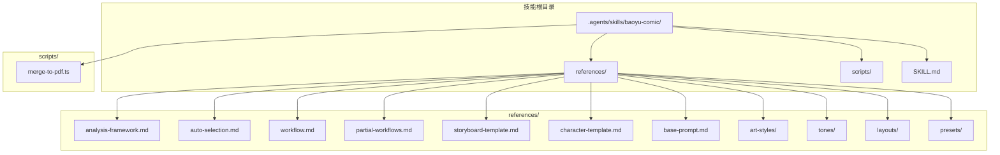
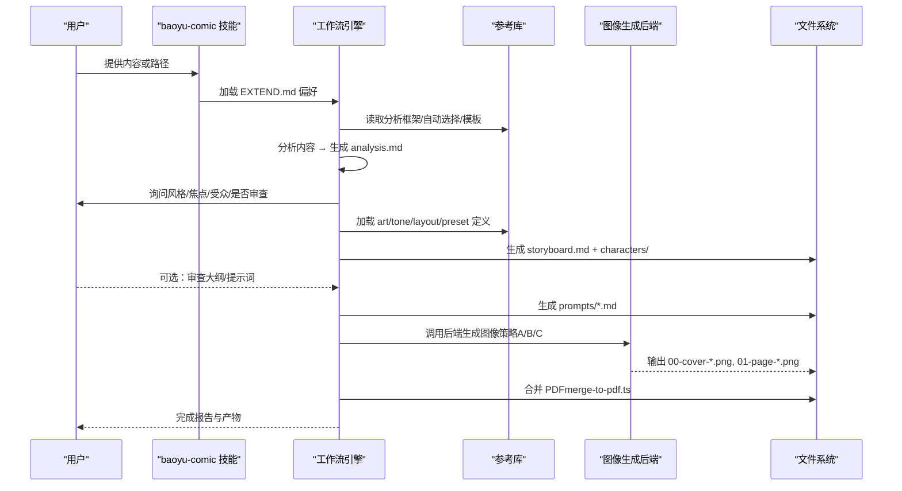
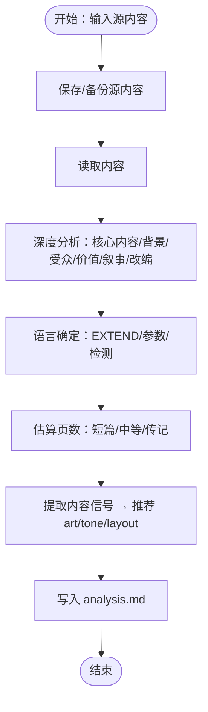
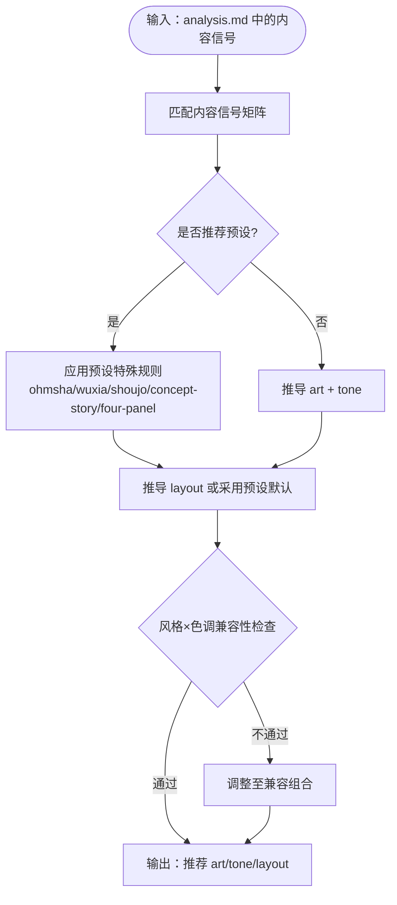
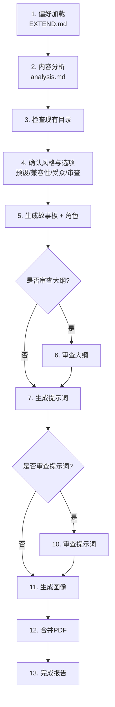
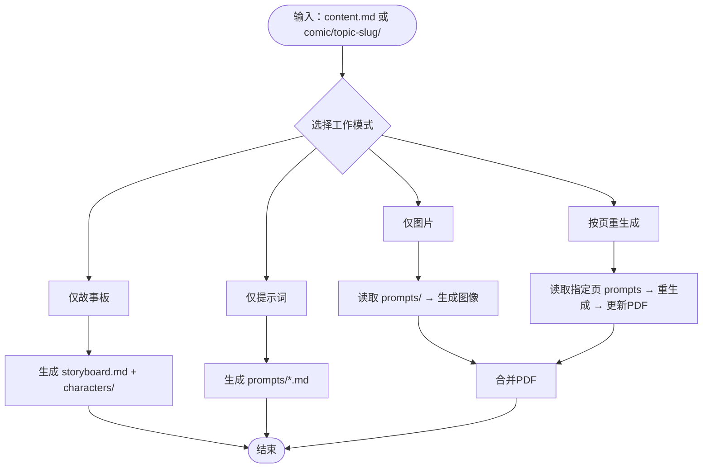
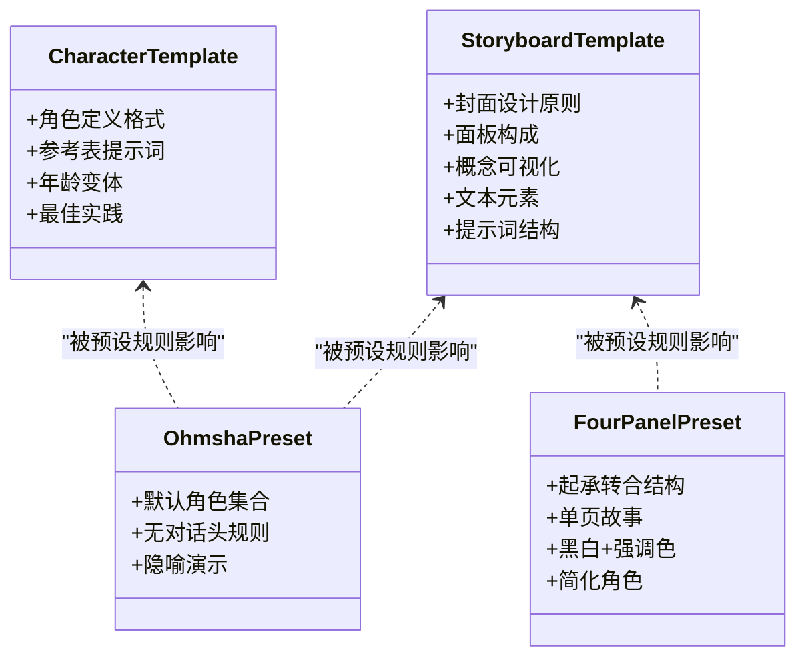
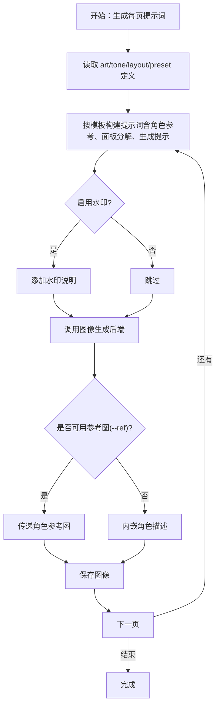
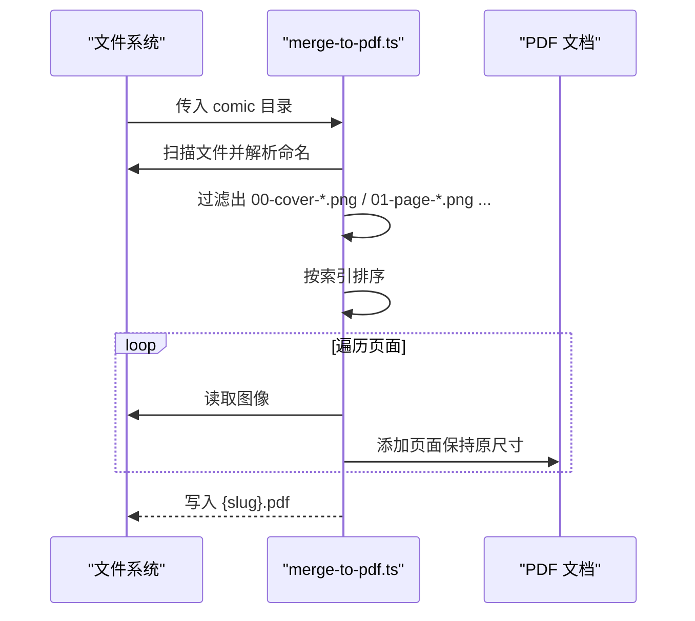
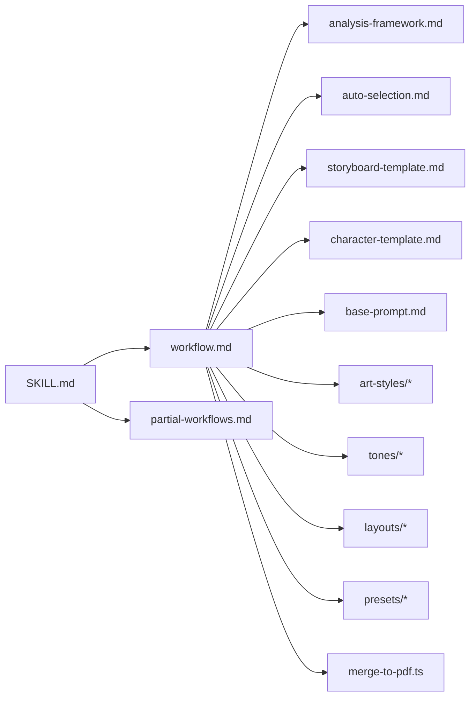

# 工作流程参考

<cite>
**本文引用的文件**
- [analysis-framework.md](file://.agents/skills/baoyu-comic/references/analysis-framework.md)
- [auto-selection.md](file://.agents/skills/baoyu-comic/references/auto-selection.md)
- [workflow.md](file://.agents/skills/baoyu-comic/references/workflow.md)
- [partial-workflows.md](file://.agents/skills/baoyu-comic/references/partial-workflows.md)
- [storyboard-template.md](file://.agents/skills/baoyu-comic/references/storyboard-template.md)
- [character-template.md](file://.agents/skills/baoyu-comic/references/character-template.md)
- [base-prompt.md](file://.agents/skills/baoyu-comic/references/base-prompt.md)
- [manga.md](file://.agents/skills/baoyu-comic/references/art-styles/manga.md)
- [neutral.md](file://.agents/skills/baoyu-comic/references/tones/neutral.md)
- [standard.md](file://.agents/skills/baoyu-comic/references/layouts/standard.md)
- [ohmsha.md](file://.agents/skills/baoyu-comic/references/presets/ohmsha.md)
- [four-panel.md](file://.agents/skills/baoyu-comic/references/presets/four-panel.md)
- [merge-to-pdf.ts](file://.agents/skills/baoyu-comic/scripts/merge-to-pdf.ts)
- [SKILL.md](file://.agents/skills/baoyu-comic/SKILL.md)
</cite>

## 目录
1. [简介](#简介)
2. [项目结构](#项目结构)
3. [核心组件](#核心组件)
4. [架构总览](#架构总览)
5. [详细组件分析](#详细组件分析)
6. [依赖关系分析](#依赖关系分析)
7. [性能与可扩展性](#性能与可扩展性)
8. [故障排查指南](#故障排查指南)
9. [结论](#结论)
10. [附录](#附录)

## 简介
本参考文档面向 baoyu-comic 技能的工作流程，系统化阐述从内容分析到最终成品的完整创作路径。重点包括：
- 内容分析框架：如何将源内容转化为可视觉化的知识漫画
- 自动选择机制：基于内容信号推荐最优艺术风格、色调与版式组合
- 部分工作流程选项：支持仅生成故事板、仅生成提示词、仅生成图片、按页重生成等
- 关键环节详解：故事板生成、角色设计、提示词构建、图像生成与合并为PDF

目标是帮助用户在不同创作阶段灵活掌控流程，同时确保输出质量与一致性。

## 项目结构
baoyu-comic 技能以“参考文档 + 脚本”的方式组织，核心目录如下：
- references：内容分析、自动选择、工作流、模板与样式定义
- scripts：输出处理（如合并PDF）
- SKILL.md：技能接口与运行规则

图表来源
- [SKILL.md:135-152](file://.agents/skills/baoyu-comic/SKILL.md#L135-L152)

章节来源
- [SKILL.md:135-152](file://.agents/skills/baoyu-comic/SKILL.md#L135-L152)

## 核心组件
- 内容分析框架：定义六个维度的深度分析清单，产出 analysis.md，包含元数据、受众、价值主张、主题、人物弧线、内容信号与推荐做法
- 自动选择：依据内容信号矩阵与兼容性矩阵，给出艺术风格、色调与版式的默认组合，并支持预设（ohmsha、wuxia、shoujo、concept-story、four-panel）的特殊规则
- 工作流：完整的九步法，从偏好加载、内容分析、确认风格与选项、生成故事板与角色、审查大纲与提示词、生成图像、合并PDF到完成报告
- 部分工作流程：支持仅生成故事板、仅生成提示词、仅生成图片、按页重生成等，便于迭代与修复
- 模板与规范：故事板模板、角色模板、基础提示词、各风格/色调/版式定义、预设规则
- 输出脚本：merge-to-pdf.ts 将页面图片合并为PDF

章节来源
- [analysis-framework.md:130-177](file://.agents/skills/baoyu-comic/references/analysis-framework.md#L130-L177)
- [auto-selection.md:5-73](file://.agents/skills/baoyu-comic/references/auto-selection.md#L5-L73)
- [workflow.md:5-544](file://.agents/skills/baoyu-comic/references/workflow.md#L5-L544)
- [partial-workflows.md:1-124](file://.agents/skills/baoyu-comic/references/partial-workflows.md#L1-L124)
- [merge-to-pdf.ts:1-117](file://.agents/skills/baoyu-comic/scripts/merge-to-pdf.ts#L1-L117)

## 架构总览
下图展示 baoyu-comic 的端到端工作流，从输入内容到最终PDF输出的关键节点与交互。

图表来源
- [workflow.md:35-544](file://.agents/skills/baoyu-comic/references/workflow.md#L35-L544)
- [merge-to-pdf.ts:69-117](file://.agents/skills/baoyu-comic/scripts/merge-to-pdf.ts#L69-L117)

## 详细组件分析

### 组件A：内容分析框架
- 目标：将源内容转化为可视觉化的知识漫画，明确受众、价值与叙事潜力
- 维度：核心内容、背景与语境、受众分析、价值主张、叙事潜力、改编考虑
- 输出：analysis.md（含 YAML front matter、受众、价值、主题、人物、内容信号、推荐做法）

图表来源
- [analysis-framework.md:88-116](file://.agents/skills/baoyu-comic/references/analysis-framework.md#L88-L116)
- [workflow.md:88-116](file://.agents/skills/baoyu-comic/references/workflow.md#L88-L116)

章节来源
- [analysis-framework.md:5-177](file://.agents/skills/baoyu-comic/references/analysis-framework.md#L5-L177)
- [workflow.md:88-116](file://.agents/skills/baoyu-comic/references/workflow.md#L88-L116)

### 组件B：自动选择算法
- 内容信号矩阵：根据关键词（教程、技术、历史、武侠、浪漫、四格等）映射到艺术风格、色调与版式
- 兼容性矩阵：风格×色调组合的适配建议，避免不协调搭配
- 预设规则：ohmsha、wuxia、shoujo、concept-story、four-panel 的特殊约束与基线
- 优先级：用户指定 > EXTEND 默认 > 内容信号分析 → 自动选择 > 回退到标准组合

图表来源
- [auto-selection.md:5-73](file://.agents/skills/baoyu-comic/references/auto-selection.md#L5-L73)
- [ohmsha.md:5-115](file://.agents/skills/baoyu-comic/references/presets/ohmsha.md#L5-L115)
- [four-panel.md:5-108](file://.agents/skills/baoyu-comic/references/presets/four-panel.md#L5-L108)

章节来源
- [auto-selection.md:5-73](file://.agents/skills/baoyu-comic/references/auto-selection.md#L5-L73)
- [ohmsha.md:5-115](file://.agents/skills/baoyu-comic/references/presets/ohmsha.md#L5-L115)
- [four-panel.md:5-108](file://.agents/skills/baoyu-comic/references/presets/four-panel.md#L5-L108)

### 组件C：完整工作流（九步法）
- 步骤概览：偏好加载 → 内容分析 → 检查现有 → 确认风格与选项 → 生成故事板与角色 → 审查大纲（可选） → 生成提示词 → 审查提示词（可选） → 生成图像 → 合并PDF → 完成报告
- 关键点：
  - 偏好加载：EXTEND.md 优先级与首次设置
  - 确认风格：预设优先、兼容性校验、用户可自定义
  - 故事板与角色：模板化输出，预设注入特殊规则
  - 图像生成：策略A/B/C（参考图、嵌入描述、纯提示），失败回退
  - PDF 合并：按命名规范自动排序合并

图表来源
- [workflow.md:5-544](file://.agents/skills/baoyu-comic/references/workflow.md#L5-L544)

章节来源
- [workflow.md:5-544](file://.agents/skills/baoyu-comic/references/workflow.md#L5-L544)

### 组件D：部分工作流程选项
- 仅生成故事板：跳过提示词与图像，适合快速评审结构
- 仅生成提示词：跳过图像，适合精细调优提示词
- 仅生成图片：从已有 prompts 目录直接生成图像
- 按页重生成：针对特定页码（含封面）进行局部重生成并更新PDF

图表来源
- [partial-workflows.md:7-124](file://.agents/skills/baoyu-comic/references/partial-workflows.md#L7-L124)
- [workflow.md:411-544](file://.agents/skills/baoyu-comic/references/workflow.md#L411-L544)

章节来源
- [partial-workflows.md:1-124](file://.agents/skills/baoyu-comic/references/partial-workflows.md#L1-L124)
- [workflow.md:411-544](file://.agents/skills/baoyu-comic/references/workflow.md#L411-L544)

### 组件E：故事板与角色设计
- 故事板模板：封面设计原则、面板构成、概念可视化技巧、文本元素设计、提示词结构
- 角色模板：角色定义格式、参考表提示词、年龄变体、最佳实践与一致性要点
- 预设注入：ohmsha 默认角色、four-panel 架空角色体系

图表来源
- [storyboard-template.md:1-144](file://.agents/skills/baoyu-comic/references/storyboard-template.md#L1-L144)
- [character-template.md:1-181](file://.agents/skills/baoyu-comic/references/character-template.md#L1-L181)
- [ohmsha.md:42-115](file://.agents/skills/baoyu-comic/references/presets/ohmsha.md#L42-L115)
- [four-panel.md:20-108](file://.agents/skills/baoyu-comic/references/presets/four-panel.md#L20-L108)

章节来源
- [storyboard-template.md:1-144](file://.agents/skills/baoyu-comic/references/storyboard-template.md#L1-L144)
- [character-template.md:1-181](file://.agents/skills/baoyu-comic/references/character-template.md#L1-L181)
- [ohmsha.md:42-115](file://.agents/skills/baoyu-comic/references/presets/ohmsha.md#L42-L115)
- [four-panel.md:20-108](file://.agents/skills/baoyu-comic/references/presets/four-panel.md#L20-L108)

### 组件F：提示词构建与图像生成
- 基础提示词：页面规格、面板结构、文本元素、科学/概念可视化、第四面墙、历史准确性、语言要求
- 风格/色调/版式参考：manga、neutral、standard 等定义
- 图像生成策略：
  - 策略A：使用参考图（--ref）传递角色表
  - 策略B：在提示词中内嵌角色描述
  - 策略C：仅提示词（无参考图）
- 失败回退：压缩/转换参考图 → 重试 → 放弃参考图改用内嵌描述

图表来源
- [base-prompt.md:1-99](file://.agents/skills/baoyu-comic/references/base-prompt.md#L1-L99)
- [manga.md:1-94](file://.agents/skills/baoyu-comic/references/art-styles/manga.md#L1-L94)
- [neutral.md:1-64](file://.agents/skills/baoyu-comic/references/tones/neutral.md#L1-L64)
- [standard.md:1-24](file://.agents/skills/baoyu-comic/references/layouts/standard.md#L1-L24)
- [workflow.md:411-544](file://.agents/skills/baoyu-comic/references/workflow.md#L411-L544)

章节来源
- [base-prompt.md:1-99](file://.agents/skills/baoyu-comic/references/base-prompt.md#L1-L99)
- [manga.md:1-94](file://.agents/skills/baoyu-comic/references/art-styles/manga.md#L1-L94)
- [neutral.md:1-64](file://.agents/skills/baoyu-comic/references/tones/neutral.md#L1-L64)
- [standard.md:1-24](file://.agents/skills/baoyu-comic/references/layouts/standard.md#L1-L24)
- [workflow.md:411-544](file://.agents/skills/baoyu-comic/references/workflow.md#L411-L544)

### 组件G：PDF 合并与输出管理
- 命名规范：00-cover-slug.png、01-page-slug.png 等
- 合并逻辑：扫描目录、解析文件名、按索引排序、嵌入原尺寸页面
- 输出：生成 {topic-slug}.pdf，打印统计信息

图表来源
- [merge-to-pdf.ts:33-117](file://.agents/skills/baoyu-comic/scripts/merge-to-pdf.ts#L33-L117)

章节来源
- [merge-to-pdf.ts:1-117](file://.agents/skills/baoyu-comic/scripts/merge-to-pdf.ts#L1-L117)

## 依赖关系分析
- 技能入口：SKILL.md 定义了选项、脚本位置、文件结构、语言处理与工作流步骤
- 参考库：analysis-framework、auto-selection、workflow、partial-workflows、模板与样式定义
- 脚本：merge-to-pdf.ts 依赖 pdf-lib，按命名规范合并页面
- 预设：ohmsha、four-panel 等预设对故事板与角色有强约束，需在生成前加载

图表来源
- [SKILL.md:259-282](file://.agents/skills/baoyu-comic/SKILL.md#L259-L282)
- [workflow.md:35-544](file://.agents/skills/baoyu-comic/references/workflow.md#L35-L544)

章节来源
- [SKILL.md:259-282](file://.agents/skills/baoyu-comic/SKILL.md#L259-L282)
- [workflow.md:35-544](file://.agents/skills/baoyu-comic/references/workflow.md#L35-L544)

## 性能与可扩展性
- 图像生成耗时：每页约 10–30 秒，受后端与分辨率影响
- 自动重试：生成失败时自动重试一次
- 参考图优化：当后端不支持 --ref 或 payload 过大时，先压缩/降分辨率再重试
- 会话一致性：若后端支持会话ID，统一会话ID可提升跨页一致性
- 可扩展点：新增 art/tone/layout/preset 定义；扩展内容信号矩阵；增加更多预设规则

[本节为通用指导，无需具体文件引用]

## 故障排查指南
- 未找到 EXTEND.md：首次运行会被阻塞，需完成首次设置并保存 EXTEND.md
- 生成失败：
  - 若使用 --ref：先压缩/转换参考图，再重试；仍失败则切换到策略B（内嵌描述）
  - 若后端不支持 --ref：直接走策略C（纯提示词）
- 命名不规范：确保文件名为 NN-{cover|page}-[slug].png，否则 merge-to-pdf.ts 无法识别
- 语言问题：优先级为 --lang > EXTEND.language > 对话语言 > 源内容语言
- 预设冲突：预设包含特殊规则，需遵循其约束（如 ohmsha 无对话头、four-panel 四格结构）

章节来源
- [SKILL.md:243-258](file://.agents/skills/baoyu-comic/SKILL.md#L243-L258)
- [workflow.md:460-496](file://.agents/skills/baoyu-comic/references/workflow.md#L460-L496)
- [merge-to-pdf.ts:33-67](file://.agents/skills/baoyu-comic/scripts/merge-to-pdf.ts#L33-L67)

## 结论
baoyu-comic 通过“内容分析 + 自动选择 + 模板化工作流”的组合，实现了从知识内容到高质量知识漫画的自动化生产。其优势在于：
- 明确的分析框架与自动选择矩阵，确保风格、色调与版式与内容高度契合
- 模块化的部分工作流程，满足不同创作阶段的需求
- 严谨的模板与预设规则，保障角色与画面的一致性
- 清晰的图像生成策略与回退机制，提升成功率与可维护性

建议在实际使用中：
- 先完成 EXTEND.md 配置，明确水印、语言与偏好
- 使用内容分析与自动选择作为起点，结合预设规则快速落地
- 在故事板与提示词阶段多做审查，减少后期重生成成本
- 利用部分工作流程进行局部迭代，提高效率

[本节为总结性内容，无需具体文件引用]

## 附录
- 术语速览：art（艺术风格）、tone（色调）、layout（版式）、preset（预设）、panel（分镜）、prompt（提示词）
- 常用命令示例（路径与参数请以实际环境为准）：
  - 仅生成故事板：/baoyu-comic content.md --storyboard-only
  - 仅生成提示词：/baoyu-comic content.md --prompts-only
  - 仅生成图片：/baoyu-comic comic/topic-slug/ --images-only
  - 按页重生成：/baoyu-comic comic/topic-slug/ --regenerate 3,5

[本节为补充说明，无需具体文件引用]