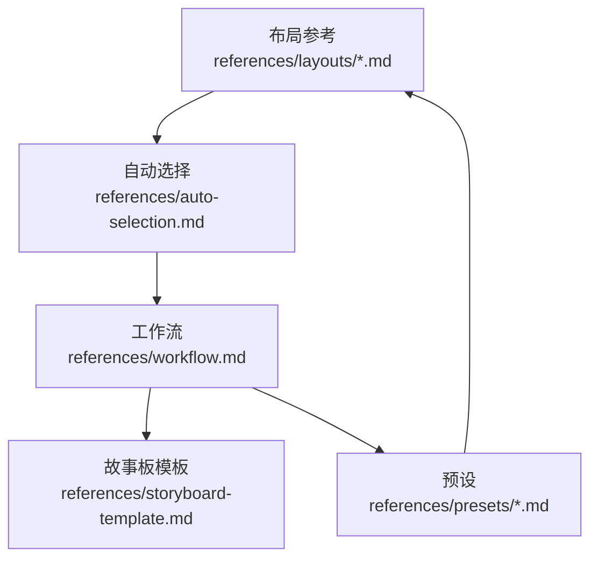
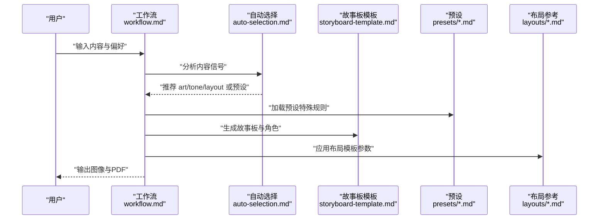
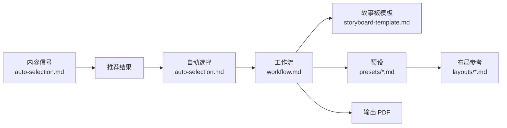

# 布局模板系统

<cite>
**本文引用的文件**
- [standard.md](file://.agents/skills/baoyu-comic/references/layouts/standard.md)
- [cinematic.md](file://.agents/skills/baoyu-comic/references/layouts/cinematic.md)
- [dense.md](file://.agents/skills/baoyu-comic/references/layouts/dense.md)
- [splash.md](file://.agents/skills/baoyu-comic/references/layouts/splash.md)
- [mixed.md](file://.agents/skills/baoyu-comic/references/layouts/mixed.md)
- [webtoon.md](file://.agents/skills/baoyu-comic/references/layouts/webtoon.md)
- [four-panel.md](file://.agents/skills/baoyu-comic/references/layouts/four-panel.md)
- [auto-selection.md](file://.agents/skills/baoyu-comic/references/auto-selection.md)
- [workflow.md](file://.agents/skills/baoyu-comic/references/workflow.md)
- [storyboard-template.md](file://.agents/skills/baoyu-comic/references/storyboard-template.md)
- [four-panel 预设.md](file://.agents/skills/baoyu-comic/references/presets/four-panel.md)
- [ohmsha 预设.md](file://.agents/skills/baoyu-comic/references/presets/ohmsha.md)
- [concept-story 预设.md](file://.agents/skills/baoyu-comic/references/presets/concept-story.md)
- [shoujo 预设.md](file://.agents/skills/baoyu-comic/references/presets/shoujo.md)
</cite>

## 目录
1. [简介](#简介)
2. [项目结构](#项目结构)
3. [核心组件](#核心组件)
4. [架构总览](#架构总览)
5. [详细组件分析](#详细组件分析)
6. [依赖关系分析](#依赖关系分析)
7. [性能考量](#性能考量)
8. [故障排查指南](#故障排查指南)
9. [结论](#结论)
10. [附录](#附录)

## 简介
本文件系统化梳理 baoyu-comic 的“布局模板系统”，围绕七种面板布局模板进行深入解析：standard（标准）、cinematic（电影感）、dense（密集）、splash（满版）、mixed（混合）、webtoon（网络漫画）、four-panel（四格）。文档从视觉特点、叙事节奏、适用内容类型、创作技巧入手，解释布局选择与故事结构的关系，并提供实际应用案例与创作指导，帮助创作者在不同内容需求下选择最优布局方案。

## 项目结构
布局模板系统位于 baoyu-comic 技能包内，核心文件组织如下：
- 布局参考：references/layouts 下的 seven.md 文件，分别描述七种布局的结构、网格配置、阅读流、最佳风格搭配等
- 自动选择：references/auto-selection.md 定义内容信号矩阵、预设推荐规则、兼容性矩阵与优先级顺序
- 工作流：references/workflow.md 提供完整的知识漫画生成流程，包含步骤清单、流程图、关键节点的交互与决策点
- 故事板模板：references/storyboard-template.md 给出故事板文档格式、封面设计原则、分镜规范、文本元素设计等
- 预设：references/presets 下的四个预设（four-panel、ohmsha、concept-story、shoujo）定义了特定艺术风格、语气与布局组合下的特殊规则与质量标记

图表来源
- [auto-selection.md:1-73](file://.agents/skills/baoyu-comic/references/auto-selection.md#L1-L73)
- [workflow.md:1-544](file://.agents/skills/baoyu-comic/references/workflow.md#L1-L544)
- [storyboard-template.md:1-144](file://.agents/skills/baoyu-comic/references/storyboard-template.md#L1-L144)

章节来源
- [workflow.md:1-544](file://.agents/skills/baoyu-comic/references/workflow.md#L1-L544)

## 核心组件
- 布局参考（七种模板）
  - standard：经典网格，适合叙述流畅与对话场景
  - cinematic：横向强调，宽画幅，适合建立镜头感与宏大场景
  - dense：信息密集，紧凑网格，适合技术讲解与复杂时间线
  - splash：冲击力导向，关键时刻突出，适合转折与开篇
  - mixed：节奏多变，强调动态与变化
  - webtoon：竖版滚动，适合移动端阅读与教程类内容
  - four-panel：严格 2×2 四格，单页故事，适合商业寓言与短洞察
- 自动选择：基于内容信号矩阵自动推荐 art/tone/layout 或预设，并给出兼容性矩阵与优先级
- 工作流：从偏好加载、内容分析、确认风格到生成故事板、提示词、图像、合并 PDF 的完整流程
- 故事板模板：统一的故事板文档格式、封面设计原则、分镜规范与文本元素设计
- 预设：四个预设在 art/tone/layout 基础上附加特殊规则，确保风格一致性与质量

章节来源
- [standard.md:1-24](file://.agents/skills/baoyu-comic/references/layouts/standard.md#L1-L24)
- [cinematic.md:1-24](file://.agents/skills/baoyu-comic/references/layouts/cinematic.md#L1-L24)
- [dense.md:1-24](file://.agents/skills/baoyu-comic/references/layouts/dense.md#L1-L24)
- [splash.md:1-24](file://.agents/skills/baoyu-comic/references/layouts/splash.md#L1-L24)
- [mixed.md:1-24](file://.agents/skills/baoyu-comic/references/layouts/mixed.md#L1-L24)
- [webtoon.md:1-31](file://.agents/skills/baoyu-comic/references/layouts/webtoon.md#L1-L31)
- [four-panel.md:1-41](file://.agents/skills/baoyu-comic/references/layouts/four-panel.md#L1-L41)
- [auto-selection.md:1-73](file://.agents/skills/baoyu-comic/references/auto-selection.md#L1-L73)
- [workflow.md:1-544](file://.agents/skills/baoyu-comic/references/workflow.md#L1-L544)
- [storyboard-template.md:1-144](file://.agents/skills/baoyu-comic/references/storyboard-template.md#L1-L144)
- [four-panel 预设.md:1-108](file://.agents/skills/baoyu-comic/references/presets/four-panel.md#L1-L108)
- [ohmsha 预设.md:1-115](file://.agents/skills/baoyu-comic/references/presets/ohmsha.md#L1-L115)
- [concept-story 预设.md:1-122](file://.agents/skills/baoyu-comic/references/presets/concept-story.md#L1-L122)
- [shoujo 预设.md:1-117](file://.agents/skills/baoyu-comic/references/presets/shoujo.md#L1-L117)

## 架构总览
下图展示从内容分析到最终输出 PDF 的整体流程，以及布局模板与自动选择、预设之间的关系：

图表来源
- [workflow.md:1-544](file://.agents/skills/baoyu-comic/references/workflow.md#L1-L544)
- [auto-selection.md:1-73](file://.agents/skills/baoyu-comic/references/auto-selection.md#L1-L73)
- [storyboard-template.md:1-144](file://.agents/skills/baoyu-comic/references/storyboard-template.md#L1-L144)
- [four-panel 预设.md:1-108](file://.agents/skills/baoyu-comic/references/presets/four-panel.md#L1-L108)
- [ohmsha 预设.md:1-115](file://.agents/skills/baoyu-comic/references/presets/ohmsha.md#L1-L115)
- [concept-story 预设.md:1-122](file://.agents/skills/baoyu-comic/references/presets/concept-story.md#L1-L122)
- [shoujo 预设.md:1-117](file://.agents/skills/baoyu-comic/references/presets/shoujo.md#L1-L117)

## 详细组件分析

### standard（标准）
- 视觉特点：常规网格，偶有变化；一致留白（8-10px）
- 叙事节奏：Z 字形阅读流，左→右、上→下
- 适用内容类型：叙述流畅、对话场景
- 创作技巧：保持面板大小相对均衡，通过留白引导视线；在需要强调时可局部调整比例
- 与故事结构关系：适配线性叙述与日常情节推进，便于读者建立稳定的阅读预期

章节来源
- [standard.md:1-24](file://.agents/skills/baoyu-comic/references/layouts/standard.md#L1-L24)

### cinematic（电影感）
- 视觉特点：横向强调，宽画幅（3:1、4:1），留白较大（12-15px）
- 叙事节奏：横向扫视，电影式节奏
- 适用内容类型：开场镜头、戏剧性时刻、风景与大场景
- 创作技巧：利用宽画幅营造空间感与张力；在关键时刻使用全页或半页以强化冲击
- 与故事结构关系：适合用作章节开篇或转折前的铺垫，建立宏观视角

章节来源
- [cinematic.md:1-24](file://.agents/skills/baoyu-comic/references/layouts/cinematic.md#L1-L24)

### dense（密集）
- 视觉特点：紧凑网格（3×3），小而均匀的面板；留白紧致（4-6px）
- 叙事节奏：快速推进，信息密度高
- 适用内容类型：技术解释、复杂叙事、时间线
- 创作技巧：控制细节量，避免信息过载；通过重复元素与符号增强可读性
- 与故事结构关系：适合知识密集型内容，通过节奏控制平衡理解与阅读负担

章节来源
- [dense.md:1-24](file://.agents/skills/baoyu-comic/references/layouts/dense.md#L1-L24)

### splash（满版）
- 视觉特点：1-2 个大面板 + 2-3 个小面板；留白用于强调
- 叙事节奏：大面板主导，小面板辅助
- 适用内容类型：揭示、突破、章节开篇
- 创作技巧：大面板承载情绪与信息峰值，小面板补充背景或过渡
- 与故事结构关系：作为转折点或高潮的视觉锚点，引导读者注意力

章节来源
- [splash.md:1-24](file://.agents/skills/baoyu-comic/references/layouts/splash.md#L1-L24)

### mixed（混合）
- 视觉特点：刻意变化的网格，尺寸与留白动态变化
- 叙事节奏：多变节奏，引导视线在页面中游走
- 适用内容类型：动作序列、情感弧线、复杂故事
- 创作技巧：通过不规则布局制造动感与紧张感；注意不要破坏阅读连贯性
- 与故事结构关系：适合非线性或情绪波动较大的段落

章节来源
- [mixed.md:1-24](file://.agents/skills/baoyu-comic/references/layouts/mixed.md#L1-L24)

### webtoon（网络漫画）
- 视觉特点：单列垂直堆叠（3-5 个），留白较大（20-40px），可横向出血；强调连续滚动
- 叙事节奏：自上而下连续滚动
- 适用内容类型：教程、移动端阅读、分步指南
- 创作技巧：善用“浮动”元素与留白；近景与远景交替，配合节奏停顿
- 与故事结构关系：适合长篇教程与连续性较强的内容

章节来源
- [webtoon.md:1-31](file://.agents/skills/baoyu-comic/references/layouts/webtoon.md#L1-L31)

### four-panel（四格）
- 视觉特点：严格 2×2 等大网格，Z 字形阅读流；建议 4:3 横版
- 叙事结构：起承转合（Setup → Development → Turn → Conclusion）
- 适用内容类型：商业寓言、短洞察、社交媒体漫画、寓言、单概念解释
- 创作技巧：严格控制在 4 个面板内；第三面板必须有“转”的爆发点；黑白线条 + 1-2 种强调色
- 与故事结构关系：四格天然契合“起承转合”，适合单页完整表达一个观点或故事弧

章节来源
- [four-panel.md:1-41](file://.agents/skills/baoyu-comic/references/layouts/four-panel.md#L1-L41)
- [four-panel 预设.md:1-108](file://.agents/skills/baoyu-comic/references/presets/four-panel.md#L1-L108)

### 预设与布局的协同
- four-panel 预设：强制 2×2 四格、单页故事、黑白主色 + 强调色、简化角色、无旁白框
- ohmsha 预设：教育漫画 + 视觉隐喻 + 无“讲授头”规则 + 默认哆啦A梦角色体系
- concept-story 预设：将抽象概念可视化为可重复出现的视觉符号，结合对话语境
- shoujo 预设：浪漫美学 + 装饰元素 + 眼部细节 + 色彩与屏色调性

章节来源
- [four-panel 预设.md:1-108](file://.agents/skills/baoyu-comic/references/presets/four-panel.md#L1-L108)
- [ohmsha 预设.md:1-115](file://.agents/skills/baoyu-comic/references/presets/ohmsha.md#L1-L115)
- [concept-story 预设.md:1-122](file://.agents/skills/baoyu-comic/references/presets/concept-story.md#L1-L122)
- [shoujo 预设.md:1-117](file://.agents/skills/baoyu-comic/references/presets/shoujo.md#L1-L117)

## 依赖关系分析
- 内容信号驱动自动选择：根据内容类型（如教程、技术、心理、业务等）推荐 art/tone/layout 或预设
- 预设扩展布局：预设在基础 art/tone/layout 上增加特殊规则，影响故事板与提示词生成
- 工作流贯穿：从偏好加载、内容分析、确认风格、生成故事板、提示词、图像到合并 PDF 的完整链路

图表来源
- [auto-selection.md:1-73](file://.agents/skills/baoyu-comic/references/auto-selection.md#L1-L73)
- [workflow.md:1-544](file://.agents/skills/baoyu-comic/references/workflow.md#L1-L544)
- [storyboard-template.md:1-144](file://.agents/skills/baoyu-comic/references/storyboard-template.md#L1-L144)
- [four-panel 预设.md:1-108](file://.agents/skills/baoyu-comic/references/presets/four-panel.md#L1-L108)
- [ohmsha 预设.md:1-115](file://.agents/skills/baoyu-comic/references/presets/ohmsha.md#L1-L115)
- [concept-story 预设.md:1-122](file://.agents/skills/baoyu-comic/references/presets/concept-story.md#L1-L122)
- [shoujo 预设.md:1-117](file://.agents/skills/baoyu-comic/references/presets/shoujo.md#L1-L117)

章节来源
- [auto-selection.md:1-73](file://.agents/skills/baoyu-comic/references/auto-selection.md#L1-L73)
- [workflow.md:1-544](file://.agents/skills/baoyu-comic/references/workflow.md#L1-L544)

## 性能考量
- 图像生成策略：根据图像生成技能是否支持参考图（如 --ref）选择策略 A/B/C，减少重复描述带来的 API 负载
- 参考图压缩：在支持 --ref 的情况下，优先使用压缩后的参考图以降低传输与处理成本
- 会话一致性：若技能支持会话 ID，统一会话可提升跨页视觉一致性，减少迭代次数

章节来源
- [workflow.md:411-503](file://.agents/skills/baoyu-comic/references/workflow.md#L411-L503)

## 故障排查指南
- 自动选择未命中：检查内容信号是否明确；必要时手动指定 art/tone/layout 或预设
- 预设冲突：确认预设特殊规则与目标内容是否匹配；必要时切换到基础 art/tone/layout
- 分镜与布局不一致：核对 storyboarding 是否遵循所选布局的网格与阅读流；必要时回退到 standard 或 cinematic
- 图像生成失败：尝试策略 B（嵌入角色描述）或策略 C（纯提示词）；检查参考图压缩与尺寸
- 输出 PDF 缺失：确认所有页面已生成且命名符合规范（NN-cover/page-slug.png）

章节来源
- [workflow.md:151-250](file://.agents/skills/baoyu-comic/references/workflow.md#L151-L250)
- [workflow.md:411-503](file://.agents/skills/baoyu-comic/references/workflow.md#L411-L503)
- [storyboard-template.md:1-144](file://.agents/skills/baoyu-comic/references/storyboard-template.md#L1-L144)

## 结论
七种布局模板各有侧重：standard 适合常规叙述，cinematic 适合建立镜头感，dense 适合信息密集内容，splash 适合关键转折，mixed 适合节奏变化，webtoon 适合移动端教程，four-panel 适合单页短故事。结合自动选择与预设，可在不同内容类型与目标受众下实现高效、一致且富有表现力的视觉叙事。

## 附录

### 布局选择与故事结构关系速查
- 线性叙述：standard、webtoon
- 开场与宏大场景：cinematic
- 技术讲解与复杂时间线：dense
- 转折与高潮：splash
- 动作与情感波动：mixed
- 单页短洞察与商业寓言：four-panel

章节来源
- [standard.md:1-24](file://.agents/skills/baoyu-comic/references/layouts/standard.md#L1-L24)
- [cinematic.md:1-24](file://.agents/skills/baoyu-comic/references/layouts/cinematic.md#L1-L24)
- [dense.md:1-24](file://.agents/skills/baoyu-comic/references/layouts/dense.md#L1-L24)
- [splash.md:1-24](file://.agents/skills/baoyu-comic/references/layouts/splash.md#L1-L24)
- [mixed.md:1-24](file://.agents/skills/baoyu-comic/references/layouts/mixed.md#L1-L24)
- [webtoon.md:1-31](file://.agents/skills/baoyu-comic/references/layouts/webtoon.md#L1-L31)
- [four-panel.md:1-41](file://.agents/skills/baoyu-comic/references/layouts/four-panel.md#L1-L41)

### 实际应用案例与创作指导
- 教育类教程（含技术解释）：优先考虑 dense 或 webtoon；若为单页短洞察，four-panel 更合适
- 心理学/管理学概念：concept-story 预设 + standard，结合视觉符号系统
- 浪漫/校园故事：shoujo 预设 + standard，强调装饰与情感节奏
- 武侠/玄幻动作：ohmsha 预设 + splash 或 mixed，强调视觉隐喻与动作节奏
- 商业寓言/短洞察：four-panel 预设，严格遵循“起承转合”，强调第三面板的爆发点

章节来源
- [auto-selection.md:1-73](file://.agents/skills/baoyu-comic/references/auto-selection.md#L1-L73)
- [four-panel 预设.md:1-108](file://.agents/skills/baoyu-comic/references/presets/four-panel.md#L1-L108)
- [concept-story 预设.md:1-122](file://.agents/skills/baoyu-comic/references/presets/concept-story.md#L1-L122)
- [shoujo 预设.md:1-117](file://.agents/skills/baoyu-comic/references/presets/shoujo.md#L1-L117)
- [ohmsha 预设.md:1-115](file://.agents/skills/baoyu-comic/references/presets/ohmsha.md#L1-L115)