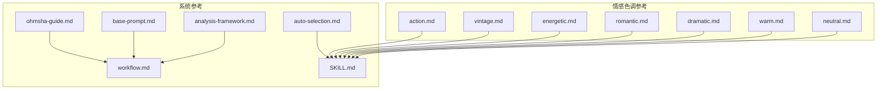
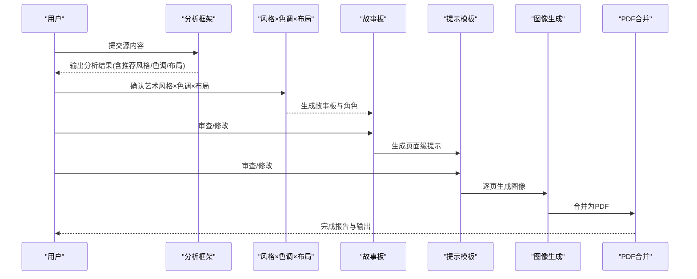
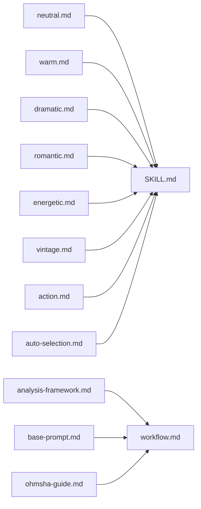

# 情感色调系统

<cite>
**本文档引用的文件**
- [neutral.md](file://.agents/skills/baoyu-comic/references/tones/neutral.md)
- [warm.md](file://.agents/skills/baoyu-comic/references/tones/warm.md)
- [dramatic.md](file://.agents/skills/baoyu-comic/references/tones/dramatic.md)
- [romantic.md](file://.agents/skills/baoyu-comic/references/tones/romantic.md)
- [energetic.md](file://.agents/skills/baoyu-comic/references/tones/energetic.md)
- [vintage.md](file://.agents/skills/baoyu-comic/references/tones/vintage.md)
- [action.md](file://.agents/skills/baoyu-comic/references/tones/action.md)
- [auto-selection.md](file://.agents/skills/baoyu-comic/references/auto-selection.md)
- [analysis-framework.md](file://.agents/skills/baoyu-comic/references/analysis-framework.md)
- [base-prompt.md](file://.agents/skills/baoyu-comic/references/base-prompt.md)
- [SKILL.md](file://.agents/skills/baoyu-comic/SKILL.md)
- [ohmsha-guide.md](file://.agents/skills/baoyu-comic/references/ohmsha-guide.md)
- [workflow.md](file://.agents/skills/baoyu-comic/references/workflow.md)
</cite>

## 目录
1. [简介](#简介)
2. [项目结构](#项目结构)
3. [核心组件](#核心组件)
4. [架构总览](#架构总览)
5. [详细组件分析](#详细组件分析)
6. [依赖关系分析](#依赖关系分析)
7. [性能考量](#性能考量)
8. [故障排除指南](#故障排除指南)
9. [结论](#结论)
10. [附录](#附录)

## 简介
本文件系统化梳理 baoyu-comic 情感色调系统，围绕七种情感色调（neutral 中性、warm 温馨、dramatic 戏剧性、romantic 浪漫、energetic 活力、vintage 复古、action 动作）进行深入解析。内容涵盖每种色调的情感表达效果、视觉元素、色彩运用与氛围营造技巧，并结合自动选择矩阵与创作工作流，帮助创作者基于故事内容与目标受众做出合适的色调选择，实现高效、一致且富有表现力的视觉叙事。

## 项目结构
baoyu-comic 将“艺术风格 × 情感色调 × 布局”作为可组合的创作维度，情感色调位于“风格组合”的第二维，与艺术风格共同决定画面的情绪基调与视觉语言。色调定义文件位于 references/tones 下，配套有自动选择矩阵、分析框架、基础提示模板与完整工作流。

图表来源
- [SKILL.md:102-118](file://.agents/skills/baoyu-comic/SKILL.md#L102-L118)
- [auto-selection.md:1-73](file://.agents/skills/baoyu-comic/references/auto-selection.md#L1-L73)
- [analysis-framework.md:1-177](file://.agents/skills/baoyu-comic/references/analysis-framework.md#L1-L177)
- [base-prompt.md:1-99](file://.agents/skills/baoyu-comic/references/base-prompt.md#L1-L99)
- [workflow.md:1-544](file://.agents/skills/baoyu-comic/references/workflow.md#L1-L544)

章节来源
- [SKILL.md:102-118](file://.agents/skills/baoyu-comic/SKILL.md#L102-L118)
- [auto-selection.md:1-73](file://.agents/skills/baoyu-comic/references/auto-selection.md#L1-L73)
- [analysis-framework.md:1-177](file://.agents/skills/baoyu-comic/references/analysis-framework.md#L1-L177)
- [base-prompt.md:1-99](file://.agents/skills/baoyu-comic/references/base-prompt.md#L1-L99)
- [workflow.md:1-544](file://.agents/skills/baoyu-comic/references/workflow.md#L1-L544)

## 核心组件
- 情感色调参考：每种色调提供“概述、情绪特征、色彩调整、光照、情感范围、构图、最佳适用场景、搭配建议/避免搭配”等维度，形成可执行的视觉规范。
- 自动选择矩阵：依据内容信号（如教程、技术、个人故事、冲突、武术等）推荐艺术风格、色调与布局的组合或预设。
- 分析框架：用于将源内容转化为具备视觉潜力的故事，明确主题、角色弧光、关键时刻与价值主张，指导色调选择。
- 基础提示模板：统一页面尺寸、分镜结构、文本元素、科学概念可视化方法等，确保生成一致性。
- 工作流：从偏好加载、内容分析、确认风格与选项、生成故事板与角色、审查、生成提示、图像生成、合并PDF到完成报告的全流程。

章节来源
- [SKILL.md:102-118](file://.agents/skills/baoyu-comic/SKILL.md#L102-L118)
- [auto-selection.md:1-73](file://.agents/skills/baoyu-comic/references/auto-selection.md#L1-L73)
- [analysis-framework.md:1-177](file://.agents/skills/baoyu-comic/references/analysis-framework.md#L1-L177)
- [base-prompt.md:1-99](file://.agents/skills/baoyu-comic/references/base-prompt.md#L1-L99)
- [workflow.md:1-544](file://.agents/skills/baoyu-comic/references/workflow.md#L1-L544)

## 架构总览
下图展示 baoyu-comic 在“内容分析 → 风格×色调×布局选择 → 故事板 → 提示 → 图像生成 → 合并PDF”的整体流程，其中情感色调作为“风格组合”的关键参数参与决策与落地。

图表来源
- [analysis-framework.md:130-157](file://.agents/skills/baoyu-comic/references/analysis-framework.md#L130-L157)
- [workflow.md:88-115](file://.agents/skills/baoyu-comic/references/workflow.md#L88-L115)
- [workflow.md:253-292](file://.agents/skills/baoyu-comic/references/workflow.md#L253-L292)
- [workflow.md:329-373](file://.agents/skills/baoyu-comic/references/workflow.md#L329-L373)
- [workflow.md:411-497](file://.agents/skills/baoyu-comic/references/workflow.md#L411-L497)
- [workflow.md:506-515](file://.agents/skills/baoyu-comic/references/workflow.md#L506-L515)

## 详细组件分析

### neutral（中性）
- 情绪特征：平衡、理性、教育导向；客观叙述，专业但亲和。
- 色彩调整：标准饱和度、均衡对比、中性温度、略明亮亮度。
- 光照：均匀清晰、少戏剧阴影、面板内一致、自然光源、无极端对比。
- 情感范围：温和微笑、沉思表情、轻微睁大眼睛、轻微皱眉。
- 构图：平衡分镜、清晰焦点、可读层次、标准框构、功能性构图。
- 最佳适用：教育内容、技术教程、传记类、纪录片式、专业话题。
- 使用要点：默认色调，适合与任意艺术风格组合，最通用。

章节来源
- [neutral.md:1-64](file://.agents/skills/baoyu-comic/references/tones/neutral.md#L1-L64)

### warm（温馨）
- 情绪特征：怀旧、私密、慰藉；通过舒适美学与温暖视觉建立情感连接。
- 色彩调整：略降饱和、柔和对比、暖色偏移(+15%)、柔和金调亮度。
- 色温转移：冷蓝→柔海绿、纯白→乳酪白、灰→暖灰、黑→柔炭黑。
- 强调色：金色黄、软橙、暖棕、日落色调。
- 光照：黄金时刻、柔和散射光、室内暖光、蜡烛/油灯、轻柔阴影。
- 情感范围：真诚暖笑、温和忧郁、柔软爱意、遥远回忆凝视。
- 构图：亲密框构、舒适环境、柔焦背景、欢迎空间、突出个人时刻。
- 视觉元素：暖光束、柔边、怀旧物件（老照片、纪念品）、舒适物（毯子、茶杯）、自然元素（秋叶、夕阳）。
- 最佳适用：个人故事、童年记忆、导师叙事、家族史、温和传记、疗愈旅程。
- 搭配建议：ligne-claire（欧洲怀旧漫画）、realistic（动人人文故事）、manga（日常温暖）、chalk（怀旧教育）。

章节来源
- [warm.md:1-95](file://.agents/skills/baoyu-comic/references/tones/warm.md#L1-L95)

### dramatic（戏剧性）
- 情绪特征：紧张强度、关键转折、冲突与解决、突破性发现、情感高潮。
- 色彩调整：高饱和（鲜艳或深邃）、最大对比、温度依效果变化、强高光深阴影。
- 对比策略：明暗强分界、少中间调、尖锐构图、剪影潜力、轮廓光。
- 强调色：深蓝、绯红、纯白、重黑、每景限制调色板。
- 光照：戏剧单光源、高对比阴影、人物轮廓光、聚光灯、明暗对照影响。
- 情感范围：愤怒（五官强化）、坚定（专注目光）、震惊（睁大双眼、强光）、胜利（强大抬姿态）。
- 构图：角度动态、戏剧性视角、低/高视点、对角构图、负空间强调。
- 视觉元素：动感线条、冲击特效、戏剧背景（风暴、火焰）、剪影、光爆、环境戏剧。
- 最佳适用：关键发现、冲突场景、高潮时刻、突破性顿悟、情感对峙、历史转折点。
- 搭配建议：realistic（强力戏剧）、ink-brush（武打高潮）、ligne-claire（历史转折）、manga（少年战斗）。
- 避免搭配：chalk（风格不匹配）。

章节来源
- [dramatic.md:1-96](file://.agents/skills/baoyu-comic/references/tones/dramatic.md#L1-L96)

### romantic（浪漫）
- 情绪特征：爱情与爱意、美与优雅、情感细腻、梦想与希望、青春与理想主义。
- 色彩调整：柔和粉彩、低至柔和对比、略暖粉色温度、柔和发光亮度。
- 浪漫调色板：主色粉、次色薰衣草、强调色玫瑰、高光珍珠白、金闪、肌肤象牙白、腮红、背景柔奶油。
- 光照：柔和散射光、发光效果、背光光晕、闪亮点、梦幻氛围。
- 装饰元素：飘浮花瓣、闪亮点、气泡、羽毛、星光、爱心、光晕。
- 情感范围：爱意（柔和凝视、泛红）、思念（美丽忧郁远望）、喜悦（灿烂笑容、闪亮点）、害羞（垂眼、泛红）。
- 构图：优雅流动构图、柔焦背景、装饰框构人物、美丽角度（3/4侧面）、屏风渐变。
- 最佳适用：浪漫故事、成长故事、友谊叙事、情感剧、校园生活、美好时刻。
- 搭配建议：manga（经典少女风格）。
- 避免搭配：realistic、ink-brush、ligne-claire、chalk（风格不匹配）。

章节来源
- [romantic.md:1-101](file://.agents/skills/baoyu-comic/references/tones/romantic.md#L1-L101)

### energetic（活力）
- 情绪特征：兴奋与惊奇、发现与学习、能量与热情、运动与行动、青春朝气。
- 色彩调整：高饱和（鲜艳）、中高对比、可变、响亮温度、明亮干净。
- 活力调色板：主红、主黄、主蓝、强调色洋红与柠檬绿、纯白背景、明亮粉彩。
- 光照：明亮清晰、干净阴影、高能量、强调聚光、动态光源。
- 动能元素：动感线条、闪亮点、爆发特效、运动模糊、星爆、汗珠。
- 情感范围：兴奋（睁大眼、大笑）、惊讶（戏剧反应）、坚定（专注凝视）、惊叹（闪烁目光）。
- 构图：动态角度、动作导向构图、强调运动、简洁有力设计、能量流向。
- 视觉风格：表情丰富、动画化角色、大眼大反应、动态姿势、简化背景突出能量。
- 最佳适用：科学解释、顿悟时刻、年轻受众内容、发现叙事、学习冒险、动作教程。
- 搭配建议：manga（少年能量）、chalk（趣味教育）。
- 避免搭配：realistic、ink-brush（风格不匹配）。

章节来源
- [energetic.md:1-106](file://.agents/skills/baoyu-comic/references/tones/energetic.md#L1-L106)

### vintage（复古）
- 情绪特征：历史真实性、时代距离、档案质感、时间与记忆、古典优雅。
- 色彩调整：降低饱和、柔和陈旧对比、棕褐色偏移、略褪色亮度。
- 陈旧调色板：主棕褐色、陈旧纸张、淡青、暗 burgundy、陈旧黑、发黄。
- 视觉效果：纸张老化、褪色边缘、尘埃、泛黄、磨损痕迹（角落/边缘细节）。
- 时代元素：历史字体、时代准确细节、档案呈现、古典构图、正式框构。
- 光照：自然、时代相符、油灯/蜡烛暖光、柔和散射光、摄影质感。
- 情感范围：尊严（正式稳重）、哀伤（克制优雅）、骄傲（古典姿态）、智慧（岁月优雅）。
- 构图：古典框构、正式构图、时代恰当布置、纪录片风格、历史准确性优先。
- 最佳适用：1950年前后故事、古典科学史、历史传记、时代剧、纪录片漫画、档案叙事。
- 搭配建议：realistic（时代剧）、ligne-claire（历史冒险）、ink-brush（古典亚洲故事）。
- 避免搭配：manga（风格不匹配）、chalk（现代教育风格不匹配）。

章节来源
- [vintage.md:1-105](file://.agents/skills/baoyu-comic/references/tones/vintage.md#L1-L105)

### action（动作）
- 情绪特征：速度与动感、力量与冲击、战斗强度、身体能量、强烈兴奋。
- 色彩调整：高对比、最大对比、按效果可变温度、动态明暗范围。
- 动作特效：动感线条、冲击波、震荡波、飞溅碎片、尘雾、运动模糊、残影。
- 特殊效果：能量攻击（发光辐射）、物理冲击（辐射线与碎屑）、运动（动感线条与模糊）、氛围（粒子与风）。
- 效果颜色：能量光（蓝）、火焰/力量（金）、冲击（白爆）、血/强度（深红）。
- 光照：动态变化、冲击闪光、能量发光源、人物轮廓光、戏剧性对比。
- 情感范围：坚定（凶狠专注）、愤怒（强烈有力）、胜利（获胜姿态）、挣扎（用力努力）。
- 构图：动态角度、极端视角、分镜突破、非对称设计、冲击焦点框构。
- 姿态要点：动态战士姿态、重量与动量可见、肌肉紧张表现、运动流捕捉、冲击点强调。
- 最佳适用：武术战斗、动作序列、体育时刻、身体挑战、战斗场景、高潮对决。
- 搭配建议：ink-brush（武侠战斗）、manga（少年战斗）。
- 避免搭配：chalk（风格不匹配）、ligne-claire（静态不匹配）。

章节来源
- [action.md:1-111](file://.agents/skills/baoyu-comic/references/tones/action.md#L1-L111)

### 组合与兼容性
- 艺术风格 × 情感色调 × 布局 可自由组合，但存在“最佳组合”与“避免组合”。例如：
  - ligne-claire：neutral、warm（最佳）；dramatic、vintage、energetic（可）；romantic、action（避免）
  - manga：neutral、romantic、energetic、action（最佳）；warm、dramatic（可）；vintage（避免）
  - realistic：neutral、warm、dramatic、vintage（可）；action（可）；romantic、energetic（避免）
  - ink-brush：neutral、dramatic、action、vintage（可）；warm（可）；romantic、energetic（避免）
  - chalk：neutral、warm、energetic（可）；vintage（可）；dramatic、action、romantic（避免）
  - minimalist：neutral（可）；warm、energetic（可）；dramatic、vintage、romantic、action（避免）

章节来源
- [auto-selection.md:52-65](file://.agents/skills/baoyu-comic/references/auto-selection.md#L52-L65)

### 内容信号 → 自动选择矩阵
- 教程/入门：manga + neutral + webtoon（推荐 ohmsha 预设）
- 计算机/人工智能/编程：manga + neutral + dense（推荐 ohmsha 预设）
- 技术解释/教育：manga + neutral + webtoon（推荐 ohmsha 预设）
- 1950年前/古典/古代：realistic + vintage + cinematic
- 个人故事/导师：ligne-claire + warm + standard
- 心理学/动机/自我提升/教练：manga + warm + standard（推荐 concept-story 预设）
- 商业叙事/管理/领导：manga + warm + standard（推荐 concept-story 预设）
- 冲突/突破：继承（风格）+ dramatic + splash
- 酒/美食/生活方式：realistic + neutral + cinematic
- 武术/武侠/修仙：ink-brush + action + splash（推荐 wuxia 预设）
- 浪漫/爱情/校园：manga + romantic + standard（推荐 shoujo 预设）
- 商业寓言/寓言/短洞察/四格：minimalist + neutral + four-panel（推荐 four-panel 预设）
- 传记/平衡：ligne-claire + neutral + mixed

章节来源
- [auto-selection.md:7-22](file://.agents/skills/baoyu-comic/references/auto-selection.md#L7-L22)

### 创作实践与应用建议
- 基于分析框架确定核心信息、关键概念、内容结构、证据与示例、来源背景、潜在假设、受众需求、读者问题、知识/情感/实用价值、故事弧候选、角色潜力、视觉机会、戏剧性时刻。
- 使用自动选择矩阵快速得到 art × tone × layout 的初始组合或预设，再结合具体风格兼容性进行微调。
- 在基础提示模板约束下，确保页面尺寸、分镜边界、文本气泡/旁述/思想气泡/标题栏、手写字体层级、科学概念可视化、第四面墙角色处理、历史准确性与语言要求。
- 通过工作流的“审查”环节，在生成图像前对故事板与提示进行二次把关，保证节奏与一致性。

章节来源
- [analysis-framework.md:13-177](file://.agents/skills/baoyu-comic/references/analysis-framework.md#L13-L177)
- [base-prompt.md:3-99](file://.agents/skills/baoyu-comic/references/base-prompt.md#L3-L99)
- [workflow.md:151-250](file://.agents/skills/baoyu-comic/references/workflow.md#L151-L250)

## 依赖关系分析
- tone 定义文件（neutral/warm/dramatic/romantic/energetic/vintage/action）是风格×色调组合的基础输入。
- auto-selection 依赖 content signals 与兼容矩阵，输出 art × tone × layout 或预设。
- workflow 依赖 analysis-framework 产出的分析结果，驱动风格确认与后续步骤。
- base-prompt 为图像生成阶段提供统一的页面与文本规范，保障生成一致性。
- SKILL.md 明确了 tone 的枚举与目录位置，便于系统化引用。

图表来源
- [SKILL.md:102-118](file://.agents/skills/baoyu-comic/SKILL.md#L102-L118)
- [auto-selection.md:1-73](file://.agents/skills/baoyu-comic/references/auto-selection.md#L1-L73)
- [analysis-framework.md:1-177](file://.agents/skills/baoyu-comic/references/analysis-framework.md#L1-L177)
- [base-prompt.md:1-99](file://.agents/skills/baoyu-comic/references/base-prompt.md#L1-L99)
- [workflow.md:1-544](file://.agents/skills/baoyu-comic/references/workflow.md#L1-L544)
- [ohmsha-guide.md:1-86](file://.agents/skills/baoyu-comic/references/ohmsha-guide.md#L1-L86)

章节来源
- [SKILL.md:102-118](file://.agents/skills/baoyu-comic/SKILL.md#L102-L118)
- [auto-selection.md:1-73](file://.agents/skills/baoyu-comic/references/auto-selection.md#L1-L73)
- [analysis-framework.md:1-177](file://.agents/skills/baoyu-comic/references/analysis-framework.md#L1-L177)
- [base-prompt.md:1-99](file://.agents/skills/baoyu-comic/references/base-prompt.md#L1-L99)
- [workflow.md:1-544](file://.agents/skills/baoyu-comic/references/workflow.md#L1-L544)
- [ohmsha-guide.md:1-86](file://.agents/skills/baoyu-comic/references/ohmsha-guide.md#L1-L86)

## 性能考量
- 图像生成耗时：每页约 10–30 秒，受后端与分辨率影响。
- 自动重试：失败时自动重试一次，提升成功率。
- 参考图像优化：当使用角色参考图作为 --ref 时，建议压缩以减少负载失败风险。
- 会话一致性：若后端支持 sessionId，建议全页复用同一会话 ID，确保风格连贯。

章节来源
- [SKILL.md:295-303](file://.agents/skills/baoyu-comic/SKILL.md#L295-L303)
- [workflow.md:460-467](file://.agents/skills/baoyu-comic/references/workflow.md#L460-L467)

## 故障排除指南
- 无法生成图像
  - 若使用 --ref 失败：先压缩/转换参考图，再重试；仍失败则回退到“在提示中嵌入角色描述”的策略。
  - 若后端不可用：根据 SKILL.md 的工具选择规则，切换到可用后端或询问用户。
- 提示质量不佳
  - 在 Step 6 的“审查提示”环节进行二次把关，必要时回到 Step 5 重新生成提示。
- 输出不符合预期
  - 检查 tone 与 art 的兼容性，必要时调整 art/tone 组合或采用预设。
  - 使用 auto-selection 的内容信号矩阵核对是否触发了错误的预设或组合。

章节来源
- [workflow.md:376-408](file://.agents/skills/baoyu-comic/references/workflow.md#L376-L408)
- [workflow.md:435-497](file://.agents/skills/baoyu-comic/references/workflow.md#L435-L497)
- [auto-selection.md:52-65](file://.agents/skills/baoyu-comic/references/auto-selection.md#L52-L65)

## 结论
baoyu-comic 的情感色调系统以“可执行的视觉规范 + 自动选择矩阵 + 完整工作流”为核心，将 neutral、warm、dramatic、romantic、energetic、vintage、action 七种色调与艺术风格、布局有机结合，既保证创作效率，又确保风格一致性与情感表达精准。通过分析框架与基础提示模板，创作者可在不同受众与内容类型下，快速做出合适的色调选择，并借助工作流实现从内容到图像的一站式交付。

## 附录
- 预设与特殊规则
  - ohmsha：manga + neutral，强调“可视化隐喻、无对话头、 gadget 展示”，典型用于教育类知识漫画。
  - wuxia：ink-brush + action，强调“内力/气感、战斗视觉、氛围元素”，适合武侠/修仙题材。
  - shoujo：manga + romantic，强调“装饰元素、眼部细节、浪漫节奏”，适合校园/恋爱故事。
  - concept-story：manga + warm，强调“视觉符号体系、成长弧、对话与动作平衡”，适合心理/商业/自我提升类故事。
  - four-panel：minimalist + neutral + four-panel，强调“起承转合结构、黑白+点缀色、简化人形”，适合短篇/格言式内容。

章节来源
- [SKILL.md:108-116](file://.agents/skills/baoyu-comic/SKILL.md#L108-L116)
- [ohmsha-guide.md:1-86](file://.agents/skills/baoyu-comic/references/ohmsha-guide.md#L1-L86)
- [workflow.md:253-292](file://.agents/skills/baoyu-comic/references/workflow.md#L253-L292)