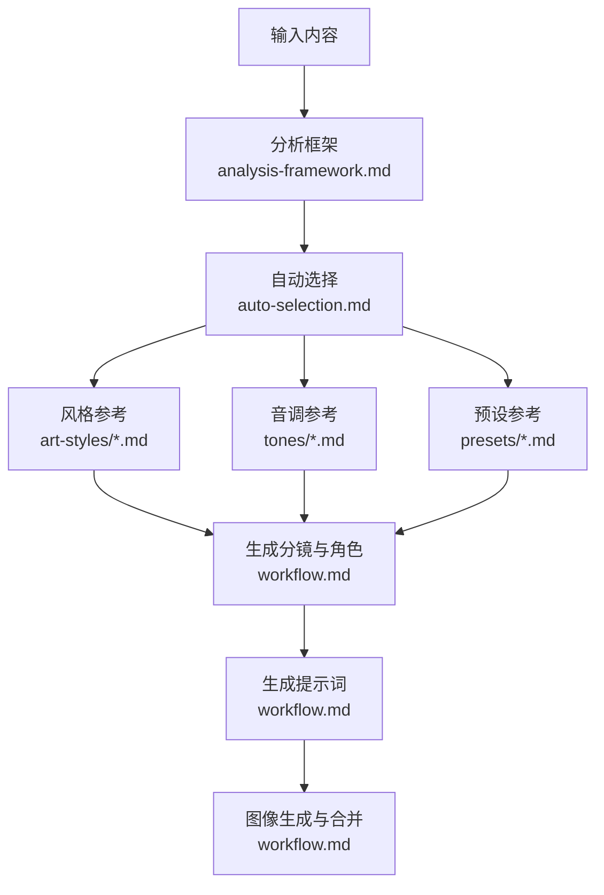
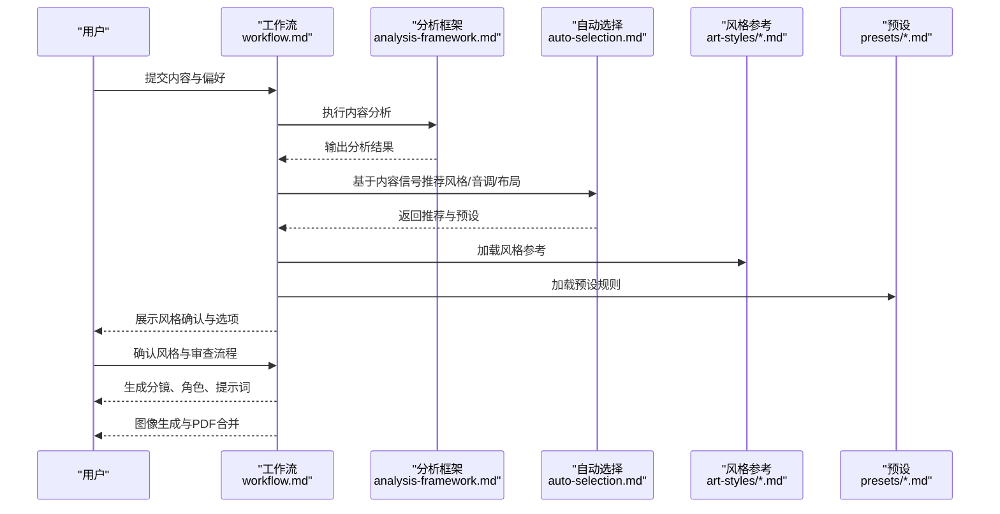
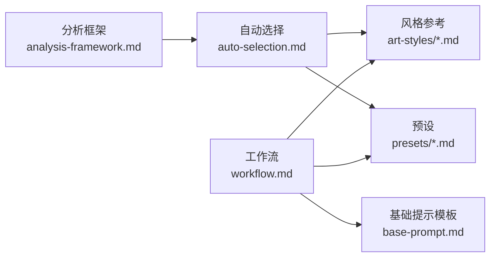

# 艺术风格系统

<cite>
**本文引用的文件**
- [ligne-claire.md](file://.agents/skills/baoyu-comic/references/art-styles/ligne-claire.md)
- [manga.md](file://.agents/skills/baoyu-comic/references/art-styles/manga.md)
- [realistic.md](file://.agents/skills/baoyu-comic/references/art-styles/realistic.md)
- [ink-brush.md](file://.agents/skills/baoyu-comic/references/art-styles/ink-brush.md)
- [chalk.md](file://.agents/skills/baoyu-comic/references/art-styles/chalk.md)
- [minimalist.md](file://.agents/skills/baoyu-comic/references/art-styles/minimalist.md)
- [workflow.md](file://.agents/skills/baoyu-comic/references/workflow.md)
- [auto-selection.md](file://.agents/skills/baoyu-comic/references/auto-selection.md)
- [base-prompt.md](file://.agents/skills/baoyu-comic/references/base-prompt.md)
- [analysis-framework.md](file://.agents/skills/baoyu-comic/references/analysis-framework.md)
- [ohmsha.md](file://.agents/skills/baoyu-comic/references/presets/ohmsha.md)
- [four-panel.md](file://.agents/skills/baoyu-comic/references/presets/four-panel.md)
- [concept-story.md](file://.agents/skills/baoyu-comic/references/presets/concept-story.md)
</cite>

## 目录
1. [简介](#简介)
2. [项目结构](#项目结构)
3. [核心组件](#核心组件)
4. [架构总览](#架构总览)
5. [详细组件分析](#详细组件分析)
6. [依赖关系分析](#依赖关系分析)
7. [性能考量](#性能考量)
8. [故障排查指南](#故障排查指南)
9. [结论](#结论)
10. [附录](#附录)

## 简介
本文件系统化梳理 baoyu-comic 的艺术风格体系，围绕六种核心风格（ligne-claire、manga、realistic、ink-brush、chalk、minimalist）展开，从技术特征、视觉效果、适用场景与创作要点入手，解释风格选择对叙事表达的影响，并提供风格与音调（tone）的匹配矩阵、自动推荐策略及工作流中的应用方式。文档同时给出每种风格的最佳实践与使用示例，帮助创作者在不同内容类型中做出更恰当的视觉决策。

## 项目结构
baoyu-comic 的艺术风格系统由“风格参考”“工作流”“自动选择”“预设”等模块构成，风格参考提供各风格的技术规范与质量标记；工作流定义从输入到输出的完整流程；自动选择基于内容信号推荐风格/音调/布局或预设；预设在基础风格之上增加叙事规则与角色设定。

图表来源
- [workflow.md:1-544](file://.agents/skills/baoyu-comic/references/workflow.md#L1-L544)
- [auto-selection.md:1-73](file://.agents/skills/baoyu-comic/references/auto-selection.md#L1-L73)
- [analysis-framework.md:1-177](file://.agents/skills/baoyu-comic/references/analysis-framework.md#L1-L177)

章节来源
- [workflow.md:1-544](file://.agents/skills/baoyu-comic/references/workflow.md#L1-L544)
- [auto-selection.md:1-73](file://.agents/skills/baoyu-comic/references/auto-selection.md#L1-L73)
- [analysis-framework.md:1-177](file://.agents/skills/baoyu-comic/references/analysis-framework.md#L1-L177)

## 核心组件
- 六大风格参考：每种风格包含线条、角色设计、背景处理、色彩方法、默认配色、质量标记、兼容性与适用场景等维度，形成可执行的视觉规范。
- 自动选择：依据内容信号（如教程、技术、历史、浪漫、业务等）推荐风格、音调与布局，必要时启用预设。
- 工作流：从偏好加载、内容分析、风格确认、分镜与角色生成、提示词审查、图像生成、PDF 合并到完成报告，形成闭环。
- 预设：在 manga 基础上扩展特定叙事规则（如 ohmsha 的“可视化隐喻+无对话头”、four-panel 的四格结构、concept-story 的概念符号系统）。

章节来源
- [ligne-claire.md:1-76](file://.agents/skills/baoyu-comic/references/art-styles/ligne-claire.md#L1-L76)
- [manga.md:1-94](file://.agents/skills/baoyu-comic/references/art-styles/manga.md#L1-L94)
- [realistic.md:1-90](file://.agents/skills/baoyu-comic/references/art-styles/realistic.md#L1-L90)
- [ink-brush.md:1-98](file://.agents/skills/baoyu-comic/references/art-styles/ink-brush.md#L1-L98)
- [chalk.md:1-102](file://.agents/skills/baoyu-comic/references/art-styles/chalk.md#L1-L102)
- [minimalist.md:1-85](file://.agents/skills/baoyu-comic/references/art-styles/minimalist.md#L1-L85)
- [auto-selection.md:1-73](file://.agents/skills/baoyu-comic/references/auto-selection.md#L1-L73)
- [workflow.md:1-544](file://.agents/skills/baoyu-comic/references/workflow.md#L1-L544)

## 架构总览
下图展示风格系统在工作流中的位置与交互：内容经分析后进入自动选择，再结合风格参考与预设生成分镜与提示词，最终驱动图像生成与成品输出。

图表来源
- [workflow.md:1-544](file://.agents/skills/baoyu-comic/references/workflow.md#L1-L544)
- [auto-selection.md:1-73](file://.agents/skills/baoyu-comic/references/auto-selection.md#L1-L73)
- [analysis-framework.md:1-177](file://.agents/skills/baoyu-comic/references/analysis-framework.md#L1-L177)

## 详细组件分析

### 清线风格（ligne-claire）
- 技术特点
  - 线条：统一粗细、干净利落，无晕染；阴影通过平面色块表现。
  - 角色：略带卡通化的写实比例，表情清晰，服装细节贴合时代背景。
  - 背景：写实且有考据，强调空间透视与环境叙事。
  - 色彩：平涂为主，强调画面情绪与光源一致性。
- 视觉效果
  - 时间感强、可读性强，适合教育与传记类内容。
- 适用场景
  - 教育类知识漫画、平衡叙事、人物传记、历史故事。
- 创作要点
  - 保持线宽一致与平面阴影逻辑；角色与背景反差明显；注意阅读顺序与面板边界。
- 风格兼容性
  - 中性、温暖、复古较佳；浪漫、动作较弱。
- 最佳实践
  - 使用默认配色表，确保页面内色调统一；在复杂场景中以细节背景强化叙事。
- 使用示例
  - 传记类知识漫画、历史事件还原、科学史人物故事。

章节来源
- [ligne-claire.md:1-76](file://.agents/skills/baoyu-comic/references/art-styles/ligne-claire.md#L1-L76)
- [auto-selection.md:52-66](file://.agents/skills/baoyu-comic/references/auto-selection.md#L52-L66)

### 日漫画风（manga）
- 技术特点
  - 线条：流畅、有变化，强调动感与速度线；屏幕色调营造氛围。
  - 角色：大眼、表情丰富、动态姿态；头发与服饰细节丰富。
  - 背景：对话/讲解时简化，场景建立时详尽；抽象背景用于情感时刻。
  - 色彩：明亮、柔和渐变，强调皮肤与光影过渡。
- 视觉效果
  - 表情与动作张力强，适合多题材。
- 适用场景
  - 教育类教程、浪漫、动作、成长故事、技术解释。
- 创作要点
  - 控制面板节奏与对话气泡；合理使用视觉元素（汗珠、爱心、火花等）；保持角色一致性。
- 风格兼容性
  - 中性、温暖、动感、动作皆可；复古较弱；浪漫与动作更佳。
- 最佳实践
  - 在技术解释中融入“可视化隐喻”（见预设），避免纯讲解式面板。
- 使用示例
  - 编程入门、AI 概念教学、校园恋爱故事。

章节来源
- [manga.md:1-94](file://.agents/skills/baoyu-comic/references/art-styles/manga.md#L1-L94)
- [auto-selection.md:52-66](file://.agents/skills/baoyu-comic/references/auto-selection.md#L52-L66)

### 写实风格（realistic）
- 技术特点
  - 线条：清晰轮廓，不强调晕染；依靠色彩表现体积与质感。
  - 角色：真实人体比例，表情细腻自然，姿态符合解剖学。
  - 渲染：丰富的渐变与材质表现，环境光贯穿全局。
  - 背景：高度写实，空间与光照准确。
  - 色彩：暖冷对比、材料特异性与微妙色温变化。
- 视觉效果
  - 成熟、专业、富有层次，适合成年读者与深度主题。
- 适用场景
  - 生活方式、专业话题（美食、酒类、商业）、纪录片式叙述、成人向故事。
- 创作要点
  - 注重光影与材质细节；保持角色表情的内敛与真实；背景服务于叙事而非喧宾夺主。
- 风格兼容性
  - 中性、温暖、戏剧化、复古较佳；浪漫、动感较弱。
- 最佳实践
  - 在人物与环境间建立一致的光源逻辑；用色彩温度传达情绪。
- 使用示例
  - 商业案例解析、美食文化、人物访谈改编。

章节来源
- [realistic.md:1-90](file://.agents/skills/baoyu-comic/references/art-styles/realistic.md#L1-L90)
- [auto-selection.md:52-66](file://.agents/skills/baoyu-comic/references/auto-selection.md#L52-L66)

### 水墨风格（ink-brush）
- 技术特点
  - 线条：毛笔笔触，有压力变化，强调流动感；墨晕渲染营造氛围。
  - 角色：写实比例，动态捕捉，传统服饰可选。
  - 背景：山水、寺庙、瀑布等意象，留白与负空间构成重要设计元素。
  - 色彩：墨色渐变与有限色点缀，强调高对比与意境。
- 视觉效果
  - 古雅、大气、富有东方美学韵味。
- 适用场景
  - 武侠、历史、传统故事、沉思型叙事、艺术化改编。
- 创作要点
  - 控制墨色层次与留白；角色与背景的对比关系；传统元素的适度运用。
- 风格兼容性
  - 中性、戏剧化、复古较佳；浪漫、动感较弱。
- 最佳实践
  - 将动作与衣饰的流动感结合，突出武术或传统场景的张力。
- 使用示例
  - 武侠小说节选、传统文化传播、禅意短篇。

章节来源
- [ink-brush.md:1-98](file://.agents/skills/baoyu-comic/references/art-styles/ink-brush.md#L1-L98)
- [auto-selection.md:52-66](file://.agents/skills/baoyu-comic/references/auto-selection.md#L52-L66)

### 粉笔风格（chalk）
- 技术特点
  - 线条：手绘不完美、粉笔质感、压力变化；边缘柔和。
  - 角色：简化友好，强调简单手势与表情。
  - 背景：黑板纹理、划痕与粉尘颗粒，可选木框边框。
  - 字体：手写粉笔字，基线不齐，强调“手工感”。
  - 视觉元素：粉笔灰、数学公式、简笔图标、连接线。
- 视觉效果
  - 怀旧、亲切、课堂感强，适合知识传递。
- 适用场景
  - 教学、通识课程、工作坊、非正式学习材料。
- 创作要点
  - 保持整体“手绘不完美”的一致性；颜色层次清晰但不过度装饰。
- 风格兼容性
  - 中性、温暖、动感较佳；戏剧化、动作、浪漫较弱。
- 最佳实践
  - 用颜色与简笔元素构建信息层级，避免过度写实破坏氛围。
- 使用示例
  - 数学/物理课堂、思维导图、知识卡片。

章节来源
- [chalk.md:1-102](file://.agents/skills/baoyu-comic/references/art-styles/chalk.md#L1-L102)
- [auto-selection.md:52-66](file://.agents/skills/baoyu-comic/references/auto-selection.md#L52-L66)

### 极简风格（minimalist）
- 技术特点
  - 线条：干净均匀的黑色线条，无晕染；极简细节。
  - 角色：近似“火柴人”，仅靠道具区分；通过姿态与构图表达情绪。
  - 背景：大量留白，概念标签与图标替代环境；无透视。
  - 色彩：黑白色为主，少量强调色用于关键对象或标签。
- 视觉效果
  - 强信息密度、高可读性、快速理解。
- 适用场景
  - 商业寓言、管理短评、四格漫画、社交媒体内容、概念图解。
- 创作要点
  - 每一条线都有目的；强调“重点”而非“细节”；文本标签自然融入画面。
- 风格兼容性
  - 中性较佳；温暖、动感尚可；戏剧化、复古、浪漫、动作不适用。
- 最佳实践
  - 使用四格“起承转合”结构，转结（第三格）强调“顿悟/对比”。
- 使用示例
  - 管理理念短片、职场幽默、知识速递。

章节来源
- [minimalist.md:1-85](file://.agents/skills/baoyu-comic/references/art-styles/minimalist.md#L1-L85)
- [four-panel.md:1-108](file://.agents/skills/baoyu-comic/references/presets/four-panel.md#L1-L108)
- [auto-selection.md:52-66](file://.agents/skills/baoyu-comic/references/auto-selection.md#L52-L66)

### 风格选择与内容表达的关系
- 不同风格承载不同的情绪与认知负荷：清线与写实偏向理性与客观，漫画与水墨偏向情感与意境，粉笔与极简偏向高效与直接。
- 选择应考虑目标受众、主题深度与传播渠道。例如：学术/专业内容倾向清线与写实；青少年/娱乐内容倾向漫画；知识快消内容倾向极简与粉笔。
- 自动选择会根据内容信号（教程、技术、历史、浪漫、业务等）优先推荐风格/音调/布局或预设，必要时启用 ohmsha、four-panel 或 concept-story 等预设以强化叙事。

章节来源
- [auto-selection.md:1-73](file://.agents/skills/baoyu-comic/references/auto-selection.md#L1-L73)
- [analysis-framework.md:1-177](file://.agents/skills/baoyu-comic/references/analysis-framework.md#L1-L177)

### 工作流中的风格应用
- 偏好加载与分析：读取 EXTEND.md，进行内容语言检测与页数估算，输出分析摘要。
- 风格确认：显示推荐风格/音调/布局，支持预设（如 ohmsha、four-panel、concept-story）。
- 分镜与角色：按风格参考与预设规则生成分镜、角色设定与参考提示。
- 提示词生成：整合风格与音调指南，加入角色描述与面板分解，按需添加水印说明。
- 图像生成与合并：按策略选择参考图或内嵌描述，生成封面与各页图像，最后合并为 PDF。

章节来源
- [workflow.md:1-544](file://.agents/skills/baoyu-comic/references/workflow.md#L1-L544)
- [base-prompt.md:1-99](file://.agents/skills/baoyu-comic/references/base-prompt.md#L1-L99)

## 依赖关系分析
- 风格参考与自动选择：自动选择依赖内容信号矩阵与兼容性矩阵，决定风格/音调/布局或预设。
- 预设与风格：预设在基础风格之上增加叙事规则（如 ohmsha 的可视化隐喻、four-panel 的四格结构、concept-story 的符号系统）。
- 工作流与风格：工作流在生成分镜、角色与提示词时读取风格参考与预设，保证输出的一致性与可执行性。

图表来源
- [auto-selection.md:1-73](file://.agents/skills/baoyu-comic/references/auto-selection.md#L1-L73)
- [workflow.md:1-544](file://.agents/skills/baoyu-comic/references/workflow.md#L1-L544)
- [base-prompt.md:1-99](file://.agents/skills/baoyu-comic/references/base-prompt.md#L1-L99)
- [analysis-framework.md:1-177](file://.agents/skills/baoyu-comic/references/analysis-framework.md#L1-L177)

章节来源
- [auto-selection.md:1-73](file://.agents/skills/baoyu-comic/references/auto-selection.md#L1-L73)
- [workflow.md:1-544](file://.agents/skills/baoyu-comic/references/workflow.md#L1-L544)
- [analysis-framework.md:1-177](file://.agents/skills/baoyu-comic/references/analysis-framework.md#L1-L177)

## 性能考量
- 图像生成阶段的提示词长度与风格复杂度直接影响生成时间与质量。建议：
  - 在风格与预设明确的前提下，尽量复用角色参考与面板分解，减少重复描述。
  - 对于需要参考图的技能，优先采用压缩后的参考图以降低传输开销。
  - 使用策略 A（参考图 + 每页提示）时，若失败则回退至策略 C（内嵌描述），以保证稳定性。
- 合理选择布局与面板数量，避免过多细节导致生成负担。

章节来源
- [workflow.md:411-503](file://.agents/skills/baoyu-comic/references/workflow.md#L411-L503)

## 故障排查指南
- 风格与音调不匹配
  - 现象：生成画面与预期情绪不符。
  - 排查：查看兼容性矩阵，调整音调或改用其他风格。
- 预设规则未生效
  - 现象：ohmsha 出现“对话头”、four-panel 面板数不符、concept-story 符号缺失。
  - 排查：确认是否正确选择了对应预设；核对预设规则与分镜/角色生成结果。
- 提示词过长或信息不足
  - 现象：生成偏差或角色不一致。
  - 排查：检查角色参考是否随预设更新；在策略 B/C 中确保角色描述完整。
- 参考图问题
  - 现象：使用 --ref 失败或质量不佳。
  - 排查：压缩/转换参考图尺寸与格式；必要时回退至内嵌描述。

章节来源
- [auto-selection.md:52-66](file://.agents/skills/baoyu-comic/references/auto-selection.md#L52-L66)
- [ohmsha.md:1-115](file://.agents/skills/baoyu-comic/references/presets/ohmsha.md#L1-L115)
- [four-panel.md:1-108](file://.agents/skills/baoyu-comic/references/presets/four-panel.md#L1-L108)
- [concept-story.md:1-122](file://.agents/skills/baoyu-comic/references/presets/concept-story.md#L1-L122)
- [workflow.md:435-503](file://.agents/skills/baoyu-comic/references/workflow.md#L435-L503)

## 结论
baoyu-comic 的艺术风格系统通过“风格参考 + 自动选择 + 预设 + 工作流”的协同，为不同内容提供了可执行的视觉方案。创作者可根据内容性质与受众选择合适风格，并借助预设强化叙事结构与符号系统。遵循风格规范与工作流步骤，可在保证一致性的同时提升产出效率与表达精度。

## 附录

### 风格与音调兼容性速查
- 清线：中性、温暖、复古较佳；浪漫、动作较弱
- 漫画：中性、浪漫、动感、动作皆可；复古较弱
- 写实：中性、温暖、戏剧化、复古较佳；浪漫、动感较弱
- 水墨：中性、戏剧化、动作、复古较佳；浪漫、动感较弱
- 粉笔：中性、温暖、动感较佳；戏剧化、动作、浪漫较弱
- 极简：中性较佳；温暖、动感尚可；戏剧化、复古、浪漫、动作不适用

章节来源
- [auto-selection.md:52-66](file://.agents/skills/baoyu-comic/references/auto-selection.md#L52-L66)

### 预设规则概览
- ohmsha：以可视化隐喻解释技术概念，禁止“对话头”，默认使用哆啦A梦角色体系，强调“学生—导师—挑战—支持”的角色动态。
- four-panel：严格四格“起承转合”结构，单页完整故事，黑白色主线+1-2强调色，角色为简化“火柴人”。
- concept-story：通过“概念符号系统”串联故事，强调对话与视觉隐喻并重，要求五幕成长弧与最终整合。

章节来源
- [ohmsha.md:1-115](file://.agents/skills/baoyu-comic/references/presets/ohmsha.md#L1-L115)
- [four-panel.md:1-108](file://.agents/skills/baoyu-comic/references/presets/four-panel.md#L1-L108)
- [concept-story.md:1-122](file://.agents/skills/baoyu-comic/references/presets/concept-story.md#L1-L122)