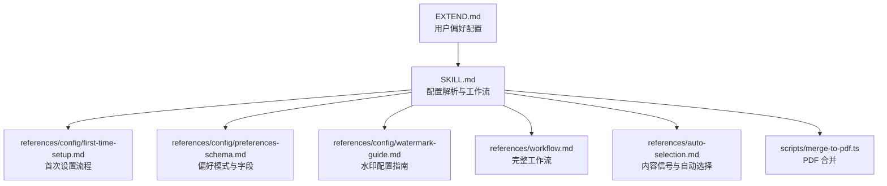
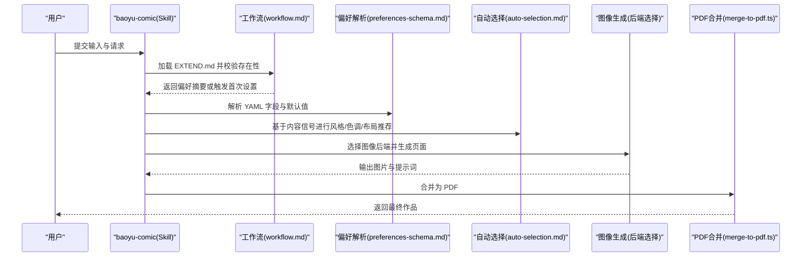
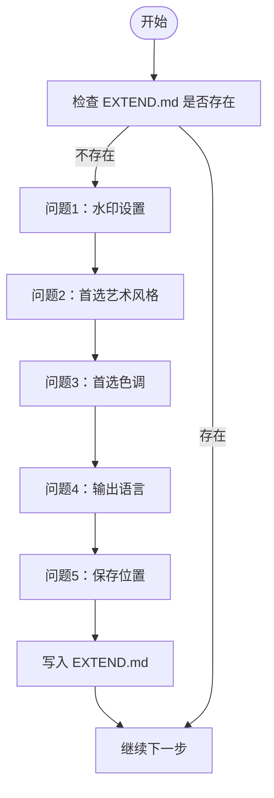
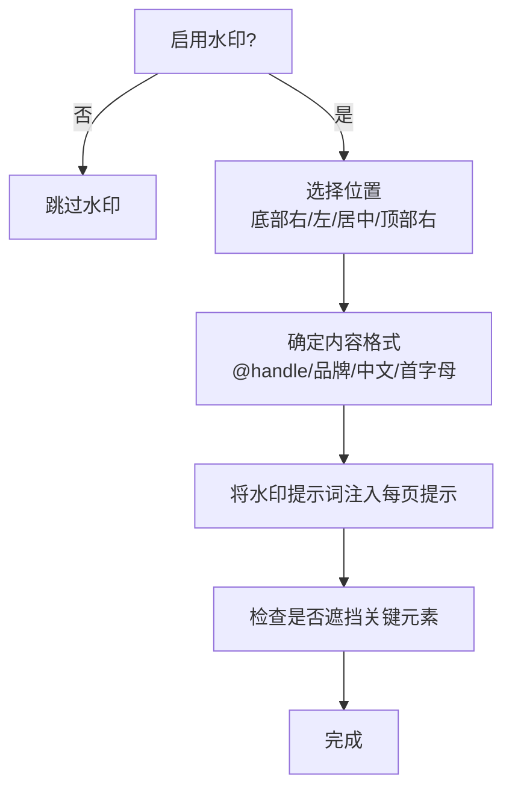
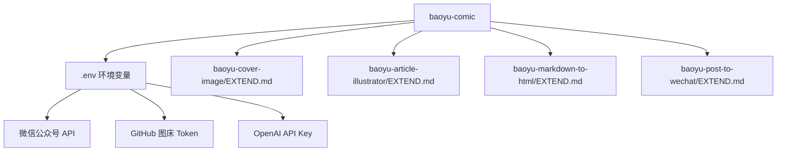

# 配置管理系统

<cite>
**本文引用的文件**
- [EXTEND.md](file://.agents/skills/wechat-article-write/EXTEND.md)
- [SKILL.md](file://.agents/skills/baoyu-comic/SKILL.md)
- [first-time-setup.md](file://.agents/skills/baoyu-comic/references/config/first-time-setup.md)
- [preferences-schema.md](file://.agents/skills/baoyu-comic/references/config/preferences-schema.md)
- [watermark-guide.md](file://.agents/skills/baoyu-comic/references/config/watermark-guide.md)
- [workflow.md](file://.agents/skills/baoyu-comic/references/workflow.md)
- [auto-selection.md](file://.agents/skills/baoyu-comic/references/auto-selection.md)
- [merge-to-pdf.ts](file://.agents/skills/baoyu-comic/scripts/merge-to-pdf.ts)
- [preferences-schema.md (baoyu-imagine)](file://.agents/skills/baoyu-imagine/references/config/preferences-schema.md)
- [preferences-schema.md (baoyu-cover-image)](file://.agents/skills/baoyu-cover-image/references/config/preferences-schema.md)
</cite>

## 目录
1. [简介](#简介)
2. [项目结构](#项目结构)
3. [核心组件](#核心组件)
4. [架构总览](#架构总览)
5. [详细组件分析](#详细组件分析)
6. [依赖关系分析](#依赖关系分析)
7. [性能考量](#性能考量)
8. [故障排除指南](#故障排除指南)
9. [结论](#结论)
10. [附录](#附录)

## 简介
本文件面向 baoyu-comic 配置管理系统，系统性阐述 EXTEND.md 配置文件的结构与用法，覆盖首次设置流程、偏好设置模式、水印配置指南，并详解配置项（首选图像后端、艺术风格偏好、色调偏好、布局偏好、语言设置等）。文档同时解释配置的优先级机制与作用范围，给出优化创作体验的建议、最佳实践与故障排除方法。

## 项目结构
baoyu-comic 的配置体系围绕 EXTEND.md 展开，配合一系列参考文档与工作流规范，形成“首次设置 → 偏好加载 → 自动选择 → 生成与合并”的闭环。关键文件与职责如下：
- EXTEND.md：用户偏好的 YAML 存储，决定水印、艺术风格、色调、布局、语言、图像后端等。
- SKILL.md：技能主文档，定义配置解析顺序、图像后端选择策略、语言处理优先级、工作流步骤与文件结构。
- references/config/*：配置参考与指南，包括首次设置、偏好模式、水印配置等。
- references/*：风格、色调、布局、预设等参考定义，用于指导自动选择与内容适配。
- scripts/merge-to-pdf.ts：输出阶段的 PDF 合并脚本，受配置影响（如页面数量、命名规则）。

图表来源
- [SKILL.md: 1-317:1-317](file://.agents/skills/baoyu-comic/SKILL.md#L1-L317)
- [first-time-setup.md: 1-155:1-155](file://.agents/skills/baoyu-comic/references/config/first-time-setup.md#L1-L155)
- [preferences-schema.md: 1-162:1-162](file://.agents/skills/baoyu-comic/references/config/preferences-schema.md#L1-L162)
- [watermark-guide.md: 1-67:1-67](file://.agents/skills/baoyu-comic/references/config/watermark-guide.md#L1-L67)
- [workflow.md: 1-544:1-544](file://.agents/skills/baoyu-comic/references/workflow.md#L1-L544)
- [auto-selection.md: 1-73:1-73](file://.agents/skills/baoyu-comic/references/auto-selection.md#L1-L73)
- [merge-to-pdf.ts](file://.agents/skills/baoyu-comic/scripts/merge-to-pdf.ts)

章节来源
- [SKILL.md: 169-317:169-317](file://.agents/skills/baoyu-comic/SKILL.md#L169-L317)

## 核心组件
- 配置文件 EXTEND.md：YAML 结构，包含版本号、水印、艺术风格、色调、布局、宽高比、语言、图像后端、角色预设等字段。
- 首次设置流程：引导用户完成水印、艺术风格、色调、语言与保存位置的选择，并写入 EXTEND.md。
- 偏好模式与字段：定义各字段类型、默认值、取值范围与用途。
- 水印配置：位置、内容格式、提示词集成与常见问题。
- 图像后端选择：运行时原生工具优先、回退策略与交互确认。
- 工作流与自动选择：基于内容信号的风格/色调/布局推荐，以及语言处理优先级。

章节来源
- [preferences-schema.md: 8-36:8-36](file://.agents/skills/baoyu-comic/references/config/preferences-schema.md#L8-L36)
- [first-time-setup.md: 40-155:40-155](file://.agents/skills/baoyu-comic/references/config/first-time-setup.md#L40-L155)
- [watermark-guide.md: 6-67:6-67](file://.agents/skills/baoyu-comic/references/config/watermark-guide.md#L6-L67)
- [SKILL.md: 28-45:28-45](file://.agents/skills/baoyu-comic/SKILL.md#L28-L45)

## 架构总览
下图展示 baoyu-comic 在生成流程中对 EXTEND.md 的读取、解析与应用：

图表来源
- [workflow.md: 35-87:35-87](file://.agents/skills/baoyu-comic/references/workflow.md#L35-L87)
- [preferences-schema.md: 8-36:8-36](file://.agents/skills/baoyu-comic/references/config/preferences-schema.md#L8-L36)
- [auto-selection.md: 1-73:1-73](file://.agents/skills/baoyu-comic/references/auto-selection.md#L1-L73)
- [merge-to-pdf.ts](file://.agents/skills/baoyu-comic/scripts/merge-to-pdf.ts)

## 详细组件分析

### EXTEND.md 配置文件结构与字段
EXTEND.md 采用 YAML 前言（frontmatter）形式，包含以下关键字段：
- 版本号：用于兼容与迁移。
- 水印：启用开关、内容文本、位置、透明度等。
- 首选艺术风格：支持多风格，null 表示自动选择。
- 首选色调：支持多种情绪氛围，null 表示自动选择。
- 首选布局：标准、电影式、密集、全页、混合、网络漫画、四格等。
- 首选宽高比：3:4、4:3、16:9。
- 语言：zh/en/ja/ko/auto。
- 首选图像后端：auto/ask/后端标识；auto 表示优先运行时原生工具，ask 表示每次询问。
- 角色预设：角色角色名与身份描述，便于特定预设复用。

章节来源
- [preferences-schema.md: 10-36:10-36](file://.agents/skills/baoyu-comic/references/config/preferences-schema.md#L10-L36)
- [preferences-schema.md: 40-52:40-52](file://.agents/skills/baoyu-comic/references/config/preferences-schema.md#L40-L52)

### 首次设置流程（First-Time Setup）
首次运行且未检测到 EXTEND.md 时，系统会引导用户完成以下步骤：
- 水印：可选择无水印或自定义内容，默认底部右下角。
- 首选艺术风格：可自动选择或手动选择风格。
- 首选色调：可自动选择或手动选择。
- 语言：可自动检测或指定 zh/en。
- 保存位置：项目内或用户全局目录，二者具有不同作用域。

完成后写入 EXTEND.md，随后进入正式工作流。

图表来源
- [first-time-setup.md: 20-38:20-38](file://.agents/skills/baoyu-comic/references/config/first-time-setup.md#L20-L38)
- [first-time-setup.md: 130-148:130-148](file://.agents/skills/baoyu-comic/references/config/first-time-setup.md#L130-L148)

章节来源
- [first-time-setup.md: 10-18:10-18](file://.agents/skills/baoyu-comic/references/config/first-time-setup.md#L10-L18)
- [first-time-setup.md: 116-128:116-128](file://.agents/skills/baoyu-comic/references/config/first-time-setup.md#L116-L128)

### 偏好设置模式与字段参考
- 水印：支持启用/禁用、内容、位置（底部右/左/居中、顶部右）、透明度。
- 艺术风格：ligne-claire、manga、realistic、ink-brush、chalk、minimalist。
- 色调：neutral、warm、dramatic、romantic、energetic、vintage、action。
- 布局：standard、cinematic、dense、splash、mixed、webtoon、four-panel。
- 宽高比：3:4、4:3、16:9。
- 语言：zh、en、ja、ko、auto。
- 图像后端：auto、ask 或具体后端标识；auto 逻辑见 SKILL.md 的“图像生成工具”章节。
- 角色预设：name 与 roles（learner、mentor、challenge、support）。

章节来源
- [preferences-schema.md: 14-36:14-36](file://.agents/skills/baoyu-comic/references/config/preferences-schema.md#L14-L36)
- [preferences-schema.md: 54-76:54-76](file://.agents/skills/baoyu-comic/references/config/preferences-schema.md#L54-L76)
- [preferences-schema.md: 65-76:65-76](file://.agents/skills/baoyu-comic/references/config/preferences-schema.md#L65-L76)
- [preferences-schema.md: 77-85:77-85](file://.agents/skills/baoyu-comic/references/config/preferences-schema.md#L77-L85)
- [preferences-schema.md: 86-95:86-95](file://.agents/skills/baoyu-comic/references/config/preferences-schema.md#L86-L95)

### 水印配置指南
- 位置建议：底部右/左/居中较常用；避免顶部右（与页码冲突）。
- 内容格式：@用户名、品牌名称、中文、首字母等。
- 最佳实践：面板意识放置、一致性、适度大小、风格匹配、网络漫画使用底部居中。
- 提示词集成：当启用水印时，将水印信息加入每页提示词，确保不遮挡对话气泡与关键动作。
- 常见问题：暗色面板不可见、重叠对话气泡、跨页不一致、过于显眼、与页码冲突。

图表来源
- [watermark-guide.md: 8-30:8-30](file://.agents/skills/baoyu-comic/references/config/watermark-guide.md#L8-L30)
- [watermark-guide.md: 48-67:48-67](file://.agents/skills/baoyu-comic/references/config/watermark-guide.md#L48-L67)

章节来源
- [watermark-guide.md: 31-47:31-47](file://.agents/skills/baoyu-comic/references/config/watermark-guide.md#L31-L47)

### 图像后端选择与优先级
- 请求级覆盖：当前消息中指定的后端优先。
- 已保存偏好：若 EXTEND.md 中指定了可用后端，则使用该后端。
- 自动选择：优先运行时原生工具；否则若仅安装一个非原生后端则使用之；若存在多个非原生后端则一次性询问用户。
- 强制确认：preferred_image_backend: ask 将在每次运行时强制提示。

章节来源
- [SKILL.md: 28-45:28-45](file://.agents/skills/baoyu-comic/SKILL.md#L28-L45)

### 语言设置与处理优先级
- 优先级顺序：命令行 --lang → EXTEND.md language → 用户对话语言 → 源内容语言。
- 交互语言：所有与用户交互的内容均使用用户输入语言或已保存的语言偏好。

章节来源
- [SKILL.md: 153-168:153-168](file://.agents/skills/baoyu-comic/SKILL.md#L153-L168)

### 自动选择与内容信号
- 内容信号矩阵：根据教程、技术、个人故事、心理、业务、浪漫、武侠等信号，推荐对应的艺术风格、色调、布局或预设。
- 兼容性矩阵：不同艺术风格与色调组合的适用性，帮助规避不协调搭配。
- 优先顺序：用户指定选项 > EXTEND.md 默认 > 内容信号分析 > 回退组合。

章节来源
- [auto-selection.md: 5-73:5-73](file://.agents/skills/baoyu-comic/references/auto-selection.md#L5-L73)

### 配置文件作用范围与路径
- 查找优先级：项目内 .baoyu-skills/baoyu-comic/EXTEND.md > 用户家目录 ~/.baoyu-skills/baoyu-comic/EXTEND.md。
- 影响范围：一旦存在，水印、语言、风格默认在本次会话中不再重复询问；适合长期稳定的创作流程。

章节来源
- [SKILL.md: 243-256:243-256](file://.agents/skills/baoyu-comic/SKILL.md#L243-L256)
- [workflow.md: 35-87:35-87](file://.agents/skills/baoyu-comic/references/workflow.md#L35-L87)

### PDF 合并与输出
- 使用 merge-to-pdf.ts 将生成的页面合并为 PDF，命名规则与输出目录遵循技能约定。

章节来源
- [merge-to-pdf.ts](file://.agents/skills/baoyu-comic/scripts/merge-to-pdf.ts)

## 依赖关系分析
baoyu-comic 的配置系统与其他技能存在间接依赖关系，主要体现在环境变量与依赖技能的 EXTEND.md 配置要求上：
- wechat-article-write 依赖技能的 EXTEND.md 配置项（如 quick_mode、default_publish_method），并要求相应的环境变量（如微信公众号 API、GitHub Token、OpenAI API Key）。
- baoyu-cover-image、baoyu-article-illustrator、baoyu-markdown-to-html、baoyu-post-to-wechat 等技能各自维护其 EXTEND.md 的字段与默认值，但 baoyu-comic 在工作流中并不直接读取它们的 EXTEND.md，而是通过环境变量与后端选择策略协同工作。

图表来源
- [.agents/skills/wechat-article-write/EXTEND.md: 29-61:29-61](file://.agents/skills/wechat-article-write/EXTEND.md#L29-L61)
- [preferences-schema.md (baoyu-cover-image): 10-47:10-47](file://.agents/skills/baoyu-cover-image/references/config/preferences-schema.md#L10-L47)
- [preferences-schema.md (baoyu-imagine): 10-62:10-62](file://.agents/skills/baoyu-imagine/references/config/preferences-schema.md#L10-L62)

章节来源
- [.agents/skills/wechat-article-write/EXTEND.md: 29-61:29-61](file://.agents/skills/wechat-article-write/EXTEND.md#L29-L61)

## 性能考量
- 图像生成耗时：每页约 10-30 秒，失败时自动重试一次。
- 参考图像优化：使用压缩后的角色参考图作为 --ref 参数，可显著降低负载失败风险。
- 会话一致性：使用会话 ID 维持风格一致性，减少跨页差异。
- 逐步审查：通过“大纲审查”“提示词审查”减少不必要的重生成，提升效率。

章节来源
- [SKILL.md: 294-303:294-303](file://.agents/skills/baoyu-comic/SKILL.md#L294-L303)
- [workflow.md: 435-497:435-497](file://.agents/skills/baoyu-comic/references/workflow.md#L435-L497)

## 故障排除指南
- 水印不可见或遮挡：调整对比度/描边、改变位置、降低透明度；避免放在底部右（与页码冲突）。
- 跨页不一致：使用会话 ID 保持风格一致；必要时固定图像后端。
- 参考图像失败：压缩/转换参考图后再试；若仍失败，改为在提示词中嵌入角色描述。
- 语言不一致：在 EXTEND.md 中明确 language 字段，避免自动检测偏差。
- 后端不可用：preferred_image_backend 设为 ask，或切换到已安装的后端；或使用运行时原生工具。

章节来源
- [watermark-guide.md: 58-67:58-67](file://.agents/skills/baoyu-comic/references/config/watermark-guide.md#L58-L67)
- [workflow.md: 460-467:460-467](file://.agents/skills/baoyu-comic/references/workflow.md#L460-L467)
- [SKILL.md: 294-303:294-303](file://.agents/skills/baoyu-comic/SKILL.md#L294-L303)

## 结论
baoyu-comic 的配置系统以 EXTEND.md 为核心，结合首次设置、偏好模式、自动选择与后端策略，形成稳定高效的创作流程。通过合理配置水印、风格、色调、布局与语言，可显著提升产出质量与一致性；借助自动选择与审查机制，可在保证创意自由的同时控制成本与时间。建议在团队协作场景中统一 EXTEND.md 的语言与风格偏好，并在 CI/CD 场景中固定图像后端以确保可重现性。

## 附录
- 配置模板与示例：参考偏好模式中的最小化与完整示例，按需增删字段。
- 迁移指南：从旧版本偏好文件迁移时，注意字段映射与默认值变化。
- 环境变量：确保 .env 中包含所需 API 密钥与令牌，以便相关技能正常运行。

章节来源
- [preferences-schema.md: 96-144:96-144](file://.agents/skills/baoyu-comic/references/config/preferences-schema.md#L96-L144)
- [preferences-schema.md: 146-162:146-162](file://.agents/skills/baoyu-comic/references/config/preferences-schema.md#L146-L162)
- [.agents/skills/wechat-article-write/EXTEND.md: 40-61:40-61](file://.agents/skills/wechat-article-write/EXTEND.md#L40-L61)